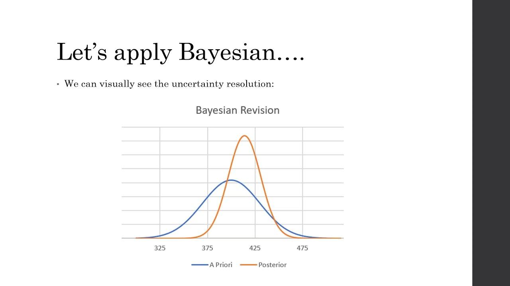

## Table of Contents

## What is Bayesian inference and how does it apply to trading?

Bayesian inference is a way of updating our beliefs based on new evidence. It uses something called Bayes' theorem, which helps us figure out how likely something is to be true after we see new information. Imagine you have a guess about something, and then you get new data. Bayesian inference lets you combine your old guess with the new data to make a better, updated guess.

In trading, Bayesian inference can be really useful. Traders often have to make decisions based on incomplete information, like predicting stock prices. They can use Bayesian methods to update their predictions as new market data comes in. For example, if a trader thinks a stock will go up, but then sees bad news about the company, they can use Bayesian inference to adjust their prediction. This helps traders make smarter decisions by constantly refining their understanding of the market.

## How can Bayesian methods help in making trading decisions?

Bayesian methods help traders by letting them update their predictions about the market as they get new information. Imagine you think a stock will go up because of good news. But then, new data comes in, like a bad earnings report. With Bayesian methods, you can take your old guess and the new data, and come up with a better prediction. This means you're always using the most up-to-date information to make your trading decisions.

This approach is really helpful because the stock market is always changing. Traders can use Bayesian methods to adjust their strategies quickly. For example, if a trader sees a pattern in the market, they can use Bayesian inference to figure out how likely that pattern will keep happening. By doing this, traders can make smarter choices about when to buy or sell, helping them to manage risk and maybe even make more money.

## What are the basic principles of probability that underpin Bayesian inference in trading?

The basic principles of probability that underpin Bayesian inference in trading are all about understanding how likely something is to happen and updating those guesses with new information. In trading, you start with a belief or a guess about what might happen to a stock's price. This is called the prior probability. It's like your starting point, based on what you know before any new data comes in. For example, if a company has been doing well, you might think its stock price will keep going up.

Then, as you get new information, like a news report or earnings data, you use this to update your guess. This is where the principle of conditional probability comes in. It helps you figure out how much the new information should change your original guess. You combine your prior probability with the new data to get a new, updated probability, called the posterior probability. This updated guess helps you make better trading decisions because it takes into account everything you know up to that point. So, in trading, Bayesian inference is all about constantly refining your predictions as you learn more about the market.

## Can you explain the concept of prior and posterior probabilities in the context of trading?

In trading, a prior probability is your starting guess about what might happen to a stock's price. It's based on what you know before any new information comes in. For example, if a company has been doing well, you might think its stock price will keep going up. This is your initial belief, and it's important because it sets the stage for how you'll interpret new information.

When new information arrives, like a news report or earnings data, you update your guess. This updated guess is called the posterior probability. It's like your new belief after taking into account the new information. For example, if you thought a stock would go up but then you see a bad earnings report, your posterior probability would reflect a lower chance of the stock price increasing. By constantly updating your beliefs with new data, you can make better trading decisions that are based on the most current information.

## How do you update beliefs about market conditions using Bayesian inference?

Updating beliefs about market conditions using Bayesian inference starts with your initial guess, called the prior probability. Imagine you think a stock will go up because the company has been doing well. This is your starting point, based on what you know before anything new happens. In trading, this could be your belief about the market trend or a specific stock's performance.

When new information comes in, like a news report or earnings data, you use it to update your guess. This is where Bayesian inference helps. You combine your initial guess with the new information to get a new belief, called the posterior probability. For example, if you see a bad earnings report for the company, you might adjust your belief to think the stock is less likely to go up. By doing this, you keep your trading decisions fresh and based on the latest information, helping you make smarter choices in the ever-changing market.

## What are some common Bayesian models used in trading?

One common Bayesian model used in trading is the Kalman Filter. It's like a tool that helps traders predict future stock prices by constantly updating their guesses as new data comes in. Imagine you're trying to guess where a stock price will go next. The Kalman Filter takes your old guess and the new price data to give you a better, updated guess. It's really useful because it can handle noisy or incomplete data, which is common in the stock market.

Another model is the Bayesian Network. This model helps traders understand how different things in the market are connected. For example, it can show how stock prices might be affected by interest rates, company earnings, or even world events. By using a Bayesian Network, traders can see the big picture and make better predictions about how changes in one part of the market might affect other parts. It's like a map that helps traders navigate through the complex world of trading.

## How can Bayesian inference be used to estimate the probability of a trade being successful?

Bayesian inference helps traders figure out how likely a trade will be successful by starting with a guess and then updating it with new information. Imagine you think a stock will go up because the company has been doing well. This is your starting guess, called the prior probability. As new information comes in, like a news report or earnings data, you use Bayesian inference to update your guess. This updated guess is called the posterior probability. It's like taking your old guess and making it better with the new data you've got.

For example, if you see a good earnings report, your belief that the stock will go up gets stronger. But if there's bad news, like a lawsuit against the company, your belief might change to think the stock is less likely to go up. By constantly updating your guesses with new information, you can get a better idea of how likely your trade will be successful. This helps you make smarter trading decisions because you're always using the most up-to-date information about the market.

## What are the advantages of using Bayesian methods over traditional statistical methods in trading?

Bayesian methods have some big advantages over traditional statistical methods in trading. One of the main benefits is that Bayesian methods let you update your guesses about the market all the time. As new information comes in, like news or earnings reports, you can change your predictions to be more accurate. This is really helpful in the stock market because things are always changing. Traditional methods might not be as good at this because they often rely on fixed data and don't update as easily.

Another advantage is that Bayesian methods can handle uncertainty better. The stock market is full of surprises and incomplete information. Bayesian methods let you work with this uncertainty by constantly refining your predictions. Traditional methods might give you a yes or no answer, but Bayesian methods give you a range of possibilities and how likely each one is. This helps traders make smarter decisions by understanding the risks and chances of different outcomes.

## How do you handle model uncertainty in Bayesian trading models?

Handling model uncertainty in Bayesian trading models means dealing with the fact that your model might not be perfect. In trading, you're always working with guesses about what might happen next. Bayesian methods help by letting you update your guesses as new information comes in. But even with these updates, there's still a chance your model might be wrong. To handle this, you can use something called Bayesian model averaging. This means you don't just rely on one model. Instead, you consider several different models and weigh their predictions based on how well they've done in the past. It's like getting a second or third opinion before making a big decision.

Another way to handle model uncertainty is by using a technique called hierarchical Bayesian models. These models let you add layers of guesses about the guesses. Imagine you're not just guessing about the stock price, but also about how reliable your guesses are. This helps you understand the uncertainty in your model better. By using these methods, you can make your trading decisions more robust. You're not just sticking with one model's prediction; you're considering a range of possibilities and how likely each one is. This can help you manage risk better and make more informed choices in the fast-changing world of trading.

## Can you discuss the role of Bayesian inference in portfolio optimization?

Bayesian inference plays a big role in making your investment choices smarter, especially when you're trying to figure out the best way to spread your money across different investments. This is called portfolio optimization. Imagine you have a bunch of stocks and you want to decide how much of each to buy. Bayesian methods help you do this by starting with your guesses about how each stock will do, based on what you know now. Then, as new information comes in, like news or market changes, you can update your guesses to make better decisions about your portfolio.

For example, if you think a certain stock will do well because the company has been growing, you might put more money into it. But if you hear bad news about the company, you can use Bayesian inference to change your mind and maybe put less money into that stock. By constantly updating your beliefs with new information, you can keep your portfolio in line with the latest market conditions. This helps you balance risk and reward better, making your investment strategy more flexible and responsive to changes in the market.

## What are the computational challenges associated with implementing Bayesian methods in trading?

Using Bayesian methods in trading can be tricky because they need a lot of computing power. These methods involve updating guesses with new information all the time, which means doing a lot of math quickly. Computers have to handle big sets of data and run complex calculations to figure out how likely different outcomes are. This can slow things down, especially if you're trying to make fast decisions in a fast-changing market. Traders might need special software or powerful computers to make sure they can use Bayesian methods without losing time.

Another challenge is that Bayesian methods often need to run many different models at the same time to account for uncertainty. This is called Bayesian model averaging, and it can make things even more complicated. Each model needs to be updated and compared with the others, which takes a lot of computing resources. For traders, this means they have to balance the benefits of using these detailed methods with the practical limits of their computers. It's a bit like trying to juggle a lot of balls at once while running a race – you need to keep everything going smoothly and quickly.

## How can advanced Bayesian techniques like Markov Chain Monte Carlo (MCMC) be applied to improve trading strategies?

Advanced Bayesian techniques like Markov Chain Monte Carlo (MCMC) can help traders make better decisions by figuring out how likely different outcomes are. MCMC is like a smart way to guess what might happen next in the market. It does this by running lots of simulations, kind of like playing out different scenarios over and over again. By doing this, MCMC can give traders a detailed picture of what might happen with their investments. This helps traders see the range of possible outcomes and how likely each one is, which can make their trading strategies more accurate and less risky.

For example, imagine you're trying to predict how a stock will perform based on lots of different factors like news, earnings, and market trends. MCMC can take all these factors into account and run many different simulations to see how they might affect the stock's price. This way, traders can get a better idea of the best times to buy or sell. By using MCMC, traders can fine-tune their strategies to be more responsive to changes in the market, making their investments more successful in the long run.

## What is Understanding Bayesian Inference?

Bayesian inference is a method of statistical inference that utilizes Bayes' theorem to update the probability estimate for a hypothesis as more evidence or information becomes available. The framework is rooted in the fundamental principle that the probability of a hypothesis can be revised when new data is introduced, combining prior knowledge and new evidence to form a comprehensive posterior probability.

The core principles of Bayesian inference revolve around the concepts of prior probability, likelihood, posterior probability, and Bayes' theorem. The **prior probability** represents the initial degree of belief in a hypothesis before considering current evidence. It reflects the information or beliefs held prior to a new data observation. The **likelihood** is the probability of observing the given data under various hypotheses. It quantifies how well each hypothesis explains the data. The **posterior probability** is derived using Bayes' theorem and represents the updated probability of a hypothesis after the new evidence is accounted for. This posterior probability is the core of Bayesian inference, providing a revised belief based on new data.

Bayes' theorem, which serves as the mathematical foundation of Bayesian inference, is expressed as:

$$
P(H|D) = \frac{P(D|H) \cdot P(H)}{P(D)}
$$

Where:
- $P(H|D)$ is the posterior probability of hypothesis $H$ given data $D$.
- $P(D|H)$ is the likelihood of observing data $D$ given hypothesis $H$.
- $P(H)$ is the prior probability of hypothesis $H$.
- $P(D)$ is the marginal likelihood of observing data $D$.

This formula succinctly encapsulates the process of updating the probability of a hypothesis based on new data.

One of the primary distinctions between Bayesian inference and traditional statistical approaches, such as frequentist inference, lies in their treatment of probability and uncertainty. Traditional frequentist [statistics](/wiki/bayesian-statistics) approach probability as the long-term frequency of events, focusing primarily on the data at hand without incorporating prior beliefs. Bayesian inference, on the other hand, treats probability more broadly as a measure of uncertainty or belief, allowing for the integration of prior information and its continual updating in light of new data. This flexibility makes Bayesian methods particularly powerful and applicable in contexts where prior knowledge is available and must be considered, or where data is sequentially observed.

By assimilating both prior insights and new evidence, Bayesian inference offers a robust framework for making informed decisions and predictions, especially in uncertain and dynamic environments.

## What are the benefits of using Bayesian inference in algorithmic trading?

Bayesian inference presents several compelling advantages when integrated into [algorithmic trading](/wiki/algorithmic-trading) strategies. By leveraging its probabilistic framework, traders can utilize prior knowledge and dynamically incorporate new information, enhancing their ability to adapt to volatile market conditions and make informed decisions.

One significant benefit of Bayesian inference in trading is its capacity to update beliefs in the light of new data, allowing models to reflect current market conditions more accurately. Bayes' theorem, which forms the foundation of Bayesian inference, enables the revision of existing predictions by combining prior probabilities with the likelihood of new evidence. This is mathematically represented by the equation:

$$
P(\Theta | D) = \frac{P(D | \Theta) P(\Theta)}{P(D)}
$$

where $P(\Theta | D)$ is the posterior probability, $P(D | \Theta)$ is the likelihood, $P(\Theta)$ is the prior probability, and $P(D)$ is the evidence or marginal likelihood.

Incorporating Bayesian models within trading algorithms allows for real-time updates, providing traders the ability to adjust their strategies as new economic indicators, market sentiments, or geopolitical events arise. For example, in Python, updating a Bayesian model with incoming data could involve recalculating posterior distributions as demonstrated in the simplified code snippet below:

```python
from scipy.stats import norm

# Define prior and likelihood parameters
prior_mean = 0
prior_std = 1
likelihood_mean = observed_data.mean()
likelihood_std = observed_data.std()

# Calculate posterior parameters
posterior_mean = (prior_mean / prior_std**2 + likelihood_mean / likelihood_std**2) / (1 / prior_std**2 + 1 / likelihood_std**2)
posterior_std = 1 / ((1 / prior_std**2) + (1 / likelihood_std**2))

# Posterior distribution
posterior = norm(posterior_mean, posterior_std)
```

Another advantage of Bayesian inference is the improved accuracy in risk assessment and decision-making. Traditional models might rely heavily on fixed parameters or historical data, which can be inadequate during rapid market shifts. Bayesian approaches, however, incorporate uncertainty directly into their models, accounting for unexpected market behavior and reducing the potential for false confidence in predictions. Such adaptability ensures that traders are better equipped to manage risks and capitalize on opportunities swiftly.

Moreover, by continuously refining predictions with incoming data, Bayesian methods reduce the chance of model overfitting. This reduction in overfitting enhances the reliability of trading strategies over time, as models remain robust across various market scenarios rather than optimized for past conditions alone.

In summary, the application of Bayesian inference in algorithmic trading manifests in its dynamic adaptation to new information, refining predictions to align closely with present market circumstances. This adaptability facilitates enhanced risk management and decision-making accuracy, fostering a trading environment that is more responsive and resilient to the inherent uncertainties of financial markets.

## References & Further Reading

[1]: Bishop, C. M. (2006). ["Pattern Recognition and Machine Learning"](https://link.springer.com/book/9780387310732). Springer.

[2]: Koller, D., & Friedman, N. (2009). ["Probabilistic Graphical Models: Principles and Techniques"](https://dl.acm.org/doi/10.5555/1795555). MIT Press.

[3]: Gelman, A., Carlin, J. B., Stern, H. S., Dunson, D. B., Vehtari, A., & Rubin, D. B. (2013). ["Bayesian Data Analysis, Third Edition"](https://www.taylorfrancis.com/books/mono/10.1201/b16018/bayesian-data-analysis-david-dunson-donald-rubin-john-carlin-andrew-gelman-hal-stern-aki-vehtari). CRC Press.

[4]: Mackay, D. J. (2003). ["Information Theory, Inference, and Learning Algorithms"](https://assets.cambridge.org/97805216/42989/frontmatter/9780521642989_frontmatter.pdf). Cambridge University Press.

[5]: Robert, C. P., & Casella, G. (2010). ["Introducing Monte Carlo Methods with R"](https://link.springer.com/book/10.1007/978-1-4419-1576-4). Springer.

[6]: Murphy, K. P. (2012). ["Machine Learning: A Probabilistic Perspective"](https://www.cs.ubc.ca/~murphyk/MLbook/pml-toc-1may12.pdf). MIT Press.

[7]: "Advances in Financial Machine Learning" by Marcos Lopez de Prado. 

[8]: Eraker, B., Johannes, M., & Polson, N. G. (2003). ["The Impact of Jumps in Volatility and Returns"](https://www.jstor.org/stable/pdf/3094580.pdf). Journal of Finance, 58(3), 1269-1300.

[9]: Carlin, B. P., & Louis, T. A. (2009). ["Bayesian Methods for Data Analysis"](https://api.pageplace.de/preview/DT0400.9781584886983_A37993766/preview-9781584886983_A37993766.pdf). Chapman & Hall/CRC.