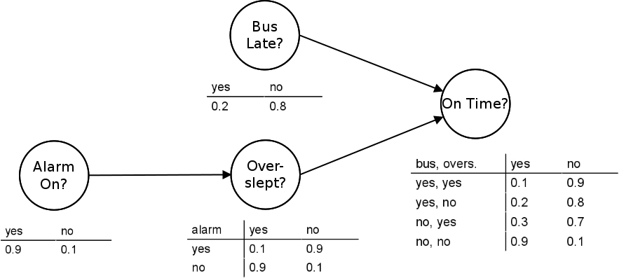

## Table of Contents

## What is a Bayesian Network?

A Bayesian Network is a type of diagram that helps us understand and work with probabilities. It shows how different events or variables are connected and how they can affect each other. Imagine you have a bunch of connected circles, where each circle represents something that can happen, like rain or a car breaking down. The lines between the circles show how these events are related. For example, if one circle is "rain" and another is "wet road," there's a line connecting them because rain can make the road wet.

These networks are useful because they help us calculate the chances of different outcomes based on what we already know. For instance, if you know it's raining, you can use the Bayesian Network to figure out how likely it is that the road will be wet. This is done using something called conditional probability, which is just a fancy way of saying "the chance of something happening given that something else has already happened." Bayesian Networks are used in many fields, like medicine, where doctors might use them to figure out the likelihood of a disease based on a patient's symptoms.

## How does a Bayesian Network represent relationships between variables?

A Bayesian Network represents relationships between variables using a diagram with circles and lines. Each circle, called a node, stands for a variable, like "rain" or "wet road." The lines, called edges, connect these nodes and show how the variables are related. If there's a line from "rain" to "wet road," it means that rain can cause the road to be wet. The direction of the line is important because it tells us which variable influences the other.

The strength of these relationships is shown using numbers called probabilities. For each node, we have a table that lists the chances of different outcomes based on the states of the nodes connected to it. For example, the table for "wet road" might say there's a 90% chance the road is wet if it's raining, but only a 10% chance if it's not raining. By looking at these probabilities, we can figure out how likely different scenarios are, given what we know about other variables in the network. This helps us make better predictions and decisions based on the information we have.

## What are the basic components of a Bayesian Network?

A Bayesian Network has two main parts: nodes and edges. Nodes are shown as circles on the diagram, and each one stands for a variable or event, like "rain" or "traffic jam." Edges are the lines that connect these circles. They show how the variables are related to each other. If there's a line from "rain" to "wet road," it means that rain can make the road wet. The direction of the line matters because it tells us which variable affects the other.

The other important part of a Bayesian Network is the probability tables. Each node has a table that lists the chances of different outcomes based on what's happening with the nodes connected to it. For example, the table for "wet road" might show that there's a 90% chance the road is wet if it's raining, but only a 10% chance if it's not. These tables help us figure out how likely different scenarios are, given what we know about other parts of the network. This way, we can make better guesses and decisions based on the information we have.

## How is probability used in Bayesian Networks?

In Bayesian Networks, probability is used to show how likely different things are to happen. Each circle, or node, in the network has a table that lists the chances of different outcomes. For example, if one node is "rain," the table might say there's a 30% chance it will rain today. If another node is "wet road," its table might say there's a 90% chance the road will be wet if it's raining, but only a 10% chance if it's not. These numbers help us understand how one thing can affect another.

When we want to figure out the chances of something happening, we look at the whole network. We start with what we know and use the probabilities in the tables to work out the chances of other things. For example, if we know it's raining, we can use the network to find out how likely it is that the road will be wet. This is called conditional probability, which just means the chance of something happening given that something else has already happened. By using these probabilities, Bayesian Networks help us make better guesses and decisions based on the information we have.

## What is the difference between a directed and an undirected graphical model?

A directed graphical model, like a Bayesian Network, uses arrows to show how things affect each other. Imagine you have circles connected by arrows. Each circle is something that can happen, like "rain" or "wet road." The arrow from "rain" to "wet road" means that rain can make the road wet. This direction is important because it tells us which thing causes the other. In these models, we use numbers called probabilities to show how likely different things are to happen based on what we already know.

An undirected graphical model, on the other hand, uses lines without arrows. These lines just show that things are related, but they don't say which thing causes the other. For example, if you have circles for "rain" and "wet road" connected by a line, it means they are linked, but it doesn't tell you if rain causes the road to be wet or if something else is going on. These models are useful when we want to show that things are connected, but we don't know or care about the direction of the influence.

## How do you construct a Bayesian Network?

To build a Bayesian Network, you start by figuring out what things you want to look at, like "rain" or "wet road." Each of these things is shown as a circle, called a node, on your diagram. Then, you draw lines, called edges, between the circles to show how they are connected. The lines have arrows to show which thing affects the other. For example, you'd draw an arrow from "rain" to "wet road" because rain can make the road wet. This step is all about understanding how the different things you're looking at are related to each other.

Next, you need to add numbers to your network to show how likely different things are to happen. Each circle gets a table that lists the chances of different outcomes. For example, the table for "wet road" might say there's a 90% chance the road is wet if it's raining, but only a 10% chance if it's not. These numbers help you figure out how one thing can affect another. Once you have all your circles, lines, and numbers in place, you can use the network to make guesses about what might happen based on what you already know. This is how you build a Bayesian Network, step by step.

## What is conditional independence in the context of Bayesian Networks?

Conditional independence in Bayesian Networks means that knowing about one thing can make other things not matter as much. Imagine you have three circles in your network: "rain," "wet road," and "car accident." Usually, "rain" and "car accident" might seem related because rain can make roads slippery. But if you already know the road is wet, then knowing it's raining doesn't tell you anything new about the chance of a car accident. The road being wet is all that matters for the accident, so "rain" and "car accident" are conditionally independent given "wet road."

This idea is really helpful because it makes the network simpler to work with. Instead of having to think about how every single thing is connected to every other thing, you can focus on the most important connections. By understanding which things are conditionally independent, you can make better guesses and decisions without getting overwhelmed by too much information. It's like sorting through a big pile of clues and figuring out which ones are the most important for solving the puzzle.

## How can Bayesian Networks be used for inference?

Bayesian Networks are great for making guesses about what might happen based on what you already know. Imagine you have a network with circles for "rain," "wet road," and "car accident." If you know it's raining, you can use the network to figure out how likely it is that the road will be wet and if there might be a car accident. You do this by looking at the numbers in the tables that show how likely different things are to happen. These tables help you work out the chances of different outcomes, like the chance of a car accident given that it's raining and the road is wet.

The process of making these guesses is called inference. In a Bayesian Network, you start with what you know and use the connections and probabilities to figure out what else might be true. For example, if you see a wet road but don't know if it's raining, you can still guess the chance of rain based on the network. By following the lines and using the numbers, you can make smart guesses about things you're not sure about. This makes Bayesian Networks really useful for making decisions in all sorts of situations, like figuring out if someone might be sick based on their symptoms or predicting if a machine might break down based on how it's been working.

## What are some common algorithms used for inference in Bayesian Networks?

There are a few common ways to make guesses using Bayesian Networks. One way is called the Variable Elimination algorithm. It's like solving a puzzle by figuring out one piece at a time. You start with what you know and use the network to work out the chances of different things happening. It's a bit like following a recipe, where you mix in one ingredient at a time until you get your answer. This method is good for smaller networks because it can get tricky with a lot of pieces to solve.

Another popular method is the Belief Propagation algorithm, also known as the Sum-Product algorithm. Imagine you're spreading news through a neighborhood. You start with what you know and pass it along to your neighbors. They then pass it on to their neighbors, and so on. This way, everyone in the network gets the latest information, and you can use it to make guesses about what might happen. This method works well for networks where the connections form loops, making it useful for more complex situations.

Lastly, there's the Markov Chain Monte Carlo (MCMC) method. Think of it like playing a game where you guess and check a lot. You start with a guess about what might be true and then keep changing your guess based on what the network tells you. Over time, your guesses get better and better. This method is really helpful when the network is big and complicated because it can handle a lot of information without getting too bogged down.

## How do you handle missing data in Bayesian Networks?

When you're working with Bayesian Networks and you find out that some of your data is missing, you don't have to worry too much. One way to deal with this is by using something called the Expectation-Maximization (EM) algorithm. Imagine you're trying to guess what's missing in a puzzle. The EM algorithm helps you make smart guesses about the missing pieces by looking at the rest of the puzzle. It does this in two steps: first, it makes a guess about the missing data, and then it uses that guess to update the whole network. It keeps doing this over and over until the guesses get better and better.

Another way to handle missing data is by using a method called Multiple Imputation. Think of it like filling in the blanks in a story. You create several different versions of the missing data, each one a little different. Then, you use each version to make guesses with your Bayesian Network. After that, you combine all the guesses to get a final answer. This method is good because it helps you see how much the missing data might change your guesses. Both of these ways help make sure that missing data doesn't stop you from using your Bayesian Network to make smart decisions.

## What are the limitations and challenges of using Bayesian Networks?

One challenge with Bayesian Networks is that they can get really complicated when you have a lot of things to think about. Imagine trying to keep track of a big family tree with lots of people and how they're all related. If your network has too many circles and lines, it can be hard to figure out what's going on. Plus, you need a lot of numbers to show how likely different things are to happen, and getting all those numbers right can be tough. If you don't have good numbers, your guesses might not be very accurate.

Another limitation is that Bayesian Networks assume that all the important things are included in the network. If you miss something important, your guesses might be way off. For example, if you're trying to figure out if someone is sick based on their symptoms, but you don't include their travel history, you might miss a key piece of information. Also, these networks can take a lot of time and computer power to use, especially when you're trying to make guesses about a lot of different things at once. This can make them tricky to use in situations where you need quick answers.

## How can Bayesian Networks be applied in real-world scenarios, such as in medicine or finance?

In medicine, Bayesian Networks help doctors make better guesses about what might be wrong with a patient. Imagine a doctor looking at a patient with a fever, cough, and headache. The doctor can use a Bayesian Network to figure out how likely it is that the patient has the flu, a cold, or something else. The network shows how symptoms are connected to diseases and uses numbers to show how likely each disease is based on the symptoms. This helps doctors make smarter decisions about tests and treatments, making sure they catch the right illness quickly and help the patient get better.

In finance, Bayesian Networks can help people make better guesses about the stock market or other money-related things. Imagine you're trying to decide if you should buy or sell a certain stock. A Bayesian Network can show how different things, like company news, economic reports, and past stock prices, are connected and affect each other. By looking at these connections and using numbers to show how likely different outcomes are, you can make smarter choices about when to buy or sell. This can help you make more money and avoid big losses, making your financial decisions more reliable and successful.

## What is a Bayesian Network?

A Bayesian Network, also known as a belief network or a Bayes net, is a probabilistic graphical model that encapsulates the relationships between a group of variables. These structures are composed of nodes and directed edges, where each node corresponds to a variable, and each edge reflects a conditional dependency between the connected variables. The essence of a Bayesian Network lies in its capability to model uncertainty and update probabilities as new information is made available. This is accomplished by applying Bayes' Theorem, which serves as the foundation for revising probability estimates and understanding probabilistic dependencies.

A Bayesian Network is particularly potent in environments where the relationships between data points are complex, and understanding these correlations can provide a significant advantage. One of its strengths is the ability to represent joint probability distributions compactly, making it feasible to compute the probability of any given event by marginalizing over the other variables. 

Mathematically, a Bayesian Network is defined by a set $\text{B} = (\text{G}, \text{P})$, where $\text{G} = (\text{V}, \text{E})$ is a directed acyclic graph (DAG) with vertices $\text{V}$ representing the random variables in the domain, and edges $\text{E}$ representing the direct dependencies between the variables. The probability component $\text{P}$ provides a conditional probability distribution for each variable, conditioned on its parents in the graph. Therefore, the joint probability distribution of a set of variables $\text{X}_1, \text{X}_2, \ldots, \text{X}_n$ in a Bayesian Network is calculated as:

$$
P(X_1, X_2, \ldots, X_n) = \prod_{i=1}^{n} P(X_i \mid \text{Pa}(X_i))
$$

where $\text{Pa}(X_i)$ denotes the set of parent nodes of $X_i$.

In the context of [algorithmic trading](/wiki/algorithmic-trading), Bayesian Networks can be leveraged to model the intricate dependencies between various financial market indicators. These networks enable traders to create models that incorporate a multitude of market factors, offering insights that go beyond simple linear correlations. By capturing the probabilistic nature of the market, Bayesian Networks aid in constructing robust models that can predict market movements, assess risk, and ultimately guide trading decisions.

Bayesian Networks' ability to update predictions with real-time data is invaluable in trading environments where conditions change rapidly. This adaptability fosters a nuanced understanding of market dynamics, facilitating informed decision-making and optimizing trading strategies. By effectively utilizing these networks, traders and data scientists can identify latent patterns and relationships in the market data that might be invisible to traditional statistical methods, thereby enhancing their potential to exploit profitable trading opportunities.

## How are Bayesian Networks used in Algorithmic Trading?

Algorithmic trading capitalizes on computer algorithms to execute trading decisions in financial markets with speed and precision. Bayesian Networks offer a robust framework for understanding and leveraging the interdependencies between various financial indicators, providing traders with a profound edge in modeling market behavior.

To start, Bayesian Networks are instrumental in deciphering the complex interdependencies that pervade financial markets. These networks excel in representing probabilistic relationships among diverse market indicators, such as price movements, [volume](/wiki/volume-trading-strategy) changes, and macroeconomic factors. By utilizing directed acyclic graphs, Bayesian Networks visually depict the conditional dependencies between variables, thereby illuminating how changes in one indicator can influence others. This ability to map out dependencies is crucial for constructing predictive models that reflect the dynamic nature of market interactions.

Traders employ Bayesian Networks to build probabilistic models that capture the stochastic behavior of market dynamics. By anchoring their models in the principles of Bayes' Theorem, traders can systematically update their probability estimates as new market data becomes available. This iterative updating process enhances the accuracy of predictions, enabling traders to refine their strategies in response to evolving market conditions. In mathematical terms, if $P(A|B)$ represents the probability of event A given event B, Bayes' Theorem allows for updating this probability as new evidence emerges, according to the formula: 

$$
P(A|B) = \frac{P(B|A) \cdot P(A)}{P(B)}
$$

This constant learning process forms the basis for informed decision-making under uncertainty, a quintessential component of success in algorithmic trading.

Moreover, Bayesian Networks are adept at supporting real-time decision-making processes. By continuously ingesting new data and recalculating probabilities, they enable traders to swiftly adapt their strategies based on the latest market intelligence. This feature is particularly advantageous in volatile markets where rapid shifts demand prompt responses. Consequently, traders can hedge, enter, or [exit](/wiki/exit-strategy) positions with confidence, capitalizing on fleeting opportunities.

Additionally, Bayesian Networks hold promise for the development of long-term trading strategies. By analyzing historical data and identifying patterns over time, these networks assist in discerning trends and key indicators that may influence future market movements. The integration of expert domain knowledge into Bayesian models further augments their predictive capacity, allowing traders to incorporate insights that may not be readily apparent from raw data alone.

In summary, Bayesian Networks are an invaluable asset in algorithmic trading, empowering traders to construct sophisticated models that enhance prediction accuracy and support both real-time and long-term strategic decisions. Their ability to continually refine predictions based on new data ensures traders remain adaptable and informed, ultimately optimizing trading outcomes.

## References & Further Reading

[1]: Pearl, J. (1988). ["Probabilistic Reasoning in Intelligent Systems: Networks of Plausible Inference."](https://dl.acm.org/doi/book/10.5555/534975) Morgan Kaufmann Publishers.

[2]: Murphy, K. P. (2012). ["Machine Learning: A Probabilistic Perspective."](https://www.cs.ubc.ca/~murphyk/MLbook/pml-toc-1may12.pdf) MIT Press.

[3]: Jensen, F. V., & Nielsen, T. D. (2007). ["Bayesian Networks and Decision Graphs."](https://link.springer.com/book/10.1007/978-0-387-68282-2) Springer.

[4]: Heckerman, D. (1996). ["A Tutorial on Learning with Bayesian Networks."](http://heckerman.com/david/tutorial.pdf) Microsoft Research Technical Report.

[5]: Koller, D., & Friedman, N. (2009). ["Probabilistic Graphical Models: Principles and Techniques."](https://dl.acm.org/doi/10.5555/1795555) MIT Press.

[6]: Lopez de Prado, M. (2018). ["Advances in Financial Machine Learning."](https://www.amazon.com/Advances-Financial-Machine-Learning-Marcos/dp/1119482089) Wiley.

[7]: Carlin, B. P., & Louis, T. A. (2009). ["Bayesian Methods for Data Analysis."](https://api.pageplace.de/preview/DT0400.9781584886983_A37993766/preview-9781584886983_A37993766.pdf) CRC Press.