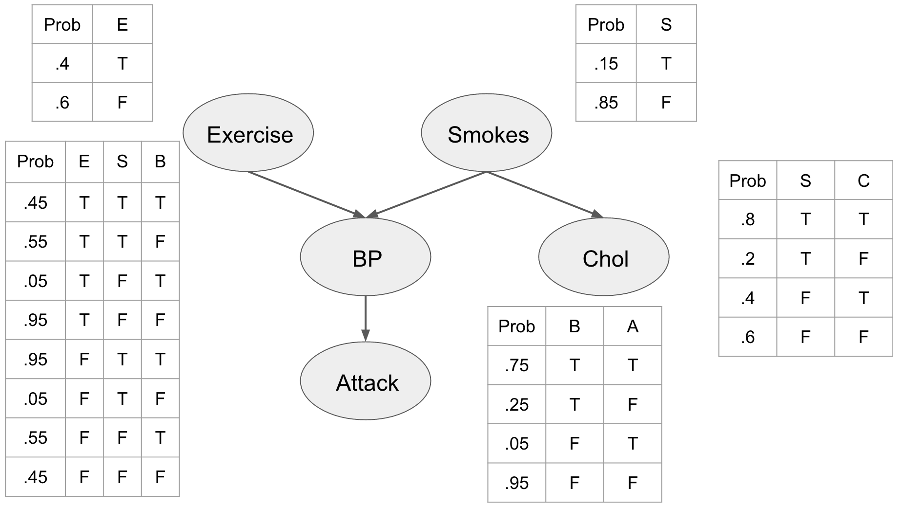

Bayesian networks are a sophisticated form of statistical model designed to depict a set of variables and their conditional dependencies through a structure known as a directed acyclic graph (DAG). In this framework, each node corresponds to a variable, while the edges illustrate the direct dependencies among them. This graphical representation allows for a streamlined approach in managing intricate relationships, making Bayesian networks particularly well-suited for environments characterized by uncertainty and complex interdependencies.

In algorithmic trading, these networks have been increasingly utilized to model and predict the dynamics of financial markets. Traditional trading strategies often rely on fixed sets of rules or historical data patterns, which may not adequately capture the volatile and unpredictable nature of contemporary markets. Bayesian networks, by virtue of their probabilistic underpinning, enable traders to incorporate uncertainty and dynamically update predictions with the influx of new market data. Bayes’ theorem serves as the foundation, allowing the systematic update of the probability of a hypothesis — or market trend — as new trading information becomes available.

This article intends to explore the central principles of Bayesian networks along with their relevance to algorithmic trading. Embracing Bayesian networks can significantly refine decision-making processes by employing probabilistic reasoning, thereby addressing a core challenge in trading: making informed decisions amidst uncertainty. As financial markets escalate in complexity, the capacity of Bayesian networks to adapt trading algorithms to ever-evolving market conditions holds immense promise. By using these models, trading strategies can become more agile, robust, and capable of rational adaptation to changing market dynamics, ultimately equipping traders with a superior toolkit for navigating the volatile landscape of algorithmic trading.

## Table of Contents

## Understanding Bayesian Networks

Bayesian networks are graphical models used to represent the probabilistic relationships among a set of variables. The fundamental components of a Bayesian network include nodes, which symbolize the variables, and directed edges, which represent the conditional dependencies between these variables. The directed edges create a Directed Acyclic Graph (DAG) which captures the joint probability distribution of the variables involved. This structure allows for an efficient computation of the posterior probabilities of certain variables conditioned on observed evidence, leveraging Bayes' theorem. 

Mathematically, a Bayesian network defines a factorization of the joint probability distribution of all variables into a product of conditional probabilities. For a set of variables $X_1, X_2, \ldots, X_n$, the joint distribution can be expressed as:

$$

P(X_1, X_2, \ldots, X_n) = \prod_{i=1}^{n} P(X_i \mid \text{Pa}(X_i))
$$

Here, $\text{Pa}(X_i)$ denotes the parents of $X_i$ in the network, indicating that the probability of each variable is conditioned on its parent variables as defined by the edges in the DAG.

The power of Bayesian networks lies in their flexibility to model complex and nonlinear relationships among variables. They can accommodate different types of data, whether discrete or continuous, and are particularly adept at handling incomplete datasets. Bayesian networks enable the incorporation of domain knowledge in the form of prior distributions and provide a mechanism to update the probabilities of certain events as more evidence is introduced. This updating process is key in situations where the information is dynamically changing.

Graphically, Bayesian networks offer an intuitive visualization of the probabilistic dependencies between variables. This can simplify the understanding and interpretation of complex interactions within the data. For example, in a financial setting, nodes might represent different market indicators, while the edges illustrate how changes in one indicator affect others. Such a representation allows traders and analysts to infer the potential downstream impacts of observed market shifts, thus facilitating informed decision-making.

Overall, Bayesian networks provide a robust framework for dealing with uncertainty and complexity in diverse fields, including finance, where interpreting intricate relationships and updating beliefs in light of new data are crucial.

## Algorithmic Trading Overview

Algorithmic trading involves deploying computer programs to automate trading strategies in financial markets. These programs, often referred to as algorithms, are designed to execute trades based on specific sets of criteria, which can significantly enhance the speed and efficiency of trading activities. Essentially, algorithms in trading eliminate the latency associated with human action and decision-making, allowing for rapid response to market movements that might present profitable opportunities.

The range of strategies employed in [algorithmic trading](/wiki/algorithmic-trading) is diverse, spanning from simple rule-based systems to complex approaches driven by [artificial intelligence](/wiki/ai-artificial-intelligence) (AI). Simple rule-based systems might involve executing trades based on clear technical indicators such as moving average crossovers. In contrast, complex AI-driven strategies might employ [machine learning](/wiki/machine-learning) techniques to predict market trends by analyzing vast amounts of data.

The adoption of algorithmic trading has been growing, driven by its potential to swiftly capitalize on transient market opportunities. This increase in algorithmic trading has been facilitated by advances in computational technology and the availability of high-frequency data feeds that provide up-to-the-minute market information.

A crucial component of algorithmic trading is risk management. Algorithms are programmed with predefined risk parameters to help minimize potential losses and manage exposure. This might include setting stop-loss orders, defining position sizes, and employing strategies to hedge against adverse market movements. Effective risk management ensures that trading strategies are not only profitable in favorable conditions but also resilient during periods of market [volatility](/wiki/volatility-trading-strategies).

By automating trading tasks, algorithms offer traders and financial institutions a powerful means to enhance their trading capabilities. As the financial markets continue to evolve towards greater complexity and speed, the role of algorithmic trading is likely to grow, pushing the boundaries of what's possible in the trading world.

## Incorporating Bayesian Networks in Algo Trading

Bayesian networks can significantly enhance algorithmic trading by serving as a robust framework for probabilistic inference and decision-making. These networks enable traders to effectively model intricate market behaviors and update predictions continuously as new data becomes available. 

The core strength of Bayesian networks lies in their ability to predict price movements using a structured representation of market variables. By modeling the conditional dependencies between these variables, Bayesian networks facilitate the estimation of the joint probability distribution, which can be used to forecast future trends. For example, if a trader wants to predict the price of a stock, they can use a Bayesian network to model the dependencies between influencing factors like interest rates, market sentiment, and economic indicators. 

Risk assessment is another crucial application of Bayesian networks in algorithmic trading. By analyzing the relationships between various market factors, these networks can help in quantifying potential risks associated with particular trading strategies. This probabilistic approach allows traders to make data-driven decisions while accounting for uncertainty in market conditions.

Furthermore, Bayesian networks optimize trading strategies by enabling adaptive learning. As new information emerges, these networks update their beliefs based on Bayes' theorem, \[ P(H|E) = \frac{P(E|H) \cdot P(H)}{P(E)} \] where $P(H|E)$ is the updated probability of hypothesis $H$ given evidence $E$. This dynamic updating process makes it possible for trading algorithms to adjust to market volatility and optimize performance over time.

Real-world applications of Bayesian networks in algorithmic trading include automated investment strategies, which rely on probabilistic models to allocate assets dynamically while minimizing risk. Additionally, they play a crucial role in anomaly detection, identifying unusual patterns or outliers in market data that may indicate fraudulent activities or systemic issues. Fraud prevention mechanisms also benefit from Bayesian networks by using probabilistic models to detect suspicious transactions based on historical data and established patterns.

Overall, the integration of Bayesian networks in algorithmic trading significantly enhances a trader's ability to predict market movements, assess risks, and adapt strategies effectively, all while maintaining a robust framework for handling the inherent uncertainties of financial markets.

## Challenges and Considerations

Bayesian networks have the potential to significantly enhance algorithmic trading strategies through their ability to model complex market dynamics probabilistically. However, their implementation comes with several challenges and considerations that must be addressed to harness their full potential effectively.

One of the primary challenges lies in the computational resources required for implementing Bayesian networks. These models often involve numerous variables and conditional dependencies, leading to a need for substantial computational power, especially when dealing with large datasets typically encountered in financial markets. Efficient algorithms and high-performance computing resources are crucial to manage the computational demands effectively.

The quality of predictions generated by Bayesian networks is highly dependent on the accuracy of the underlying network structure and the data used for modeling. Constructing an effective network structure requires a deep understanding of market variables and their interactions. Even with expert knowledge, determining the correct structure can be complex and may involve a degree of trial and error. Furthermore, the data utilized must be extensive, relevant, and of high quality to ensure reliable outcomes. Any noise or inconsistencies in data can lead to erroneous predictions, emphasizing the need for meticulous data preprocessing and validation.

Market dynamics introduce additional challenges in maintaining and updating Bayesian network models. Financial markets are inherently volatile and subject to rapid changes, which can lead to shifts in the relationships between variables. Therefore, it is vital to update the network continuously to reflect current market conditions. This task can be resource-intensive and requires ongoing monitoring and adjustment to ensure the model remains applicable.

Balancing model complexity and interpretability is another critical consideration. While a more complex model may capture intricate market behaviors more accurately, it can also become challenging to interpret and maintain, especially when transparency and explainability are necessary. Simplifying the model to enhance interpretability might, however, lead to a loss of critical information. Striking the right balance is essential for the practical application of Bayesian networks.

Finally, while Bayesian networks provide powerful insights, they are most effective when used in conjunction with other analytical tools. Combining Bayesian networks with other methodologies, such as machine learning algorithms or statistical techniques, can provide a more comprehensive approach to market analysis and trading strategy formulation. This hybrid approach can compensate for the limitations of individual models and enhance the robustness of the trading system. 

In summary, while Bayesian networks offer substantial benefits, their successful implementation in algorithmic trading requires addressing challenges related to computational resources, data quality, model maintenance, and complexity. Integrating them with complementary tools can amplify their effectiveness, paving the way for more sophisticated and adaptive trading strategies.

## Conclusion

Bayesian networks present a sophisticated approach to enhancing algorithmic trading strategies by enabling probabilistic reasoning. These networks excel in modeling complex dependencies between variables, thereby enhancing trading algorithms' adaptability and decision-making capabilities in the face of uncertainty. As financial markets continue to evolve and become more intricate, the application of Bayesian networks in algorithmic trading is likely to expand. Their ability to dynamically update and refine predictions with new data makes them particularly well-suited to the fast-paced environment of financial markets.

Incorporating Bayesian networks into existing models offers traders and financial institutions the potential to significantly fortify their trading platforms. By leveraging Bayesian reasoning, these entities can gain more nuanced insights into market behavior, improving risk assessment and strategy optimization. The flexibility of Bayesian networks in accommodating various types of data and nonlinear relationships further underscores their utility in algorithmic trading.

Moreover, the ongoing advancement of computational tools and techniques will play a crucial role in supporting the broader application of Bayesian networks. Enhanced computational power and improved probabilistic modeling methodologies will enable more efficient and scalable implementations of Bayesian networks, facilitating their integration into high-frequency trading environments and complex financial systems. As a result, traders and financial institutions that adopt Bayesian networks are likely to maintain a competitive advantage in the rapidly evolving landscape of algorithmic trading.

## References & Further Reading

[1]: Jordan, M. I., & Bishop, C. M. (2007). ["An Introduction to Graphical Models."](https://www.semanticscholar.org/paper/An-Introduction-to-Graphical-Models-Jordan-Bishop/5a3ed2f82037654f6df659f8bcd23cb09305d453) Springer-Verlag.

[2]: Koller, D., & Friedman, N. (2009). ["Probabilistic Graphical Models: Principles and Techniques."](https://dl.acm.org/doi/10.5555/1795555) MIT Press.

[3]: Fenton, N., & Neil, M. (2018). ["Risk Assessment and Decision Analysis with Bayesian Networks."](https://www.taylorfrancis.com/books/mono/10.1201/b21982/risk-assessment-decision-analysis-bayesian-networks-norman-fenton-martin-neil) CRC Press.

[4]: Pearl, J. (1988). ["Probabilistic Reasoning in Intelligent Systems: Networks of Plausible Inference."](https://dl.acm.org/doi/book/10.5555/534975) Morgan Kaufmann.

[5]: Tsay, R. S. (2010). ["Analysis of Financial Time Series."](https://onlinelibrary.wiley.com/doi/book/10.1002/9780470644560) Wiley.

[6]: Lopez de Prado, M. (2018). ["Advances in Financial Machine Learning."](https://www.amazon.com/Advances-Financial-Machine-Learning-Marcos/dp/1119482089) Wiley.

[7]: Aronson, D. (2007). ["Evidence-Based Technical Analysis: Applying the Scientific Method and Statistical Inference to Trading Signals."](https://www.amazon.com/Evidence-Based-Technical-Analysis-Scientific-Statistical/dp/0470008741) Wiley.

[8]: Jansen, S. (2020). ["Machine Learning for Algorithmic Trading."](https://github.com/stefan-jansen/machine-learning-for-trading) Packt Publishing.

[9]: Chan, E. P. (2009). ["Quantitative Trading: How to Build Your Own Algorithmic Trading Business."](https://github.com/egorpe/EPChan-QuantitativeTrading/blob/master/example7_6.m) Wiley.