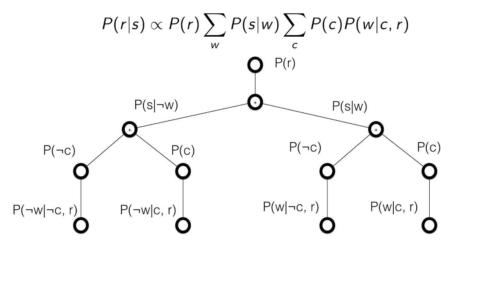

## Table of Contents

## What is a Bayesian Network?

A Bayesian Network is a type of diagram that helps us understand and predict things by showing how different pieces of information are connected. It uses arrows to show how one thing can affect another. For example, if you have a network about weather, it might show how rain can affect whether the ground is wet. Each piece of information, like "rain" or "wet ground," has a chance of happening, and these chances can change based on other pieces of information.

These networks are useful because they help us make better guesses about what might happen next. By looking at the connections and the chances, we can figure out how likely something is to happen. For instance, if we know it's raining, the network can help us figure out how likely it is that the ground will be wet. This is helpful in many areas, like medicine, where doctors can use Bayesian Networks to predict how likely a patient is to have a certain disease based on their symptoms.

## What are the basic components of a Bayesian Network?

A Bayesian Network has two main parts: nodes and edges. Nodes are like boxes that represent different things or events, like "rain" or "wet ground." Each node has a chance of happening, which we call a probability. For example, the node for "rain" might have a 30% chance of happening on any given day. Edges are the arrows that connect the nodes. They show how one thing can affect another. If there's an arrow from "rain" to "wet ground," it means that rain can make the ground wet.

The second part of a Bayesian Network is the conditional probability table (CPT). This table is attached to each node and shows how the chances of that node change based on the other nodes it's connected to. For instance, the CPT for "wet ground" might show that if it's raining, there's a 90% chance the ground will be wet, but if it's not raining, there's only a 10% chance. This helps the network figure out how likely something is to happen based on what else is going on.

Putting it all together, a Bayesian Network uses nodes, edges, and CPTs to show how different pieces of information are linked and how they affect each other. This makes it easier to predict what might happen next by looking at the whole picture. For example, if you know it's raining, the network can help you figure out how likely it is that the ground will be wet, making it a useful tool for making decisions based on probabilities.

## How does a Bayesian Network represent probabilities?

A Bayesian Network uses nodes and edges to show how different things are connected and how they affect each other. Each node represents something that can happen, like "rain" or "wet ground." Each node has a chance of happening, which we call a probability. For example, the node for "rain" might have a 30% chance of happening on any given day. The edges are arrows that show how one thing can affect another. If there's an arrow from "rain" to "wet ground," it means that rain can make the ground wet.

The probabilities in a Bayesian Network are shown using something called a conditional probability table (CPT). Each node has its own CPT, which tells us how the chances of that node change based on the other nodes it's connected to. For instance, the CPT for "wet ground" might show that if it's raining, there's a 90% chance the ground will be wet, but if it's not raining, there's only a 10% chance. By looking at these tables, the network can figure out how likely something is to happen based on what else is going on. This makes it easier to predict what might happen next by considering the whole picture.

## What is the difference between a directed and an undirected graphical model?

A directed graphical model, like a Bayesian Network, uses arrows to show how one thing can affect another. The arrows point from one thing to another, showing a clear direction of influence. For example, if there's an arrow from "rain" to "wet ground," it means that rain can make the ground wet. This type of model is good for showing cause and effect, where one thing directly influences another. Each node in a directed model has a probability, and these probabilities can change based on the other nodes it's connected to.

An undirected graphical model, on the other hand, uses lines without arrows to show connections between things. These lines just show that two things are related, but they don't say which one affects the other. For example, if there's a line between "rain" and "wet ground," it means they are connected, but it doesn't say that rain causes the ground to be wet. This type of model is good for showing relationships where the direction of influence isn't clear or important. The probabilities in an undirected model are based on how all the connected nodes work together, rather than one node directly affecting another.

Both types of models help us understand how different things are connected and how they affect each other, but they do it in different ways. Directed models are better for showing clear cause-and-effect relationships, while undirected models are better for showing general connections without specifying direction.

## How do you construct a Bayesian Network?

To construct a Bayesian Network, start by figuring out what things or events you want to include in your network. These are called nodes, and they could be things like "rain," "wet ground," or "slippery road." Once you have your nodes, think about how they are connected. If one thing can affect another, draw an arrow from the first thing to the second. For example, if rain can make the ground wet, draw an arrow from "rain" to "wet ground." Keep doing this until you have shown all the important connections between your nodes.

Next, you need to add probabilities to your nodes. Each node has a chance of happening, and these chances can change based on the other nodes it's connected to. To show this, you use something called a conditional probability table (CPT) for each node. The CPT for "wet ground" might say that if it's raining, there's a 90% chance the ground will be wet, but if it's not raining, there's only a 10% chance. Once you have filled out all the CPTs, your Bayesian Network is complete. It can now help you predict how likely something is to happen based on what else is going on.

## What is conditional independence in the context of Bayesian Networks?

Conditional independence in Bayesian Networks means that knowing about one thing can make other things not matter as much. Imagine you have three things: rain, wet ground, and a slippery road. Usually, knowing if it's raining helps you guess if the ground is wet. But if you already know the ground is wet, knowing it's raining doesn't help you guess if the road is slippery any more. The wet ground already tells you all you need to know about the road being slippery, so the rain doesn't add any new information.

This idea is important because it helps make the network simpler and easier to work with. When you build a Bayesian Network, you can use conditional independence to leave out some arrows between nodes. If knowing about one thing makes another thing not matter as much, you don't need to draw an arrow between them. This makes the network easier to understand and use, because it only shows the most important connections between things.

## How can Bayesian Networks be used for inference?

Bayesian Networks are really helpful for making guesses or predictions about what might happen next. They do this by using the connections and probabilities between different things. For example, if you want to know how likely it is that the ground will be wet, you can use the network to look at the chances of it raining and see how that affects the ground. The network takes all the information it has and figures out the best guess for what might happen, based on what it knows.

This process is called inference, and it's like solving a puzzle. The network uses the arrows between the things to figure out how they affect each other. If you know some things for sure, like it's definitely raining, the network can update its guesses about other things, like the ground being wet. By looking at all the connections and the probabilities, the network can give you a good idea of how likely something is to happen, even if you don't know everything for sure. This makes Bayesian Networks a powerful tool for making decisions based on what we know and what we can guess.

## What are some common algorithms used for inference in Bayesian Networks?

There are a few common ways to make guesses or predictions using Bayesian Networks. One way is called the Variable Elimination algorithm. It works by getting rid of things you don't need to know about to make your guess. Imagine you're trying to figure out if the ground is wet. You start with all the information you have, like if it's raining or not. Then, you focus on the things that really matter for the ground being wet and ignore the rest. This makes it easier to figure out the chances of the ground being wet based on what you know.

Another way is called the Belief Propagation algorithm. This one is like passing messages around in the network. Each thing in the network, like "rain" or "wet ground," sends messages to the other things it's connected to. These messages help the network figure out how likely each thing is to happen. It's a bit like a game of telephone, where each thing updates its guess based on what it hears from the others. This method is good for networks where things are connected in a certain way, like a chain or a tree.

The third way is the Junction Tree algorithm. This one turns the network into a simpler shape, called a tree, to make guesses easier. It groups things together that are closely related and then uses these groups to figure out the chances of things happening. It's a bit like solving a puzzle by breaking it into smaller pieces and then putting those pieces together. This method is good for more complicated networks where things are connected in lots of different ways.

## How do you learn the structure of a Bayesian Network from data?

Learning the structure of a Bayesian Network from data means figuring out how different things are connected based on what you see in the data. You start with a bunch of information, like whether it's raining, if the ground is wet, and if the road is slippery. You then use special methods to look at this data and guess which things affect others. One common way to do this is called the "score-based" method. It's like trying different ways to connect the things and seeing which way makes the most sense based on the data. You keep trying different connections until you find the one that fits the data best.

Another way to learn the structure is the "constraint-based" method. This one looks at the data to find rules about how things can or can't be connected. For example, if knowing if it's raining doesn't help you guess if the road is slippery when you already know if the ground is wet, then you know there shouldn't be a direct connection between rain and the road being slippery. You use these rules to build the network, making sure it follows all the rules you find in the data. Both methods help you make a good guess about how things are connected, but they do it in different ways.

## What are the challenges in parameter learning for Bayesian Networks?

Learning the numbers, or parameters, in a Bayesian Network can be tricky. One big challenge is getting enough good data. You need a lot of information to figure out how likely each thing is to happen and how they affect each other. If you don't have enough data, or if the data you have isn't very good, your guesses about the numbers might be off. Another problem is that some things in the network might be hidden or hard to see. For example, if you're trying to figure out if someone is sick, you might not know for sure if they have the disease, but you can see their symptoms. This makes it harder to learn the right numbers because you're working with guesses rather than facts.

Another challenge is that the math can get really complicated. When you have a lot of things in your network, figuring out how they all affect each other can be like solving a giant puzzle. You need special methods, like the Expectation-Maximization algorithm, to help you figure out the numbers. These methods can take a long time to run, especially if your network is big. Also, if the things in your network are connected in a complicated way, it can be hard to find the best numbers that fit all the data. So, learning the parameters in a Bayesian Network is a bit like trying to find your way through a maze with lots of twists and turns.

## How can Bayesian Networks be applied in real-world scenarios?

Bayesian Networks are really useful in medicine. Doctors use them to help figure out if someone might be sick. Imagine a patient comes in with a fever and a cough. The doctor can use a Bayesian Network to look at all the symptoms and figure out how likely it is that the patient has the flu, a cold, or something else. The network takes into account all the different symptoms and how they're connected. This helps doctors make better guesses about what's wrong and decide on the best treatment. It's like having a smart helper that looks at all the clues and gives the best advice.

They're also helpful in figuring out things like the weather. Weather forecasters use Bayesian Networks to predict if it will rain, snow, or be sunny. They look at things like temperature, humidity, and wind direction. The network shows how all these things are connected and how they affect each other. For example, if it's really humid and the temperature is just right, the network can help predict a higher chance of rain. By using all this information, forecasters can give more accurate weather reports, helping people plan their days better. It's like having a crystal ball that uses math to see into the future.

## What are some advanced topics or extensions of Bayesian Networks?

One advanced topic in Bayesian Networks is called Dynamic Bayesian Networks (DBNs). These are special types of networks that help us understand things that change over time. Imagine you want to predict the weather for the next few days. A regular Bayesian Network might help you guess the weather for today, but a DBN can help you guess the weather for tomorrow and the day after that, too. It does this by showing how today's weather can affect tomorrow's weather. DBNs are really useful in areas like finance, where people want to predict how stock prices will change, or in medicine, where doctors want to see how a patient's health might improve or get worse over time.

Another advanced topic is called Markov Networks, which are a type of undirected graphical model. Unlike Bayesian Networks, which use arrows to show how one thing affects another, Markov Networks use lines without arrows to show that things are connected. They're good for showing relationships where the direction of influence isn't clear or important. For example, if you're studying a group of friends, a Markov Network can show how they're all connected to each other without saying who influences whom. Markov Networks are useful in areas like social network analysis, where you want to understand how people are connected, or in image processing, where you want to understand how different parts of an image relate to each other.

A third advanced topic is the use of Bayesian Networks in [machine learning](/wiki/machine-learning), specifically in the form of Bayesian Belief Networks (BBNs). BBNs are used to make predictions and decisions based on data. They're like a smart computer program that can learn from examples and make guesses about new situations. For instance, in a self-driving car, a BBN can help the car understand what other cars and pedestrians might do next based on what it sees. This helps the car make safer decisions on the road. BBNs are also used in areas like spam filtering, where they help figure out if an email is likely to be spam based on its content and other clues.

## What is the key to understanding Bayesian Networks?

Bayesian networks are graphical models used to represent the probabilistic relationships among a set of variables. The fundamental components of a Bayesian network include nodes, which symbolize the variables, and directed edges, which represent the conditional dependencies between these variables. The directed edges create a Directed Acyclic Graph (DAG) which captures the joint probability distribution of the variables involved. This structure allows for an efficient computation of the posterior probabilities of certain variables conditioned on observed evidence, leveraging Bayes' theorem. 

Mathematically, a Bayesian network defines a factorization of the joint probability distribution of all variables into a product of conditional probabilities. For a set of variables $X_1, X_2, \ldots, X_n$, the joint distribution can be expressed as:

$$

P(X_1, X_2, \ldots, X_n) = \prod_{i=1}^{n} P(X_i \mid \text{Pa}(X_i))
$$

Here, $\text{Pa}(X_i)$ denotes the parents of $X_i$ in the network, indicating that the probability of each variable is conditioned on its parent variables as defined by the edges in the DAG.

The power of Bayesian networks lies in their flexibility to model complex and nonlinear relationships among variables. They can accommodate different types of data, whether discrete or continuous, and are particularly adept at handling incomplete datasets. Bayesian networks enable the incorporation of domain knowledge in the form of prior distributions and provide a mechanism to update the probabilities of certain events as more evidence is introduced. This updating process is key in situations where the information is dynamically changing.

Graphically, Bayesian networks offer an intuitive visualization of the probabilistic dependencies between variables. This can simplify the understanding and interpretation of complex interactions within the data. For example, in a financial setting, nodes might represent different market indicators, while the edges illustrate how changes in one indicator affect others. Such a representation allows traders and analysts to infer the potential downstream impacts of observed market shifts, thus facilitating informed decision-making.

Overall, Bayesian networks provide a robust framework for dealing with uncertainty and complexity in diverse fields, including finance, where interpreting intricate relationships and updating beliefs in light of new data are crucial.

## References & Further Reading

[1]: Jordan, M. I., & Bishop, C. M. (2007). ["An Introduction to Graphical Models."](https://www.semanticscholar.org/paper/An-Introduction-to-Graphical-Models-Jordan-Bishop/5a3ed2f82037654f6df659f8bcd23cb09305d453) Springer-Verlag.

[2]: Koller, D., & Friedman, N. (2009). ["Probabilistic Graphical Models: Principles and Techniques."](https://dl.acm.org/doi/10.5555/1795555) MIT Press.

[3]: Fenton, N., & Neil, M. (2018). ["Risk Assessment and Decision Analysis with Bayesian Networks."](https://www.taylorfrancis.com/books/mono/10.1201/b21982/risk-assessment-decision-analysis-bayesian-networks-norman-fenton-martin-neil) CRC Press.

[4]: Pearl, J. (1988). ["Probabilistic Reasoning in Intelligent Systems: Networks of Plausible Inference."](https://dl.acm.org/doi/book/10.5555/534975) Morgan Kaufmann.

[5]: Tsay, R. S. (2010). ["Analysis of Financial Time Series."](https://onlinelibrary.wiley.com/doi/book/10.1002/9780470644560) Wiley.

[6]: Lopez de Prado, M. (2018). ["Advances in Financial Machine Learning."](https://www.amazon.com/Advances-Financial-Machine-Learning-Marcos/dp/1119482089) Wiley.

[7]: Aronson, D. (2007). ["Evidence-Based Technical Analysis: Applying the Scientific Method and Statistical Inference to Trading Signals."](https://www.amazon.com/Evidence-Based-Technical-Analysis-Scientific-Statistical/dp/0470008741) Wiley.

[8]: Jansen, S. (2020). ["Machine Learning for Algorithmic Trading."](https://github.com/stefan-jansen/machine-learning-for-trading) Packt Publishing.

[9]: Chan, E. P. (2009). ["Quantitative Trading: How to Build Your Own Algorithmic Trading Business."](https://github.com/egorpe/EPChan-QuantitativeTrading/blob/master/example7_6.m) Wiley.