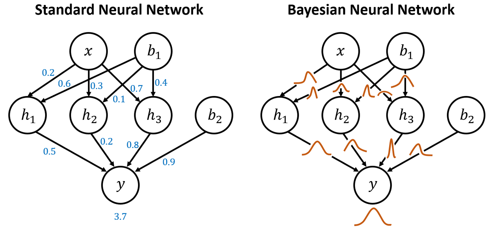

## Table of Contents

## What is a Bayesian Neural Network (BNN)?

A Bayesian Neural Network (BNN) is a type of neural network that uses Bayesian methods to handle uncertainty in its predictions. Unlike traditional neural networks, which give a single output for a given input, BNNs provide a distribution of possible outputs. This means they can tell us not just what they think the answer is, but also how sure they are about it. This is really helpful in fields like medicine or finance, where knowing the uncertainty can be as important as the prediction itself.

In a BNN, instead of having fixed weights, we treat the weights as probability distributions. This means that every time we make a prediction, we sample from these distributions to get different possible sets of weights. This approach helps the network to learn from data in a way that accounts for uncertainty. Mathematically, if we denote the weights of the network by $$w$$ and the input data by $$x$$, the output $$y$$ can be expressed as $$y = f(x, w)$$, where $$f$$ is the neural network function. In a BNN, we are interested in the posterior distribution $$p(w|D)$$ given the training data $$D$$, which we use to make predictions by integrating over all possible weights: $$p(y|x, D) = \int p(y|x, w) p(w|D) dw$$. This integration can be approximated using techniques like variational inference or Markov Chain Monte Carlo (MCMC) methods.

## How does a BNN differ from a traditional neural network?

A Bayesian Neural Network (BNN) differs from a traditional neural network mainly in how it handles uncertainty and learns from data. In a traditional neural network, the weights are fixed values that are adjusted during training to minimize a loss function. Once trained, the network gives a single prediction for each input. In contrast, a BNN treats the weights as probability distributions rather than fixed values. This means that instead of giving one prediction, a BNN provides a range of possible predictions along with a measure of how certain it is about those predictions. This approach is particularly useful in situations where understanding the uncertainty is important, like in medical diagnosis or financial forecasting.

In a BNN, the goal is to find the posterior distribution of the weights given the training data, denoted as $$p(w|D)$$. This distribution is then used to make predictions by integrating over all possible weights, which can be represented as $$p(y|x, D) = \int p(y|x, w) p(w|D) dw$$. This integration process accounts for all possible sets of weights, allowing the network to express its uncertainty about the predictions. Traditional neural networks do not perform this integration; they simply use the best set of weights found during training. As a result, BNNs are better at handling situations where data might be noisy or limited, and they can continue to learn and improve their predictions even after initial training.

## What are the key components of a Bayesian Neural Network?

The main parts of a Bayesian Neural Network (BNN) are the weights, which are treated as probability distributions instead of fixed numbers, and the way it makes predictions. In a BNN, instead of having one set of weights, we have many possible sets of weights. This means that every time we make a prediction, we look at different sets of weights and see what they say. This helps us understand how sure the network is about its predictions. We do this by using something called the posterior distribution, which is written as $$p(w|D)$$. This shows us all the possible weights given the data we have.

Another important part of a BNN is how it learns from data. Unlike regular neural networks, which just try to find the best weights, BNNs try to find the best distribution of weights. They do this by using methods like variational inference or Markov Chain Monte Carlo (MCMC). These methods help the BNN figure out what the weights should look like based on the data it has seen. Once the BNN has learned, it makes predictions by looking at all the possible weights and figuring out what the most likely outcomes are. This is done by integrating over all the weights, which is written as $$p(y|x, D) = \int p(y|x, w) p(w|D) dw$$. This integration helps the BNN give us not just a prediction, but also how sure it is about that prediction.

## Why might someone choose to use a BNN over a standard neural network?

Someone might choose to use a Bayesian Neural Network (BNN) over a standard [neural network](/wiki/neural-network) because BNNs can handle uncertainty better. In a BNN, the weights are not fixed numbers but are treated as probability distributions. This means that when you ask a BNN for a prediction, it doesn't just give you one answer. Instead, it gives you a range of possible answers and tells you how sure it is about each one. This is really helpful in fields like medicine or finance, where knowing how certain a prediction is can be just as important as the prediction itself. For example, if a BNN is used to predict whether a patient has a certain disease, it can tell you not just if the patient might have the disease, but also how confident it is in that prediction.

Another reason to use a BNN is that it can learn from data in a different way. While a standard neural network just tries to find the best weights to fit the data, a BNN tries to find the best distribution of weights. This means it can keep learning and improving its predictions even after it has been trained. BNNs use methods like variational inference or Markov Chain Monte Carlo (MCMC) to figure out the best distribution of weights. This allows them to be more flexible and adapt better to new or noisy data. So, if you're working with data that might change over time or isn't very reliable, a BNN could be a better choice than a standard neural network.

## How does uncertainty quantification work in BNNs?

In Bayesian Neural Networks (BNNs), uncertainty quantification is done by treating the weights of the network as probability distributions instead of fixed numbers. This means that every time you make a prediction, you're not just getting one answer. Instead, you're getting a whole range of possible answers, and the BNN tells you how likely each answer is. This is really useful because it lets you know not just what the network thinks might happen, but also how sure it is about those possibilities. For example, if you're using a BNN to predict the weather, it can tell you there's a 70% chance of rain and a 30% chance of no rain, instead of just saying it will rain or it won't.

The way BNNs do this is by figuring out the posterior distribution of the weights, which we write as $$p(w|D)$$. This distribution shows all the possible weights given the data you've seen. When you want to make a prediction, you use this distribution to look at all the possible outcomes. This is done by integrating over all the possible weights, which we write as $$p(y|x, D) = \int p(y|x, w) p(w|D) dw$$. This integration process gives you a full picture of what might happen and how likely each outcome is. So, if you're using a BNN for something important, like deciding on a medical treatment, you can see not just what the treatment might do, but also how confident the network is in those predictions.

## What are the common methods used to implement BNNs?

One common method to implement Bayesian Neural Networks (BNNs) is variational inference. This method tries to find a simpler distribution that is close to the true posterior distribution of the weights, which is written as $$p(w|D)$$. Instead of trying to figure out this complicated distribution directly, variational inference uses a simpler distribution, called the variational distribution, and adjusts it to be as close as possible to the true one. This is done by minimizing a measure called the Kullback-Leibler divergence, which tells us how different the two distributions are. This approach makes it easier to work with BNNs because it simplifies the math and makes the computations faster.

Another method used to implement BNNs is Markov Chain Monte Carlo (MCMC). MCMC works by taking random samples from the posterior distribution of the weights, $$p(w|D)$$. It does this by creating a chain of samples where each new sample depends on the last one. Over time, these samples start to look more and more like the true distribution. MCMC can be very accurate, but it can also be slow and needs a lot of samples to work well. This method is good when you need very precise uncertainty estimates, but it might not be the best choice if you need quick results.

There's also a method called Monte Carlo Dropout, which is easier to use than the others. Monte Carlo Dropout uses the dropout technique from regular neural networks but applies it at test time too. By doing this, it can approximate the uncertainty in the predictions. Dropout randomly turns off some of the connections in the network during training, and if you keep doing this during testing, you get different predictions each time. By looking at these different predictions, you can figure out how uncertain the network is about its answers. This method is simpler to use and doesn't need as much math as variational inference or MCMC, making it a good choice for many practical applications.

## Can you explain the concept of posterior distribution in the context of BNNs?

In Bayesian Neural Networks (BNNs), the posterior distribution is a way to understand how likely different sets of weights are given the data we have. Instead of using one fixed set of weights like regular neural networks, BNNs treat the weights as probability distributions. The posterior distribution, written as $$p(w|D)$$, shows us all the possible weights and how likely each set of weights is, based on the training data $$D$$. This helps the BNN to not just give one prediction, but to show a range of possible predictions and how sure it is about each one.

To find the posterior distribution, BNNs use methods like variational inference or Markov Chain Monte Carlo (MCMC). These methods help the network figure out which weights are most likely to explain the data. Once we have the posterior distribution, we can use it to make predictions by integrating over all possible weights. This is done with the formula $$p(y|x, D) = \int p(y|x, w) p(w|D) dw$$, where $$y$$ is the prediction, $$x$$ is the input, and $$w$$ are the weights. This integration lets the BNN give us a full picture of what might happen and how confident it is in those predictions.

## How do variational inference and Markov Chain Monte Carlo (MCMC) methods apply to BNNs?

In Bayesian Neural Networks (BNNs), variational inference is a way to make things easier when figuring out the posterior distribution of the weights, which we write as $$p(w|D)$$. Instead of trying to find this complicated distribution directly, variational inference uses a simpler distribution, called the variational distribution, and tries to make it as close as possible to the true one. It does this by minimizing a measure called the Kullback-Leibler divergence, which tells us how different the two distributions are. This approach makes it easier to work with BNNs because it simplifies the math and makes the computations faster. By using variational inference, BNNs can give us a good idea of the uncertainty in their predictions without needing to do a lot of complex calculations.

Markov Chain Monte Carlo (MCMC) is another way to figure out the posterior distribution of the weights in BNNs. MCMC works by taking random samples from the posterior distribution, $$p(w|D)$$. It does this by creating a chain of samples where each new sample depends on the last one. Over time, these samples start to look more and more like the true distribution. MCMC can be very accurate, but it can also be slow and needs a lot of samples to work well. This method is good when you need very precise uncertainty estimates, but it might not be the best choice if you need quick results. By using MCMC, BNNs can give us a detailed picture of the uncertainty in their predictions, but it requires more time and computational resources.

## What are the challenges and limitations of using BNNs?

Using Bayesian Neural Networks (BNNs) can be tricky because they need a lot of computing power. BNNs treat the weights as probability distributions instead of fixed numbers, which means they have to do a lot more math to make predictions. For example, to figure out the posterior distribution $$p(w|D)$$, BNNs use methods like variational inference or Markov Chain Monte Carlo (MCMC). These methods can be slow and need a lot of samples to work well. This makes BNNs harder to use on regular computers and can make training them take a long time.

Another challenge with BNNs is that they can be hard to understand and use correctly. The math behind them is more complicated than regular neural networks, which can make it tough for people to figure out how to set them up and use them right. Also, BNNs might not always work better than regular neural networks, especially if the data is very clear and there's a lot of it. In those cases, the extra work to use a BNN might not be worth it. So, while BNNs can be really helpful for understanding uncertainty, they come with their own set of challenges that can make them tricky to use.

## How can one evaluate the performance of a BNN?

Evaluating the performance of a Bayesian Neural Network (BNN) involves looking at how well it can predict outcomes and how accurately it can show uncertainty. One way to do this is by using metrics like the log-likelihood, which measures how likely the BNN's predictions are given the true outcomes. Another important measure is the expected calibration error (ECE), which checks if the BNN's confidence in its predictions matches how often those predictions are right. For example, if the BNN says it's 80% sure about a prediction, the ECE helps us see if that prediction is actually right about 80% of the time. These metrics help us understand if the BNN is doing a good job at both predicting and showing how certain it is about those predictions.

Another way to evaluate a BNN's performance is by using cross-validation. This means splitting the data into different parts, training the BNN on some of the parts, and then testing it on the other parts. By doing this multiple times with different splits, we can get a good idea of how well the BNN works on new data it hasn't seen before. We can also look at how the BNN's predictions change when we give it slightly different data, which helps us understand how sensitive it is to changes. This kind of testing can show us if the BNN is reliable and if it can handle uncertainty well in different situations.

## What are some practical applications of BNNs in various industries?

Bayesian Neural Networks (BNNs) are used in healthcare to help doctors make better decisions. For example, BNNs can predict if a patient has a disease and also tell doctors how sure they are about that prediction. This is helpful because knowing the uncertainty can make a big difference in deciding on treatments. BNNs do this by using the posterior distribution of the weights, written as $$p(w|D)$$, to give a range of possible outcomes and their likelihoods. This way, doctors can see not just what might happen, but also how confident the network is in those predictions.

In the finance industry, BNNs help with things like predicting stock prices or managing risk. They can tell investors not just what might happen to their investments, but also how likely those outcomes are. This is useful because financial markets can be unpredictable, and knowing the uncertainty can help make better decisions. BNNs use methods like variational inference or Markov Chain Monte Carlo (MCMC) to figure out the best distribution of weights, which helps them give more accurate and reliable predictions.

BNNs are also used in autonomous vehicles to improve safety. They can predict what other cars or pedestrians might do next and tell the vehicle how sure it is about those predictions. This helps the vehicle make safer decisions on the road. By using BNNs, the vehicle can handle the uncertainty of real-world driving better, making it more reliable and safer for everyone.

## What are the latest advancements in Bayesian Neural Networks research?

Recent advancements in Bayesian Neural Networks (BNNs) research have focused on improving their efficiency and scalability. One notable development is the use of advanced variational inference techniques, which help BNNs approximate the posterior distribution of weights, $$p(w|D)$$, more accurately and quickly. Researchers have introduced new algorithms that reduce the computational burden of these methods, making BNNs more practical for large datasets and complex models. Another area of progress is in the development of better MCMC methods, which provide more precise uncertainty estimates by sampling the posterior distribution more effectively. These improvements are helping BNNs become more accessible and useful in real-world applications.

Another significant advancement is in the integration of BNNs with [deep learning](/wiki/deep-learning) architectures. Researchers are exploring ways to combine the uncertainty quantification capabilities of BNNs with the powerful feature extraction abilities of deep neural networks. This has led to the creation of hybrid models that can handle both structured and unstructured data with high accuracy and reliability. Additionally, there have been efforts to develop new evaluation metrics and benchmarks specifically for BNNs, which help assess their performance in terms of both prediction accuracy and uncertainty quantification. These advancements are pushing the boundaries of what BNNs can achieve, making them more versatile and applicable across various industries.

## References & Further Reading

[1]: Neal, R. M. (1995). ["Bayesian Learning for Neural Networks."](https://link.springer.com/book/10.1007/978-1-4612-0745-0) Springer-Verlag New York, Inc. 

[2]: Murphy, K. P. (2012). ["Machine Learning: A Probabilistic Perspective."](https://www.cs.ubc.ca/~murphyk/MLbook/pml-toc-1may12.pdf) MIT Press. 

[3]: Bishop, C. M. (2006). ["Pattern Recognition and Machine Learning."](https://www.cs.uoi.gr/~arly/courses/ml/tmp/Bishop_book.pdf) Springer. 

[4]: Blundell, C., Cornebise, J., Kavukcuoglu, K., & Wierstra, D. (2015). ["Weight Uncertainty in Neural Networks."](https://arxiv.org/abs/1505.05424) Proceedings of the 32nd International Conference on Machine Learning (ICML).

[5]: Gal, Y., & Ghahramani, Z. (2016). ["Dropout as a Bayesian Approximation: Representing Model Uncertainty in Deep Learning."](https://arxiv.org/abs/1506.02142) Proceedings of the 33rd International Conference on Machine Learning (ICML).

[6]: Betancourt, M. (2017). ["A Conceptual Introduction to Hamiltonian Monte Carlo."](https://arxiv.org/abs/1701.02434) ArXiv. 

[7]: Blei, D. M., Kucukelbir, A., & McAuliffe, J. D. (2017). ["Variational Inference: A Review for Statisticians."](https://arxiv.org/abs/1601.00670) Journal of the American Statistical Association. 

[8]: Kendall, A., & Gal, Y. (2017). ["What Uncertainties Do We Need in Bayesian Deep Learning for Computer Vision?."](https://arxiv.org/abs/1703.04977) Advances in Neural Information Processing Systems (NeurIPS).