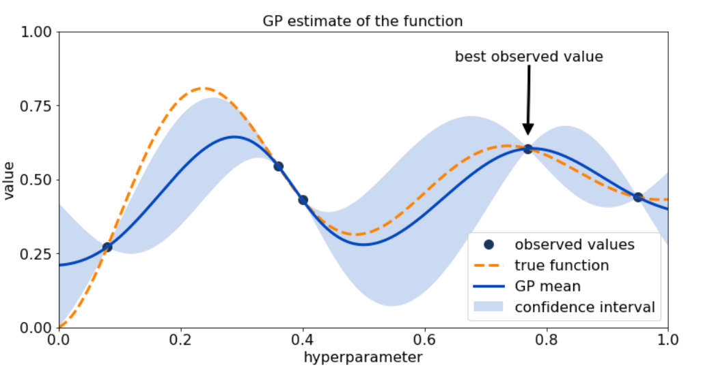

## Table of Contents

## What is Bayesian Optimization and why is it used in machine learning?

Bayesian Optimization is a method used to find the best settings for a system when testing each setting is expensive or time-consuming. Imagine you're trying to bake the perfect cake, but you can only bake one cake a day. You want to use the least number of tries to find the best recipe. Bayesian Optimization helps by making smart guesses about which recipe to try next, based on what you've learned from previous tries. It uses probability to balance exploring new recipes and exploiting what you already know works well.

In machine learning, Bayesian Optimization is often used to fine-tune the parameters of a model. For example, if you're training a neural network, you need to decide on things like the learning rate or the number of layers. Testing all possible combinations would take forever, so Bayesian Optimization comes in handy. It helps you find the best settings with fewer tries, saving time and computational resources. This makes it especially useful in situations where each model evaluation is costly, like in deep learning or when working with large datasets.

## How does Bayesian Optimization differ from traditional optimization methods?

Bayesian Optimization and traditional optimization methods, like grid search or random search, work differently. Traditional methods often involve trying out a lot of different settings in a systematic way. For example, grid search tests every possible combination within a set range, while random search picks settings at random. These methods can be simple to use but they can also be very slow and wasteful, especially when testing each setting takes a long time or costs a lot.

Bayesian Optimization, on the other hand, is smarter about how it chooses which settings to try next. It uses what it has learned from previous tries to make better guesses. It does this by building a model of the system, often using a thing called a Gaussian Process, and then using this model to decide where to look next. This approach can find the best settings much faster than traditional methods because it focuses on the most promising areas. It's like trying to find the best spot to fish in a lake; instead of casting your line randomly or in a grid, you use what you know about where the fish are biting to pick your next spot.

In summary, while traditional optimization methods are straightforward but can be inefficient, Bayesian Optimization is more sophisticated and can save a lot of time and resources. It's especially useful in [machine learning](/wiki/machine-learning) where tuning model parameters can be very expensive.

## What are the key components of Bayesian Optimization?

Bayesian Optimization works by using two main parts: a surrogate model and an acquisition function. The surrogate model is like a map that helps you understand the system you're trying to optimize. It uses what you've learned from previous tries to guess how good different settings might be. A common choice for this map is something called a Gaussian Process, which is good at predicting not just the best settings but also how sure it is about those predictions. The acquisition function is like a guide that tells you where to look next on the map. It uses the information from the surrogate model to decide whether to try settings that are likely to be good or to explore new areas that might be even better.

The way these two parts work together is what makes Bayesian Optimization smart. The surrogate model gets better with each new try, giving you a clearer picture of the system. The acquisition function then uses this updated map to pick the next setting to test. This process keeps going, with each new try helping to refine the map and guide the search more effectively. By balancing the need to explore new areas with the need to exploit what you already know, Bayesian Optimization can find the best settings with fewer tries than traditional methods.

## Can you explain the role of the surrogate model in Bayesian Optimization?

The surrogate model in Bayesian Optimization is like a smart guesser that helps you understand how different settings might work. It uses what you've learned from past tries to make predictions about how good new settings could be. Imagine you're trying to find the best spot to fish in a lake. The surrogate model is like a map that shows you where the fish might be biting based on where you've caught fish before. A popular choice for this map is something called a Gaussian Process, which not only tells you where the best spots might be but also how sure it is about those spots.

As you keep trying different settings, the surrogate model gets better and better at predicting. It learns from each new try and updates its guesses. This means that with every new piece of information, the map becomes more accurate, helping you find the best settings faster. The surrogate model is crucial because it lets Bayesian Optimization make smart decisions about which settings to try next, making the whole process more efficient than just trying settings at random or in a grid.

## What is the acquisition function and how does it guide the search in Bayesian Optimization?

The acquisition function in Bayesian Optimization is like a guide that tells you where to look next on the map created by the surrogate model. It uses the information from the surrogate model to decide which setting to try next. The goal is to balance exploring new areas that might be good with exploiting what you already know works well. Imagine you're looking for treasure on an island. The acquisition function helps you decide whether to dig in a spot where you think the treasure might be, based on your map, or to check out a new area that could have even better treasure.

There are different types of acquisition functions, but they all aim to make the search smarter. For example, one common type is called Expected Improvement (EI). It calculates how much better a new setting might be compared to the best setting you've found so far. The formula for EI is $$ EI(x) = \mathbb{E}[\max(f(x) - f(x^+), 0)] $$, where $$ f(x) $$ is the predicted value at setting $$ x $$, and $$ f(x^+) $$ is the value of the best setting found so far. By using this, the acquisition function helps you pick settings that are likely to give you a big improvement, making the search for the best settings faster and more efficient.

## How do you choose the right surrogate model for a specific problem in Bayesian Optimization?

Choosing the right surrogate model for a specific problem in Bayesian Optimization depends on the nature of the problem and the data you're working with. The most common choice is a Gaussian Process (GP) because it's good at modeling complex functions and can give you both a prediction and a measure of uncertainty. This uncertainty helps the acquisition function decide where to look next. If your problem has a lot of data points or is very high-dimensional, a GP might be too slow, so you might want to use something simpler like a Random Forest or a Tree-structured Parzen Estimator (TPE). These alternatives can handle larger datasets and higher dimensions more efficiently.

Another [factor](/wiki/factor-investing) to consider is how much you know about the function you're trying to optimize. If you have some prior knowledge or assumptions about the function, you can use this to tailor the surrogate model. For example, if you know the function is smooth, you might stick with a GP because it can model smooth functions well. But if the function is noisy or has sudden jumps, you might need to adjust the GP or try a different model that can handle these characteristics better. The key is to match the model to the problem's characteristics to get the best performance from your Bayesian Optimization.

## What are common acquisition functions used in Bayesian Optimization and their trade-offs?

In Bayesian Optimization, the acquisition function helps decide which setting to try next. There are several common acquisition functions, each with its own way of balancing exploration and exploitation. One popular function is Expected Improvement (EI). EI calculates how much better a new setting might be compared to the best setting you've found so far. The formula for EI is $$ EI(x) = \mathbb{E}[\max(f(x) - f(x^+), 0)] $$, where $$ f(x) $$ is the predicted value at setting $$ x $$, and $$ f(x^+) $$ is the value of the best setting found so far. EI is good at finding improvements quickly, but it can sometimes get stuck if the best setting so far is already pretty good.

Another common acquisition function is Probability of Improvement (PI). PI looks at the chance that a new setting will be better than the best setting you've found. The formula for PI is $$ PI(x) = P(f(x) > f(x^+)) $$. PI is simpler to calculate than EI, but it might not focus as much on how much better a new setting could be, just whether it's better at all. A third function is Upper Confidence Bound (UCB), which balances exploration and exploitation by using both the predicted value and the uncertainty of the prediction. The formula for UCB is $$ UCB(x) = \mu(x) + \kappa \sigma(x) $$, where $$ \mu(x) $$ is the predicted value, $$ \sigma(x) $$ is the uncertainty, and $$ \kappa $$ is a parameter that controls the balance between exploration and exploitation. UCB can be very effective but choosing the right $$ \kappa $$ can be tricky.

Each of these acquisition functions has its strengths and weaknesses. EI is good for quickly finding improvements but might miss out on exploring new areas if the current best setting is already good. PI is easier to calculate and focuses on any improvement, but it might not push for big improvements. UCB can balance exploration and exploitation well, but it requires tuning the $$ \kappa $$ parameter. The choice of acquisition function depends on the specific needs of your problem, like how important it is to find big improvements quickly versus exploring more thoroughly.

## How does Bayesian Optimization handle the exploration-exploitation trade-off?

Bayesian Optimization handles the exploration-exploitation trade-off by using an acquisition function that decides where to look next based on what the surrogate model knows. The surrogate model, often a Gaussian Process, predicts how good different settings might be and also how sure it is about those predictions. The acquisition function then uses these predictions to balance trying settings that are likely to be good (exploitation) with trying new settings that might be even better (exploration). For example, the Expected Improvement (EI) acquisition function calculates how much better a new setting might be compared to the best one found so far. Its formula is $$ EI(x) = \mathbb{E}[\max(f(x) - f(x^+), 0)] $$, where $$ f(x) $$ is the predicted value at setting $$ x $$, and $$ f(x^+) $$ is the value of the best setting found so far. This helps focus on settings that could give a big improvement.

Different acquisition functions handle the trade-off in different ways. The Probability of Improvement (PI) function looks at the chance that a new setting will be better than the best setting found so far, using the formula $$ PI(x) = P(f(x) > f(x^+)) $$. PI is simpler to calculate but might not push for big improvements as much as EI. The Upper Confidence Bound (UCB) function balances exploration and exploitation by considering both the predicted value and the uncertainty of the prediction. Its formula is $$ UCB(x) = \mu(x) + \kappa \sigma(x) $$, where $$ \mu(x) $$ is the predicted value, $$ \sigma(x) $$ is the uncertainty, and $$ \kappa $$ is a parameter that controls the balance. UCB can be very effective but choosing the right $$ \kappa $$ can be tricky. By using these different strategies, Bayesian Optimization can smartly navigate the trade-off between exploring new possibilities and exploiting known good settings.

## Can you describe a practical example where Bayesian Optimization has been successfully applied?

A practical example where Bayesian Optimization has been successfully applied is in the tuning of hyperparameters for machine learning models. Imagine a company that wants to improve their image recognition software. They need to find the best settings for their [neural network](/wiki/neural-network), such as the learning rate, the number of layers, and the number of neurons in each layer. Testing all possible combinations would take forever, so they use Bayesian Optimization. By using a Gaussian Process as the surrogate model and Expected Improvement (EI) as the acquisition function, they can quickly find the best settings. The EI formula is $$ EI(x) = \mathbb{E}[\max(f(x) - f(x^+), 0)] $$, which helps them focus on settings that are likely to give big improvements. After a few tries, they find a setting that works much better than their initial guess, saving them a lot of time and computational resources.

Another example is in the field of drug discovery, where testing each potential drug compound is expensive and time-consuming. Researchers use Bayesian Optimization to find the best chemical structures that might lead to effective drugs. They start with a few initial compounds and use a surrogate model, often a Gaussian Process, to predict how well new compounds might work. The acquisition function, like Upper Confidence Bound (UCB) with the formula $$ UCB(x) = \mu(x) + \kappa \sigma(x) $$, helps them decide which new compounds to test next. This approach has helped them find promising drug candidates much faster than traditional methods, making the drug discovery process more efficient and cost-effective.

## What are the challenges and limitations of using Bayesian Optimization in real-world scenarios?

One of the main challenges of using Bayesian Optimization in real-world scenarios is that it can be slow and computationally expensive, especially when dealing with high-dimensional problems. The surrogate model, often a Gaussian Process, needs to keep track of a lot of data and make predictions, which can take a lot of time and memory. For example, if you're trying to optimize a machine learning model with many hyperparameters, each evaluation can be costly, and Bayesian Optimization might take too long to find the best settings. Another challenge is choosing the right acquisition function. Different functions like Expected Improvement (EI) with the formula $$ EI(x) = \mathbb{E}[\max(f(x) - f(x^+), 0)] $$ or Upper Confidence Bound (UCB) with the formula $$ UCB(x) = \mu(x) + \kappa \sigma(x) $$ have different strengths and weaknesses, and [picking](/wiki/asset-class-picking) the wrong one can lead to poor results.

Another limitation is that Bayesian Optimization assumes the function being optimized is smooth and continuous, which might not always be the case in real-world scenarios. If the function has sudden jumps or is very noisy, the surrogate model might struggle to make accurate predictions, leading to less effective optimization. Additionally, Bayesian Optimization can sometimes get stuck in local optima, especially if the acquisition function focuses too much on exploitation and not enough on exploration. Balancing exploration and exploitation is tricky and can depend a lot on the specific problem and the data available. Despite these challenges, Bayesian Optimization remains a powerful tool for optimizing expensive-to-evaluate functions, but users need to be aware of its limitations and carefully set it up for their specific needs.

## How can Bayesian Optimization be scaled to high-dimensional problems?

Scaling Bayesian Optimization to high-dimensional problems can be tough because the more dimensions you have, the harder it is for the surrogate model to make good predictions. A common way to deal with this is by using simpler models like Random Forests or Tree-structured Parzen Estimators (TPE) instead of Gaussian Processes. These models are faster and can handle more dimensions better. Another trick is to use something called dimensionality reduction, where you try to find a smaller set of important settings that still capture the main features of your problem. This makes the optimization easier and quicker.

Another approach is to use a method called batch Bayesian Optimization. Instead of picking one setting to try at a time, you pick several settings to test all at once. This can speed things up a lot, especially if each test takes a long time. The acquisition function, like Expected Improvement with the formula $$ EI(x) = \mathbb{E}[\max(f(x) - f(x^+), 0)] $$, needs to be adjusted to pick multiple settings that are likely to give good results. By using these methods, you can make Bayesian Optimization work better for high-dimensional problems, even though it's still a challenge.

## What are the latest advancements in Bayesian Optimization research?

Recent advancements in Bayesian Optimization research have focused on making it work better with high-dimensional problems. One big step forward is the use of new surrogate models that are faster and can handle more dimensions. For example, researchers have been looking into using [deep learning](/wiki/deep-learning) models like neural networks instead of traditional Gaussian Processes. These new models can learn from data more quickly and make better predictions in high-dimensional spaces. Another important development is the use of dimensionality reduction techniques. These methods help find the most important settings to focus on, making the optimization process easier and faster. By combining these approaches, Bayesian Optimization can now tackle problems that were too complex before.

Another area of advancement is in the design of new acquisition functions. Researchers have been working on functions that can balance exploration and exploitation even better. For example, some new functions use ideas from [reinforcement learning](/wiki/reinforcement-learning) to make smarter decisions about where to look next. These functions can help Bayesian Optimization find the best settings more quickly and reliably. Additionally, there's been progress in batch Bayesian Optimization, where multiple settings are tested at once. This can speed up the process a lot, especially when each test is expensive. By testing several settings together, researchers can gather more information in less time, making the whole optimization process more efficient.