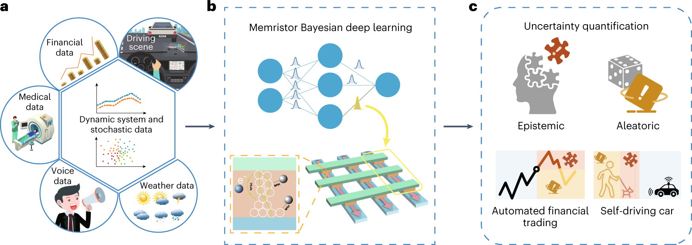

## Table of Contents

## What is Bayesian Reinforcement Learning and how does it differ from traditional Reinforcement Learning?

Bayesian Reinforcement Learning is a type of machine learning where the computer learns to make better decisions over time by using something called probability. In this approach, the computer doesn't just follow a set of rules to make decisions; it also keeps track of how sure it is about those decisions. It uses a concept called a "belief state" to represent its current understanding of the world, and it updates this belief state as it gets new information. This means the computer can be more flexible and can change its mind about what it thinks is the best action if it gets new evidence that suggests otherwise.

Traditional Reinforcement Learning, on the other hand, usually works by trying to find the best action through trial and error. It uses a reward signal to tell if an action was good or bad, and then it adjusts its strategy to try to get more rewards in the future. Unlike Bayesian Reinforcement Learning, traditional methods often don't keep track of how certain they are about their decisions. They might use a simple average of past experiences to decide what to do next, without considering how reliable those experiences are. So, while traditional methods can be very effective, they might not adapt as well to new or unexpected situations compared to Bayesian methods.

## Can you explain the basic components of a Bayesian Reinforcement Learning model?

A Bayesian Reinforcement Learning model has a few key parts that work together to help the computer learn and make decisions. One important part is the belief state, which is like the computer's current understanding of the world. The belief state is updated every time the computer gets new information, using something called Bayes' rule. This rule helps the computer figure out how likely different things are to be true based on what it has seen so far. Another part is the policy, which is the set of rules the computer uses to decide what to do next. The policy takes into account the current belief state to choose actions that are likely to lead to good outcomes.

The second key part of a Bayesian Reinforcement Learning model is the reward function. This function tells the computer how good or bad different outcomes are. The computer uses this information to figure out which actions are worth taking. Finally, there's the value function, which helps the computer estimate how good it is to be in a certain situation. This function looks at the current belief state and the possible future rewards to decide how valuable a situation is. Together, these components help the computer learn and improve its decision-making over time, always taking into account how certain it is about what it knows.

## How does the Bayesian approach handle uncertainty in Reinforcement Learning?

The Bayesian approach in Reinforcement Learning deals with uncertainty by using something called a belief state. This belief state is like a map of what the computer thinks is true about the world right now. It keeps track of how sure the computer is about different things. When the computer sees new information, it uses Bayes' rule to update its belief state. This rule helps the computer figure out how to change its mind based on new evidence. For example, if the computer thought there was a 70% chance that taking a certain action would lead to a reward, but then it tried the action and didn't get a reward, it would use Bayes' rule to lower its belief in that action.

This way of handling uncertainty is different from traditional methods because it doesn't just look at what happened in the past. Instead, it thinks about how reliable the past experiences are. If the computer is not very sure about something, it might decide to explore more to get better information. This makes the computer more flexible and better at adapting to new situations. For instance, if the computer is unsure about which action is best in a certain situation, it might try different actions to gather more data and improve its belief state. This helps the computer make better decisions over time, even when the world is unpredictable.

## What are the advantages of using Bayesian methods in Reinforcement Learning?

One big advantage of using Bayesian methods in Reinforcement Learning is that they help the computer handle uncertainty better. In traditional methods, the computer might just look at what happened before and make decisions based on that. But in Bayesian methods, the computer keeps track of how sure it is about different things. It uses something called a belief state, which is like a map of what the computer thinks is true right now. When the computer sees new information, it updates this belief state using Bayes' rule, which helps it figure out how to change its mind based on new evidence. This makes the computer more flexible and better at adapting to new or unexpected situations.

Another advantage is that Bayesian methods can help the computer explore more effectively. If the computer is not very sure about something, it might decide to try different actions to gather more information. This is called exploration, and it's important for learning in unpredictable environments. By considering how reliable its past experiences are, the computer can make smarter choices about when to explore and when to stick with what it knows. This can lead to better overall performance, especially in situations where the world is changing or where the computer doesn't have a lot of data to start with.

## What are some common challenges faced when implementing Bayesian Reinforcement Learning?

One common challenge when implementing Bayesian Reinforcement Learning is that it can be computationally expensive. Updating the belief state using Bayes' rule involves a lot of math, especially if the computer is trying to keep track of a lot of different possibilities. This can slow down the learning process and make it hard to use Bayesian methods on big, complicated problems. Another challenge is that it can be tricky to set up the model right. You need to choose good starting beliefs and make sure the model is set up in a way that matches the real world. If you get this wrong, the computer might not learn well or might make bad decisions.

Another challenge is that Bayesian Reinforcement Learning can be sensitive to the initial beliefs and the way the model is set up. If the computer starts with beliefs that are too far from the truth, it might take a long time to correct those beliefs, even with new information. This can lead to slow learning or poor performance at the start. Also, if the model doesn't match the real world well, the computer might not be able to make good decisions, no matter how much it learns. So, it's important to spend time making sure the model is set up right and that the initial beliefs are as close to the truth as possible.

## How does Bayesian Reinforcement Learning incorporate prior knowledge into the learning process?

Bayesian Reinforcement Learning uses prior knowledge by starting with what's called a prior belief. This is like a guess about how the world works before the computer starts learning. The computer uses this guess to help it make decisions at the beginning. As the computer gets more information, it updates its beliefs using something called Bayes' rule. This rule helps the computer figure out how to change its mind based on new evidence. For example, if the computer starts with a belief that a certain action has a 60% chance of leading to a reward, and then it tries the action and gets a reward, it will use Bayes' rule to increase its belief in that action. This way, the computer can use what it already knows to learn faster and make better decisions.

Another way Bayesian Reinforcement Learning incorporates prior knowledge is by using a model of the world that includes this knowledge. This model helps the computer understand how different actions might lead to different outcomes. The computer can then use this model to plan its actions and update its beliefs. For instance, if the computer knows from prior knowledge that a certain action usually leads to a reward in certain situations, it can use this information to decide what to do next. As the computer learns more, it can refine this model to make it more accurate. This helps the computer make better decisions over time, even when the world is unpredictable.

## Can you describe a simple example of a problem that can be solved using Bayesian Reinforcement Learning?

Imagine you are a robot trying to find the best path to a treasure in a maze. You start with some guesses about where the treasure might be, but you're not sure. This is your prior belief. As you move through the maze, you find clues that help you update your guesses. For example, if you find a sign pointing left, you might think the treasure is more likely to be that way. You use Bayes' rule to update your belief about where the treasure is every time you find a new clue. This helps you make better decisions about which way to go next.

In this example, the robot uses Bayesian Reinforcement Learning to figure out the best path. It starts with a belief state that represents its guesses about the maze. As it moves and finds clues, it updates this belief state using Bayes' rule. The robot also has a reward function that tells it how good it is to find the treasure. By combining its updated beliefs with the reward function, the robot can choose the best actions to take. This way, it learns to navigate the maze more effectively, even if the clues it finds are sometimes confusing or misleading.

## What are the key algorithms used in Bayesian Reinforcement Learning and how do they work?

One key algorithm in Bayesian Reinforcement Learning is the Bayesian Q-Learning algorithm. This algorithm helps the computer learn the best actions to take by keeping track of how sure it is about different choices. It uses a thing called a Q-function, which tells the computer how good different actions are in different situations. The computer starts with guesses about the Q-function, called the prior, and updates these guesses as it tries different actions and sees what happens. It uses Bayes' rule to update its beliefs about the Q-function. For example, if the computer tries an action and gets a reward, it will use Bayes' rule to increase its belief that this action is good. This helps the computer make better decisions over time, even when it's not sure about everything.

Another important algorithm is the Bayesian Dynamic Programming algorithm. This algorithm helps the computer plan its actions by thinking about the future. It uses a model of the world to predict what might happen next and figures out the best actions to take based on these predictions. The computer starts with a guess about the model, called the prior, and updates this guess as it learns more. It uses something called a value function to figure out how good it is to be in different situations. The value function looks at the current belief state and the possible future rewards to decide how valuable a situation is. By combining its updated beliefs with the value function, the computer can choose the best actions to take and learn to make better decisions over time.

## How does Bayesian Reinforcement Learning perform in environments with sparse rewards?

Bayesian Reinforcement Learning can be really helpful in environments where rewards are sparse. In these situations, the computer might not get a lot of feedback about whether its actions are good or bad. But with Bayesian methods, the computer keeps track of how sure it is about different things using a belief state. When it does get a reward, even if it's rare, it can use Bayes' rule to update its belief about what led to that reward. This means the computer can learn from very little information and make better guesses about what to do next, even when rewards are hard to come by.

For example, imagine a robot trying to find a treasure in a big maze where it only gets a reward when it reaches the treasure. The robot starts with some guesses about where the treasure might be and updates these guesses every time it finds a clue. Even if the clues are few and far between, the robot can use Bayesian methods to slowly but surely get closer to the treasure. By considering how reliable its past experiences are, the robot can make smart choices about where to explore next, even in a big, empty maze with very few rewards.

## What role does the posterior distribution play in Bayesian Reinforcement Learning?

In Bayesian Reinforcement Learning, the posterior distribution is really important because it helps the computer figure out what it believes about the world after it sees new information. The computer starts with a guess about how things work, called the prior distribution. When it tries different actions and sees what happens, it uses Bayes' rule to update its guess. This updated guess is the posterior distribution. It tells the computer how likely different things are to be true now, based on what it has seen so far. For example, if the computer thought there was a 50% chance that going left would lead to a reward, but then it went left and got a reward, the posterior distribution would show a higher chance for that action.

The posterior distribution helps the computer make better decisions over time. By keeping track of how sure it is about different things, the computer can choose actions that are more likely to lead to good outcomes. If the computer is not very sure about something, it might decide to explore more to get better information. This makes the computer more flexible and better at adapting to new situations. The posterior distribution is like a map that the computer uses to navigate the world, always updating as it learns more.

## How can Bayesian Reinforcement Learning be applied to real-world scenarios, such as robotics or autonomous driving?

In robotics, Bayesian Reinforcement Learning can help a robot learn to do tasks better over time. Imagine a robot that needs to pick up objects in a factory. The robot starts with some guesses about where the objects might be and how to pick them up. As it tries different actions and sees what happens, it uses Bayesian methods to update its beliefs. This means the robot can get better at finding and picking up objects, even if the factory changes or if the objects move around. By keeping track of how sure it is about different things, the robot can make smart choices about what to do next, even when it's not sure about everything.

In autonomous driving, Bayesian Reinforcement Learning can help a car learn to drive safely and efficiently. The car starts with some guesses about how other cars might behave and what the best driving actions are. As it drives and sees what happens, it uses Bayesian methods to update these guesses. This helps the car make better decisions about when to speed up, slow down, or change lanes. By considering how reliable its past experiences are, the car can adapt to new situations, like different weather conditions or unexpected road changes. This makes the car safer and better at getting where it needs to go, even in unpredictable environments.

## What are the current research trends and future directions in Bayesian Reinforcement Learning?

Current research in Bayesian Reinforcement Learning is focusing on making the learning process faster and more efficient. One big trend is developing better ways to handle big, complicated problems. Researchers are working on algorithms that can update the computer's beliefs more quickly, even when there's a lot of information to process. Another trend is using Bayesian methods to help computers explore more effectively. This means finding ways for the computer to try new actions and gather more data, especially in situations where rewards are hard to come by. Researchers are also looking at how to use Bayesian Reinforcement Learning with other types of machine learning, like deep learning, to make the computer's decisions even better.

In the future, Bayesian Reinforcement Learning could be used in more real-world scenarios, like healthcare and finance. For example, doctors could use it to figure out the best treatments for patients, even when they don't have a lot of information. In finance, it could help people make better investment decisions by considering how sure they are about different outcomes. Another direction is making the algorithms easier to use for people who aren't experts in machine learning. This means creating tools and software that help people set up and use Bayesian Reinforcement Learning models without needing to know a lot of math. As these trends and future directions develop, Bayesian Reinforcement Learning could become even more powerful and useful in many different areas.