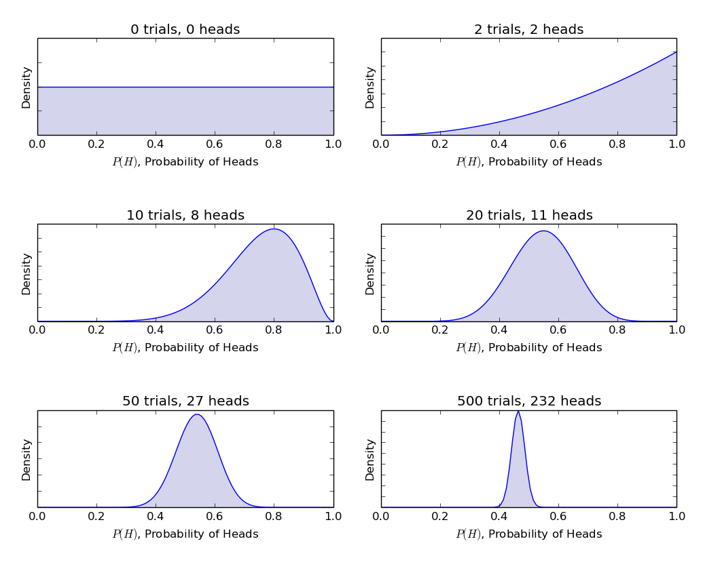

## Table of Contents

## What is Bayesian statistics?

Bayesian statistics is a way of understanding probability that is different from the traditional, or "frequentist," approach. In Bayesian statistics, we think of probability as a measure of belief or uncertainty about something. For example, if you want to know the chance that it will rain tomorrow, a Bayesian would consider not just past weather data but also current weather conditions and forecasts. They would then update their belief about the chance of rain as new information comes in.

The key idea in Bayesian statistics is Bayes' theorem, which is a mathematical formula that shows how to update our beliefs in light of new evidence. Imagine you have a preliminary guess about something, called a "prior." When you get new data, you use Bayes' theorem to combine this new data with your prior to get a new, updated belief, called a "posterior." This method is very useful in many fields, like medicine, where doctors might start with a suspicion about a diagnosis and then refine it as test results come in.

Bayesian methods are powerful because they allow us to incorporate all kinds of information, not just data from experiments or observations. This makes them flexible and adaptable to real-world situations where information is often incomplete or uncertain. However, they can also be more complex to use and require more computational power than traditional statistics, which is why they are sometimes seen as more challenging. Despite this, the ability to continuously update our understanding makes Bayesian statistics a valuable tool in many areas of science and decision-making.

## How does Bayesian statistics differ from frequentist statistics?

Bayesian and frequentist statistics are two different ways of thinking about probability and uncertainty. In frequentist statistics, probability is seen as the long-run frequency of an event happening if you repeat the same experiment many times. For example, if you flip a coin many times, the probability of heads is how often heads comes up in the long run. Frequentists use this idea to make decisions based on data, often using methods like hypothesis testing and confidence intervals. They don't update their beliefs with new data; instead, they look at how likely it is to get the data they have if a certain hypothesis is true.

On the other hand, Bayesian statistics sees probability as a measure of belief or uncertainty about something. If you want to know the chance it will rain tomorrow, a Bayesian would start with a guess, called a "prior," and then update this guess as new information comes in, like weather forecasts or current conditions. This updated belief is called a "posterior." Bayesians use a tool called Bayes' theorem to do this updating. This approach is useful because it lets you include all kinds of information, not just data from experiments, making it more flexible for real-world situations.

The main difference between the two is how they handle uncertainty and new information. Frequentists stick to the data they have and don't change their approach based on new evidence, while Bayesians are always ready to update their beliefs. This makes Bayesian statistics more adaptable but also more complex, often requiring more computational power. Both approaches have their strengths and are used in different fields depending on the situation.

## What is Bayes' Theorem and how is it used in Bayesian statistics?

Bayes' Theorem is a math rule that helps us update our guesses about something when we get new information. Imagine you have a first guess about something, like the chance it will rain tomorrow. This first guess is called your "prior." When you get new information, like a weather forecast, Bayes' Theorem tells you how to mix this new information with your first guess to make a new, better guess. This new guess is called your "posterior." It's like updating your belief as you learn more.

In Bayesian statistics, Bayes' Theorem is super important because it's the tool that lets us keep updating our beliefs. Let's say you're trying to figure out if a new medicine works. You start with a guess about how likely it is to work, based on what you know already. Then, you do a study and get results. With Bayes' Theorem, you can take those results and update your guess to see if the medicine is more or less likely to work than you thought before. This way, Bayesian statistics helps us make better decisions by always using the latest information.

## What are prior, likelihood, and posterior distributions in Bayesian analysis?

In Bayesian analysis, the prior distribution is like your first guess about something before you see any new data. Imagine you want to know if a coin is fair. Your prior might be that you think it's equally likely to be heads or tails. This prior is based on what you know or believe before you start flipping the coin. It's your starting point.

The likelihood is how well your data fits with your guess. If you flip the coin and get heads a lot, the likelihood tells you how well this fits with your idea that the coin is fair. It's like checking if what you see matches what you thought would happen. The likelihood helps you see if your first guess needs to change.

The posterior distribution is what you believe after you've looked at your data. It's a mix of your first guess (prior) and what the data tells you (likelihood). Using the coin example, if you flipped it a lot and got heads more often than tails, your posterior would show that you now think the coin might not be fair. The posterior is your updated belief, and it's what you use to make decisions after considering all the new information.

## How do you choose a prior distribution?

Choosing a prior distribution is like picking your starting guess before you look at any new data. You can use what you already know or believe about something. For example, if you're guessing about the weather, you might start with what the weather has been like recently. Or, if you're trying to figure out if a medicine works, you might use what other studies have found. The important thing is to pick a prior that makes sense with what you know before you start.

Sometimes, people use what's called an "uninformative prior." This is like saying you don't know much to start with, so you give all possibilities an equal chance. It's useful when you don't want your first guess to affect your final answer too much. Other times, you might use an "informative prior" if you have a strong belief or a lot of information already. The choice depends on how much you know and how much you want that knowledge to influence your final decision.

## What is the role of updating beliefs in Bayesian statistics?

In Bayesian statistics, updating beliefs is super important. It's like changing your mind as you learn new things. Imagine you have a guess about something, like how likely it is to rain tomorrow. When you get new information, like a weather forecast, you use this to make your guess better. This way, your beliefs keep getting more accurate as you learn more.

This process of updating beliefs uses a math rule called Bayes' Theorem. It helps you mix your first guess with new information to get a new, better guess. This is really helpful because it lets you use all kinds of information, not just numbers from experiments. It's like always having the latest and best information to make decisions.

## Can you explain the concept of credible intervals in Bayesian statistics?

In Bayesian statistics, a credible interval is like a range of guesses that you think are most likely to be right. Imagine you want to know how tall a tree is. You start with a guess and then use new information, like measuring the tree, to update your guess. A credible interval is the range of heights that you think the tree is most likely to be, after you've used all your information.

The cool thing about credible intervals is that they let you say how sure you are about your guess. If you say you're 95% sure the tree is between 10 and 15 feet tall, that means you think there's a 95% chance the true height is in that range. This is different from frequentist statistics, where they use something called a confidence interval. Credible intervals are more about what you believe after looking at all the evidence, and they're easier to understand because they talk about how likely something is, not just what would happen if you did the same thing many times.

## How is Bayesian inference applied in real-world scenarios?

Bayesian inference is used in many real-world situations where people need to make decisions based on what they know and what they learn. For example, in medicine, doctors use Bayesian methods to figure out if a patient has a certain disease. They start with a guess about how likely the disease is based on the patient's symptoms and medical history. Then, as they get results from tests, they update their guess to see if the disease is more or less likely. This helps them make better decisions about treatment because they're always using the latest information.

Another place where Bayesian inference is helpful is in weather forecasting. Meteorologists start with a guess about the weather based on past data and current conditions. As new information comes in, like satellite images or temperature readings, they update their guess to make a more accurate forecast. This way, the weather report you see on TV or your phone app is always based on the most up-to-date information, helping you plan your day better.

## What are some common computational methods used in Bayesian statistics, such as MCMC?

In Bayesian statistics, one of the most common computational methods is Markov Chain Monte Carlo, or MCMC for short. MCMC is like a smart way to guess a lot of times to figure out what's most likely to be true. Imagine you're trying to find a treasure on a big island. You start at a random spot and then move around, always trying to go to spots that seem more likely to have the treasure. Over time, you visit more and more of the island, and the places you visit the most are probably where the treasure is. In Bayesian statistics, MCMC helps you explore all the possible answers to a question and find the ones that fit the data best.

Another method used in Bayesian statistics is called variational inference. This method is like trying to find a good guess quickly instead of exploring every possibility. Imagine you're trying to guess the weight of a big box. Instead of weighing the box many times, you might use what you know about similar boxes and come up with a good guess fast. Variational inference does something similar by using math to find a good guess about what's most likely to be true, without having to check every single possibility. Both MCMC and variational inference help make Bayesian statistics easier to use, even when the math gets really complicated.

## How do you assess the convergence of a Bayesian model?

When you're working with a Bayesian model, checking if it's converged is really important. Convergence means that your model has explored all the possible answers well enough to give you good guesses. One way to check this is by using something called trace plots. A trace plot shows how your guesses change over time as the model runs. If the plot looks like a wiggly line that stays in the same area without big jumps, it's a good sign that your model has converged. Another way is to use something called the Gelman-Rubin statistic. This compares different runs of your model to see if they all end up in the same place. If the statistic is close to 1, it means your model has probably converged.

Another tool for checking convergence is autocorrelation plots. These plots show how much your guesses depend on the guesses right before them. If the autocorrelation drops off quickly, it's a good sign that your model is mixing well and has converged. You can also use effective sample size (ESS) to see if your model has run long enough. A higher ESS means your model has explored more possibilities, which is good for convergence. By using these different methods together, you can feel more confident that your Bayesian model has given you reliable results.

## What are some challenges and criticisms of Bayesian methods?

One big challenge with Bayesian methods is that they can be hard to use because they need a lot of math and computer power. You have to start with a guess, called a prior, and then use a special rule, Bayes' Theorem, to update your guess with new information. This can get really complicated, especially when you're dealing with a lot of data or really complex problems. It can take a long time for computers to do all the calculations, and sometimes you need special software to help. This can make Bayesian methods seem harder than other ways of doing statistics.

Another criticism of Bayesian methods is that the results can depend a lot on your starting guess, the prior. If you pick a bad prior, it can lead you to the wrong answer, even if you have good data. This can be a problem because different people might pick different priors, and that can lead to different results. Some people worry that this makes Bayesian methods less objective than other methods. But, if you're careful about choosing your prior and you use good data, Bayesian methods can still give you really useful and accurate answers.

## How can Bayesian statistics be integrated with machine learning and artificial intelligence?

Bayesian statistics can be really helpful in machine learning and artificial intelligence because it helps these systems learn from data in a smart way. Imagine you're teaching a computer to recognize pictures of cats and dogs. You start with a guess about what makes a picture a cat or a dog, and then as the computer sees more pictures, it uses Bayesian methods to update its guesses. This way, the computer keeps getting better at recognizing cats and dogs because it's always using the latest information. This is called Bayesian machine learning, and it's useful because it can handle uncertainty and make better predictions, even when the data is messy or incomplete.

In artificial intelligence, Bayesian methods help make decisions that are more like how humans think. For example, in a self-driving car, the system has to guess what other drivers might do next. It starts with a guess based on what it knows about how people usually drive, and then it updates that guess as it sees what's happening on the road. This helps the car make safer and smarter decisions because it's always using the most up-to-date information. By using Bayesian statistics, AI systems can learn and adapt in a way that feels more natural and can handle the uncertainties of the real world.

## What is Understanding Bayesian Statistics?

Bayesian statistics is a mathematical framework that fundamentally revolves around updating the probability of a hypothesis as more evidence or information becomes available. At the heart of this approach lies Bayes' Theorem, a formula that establishes a relationship between conditional and marginal probabilities of events. The theorem is expressed as:

$$
P(H|E) = \frac{P(E|H) \cdot P(H)}{P(E)}
$$

Here, $P(H|E)$ represents the posterior probability, or the probability of the hypothesis $H$ given the evidence $E$. $P(E|H)$ is the likelihood, indicating the probability of observing the evidence given that the hypothesis is true. $P(H)$ is the prior probability, representing the initial belief about the hypothesis before considering the evidence. Finally, $P(E)$ is the marginal likelihood, the total probability of observing the evidence under all possible hypotheses.

Key to Bayesian [statistics](/wiki/bayesian-statistics) is the notion of prior, likelihood, and posterior probabilities, each serving a critical role in the process of belief updating:

1. **Prior Probability ($P(H)$)**: This quantifies the initial belief about the hypothesis before observing any new data. It encapsulates prior knowledge or assumptions, which can be subjective.

2. **Likelihood ($P(E|H)$)**: This term measures how well the evidence supports a given hypothesis. It is crucial for evaluating different hypotheses based on the same data.

3. **Posterior Probability ($P(H|E)$)**: This reflects the updated belief about the hypothesis after considering the new evidence. It combines the prior and the likelihood to provide a comprehensive understanding of the hypothesis in light of the data.

Bayesian inference is thus an iterative process, continuously refining predictions as more data becomes available. This characteristic makes Bayesian methods particularly suited for dynamic environments where data continuously changes or accumulates, such as in [algorithmic trading](/wiki/algorithmic-trading).

The application of Bayesian statistics allows for a structured approach to incorporate new evidence into existing models, effectively integrating both prior beliefs and new information to make informed decisions. As such, Bayesian methods provide flexibility and rigor in evaluating hypotheses and optimizing decision-making processes.

## What are the differences between Bayesian and Frequentist methods?

Bayesian and Frequentist statistics represent two distinct paradigms for interpreting probability, each with its unique methods and philosophical underpinnings, significantly impacting their application in fields like algorithmic trading.

Bayesian statistics defines probability as a measure of belief or confidence in the occurrence of an event. This approach allows for the incorporation of prior information, which can be updated with new data to form a posterior distribution. The central formula governing Bayesian inference is Bayes' Theorem, given by:

$$
P(\theta | X) = \frac{P(X | \theta) \cdot P(\theta)}{P(X)}
$$

where $P(\theta | X)$ is the posterior probability of the parameter $\theta$ given data $X$, $P(X | \theta)$ is the likelihood of observing data $X$ given parameter $\theta$, $P(\theta)$ is the prior probability of $\theta$, and $P(X)$ is the marginal likelihood of data.

In contrast, Frequentist statistics interprets probability as the long-term frequency of events occurring across repeated trials. Unlike Bayesian methods, Frequentist approaches do not incorporate prior beliefs or information about parameters; instead, they rely purely on data derived from such trials. This is commonly expressed through confidence intervals and p-values, with an emphasis on testing fixed hypotheses.

One of the key philosophical differences lies in the treatment of unknown parameters. Bayesian methods treat parameters as random variables with specific distributions, while Frequentist methods view them as fixed but unknown quantities. For algorithmic trading, this distinction influences decision-making strategies. Bayesian techniques can continuously update model parameters as new market data becomes available, offering a dynamic and adaptive framework for prediction and decision-making. Frequentist methods, however, provide consistency and objectivity through established testing frameworks without the influence of subjective priors.

Understanding these differing philosophies is crucial for selecting the appropriate statistical approach in algorithmic trading. Bayesian methods might be preferable when prior information is valuable and model adaptability is essential, whereas Frequentist methods may be more suitable in scenarios requiring objective, data-driven analysis without prior bias. Each paradigm offers distinct advantages and limitations, and a nuanced understanding can guide traders in optimizing their strategies based on specific goals and data scenarios.

## What is Bayesian Optimization in Hyperparameter Tuning?

Bayesian optimization presents a sophisticated approach for hyperparameter tuning within algorithmic trading models, demonstrating superior performance over traditional methods such as grid or random search techniques. By leveraging a probabilistic model, Bayesian optimization effectively identifies the most promising hyperparameters based on previous evaluations. This process entails constructing a surrogate model, commonly a Gaussian Process, which approximates the objective function over the hyperparameter space. The surrogate model is iteratively refined as new evaluations are conducted, allowing it to predict performance and quantify uncertainty.

The key advantage of Bayesian optimization is its efficiency in resource utilization. Unlike exhaustive grid search, which evaluates every point in the hyperparameter space, or random search, which samples points independently, Bayesian optimization strategically selects points that optimize a balance between exploration (trying parameters with high uncertainty) and exploitation (focusing on parameters that are currently known to perform well). This balance is typically achieved using an acquisition function such as Expected Improvement (EI) or Upper Confidence Bound (UCB), which guides the selection of the next set of hyperparameters to evaluate.

For instance, let $f(x)$ be the unknown objective function we wish to optimize, and $\mathcal{GP}(\mu(x), k(x, x'))$ be the surrogate model, where $\mu(x)$ represents the mean function and $k(x, x')$ the kernel function of the Gaussian Process capturing correlations between points. The acquisition function, say EI, is defined as:

$$
\text{EI}(x) = \mathbb{E}\left[\max(0, f(x_{\text{best}}) - f(x))\right]
$$

where $x_{\text{best}}$ is the current best observed point. The optimization loop involves selecting the hyperparameter $x_{\text{new}}$ that maximizes the acquisition function and evaluating $f(x_{\text{new}})$.

Integrating Bayesian optimization within algorithmic trading strategies facilitates the discovery of hyperparameters that improve model accuracy and robustness without exhaustive resource expenditure. As a result, the efficiency in model development and the subsequent enhancements in forecasting performance position Bayesian optimization as a critical component of modern trading strategy design. This adaptive learning process is particularly beneficial in dynamic financial environments, where the ability to continuously refine and improve models confers a significant competitive edge.

## How can Bayesian methods improve trading strategies according to the case study?

A practical example of Bayesian inference enhancing a trading strategy can be observed in the application to a [momentum](/wiki/momentum)-based stock trading system. In this scenario, the objective is to adaptively manage buy and sell decisions based on the dynamic assessment of market conditions, using Bayesian networks to model uncertainty and market movements.

In implementing this strategy, traders start with an initial belief or prior probability about the direction of a stock's momentum, derived from historical data. As new market data streams in, such as price changes and trading [volume](/wiki/volume-trading-strategy), Bayesian inference allows traders to update their belief system in real-time. The posterior distribution, which represents the updated beliefs about momentum direction, is computed using Bayes' Theorem:

$$
P(\text{Momentum}|\text{Data}) = \frac{P(\text{Data}|\text{Momentum}) \cdot P(\text{Momentum})}{P(\text{Data})}
$$

Here, $P(\text{Momentum}|\text{Data})$ is the posterior probability that updates the belief in the stock's momentum given new data. $P(\text{Data}|\text{Momentum})$ is the likelihood of observing the new data under the current momentum belief, $P(\text{Momentum})$ is the prior probability, and $P(\text{Data})$ is the evidence, which acts as a normalizing constant.

To illustrate this, consider a Python implementation where the likelihood is determined by a Gaussian distribution based on observed price movements, and the prior is initialized using a normal distribution reflecting historical price trends.

```python
import numpy as np
from scipy.stats import norm

# Prior distribution parameters
prior_mean = 0.01  # Historical average daily return
prior_std = 0.02   # Historical standard deviation of returns

# New data (log returns for the day)
new_data = 0.015

# Likelihood calculation (e.g., assuming normal distribution of returns)
likelihood_std = 0.01  # Assume less variability in daily movements under momentum
likelihood = norm.pdf(new_data, loc=prior_mean, scale=likelihood_std)

# Posterior calculation
evidence = norm.pdf(new_data, loc=prior_mean, scale=prior_std)  # Normalizing constant
posterior = (likelihood * norm.pdf(prior_mean, loc=new_data, scale=prior_std)) / evidence

posterior
```

The Bayesian inference process allows for continuous adaptation, as each day's return data updates the model's parameters, resulting in a dynamic and robust trading strategy. By continually refining the model's predictions, traders can make more informed decisions on when to enter or [exit](/wiki/exit-strategy) the market, thus improving the strategy's performance over time.

The case study reveals that incorporating Bayesian methods significantly enhances decision-making accuracy. This flexibility permits traders to adjust their strategies promptly in response to evolving market scenarios, optimally aligning with current conditions. The adaptability provided by Bayesian inference not only aids in managing risk but also in capitalizing on potential market opportunities, leading to superior trading outcomes.

## What are the challenges and considerations?

Bayesian methods in algorithmic trading introduce several challenges and considerations that practitioners must address to effectively implement these techniques. Computational complexity is a primary challenge. Bayesian methods often require intensive computations, particularly when dealing with high-dimensional data or complex models such as Hidden Markov Models and Bayesian Networks. The iterative nature of Bayesian inference, which involves updating beliefs through the entire dataset as new data become available, can further exacerbate these computational demands.

Mathematical and statistical proficiency is crucial for implementing Bayesian approaches effectively. Practitioners need a deep understanding of probability theory, particularly concerning Bayes' Theorem: 

$$
P(\theta | D) = \frac{P(D | \theta) P(\theta)}{P(D)}
$$

Where $P(\theta | D)$ is the posterior probability, $P(D | \theta)$ is the likelihood, $P(\theta)$ is the prior probability, and $P(D)$ is the marginal likelihood. This equation forms the backbone of Bayesian inference and requires careful handling and interpretation of these probability components.

Handling prior distributions is another critical consideration. Priors represent initial beliefs before observing data, and their selection can significantly impact the outcomes. A poorly chosen prior can lead to skewed posterior distributions, resulting in inaccurate inferences. Practitioners need robust methodologies to select and test priors, often incorporating historical data or expert knowledge to guide their decisions.

Despite these challenges, Bayesian methods offer considerable benefits in strategy development. They provide a dynamic framework for incorporating new information, allowing models to be continuously updated, which is crucial for adaptive strategy performance in volatile markets. Bayesian techniques can elegantly capture and integrate uncertainty into models, improving predictive accuracy.

When implemented thoughtfully, Bayesian methods enhance decision-making and strategy performance, offering a flexible approach coupled with adaptive learning capabilities. As computational resources and tools continue to evolve, the challenges associated with Bayesian methods will become more manageable, inviting more widespread adoption and innovation in trading strategies.

## What is the conclusion?

Bayesian statistics offers a valuable framework in algorithmic trading, enabling traders to make informed decisions in an inherently uncertain environment. By updating beliefs as new data becomes available, Bayesian methods facilitate more adaptive and responsive trading strategies. This flexibility allows for the continuous refinement of trading models, adapting to market fluctuations in real time, thus providing traders with a competitive advantage.

The core strength of Bayesian methods lies in their ability to incorporate prior knowledge and new evidence into a coherent decision-making process. This is achieved through the updating of prior and likelihood probabilities leading to a posterior probability, as formulated in Bayes' Theorem:

$$
P(\theta | D) = \frac{P(D | \theta) P(\theta)}{P(D)}
$$

where $P(\theta | D)$ is the posterior probability of the parameter $\theta$ given data $D$, $P(D | \theta)$ is the likelihood of the data given $\theta$, $P(\theta)$ is the prior probability of $\theta$, and $P(D)$ is the marginal likelihood of the data.

As computational capabilities continue to evolve, the practical application of Bayesian methods in trading systems is becoming more feasible. Modern computational tools simplify the implementation of complex Bayesian algorithms, allowing for greater precision in model development and execution. Furthermore, advancements in [machine learning](/wiki/machine-learning) and [artificial intelligence](/wiki/ai-artificial-intelligence) have opened new avenues for the integration of Bayesian inference in predictive modelling and hyperparameter optimization.

In summary, as the sophistication of computational techniques and the availability of high-frequency data grow, the integration of Bayesian methods in algorithmic trading is poised for significant expansion. This approach not only enhances the adaptive capacity of trading models but also strengthens the overall robustness and performance of trading strategies.

## References & Further Reading

[1]: Chipman, H., George, E. I., & McCulloch, R. E. (2001). ["The Practical Implementation of Bayesian Model Selection"](https://faculty.wharton.upenn.edu/wp-content/uploads/2012/04/Bayesian-model-selection.pdf). Statistical Science.

[2]: "Bayesian Methods in Finance" by Svetlozar T. Rachev, Stefan Mittnik, Frank J. Fabozzi, Sergio M. Focardi, and Teo Jasic (John Wiley & Sons, 2008).

[3]: "Bayesian Data Analysis" by Andrew Gelman, John B. Carlin, Hal S. Stern, David B. Dunson, Aki Vehtari, and Donald B. Rubin (CRC Press, 2013).

[4]: "Bayesian Reasoning and Machine Learning" by David Barber (Cambridge University Press, 2012).

[5]: Bishop, C. M. (2006). ["Pattern Recognition and Machine Learning"](https://link.springer.com/book/9780387310732). Springer.