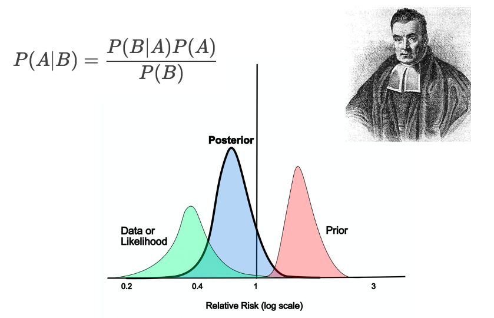
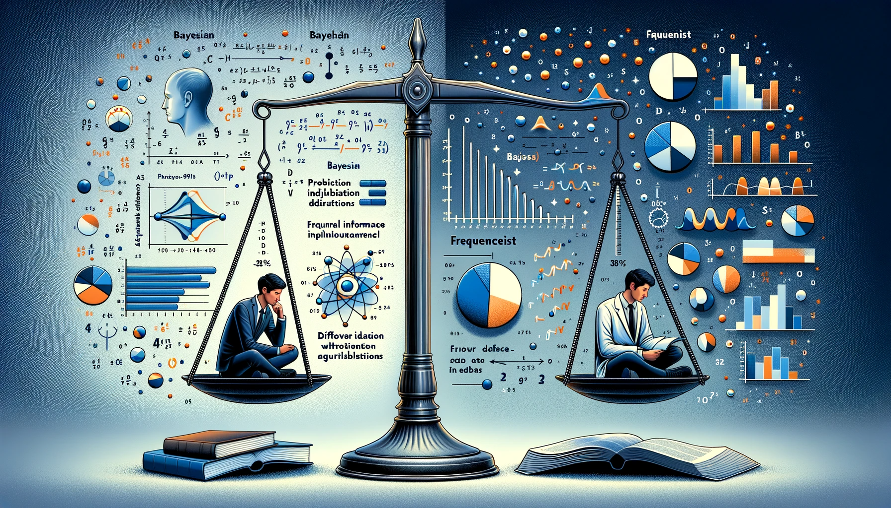

Bayesian Statistics is a branch of statistics based on the Bayesian probability theory. At its heart lies Bayes' theorem, which is a formula that describes how to update the probabilities of hypotheses when new evidence is obtained. The Bayesian approach contrasts with the frequentist approach, and both have their merits and challenges. Understanding these two methodologies is crucial for anyone diving into the field of statistics.



# Brief Overview of Bayesian Statistics

Bayesian statistics is founded on the principle that probability represents a degree of belief or certainty in an event or hypothesis. This belief can be updated with new data. The core idea is simple: start with an initial belief (called the "prior"), gather new data (observed evidence), and then update the belief to form a new and improved belief (called the "posterior").

Mathematically, this can be expressed by Bayes' theorem:

$$
P(A|B) = \frac{P(B|A) \times P(A)}{P(B)}
$$

Where:

- $P(A|B)$ is the posterior probability (updated belief after observing evidence).
- $P(B|A)$ is the likelihood (probability of observing evidence given the hypothesis).
- $P(A)$ is the prior probability (initial belief before observing evidence).
- $P(B)$ is the evidence (probability of observing the evidence).

# Historical Context and Importance in Modern Statistics

The origins of Bayesian statistics trace back to Reverend Thomas Bayes, who postulated Bayes' theorem in the 18th century. However, the Bayesian approach didn't gain significant traction until the 20th century, primarily due to computational limitations. With the advent of powerful computers and algorithms in the latter part of the 20th century, the practical applications of Bayesian methods exploded.

Today, Bayesian statistics plays a pivotal role in various fields. From machine learning to medical research, Bayesian methods provide a flexible framework for understanding complex phenomena and making predictions. Its ability to incorporate prior knowledge and continuously update beliefs with new data makes it particularly valuable in the era of big data.

**Comparison Between Bayesian and Frequentist Approaches**

While both Bayesian and Frequentist statistics aim to make inferences about populations based on sample data, they approach this goal from different perspectives.

1. **Philosophical Differences**: Frequentists interpret probability as the long-run frequency of an event (e.g., if a coin is flipped many times, it will land heads up 50% of the time). In contrast, Bayesians view probability as a degree of belief or certainty about an event.
2. **Incorporation of Prior Knowledge**: Bayesian methods start with a prior probability which represents an initial belief about an unknown parameter. As new data becomes available, this belief is updated. Frequentists don't incorporate prior beliefs in the same manner.
3. **Computational Complexity**: Bayesian methods often require sophisticated computational techniques, especially for complex models. With the rise of computational tools, this is less of an obstacle today, but it's a distinction from the frequentist methods which often have closed-form solutions.
4. **Interpretation**: Bayesian results, particularly intervals, are often more intuitive. A 95% Bayesian credible interval means there's a 95% probability that the parameter lies within the interval. A 95% Frequentist confidence interval has a more convoluted interpretation: if we were to repeat the experiment many times, 95% of the intervals would contain the true parameter.

In summary, while the frequentist approach has been historically dominant, the Bayesian approach has gained significant traction in recent decades. The choice between them often depends on the specific problem at hand, computational resources, and personal or institutional preferences.



# Understanding Bayes' Theorem

## Explanation of Bayes' Rule

**Conditional Probabilities**

In probability theory, a conditional probability measures the probability of an event given that another event has occurred. Mathematically, the conditional probability of an event $A$ given that $B$ has occurred is represented as $P(A|B)$ and is computed as:

$P(A|B) = \frac{P(A \cap B)}{P(B)}$

where $P(A \cap B)$ is the joint probability of both events $A$ and $B$ happening together, and $P(B)$ is the probability of event $B$.

**Derivation and Importance of Bayes' Rule**

Bayes' theorem, often referred to as Bayes' rule, is a fundamental concept in Bayesian statistics and serves as the backbone for updating beliefs in light of new evidence. The theorem is derived from the definition of conditional probability:

$P(A|B) = \frac{P(B|A) \times P(A)}{P(B)}$

In the context of Bayesian statistics:

- $P(A|B)$ is the **posterior** probability (our updated belief after observing evidence).
- $P(B|A)$ is the **likelihood** (probability of observing the evidence given the hypothesis).
- $P(A)$ is the **prior** probability (our belief before observing the evidence).
- $P(B)$ is the evidence, also called the marginal likelihood. This can be seen as a normalizing constant ensuring our probabilities sum to one.

The importance of Bayes' rule is paramount, as it provides a mechanism to refine our beliefs (or hypotheses) using evidence. It has been applied across diverse fields including medicine, finance, and machine learning.

**Visual Representations and Intuitive Explanations**

To understand Bayes' rule intuitively, consider a simple example:

Imagine you have a deck of playing cards. If you pick a card at random, the prior probability that it's an Ace is 4/52, since there are 4 Aces in a deck of 52 cards. Now, without showing you the front, suppose I tell you the card is red. This new piece of evidence changes the probability that it's an Ace. Given the evidence that the card is red, there are now only two possible Aces (Ace of Diamonds and Ace of Hearts). Hence, the updated (posterior) probability given the evidence becomes 2/26 or 1/13.

Visually, this can be represented by filtering out all black cards and recalculating the probability considering only red cards.

Similarly, in a Venn diagram, Bayes' theorem can be visually depicted by intersecting sets. The likelihood can be visualized as the overlap between the evidence set $B$ and the hypothesis set $A$. The more they overlap, the higher the posterior probability $P(A|B)$.

In essence, Bayes' rule can be thought of as a way to refine or adjust probabilities in light of new information. The prior probability serves as a starting point, and the likelihood represents how well the evidence aligns with our hypothesis. The evidence ensures our probabilities are well-calibrated, and the resulting posterior gives us an updated belief considering all these factors.

For those who want to dive deeper into the mathematical underpinnings and applications, there are numerous resources available. Among the recommended readings is "Bayesian Data Analysis" by Andrew Gelman et al. [1], which offers a comprehensive overview of the topic.

## Real-World Examples

**Diagnostic Testing**

Bayesian reasoning is crucial in medical diagnostic testing. Consider a scenario where a patient takes a test for a rare disease that affects 1% of the population. The test has a 95% accuracy rate, meaning it correctly identifies the disease 95% of the time and gives a false positive 5% of the time. If the test comes back positive, what's the probability the patient actually has the disease?

Using Bayes' theorem:

Let $D$ be the event that the patient has the disease and $T$ be the event that the test is positive.

- $P(D)$, the prior probability (the patient has the disease) = 0.01.
- $P(T|D)$, the likelihood (test is positive given the disease) = 0.95.
- $P(T)$, the evidence (test is positive) = $( P(D) \times P(T|D) ) + ( P(not\ D) \times P(T|not\ D) ) = 0.01 \times 0.95 + 0.99 \times 0.05 = 0.059$.

Using the formula, the posterior probability $P(D|T)$ is:

$P(D|T) = \frac{P(T|D) \times P(D)}{P(T)} = \frac{0.95 \times 0.01}{0.059} \approx 0.161$

So, even with a positive test, there's only a 16.1% chance the patient actually has the rare disease. This example highlights the importance of considering base rates (priors) when interpreting test results[2].

**Coin-flipping and Other Simple Probability Tasks**

Imagine you have a coin, and you're unsure if it's fair. You decide to flip it 10 times and get 7 heads. What's the probability the coin is biased towards heads?

Let $B$ represent the event that the coin is biased towards heads. Initially, without any flips, you might think there's a 50% chance the coin is biased and a 50% chance it's not. This is your prior.

Now, given your data (7 heads in 10 flips), you can update this belief using Bayes' theorem. If the coin is biased, getting 7 heads might be more likely than if it's not biased. By incorporating this new evidence, you'd adjust your belief about the coin being biased.

While this example can be mathematically complex, it demonstrates how Bayesian methods allow us to update beliefs with new evidence, even in seemingly simple scenarios.

**Everyday Decisions Modeled Using Bayes' Rule**

Consider the decision to carry an umbrella. If it's a sunny day without a cloud in sight, your prior belief in the necessity of an umbrella is low. However, if you then receive a weather notification on your phone predicting rain, you update this belief. The likelihood of the notification being accurate, combined with your prior, gives you a new, adjusted belief about the probability of rain. This is a Bayesian update in action, even if we don't explicitly calculate probabilities.

Bayesian reasoning can be applied to numerous daily decisions. From interpreting reviews before buying a product online to deciding if a news article is credible based on the source and content, Bayesian thinking provides a structured way to incorporate new evidence into our beliefs.

In essence, these examples showcase the pervasive nature of Bayesian reasoning, from specialized fields like medicine to mundane daily decisions. It offers a powerful framework for decision-making, especially in situations fraught with uncertainty[3].

## Bayesian vs. Frequentist Interpretations

The Bayesian and Frequentist schools are two of the primary paradigms in statistics, each with its unique philosophy, interpretation of probability, and methods of inference.

**Interpretation of Probability**

In the Frequentist perspective, probabilities represent long-run frequencies. For instance, when saying a fair coin has a 50% probability of landing heads, it implies that if we flip the coin numerous times, roughly half the results will be heads. In this sense, probability is objective and related to the real world.

On the other hand, Bayesians view probabilities as degrees of belief or subjective probabilities. For a Bayesian, saying there's a 50% chance of rain tomorrow represents their personal belief or uncertainty about the event, not a long-term frequency.

**Prior Information**

Bayesians incorporate prior information into their analyses through the use of a prior distribution. This distribution encapsulates what is known (or believed) about a parameter before observing the current data. As new data is observed, this prior is updated using Bayes' theorem, resulting in a posterior distribution.

Frequentists do not use or allow for prior beliefs in the same way. Every analysis is based solely on the observed data without formally incorporating external information.

**Practical Example: Drug Efficacy**

Consider a scenario where a new drug is being tested for efficacy against a placebo. After conducting a randomized controlled trial with 100 patients, 55 patients treated with the drug recover, while 50 out of 100 patients recover when treated with a placebo.

For a Frequentist, a hypothesis test would be employed to determine if the drug has a statistically significant effect. They might conclude that since the difference between the two groups is only 5 patients (or 5% difference), the drug's effect isn't significant at a certain threshold, say 0.05.

A Bayesian, however, would begin with a prior distribution reflecting their initial belief about the efficacy of the drug. After observing the data, they would update this prior. The result, the posterior distribution, may show that given their initial belief and the observed data, there's a 70% probability that the drug is more effective than the placebo by at least a certain margin[4].

**Estimation and Prediction**

Frequentists use point estimates and confidence intervals for parameters. For example, they might estimate the mean of a distribution and provide a 95% confidence interval where they're confident the true mean lies.

Bayesians provide a full posterior distribution for the parameter in question. Instead of a single point estimate, they have a distribution reflecting their updated belief about the parameter's possible values. They can also provide credible intervals, ranges within which a parameter lies with a certain probability, based on the posterior.

**Conclusion**

Both Bayesian and Frequentist approaches have strengths and limitations. The choice between them often depends on the problem at hand, the availability of prior information, and the goals of the analysis. While the Bayesian approach offers flexibility and the ability to incorporate external information, the Frequentist methodology provides objective methods that rely solely on the data at hand[5].

# Bayesian Methods and Inference

## Introduction to Bayesian Inference

Bayesian inference revolves around the process of updating probabilities as new data becomes available. This is fundamentally anchored in Bayes' theorem, which enables the fusion of prior knowledge with current evidence to produce a refined, or posterior, understanding.

**Concept and Process of Bayesian Updating**

At the heart of Bayesian inference lies the concept of updating. Imagine you have a prior belief about a phenomenon. As you gather new evidence or data, your belief should change to reflect this new information. The mechanism by which this change occurs is described by Bayes' theorem, mathematically represented as:

$P(A|B) = \frac{P(B|A) \times P(A)}{P(B)}$

Where:

- $P(A|B)$ is the posterior probability of $A$ given $B$.
- $P(B|A)$ is the likelihood, the probability of observing $B$ given $A$.
- $P(A)$ is the prior probability of $A$, representing our initial belief before observing the data.
- $P(B)$ is the total probability of $B$.

In the context of Bayesian inference, $A$ might represent a model parameter, and $B$ the data. The theorem then articulates how our prior beliefs about a model parameter $P(A)$ should be updated once we observe new data.

**Formal Explanation and Alternatives**

The beauty of the Bayesian approach is its ability to combine prior information with new evidence in a systematic manner. The prior encapsulates what we know before seeing the data. The likelihood, on the other hand, signifies how well our data aligns with our model. Multiplying the prior with the likelihood and normalizing by the total probability of the data gives us the posterior distribution, our updated belief.

A quintessential example is estimating the probability of a coin landing heads. Prior knowledge might suggest a fair coin (probability 0.5). But after flipping the coin 100 times, observing 60 heads should update our belief[5].

While Bayesian inference relies on the prior, there are instances where one might not have a strong prior belief. In such cases, a non-informative prior, or a "flat" prior, can be utilized, allowing the data to predominantly drive the posterior beliefs.

It's noteworthy to mention the alternative Frequentist approach to inference, which does not utilize or require a prior. Instead, it estimates parameters based solely on the likelihood function derived from the data. While the Bayesian method provides a full probability distribution over possible parameter values, the Frequentist method typically provides point estimates, confining its results to a singular value or an interval.

In conclusion, Bayesian inference offers a systematic method for updating beliefs in light of new data. Its versatility allows for the incorporation of prior knowledge, but it can also operate effectively when such prior knowledge is sparse or non-existent.

## Bayesian Modeling

Bayesian modeling is a powerful tool that embraces uncertainty, allowing researchers to integrate prior knowledge with observed data to make statistically sound inferences about underlying processes or phenomena.

**Statistical Modeling & Design of Experiments**

In the Bayesian framework, a statistical model is defined by setting up a likelihood for the observed data, and a prior distribution for the unknown parameters. The choice of likelihood relates to how the data is generated, while the prior encodes prior beliefs or information about the parameters before observing any data.

For instance, consider estimating the proportion $p$ of voters favoring a particular candidate. If $y$ is the number of voters in favor out of $n$ sampled, a binomial likelihood is appropriate:

$P(y | p) = \binom{n}{y} p^y (1-p)^{n-y}$

Given a prior belief that the proportion is equally likely to be any value between 0 and 1, a uniform prior, $P(p) = 1$ for $0 \leq p \leq 1$, can be used.

When designing experiments, Bayesian methods can be particularly beneficial. Traditional designs focus on minimizing variance or maximizing power. Bayesian designs, on the other hand, might aim to maximize the information gained about the parameters or to minimize the expected posterior variance[6].

**Exploratory Analysis of Bayesian Models**

Once a Bayesian model is set up and posterior distributions are obtained (either analytically or using computational methods like MCMC), exploratory analysis is crucial. This step ensures the model fits the data well and the inferences are reliable.

Key tasks in exploratory analysis include:

1. **Posterior Predictive Checks**: By simulating data from the model using the estimated parameters and comparing it to the observed data, one can diagnose model misfit.
2. **Sensitivity Analysis**: Checking how robust the results are to changes in the prior. If inferences are sensitive to prior choice, more rigorous justification for the chosen prior may be necessary.
3. **Convergence Diagnostics** (for MCMC methods): Tools like the Gelman-Rubin statistic[7] can be used to ensure the Markov chains have converged to the target distribution.
4. **Visualization**: Plots of posterior distributions, intervals, and other summaries can provide insights into parameter estimates and uncertainties.

Python libraries such as `PyMC3` and `ArviZ` offer functionalities that assist in building, fitting, and exploring Bayesian models efficiently[8].

In summary, Bayesian modeling is not just about setting up a model and obtaining parameter estimates. The model's compatibility with the data, its sensitivity to prior assumptions, and the convergence of computational methods are all vital components of a holistic Bayesian analysis.

## Inference Over Possibilities

Bayesian statistics is fundamentally about updating beliefs in light of new data. When making these updates, statisticians must decide how to model the underlying phenomena. The choice often lies between parametric and non-parametric approaches.

**Parametric Formulations**

In a parametric Bayesian approach, the underlying distribution is described using a fixed number of parameters. The goal becomes estimating these parameters. For instance, if one assumes that the data follows a normal distribution, then the parameters to be estimated would be the mean $\mu$ and standard deviation $\sigma$.

Mathematically, for a set of observations $x_1, x_2, \dots, x_n$ assumed to be drawn from a normal distribution, the likelihood is:

$L(\mu, \sigma | x) = \prod_{i=1}^{n} \frac{1}{\sigma \sqrt{2\pi}} \exp \left( -\frac{(x_i - \mu)^2}{2\sigma^2} \right)$

Given prior beliefs about $\mu$ and $\sigma$, Bayes' theorem can be used to update these beliefs upon observing new data.

**Non-parametric Formulations**

Non-parametric Bayesian methods do not assume a fixed number of parameters. Instead, the number of parameters can grow with the data, offering flexibility. A classic example is the Dirichlet Process, which provides a foundation for clustering data into an unknown number of clusters[9].

Non-parametric methods are particularly useful when the true distribution shape is unknown or when it might not be well-represented by any common parametric form.

**Multiple Observations and Comprehensive Examples**

Consider an example where researchers are interested in understanding the distribution of heights in a population. If they have reason to believe that heights are normally distributed (e.g., from prior studies), a parametric approach might be fitting. After collecting data from a sample, the mean and standard deviation of the heights can be updated using a Bayesian framework.

On the other hand, if there's suspicion that there might be multiple distinct populations within the data (e.g., children and adults mixed), a non-parametric approach like clustering might be more appropriate.

Another scenario could involve monitoring a machine's performance over time. If performance degrades in a predictable manner, a parametric model could suffice. However, if there are unpredictable jumps or drops (perhaps due to unknown external factors), a non-parametric model that can adapt to these changes might be a better choice.

In both cases, as more data is observed, the Bayesian approach allows for consistent updating of beliefs, refining the model's understanding of the underlying distribution or process.

In essence, Bayesian inference over possibilities is about selecting the right model complexity given the data at hand and the questions of interest, ensuring that the conclusions drawn are both robust and flexible.

## Formal Description and Definitions

In Bayesian statistics, prediction is a key application, allowing practitioners to forecast future outcomes based on historical data and established models. This prediction is rooted in the posterior predictive distribution, which captures our updated beliefs about future observations given both prior knowledge and observed data.

**Bayesian Prediction**

Given a set of observed data $D$ and a model with parameters $\theta$, the posterior predictive distribution for a new observation $x_{new}$ is given by:

$p(x_{new} | D) = \int p(x_{new} | \theta) p(\theta | D) d\theta$

Here, $p(x_{new} | \theta)$ is the likelihood of the new observation given the parameters, and $p(\theta | D)$ is the posterior distribution of the parameters given the observed data. This integration essentially averages predictions over all possible parameter values, weighted by their posterior probability.

**Mathematical Properties**

1. **Cromwell's Rule**: Named after Oliver Cromwell, this rule emphasizes that a true Bayesian should never assign a probability of 0 or 1 to any event, no matter how certain they might feel. This is important because a probability of 0 means an event is impossible, and updating it with any amount of evidence will not change this belief. Mathematically:
    
    $P(A) \neq 0 \text{ and } P(A) \neq 1$
    
2. **Asymptotic Behavior**: As the amount of data grows, Bayesian estimates converge to their true values under fairly general conditions. Specifically, Bayesian methods are consistent, meaning that with infinite data, the posterior distribution concentrates around the true parameter value[10]. In addition, Bayesian estimators can be shown to be asymptotically normal under certain regularity conditions, which ensures their performance is optimal in large samples.

Overall, Bayesian statistics provides a powerful framework for modeling, prediction, and inference. Its formal definitions and mathematical properties ensure robustness, while its philosophical underpinnings prioritize flexibility and adaptability in the face of uncertainty.

## Estimation of Parameters

One of the fundamental goals in Bayesian statistics is estimating model parameters, which boils down to updating prior beliefs based on observed data. This process is characterized by three main components: the prior, likelihood, and posterior.

**Prior, Likelihood, and Posterior**

The **Prior** distribution, $p(\theta)$, encapsulates our beliefs about the parameter $\theta$ before observing any data. It's a way to incorporate external knowledge or subjective beliefs into the analysis.

The **Likelihood** function, $p(D|\theta)$, describes the probability of observing the data $D$ given a particular parameter value $\theta$. It links the parameters of the model to the data.

The **Posterior** distribution, $p(\theta|D)$, represents our updated belief about the parameter $\theta$ after considering the observed data. It's calculated using Bayes' rule:

$p(\theta|D) = \frac{p(D|\theta) \times p(\theta)}{p(D)}$

Where $p(D)$ is the marginal likelihood, often referred to as the evidence. It acts as a normalizing constant ensuring that the posterior distribution integrates to one.

**Conjugate Priors and Practical Implications**

In Bayesian analysis, certain pairs of prior and likelihood functions result in a posterior distribution that belongs to the same family as the prior. Such priors are termed as **Conjugate Priors**. Using conjugate priors can significantly simplify computations, especially when sequentially updating beliefs with new data.

For instance, if we have a Binomial likelihood and a Beta prior, the posterior will also be a Beta distribution. Mathematically, if $X \sim \text{Binomial}(n, \theta)$ and $\theta \sim \text{Beta}(\alpha, \beta)$, the posterior for $\theta$ after observing $x$ successes is:

$\theta|X=x \sim \text{Beta}(\alpha + x, \beta + n - x)$

Conjugate priors provide an elegant computational avenue, especially in cases with multiple rounds of updating or when closed-form solutions are preferred. However, the choice of prior should always be guided by the problem's context and not just computational convenience[11]. In cases where non-conjugate priors are more appropriate, advanced computational techniques like MCMC may be employed.

In conclusion, parameter estimation is a cornerstone in Bayesian statistics. It provides a systematic framework to combine prior knowledge with observed data to refine our beliefs about model parameters.

# Computational Techniques in Bayesian Statistics

## Monte Carlo Methods

Monte Carlo methods are a class of computational algorithms that rely on random sampling to approximate numerical solutions. Named after the Monte Carlo Casino in Monaco due to the inherent randomness and chance associated with these methods, they have become indispensable tools in a wide range of scientific and engineering disciplines[12].

In the context of Bayesian statistics, Monte Carlo methods are used to approximate complex integrals and distributions that are analytically intractable. Instead of trying to compute these quantities directly, we estimate them using a large number of random samples.

**Explanation**

For a simple illustration, consider the problem of estimating the value of $\pi$. Imagine inscribing a circle of radius 1 inside a square with sides of length 2. The area of the square is 4, and the area of the circle is $\pi$. If we randomly scatter points within the square, the ratio of points inside the circle to the total points in the square should approximate the ratio of the two areas, which is $\pi/4$.

```python
import numpy as np

num_samples = 100000
x = np.random.uniform(-1, 1, num_samples)
y = np.random.uniform(-1, 1, num_samples)

inside_circle = (x**2 + y**2) <= 1
approximation_of_pi = 4 * np.mean(inside_circle)
```

In Bayesian inference, the principle extends to estimating expectations, marginal likelihoods, or other quantities of interest. For instance, to compute the expected value of a function $g(\theta)$ with respect to a posterior distribution $p(\theta|D)$, we might use:

$E[g(\theta)] \approx \frac{1}{N} \sum_{i=1}^{N} g(\theta^{(i)})$

where $\{\theta^{(i)}\}_{i=1}^{N}$ are samples drawn from the posterior distribution.

**Applications**

Monte Carlo methods find utility in various applications:

1. **Integration**: Estimating high-dimensional integrals, especially in Bayesian settings where marginalizing over parameters becomes challenging.
2. **Optimization**: Searching for parameters that maximize (or minimize) a particular function, especially when the function is complex and doesn't have an easily computable gradient.
3. **Simulation**: Modeling complex systems, such as financial markets, weather patterns, or nuclear reactions, where direct analytic solutions might not exist.
4. **Risk Analysis**: Evaluating scenarios in finance, business, or project management by simulating different outcomes based on probabilistic models.
5. **Graphics**: In ray tracing for realistic image rendering, where the trajectory of rays of light is simulated.

In Bayesian statistics, the most notable application is in posterior estimation. Often, our posterior distribution is a complex, high-dimensional entity. Monte Carlo methods, especially in tandem with Markov chains (as in MCMC), allow us to draw samples from these distributions and make inferences about model parameters.

Monte Carlo methods' power lies in their generality. They can be applied to almost any problem, provided we can draw random samples and compute a function's value at those samples. The trade-off is computational, as obtaining precise estimates often requires a large number of samples.

## Markov Chain Monte Carlo (MCMC)

Markov Chain Monte Carlo (MCMC) methods are a subset of Monte Carlo techniques specifically designed to sample from complex, often high-dimensional probability distributions, making them invaluable in Bayesian inference. Where direct sampling is challenging due to the intricacy of the distribution, MCMC provides a mechanism to generate a sequence (or chain) of samples where each sample depends only on the previous one, ensuring the Markov property.

The essential idea behind MCMC is to construct a Markov chain with an equilibrium distribution that matches the target distribution we want to sample from. Given enough time (iterations), the chain will converge to this equilibrium distribution, allowing us to draw approximate samples from our target distribution.

**Detailed Overview**

One of the most well-known MCMC algorithms is the Metropolis-Hastings (MH) algorithm[13]. Here's a brief overview of its procedure:

1. Start with an initial guess $\theta_0$ for the parameter of interest.
2. Propose a new value $\theta'$ by adding a random perturbation to $\theta_0$.
3. Calculate the acceptance ratio $r$:
$r = \frac{p(\theta' | D)}{p(\theta_0 | D)}$
where $p(\theta | D)$ is the posterior probability of $\theta$ given the data $D$.
4. Accept $\theta'$ as the next sample in the sequence with probability $\min(1, r)$. If $\theta'$ is not accepted, the next sample is set to $\theta_0$.
5. Repeat steps 2-4 for a specified number of iterations.

**Examples**

Suppose we have a simple unimodal Gaussian posterior distribution, and we wish to sample from it using the Metropolis-Hastings algorithm:

```python
import numpy as np

def metropolis_hastings(p, iter=1000):
    x = np.zeros(iter)
    for i in range(iter-1):
        x_new = np.random.normal(x[i], 0.5)
        if np.random.rand() < p(x_new) / p(x[i]):
            x[i+1] = x_new
        else:
            x[i+1] = x[i]
    return x

# Example usage:
p = lambda x: np.exp(-x**2/2)  # Gaussian distribution
samples = metropolis_hastings(p, iter=10000)
```

**Software Tools and Libraries**

For those not inclined to implement MCMC algorithms from scratch, several software libraries have been developed to facilitate Bayesian computations using MCMC:

1. **Stan**[14]: A state-of-the-art platform for statistical modeling and high-performance statistical computation. It uses an advanced MCMC sampling algorithm called Hamiltonian Monte Carlo (HMC).
2. **PyMC3**[15]: A Python library for probabilistic programming, which uses MCMC methods, including Metropolis, Slice Sampling, and HMC, to fit Bayesian models.
3. **JAGS (Just Another Gibbs Sampler)**[16]: A program for analysis of Bayesian hierarchical models using Gibbs sampling.
4. **TensorFlow Probability**[17]: A library in TensorFlow that provides tools to combine probabilistic models and deep learning. It supports various MCMC sampling methods.
5. **emcee**[18]: A Python library for affine-invariant ensemble sampling, a variant of MCMC particularly effective for multidimensional models.

Harnessing these libraries can significantly reduce the barrier to applying advanced Bayesian methods in practice.

# Applications of Bayesian Statistics

## Statistical Data Analysis

Bayesian methods have seen a significant upsurge in the realm of data science and machine learning, offering a robust framework for modeling uncertainty, incorporating prior knowledge, and making predictions. Unlike traditional statistical methods that might offer a singular point estimate, Bayesian methods produce entire distributions, granting a more comprehensive perspective on the potential values a parameter might take and their associated probabilities.

**Bayesian Linear Regression**

A staple in the statistical toolkit, linear regression can be approached from a Bayesian perspective. The Bayesian version not only provides estimates for regression coefficients but also a distribution over these coefficients, capturing the uncertainty. Given data $D = \{(x_1, y_1), ..., (x_n, y_n)\}$ and assuming a linear relationship between $x$ and $y$, the Bayesian method introduces priors on the coefficients and calculates the posterior distribution over them using Bayes' theorem.

For instance, in a simple Bayesian linear regression, the relationship is modeled as:

$y_i = \beta_0 + \beta_1 x_i + \epsilon_i$

Where $\epsilon_i \sim N(0, \sigma^2)$. Priors are set on $\beta_0, \beta_1$, and $\sigma^2$, and the posterior distribution of the parameters is computed given the data.

**Bayesian Neural Networks**

Neural networks, the workhorses behind the deep learning revolution, can also be cast into a Bayesian framework. Bayesian Neural Networks (BNNs) aim to capture uncertainty in deep learning by placing priors on the weights and biases, resulting in a distribution over neural networks. BNNs can offer better calibration and expressiveness, especially when data is sparse or when modeling uncertainty is crucial.

**Bayesian Time Series Analysis**

Time series data, characterized by sequences of observations taken sequentially in time, can benefit from Bayesian methods, such as Bayesian state space models and Bayesian structural time series. These methods can incorporate prior beliefs about seasonality, trends, and other components, producing uncertainty bounds around forecasts.

**Hierarchical Bayesian Models**

Hierarchical models, especially useful in situations with grouped or nested data, allow for the sharing of information across groups. These models offer a structured way to handle different levels of variability and capture patterns at multiple levels. For instance, students within the same class might share a class effect, and classes within a school might share a school effect.

**Bayesian Non-parametric Methods**

Sometimes, the complexity of the data generating process is unknown, making it challenging to specify a fixed number of parameters. Bayesian non-parametric methods, particularly Gaussian Processes, offer a flexible framework where the number of parameters can grow with the data.

**Tools for Bayesian Data Analysis**

Several software tools facilitate Bayesian data analysis in modern machine learning:

1. **Stan** and **PyMC3**: Both offer capabilities for hierarchical modeling, generalized linear models, and more.
2. **GPflow** and **GPy**: Libraries specifically designed for Gaussian Processes.
3. **Edward** and **Pyro**: Probabilistic programming languages that support a variety of Bayesian models, including Bayesian neural networks.

Incorporating Bayesian methods into data science and machine learning pipelines can offer richer insights, more robust predictions, and a comprehensive understanding of uncertainties, making them indispensable tools for modern data analysts.

## Computer Applications

Bayesian statistics, with its foundation in probabilistic reasoning and inherent ability to model uncertainty, has left an indelible mark on Artificial Intelligence (AI) and Predictive Modeling. It seamlessly bridges the worlds of knowledge representation, learning, and inference, paving the way for more nuanced AI systems.

**Artificial Intelligence (AI)**

Bayesian networks, directed acyclic graphs representing a set of random variables and their conditional dependencies, play a pivotal role in AI for knowledge representation and reasoning. For instance, diagnostic AI systems in healthcare often leverage Bayesian networks to model the intricate relationships between symptoms, diseases, and other latent factors. The advantage lies in the network's ability to handle uncertainty, learn from data, and make probabilistic inferences efficiently.

Reinforcement learning, a subset of AI focusing on agents that learn by interacting with their environment, has also been influenced by Bayesian methods. Bayesian Reinforcement Learning provides a framework where the agent maintains a distribution over possible models of the environment and updates this belief as it gains more experience[19].

**Predictive Modeling**

In predictive modeling, the goal often revolves around forecasting future outcomes based on historical data. Bayesian methods shine here, offering a holistic view that includes point estimates and uncertainty bounds.

For instance, the Bayesian approach to regression analysis, as previously discussed, provides not just estimates of parameters but distributions around them. This inherently offers prediction intervals, granting more information about the potential variability in future outcomes.

Furthermore, Bayesian methods are well-suited for handling complex hierarchical structures in data, accommodating varying levels of granularity in predictive models. For instance, in predicting sales for a global firm, a Bayesian hierarchical model might account for variations at the regional, national, and store levels.

Machine Learning models, particularly those that emphasize interpretability, can benefit from Bayesian treatment. Decision Trees, a popular model for classification and regression, can be adapted into Bayesian Decision Trees, where priors and posteriors over the tree structures are considered, leading to more robust and interpretable trees.

**Tools and Libraries**

Several computational tools have been developed to cater to the increasing demand for Bayesian methods in AI and predictive modeling:

1. **Breathe** and **pgmpy**[20]: Python libraries for Bayesian network modeling, learning, and inference.
2. **BayesPy**: Provides tools for Bayesian variational inference.
3. **TensorFlow Probability**: An extension of TensorFlow, caters to a wide array of Bayesian modeling techniques, including deep probabilistic models.

As AI systems continue to become an integral part of our daily lives, the role of Bayesian methods in modeling, inference, and prediction will undoubtedly remain pivotal, ensuring these systems are not just smart but also nuanced and calibrated.

# Challenges and Open Areas

## Hypothesis Testing and Model Choice

Hypothesis testing and model choice lie at the heart of statistical inference. Within the Bayesian framework, these tasks involve comparing the posterior probabilities of different models or hypotheses. Despite its elegance and coherent probabilistic foundation, the Bayesian approach to these tasks faces several challenges and criticisms.

**Bayesian Model Comparison**

Bayesian model comparison typically involves computing the **Bayes Factor (BF)**, which is the ratio of the posterior odds to the prior odds for two competing models. Mathematically, for two models $M_1$ and $M_2$, the Bayes Factor is given by:

$BF_{12} = \frac{P(D|M_1)}{P(D|M_2)}$

where $P(D|M_i)$ is the marginal likelihood or evidence for model $M_i$. A BF value greater than 1 suggests the data favors $M_1$ over $M_2$.

**Challenges and Criticisms**:

1. **Computational Intensity**: Calculating the marginal likelihoods required for the Bayes Factor is computationally challenging, especially for complex models. Approximation methods, such as thermodynamic integration or nested sampling, can be employed, but they come with their own limitations.
2. **Choice of Priors**: The results of Bayesian hypothesis tests can be sensitive to the choice of priors. Non-informative priors might seem like a solution, but in practice, they can still influence the outcome, especially when the data is sparse or noisy.
3. **Interpretation of Bayes Factor**: Interpreting the magnitude of the Bayes Factor is not always straightforward. While there are some guidelines (e.g., a BF > 3 might be considered as evidence favoring $M_1$ over $M_2$, the interpretation is often subjective.
4. **Ockham's Razor Effect**: Bayesian model comparison inherently incorporates a form of Ockham’s razor – simpler models are favored unless the added complexity provides a proportionate increase in fit. While this can be viewed as a strength, it also means Bayesian methods might dismiss true complex models if they don't offer a substantial improvement over simpler ones.
5. **Multiple Comparisons**: Comparing multiple models simultaneously introduces challenges, especially when considering a large model space. Procedures that consider the entire model space, like Bayesian model averaging, are more robust but increase computational demands.

While the Bayesian approach to hypothesis testing and model choice provides a coherent framework for decision-making under uncertainty, it is essential to be aware of its challenges. A clear understanding of these nuances ensures that Bayesian methods are applied judiciously, maximizing their potential while avoiding pitfalls.

## Robustness, Reporting, and Model Criticism

Bayesian statistics, like any statistical methodology, must be scrutinized for its robustness, the clarity of its reporting, and be open to model criticism. These aspects are crucial for ensuring the reliable application of Bayesian methods in research and practice.

**Robustness of Bayesian Methods**

Robustness refers to the sensitivity of the results to small changes in model specifications, priors, or assumptions. While Bayesian methods offer a systematic framework for incorporating uncertainty, they can sometimes be sensitive to the choice of prior distribution, especially in the presence of limited data. This has led to research on robust Bayesian methods that employ techniques like mixture priors or hierarchical models to mitigate undue influence from subjective prior choices.

**Transparent Reporting**

Clear and transparent reporting is essential for replicability and for assessing the validity of the results. For Bayesian analyses, this includes:

- Clearly stating the chosen priors and their rationale.
- Providing detailed descriptions of the model and its assumptions.
- Reporting of convergence diagnostics when using MCMC methods.
- Presenting both point estimates (like posterior means) and measures of uncertainty (like credible intervals).

**Model Criticism and Diagnostic Checks**

Once a Bayesian model is fit to the data, it's essential to evaluate how well it has performed. Several diagnostic tools are available:

- **Posterior Predictive Checks (PPC)**: This involves generating new data from the fitted model and comparing it to the observed data. Discrepancies suggest potential model inadequacies.
    
    $y_{\text{rep}} \sim p(y| \theta_{\text{posterior}})$
    
    Where $y_{\text{rep}}$ is the replicated data generated from the posterior distribution of the model parameters $\theta_{\text{posterior}}$.
    
- **Convergence Diagnostics**: For iterative methods like MCMC, it's crucial to ensure that the chains have converged to the target distribution. Tools like trace plots, the R-hat statistic, and effective sample size can provide insights into convergence.
- **Sensitivity Analysis**: Examining how sensitive results are to changes in priors or model form helps understand the model's robustness.

**Ongoing Research and Improvements**

Despite the advances in Bayesian statistics, there's ongoing research aimed at addressing its challenges. These include developing more efficient algorithms for computation, creating more interpretable models, improving robustness to model misspecification, and devising better tools for model criticism.

In conclusion, while Bayesian statistics offers a powerful and flexible framework for statistical inference, its strength lies in the careful consideration of robustness, transparent reporting, and rigorous model criticism.

## Probabilistic Programming

Probabilistic programming has revolutionized the way we approach Bayesian statistics, allowing us to specify and fit complex probabilistic models with ease. At its core, probabilistic programming is a paradigm where probabilistic models are specified using programming constructs, enabling automatic inference using advanced computational methods.

In traditional Bayesian statistics, the specification and computation of models, especially complex ones, often require substantial expertise and manual effort. Probabilistic programming languages (PPLs), on the other hand, provide a high-level syntax for model specification while leveraging powerful algorithms to conduct inference, often without the need for the user to understand the underlying computational details.

A typical workflow in a PPL involves:

1. **Model Specification**: Define the probabilistic model using constructs provided by the PPL. This typically involves setting priors, likelihoods, and any latent variables.
2. **Inference**: Once the model is specified, the PPL employs algorithms like MCMC, Variational Inference, or Hamiltonian Monte Carlo to approximate the posterior distribution.
3. **Posterior Analysis**: Extract insights, predictions, and other relevant information from the obtained posterior distribution.

As an illustrative example, consider a simple Bayesian linear regression in a PPL like Stan:

```python
data {
    int<lower=0> N;
    vector[N] x;
    vector[N] y;
}

parameters {
    real alpha;
    real beta;
    real<lower=0> sigma;
}

model {
    y ~ normal(alpha + beta * x, sigma);
}
```

This model specification is both compact and intuitive, showcasing the power of probabilistic programming.

Several PPLs have gained popularity in recent years, including Stan, PyMC3, Edward, and Turing.jl, among others. Each of these languages has its strengths, community support, and areas of application, catering to a wide range of Bayesian modeling needs.

Probabilistic programming's relevance in Bayesian statistics cannot be understated. It bridges the gap between complex model specification and inference, democratizing access to Bayesian methods. By handling the intricate computational aspects internally, PPLs allow practitioners to focus on the modeling itself, thereby expanding the reach and application of Bayesian statistics in various fields.

# Bayesian Epistemology and Philosophy

Bayesian epistemology is rooted in the idea that our beliefs, when exposed to new evidence, can be updated in a systematic and coherent manner, reflecting the core Bayesian principle of updating prior beliefs with new data to produce posterior beliefs. Philosophically, this paradigm draws heavily from subjectivist interpretations of probability, where probabilities are seen not as objective features of the world but as degrees of belief.

At the heart of Bayesian epistemology lies the Bayes' theorem itself, framing the process of learning as the updating of beliefs in light of new evidence. This provides a formal mechanism to represent uncertainty and to change one’s mind in the face of new data. In philosophical terms, Bayes’ theorem offers a reconciliation of rationalism (knowledge through reason) and empiricism (knowledge through experience), by portraying learning as a dynamic interplay between prior beliefs and empirical evidence.

In science, Bayesian approaches have redefined the nature of scientific inference. Rather than viewing scientific theories as being definitively confirmed or refuted, Bayesian epistemology suggests that theories are supported to varying degrees by the available evidence, and these degrees of support can be updated as new evidence becomes available. This perspective aligns with the philosopher Karl Popper’s view of science as a series of conjectures and refutations, but it quantifies the degree of belief or support using probability.

Moreover, Bayesian decision theory extends these principles to decision-making under uncertainty. It posits that decisions should be made by considering the expected utility of each potential action, weighted by the probability of different outcomes given the available evidence. This framework has profound implications for fields ranging from economics to ethics, emphasizing rational decision-making based on both empirical data and subjective judgments.

The impact of Bayesian epistemology extends beyond pure science and decision theory. It touches upon deeper philosophical issues about the nature of knowledge, belief, and rationality. The Bayesian approach to belief revision has been invoked in discussions about everything from the philosophy of mind to the foundations of quantum mechanics.

Yet, it's essential to recognize that Bayesian epistemology isn't without its critics. Some argue that it's overly subjective, or that it doesn’t truly represent the way humans learn and revise their beliefs. Nonetheless, its influence in shaping modern philosophy of science and decision theory is undeniable.

# Conclusion

Mastering Bayesian statistics provides a robust foundation for understanding uncertainty, making informed decisions, and updating beliefs in light of new data. At its core, Bayesian statistics centers on Bayes' theorem, a rule derived from conditional probabilities, offering a formal mechanism to adjust our beliefs based on new evidence. This framework contrasts with the Frequentist approach, emphasizing the continuous evolution of knowledge as we accumulate more data.

Over time, Bayesian methods have permeated various domains. From modeling complex systems and making inferences about unknown parameters to computational techniques like Monte Carlo methods and MCMC, Bayesian statistics offers versatile tools for a myriad of applications. Today, its principles underpin advanced machine learning algorithms, predictive modeling in artificial intelligence, bioinformatics research, and even judicial decision-making processes.

Yet, beyond the mathematical and computational prowess, Bayesian statistics carries profound philosophical implications. It challenges our understanding of knowledge, belief, and rationality, presenting a blend of rationalism and empiricism, where beliefs are neither static nor absolute but are continually refined with experience.

💡 **Read more:**

- Trading strategies papers with code on [Equities](https://wiki.paperswithbacktest.com/trading-strategies/equities), [Cryptocurrencies](https://wiki.paperswithbacktest.com/trading-strategies/cryptocurrencies), [Commodities](https://wiki.paperswithbacktest.com/trading-strategies/commodities), [Currencies](https://wiki.paperswithbacktest.com/trading-strategies/currencies), [Bonds](https://wiki.paperswithbacktest.com/trading-strategies/bonds), [Options](https://wiki.paperswithbacktest.com/trading-strategies/options)
- [A curated list](https://github.com/paperswithbacktest/awesome-systematic-trading) of awesome libraries, packages, strategies, books, blogs, and tutorials for systematic trading
- [A bunch of datasets](https://huggingface.co/paperswithbacktest) for quantitative trading
- [A website to help you](https://paperswithbacktest.com/) become a quant trader and achieve financial independence

# References & Further Reading

[1]: Gelman, A., Carlin, J. B., Stern, H. S., Dunson, D. B., Vehtari, A., & Rubin, D. B. (2013). [Bayesian data analysis](http://www.stat.columbia.edu/~gelman/book/). CRC press.

[2]: Gigerenzer, G., & Hoffrage, U. (1995). [How to improve Bayesian reasoning without instruction: Frequency formats](https://www.researchgate.net/publication/44213832_How_to_Improve_Bayesian_Reasoning_Without_Instruction_Frequency_Formats). Psychological review, 102(4), 684.

[3]: Kahneman, D., & Tversky, A. (1973). [On the psychology of prediction](https://psycnet.apa.org/record/1974-02325-001). Psychological review, 80(4), 237.

[4]: Lindley, D.V. (2000). [The philosophy of statistics](https://plato.stanford.edu/entries/statistics/). *The Statistician*, 49(3), 293-337.

[5]: Gelman, A., Carlin, J.B., Stern, H.S., Dunson, D.B., Vehtari, A., & Rubin, D.B. (2013). [Bayesian Data Analysis](https://www.amazon.com/Bayesian-Analysis-Chapman-Statistical-Science/dp/1439840954) (3rd ed.). CRC Press.

[6]: Chaloner, K., & Verdinelli, I. (1995). [Bayesian experimental design: A review](https://projecteuclid.org/journals/statistical-science/volume-10/issue-3/Bayesian-Experimental-Design-A-Review/10.1214/ss/1177009939.full). *Statistical Science*, 10(3), 273-304.

[7]: Gelman, A., & Rubin, D. B. (1992). [Inference from iterative simulation using multiple sequences](https://www.jstor.org/stable/2246093). *Statistical Science*, 457-472.

[8]: Salvatier, J., Wiecki, T. V., & Fonnesbeck, C. (2016). [Probabilistic programming in Python using PyMC3](https://arxiv.org/abs/1507.08050). *PeerJ Computer Science*, 2, e55.

[9]: Ferguson, T. S. (1973). [A Bayesian analysis of some nonparametric problems](https://projecteuclid.org/journals/annals-of-statistics/volume-1/issue-2/A-Bayesian-Analysis-of-Some-Nonparametric-Problems/10.1214/aos/1176342360.full). *The annals of statistics*, 209-230.

[10]: Ghosh, J. K., Delampady, M., & Samanta, T. (2006). [An introduction to Bayesian analysis: theory and methods](https://link.springer.com/book/10.1007/978-0-387-35433-0). Springer Science & Business Media.

[11]: Bernardo, J. M., & Smith, A. F. (2009). [Bayesian Theory](https://onlinelibrary.wiley.com/doi/book/10.1002/9780470316870). John Wiley & Sons.

[12]: Robert, C. P., & Casella, G. (2013). [Monte Carlo Statistical Methods](https://link.springer.com/book/10.1007/978-1-4757-4145-2). Springer Science & Business Media.

[13]: Metropolis, N., Rosenbluth, A. W., Rosenbluth, M. N., Teller, A. H., & Teller, E. (1953). [Equation of state calculations by fast computing machines](https://bayes.wustl.edu/Manual/EquationOfState.pdf). The journal of chemical physics, 21(6), 1087-1092.

[14]: Stan Development Team. (2016). [Stan Modeling Language Users Guide and Reference Manual](https://mc-stan.org/users/documentation/).

[15]: Salvatier, J., Wiecki, T. V., & Fonnesbeck, C. (2016). [Probabilistic programming in Python using PyMC3](https://arxiv.org/abs/1507.08050). PeerJ Computer Science, 2, e55.

[16]: Plummer, M. (2003). [JAGS: A program for analysis of Bayesian graphical models using Gibbs sampling](https://www.researchgate.net/publication/2567033_JAGS_A_Program_for_Analysis_of_Bayesian_Graphical_Models_using_Gibbs_Sampling). In Proceedings of the 3rd international workshop on distributed statistical computing (Vol. 124, p. 125).

[17]: Dillon, J. V., Langmore, I., Tran, D., Brevdo, E., Vasudevan, S., Moore, D., ... & Patton, B. (2017). [TensorFlow Distributions](https://arxiv.org/abs/1711.10604). arXiv preprint arXiv:1711.10604.

[18]: Foreman-Mackey, D., Hogg, D. W., Lang, D., & Goodman, J. (2013). [emcee: The MCMC hammer](https://arxiv.org/abs/1202.3665). Publications of the Astronomical Society of the Pacific, 125(925), 306.

[19]: Ghavamzadeh, M., Engel, Y., & Valko, M. (2015). [Bayesian Reinforcement Learning: A Survey](https://arxiv.org/abs/1609.04436). Foundations and Trends® in Machine Learning, 8(5-6), 359-483.

[20]: Ankur, A., & Likhodedov, A. (2015). [pgmpy: Probabilistic graphical models using Python](https://conference.scipy.org/proceedings/scipy2015/pdfs/ankur_ankan.pdf). Journal of Machine Learning Research.