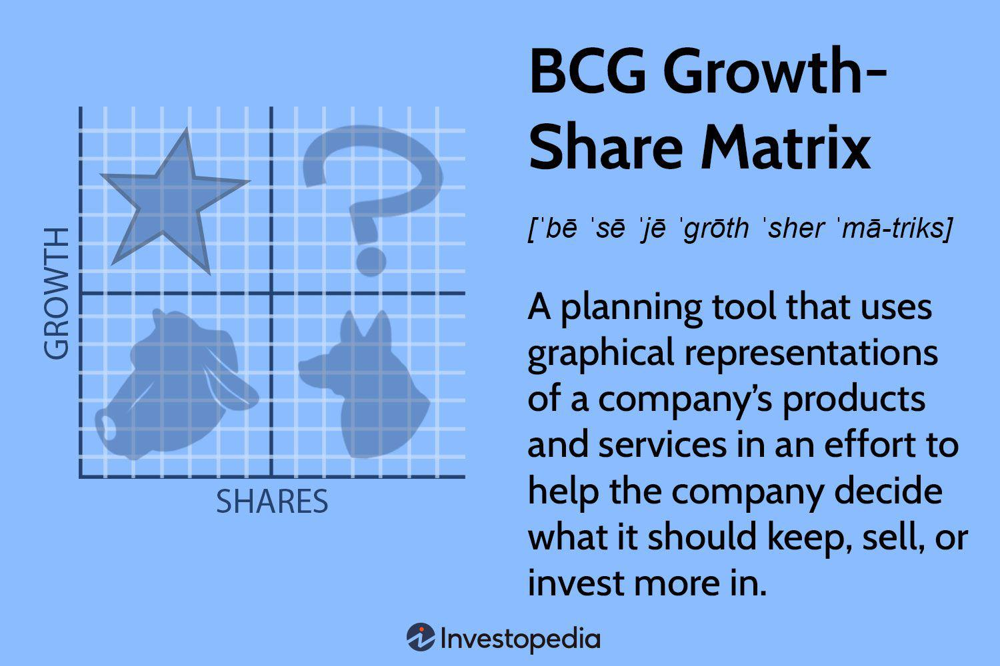

The business landscape is characterized by rapid changes, driven by technological advancements, shifting consumer preferences, and global economic fluctuations. In response, organizations employ a variety of strategic management tools to stay competitive and make informed decisions. One such tool is the BCG Matrix, developed by the Boston Consulting Group. This matrix serves as a framework that assists companies in evaluating their product portfolio by considering two fundamental dimensions: market growth and market share.

The utility of the BCG Matrix lies in its ability to classify products into four distinct categories: Stars, Cash Cows, Question Marks, and Dogs. This classification enables businesses to prioritize areas for investment, identify entities suitable for divestment, and focus on development efforts that align with the company's strategic objectives. The introduction of algorithmic trading further complements strategic management practices, offering data-driven insights that enhance decision-making speed and accuracy while also reducing human error.

This article explores the synergy between business analysis, the BCG Matrix, strategic management, and algorithmic trading. By comprehending these concepts, organizations can better allocate resources, optimize financial investments, and navigate the complex business environment. Ultimately, the strategic application of these tools helps businesses enhance their market competitiveness, ensuring sustained growth and success in a constantly evolving landscape.

## Table of Contents

## Understanding the BCG Matrix

The BCG Growth-Share Matrix, developed by the Boston Consulting Group, serves as a pivotal tool for businesses to manage their product portfolios based on market growth rate and relative market share. This analytical framework is divided into four quadrants, each representing a distinct type of product or business unit that informs strategic corporate decisions: Stars, Cash Cows, Question Marks, and Dogs.

Stars are categorized as high-growth, high-share products. These are the leaders in the market, often requiring substantial investment to maintain their position and stimulate further growth, especially in rapidly expanding markets. The high revenue potential of Stars justifies the financial commitment, aiming to convert them into Cash Cows as market growth eventually slows.

Cash Cows, conversely, are products or business units with a high market share in a low-growth market. They typically generate steady cash flows that can be used to support other business segments. These entities require less investment, procuring more capital than necessary for maintenance, thus subsidizing the company's investment in Stars or aiding in the transformation of Question Marks into future Stars.

Question Marks, or Problem Children, embody products in high-growth markets with low market share. These require careful analysis and significant investment decisions due to their uncertain potential. The overarching dilemma is determining whether further investment will transform them into Stars or if divestment is a more prudent choice, especially if they are not meeting growth expectations.

Dogs represent products with low market share in stagnant or declining markets. They are often candidates for divestment, as they typically do not generate significant profit and tie up resources that could be reallocated to more promising ventures. However, some companies may opt to retain Dogs if they serve strategic purposes beyond financial performance.

Understanding these categories aids companies in strategic planning and efficient resource allocation. By applying the BCG Matrix, businesses gain insights into prioritizing investment, divestment, and product development efforts. This systematic approach ensures that resources are directed towards business units that align with the organization's strategic objectives and long-term growth plans.

## The Role of Strategic Management

Strategic management is a critical process in business that involves setting objectives, analyzing competitive environments, and evaluating strategies for optimal performance. It is essential for guiding companies towards long-term success and sustainability. By incorporating tools such as the BCG Matrix into strategic management, businesses can enhance decision-making processes and resource allocation.

The BCG Matrix, with its categorization into Stars, Cash Cows, Question Marks, and Dogs, allows businesses to identify which units or products should receive more focus and resources. Its integration within strategic management processes aids businesses in prioritizing investments, identifying areas for cost reduction, and effectively distributing resources. This alignment with corporate mission and vision ensures that business efforts are concentrated on initiatives that drive growth and stability.

To illustrate, if a company's primary goal is to maximize growth, strategic management might emphasize developing Stars and nurturing Question Marks with a strategic potential to transform into Stars. Conversely, if stability is the priority, sustaining Cash Cows becomes crucial, while considering divestment options for Dogs. This prioritization fosters a stronger competitive position by aligning business operations with strategic goals.

Ultimately, strategic management enhances a company's ability to maintain a competitive advantage. By continuously evaluating and adjusting strategies based on the BCG Matrix outcomes, companies can navigate the complexities of market dynamics effectively. This process not only encourages robust decision-making but also supports sustained growth and the realization of corporate objectives.

## Algorithmic Trading in Strategic Management

Algorithmic trading utilizes computer algorithms to execute trading strategies automatically based on pre-established rules and conditions. This approach enhances decision-making by offering precise, data-driven insights, expediting execution speeds, and minimizing the risk of human error. The application of [algorithmic trading](/wiki/algorithmic-trading) in strategic management, particularly when combined with analytical tools like the BCG Matrix, significantly optimizes financial investment strategies and enhances risk management practices.

Algorithmic trading systems analyze vast amounts of data to identify profitable trading opportunities that align with the strategic objectives of an organization. For instance, they can assess market conditions, price trends, and historical data to make informed predictions about potential market movements. By integrating these systems with strategic management tools, businesses can allocate resources more effectively, ensuring investments are directed towards high-growth segments identified by the BCG Matrix.

A key advantage of algorithmic trading is its ability to execute trades at speeds and frequencies beyond human capabilities. Algorithms can process multiple sources of data simultaneously, allowing firms to swiftly capitalize on transient market opportunities. In essence, this integration means businesses can react to changes in the market environment more rapidly, reducing exposure to potential threats and enhancing overall agility.

Moreover, algorithmic trading supports risk management by employing strategies such as hedging or diversification. These techniques can be algorithmically implemented to protect against adverse market movements, aligning with strategic goals to maintain a balanced and well-managed portfolio. For example, if a company identifies certain products as high-risk 'Question Marks' in the BCG Matrix, algorithms can adjust investment levels accordingly, either to capitalize on their potential or to limit exposure.

Additionally, combining algorithmic trading with strategic frameworks facilitates continuous monitoring and adjustment of business strategies in response to market evolution. Algorithms can be programmed to consider various market factors and adjust trading strategies automatically, ensuring alignment with the broader organizational goals set out by the strategic management plan.

In summary, the integration of algorithmic trading within strategic management frameworks like the BCG Matrix provides a robust mechanism for firms to optimize their financial operations. By leveraging the precision and speed of algorithmic systems, companies can enhance their decision-making processes, efficiently seize market opportunities, and manage risks effectively, thereby achieving sustained business growth and competitiveness.

## Case Studies: BCG Matrix in Action

Businesses like Apple and Amazon have effectively used the BCG Matrix as a strategic tool to manage their expansive product portfolios. The Boston Consulting Group (BCG) Matrix categorizes business units or products into four quadrants based on market share and market growth: Stars, Cash Cows, Question Marks, and Dogs. This framework aids firms in making informed investment decisions and balancing their resources to foster sustainable growth.

Apple Inc. is a classic example of leveraging the BCG Matrix to inform its product development and marketing strategies. Products like the iPhone are categorized as Stars due to their high market share and growth rate. This categorization drives Apple's continuous investment in innovation and marketing to maintain the iPhone's competitive edge. Meanwhile, older products such as the iPod fall into the Dogs quadrant, characterized by low market growth and share. Recognizing these products' diminished returns, Apple strategically phased them out, allowing the company to reallocate resources to more promising ventures.

Similarly, Amazon utilizes the BCG Matrix to manage a wide range of products and services. With its dynamic market presence, Amazon categorizes fast-growing areas like Amazon Web Services (AWS) as Stars, warranting continuous investment and development to harness growth opportunities. In contrast, some of Amazon’s older or less profitable services might fall under the Dogs category, prompting strategic evaluation and potential divestment or reinvention.

The successful application of the BCG Matrix by these tech giants underscores its effectiveness as a tool for strategic portfolio management. By clearly identifying high-potential products (Stars), stable profit generators (Cash Cows), uncertain ventures (Question Marks), and low-yielding offerings (Dogs), companies like Apple and Amazon can strategically navigate their competitive landscapes, ensuring resource optimization and sustainable growth.

## Limitations and Considerations

The BCG Matrix is an influential tool in strategic management; however, it has several limitations that businesses must consider. One primary limitation is its tendency to oversimplify complex market dynamics. By categorizing products strictly based on market growth and market share, it may not fully capture nuanced factors influencing business performance. This binary framework overlooks mid-range growth opportunities, failing to account for products that do not fit neatly into the high or low growth categories.

Additionally, the BCG Matrix assumes a direct correlation between market share and profitability. This assumption can be misleading, as high market share does not always lead to increased profits. Factors such as operational efficiency, cost structures, and competitive pressures also significantly impact profitability, which the matrix does not inherently consider.

For a more comprehensive strategic analysis, it is advisable for businesses to integrate the BCG Matrix with other strategic frameworks. SWOT analysis, for instance, can complement the matrix by providing insights into a company's strengths, weaknesses, opportunities, and threats. This broader perspective enables businesses to make more informed decisions based on a multifaceted view of their operating environment.

Moreover, the effectiveness of the BCG Matrix depends on continuous monitoring and adaptation to ever-changing technological and market conditions. Businesses must remain responsive to external factors such as technological advancements, regulatory changes, and evolving consumer preferences. This dynamic approach ensures that strategic decisions remain relevant and aligned with current market realities.

In summary, while the BCG Matrix offers valuable insights, its limitations necessitate a balanced approach, leveraging additional strategic tools and maintaining agility in the business's strategic planning processes.

## The Future of Strategic Management Tools

As technology continues to advance, the integration of [artificial intelligence](/wiki/ai-artificial-intelligence) (AI) and [machine learning](/wiki/machine-learning) into strategic management tools such as the BCG Matrix is transforming how businesses approach strategic planning. These technologies facilitate more dynamic and precise analyses by adapting to new data inputs rapidly, ensuring that strategic decisions are based on the most relevant and up-to-date information.

One of the key advancements in this area is the incorporation of real-time data analytics. This technology enables businesses to interpret vast amounts of data instantaneously, which is crucial in today’s fast-paced environment. For example, real-time analytics can monitor market trends and consumer behavior continuously, offering insights that allow companies to adjust their strategies promptly. This capability significantly enhances the speed and precision of decision-making, ensuring that businesses can react swiftly to emerging opportunities or threats.

Moreover, staying informed about technological advancements is critical for maintaining a competitive edge. Companies that harness the power of AI and machine learning can predict market movements more accurately and optimize their resource allocations to maximize profitability. For instance, AI algorithms can evaluate a multitude of scenarios to suggest the most strategic moves, thereby improving the effectiveness of the BCG Matrix categorization.

The future of strategic management will likely be characterized by agility, flexibility, and innovation at its core. Businesses will need to adopt strategies that are not only efficient but also adaptable to changing market conditions. By leveraging AI-driven insights, organizations can develop strategies that are both robust and flexible, allowing for continuous adaptation and innovation. This strategic agility ensures that companies not only survive but thrive in an ever-evolving business landscape.

## Conclusion

The integration of the BCG Matrix with strategic management and algorithmic trading offers businesses a comprehensive framework to optimize their operations. By effectively employing these tools, organizations can enhance their decision-making capabilities, which is crucial for achieving sustainable growth. The BCG Matrix enables companies to strategically allocate resources by identifying high-potential products and markets, forming a basis for informed strategic planning.

Algorithmic trading complements this by offering data-driven insights that improve financial decision-making and risk management. This technological integration ensures rapid response to market dynamics, thereby reinforcing the strategic management process.

To maximize the benefits of these frameworks, businesses need to remain agile and adapt their strategies by embracing technological advancements. Incorporating innovations such as artificial intelligence and machine learning can significantly refine strategic planning, allowing them to keep pace with the swiftly changing business landscape. Consequently, careful integration of strategic frameworks ensures robust management practices and sustains competitiveness in constantly evolving markets.

## References & Further Reading

[1]: ["The BCG Growth-Share Matrix: Theory and Examples."](https://www.bcg.com/about/overview/our-history/growth-share-matrix) Boston Consulting Group.

[2]: ["Strategic Management: Concepts and Cases"](https://www.pearsonhighered.com/assets/preface/0/1/3/5/0135173949.pdf) by Fred R. David and Forest R. David

[3]: ["Algorithmic Trading and DMA: An Introduction to Direct Access Trading Strategies"](https://www.semanticscholar.org/paper/Algorithmic-trading-%26-DMA-%3A-an-introduction-to-Johnson/aa5de1ab883d5e23b6651faa7c1807586d688e4b) by Barry Johnson

[4]: ["Competitive Advantage: Creating and Sustaining Superior Performance"](https://www.amazon.com/Competitive-Advantage-Creating-Sustaining-Performance/dp/0684841460) by Michael E. Porter

[5]: ["Strategic Management and Competitive Advantage: Concepts"](https://www.amazon.com/Strategic-Management-Competitive-Advantage-Concepts/dp/0134741145) by Jay B. Barney and William S. Hesterly