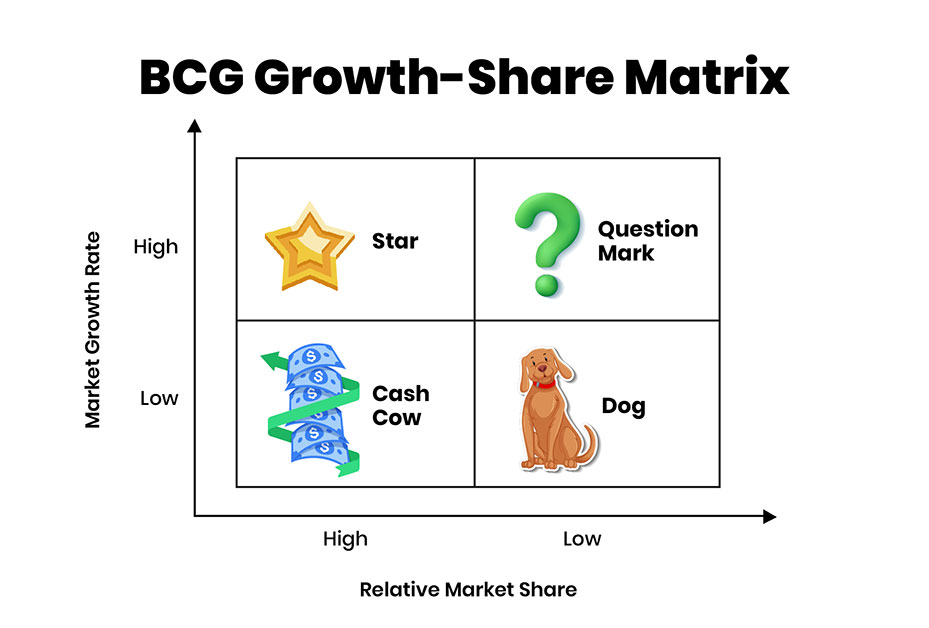

## Table of Contents

## What is the BCG Growth-Share Matrix?

The BCG Growth-Share Matrix is a tool used by businesses to help them decide where to focus their resources. It was created by the Boston Consulting Group in the 1970s. The matrix looks at a company's products or business units and sorts them into four categories based on their market growth rate and their share of the market. This helps companies see which parts of their business are doing well and which ones need more attention or might not be worth keeping.

The four categories in the matrix are called Stars, Cash Cows, Question Marks, and Dogs. Stars are products that have a high market share in a fast-growing market. They need a lot of investment to keep growing but can be very profitable. Cash Cows are products with a high market share in a slow-growing market. They bring in a lot of money but don't need much investment. Question Marks are products with a low market share in a fast-growing market. They might need a lot of investment to become Stars, but they could also fail. Dogs are products with a low market share in a slow-growing market. They usually don't bring in much money and might be better off being sold or closed down.

## Who developed the BCG Growth-Share Matrix and when?

The BCG Growth-Share Matrix was developed by the Boston Consulting Group. The main person behind it was Bruce Henderson, who was the founder and president of the company. He came up with the idea in the early 1970s. The matrix was first introduced to help companies make better decisions about where to spend their money and effort.

The BCG Growth-Share Matrix became popular because it was a simple way to look at a company's different products or business units. It helped companies see which parts of their business were doing well and which parts needed more work or might not be worth keeping. Since then, it has been used by many businesses around the world to plan their strategies.

## What are the four quadrants of the BCG Matrix?

The BCG Matrix has four quadrants that help businesses understand where their products stand in the market. The first quadrant is called Stars. These are products that have a high share of a fast-growing market. They need a lot of investment to keep growing, but they can also bring in a lot of money. The second quadrant is called Cash Cows. These products have a high share of a slow-growing market. They don't need much investment but can still make a lot of money for the company.

The third quadrant is called Question Marks. These are products with a low share of a fast-growing market. They might need a lot of investment to become Stars, but there's also a risk they could fail. The fourth quadrant is called Dogs. These products have a low share of a slow-growing market. They usually don't bring in much money and might be better off being sold or closed down. By looking at these quadrants, companies can decide where to focus their resources.

## How is market growth rate calculated in the BCG Matrix?

In the BCG Matrix, the market growth rate is calculated by looking at how much a market is growing over time. It's usually shown as a percentage. To find this percentage, you compare the market size at two different times, often a year apart. You take the difference between the later market size and the earlier market size, divide that by the earlier market size, and then multiply by 100 to get a percentage. This percentage tells you how fast the market is growing.

For example, if a market was worth $100 million last year and it's worth $110 million this year, the market growth rate would be calculated like this: ($110 million - $100 million) / $100 million * 100 = 10%. This means the market grew by 10% over the year. In the BCG Matrix, a market growth rate above a certain level, often around 10%, is considered high growth, and anything below that is seen as low growth. This helps companies decide which of their products are in fast-growing markets and which are in slower ones.

## What does relative market share represent in the BCG Matrix?

Relative market share in the BCG Matrix shows how well a company's product is doing compared to its biggest competitor in the same market. It's calculated by taking the company's market share and dividing it by the market share of the largest competitor. If the number is more than 1, it means the company's product is doing better than the biggest competitor. If it's less than 1, the product is doing worse.

In the BCG Matrix, a high relative market share means the product is a leader in its market. These products are placed on the right side of the matrix, showing they have a strong position. A low relative market share means the product is not doing as well and is placed on the left side. This helps companies see which products are strong and which ones might need more work or might not be worth keeping.

## How can the BCG Matrix help in strategic business decisions?

The BCG Matrix helps businesses make smart choices about where to spend their time and money. By putting products into four groups - Stars, Cash Cows, Question Marks, and Dogs - companies can see which products are doing well and which ones need more help. For example, if a product is a Star, it's doing great in a fast-growing market, but it might need more money to keep growing. A Cash Cow, on the other hand, is making a lot of money but doesn't need much investment. This helps companies decide to put more money into Stars and use the money from Cash Cows to help them grow.

The BCG Matrix also helps companies decide what to do with products that aren't doing so well. If a product is a Question Mark, it's in a fast-growing market but isn't doing great yet. Companies might choose to invest more in these products to turn them into Stars, or they might decide to stop spending money on them if they don't think they'll do well. Dogs are products that aren't doing well in a slow-growing market. Companies might choose to sell these products or stop making them altogether. By using the BCG Matrix, businesses can make better plans and use their resources in the best way possible.

## What are the limitations of using the BCG Growth-Share Matrix?

The BCG Growth-Share Matrix has some problems that businesses should know about. One big problem is that it looks at market share and growth rate, but it doesn't think about other important things like how much money a product makes or how much it costs to make it. Also, the matrix can be hard to use because it's not always clear how to measure market growth and share. Sometimes, the numbers can be different depending on who is looking at them, which can make it hard to decide where a product should go on the matrix.

Another problem is that the BCG Matrix can make companies focus too much on just a few products, like Stars and Cash Cows, and not pay enough attention to others. This can be bad if the market changes and the products that were doing well start to do worse. The matrix also doesn't think about how products might work together or how new products might change the market. It's good for a quick look at where a company stands, but it might not be the best tool for making long-term plans.

## Can you provide an example of how a company might use the BCG Matrix?

Let's say there's a company called TechGadgets that makes different kinds of electronic devices. They want to see how their products are doing, so they use the BCG Matrix. They have four main products: smartphones, e-readers, smartwatches, and headphones. After looking at the market growth rates and their market shares, they put their smartphones in the Stars quadrant because they have a high market share in a fast-growing market. They need to keep investing in these to stay on top. Their e-readers go in the Cash Cows quadrant because they have a high market share but the market isn't growing fast. These make a lot of money without needing much new investment.

Their smartwatches end up in the Question Marks quadrant. They have a low market share but the market is growing quickly. TechGadgets needs to decide if they should put more money into these to try to make them Stars, or if they should stop spending on them. Lastly, their headphones are in the Dogs quadrant because they have a low market share in a market that's not growing much. TechGadgets might think about selling this part of the business or stopping making these headphones altogether. By using the BCG Matrix, TechGadgets can see where to focus their efforts and money to make the best decisions for their future.

## How does the BCG Matrix integrate with other strategic planning tools?

The BCG Matrix can work well with other tools that help companies plan their strategies. One common tool is the SWOT analysis, which looks at a company's Strengths, Weaknesses, Opportunities, and Threats. By using the BCG Matrix first to see where products stand, a company can then do a SWOT analysis on each product to understand more about what is helping or hurting it. For example, if a product is a Star, the SWOT analysis can help find out what strengths are making it do well and what opportunities there are to grow even more. If it's a Dog, the SWOT can show what weaknesses and threats are causing problems, helping the company decide if it's worth trying to fix them or if it's better to move on.

Another tool that can be used with the BCG Matrix is the Ansoff Matrix, which helps companies think about how to grow. The Ansoff Matrix looks at four ways to grow: selling more of what you already make to your current customers (Market Penetration), selling new things to your current customers (Product Development), selling what you already make to new customers (Market Development), or selling new things to new customers (Diversification). After using the BCG Matrix to see which products are doing well, a company can use the Ansoff Matrix to figure out the best way to grow those products. For example, if a product is a Cash Cow, the company might focus on Market Penetration to get more money out of it. If it's a Question Mark, they might look at Product Development to try to turn it into a Star. By using these tools together, companies can make better plans and use their resources in the best way possible.

## What are some common criticisms of the BCG Matrix?

Some people say the BCG Matrix is too simple. It only looks at market growth and market share, but there are other things that matter too, like how much money a product makes or costs to make. Also, it can be hard to know the exact numbers for market growth and share. Different people might see the same numbers in different ways, which can make it hard to decide where a product should go on the matrix. This can lead to bad decisions if the numbers are not right.

Another problem is that the BCG Matrix can make companies focus too much on just a few products, like Stars and Cash Cows, and not pay enough attention to others. This can be bad if the market changes and the products that were doing well start to do worse. The matrix also doesn't think about how products might work together or how new products might change the market. It's good for a quick look at where a company stands, but it might not be the best tool for making long-term plans.

## How has the application of the BCG Matrix evolved since its introduction?

Since the BCG Matrix was introduced in the early 1970s, its use has changed a lot. At first, it was a simple way for companies to see which products were doing well and which ones needed more work. It helped them decide where to spend their money. Over time, people started to see that the matrix was too simple. They realized it didn't look at everything that matters, like how much money a product makes or costs to make. So, companies began using it along with other tools like SWOT analysis and the Ansoff Matrix to get a better picture of their business.

Today, the BCG Matrix is still used, but it's often part of a bigger plan. Companies use it to get a quick look at their products, but they also use other tools to make sure they're not missing anything important. They know that the market can change fast, so they need to look at more than just market growth and share. The BCG Matrix is now just one part of a bigger set of tools that help companies make smart choices about their future.

## What advanced strategies can be derived from the insights of the BCG Matrix?

The BCG Matrix can help companies come up with smart plans for their products. For example, if a product is a Star, it means it's doing well in a fast-growing market. Companies might decide to put more money into these products to keep them growing. They could also look for ways to make the product even better or find new places to sell it. If a product is a Cash Cow, it's making a lot of money but the market isn't growing fast. Companies might use the money from these products to help their Stars or Question Marks grow. They might also try to keep their Cash Cows going strong by making sure they stay popular with customers.

If a product is a Question Mark, it's in a fast-growing market but isn't doing great yet. Companies have to decide if they want to spend more money to make it a Star or if they should stop trying. They might look for new ways to sell the product or make it better to see if they can turn it into a Star. If a product is a Dog, it's not doing well in a slow-growing market. Companies might decide to sell this part of their business or stop making the product altogether. They could also try to find a new use for the product or sell it to a different group of people to see if they can make it work. By using the BCG Matrix, companies can make plans that help them use their money and time in the best way possible.

## References & Further Reading

[1]: ["The BCG Growth-Share Matrix: Theory and Examples."](https://www.bcg.com/about/overview/our-history/growth-share-matrix) Boston Consulting Group.

[2]: ["Strategic Management: Concepts and Cases"](https://www.pearsonhighered.com/assets/preface/0/1/3/5/0135173949.pdf) by Fred R. David and Forest R. David

[3]: ["Algorithmic Trading and DMA: An Introduction to Direct Access Trading Strategies"](https://www.semanticscholar.org/paper/Algorithmic-trading-%26-DMA-%3A-an-introduction-to-Johnson/aa5de1ab883d5e23b6651faa7c1807586d688e4b) by Barry Johnson

[4]: ["Competitive Advantage: Creating and Sustaining Superior Performance"](https://www.amazon.com/Competitive-Advantage-Creating-Sustaining-Performance/dp/0684841460) by Michael E. Porter

[5]: ["Strategic Management and Competitive Advantage: Concepts"](https://www.amazon.com/Strategic-Management-Competitive-Advantage-Concepts/dp/0134741145) by Jay B. Barney and William S. Hesterly