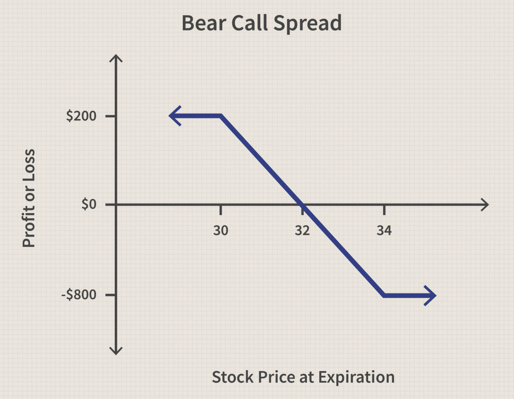

## Table of Contents

## What is a Bear Call Spread?

A Bear Call Spread is an options trading strategy used when you think a stock's price will go down a little or stay the same. It involves selling a call option at a lower strike price and buying another call option at a higher strike price. Both options have the same expiration date. The goal is to make money from the premium you get from selling the first call option, which is more than the cost of buying the second call option.

This strategy limits both your potential profit and loss. The maximum profit you can make is the net premium received when you set up the spread. This happens if the stock price stays below the lower strike price at expiration. The maximum loss is the difference between the strike prices minus the net premium received. This occurs if the stock price goes above the higher strike price at expiration. Bear Call Spreads are popular because they allow traders to have a bearish outlook while also controlling risk.

## How does a Bear Call Spread work?

A Bear Call Spread is a strategy used in options trading when you think a stock's price will go down a bit or stay the same. To set it up, you sell a call option with a lower strike price and buy another call option with a higher strike price. Both options will have the same expiration date. When you do this, you get money from selling the first call option, which is more than what you pay for buying the second call option. The difference between what you get and what you pay is called the net premium, and that's your potential profit if everything goes as planned.

The way it works is that if the stock price stays below the lower strike price by the expiration date, both call options will expire worthless, and you keep the net premium as your profit. But if the stock price goes above the higher strike price, you could lose money. The most you can lose is the difference between the two strike prices minus the net premium you received. This happens because the person who bought the lower strike call option can now exercise it, and you'll have to sell them the stock at the lower price even though it's worth more. But since you also bought a call option at the higher strike price, you can use that to buy the stock at the higher price and then sell it at the lower price to the first person, limiting your loss.

## What are the key components of a Bear Call Spread?

A Bear Call Spread has two main parts. The first part is selling a call option at a lower strike price. This means you get money right away, which is called the premium. The second part is buying a call option at a higher strike price. This costs you some money, but it helps to limit how much you could lose. Both options need to have the same expiration date.

When you set up a Bear Call Spread, the money you get from selling the first call option is more than what you pay for the second call option. The difference between these amounts is your net premium, and that's the most you can make if the stock price stays below the lower strike price until the options expire. If the stock price goes above the higher strike price, you could lose money, but the most you can lose is the difference between the two strike prices minus the net premium you received. This setup helps you make a little money if the stock goes down or stays the same, while also keeping your risk under control.

## What is the maximum profit potential of a Bear Call Spread?

The maximum profit you can make from a Bear Call Spread is the net premium you receive when you set it up. This happens if the stock price stays below the lower strike price until the options expire. When you sell a call option at a lower strike price, you get money, which is called the premium. Then, you buy another call option at a higher strike price, which costs you some money. The difference between the premium you get and the cost of the second option is your net premium, and that's your maximum profit if the stock price stays low.

If the stock price goes above the lower strike price but stays below the higher strike price, you might still make some money, but it won't be as much as the maximum profit. The Bear Call Spread is designed to give you a profit if the stock price goes down a little or stays the same, but it also limits how much you can lose if the stock price goes up a lot.

## What is the maximum loss potential of a Bear Call Spread?

The most you can lose with a Bear Call Spread is the difference between the two strike prices minus the net premium you received. This happens if the stock price goes above the higher strike price by the time the options expire. When you set up a Bear Call Spread, you sell a call option at a lower strike price and buy another call option at a higher strike price. If the stock price goes way up, the person who bought the lower strike call option can make you sell them the stock at that lower price, even though it's worth more now.

But, because you also bought a call option at the higher strike price, you can use that to buy the stock at the higher price and then sell it at the lower price to the first person. This limits how much you can lose. The most you can lose is the difference between the two strike prices minus the net premium you received when you set up the spread. This setup helps you control your risk while still giving you a chance to make some money if the stock price stays down or doesn't go up too much.

## How do you calculate the break-even point for a Bear Call Spread?

To find the break-even point for a Bear Call Spread, you need to know the two strike prices and the net premium you received. The break-even point is the stock price where you neither make money nor lose money. You find it by adding the net premium to the lower strike price. So, if you sold a call option at a lower strike price of $50 and bought a call option at a higher strike price of $55, and you received a net premium of $2, your break-even point would be $50 plus $2, which equals $52.

If the stock price is at the break-even point of $52 when the options expire, the call option you sold at $50 would be worth $2, and the call option you bought at $55 would be worthless. Since you received $2 from selling the $50 call option and paid nothing for the $55 call option (because it's worthless), you break even. If the stock price is below $52, you make money, and if it's above $52, you lose money.

## What are the steps to set up a Bear Call Spread?

To set up a Bear Call Spread, you first need to find a stock you think will go down a little or stay the same. Then, you sell a call option at a lower strike price. This means you get money right away, which is called the premium. Next, you buy another call option at a higher strike price. This costs you some money, but it helps limit how much you could lose. Both options should have the same expiration date. The money you get from selling the first call option should be more than what you pay for the second call option. The difference between these amounts is your net premium, and that's the most you can make if the stock price stays below the lower strike price until the options expire.

After setting up the Bear Call Spread, you need to keep an eye on the stock price. If it stays below the lower strike price by the time the options expire, both options will be worthless, and you keep the net premium as your profit. But if the stock price goes above the higher strike price, you could lose money. The most you can lose is the difference between the two strike prices minus the net premium you received. This happens because the person who bought the lower strike call option can make you sell them the stock at the lower price, but since you also bought a call option at the higher strike price, you can use that to buy the stock at the higher price and then sell it at the lower price to the first person, limiting your loss.

## What are the risks associated with Bear Call Spreads?

Bear Call Spreads come with some risks you should know about. The biggest risk is if the stock price goes above the higher strike price by the time the options expire. If this happens, you could lose a lot of money. The most you can lose is the difference between the two strike prices minus the net premium you received. This means if the stock price goes way up, you could end up losing more than you made from the net premium.

Another risk is that the stock price might not stay below the lower strike price like you hoped. If it goes above the lower strike price but stays below the higher strike price, you might still lose some of the net premium you received. This is because the call option you sold will be worth something, and you'll have to pay that amount to the person who bought it. Also, if the stock price is right at the break-even point when the options expire, you won't make any money, which can be disappointing if you were hoping to make a profit.

## How does time decay affect a Bear Call Spread?

Time decay, or theta, is how the value of an option goes down as it gets closer to expiring. For a Bear Call Spread, time decay can be good for you. When you set up the spread, you get money from selling the call option at the lower strike price. As time goes by, if the stock price stays below the lower strike price, the value of both options you sold and bought will go down. But since you got more money from selling the first call option than you paid for the second one, the time decay works in your favor. It helps you keep more of the net premium you received.

But time decay can also be a problem if the stock price goes up a lot. If the stock price goes above the lower strike price but stays below the higher strike price, the call option you sold will lose value slower than the one you bought. This means you might lose some of the net premium you got. And if the stock price goes above the higher strike price, time decay won't help you at all. You could still lose money, but the most you can lose is the difference between the two strike prices minus the net premium you received. So, while time decay can help you make money if the stock price stays low, it can also make things worse if the stock price goes up too much.

## What is the impact of implied volatility on a Bear Call Spread?

Implied [volatility](/wiki/volatility-trading-strategies) is how much people think a stock's price might move in the future. When you set up a Bear Call Spread, high implied volatility can be good for you because it means you get more money from selling the call option at the lower strike price. This is because options with high implied volatility are more expensive. So, if you think the stock price will stay the same or go down a little, you can use the extra money you get from the high implied volatility to increase your potential profit.

But, if implied volatility goes down after you set up your Bear Call Spread, it can be bad for you. This is because the value of both options you sold and bought will go down. But since you got more money from selling the first call option, the drop in implied volatility can help you keep more of the net premium you received. However, if the stock price goes up a lot, a drop in implied volatility won't help you much. You could still lose money, but the most you can lose is the difference between the two strike prices minus the net premium you received.

## How can you adjust a Bear Call Spread if the market moves against your position?

If the market moves against your Bear Call Spread and the stock price goes up, you might want to make some changes to your position to cut your losses or give yourself a better chance to make money. One way to do this is by rolling up the short call. This means you buy back the call option you sold at the lower strike price and sell a new one at a higher strike price. This can help you get more money and push your break-even point higher, which might give you a better chance to make a profit if the stock price keeps going up.

Another way to adjust your Bear Call Spread is by rolling out the expiration date. This means you close out your current options and open new ones with a later expiration date. By doing this, you give the stock more time to go back down or stay below the lower strike price. This can be helpful if you think the stock price will go down soon, but it also means you'll have to pay more money to keep the position open. Both of these adjustments can help you manage your risk and potentially turn a losing position into a winning one, but they also come with their own costs and risks.

## What are some advanced strategies that involve Bear Call Spreads?

One advanced strategy that involves Bear Call Spreads is called the "Iron Condor." This strategy combines a Bear Call Spread with a Bull Put Spread. In an Iron Condor, you sell a call option at a lower strike price and buy a call option at a higher strike price to create the Bear Call Spread. At the same time, you sell a put option at a higher strike price and buy a put option at a lower strike price to create the Bull Put Spread. The goal is to make money from the net premium you get from both spreads if the stock price stays within a certain range until the options expire. This can be a good strategy if you think the stock won't move much in either direction.

Another advanced strategy is called the "Double Diagonal Spread." This strategy involves setting up two diagonal spreads, one of which can be a Bear Call Spread. In a Double Diagonal Spread, you might sell a short-term Bear Call Spread and buy a longer-term call option at a higher strike price. At the same time, you could sell a short-term Bull Put Spread and buy a longer-term put option at a lower strike price. The idea is to take advantage of time decay and changes in implied volatility. If the stock price stays within a certain range and the options you sold lose value faster than the options you bought, you could make money. This strategy can be complex, but it gives you more ways to make money if the stock price doesn't move too much.

## References & Further Reading

[1]: ["Advances in Financial Machine Learning"](https://www.amazon.com/Advances-Financial-Machine-Learning-Marcos/dp/1119482089) by Marcos Lopez de Prado

[2]: ["Evidence-Based Technical Analysis: Applying the Scientific Method and Statistical Inference to Trading Signals"](https://www.amazon.com/Evidence-Based-Technical-Analysis-Scientific-Statistical/dp/0470008741) by David Aronson

[3]: ["Machine Learning for Algorithmic Trading"](https://github.com/stefan-jansen/machine-learning-for-trading) by Stefan Jansen

[4]: ["Quantitative Trading: How to Build Your Own Algorithmic Trading Business"](https://www.amazon.com/Quantitative-Trading-Build-Algorithmic-Business/dp/1119800064) by Ernest P. Chan

[5]: Bergstra, J., Bardenet, R., Bengio, Y., & Kégl, B. (2011). ["Algorithms for Hyper-Parameter Optimization."](https://dl.acm.org/doi/10.5555/2986459.2986743) Advances in Neural Information Processing Systems 24.