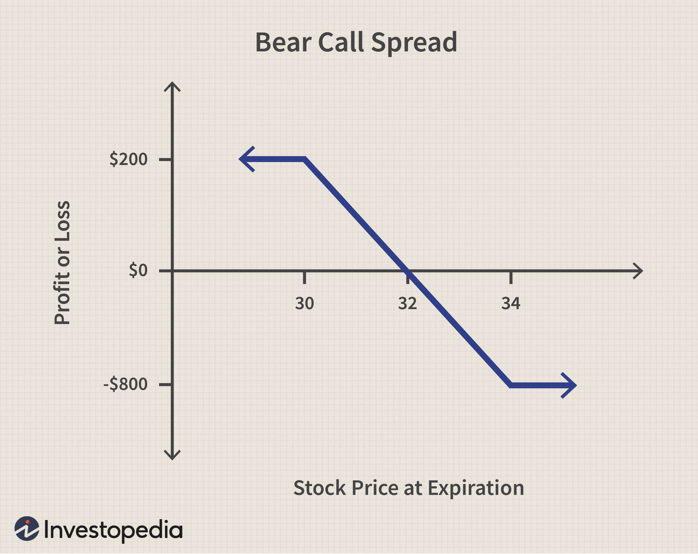

Options trading is a vital component of modern financial markets, offering a range of strategies that enable investors to capitalize on market movements with flexibility and precision. At its core, options trading involves buying and selling contracts that give traders the right, but not the obligation, to buy or sell an underlying asset at a predetermined price before a specified expiration date. This flexibility allows traders to tailor their market exposure and manage risk more effectively compared to traditional equity trading.

A key strategy in options trading is the bear call spread, a conservative approach that capitalizes on bearish market trends. This strategy involves the simultaneous sale of a call option and the purchase of another call option with a higher strike price on the same underlying asset and expiration date. The primary objective of a bear call spread is to generate income from the premiums collected, with a limited profit potential but also reduced risk compared to outright call selling. This makes it an attractive choice for traders who anticipate moderate declines or stable markets.



Algorithmic trading, or algo trading, has revolutionized contemporary financial strategies by employing computer programs to execute trades at high speeds and frequencies. Leveraging complex algorithms, this technique assesses numerous variables and market conditions to implement trading strategies with precision and efficiency beyond human capabilities. Algorithms in trading are designed to process vast data sets, recognize patterns, and execute trades instantaneously, thus optimizing the trading process and minimizing potential human errors.

This article aims to explore the intersection of bear call spreads and algorithmic trading, highlighting how traditional options strategies can be enhanced through technological advancement. By understanding how these two elements work together, traders can optimize their strategies to align with the fast-paced dynamics of today's markets.

Key sections to be covered in this article include a thorough understanding of bear call spreads and their components, an examination of the essentials of algorithmic trading, and insights on how to integrate these two aspects for enhanced trading efficacy. Additionally, the advantages and limitations of employing algorithms in options trading will be discussed, along with strategies for effective risk management. This synthesis of conventional trading approaches with modern technology represents a promising frontier for traders seeking to capitalize on evolving market opportunities.

## Table of Contents

## Understanding Bear Call Spreads

A bear call spread is an options trading strategy that seeks to generate a premium income while limiting the potential loss from adverse market movements. It involves two components: selling a call option with a lower strike price and buying another call option with a higher strike price. Both options have the same expiration date. The strategy is also referred to as a "credit call spread" because the sale of the call option at the lower strike price results in a net credit to the trader's account.

The primary objective of the bear call spread is to profit from a decline or stagnation in the price of the underlying asset. By selling the call option closer to the current market price, the trader collects a premium. Simultaneously, buying a call option with a higher strike price acts as a form of insurance, capping potential losses if the market moves against the trader's expectations.

### Components of a Bear Call Spread

1. **Short Call Option**: This is the call option that the trader sells, having a lower strike price. Selling this option generates immediate premium income.

2. **Long Call Option**: This is the call option that the trader buys, having a higher strike price. The purchase of this option serves to limit the potential losses if the underlying asset’s price increases significantly.

### Utilization of Bear Call Spread Strategy

The bear call spread strategy is typically employed when a trader expects a bearish or neutral market outlook—anticipating that the price of the underlying asset will either fall or remain below the lower strike price. It is an appropriate strategy when the market demonstrates slight downward trends or low [volatility](/wiki/volatility-trading-strategies). This allows the trader to benefit from premiums collected while being protected against significant losses.

### Risk vs Reward: Understanding the Trade-offs

The bear call spread offers a balanced trade-off between risk and reward. The primary risk is that the underlying asset's price could rise above the higher strike price, resulting in a loss. However, this potential loss is limited by the difference between the strike prices, minus the net premium received. Conversely, the maximum potential reward is confined to the net premium received when the options are initiated.

Mathematically, the maximum potential loss and gain of a bear call spread can be expressed as:

- **Maximum Profit** = $P = \text{Net Premium Received}$
- **Maximum Loss** = $L = (\text{High Strike Price} - \text{Low Strike Price}) - \text{Net Premium Received}$

### Example of a Bear Call Spread

Consider a stock currently trading at $50, where an options trader sets up a bear call spread by:

- Selling a call option with a strike price of $55 for a premium of $2.
- Buying a call option with a strike price of $60 for a premium of $1.

Here, the net premium received is $2 - 1 = \$1$.

- **Maximum Profit**: This is the net premium received, which is $1 per share. Given the standardized options contract size of 100 shares, the maximum total profit would be $100.

- **Maximum Loss**: The difference between the strike prices is $5 (\$60 - \$55), minus the net premium received (\$1), resulting in a maximum loss of $4 per share, or $400 for one contract.

To summarize, the bear call spread is a conservative options strategy that provides traders with a way to capitalize on either bearish or stagnant market conditions while maintaining a protective ceiling against considerable losses through the purchase of a higher strike call option.

## Basics of Algorithmic Trading

Algorithmic trading, often referred to as algo trading, involves using computer programs to automate trading decisions and execution. Its presence is expanding across financial markets due to its ability to process complex data quickly and execute orders at speeds far beyond human capability. This method significantly enhances efficiency and accuracy, minimizing human error and emotion-driven decisions.

### Design and Execution of Trading Algorithms

Algorithms in trading are designed using a set of defined rules that dictate when and how to trade securities. These rules can be based on various factors, including timing, price, quantity, or any mathematical model. The primary advantage lies in the speed and efficiency it brings to trading processes. Algorithms can execute thousands of trades per second, allowing traders to capitalize on fleeting market opportunities, which is especially crucial in the high-frequency trading ([HFT](/wiki/high-frequency-trading-strategies)) space.

### Common Algorithms in Options Trading

Several types of algorithms are prevalent in options trading, each serving a distinct purpose:

1. **Market-Making Algorithms:** These are designed to provide liquidity to the market by continuously quoting buy and sell prices for options. 

2. **Arbitrage Algorithms:** These exploit price discrepancies of the same or related options across different markets or platforms to generate profit.

3. **Trend-Following Algorithms:** These track market data trends and trigger trades aligned with the market direction.

4. **Statistical Arbitrage Algorithms:** These utilize statistical methods to identify trading opportunities based on historical data correlations between securities.

### Risks and Challenges

Despite the numerous benefits, [algorithmic trading](/wiki/algorithmic-trading) comes with its share of risks and challenges. One significant risk is the potential for algorithmic errors, which can lead to substantial financial losses. These errors can arise from programming mistakes, incorrect data inputs, or unforeseen market events. Furthermore, the competitive nature of algorithmic trading can lead to increased market volatility, especially with high-frequency trading activities.

Regulatory compliance is another challenge. Regulators continuously adapt to the evolving market dynamics introduced by algorithmic trading, requiring traders to ensure their algorithms meet current standards and regulations.

### Data Analysis in Developing Algorithms

Data analysis is crucial for developing robust trading algorithms. It involves processing and analyzing large volumes of historical and real-time market data to identify patterns and trends that can inform trading decisions. This process is typically supported by advanced technologies, such as [machine learning](/wiki/machine-learning) and [artificial intelligence](/wiki/ai-artificial-intelligence), which help in predicting market movements and identifying optimal trading strategies.

Python is a preferred language for developing trading algorithms due to its simplicity and the comprehensive suite of data analysis libraries, such as Pandas, NumPy, and Scikit-learn. Here is a simple example of how an algorithm might look in Python to analyze a moving average trend:

```python
import pandas as pd

# Load historical data
data = pd.read_csv('historical_data.csv')

# Calculate moving averages
data['Short_MA'] = data['Close'].rolling(window=20).mean()
data['Long_MA'] = data['Close'].rolling(window=50).mean()

# Generate buy and sell signals
data['Signal'] = 0
data.loc[data['Short_MA'] > data['Long_MA'], 'Signal'] = 1
data.loc[data['Short_MA'] < data['Long_MA'], 'Signal'] = -1
```

This algorithm calculates short-term and long-term moving averages to generate buy and sell signals. Such strategies highlight the role of statistical analysis in developing algorithms that can potentially optimize trading outcomes. 

While algorithmic trading is transformative for financial markets, the necessity for rigorous testing and validation cannot be overstated to mitigate risks and ensure reliability and compliance.

## Integrating Bear Call Spread Strategy with Algo Trading

Automating the bear call spread strategy using algorithms involves several coordinated steps that benefit from computational precision and efficiency. The bear call spread, which involves writing and buying call options at different strike prices, can be systematically managed using algorithms to optimize execution and monitor the market conditions that necessitate action.

### How to Automate the Bear Call Spread Strategy

**Algorithm Design:** To automate the bear call spread strategy, the primary goal is to translate the manual activities of identifying, initiating, and managing positions into programmable tasks. The basic structure involves:

1. **Market Scanning:** Algorithms continuously scan market data to identify stocks or assets where a bearish sentiment is developing, indicating profitability for bear call spreads.

2. **Signal Generation:** Define mathematical models or conditions, such as moving averages or momentum indicators, that trigger the launch of a bear call spread.

3. **Order Execution:** Programmatic execution involves placing simultaneous buy and sell orders for calls at the predefined strike prices. Zero-latency execution reduces manual lag and improves pricing efficiency.

**Sample Python Code for Execution:**
```python
import alpaca_trade_api as tradeapi
import numpy as np

def calculate_signals(data):
    # Example: simple moving average strategy
    short_window = 50
    long_window = 200
    signals = np.where(data['short_price'] > data['long_price'], 1, 0)
    return signals

def place_bear_call_spread(api, symbol, short_strike, long_strike):
    # Submit sell order for short call
    short_order = api.submit_order(
        symbol=symbol,
        qty=1,
        side='sell',
        type='limit',
        time_in_force='gtc',
        limit_price=short_strike
    )
    # Submit buy order for long call
    long_order = api.submit_order(
        symbol=symbol,
        qty=1,
        side='buy',
        type='limit',
        time_in_force='gtc',
        limit_price=long_strike
    )

api = tradeapi.REST(API_KEY, API_SECRET, BASE_URL, api_version='v2')
symbol = 'AAPL'
data = ... # Load market data for the symbol
signals = calculate_signals(data)
if signals[-1] == 1:
    place_bear_call_spread(api, symbol, 150, 155)
```

### Key Considerations for Developers

- **Market Volatility:** Algorithms must account for market volatility and rapidly changing conditions. This involves coding for different scenarios where spreads may become unprofitable.

- **Regular Updates:** The market environment suggests frequent strategy testing and updates. Developers should ensure their models reflect current market dynamics and adjust algos accordingly.

- **Transaction Costs:** Incorporate transaction costs into the algorithms to ensure net profitability calculations are realistic. High-frequency strategies, especially, can incur significant costs that erode profits.

### Backtesting Algorithms

Backtesting is a critical step that allows developers to assess the performance of their strategies using historical data. Developers should:

- Use extensive data sets to ensure strategies aren't overfitted to particular market conditions.
- Implement out-of-sample testing to validate strategy robustness.
- Ensure that backtesting environments mimic live trading conditions as closely as possible, particularly in aspects of liquidity and slippage.

### Pitfalls to Avoid

- **Overfitting:** A model that performs exceptionally well on past data may fail in live trading. Maintain a balance between model complexity and generalizability.
- **Ignoring Slippage and Spreads:** Real market conditions often include slippage and variable spreads—factors that must be coded into test environments.
- **Lack of Diversification:** Betting solely on one strategy or asset can lead to increased risk. Combining different strategies can improve resilience against market shifts.

### Case Studies on Successful Algorithmic Integration

Several firms and private traders have successfully integrated bear call spreads into their algorithmic trading portfolios. For instance:

- **CTA Firms** (Commodity Trading Advisors) have utilized automated systems to manage option spreads on commodities with great sophistication, integrating macroeconomic data feeds to refine signal generation.
- **Quantitative Hedge Funds** have developed proprietary software that dynamically adjusts their positions in bear call spreads based on real-time statistical arbitrage between equity and market indices.

By strategically automating options trading strategies such as bear call spreads, traders can capitalize on technological advances to reduce emotional bias, improve market responsiveness, and leverage systematic approaches to consistent profitability.

## Advantages and Disadvantages

Algorithmic trading offers several distinct advantages for implementing bear call spread strategies. One of the most significant benefits is the precision and speed at which trades can be executed. Algorithms can process market data and execute trades in fractions of a second, far exceeding human capabilities. This rapid execution is crucial in options trading, where market conditions can change rapidly. By leveraging algorithmic trading, traders can capitalize on slight price discrepancies, optimizing entry and [exit](/wiki/exit-strategy) points for bear call spreads for maximum profitability.

Another advantage is the consistency of execution. Algorithms follow predefined rules without the influence of emotions, reducing the risk of human error. This consistency ensures that bear call spreads are executed as planned, enhancing the reliability of the trading strategy. Additionally, automation enables the simultaneous monitoring of multiple markets and securities, permitting traders to diversify their portfolios and hedge risks more effectively.

Despite these advantages, algorithmic trading also presents certain disadvantages and limitations. One significant drawback is the reliance on historical data to predict future movements. While [backtesting](/wiki/backtesting) provides insights into how a strategy might perform, it cannot account for unprecedented market events that may affect bear call spreads differently. Overfitting, where algorithms are excessively tailored to historical data, might reduce the strategy's robustness under real market conditions.

Algorithmic approaches may not be ideal in highly volatile or illiquid markets. In such environments, the speed advantage might be offset by the inability to execute trades at favorable prices due to wide bid-ask spreads or low trading volumes. This scenario can impact the profitability of bear call spreads, as achieving the intended risk-reward balance becomes challenging.

When comparing algorithmic to manual trading of bear call spreads, algorithms exhibit an undeniable superiority in processing power and speed. However, manual trading allows for intuition and adaptability, especially in unpredictable market conditions where algorithms may struggle to adjust rapidly. Experienced traders might identify opportunities outside the scope of their algorithms, taking advantage of qualitative assessments that machines do not possess.

Market conditions significantly influence the effectiveness of algorithms. In trending markets, algorithms designed for bear call spreads may struggle if they don't incorporate adaptive elements, as the underlying securities may breach the sold call options' strike prices, leading to potential losses. Conversely, in stable markets, algorithms can efficiently exploit the stable premium decay.

Effective risk management is crucial in algorithmic trading to mitigate potential losses. Strategies such as setting predefined stop-loss orders in the algorithm can limit downside risk. Diversifying the algorithmic portfolio across different strategies and securities can also reduce exposure to specific market events. Regular monitoring and adjustment of algorithms to reflect evolving market conditions ensure that the automated bear call spreads align with current financial contexts, enhancing their success rate.

In conclusion, while algorithmic trading presents numerous advantages for deploying bear call spreads, acknowledging its limitations and employing robust risk management strategies are vital for optimizing its effectiveness. Understanding the inherent trade-offs and aligning algorithmic strategies with prevailing market conditions can significantly enhance the outcomes of bear call spread implementations.

## Conclusion

In this article, we explored the intersection of bear call spreads within the domain of algorithmic trading. This integration signifies the evolving landscape of options trading, where traditional strategies are being enhanced by modern technology. The bear call spread, a conservative option strategy, offers the potential for profit through bearish market conditions with limited risk. Algorithmic trading further augments this by providing speed, efficiency, and data-driven insights into executing trades, making it a valuable tool for optimizing strategies.

As technology continues to advance, the potential future of options trading looks promising. Machine learning algorithms, high-frequency trading, and real-time data analysis are becoming more prevalent, offering traders unprecedented capabilities in risk management and strategic execution. Traders are encouraged to explore these algorithmic solutions, as they can lead to improved decision-making and potentially higher returns.

Combining traditional strategies like the bear call spread with modern technology not only enhances the sophistication of trading approaches but also allows traders to adapt to rapidly changing market conditions. By leveraging the power of algorithmic trading, traders can execute their strategies with greater precision and reliability.

For those interested in furthering their knowledge, it is beneficial to engage with resources and training in both options trading and algorithm development. Books on financial algorithms, online courses on algorithmic trading, and attending industry seminars are excellent ways to expand one's skill set. Developing a strong foundation in market analysis, coding, and quantitative techniques will be invaluable as traders navigate the dynamic environment of modern financial markets.

## References & Further Reading

[1]: ["Advances in Financial Machine Learning"](https://www.amazon.com/Advances-Financial-Machine-Learning-Marcos/dp/1119482089) by Marcos Lopez de Prado

[2]: ["Evidence-Based Technical Analysis: Applying the Scientific Method and Statistical Inference to Trading Signals"](https://www.amazon.com/Evidence-Based-Technical-Analysis-Scientific-Statistical/dp/0470008741) by David Aronson

[3]: ["Machine Learning for Algorithmic Trading"](https://github.com/stefan-jansen/machine-learning-for-trading) by Stefan Jansen

[4]: ["Quantitative Trading: How to Build Your Own Algorithmic Trading Business"](https://www.amazon.com/Quantitative-Trading-Build-Algorithmic-Business/dp/1119800064) by Ernest P. Chan

[5]: Bergstra, J., Bardenet, R., Bengio, Y., & Kégl, B. (2011). ["Algorithms for Hyper-Parameter Optimization."](https://dl.acm.org/doi/10.5555/2986459.2986743) Advances in Neural Information Processing Systems 24.