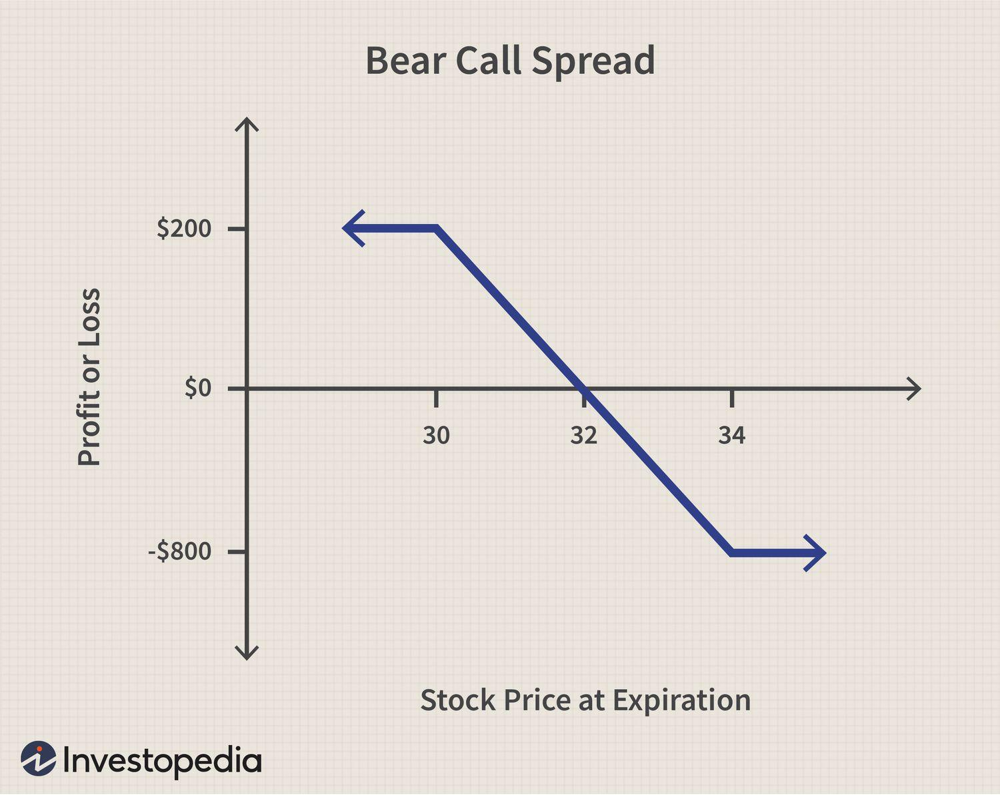

## Table of Contents

## What is a Bear Call Spread?

A Bear Call Spread is a type of options trading strategy used when you think the price of a stock will go down or stay the same. It involves selling a call option at a lower strike price and buying another call option at a higher strike price on the same stock with the same expiration date. By doing this, you earn money from the premium of the call option you sold, but you also limit your risk because you bought the higher strike call option.

The main goal of a Bear Call Spread is to make a profit if the stock price stays below the lower strike price until the options expire. If the stock price stays below this level, both options will expire worthless, and you keep the premium you received from selling the call option. However, if the stock price goes above the higher strike price, you could lose money, but your loss is limited to the difference between the strike prices minus the premium you received. This strategy helps you manage risk while trying to profit from a bearish outlook on a stock.

## How does a Bear Call Spread work?

A Bear Call Spread is a way to make money if you think a stock's price will go down or stay the same. You do this by selling a call option with a lower price (strike price) and buying another call option with a higher price on the same stock. Both options have the same date when they end (expiration date). When you sell the first call option, you get money right away, which is called the premium. But you also spend some money to buy the second call option at the higher price. This helps limit how much you could lose if things don't go as planned.

The goal is to keep the premium you got from selling the first call option. If the stock price stays below the lower strike price until the options expire, both options will be worthless, and you get to keep the premium. But if the stock price goes above the higher strike price, you might lose money. The most you can lose is the difference between the two strike prices, minus the premium you received. This strategy helps you manage risk while trying to make money if the stock price doesn't go up too much.

## What are the key components of a Bear Call Spread?

A Bear Call Spread has two main parts that you need to know about. The first part is selling a call option at a lower strike price. This means you get money right away, called a premium, because you're giving someone else the right to buy the stock at that price. The second part is buying a call option at a higher strike price. This costs you some money but helps protect you if the stock price goes up a lot.

Both options in a Bear Call Spread have the same expiration date, which is important. The goal is to make money if the stock price stays below the lower strike price until the options expire. If it does, both options will be worthless, and you keep the premium you got from selling the first call option. But if the stock price goes above the higher strike price, you could lose money. The most you can lose is the difference between the two strike prices, minus the premium you received. This strategy helps you manage risk while trying to profit if the stock price doesn't go up too much.

## What are the potential profits and losses with a Bear Call Spread?

The potential profit from a Bear Call Spread comes from the premium you get when you sell the call option at the lower strike price. If the stock price stays below this lower strike price until the options expire, both options will be worthless, and you get to keep the entire premium. This is your maximum profit, and it's the most money you can make from this strategy.

The potential loss happens if the stock price goes above the higher strike price. The most you can lose is the difference between the two strike prices, minus the premium you received. This happens because you have to buy the stock at the lower strike price and sell it at the higher strike price, which costs you money. But since you got the premium when you started, it reduces your total loss. This strategy helps you manage risk because your losses are limited, while you still have a chance to make money if the stock price doesn't go up too much.

## When should an investor consider using a Bear Call Spread?

An investor should think about using a Bear Call Spread when they believe a stock's price will go down or stay the same until the options expire. This strategy is useful if you want to make money from a stock that you think won't go up much. By selling a call option at a lower price and buying one at a higher price, you get money upfront from the premium, which you can keep if the stock stays below the lower price.

Bear Call Spreads are also good for investors who want to limit their risk. Even if the stock price goes up a lot, the most you can lose is the difference between the two strike prices minus the premium you received. This makes it a safer way to bet on a stock going down or staying the same, compared to other strategies where you could lose a lot more money.

## How do you set up a Bear Call Spread?

To set up a Bear Call Spread, you first need to choose a stock that you think will go down or stay the same in price. Once you've picked the stock, you sell a call option at a lower strike price. This means you're giving someone else the right to buy the stock at that price before the option expires. When you sell this call option, you get money right away, which is called the premium. Next, you buy a call option at a higher strike price on the same stock and with the same expiration date. This costs you some money but helps protect you if the stock price goes up a lot.

Both options in your Bear Call Spread need to have the same expiration date. The goal is to make money if the stock price stays below the lower strike price until the options expire. If it does, both options will be worthless, and you get to keep the premium you got from selling the first call option. But if the stock price goes above the higher strike price, you might lose money. The most you can lose is the difference between the two strike prices, minus the premium you received. This strategy helps you manage risk while trying to make money if the stock price doesn't go up too much.

## What are the risks associated with a Bear Call Spread?

The main risk with a Bear Call Spread is that the stock price might go up a lot. If it goes above the higher strike price, you could lose money. The most you can lose is the difference between the two strike prices, minus the premium you got when you started. This means you need to be careful and make sure you're okay with losing that amount if things don't go as planned.

Another risk is that the stock might not move as much as you expect. If it stays right between the two strike prices, you might not make as much money as you hoped. You only keep the premium if the stock stays below the lower strike price until the options expire. If it's close but not quite there, you might end up with a small profit or even a small loss after paying for the higher strike call option.

## How does time decay affect a Bear Call Spread?

Time decay, which is also called theta, is important for a Bear Call Spread. It means that the value of options goes down as they get closer to expiring. This can be good for you if you're using a Bear Call Spread because you want the options to lose value. When you sell the call option at the lower strike price, you get money from the premium. If the stock price stays below this price, the option you sold will lose value over time, and you can keep the premium when it expires worthless.

But time decay can also be a problem if the stock price goes up a lot. If it goes above the higher strike price, the option you bought to protect yourself will also lose value as time goes on. This means that if you need to use this option to limit your losses, it might not be worth as much as you hoped. So, you need to keep an eye on how much time is left until the options expire and make sure the stock price stays where you want it to be.

## What is the impact of volatility on a Bear Call Spread?

Volatility, which means how much a stock's price moves up and down, can affect a Bear Call Spread. When [volatility](/wiki/volatility-trading-strategies) is high, the prices of options go up because there's a bigger chance the stock will move a lot. This can be bad for you if you're using a Bear Call Spread because the option you bought at the higher strike price will cost more. But it can also be good because you get more money from selling the call option at the lower strike price. So, high volatility can make your potential profit bigger, but it also increases the risk of losing more if the stock price goes up a lot.

If volatility goes down, the prices of options go down too. This can be good for you because the option you bought at the higher strike price will be cheaper, which means you spend less money to protect yourself. But it also means you get less money from selling the call option at the lower strike price. So, lower volatility can make your potential profit smaller, but it also reduces the risk of losing a lot if the stock price goes up. You need to think about how much the stock might move when you set up a Bear Call Spread and decide if you're okay with the risks and rewards.

## How can you adjust a Bear Call Spread if the market moves against your position?

If the market moves against your Bear Call Spread, you can make changes to help manage your risk. One way to do this is by rolling the spread. This means you close your current position and open a new one with a later expiration date. If the stock price is going up, you might choose a higher strike price for the call option you sell and a higher strike price for the one you buy. This can give you more time for the stock price to come back down and help you keep some of the premium you got.

Another way to adjust is by closing part of your position. If the stock price is getting close to the lower strike price, you might decide to buy back the call option you sold. This will cost you some money, but it can stop your losses from getting bigger if the stock keeps going up. You could also keep the call option you bought at the higher strike price as a way to protect yourself if the stock price goes up even more. By making these changes, you can try to limit your losses and still have a chance to make some money if the stock price moves back in your favor.

## What are the tax implications of using a Bear Call Spread?

When you use a Bear Call Spread, you need to think about taxes. The money you make from a Bear Call Spread is usually seen as capital gains. If you hold the options for less than a year, it's a short-term capital gain, and you'll pay taxes on it at your regular income tax rate. If you hold them for more than a year, it's a long-term capital gain, and the tax rate is usually lower. But most people who use options like Bear Call Spreads don't hold them for a year, so they usually pay the higher short-term rate.

You also need to know about the wash-sale rule. This rule says you can't claim a loss on your taxes if you buy the same or a similar security within 30 days before or after you sell it at a loss. With a Bear Call Spread, if you close your position at a loss and then open a new one with the same stock soon after, you might not be able to use that loss to lower your taxes. It's a good idea to talk to a tax professional to understand how these rules apply to your situation and make sure you're doing everything right.

## How do professional traders optimize Bear Call Spreads in different market conditions?

Professional traders use different ways to make Bear Call Spreads work better depending on what the market is doing. If the market is calm and not moving much, they might choose strike prices that are close together. This can help them make more money from the premium they get when they sell the call option at the lower strike price. They also pick an expiration date that's not too far away, so they can take advantage of time decay, which makes the options lose value as they get closer to expiring. If the stock stays below the lower strike price, they can keep the whole premium.

When the market is moving a lot, professional traders might choose strike prices that are farther apart. This gives them more room for the stock price to move without losing money. They might also pick a later expiration date to give the stock more time to come back down if it goes up. If the stock price goes up a lot, they might roll their position to a later date or adjust the strike prices to manage their risk. By making these changes, they can try to limit their losses and still have a chance to make money if the market moves back in their favor.

## What is a Bear Call Spread?

A bear call spread is an options trading strategy that involves the simultaneous sale of a call option and the purchase of another call option with a higher strike price, where both options share the same expiration date. This combination results in a net credit for the trader and establishes a position with both limited risk and limited reward. The profit potential is maximized when the price of the underlying asset experiences a modest decline. 

In this strategy, the trader benefits from a slight bearish outlook on the market, aiming to capitalize on the assumption that the underlying asset’s price will not rise above the lower strike price. The bear call spread is also commonly referred to as a short call spread or a call credit spread due to the net credit received at the initiation of the trade.

To illustrate how the bear call spread works, consider the position's payoff profile. If $K_1$ is the strike price of the sold call and $K_2$ is the strike price of the bought call, such that $K_1 < K_2$, then the maximum profit occurs when the underlying asset price at expiration is below $K_1$. The maximum loss is constrained to the difference between the strike prices $K_2 - K_1$, minus the net credit received from the initial setup of the spread:

$$
\text{Maximum Loss} = (K_2 - K_1) - \text{Net Credit}
$$

This strategy frames a conservative trading posture, suitable for traders who expect minimal price movements or declines in the underlying asset, while prioritizing defined risk over unknown exposure that might come with more aggressive trading strategies.

## How does a Bear Call Spread work?

A bear call spread is a strategic options trading setup that involves two simultaneous transactions: selling a call option and buying another call option with a higher strike price, both having the same expiration date. This trading strategy focuses on benefiting from a modest decline in the price of the underlying asset.

### Components and Execution

The primary goal of a bear call spread is to capitalize on a bearish market expectation with a defined risk and reward profile. Here's how the strategy is constructed and operates:

1. **Sell Call Option**: The trader sells a call option with a lower strike price. By selling this option, the trader receives a premium which contributes to the overall net credit of the strategy.

2. **Buy Call Option**: Simultaneously, the trader buys a call option with a higher strike price. This step is crucial to cap the potential losses, as owning this option provides a counterbalance if the underlying asset's price rises unexpectedly above this strike price.

### Profit and Loss Dynamics

- **Maximum Profit**: The maximum profit achievable occurs when the price of the underlying asset is at or below the strike price of the sold call option at expiration. In this scenario, both options expire worthless, and the trader retains the net premium received initially. 
$$
  \text{Maximum Profit} = \text{Net Premium Received}

$$

- **Maximum Loss**: If the underlying asset's price exceeds the higher strike price at expiration, the bear call spread reaches its maximum loss. This loss is limited to the difference between the strike prices minus the net premium received, reflecting the cost of repurchasing the spread.
$$
  \text{Maximum Loss} = (\text{Higher Strike Price} - \text{Lower Strike Price}) - \text{Net Premium Received}

$$

- **Breakeven Point**: The breakeven point for the strategy is reached when the price of the underlying asset equals the lower strike price plus the net premium received.
$$
  \text{Breakeven Point} = \text{Lower Strike Price} + \text{Net Premium Received}

$$

### Characteristics

The bear call spread is characterized by limited profit potential and a predefined risk, making it an attractive choice for traders with a bearish outlook but who prefer a restrained approach to risk exposure. The structure inherently limits both potential rewards and losses, providing a stable framework that offers predictability in tumultuous markets. This predictability allows traders to incorporate this strategy into their wider trading plans while maintaining a clear understanding of potential outcomes.

## What is an Example of a Bear Call Spread?

Assume an investor decides to implement a bear call spread using options for a particular stock currently trading at $33. The strategy involves two main actions:

1. **Selling a Call Option:** The investor sells a call option with a strike price of $35 for a premium of $2.50 per share.
2. **Buying a Call Option:** To cap the potential losses, the investor buys another call option with a higher strike price of $40 for a premium of $0.50 per share.

This combination leads to a net credit of $2.00 per share (i.e., $2.50 received from selling the lower strike call minus $0.50 paid for buying the higher strike call).

### Maximum Profit

The maximum profit potential of this strategy is equal to the net credit received, which is $2.00 per share. As each option contract typically represents 100 shares, the total maximum profit is $200. This profit is realized if the stock price remains at or below $35 until the options expire.

### Maximum Loss

The maximum loss occurs if the stock price rises above the higher strike price of $40 at expiration. In this case, the investor would have to settle the difference between the strike prices, which is:

$$
\text{Maximum Loss per Share} = (\text{Higher Strike Price} - \text{Lower Strike Price}) - \text{Net Credit}
$$

Substituting the values:

$$
\text{Maximum Loss per Share} = (40 - 35) - 2 = 3
$$

Hence, the total maximum loss is $300 (3 x 100 shares per option contract).

### Breakeven Point

The breakeven point of the bear call spread occurs when the stock price at expiration is such that the total income from the initial net credit is offset by the loss on the spread. Therefore, the breakeven stock price is calculated by adding the net credit to the lower strike price:

$$
\text{Breakeven Price} = \text{Lower Strike Price} + \text{Net Credit}
$$

$$
\text{Breakeven Price} = 35 + 2 = 37
$$

Thus, if the stock price at expiration is $37, the investor neither makes a profit nor incurs a loss. This structured approach ensures that the risk and reward are both clearly defined, making the bear call spread a strategic choice for traders under specific market conditions.

## References & Further Reading

[1]: McMillan, L. G. (2004). ["Options as a Strategic Investment."](https://www.amazon.com/Options-Strategic-Investment-Lawrence-McMillan/dp/0735201978) New York Institute of Finance.

[2]: Fontanills, G. A. (2005). ["The Options Course: High Profit & Low Stress Trading Methods."](https://books.google.com/books/about/The_Options_Course.html?id=_ahY8ZkA95oC) Wiley.

[3]: Natenberg, S. (1994). ["Option Volatility and Pricing: Advanced Trading Strategies and Techniques."](https://archive.org/details/optionvolatility00shel) McGraw Hill.

[4]: Hull, J. C. (2017). ["Options, Futures, and Other Derivatives."](https://www.semanticscholar.org/paper/Options%2C-Futures%2C-and-Other-Derivatives-Hull/89bdee500c8623864fc9eb7a471546aa713acc44) Pearson.

[5]: Jarrow, R. A., & Turnbull, S. M. (1996). ["Derivative Securities."](https://archive.org/details/derivativesecuri0000jarr) South-Western College Publishing.

[6]: Lopez de Prado, M. (2018). ["Advances in Financial Machine Learning."](https://books.google.com/books/about/Advances_in_Financial_Machine_Learning.html?id=oU9KDwAAQBAJ) Wiley.