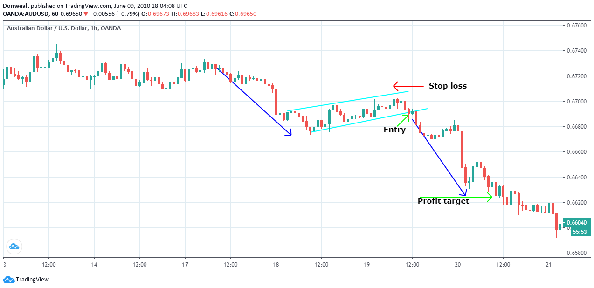

In algorithmic trading, pattern recognition is essential for pinpointing market trends and making well-informed trading decisions. Among numerous chart patterns, the bear flag pattern is a widely used tool by traders aiming to benefit from continuation trends in a declining market. The bear flag pattern is a technical indicator that suggests the likelihood of continued downtrends, making it a favorite among traders who prioritize short selling. 

This pattern emerges as a brief period of consolidation following a significant decline, representing a pause before the downtrend resumes. Algorithmic traders can leverage the bear flag to enhance their strategies by identifying optimal entry and exit points for short positions. Through sophisticated algorithms, traders automate the detection and trading processes, reducing the influence of emotions and enhancing decision accuracy.



This article addresses the characteristics of the bear flag in algorithmic trading, its importance, and its strategic application. Furthermore, it will examine the distinctions between the bear flag and the bull flag, offering practical guidance for effectively trading the bear flag pattern. By the end, readers will be equipped with comprehensive insights into harnessing this pattern for profitable trading.

## Table of Contents

## Understanding the Bear Flag Pattern

The bear flag is a continuation pattern that often signals the persistence of a bearish trend in financial markets. It typically appears after a pronounced decline in price, where it forms a rectangular consolidation phase. This phase may slope upward slightly or maintain a horizontal orientation. The initial sharp descent is referred to as the 'flagpole', and it is followed by a relatively short period of upward-sloping or horizontal consolidation, known as the 'flag'.

One of the technical features of the bear flag is its capacity to act as a precursor to further downward movements in price. Traders rely on this pattern to signal continuation of the existing downtrend, thus providing opportunities to enter short positions. The pattern's visual cues and structural attributes make it recognizable: the initial vertical drop (flagpole) is often followed by a parallel channel formation (flag) marked by minor price retracements.

In terms of technical analysis, the bear flag's effectiveness can be enhanced by considering several factors. Key among them is the volume associated with the pattern; typically, there is a surge in volume at the initiation of the flagpole, followed by dwindling volume during the flag's formation. A subsequent increase in volume during the breakout phase is a strong indication that the downtrend is set to continue.

Here's an outline of the bear flag's technical structure and attributes:

1. **Flagpole**: The steep decline that initiates the pattern. This is typically accompanied by high trading volume.

2. **Flag**: This consolidation phase can exhibit an upward slope or remain flat. Volume tends to decrease during this period as the market temporarily stabilizes.

3. **Breakout**: This occurs when the price breaks below the lower boundary of the flag, often followed by an increase in volume. This is the point at which traders typically execute short trades, anticipating a continuation of the downtrend.

Understanding these components and leveraging them effectively can enhance trading strategies centered around bearish market conditions. By utilizing the bear flag pattern, traders can optimize entry and [exit](/wiki/exit-strategy) points based on anticipated price movements.

## What a Bear Flag Looks Like in Algo Trading

In [algorithmic trading](/wiki/algorithmic-trading), recognizing a bear flag pattern demands the utilization of historical data to pinpoint swift declines in prices followed by consolidation phases. Algo systems typically employ trendlines to define the upper and lower confines of the channel formed during this pattern. This structured approach aids traders in visualizing the consolidation area that forms the flag while the preceding sharp price decline forms the flagpole.

Advanced algorithms go a step further by embedding [volume](/wiki/volume-trading-strategy) analysis into their operations. This is crucial for the validation of breakouts, ensuring that trades are executed based on robust data rather than mere price movements. For instance, a decline in volume during the flag's formation, followed by a significant surge as the price breaks below the lower trendline, often signals a reliable [breakout](/wiki/breakout-trading). Incorporating volume analysis helps distinguish genuine breakouts from false alarms, thus optimizing trading strategy reliability.

Scripting an algorithm to identify bear flags involves a systematic process. First, define the parameters for steep price drops, which typically make up the flagpole. The price decline rate, calculated as a percentage within a given timeframe, could serve as a threshold. For instance, a 5% drop in two days could signal the start of a possible flagpole. The subsequent consolidation phase forms the flag, requiring the algorithm to delineate horizontal or slightly upward-sloping channels over a defined period.

The following is a basic Python script for recognizing bear flags:

```python
import pandas as pd

def identify_bear_flag(df, drop_threshold=0.05, consolidation_period=10):
    df['returns'] = df['Close'].pct_change()
    flagpoles = df['returns'] <= -drop_threshold

    bear_flags = []
    for i, is_flagpole in enumerate(flagpoles):
        if is_flagpole:
            # Look for consolidation within next defined period
            for j in range(i+1, i+consolidation_period):
                if j >= len(df):
                    break
                consolidation = df['Close'][i+1:j].max() - df['Close'][i+1:j].min()
                if consolidation <= (df['Close'][i] * 0.02):  # Assuming 2% range as consolidation
                    bear_flags.append((i, j))
                    break
    return bear_flags
```

This script analyzes the percentage change in closing prices to identify potential flagpoles. It then checks the subsequent data points to find if they fall within a defined consolidation range, indicating a possible bear flag.

Optimizing detection accuracy involves continuously [backtesting](/wiki/backtesting) with various market conditions and parameter settings. Traders can enhance algorithms further by implementing [machine learning](/wiki/machine-learning) techniques to adapt and refine bear flag detection over time. This may include training models on large data sets to recognize subtle variations in pattern formation or predict the likelihood of a successful breakout post-flag completion.

## Trading the Bear Flag Pattern

Trading the bear flag pattern involves a strategic approach to enter short positions upon confirmation of a downward breakout from the pattern. In algorithmic trading, the automation of this process is essential for ensuring timely and precise execution of trades.

### Automation of Breakout Detection

Algorithmic trading systems play a crucial role in automating the detection of breakouts. These systems analyze market data to identify when the price breaches the lower boundary of the bear flag's channel, signaling a continuation of the downtrend. The automation involves specifying predefined parameters such as the slope of the channel and the threshold for price movement to qualify as a breakout.

Here's a simplified example in Python using the `pandas` and `numpy` libraries to identify a breakout:

```python
import pandas as pd
import numpy as np

def detect_breakout(data, window_size=20, sensitivity=2):
    data['mean'] = data['close'].rolling(window=window_size).mean()
    data['std'] = data['close'].rolling(window=window_size).std()
    data['lower_band'] = data['mean'] - (sensitivity * data['std'])

    breakout_signal = (data['close'] < data['lower_band']).astype(int)
    return breakout_signal

# Example usage
# data is a DataFrame with at least a 'close' column containing closing prices
breakout_signals = detect_breakout(data)
```

### Risk Management and Volume Analysis

Trading the bear flag pattern requires meticulous risk management. A commonly used approach is setting stop-loss orders slightly above the upper trendline of the flag to mitigate potential losses from false breakouts.

Volume analysis is also imperative in confirming breakout validity. An increase in volume during the breakout phase can reinforce the probability of a successful downtrend continuation. Algorithms can be programmed to incorporate volume spikes as a condition for trade execution:

```python
def confirm_volume_breakout(data, volume_increase_factor=1.5):
    average_volume = data['volume'].rolling(window=10).mean()
    volume_confirmation = (data['volume'] > volume_increase_factor * average_volume).astype(int)
    return volume_confirmation

# Integrate with breakout signals
trade_signals = breakout_signals & confirm_volume_breakout(data)
```

### Profit-Targeting Strategies

Determining accurate profit targets involves analyzing historical price movements to set realistic exit points. One approach is using a fixed-risk-reward ratio, where the expected profit is a multiple of the risk. This calculation aids in setting accurate take-profit orders.

For example, if a trader uses a 1:3 risk-reward ratio and the stop-loss is set at 2% above the entry, the take-profit level would be 6% below the entry:

```python
risk_reward_ratio = 3
stop_loss_percent = 0.02
take_profit_percent = risk_reward_ratio * stop_loss_percent
```

### Algorithms for Managing Risks

Complex algorithms can integrate these elements into a cohesive strategy, adjusting dynamically to market conditions. Key aspects such as adaptive stop-loss placements, volume confirmations, and dynamic profit targets ensure robust trading.

Algorithmic approaches offer the advantage of executing trades based on data-driven decisions, reducing emotional influences and improving consistency in results. By configuring algo trading systems to recognize and act upon bear flag patterns, traders can streamline their operations and enhance their profitability potential.

## Bear Flag vs. Bull Flag: Key Differences

Bear flags and bull flags are essential chart patterns in technical analysis, indicating the continuation of existing trends. Understanding the distinctions between these two patterns is crucial for algorithmic traders in optimizing their strategies.

Bear flags and bull flags are structurally similar in appearance, often resembling a channel pattern following a strong directional move. However, their implications in market trends differ significantly. A bear flag is a bearish continuation pattern. It appears after a rapid decline in prices, known as the "flagpole," followed by a brief period of consolidation depicted as an upward or horizontal channel, the "flag." Conversely, a bull flag suggests a continuation of an upward trend, following a sharp rise in prices with consolidation forming a downward or flat channel.

Algorithmic tools play a critical role in distinguishing between these patterns. Traders can fine-tune their algorithms to optimize detection by incorporating trendlines, volume analysis, and other indicators. For example, algorithms might identify a bear flag by seeking a steep price drop followed by consolidation, while for a bull flag, the algorithm looks for a steep price rise transitioning into consolidation.

An example of a simple Python script structure to identify these patterns could be:
```python
def detect_flag_pattern(prices):
    flagpole_length = compute_flagpole(prices)
    consolidation_period = identify_consolidation(prices)

    if is_bear_flag(flagpole_length, consolidation_period):
        return "Bear Flag"
    elif is_bull_flag(flagpole_length, consolidation_period):
        return "Bull Flag"
    else:
        return "No Recognized Pattern"

def is_bear_flag(flagpole_length, consolidation_period):
    # Check if the conditions meet a bear flag pattern
    return flagpole_length > threshold and consolidation_period.slopes_up()

def is_bull_flag(flagpole_length, consolidation_period):
    # Check if the conditions meet a bull flag pattern
    return flagpole_length > threshold and consolidation_period.slopes_down()
```
In this script, functions `compute_flagpole`, `identify_consolidation`, `is_bear_flag`, and `is_bull_flag` should be designed to assess the price drop, consolidation phase, and pattern criteria.

The ability to differentiate these flags is crucial in executing effective trading strategies. When bear flags are correctly identified, traders can confidently execute short positions, thereby capitalizing on the continuation of a downtrend. Similarly, recognizing bull flags allows traders to take long positions, benefiting from the anticipated continuation of an uptrend.

By leveraging the power of algorithmic trading tools, traders can enhance their strategies to account for specific market conditions, ensuring more accurate and profitable trades while minimizing the risk of human error.

## Limitations and Considerations

Despite the effectiveness of bear flag patterns in algorithmic trading, they come with inherent limitations that traders must acknowledge. A key concern is the risk of false breakouts, which occur when the price appears to exit the flag pattern but soon reverses, leading to potential losses for traders. False breakouts can mislead algorithms, prompting untimely short position entries that can be detrimental to trading portfolios.

To mitigate this risk, traders should incorporate additional indicators to complement pattern recognition. These may include [momentum](/wiki/momentum) oscillators, such as the Relative Strength Index (RSI) or Moving Average Convergence Divergence (MACD), which help verify the strength of a breakout. For instance, aligning a bear flag pattern breakout with an RSI indicator moving below 30 might provide more confidence in the continuation of a downtrend.

Another essential element is the incorporation of market conditions into bear flag strategies. Market [volatility](/wiki/volatility-trading-strategies) can significantly influence the reliability of bear flag signals. High volatility environments may increase the likelihood of false breakouts, while lower volatility might result in prolonged consolidation periods within the flag, delaying expected price movements.

Backtesting remains a crucial step in the development and refinement of algorithms designed to trade bear flags. Through backtesting, traders can simulate their algorithms across various historical market scenarios, accounting for different levels of volatility and market phases. This process helps in identifying not only the strengths of the trading strategy but also its weaknesses, allowing for necessary adjustments. For instance, traders can optimize stop-loss and take-profit levels based on historical price movements following pattern breakouts.

Moreover, understanding common pitfalls, such as relying solely on pattern recognition without considering overall market trends, is vital. Comprehensive market analysis, including macroeconomic factors and industry news, should not be overlooked, as they can impact market sentiment and the performance of technical patterns like the bear flag.

In sound algorithmic practices, combining technical indicators with robust backtesting and market analysis frameworks can help in reducing the likelihood of costly mistakes and improving the effectiveness of trading systems utilizing bear flag patterns.

## Conclusion

The bear flag pattern is a recognized tool in algorithmic trading for its ability to signal potential gains in the continuation of downtrends, provided it is accurately identified. This technical indicator allows traders to automate the task of pattern recognition, thus removing the emotional biases that can negatively impact manual trading. Algorithmic strategies enable traders to set precise parameters for identifying and acting on these patterns. This makes it easier to respond swiftly to market conditions and exploit trading opportunities that a bear flag presents.

Looking towards future advancements, integrating machine learning models into existing trading algorithms shows promise in further refining pattern recognition. Machine learning can enhance the adaptability and precision of trading systems, allowing for the dynamic adjustment of strategies based on evolving market patterns and historical data. Such advancements can potentially increase the accuracy of bear flag detection and improve the overall decision-making process in trade executions.

This article equips algorithmic traders with the necessary knowledge to effectively utilize the bear flag pattern. By understanding its structure and leveraging technological advancements, traders can optimize their strategies, maintain a disciplined trading approach, and harness the full potential of algorithmic trading systems to achieve consistent success.

## FAQs

### FAQs

**What are the main characteristics of a bear flag pattern?**

The bear flag pattern is recognized by a few key features which include an initial rapid price decline known as the "flagpole," followed by a period of consolidation where prices move slightly upward or sideways, forming the "flag." This pattern often appears within a downward trend and signals potential continuation of this trend once the flag formation concludes. The flag itself resembles a parallelogram or a small rectangle on the price chart, indicating a counter-trend move within the overall downtrend. A strong bear flag pattern typically exhibits lower trading volume during the consolidation phase compared to the volume during the flagpole phase.

**How do you identify a bear flag in trading?**

In trading, identifying a bear flag involves several steps. Initially, look for a steep decline in price, which forms the flagpole. Next, observe for a consolidation phase where prices may move sideways or slightly upward, forming a channel or a rectangle. This flag portion should have relatively low trading volume. For precise identification, traders often use technical analysis tools, such as trendlines, to mark the upper and lower boundaries of the consolidation zone. An effective technical indicator might also be the moving average, where prices often hover around or slightly below a moving average line during the flag formation. Once prices break below the lower trendline of the flag, it confirms a potential continuation of the downtrend, offering an entry point for traders taking short positions.

**Can a bear flag be bullish?**

By definition, a bear flag is inherently a bearish continuation pattern, suggesting that prices are likely to continue their decline following the pattern's completion. However, market conditions can vary, and false breakouts can sometimes occur, where prices do not continue their downward trajectory but instead reverse, creating a bullish move. While such occurrences exist, they are exceptions rather than expectations. Traders using the bear flag pattern are therefore advised to supplement their analysis with other indicators and market fundamentals to avoid being caught in false breakouts or unexpected price reversals.

## References & Further Reading

[1]: Bergstra, J., Bardenet, R., Bengio, Y., & Kégl, B. (2011). ["Algorithms for Hyper-Parameter Optimization."](https://dl.acm.org/doi/10.5555/2986459.2986743) Advances in Neural Information Processing Systems 24.

[2]: ["Advances in Financial Machine Learning"](https://www.amazon.com/Advances-Financial-Machine-Learning-Marcos/dp/1119482089) by Marcos Lopez de Prado

[3]: ["Evidence-Based Technical Analysis: Applying the Scientific Method and Statistical Inference to Trading Signals"](https://www.amazon.com/Evidence-Based-Technical-Analysis-Scientific-Statistical/dp/0470008741) by David Aronson

[4]: ["Machine Learning for Algorithmic Trading"](https://github.com/stefan-jansen/machine-learning-for-trading) by Stefan Jansen

[5]: ["Quantitative Trading: How to Build Your Own Algorithmic Trading Business"](https://books.google.com/books/about/Quantitative_Trading.html?id=j70yEAAAQBAJ) by Ernest P. Chan