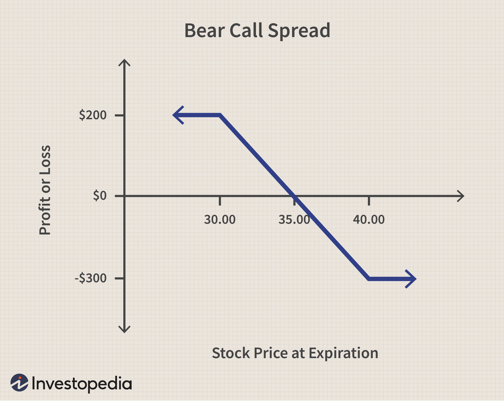

The bond market plays a critical role in the global financial system, acting as a barometer for economic health and investor confidence. It provides invaluable insights into economic trends and shifts in investor sentiment. At the core of this market lies the yield curve, a graphical representation that showcases the yields on bonds of different maturities. Understanding the intricacies of the yield curve is vital for those engaged in trading and investing, as it sheds light on potential future movements in interest rates and economic conditions.

One key dynamics of the yield curve is the 'bear flattener,' a situation where short-term interest rates rise more quickly than long-term rates. This phenomenon generally signals a tightening monetary policy, typically enacted by central banks such as the Federal Reserve. The implications of a bear flattener on the yield curve are profound, often indicating an impending economic slowdown or contraction. In such scenarios, the bond market and stock markets can experience turbulence, as the attractiveness of stocks diminishes in comparison to bonds, due to the increasing returns on short-term debt instruments.



In this article, we dissect the bear flattener, examine its impact on the yield curve, and analyze how algorithmic trading is transforming the way traders and investors navigate this environment. Algorithmic trading, which leverages complex mathematical algorithms to execute trades at incredible speeds, offers new strategies for capitalizing on yield curve shifts. By dynamically adjusting portfolios based on interest rate changes and market expectations, traders can optimize their strategies to leverage bear flattener scenarios effectively. This discussion will also explore the various algorithmic trading strategies that allow market participants to adapt swiftly, maximize returns, and manage risks in such volatile financial landscapes.

## Table of Contents

## Understanding the Yield Curve

The yield curve is a fundamental tool in the analysis of the bond market, visually representing the relationship between bond yields and their maturities. Typically, a normal yield curve is upward sloping, illustrating that longer-term bonds offer higher yields compared to short-term bonds. This shape reflects the risks associated with time, including inflation and uncertainty, as investors require a premium for committing their capital over longer periods.

The shape and slope of the yield curve are significant indicators of future economic conditions and interest rates. Analysts pay close attention to these changes, as they provide valuable insights. For instance, a steep yield curve suggests robust economic growth and potential inflationary pressures, leading to expectations of rising future interest rates. Conversely, a flat or inverted yield curve may indicate economic slowdown or recession concerns, as short-term rates approach or exceed long-term rates.

The yield curve can undergo various transformations—flattening, steepening, or inversion—largely influenced by economic variables and market expectations. Flattening occurs when the yield gap between short-term and long-term bonds narrows. This situation often arises when short-term rates climb faster than long-term ones, possibly due to anticipated central bank tightening. On the other hand, steepening reflects the widening of this gap, typically occurring when long-term rates rise more quickly, suggesting a positive economic outlook. An inverted yield curve, where short-term yields surpass long-term yields, is considered a potential red flag for an impending recession, as it indicates that market participants expect future rate cuts driven by economic contraction.

Understanding these dynamics is critical for economists, traders, and policymakers, as the yield curve serves as a comprehensive barometer of market sentiment and future economic trajectories.

## What is a Bear Flattener?

A bear flattener is a phenomenon in the bond market where short-term interest rates increase at a much faster pace than long-term rates. This shift causes the yield curve, which graphically represents the difference in yields between bonds of different maturities, to flatten. When this occurs, the gap between the yields of short-term and long-term bonds narrows. Typically, a bear flattener signals a tightening monetary policy, often initiated by central banks such as the Federal Reserve. This policy shift is intended to control inflation by making borrowing more expensive, which can lead to an overall economic slowdown.

The mechanics behind a bear flattener can be understood through the lens of bond yields and [interest rate](/wiki/interest-rate-trading-strategies) expectations. Central banks may raise short-term interest rates to curb inflation when the economy is overheating. This increase in rates directly impacts the yields on short-term bonds, pushing them higher. However, if investors anticipate that the economic tightening will eventually slow down economic growth, the demand for long-term bonds may increase as they are perceived as safer investments. Consequently, the yields on these long-term bonds may not rise as significantly, leading to a flatter yield curve.

This economic condition is often interpreted as a predictor of economic contraction because it suggests that the market expects growth to slow, possibly leading to a recession. The flattening of the yield curve indicates that the anticipated returns from short-term investments are increasing relative to long-term investments, reflecting a lack of confidence in prolonged economic growth.

The bear flattener can have significant implications for other financial markets, particularly the stock market. When short-term rates rise, borrowing costs for businesses increase, potentially reducing corporate earnings and making stocks less attractive compared to bonds. Investors may shift their capital from equities to bonds, which can lead to a decline in stock prices. This shift in capital allocation is often driven by the perception that bonds offer more predictable returns relative to the higher risks associated with equities during periods of economic uncertainty. 

Understanding the dynamics of bear flatteners is crucial for investors as it helps in anticipating economic cycles and making informed portfolio decisions.

## Impact of Bear Flatteners on Bond Markets

Bear flatteners signal a challenging time for bond investors as short-term yields rise rapidly. When short-term interest rates increase, borrowing costs for both governments and corporations escalate, leading to higher expenses for servicing debt. This scenario can strain budgets and limit capital investments, which may slow economic growth. The financial distress for borrowers is further compounded for those with variable-rate loans or debts maturing soon, as refinancing becomes costlier.

Banks, which generally benefit from a steeper yield curve through greater interest income from the spread between short-term borrowing and long-term lending, may encounter profit margin pressures during a bear flattener. As the yield curve flattens, this spread diminishes, squeezing the profit margins of banks that rely heavily on interest rate differentials. Consequently, banks might respond by tightening lending conditions, which can stifle economic activity further.

Investors typically react to a bear flattener by reallocating their portfolios towards safer and shorter-duration instruments. This move is driven by the desire to avoid the potential losses from rapidly increasing short-term yields, which can reduce the market value of existing longer-duration bonds. The preference for short-term instruments, which mature quickly and are less sensitive to interest rate changes, is a common strategy to mitigate interest rate risk.

Overall, bear flatteners provide significant signals to market participants, indicating potential economic challenges and influencing both borrowing costs and investment strategies within bond markets. Adapting to these conditions requires investors to be vigilant and strategic in their approach to managing interest rate risk.

## Algorithmic Trading in a Bear Flattener Environment

Algorithmic trading utilizes sophisticated mathematical models to execute trades at a pace and [volume](/wiki/volume-trading-strategy) far beyond human capability. These algorithms interpret market signals and are ideally suited to navigate environments like a bear flattener, where short-term interest rates ascend more than long-term rates. 

In a bear flattener scenario, algorithms are engineered to recognize alterations in the yield curve, enabling them to pinpoint [arbitrage](/wiki/arbitrage) opportunities. For instance, if short-term rates increase more rapidly, the disparity between short and long-term yields narrows. Algorithms can be programmed to identify these trends by processing large volumes of financial data in real time, allowing for the execution of strategies designed to exploit these market conditions.

To adapt to interest rate changes, algorithms dynamically adjust portfolios by analyzing patterns and projecting potential market movements. This includes rebalancing bond portfolios to either hedge against potential losses or capitalize on gains. For example, an algorithm might shift investments from long-term securities to shorter-term instruments if it detects an impending bear flattener, thus optimizing the portfolio's return while minimizing risk exposure.

The adaptable nature of [algorithmic trading](/wiki/algorithmic-trading) is particularly advantageous in volatile conditions created by flattening yield curves. These systems can swiftly recalibrate positions based on updated market forecasts and trader-defined parameters. This speed and accuracy in response, coupled with the ability to execute complex strategies such as [statistical arbitrage](/wiki/statistical-arbitrage) or pairs trading, can significantly enhance returns.

Algorithmically executed trades benefit from [backtesting](/wiki/backtesting) against historical data to ascertain the viability and potential outcome of trading strategies in bear flattener environments. Python, with libraries like NumPy and pandas, is often employed to simulate and optimize these strategies:

```python
import pandas as pd
import numpy as np

def calculate_spread(short_term_rate, long_term_rate):
    return short_term_rate - long_term_rate

short_term_rates = np.array([2.5, 2.7, 3.0])  # example short-term interest rates
long_term_rates = np.array([3.5, 3.5, 3.4])  # example long-term interest rates

spreads = calculate_spread(short_term_rates, long_term_rates)
print("Spread Changes:", spreads)
```

The above code snippet calculates the spread between short-term and long-term rates, providing a basis for developing trading strategies. By continuously monitoring and adjusting to real-time data inputs, algorithmic trading systems maintain a competitive edge, allowing traders to effectively navigate the financial complexities introduced by a bear flattener.

## Strategies for Trading a Flattening Yield Curve

Traders can take advantage of a flattening yield curve through strategic approaches such as curve steepening trades. This technique involves simultaneously shorting short-term bonds while going long on long-term bonds. The rationale behind this strategy is to profit from the anticipated differential in yield changes across the maturity spectrum, particularly when short-term interest rates rise faster than long-term rates, resulting in a flattening curve.

In executing these strategies, traders often leverage derivatives like bond futures and interest rate swaps. Bond futures allow traders to buy or sell government bonds at a predetermined price at a future date, enabling them to speculate on interest rate movements or hedge existing positions. Interest rate swaps are agreements to exchange future interest payments on a defined principal amount, typically involving swapping a fixed rate for a floating rate, or vice versa. These instruments enhance profitability by providing avenues to gain exposure to interest rate changes without holding the underlying bond securities directly.

Risk management remains a crucial component of trading a flattening yield curve. Market conditions can shift rapidly, necessitating constant adjustments to trading positions. Traders employ various risk management techniques, including stop-loss orders, rigorous portfolio rebalancing, and employing diversification across different maturities and instruments. By doing so, they aim to mitigate potential losses while maintaining the potential for gains. 

For example, traders may utilize Python to model and execute trading strategies. Here's a simplified example of how Python can be used to backtest a bond trading strategy:

```python
import numpy as np
import pandas as pd

# Sample bond data
bond_data = pd.DataFrame({
    'short_term_yield': [0.5, 0.6, 0.65, 0.7],
    'long_term_yield': [1.5, 1.55, 1.53, 1.52],
    'short_term_price': [100, 99.5, 99, 98.7],
    'long_term_price': [100, 100.5, 100.7, 100.6]
})

# Calculate the spread
bond_data['yield_spread'] = bond_data['long_term_yield'] - bond_data['short_term_yield']

# Strategy: Short short-term bonds, Long long-term bonds
bond_data['strategy_return'] = (bond_data['long_term_price'].pct_change() - 
                                bond_data['short_term_price'].pct_change()) * 100

# Sum up the returns to get the cumulative returns
bond_data['cumulative_return'] = bond_data['strategy_return'].cumsum()

print(bond_data[['yield_spread', 'strategy_return', 'cumulative_return']])
```

By implementing such strategies and tools, traders aim to capitalize on anticipated movements in the yield curve, efficiently navigating the complexities of a bear flattening environment.

## Conclusion

Understanding the implications of a bear flattener is crucial for investors seeking to navigate the complex dynamics of bond and stock markets. In such scenarios, short-term interest rates increase more rapidly than long-term ones, causing the yield curve to flatten. This flattening can signal a tightening monetary policy and often hints at potential economic slowdowns. Investors, therefore, need to be vigilant as they assess market conditions and the associated risks and opportunities.

As financial landscapes shift, algorithmic trading emerges as an efficient tool for adapting to market changes with speed and precision. By employing sophisticated algorithms, traders can detect subtle shifts in yield curves and capitalize on arbitrage opportunities. These systems dynamically adjust portfolios to align with changing interest rates and anticipated economic trends, allowing for quick responses to fluctuating market conditions.

In the context of a bear flattening yield curve, traders can optimize their positions through strategic trades. For instance, strategies such as shorting short-term bonds while going long on long-term bonds enable traders to exploit differences in yield spreads. Moreover, leveraging derivatives like bond futures and interest rate swaps can enhance profitability. However, risk management remains crucial, necessitating constant adjustments to cope with rapid market changes effectively.

Continued learning and adaptation are essential in this ever-evolving financial arena. As markets and technologies advance, keeping abreast of developments in algorithmic trading and yield curve dynamics will be key to maintaining a competitive edge. With the right strategies and tools, investors and traders can navigate the challenges of a bear flattener and better position themselves for success.

## References & Further Reading

[1]: Bergstra, J., Bardenet, R., Bengio, Y., & Kégl, B. (2011). ["Algorithms for Hyper-Parameter Optimization."](https://dl.acm.org/doi/10.5555/2986459.2986743) Advances in Neural Information Processing Systems 24.

[2]: ["Advances in Financial Machine Learning"](https://www.amazon.com/Advances-Financial-Machine-Learning-Marcos/dp/1119482089) by Marcos Lopez de Prado

[3]: ["Evidence-Based Technical Analysis: Applying the Scientific Method and Statistical Inference to Trading Signals"](https://www.amazon.com/Evidence-Based-Technical-Analysis-Scientific-Statistical/dp/0470008741) by David Aronson

[4]: ["Machine Learning for Algorithmic Trading"](https://github.com/stefan-jansen/machine-learning-for-trading) by Stefan Jansen

[5]: ["Quantitative Trading: How to Build Your Own Algorithmic Trading Business"](https://github.com/LucindaYa/quant-resources/blob/master/Quantitative%20Trading%20How%20to%20Build%20Your%20Own%20Algorithmic%20Trading%20Business.pdf) by Ernest P. Chan