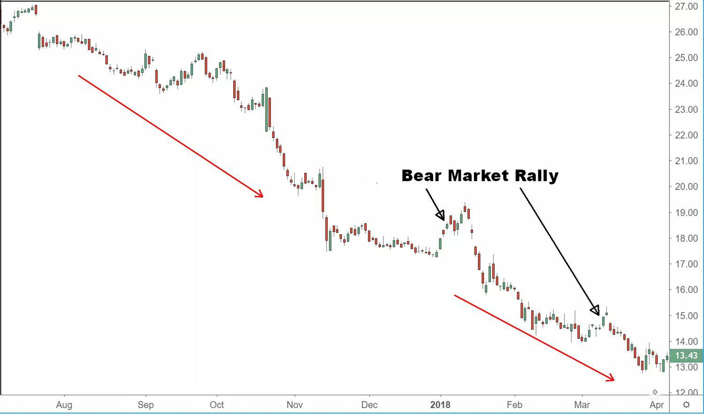

The stock market operates in a dynamic environment marked by cycles of upward and downward trends, commonly referred to as bull and bear markets. A bear market is typically defined by a decline in stock prices of 20% or more from recent highs, frequently accompanied by widespread pessimism among investors. These periods can result in unique challenges, such as heightened volatility and uncertainty, but also offer opportunities for investors to capitalize on the fluctuating market conditions.

During bear markets, investor sentiments tend to shift negatively, as economic factors such as recessions, increasing interest rates, and geopolitical events contribute to the downturn. This shift can lead to a cascade of selling, further driving down prices and exacerbating the market decline. However, bear markets are also times of recalibration, when valuations may become more aligned with underlying economic realities, potentially offering buying opportunities for astute investors.



Algorithmic trading, often referred to as algo trading, has become an increasingly significant tool in navigating these tumultuous periods. By employing computer algorithms to execute trades based on pre-set conditions, algo trading offers advantages in speed, precision, and the ability to process and analyze large data sets. These capabilities allow investors to respond quickly to market changes and potentially identify patterns or opportunities that may not be immediately apparent through manual analysis.

This article explores the intricacies of bear markets, the phenomena of bear market rallies, and the transformative role of algo trading. Understanding these components is crucial for investors aiming to protect and grow their portfolios during volatile periods. By leveraging technology and maintaining a strategic approach, investors can better navigate the uncertainties of bear markets and potentially harness the opportunities they present.

## Table of Contents

## Understanding Bear Markets and Market Rallies

Bear markets represent periods in financial markets where stock prices experience a significant decline, frequently defined as a fall of 20% or more from recent highs. These downturns are often initiated by broader economic conditions such as recessions, rising interest rates, or geopolitical uncertainties. Investors face a challenging environment as selling pressure predominates, and market sentiment tends toward pessimism.

During bear markets, sharp but temporary upticks in stock prices, known as bear market rallies, can occur. These rallies often result from short-term optimism driven by specific news events or economic reports. Despite the brief surge in prices, bear market rallies can be misleading. They may suggest a potential recovery, but often, they are not sustained, leading to further declines as the underlying negative factors prevail.

A critical [factor](/wiki/factor-investing) in navigating bear markets is an understanding of historical patterns and recognizing the cyclical nature of these markets. Historical analysis shows that these rallies tend to be short-lived, generally lasting for a few days to weeks. The challenge for investors lies in distinguishing these temporary rebounds from true recoveries, as mistaking the former for the latter can lead to premature investment decisions and potential losses.

For instance, in analyzing past bear market scenarios, certain patterns emerge. Typically, bear market rallies might show initial sharp gains, but these gains do not signify a reversal of fortune in the longer term. Instead, they might be driven by factors such as short covering, investor overreaction to positive news, or technical retracements.

Investors can benefit from understanding these dynamics by avoiding impulsive trades and maintaining a focus on the broader economic indicators that signal genuine market recoveries. By leveraging historical insights and analyzing market conditions, investors can better navigate the complexities of bear markets and avoid the pitfalls associated with these transient rallies.

## Case Studies: Examples of Bear Market Rallies

Analyzing past bear market rallies provides insights into their characteristics and outcomes, often revealing patterns that traders and investors can use to make informed decisions. Two notable historical examples of bear market rallies occurred during the Stock Market Crash of 1929 and the Dotcom Bubble in the early 2000s.

### The Stock Market Crash of 1929

The Stock Market Crash of 1929 marked the beginning of the Great Depression, a period characterized by severe economic decline. Following the initial crash in October 1929, there were several bear market rallies that gave investors temporary relief and optimism about a recovery. For instance, after the market hit a low in November 1929, there was a notable rally in the first half of 1930, where the market regained approximately 18% of its value. However, this upturn was short-lived, and the market continued on a downward trajectory until it reached its bottom in 1932. 

These rallies were fueled by hopes of an economic recovery, despite the underlying economic weaknesses such as high unemployment and declining industrial output. The rallies were characterized by sudden market upticks followed by more prolonged declines, illustrating the typical see-saw motion of bear market investments. For portfolio managers at that time, understanding this pattern was crucial to differentiating between a genuine market recovery and a temporary rebound.

### The Dotcom Bubble

The Dotcom Bubble in the early 2000s provides another key example of bear market rallies. The Nasdaq Composite Index, which was heavily laden with technology stocks, peaked in March 2000. Following the burst of the bubble, the index fell nearly 80% by October 2002. During this prolonged downturn, there were several notable bear market rallies. 

Notably, in April 2001, the Nasdaq saw an impressive 23% gain over a few weeks. These rallies were often driven by speculative bets on the revival of tech-sector profitability, alongside regulatory changes and economic stimuli attempting to stabilize the economy. However, these market upticks lacked the fundamental economic support needed for sustainable recovery. Investors who mistook these rallies for signs of lasting recovery often experienced significant losses when the market reverted to its declining trend.

### Lessons from Historical Rallies

The critical takeaway from both the Stock Market Crash of 1929 and the Dotcom Bubble is the necessity of differentiating between a sustained economic recovery and a temporary market rebound. Bear market rallies often occur amidst broader declines, and without substantive economic improvements, they may not indicate a permanent turnaround. 

Being vigilant about market signals—including economic reports, corporate earnings, and geopolitical events—can help investors assess whether a rally is backed by solid fundamentals. Understanding these past examples equips investors with the knowledge to navigate present and future bear markets with a more strategic, analytical approach.

## Algo Trading in Bear Markets

Algorithmic trading, commonly known as algo trading, utilizes computer algorithms to automatically execute trades based on predefined criteria such as price, timing, or [volume](/wiki/volume-trading-strategy). This method relies heavily on quantitative analysis and elements of [artificial intelligence](/wiki/ai-artificial-intelligence), enabling traders to implement complex trading strategies faster than traditional methods. During bear markets, characterized by declining stock prices and increased [volatility](/wiki/volatility-trading-strategies), algo trading can provide significant benefits.

One of the primary advantages of [algorithmic trading](/wiki/algorithmic-trading) in bear markets is speed. The ability to swiftly execute trades can be crucial in such a volatile environment, where stock prices can change rapidly. Traditional manual trading often cannot keep pace with such market movements, potentially resulting in missed opportunities or greater losses. Algorithms can enter and [exit](/wiki/exit-strategy) positions in fractions of a second, ensuring that execution occurs at the desired price points.

Accuracy is another key benefit. Algorithms execute pre-set rules with precision, minimizing human errors associated with manual trades. This can be particularly advantageous in bear markets, where emotional decision-making might otherwise lead to suboptimal trades. Algo trading reduces the influence of emotions like fear and panic, thereby supporting disciplined trading strategies.

Analyzing large datasets quickly is another essential capability of algorithmic trading systems. In a bear market, where sentiments and data points change rapidly, the ability to process and interpret vast amounts of information becomes critical. Algorithms can scan multiple markets and assets simultaneously, identifying patterns and opportunities that might not be apparent to human traders. For instance, these systems can employ [machine learning](/wiki/machine-learning) techniques to recognize trends and relationships within data, offering insights into potential market movements.

Algorithmic strategies utilized in bear markets can vary widely, encompassing techniques such as statistical [arbitrage](/wiki/arbitrage), [market making](/wiki/market-making), and [trend following](/wiki/trend-following). For example, [statistical arbitrage](/wiki/statistical-arbitrage) seeks to exploit price inefficiencies between correlated assets, while trend-following strategies might identify short-term market rebounds or continued declines.

In practice, these algorithms are often developed and back-tested using historical data to ensure efficacy under different market conditions. Python, a widely used programming language in the financial industry, offers various libraries like NumPy, pandas, and scikit-learn, which facilitate the development of sophisticated trading algorithms. Here is an example of a simplistic [momentum](/wiki/momentum)-based trading strategy in Python:

```python
import pandas as pd
import numpy as np

# Load historical stock price data
data = pd.read_csv('stock_prices.csv')

# Calculate daily returns
data['returns'] = data['Close'].pct_change()

# Define a momentum strategy: buy when returns are positive for 3 consecutive days, sell otherwise
data['position'] = np.where(data['returns'].rolling(window=3).sum() > 0, 1, 0)

# Calculate strategy returns
data['strategy_returns'] = data['position'].shift(1) * data['returns']

# Evaluate performance
performance = data['strategy_returns'].cumsum().plot(title='Momentum Strategy Performance')
```

This code snippet illustrates how a basic momentum strategy might be implemented, highlighting the ease with which algo trading strategies can be prototyped and tested using Python. However, real-world applications often involve more sophisticated algorithms and higher-frequency data.

In conclusion, algorithmic trading provides substantial advantages in bear markets by improving trade execution speed, accuracy, and the capacity to analyze data efficiently. These attributes allow traders to better navigate market volatility, identify potential risks and opportunities, and enhance their overall decision-making process.

## Strategies for Thriving in Bear Markets

Navigating bear markets successfully demands a strategic focus on both capital protection and the pursuit of strategic gains. Investors employ various techniques to manage risks and leverage potential advantages presented by declining markets. Short selling, investing in defensive stocks, and utilizing options are some of the primary methods that can effectively aid in managing bear market conditions.

Short selling is a strategy that capitalizes on declining stock prices. In this approach, an investor borrows shares and sells them at the current market price, aiming to repurchase them at a lower price once the market declines. This allows investors to profit from falling prices. However, short selling carries inherent risks, as losses can potentially be unlimited if the stock price rises instead of falls. Effective risk management and timely decision-making are crucial when employing short selling.

Investing in defensive stocks provides another avenue for safeguarding capital during bear markets. Defensive stocks belong to companies with stable earnings and dividends, even in economic downturns. These are typically found in sectors such as utilities, healthcare, and consumer staples. Such stocks tend to be less volatile and offer steady returns, thus serving as a buffer against overall market declines.

Options trading offers yet another strategy for thriving amid bear market challenges. Options provide investors with the right, but not the obligation, to buy or sell an asset at a predetermined price before a specified expiration date. Protective puts and call spreads are popular options strategies used in bear markets. A protective put strategy involves buying put options on existing stock positions to hedge against potential losses. Call spreads, on the other hand, can limit potential losses while allowing for some gain if the stock moves as anticipated.

Diversification is an essential principle for minimizing losses and enhancing opportunities during market downturns. By spreading investments across different asset classes, sectors, and geographies, investors can reduce the impact of adverse price movements in any single investment or asset class. Diversification helps maintain a balanced and resilient portfolio, especially when market conditions are unpredictable.

Risk management remains critical in bear markets, ensuring that exposure to potential losses is contained and that the investment strategy aligns with the individual's risk tolerance. This includes clearly defining stop-loss levels, maintaining adequate [liquidity](/wiki/liquidity-risk-premium), and continuously monitoring market conditions and portfolio performance.

In summary, thriving in bear markets involves a combination of tactical financial strategies, including short selling, investing in defensive stocks, and utilizing options. These strategies, coupled with diversification and diligent risk management, allow investors to protect their capital while exploring opportunities for strategic gains amidst market volatility.

## The Role of Investor Psychology

Investors' psychological responses during bear markets can significantly impact their financial outcomes. In such periods, fear and panic often dominate market behavior, leading to impulsive decision-making that can exacerbate losses. As stock prices decline and market volatility increases, investors may experience heightened anxiety and stress. This emotional intensity can prompt actions like panic selling, where individuals hurriedly liquidate their positions to avoid further losses, often locking in losses that might otherwise recover over time.

To mitigate these psychological pressures, understanding the typical cognitive biases and emotional responses is crucial. One prevalent bias is loss aversion, which refers to the tendency for individuals to prefer avoiding losses over acquiring equivalent gains. This can lead to a reluctance to sell underperforming stocks, hoping for a rebound that might never occur. Moreover, during bear markets, confirmation bias might also play a role, where investors seek information that confirms their fears, reinforcing negative sentiments and potentially leading to suboptimal investment choices.

Another psychological aspect to consider is the herd behavior, where individuals are influenced by what others are doing rather than relying on their analysis. In bear markets, this can manifest as following the general trend of selling, even if the fundamentals of certain investments remain solid. Addressing these tendencies involves cultivating a disciplined approach that emphasizes long-term investment goals and strategic asset allocation.

To better handle investor psychology in bear markets, incorporating certain strategies can be beneficial. Maintaining a diversified portfolio is essential, as it spreads risk across various asset classes, cushioning the impact of sector-specific downturns. Additionally, establishing predefined criteria for buying and selling can help counteract impulsive decisions influenced by market swings.

In the context of algorithmic trading, understanding behavioral patterns can enhance the effectiveness of these systems. Algorithms can be programmed to detect market sentiment and investor behavior, which can then be used to create strategies that capitalize on irrational market movements. By maintaining a clear focus on long-term objectives, staying informed, and implementing disciplined investment strategies, investors can navigate the psychological challenges of bear markets more effectively.

## Conclusion

Navigating bear markets demands a strategic and informed approach, intertwining an understanding of market dynamics with the proficient application of technology. In these periods characterized by prolonged price declines, algorithmic trading emerges as a robust tool, enabling investors to gain crucial insights and execute trades with precision and speed. Through the use of algorithms, traders can process vast datasets to identify trends, evaluate market conditions, and discern potential opportunities amidst volatility.

Algorithmic trading strategies often include the application of machine learning models and statistical analysis to predict market movements and optimize trading decisions. For instance, investors might employ regression analysis to assess the relationship between various economic indicators and stock price movements. Python, with its extensive libraries like NumPy, pandas, and scikit-learn, is particularly useful for implementing these models. Here, algorithms might predict the probability of significant price changes, aiding investors in making informed choices. 

The key to thriving in bear markets is staying informed and disciplined. An informed investor diligently monitors economic indicators, corporate earnings reports, and geopolitical developments to assess their potential impact on market trends. Discipline in executing a well-devised strategy ensures that emotional responses do not overshadow rational decision-making. Utilizing diversification and risk management techniques can further protect portfolios, mitigating potential losses while positioning for gains.

In conclusion, by integrating a comprehensive understanding of market behavior with cutting-edge algorithmic tools, investors can effectively navigate the complexities of bear markets. This strategic blending not only safeguards investments but can also uncover opportunities that may have previously gone unnoticed, allowing investors to capitalize on the fluctuations that bear markets inevitably present.

## References & Further Reading

[1]: Bergstra, J., Bardenet, R., Bengio, Y., & Kégl, B. (2011). ["Algorithms for Hyper-Parameter Optimization."](https://dl.acm.org/doi/10.5555/2986459.2986743) Advances in Neural Information Processing Systems 24.

[2]: ["Advances in Financial Machine Learning"](https://www.amazon.com/Advances-Financial-Machine-Learning-Marcos/dp/1119482089) by Marcos Lopez de Prado

[3]: ["Evidence-Based Technical Analysis: Applying the Scientific Method and Statistical Inference to Trading Signals"](https://www.amazon.com/Evidence-Based-Technical-Analysis-Scientific-Statistical/dp/0470008741) by David Aronson

[4]: ["Machine Learning for Algorithmic Trading"](https://github.com/stefan-jansen/machine-learning-for-trading) by Stefan Jansen

[5]: ["Quantitative Trading: How to Build Your Own Algorithmic Trading Business"](https://www.amazon.com/Quantitative-Trading-Build-Algorithmic-Business/dp/1119800064) by Ernest P. Chan