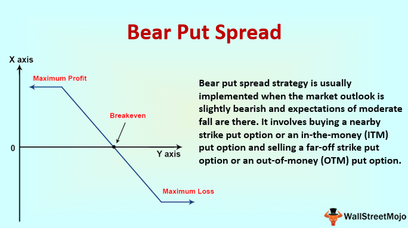

Navigating the complexities of a bear market is imperative for any investor aiming to protect and potentially grow their assets during prolonged economic downturns. A bear market, typically marked by a 20% decline from recent highs, presents unique challenges that require strategic investment approaches. As economic indicators fluctuate and market volatility increases, it becomes essential for investors to adapt and implement strategies that mitigate risk while maximizing possible gains.

This article examines various investing strategies that are particularly effective in bear markets, highlighting both traditional methods and innovative approaches like algorithmic trading. Traditional strategies often focus on risk aversion through diversification and holding more stable assets, such as bonds or dividend-paying stocks. These methods aim to preserve capital and provide some income during market downturns.

Conversely, modern approaches leverage technological advancements and algorithmic trading to offer speed and precision in decision-making. Algorithmic trading, involving the use of complex algorithms to execute trades at high speed, can be particularly advantageous in volatile markets by removing emotional biases and increasing efficiency.

By exploring both classic and cutting-edge investing techniques, we aim to provide investors with a comprehensive understanding of how to effectively manage risks and seize opportunities in a bear market. Whether it is employing defensive strategies to safeguard investments or utilizing algorithmic solutions for tactical trading advantages, the combination of these approaches can equip investors to navigate uncertain financial waters more effectively. This article will outline the benefits and drawbacks of each strategy and provide insights into integrating traditional and modern methods for optimized investing outcomes.

## Table of Contents

## Bear Market Basics

A bear market is typically characterized by a decline of 20% or more in major stock indices from their recent highs, often accompanied by extended periods of economic downturn. This market condition reflects a sustained trend of decreasing investor confidence and is marked by widespread pessimism across various asset classes. Bear markets can have significant impacts on investment portfolios, leading to pronounced losses for investors who do not employ appropriate risk management strategies.

Historically, bear markets have occurred less frequently than bull markets, which are characterized by rising stock prices. However, bear markets are often more severe and can last from several months to a few years. Notable bear markets include the Great Depression of the 1930s, the dot-com bubble burst in the early 2000s, and the financial crisis of 2007-2009. Each of these events resulted in significant declines in stock market valuations and were precipitated by unique economic and financial circumstances.

Investor sentiment plays a crucial role in the onset and progression of bear markets. During such periods, negative sentiment can lead to a self-fulfilling cycle of selling, as fear of further losses prompts investors to divest their holdings, driving prices lower. This contrasts with bull markets, where positive sentiment and optimism can fuel sustained buying.

Macroeconomic factors also significantly influence bear markets. High inflation rates, rising interest rates, and slowing economic growth are common precursors to bear markets. Central banks often attempt to counter these forces through monetary policy adjustments, but such interventions can sometimes worsen investor anxiety. For example, increasing interest rates to curb inflation can inadvertently slow economic growth, exacerbating bearish trends.

In summary, bear markets are defined by a 20% decline from peak stock valuations and are influenced by a combination of investor sentiment and macroeconomic conditions. Their historical frequency and impact highlight the importance for investors to understand these dynamics and prepare for potential downturns in financial markets.

## Traditional Bear Market Investing Strategies

Traditional bear market investing strategies focus on preserving capital and minimizing losses while seeking opportunities for potential gains. One of the most fundamental approaches is holding cash. During bearish periods, stock prices are typically declining, and holding cash allows investors to avoid further losses and maintain [liquidity](/wiki/liquidity-risk-premium). This strategy also provides the flexibility to purchase assets at discounted prices when the market stabilizes.

Diversifying portfolios is another critical strategy. A diversified portfolio spreads risk across various asset classes, sectors, and geographical regions. This approach minimizes the impact of poor performance in any single investment. Diversification can include a mix of stocks, bonds, commodities, and other securities to guard against severe losses.

Defensive stock positioning involves investing in companies with stable earnings, strong balance sheets, and products or services that are less sensitive to economic downturns. These companies, often in sectors such as utilities, healthcare, and consumer staples, tend to perform better during bear markets because their business models provide consistent demand despite economic conditions.

Dividend-paying stocks and bonds hold significant value during bear markets. Dividend stocks provide a steady income stream that can buffer against losses, and their attractiveness often increases as they can offer returns even when stock prices fall. Bonds, particularly government and high-quality corporate bonds, are seen as safer investments during economic downturns, offering fixed interest payments and lower [volatility](/wiki/volatility-trading-strategies) compared to equities.

Contrarian investing is an additional strategy that involves making investment decisions contrary to prevailing market trends. During bear markets, contrarian investors may purchase stocks that others are selling off, under the belief that those stocks are undervalued and that the market has overreacted. This approach requires thorough research and strong conviction, as buying against market sentiment involves inherent risks.

These traditional strategies emphasize prudent risk management while maintaining the potential for future gains, allowing investors to endure market turbulence with greater confidence.

## Pros and Cons of Trading in Bear Markets

Trading in bear markets presents unique opportunities and challenges, requiring both strategic insight and emotional resilience. Investors often turn to specific tactics, such as short selling and put options, to capitalize on declining market conditions.

### Short Selling and Put Options

**Short Selling**: This involves borrowing shares of a stock or other asset that an investor believes will decrease in value. The investor sells these borrowed shares with the aim of buying them back at a lower price later, thus making a profit from the difference. Short selling can be a powerful strategy during bear markets, as it allows traders to profit from the downturns. The procedure can be mathematically represented as:

$$
\text{Profit} = (\text{Initial Price} - \text{Final Price}) \times \text{Number of Shares} - \text{Borrowing Fees}
$$

**Put Options**: These provide the right, but not the obligation, to sell an asset at a predetermined price before a specified date. Investors buy put options when they expect the underlying asset's price to fall, thus enabling them to sell the asset at a higher market price and purchase it back at a lower price. Put options serve as a hedge against potential losses in a portfolio and offer limited risk since the maximum loss is the premium paid for the option.

### Benefits of Trading in Bear Markets

1. **Potential for Quick Profits**: Bear markets often see rapid price declines. Savvy traders can capitalize on these swift moves to generate returns in a shorter timeframe than in a bull market, where prices generally rise gradually.

2. **Market Corrections**: Bear markets can lead to corrections where overpriced assets are adjusted to their fair value. This correction allows investors to purchase assets at undervalued prices, positioning themselves for future gains once the market stabilizes or recovers.

### Risks of Trading in Bear Markets

1. **Heightened Volatility**: Bear markets are characterized by significant volatility, with prices swinging wildly in short periods. This makes it challenging to time trades accurately and increases the risk of substantial losses if the market moves against a trader's position.

2. **Potential for Large Losses**: Strategies like short selling involve significant risks, especially if the market unexpectedly turns bullish. Unlimited losses can occur because, theoretically, the price of a stock can rise indefinitely, compounding the losses an investor could incur.

3. **Emotional Stress**: The psychological toll of trading in unpredictable, declining markets can lead to impaired decision-making. The constant risk of losses and the need to act quickly can result in stress and anxiety, potentially causing investors to abandon well-thought-out strategies in favor of impulsive decisions.

Effective bear market trading necessitates a balanced approach, weighing the potential for quick gains against the substantial risks involved. It is crucial for investors to remain disciplined, leverage tools like stop-loss orders, and continuously reassess market conditions to navigate these challenging periods successfully.

## Algorithmic Trading in Bear Markets

Algorithmic trading, commonly known as algo-trading, refers to the use of computer algorithms to automate the trading process, executing orders at speeds and frequencies beyond human capability. In modern financial markets, algo-trading plays a significant role, accounting for a substantial portion of total trading volumes.

During a bear market, characterized by a general decline in stock prices, [algorithmic trading](/wiki/algorithmic-trading) can offer several advantages. One major benefit is speed. Algorithms can analyze vast amounts of market data almost instantaneously and execute trades at optimal prices before market conditions change. This capability allows traders to capitalize on fleeting opportunities that may arise during market downturns.

Precision is another advantage of algo-trading. Algorithms operate under pre-defined criteria, meticulously executing trades that align with specified strategies without deviation. This precision reduces the likelihood of human error, ensuring consistency in trading decisions, which is crucial in volatile bear markets.

Unemotional decision-making is a further benefit in bear markets, where fear and panic can drive irrational human behaviors. Algorithms, devoid of emotional influences, adhere strictly to their coded strategies, preventing impulsive and potentially detrimental trades.

Despite these advantages, algorithmic trading is not without its downsides. System failures can pose substantial risks. Technical glitches or network issues can disrupt the execution of trades, possibly leading to significant financial losses, especially in rapidly moving bear markets.

Over-reliance on technology is another concern. While algorithms are powerful tools, they may lack the ability to interpret nuanced market signals that human traders might catch. Dependence on algorithmic systems can lead to missed opportunities or unintended consequences, particularly if the models are not fully adaptive to changing market conditions.

Market liquidity impacts must also be considered. In bear markets, liquidity can become constrained, and the execution of large algorithmic trades can exacerbate these challenges. Rapid selling or buying by algorithms can amplify market volatility, potentially leading to adverse effects on prices.

In summary, algorithmic trading offers speed, precision, and unemotional decision-making, presenting a compelling advantage in bear markets. However, traders must be mindful of the potential pitfalls such as system failures, over-reliance on technology, and the influence on market liquidity. Balancing these factors is crucial for successful trading in bearish conditions.

## Combining Traditional and Algorithmic Approaches

The integration of traditional investing methods with algorithmic trading strategies offers a comprehensive approach to navigating bear markets. This hybrid strategy leverages the strengths of both domains, providing investors with a more diversified and adaptable investment approach. 

One key strategy involves using algorithmic trading to automate traditional investing principles. For example, investors can program algorithms to implement a diversified portfolio that adjusts to market conditions in real-time. By continuously monitoring market data, these algorithms can optimize asset allocation dynamically, reducing human error and enhancing response times.

**Case Studies and Examples:**

During the 2008 financial crisis, several hedge funds successfully employed a combination of traditional and algorithmic strategies. For instance, AQR Capital Management used quantitative models to rebalance portfolios based on changing market conditions while maintaining a long-term view on asset classes through traditional research methods. The firm's hybrid approach allowed it to manage risks more effectively and maintain steady performance amidst widespread market turbulence.

Another notable example is Renaissance Technologies, which utilized advanced statistical models alongside traditional market insights to achieve consistent returns. This firm demonstrated the viability of blending algorithmic and conventional strategies, proving that a balanced approach can mitigate risks even in volatile periods.

**Risk Management Techniques:**

Incorporating both algorithmic and traditional strategies necessitates robust risk management practices. Key techniques include diversification, setting predefined stop-loss levels, and deploying stress testing to assess portfolio resilience under adverse market conditions. Algorithms can be programmed to execute trades only when certain risk thresholds are met, ensuring that emotional biases do not affect investment decisions.

Staying informed and agile is crucial for maintaining the effectiveness of this dual approach. Regular updates to algorithms based on fresh market data and periodic reviews of traditional strategies help in aligning the investment approach with current market realities. Investors should also consider ongoing education and technological advancements to continually enhance both their algorithmic and traditional toolkits.

In conclusion, combining traditional investment techniques with algorithmic trading strategies provides a balanced and adaptive approach to investing during bear markets. This method not only capitalizes on the precision and efficiency of algorithms but also retains the foundational principles of traditional investing, offering a robust framework for both risk management and opportunity capitalization.

## Conclusion

In navigating bear markets, having a robust set of strategies is paramount for investors seeking to mitigate risk and seize potential opportunities. Key strategies include holding cash reserves, diversifying portfolios, and leveraging defensive stock positions to withstand economic downturns. Additionally, the incorporation of dividend-paying stocks and bonds can provide a stable income stream, helping to buffer against market volatility. Traditional methods such as contrarian investing also offer a way to capitalize on bearish conditions by going against prevailing market sentiment.

Investors are encouraged to thoroughly assess their risk tolerance — a crucial step in determining an appropriate investing approach. Bear markets often test the emotional resilience and strategic flexibility of traders and investors; adapting to evolving financial landscapes by shifting strategies in response to changing conditions is vital.

While traditional strategies form a solid foundation, the advent of technological tools and algorithmic trading presents new avenues for managing investments. Algorithmic trading, with its speed and precision, offers the ability to navigate volatile markets with unemotional decision-making. However, a balanced approach that integrates traditional wisdom with modern technology can be particularly powerful in managing risk and capitalizing on opportunities.

Education remains a cornerstone of successful investing, particularly during bear markets. Staying informed about market trends and advancements in trading technology is not just beneficial but essential. Investors should commit to continuous learning to refine their strategies and leverage technological tools effectively. This dual commitment to education and innovation will enhance their capacity to navigate the complexities of modern financial markets.

## References & Further Reading

[1]: ["Advances in Financial Machine Learning"](https://www.amazon.com/Advances-Financial-Machine-Learning-Marcos/dp/1119482089) by Marcos Lopez de Prado

[2]: ["Evidence-Based Technical Analysis: Applying the Scientific Method and Statistical Inference to Trading Signals"](https://www.amazon.com/Evidence-Based-Technical-Analysis-Scientific-Statistical/dp/0470008741) by David Aronson

[3]: ["Machine Learning for Algorithmic Trading"](https://github.com/stefan-jansen/machine-learning-for-trading) by Stefan Jansen

[4]: ["Quantitative Trading: How to Build Your Own Algorithmic Trading Business"](https://books.google.com/books/about/Quantitative_Trading.html?id=j70yEAAAQBAJ) by Ernest P. Chan

[5]: Bergstra, J., Bardenet, R., Bengio, Y., & Kégl, B. (2011). ["Algorithms for Hyper-Parameter Optimization."](https://proceedings.neurips.cc/paper/2011/file/86e8f7ab32cfd12577bc2619bc635690-Paper.pdf) Advances in Neural Information Processing Systems 24.