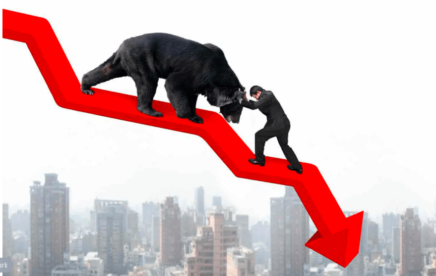

## Table of Contents

## What is a bear market?

A bear market is when the prices of things like stocks go down a lot, usually by 20% or more, and stay down for a while. It's called a bear market because it's like a bear swiping down with its paw, pushing prices lower. When people talk about a bear market, they are usually talking about the stock market, but it can happen in other markets too, like real estate or commodities.

During a bear market, people often feel worried about their money and might sell their investments to avoid losing more. This selling can make prices drop even more. Bear markets can last for months or even years, and they can be caused by many things, like a bad economy, high interest rates, or big events like wars or pandemics. It's a tough time for investors, but it can also be a chance to buy things at lower prices if you're willing to wait for the market to get better.

## How is a bear market different from a bull market?

A bear market and a bull market are opposite kinds of markets. A bear market is when the prices of things like stocks go down a lot and stay down for a while. It's like a bear pushing prices down with its paw. People often feel worried and might sell their investments because they're scared of losing more money. Bear markets can last for a long time and can be caused by things like a bad economy or big events like wars.

On the other hand, a bull market is when prices go up a lot and keep going up for a while. It's like a bull charging forward and lifting prices up with its horns. People feel happy and confident, and they might buy more investments because they think prices will keep going up. Bull markets can also last for a long time and are usually caused by a good economy and positive news.

So, the main difference is that a bear market is all about prices going down and people feeling worried, while a bull market is about prices going up and people feeling happy and confident.

## What are the common causes of a bear market?

A bear market can start because of many different reasons. One big reason is when the economy is not doing well. If a lot of people lose their jobs or if businesses are not making money, they might not want to spend as much. This can make companies' profits go down, and when investors see this, they might start selling their stocks, which makes the prices go down even more. Another reason can be high interest rates. When borrowing money costs a lot, people and businesses might not want to take out loans to buy things or invest, which can slow down the economy and lead to a bear market.

Big events can also cause a bear market. For example, a war or a big natural disaster can scare people and make them feel unsure about the future. When people are scared, they might sell their investments to feel safer, even if it means losing money. Also, a big event like a global health crisis, like the one we had with the COVID-19 pandemic, can make the economy slow down a lot and cause a bear market. All these things can make people feel worried and lead to a bear market where stock prices keep going down.

## How can you identify the start of a bear market?

You can tell a bear market might be starting when stock prices start to go down a lot, usually by 20% or more from their highest point. This drop in prices can happen quickly or over a few months. People start to feel worried about their money, and you might see a lot of them selling their stocks. If you see the news talking about a big drop in the stock market, and people are talking about how the economy might be getting worse, these are signs that a bear market could be starting.

Another way to spot the start of a bear market is by looking at how the economy is doing. If a lot of people are losing their jobs, or if businesses are saying they're not making as much money as before, these are bad signs for the stock market. Also, if interest rates are going up and it's getting harder for people to borrow money, that can slow down the economy and lead to a bear market. Keep an eye on these things, and if you see them happening, it might mean a bear market is on its way.

## What are the typical durations of bear markets?

Bear markets can last for different amounts of time. On average, they might last around a year, but some can be shorter, like a few months, and others can go on for two years or even longer. It all depends on what is causing the bear market and how long it takes for things to get better.

The length of a bear market is often tied to how bad the economic problems are. If the economy is just having a small dip, the bear market might not last very long. But if there's a big problem, like a financial crisis or a global event like a pandemic, the bear market can stick around for a while because it takes longer for the economy to recover.

## What are the effects of a bear market on the economy?

A bear market can have a big impact on the economy. When stock prices go down a lot, people who own stocks lose money. This can make them feel less rich and less likely to spend money on things they want. Businesses see this and might decide not to grow or hire new people because they're worried about making less money. This can slow down the whole economy because when people and businesses spend less, it affects everyone.

The effects can go even further. When people are worried about losing more money, they might take their money out of the stock market and put it into safer places like savings accounts. This can make it harder for businesses to get the money they need to keep running or to start new projects. Banks might also be more careful about lending money, which can make it even tougher for businesses and people to borrow. All these things together can make the economy weaker and lead to more problems like higher unemployment and slower growth.

## How should investors adjust their strategies during a bear market?

During a bear market, it's important for investors to think carefully about what they're doing with their money. One good idea is to not sell everything right away just because prices are going down. If you sell when you're scared, you might miss out on the chance for prices to go back up later. Instead, you might want to keep some of your investments and wait for the market to get better. It can be helpful to have a mix of different kinds of investments, like stocks, bonds, and maybe even some cash, so that if one type of investment is doing badly, the others might help balance things out.

Another thing to think about is looking for good deals. Even though it's a tough time, a bear market can be a chance to buy things at lower prices. If you believe in a company and think it will do well in the long run, buying its stock when it's cheap could be a smart move. It's also a good idea to keep checking your investments and making sure they still fit with your goals and how much risk you're okay with taking. Talking to a financial advisor can help you make the best choices for your money during a bear market.

## What are some historical examples of bear markets?

One famous bear market happened in 2007-2009. It was called the Global Financial Crisis. It started because a lot of people couldn't pay back their home loans, and banks lost a lot of money. This made people very scared, and they started selling their stocks. The stock market dropped a lot, and it took a long time for things to get better. This bear market lasted about 17 months, and the stock market went down by more than 50%.

Another big bear market was in the early 2000s, known as the Dot-com Bubble burst. A lot of new internet companies were starting up, and people were very excited about them. They bought a lot of these companies' stocks, but many of these companies didn't make any money and were not good investments. When people realized this, they started selling their stocks, and the market went down a lot. This bear market lasted about 2 years, from 2000 to 2002, and the stock market dropped by about 49%.

More recently, there was a bear market in 2020 because of the COVID-19 pandemic. When the virus started spreading, people got scared and stopped going out and spending money. This hurt businesses a lot, and the stock market went down quickly. The bear market lasted about a month and a half, but the stock market dropped by about 34%. It was a scary time, but the market started to get better as people and businesses figured out how to deal with the new situation.

## How do bear markets impact different sectors of the stock market?

Bear markets can affect different parts of the stock market in different ways. Some sectors, like technology and consumer goods, might get hit harder because people might not want to spend money on new gadgets or fancy things when they're worried about the economy. These sectors can see their stock prices drop a lot because people are not buying as much. On the other hand, sectors like healthcare and utilities might not go down as much because people still need medicine and electricity no matter what's happening with the economy. These sectors can be a bit safer during a bear market.

Another way bear markets can impact different sectors is by making some companies more attractive to investors. For example, companies that pay good dividends, like those in the utilities or consumer staples sectors, might be more popular because they give investors some money even when the market is down. But companies in sectors like energy or finance might have a harder time because they depend a lot on how the economy is doing. If people are not buying houses or cars, banks and car companies can struggle, and their stock prices can go down a lot. So, during a bear market, it's important to look at which sectors are doing better or worse and think about how that might affect your investments.

## What are the psychological impacts of a bear market on investors?

During a bear market, investors often feel very worried and scared. When they see the value of their investments going down a lot, they might start to panic. This can make them want to sell their stocks quickly, even if it means losing money, just to feel safer. The fear of losing more money can make people feel stressed and anxious, and they might not think clearly about what to do with their investments. It's a tough time because the news is full of stories about how bad the market is doing, which can make people feel even more worried.

On the other hand, some investors might feel hopeful during a bear market. They see it as a chance to buy stocks at lower prices and believe that the market will get better in the future. These investors try to stay calm and not let their emotions take over. They might even feel excited about the opportunities they see, but it's still hard to ignore the overall feeling of worry and uncertainty that comes with a bear market. Keeping a level head and sticking to a long-term plan can be really challenging when everyone around you is feeling scared.

## What advanced indicators can be used to predict a bear market?

One advanced indicator that can help predict a bear market is the yield curve. The yield curve shows the difference between the interest rates on short-term and long-term government bonds. When the yield curve inverts, meaning short-term rates are higher than long-term rates, it can be a sign that people are worried about the future and expect the economy to slow down. This has often happened before bear markets and can be a warning sign for investors to be careful.

Another useful indicator is the VIX, which is also called the "fear index." The VIX measures how much people expect the stock market to move around in the next 30 days. When the VIX goes up a lot, it means people are feeling more scared and think the market might go down. A high VIX can be a sign that a bear market might be coming because it shows that investors are getting nervous and might start selling their stocks. Watching the VIX can help investors get ready for a possible bear market.

## How can one profit from a bear market using short selling and other strategies?

One way to make money during a bear market is by short selling. Short selling means borrowing stocks from someone else and selling them right away, hoping to buy them back later at a lower price. If the stock price goes down like you expect, you can buy the stocks back cheaper, give them back to the person you borrowed them from, and keep the difference as profit. It's a way to make money when stock prices are falling, but it can be risky because if the stock price goes up instead, you could lose a lot of money.

Another strategy to profit from a bear market is by buying put options. A put option gives you the right to sell a stock at a certain price by a certain date. If you think a stock is going to go down, you can buy a put option and then sell the stock at the higher price you agreed on, even if the market price is lower. This can be a safer way to bet on falling prices because the most you can lose is the money you paid for the option. Both short selling and buying put options can help you make money when the market is going down, but they need careful planning and understanding of the risks involved.

## References & Further Reading

[1]: Bergstra, J., Bardenet, R., Bengio, Y., & Kégl, B. (2011). ["Algorithms for Hyper-Parameter Optimization."](https://proceedings.neurips.cc/paper/2011/file/86e8f7ab32cfd12577bc2619bc635690-Paper.pdf) Advances in Neural Information Processing Systems 24.

[2]: ["Advances in Financial Machine Learning"](https://www.amazon.com/Advances-Financial-Machine-Learning-Marcos/dp/1119482089) by Marcos Lopez de Prado

[3]: ["Evidence-Based Technical Analysis: Applying the Scientific Method and Statistical Inference to Trading Signals"](https://www.amazon.com/Evidence-Based-Technical-Analysis-Scientific-Statistical/dp/0470008741) by David Aronson

[4]: ["Machine Learning for Algorithmic Trading"](https://github.com/stefan-jansen/machine-learning-for-trading) by Stefan Jansen

[5]: ["Quantitative Trading: How to Build Your Own Algorithmic Trading Business"](https://www.amazon.com/Quantitative-Trading-Build-Algorithmic-Business/dp/1119800064) by Ernest P. Chan