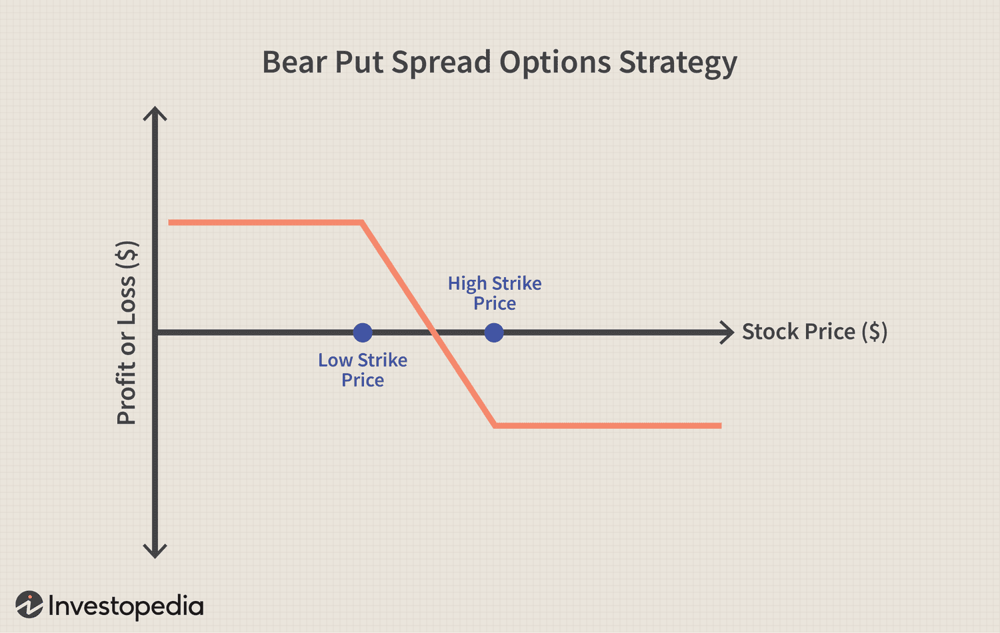

## Table of Contents

## What is the Bear Position in finance?

The Bear Position in finance is when someone thinks that the price of something, like a stock or a market, will go down. People who have this view are called "bears." They might decide to sell what they own now, hoping to buy it back later at a lower price. This way, they can make a profit from the difference.

Sometimes, bears use a strategy called "short selling." This is when they borrow something they think will decrease in value, sell it, and then buy it back cheaper to return it. If the price does go down, they make money. But if the price goes up instead, they could lose money. It's a bit risky, but it's one way bears try to make money when they think prices will fall.

## How does a Bear Position differ from a Bull Position?

A Bear Position and a Bull Position are opposite views in the world of finance. A Bear Position is when someone believes that the price of a stock, market, or other asset will go down. People with this view are called "bears." They might sell what they own now, hoping to buy it back later at a lower price to make a profit. Bears often use a strategy called "short selling," where they borrow an asset, sell it, and then buy it back at a lower price to return it, making money from the difference.

On the other hand, a Bull Position is when someone thinks that the price of an asset will go up. People with this view are called "bulls." They might buy an asset now, expecting to sell it later at a higher price for a profit. Bulls are optimistic and often invest in assets they believe will increase in value over time. While bears make money when prices fall, bulls make money when prices rise.

## What are the common reasons for taking a Bear Position?

People take a Bear Position when they think prices will go down. They might see signs that the economy is slowing down or that a company is not doing well. For example, if a company keeps losing money or if the whole market is going down, someone might decide to be a bear. They think it's smart to sell now and buy back later when prices are lower.

Sometimes, people take a Bear Position because they see too much excitement in the market. If everyone is buying and prices are going up too fast, it might mean the market is about to fall. Bears think it's better to get out before the fall happens. They want to protect their money or even make money when others are losing it.

Bears also look at things like interest rates and government policies. If interest rates go up, it can make borrowing more expensive, which can slow down the economy. Or if the government changes rules that might hurt businesses, bears might think prices will drop. They use all this information to decide when to take a Bear Position.

## What are the different ways to implement a Bear Position in the market?

One way to implement a Bear Position is by short selling. This means you borrow a stock or asset from someone else, sell it right away, and then buy it back later at a lower price. When you buy it back cheaper, you return it to the person you borrowed it from and keep the difference as profit. It's a bit risky because if the price goes up instead of down, you'll lose money when you buy it back. But if you're sure the price will drop, short selling can be a good way to make money when others are losing it.

Another way is to buy put options. A put option gives you the right to sell a stock at a certain price before a certain date. If you think the stock price will go down, you can buy a put option and then sell the stock at the higher price you agreed on, even if the market price has dropped. This can help you make money or at least lose less money if the stock goes down. It's less risky than short selling because the most you can lose is what you paid for the option.

You can also use inverse ETFs or bear funds. These are special kinds of funds that go up in value when the market goes down. If you think the market will drop, you can buy these funds and make money as the market falls. They're easier to use than short selling or options because you don't have to borrow anything or deal with complicated contracts. But they can still be risky, so it's important to understand how they work before you invest.

## Can you explain the concept of short selling in relation to a Bear Position?

Short selling is a way to make money when you think a stock's price will go down. It's like betting against the stock. You borrow the stock from someone else, sell it right away at the current price, and then wait for the price to drop. Once it's lower, you buy the stock back at the cheaper price and return it to the person you borrowed it from. The difference between the price you sold it for and the price you bought it back at is your profit. It's a key strategy for people who take a Bear Position because they believe the stock will go down in value.

But short selling can be risky. If the stock price goes up instead of down, you'll lose money. You'll have to buy it back at a higher price than you sold it for, and that difference is your loss. It can be a big loss if the stock keeps going up. That's why people who take a Bear Position and use short selling need to be pretty sure the stock will go down. They have to watch the market closely and be ready to act fast if things don't go as planned.

## What are the risks associated with maintaining a Bear Position?

Taking a Bear Position can be risky because if the price of the stock or market goes up instead of down, you could lose a lot of money. This is especially true if you use short selling. When you short sell, you borrow a stock, sell it, and then buy it back later. If the price goes up, you have to buy it back at a higher price than you sold it for, and that difference is your loss. It can be hard to predict the market, so even if you think the price will go down, it might not happen, and you could end up losing money.

Another risk is that you might miss out on gains if the market or stock goes up. While you're waiting for the price to drop, the stock could keep going up, and you won't make any money from that increase. Also, maintaining a Bear Position can be stressful because you have to keep watching the market closely. If things don't go as planned, you need to be ready to act fast to cut your losses. It's not easy to always be on alert, and it can be tough on your nerves.

## How can one identify market conditions favorable for a Bear Position?

You might want to take a Bear Position when you see signs that the market or a stock is going to go down. One big sign is if the economy is slowing down. If companies are making less money or if people are losing their jobs, it could mean that stock prices will fall. Another sign is if there's too much excitement in the market. When everyone is buying and prices are going up really fast, it might mean the market is about to drop. If you see these things happening, it could be a good time to think about being a bear.

Another way to spot good conditions for a Bear Position is by looking at interest rates and government policies. If interest rates go up, it can make borrowing more expensive, which can slow down the economy and hurt stock prices. Also, if the government changes rules that might make it harder for businesses to do well, that could be a sign that prices will go down. By keeping an eye on these things, you can get a better idea of when it might be smart to take a Bear Position.

## What are some indicators that suggest it's time to exit a Bear Position?

You might want to exit a Bear Position when the stock or market starts going up instead of down. If you see the price going up and it looks like it will keep going up, it's a good time to get out. This way, you can stop your losses from getting bigger. Also, if the reasons you took the Bear Position in the first place start to change, like if the economy starts doing better or if a company starts making more money, it's a sign to exit.

Another sign to exit a Bear Position is if you see that the market is getting less excited. If the fast buying and selling slows down and things start to calm down, it might mean the market is not going to fall as much as you thought. It's important to keep watching the market and be ready to change your mind if things don't go as planned. Exiting at the right time can help you save money or even make a little profit.

## How do Bear ETFs work and how can they be used in a Bear Position strategy?

Bear ETFs, or Exchange-Traded Funds, are special funds that go up in value when the market or a specific stock goes down. They are designed for people who want to make money when prices fall, which is why they are useful for those taking a Bear Position. When you buy a Bear ETF, you are betting that the market or stock will go down. If it does, the value of your ETF goes up, and you can sell it for a profit. It's like a way to make money in a falling market without having to do the more complicated stuff like short selling.

Using Bear ETFs in a Bear Position strategy is pretty straightforward. If you think the market or a certain stock is going to drop, you can buy a Bear ETF that tracks that market or stock. For example, if you think the whole stock market is going to go down, you can buy a Bear ETF that goes up when the market goes down. This way, you don't have to borrow stocks or deal with options, which can be risky and hard to understand. Bear ETFs are easier to use, but they still come with risks, so it's important to keep an eye on the market and be ready to sell if things don't go as planned.

## What are the tax implications of profits from a Bear Position?

When you make money from a Bear Position, you have to pay taxes on those profits. The tax you pay depends on how long you held the position and what kind of investment you used. If you used short selling or options, the profits are usually treated as short-term capital gains. This means you pay your regular income tax rate on the money you made, which can be pretty high. If you used a Bear ETF, the profits might be treated as long-term capital gains if you held the ETF for more than a year, and that tax rate is usually lower.

It's also important to know that different countries have different tax rules. In the United States, for example, short-term capital gains are taxed at your ordinary income tax rate, which can be anywhere from 10% to 37%. Long-term capital gains, on the other hand, are taxed at 0%, 15%, or 20%, depending on your income. So, if you're thinking about taking a Bear Position, it's a good idea to talk to a tax advisor to understand how much you might have to pay in taxes on your profits.

## How can options be used to enhance or protect a Bear Position?

Options can be a smart way to make a Bear Position even better or to protect it from big losses. If you think a stock's price is going to go down, you can buy a put option. This gives you the right to sell the stock at a certain price, even if the market price drops lower. So, if the stock does go down, you can sell it at the higher price you agreed on and make money. It's like having a safety net that lets you make money when the stock falls without having to borrow the stock like you do with short selling.

Options can also help protect your Bear Position. If you're worried that the stock might go up instead of down, you can buy a call option. This gives you the right to buy the stock at a set price if it goes up. If the stock does go up, you can use the call option to buy the stock at the lower price you agreed on and then sell it at the higher market price. This can help limit your losses if things don't go as planned. Using options in this way can make your Bear Position less risky and give you more control over your investments.

## What advanced strategies can be employed to manage a complex Bear Position portfolio?

Managing a complex Bear Position portfolio can be tricky, but there are some advanced strategies that can help. One strategy is called hedging. This means you use other investments to protect your Bear Position from big losses. For example, you might buy some stocks or other assets that go up when the market goes down. This way, if your Bear Position loses money because the market goes up, your other investments might make money and help balance things out. Another strategy is to use stop-loss orders. These are orders that automatically sell your investments if they drop to a certain price. This can help you limit your losses if the market doesn't go down like you thought it would.

Another advanced strategy is to use a mix of different kinds of Bear Position investments. Instead of just short selling or buying put options, you might use a combination of short selling, put options, and Bear ETFs. This can help spread out your risk because if one type of investment doesn't work out, the others might still make money. You can also use something called delta hedging, which is when you adjust your options and other investments to keep your portfolio balanced as the market changes. It's like constantly tweaking your investments to make sure you're always in a good position, no matter what the market does.

These strategies can make managing a Bear Position portfolio a bit easier, but they're still not simple. You have to keep a close eye on the market and be ready to make quick changes if things don't go as planned. It's a good idea to talk to a financial advisor who can help you understand these strategies and use them the right way. That way, you can make the most of your Bear Position and protect your money at the same time.

## What is the Bear Position Explained?

A bear position involves taking a short stand on a security with the expectation that its price will fall. This bearish strategy is often employed by investors looking to profit from declining markets. The mechanics of a bear position typically involve short selling, where an investor borrows shares from a broker and sells them at the current market price. The goal is to buy the same number of shares back at a lower price in the future to return them to the broker, thus pocketing the difference. The profit from a bear position can be calculated as follows:

$$
\text{Profit} = (\text{Selling Price} - \text{Buying Price}) \times \text{Number of Shares}
$$

However, taking a bear position comes with significant risk, primarily due to the potential for unlimited losses if the security's price rises instead of falls. This inherent risk stems from the fact that a stock's price can, in theory, increase indefinitely, while it can only decrease to zero. Therefore, if the security's price increases significantly after the investor has sold it, the cost of buying it back to cover the short position can exceed the selling price, leading to losses.

To mitigate these risks, alternatives to traditional short selling such as put options and inverse exchange-traded funds (ETFs) are available to investors seeking to engage in bearish trades more safely. 

### Put Options:
A put option gives the investor the right, but not the obligation, to sell a stock at a predetermined price (the strike price) before or on a specific expiration date. By purchasing put options, investors can limit their potential losses to the premium paid for the option, while still benefiting from a decline in the stock's price.

### Inverse ETFs:
Inverse ETFs are designed to deliver the opposite performance of a specific index or benchmark. They achieve this by employing financial instruments like derivatives to produce returns that move in the direction opposite to their benchmark. By investing in inverse ETFs, investors can profit from a declining market without having to take on the risks associated with short selling. However, these instruments often involve daily rebalancing, which can result in a divergence from the benchmark over longer periods due to the effects of compounding.

Both put options and inverse ETFs provide structured ways to engage in bearish trades, allowing investors to benefit from potential declines in market prices while managing the risks associated with traditional short selling. These instruments are critical for investors looking to navigate volatile market conditions with a cautious approach.

## What are traditional investment strategies for bear markets?

Dollar-cost averaging (DCA) and diversification are time-tested strategies that can help investors navigate the uncertainties of bear markets. These approaches are designed to reduce the [volatility](/wiki/volatility-trading-strategies) of investments and manage risk more effectively during periods of economic downturn.

Dollar-cost averaging involves investing a fixed amount of money at regular intervals, regardless of market conditions. This method helps in mitigating the risk of market timing by spreading purchases over time. For instance, by investing $100 monthly in a declining market, investors acquire more shares when prices are low and fewer shares when prices are high. This reduces the average cost per share over time and cushions the impact of market fluctuations. Mathematically, the cost per share using DCA can be represented as:

$$
\text{Average Cost Per Share} = \frac{\sum ( \text{Investment Amount} ) }{\sum ( \text{Number of Shares Acquired} )}
$$

Diversification, on the other hand, involves spreading investments across various asset classes, sectors, and geographies to reduce exposure to any single economic event. In a bear market, defensive stocks—those from sectors like utilities, healthcare, and consumer staples—are considered prudent choices due to their consistent demand, even in economic downturns. Additionally, bonds often serve as a stabilizing force in a portfolio, as they typically exhibit lower volatility compared to stocks and may increase in value when interest rates decline during a recession. 

A diversified portfolio might include a mix of equities, bonds, and alternative assets, aimed at balancing potential returns with risk tolerance. By doing so, the impact of losing sectors is counterbalanced by those that outperform or remain stable.

In essence, while bear markets present challenges with falling securities, strategies like DCA and diversification equip investors to endure market turmoils and continue to build wealth over the long term. These methods are foundational in creating robust portfolios capable of withstanding financial storms.

## How can we identify opportunities amidst declines?

During bear markets, investors often encounter the challenging yet potentially rewarding scenario of identifying opportunities amidst widespread declines. One of the primary strategies involves acquiring quality stocks trading at undervalued prices. Identifying these opportunities requires a focus on companies with robust fundamentals and manageable debt levels, which suggests resilience in the face of market adversities.

Investors should concentrate on organizations that exhibit strong balance sheets, characterized by low levels of debt relative to equity, consistent cash flows, and solid earnings potential. Companies with minimal debt are better positioned to weather economic downturns, as they have reduced financial obligations and are less likely to face insolvency. These enterprises often boast strong competitive advantages, innovative products or services, and management teams with proven track records.

A critical component in assessing the true value of such companies is through calculating their intrinsic value. One widely used method is the Discounted Cash Flow (DCF) analysis, which estimates a company’s value based on its expected future cash flows. The approach involves several steps, including projecting future cash flows, determining a suitable discount rate, and calculating the present value of those flows. The formula used in DCF is:

$$
PV = \sum_{t=1}^{n} \frac{CF_t}{(1 + r)^t}
$$

Where:
- $PV$ is the present value of future cash flows,
- $CF_t$ is the cash flow in year $t$,
- $r$ is the discount rate,
- $n$ is the number of periods.

DCF provides a quantitative assessment of what the company is worth today based on its capacity to generate cash in the future. This allows investors to compare the intrinsic value to the current market price of the stock; a lower market price than the intrinsic value indicates a buying opportunity.

In Python, the DCF model can be implemented to automate and streamline this evaluation, allowing investors to analyze multiple companies efficiently. Here's a simplified example of how DCF might be coded:

```python
def calculate_dcf(cash_flows, discount_rate):
    present_value = 0
    for t, cash_flow in enumerate(cash_flows, start=1):
        present_value += cash_flow / ((1 + discount_rate) ** t)
    return present_value

# Example usage
projected_cash_flows = [5000, 5500, 6050, 6655]  # in thousands
discount_rate = 0.1  # 10%

intrinsic_value = calculate_dcf(projected_cash_flows, discount_rate)
print(f"The intrinsic value of the company is: ${intrinsic_value:.2f}k")
```

Performing such diligence regularly is crucial during bear markets when prices are typically depressed, allowing for the acquisition of high-quality stocks at attractive valuations. Investors leveraging this methodology can position themselves advantageously, anticipating eventual recovery and appreciation in stock value as markets stabilize.

## References & Further Reading

1. **Advances in Financial Machine Learning by Marcos Lopez de Prado**: This book offers a comprehensive guide on the practical applications of machine learning techniques in the financial markets. De Prado presents a novel approach to financial data, utilizing algorithms to address challenges such as overfitting and strategic risk management. His work is essential for understanding how machine learning can be effectively employed in algorithmic trading, particularly during volatile market phases such as bear markets.

2. **Evidence-Based Technical Analysis by David Aronson**: Aronson's book critically examines conventional technical analysis and introduces a scientific methodology for evaluating trading systems. His emphasis on statistically rigorous testing aligns well with the development of algorithmic trading strategies that can adapt to changing market conditions. Aronson provides valuable insights into the validation and reliability of trading signals, making it a crucial resource for those involved in developing trading algorithms for bear markets.

3. **Machine Learning for Algorithmic Trading by Stefan Jansen**: Jansen's work provides a hands-on approach to applying machine learning techniques for developing trading strategies. Covering a wide range of topics from feature engineering to deploying machine learning models in production environments, this book is particularly useful for practitioners looking to harness data-driven insights for trading in bear markets. Jansen emphasizes the importance of evaluation metrics and backtesting for ensuring robust algorithmic performance.

4. **Quantitative Trading by Ernest P. Chan**: Chan's book is an introduction to building quantitative trading strategies, with a focus on simplicity and practicality. It guides readers through the entire process of strategy development, including backtesting, risk management, and execution. Chan's insights into quantitative modeling are valuable for traders seeking to build systematic strategies that can benefit from market declines typical of bear markets.

5. **Algorithms for Hyper-Parameter Optimization by Bergstra et al.**: This paper discusses novel algorithms for optimizing hyper-parameters in machine learning models, which is crucial for improving model performance and predictive accuracy in algorithmic trading systems. The methodologies outlined, such as the use of random search and adaptive approaches like Tree-structured Parzen Estimator (TPE), are instrumental in refining models to operate effectively in varying market conditions, including bearish environments.

