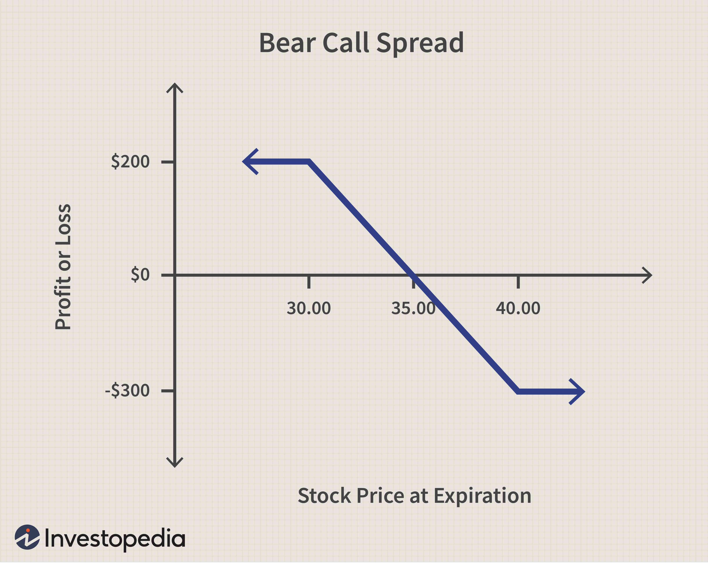

Options trading is a complex and dynamic field that provides traders with numerous strategies to profit from market fluctuations. Among these, bear put spreads, short selling, and algorithmic trading are prominent techniques that cater to varying market perspectives and risk appetites. This article aims to offer a detailed overview of these strategies, providing traders with the insights necessary to effectively implement them.

Bear put spreads are employed when anticipating a moderate decline in the price of an underlying asset. By purchasing and selling put options with different strike prices, traders can benefit from a downturn while limiting their risk exposure. This strategy offers a cost-effective approach, combining reduced risk with potential profitability.



Short selling involves selling borrowed shares with the goal of repurchasing them at a lower price, presenting traders with potentially unlimited risk should the market price rise unexpectedly. Alternatives such as bear put spreads offer a safer route by providing a capped risk profile with defined profit potential, making it a preferred choice in many scenarios.

Algorithmic trading further enhances these strategies by employing automated systems to execute trades based on predefined criteria. This reduces human error and emotional bias, increasing the efficiency and effectiveness of options trading strategies like bear put spreads. The availability of advanced technological tools empowers traders to implement complex strategies with greater precision.

Exploring the mechanics and benefits of these strategies under varying market conditions will aid traders in making informed decisions. With a focus on aligning strategies with market outlook, risk tolerance, and individual trading goals, this article seeks to provide a comprehensive guide to navigating the complexities of options trading.

## Table of Contents

## Understanding Bear Put Spreads

Bear put spreads are an essential strategy for traders anticipating a moderate decline in the price of an underlying asset. This strategy involves simultaneously purchasing and selling put options with varying strike prices on the same expiration date. The trader buys a put option with a higher strike price and sells another put with a lower strike price. This setup creates a spread, offering a defined risk-reward scenario.

The primary advantage of a bear put spread is its reduced cost and limited risk compared to buying a naked put. When you purchase a naked put, you pay the full premium, betting on a significant decrease in the asset's price. However, by creating a spread, the premium received from the sold put option offsets part of the cost of the purchased put option. Thus, this approach decreases the total monetary outlay and capitalizes on a moderate price drop.

Here's a more detailed look at how bear put spreads work and the conditions under which they are most effective:

### Mechanics of a Bear Put Spread

- **Setup**: In a bear put spread, the trader expects the underlying asset's price to fall, but not drastically. The maximum potential loss is limited to the net premium paid for the spread. Let:
  - $P_{\text{buy}}$ = premium paid for the higher strike put
  - $P_{\text{sell}}$ = premium received for the lower strike put
  - $S_{\text{buy}}$ = strike price of the purchased put
  - $S_{\text{sell}}$ = strike price of the sold put

  The net premium paid is $P_{\text{net}} = P_{\text{buy}} - P_{\text{sell}}$.

- **Profit and Loss**: Upon expiration, the profit or loss is determined by the price of the underlying asset. The maximum profit occurs when the asset's price is below $S_{\text{sell}}$, and is calculated as:
$$
  \text{Max Profit} = (S_{\text{buy}} - S_{\text{sell}}) - P_{\text{net}}

$$
  The maximum loss is simply the net premium paid, $P_{\text{net}}$, which occurs if both options expire worthless, i.e., when the underlying asset's price is above $S_{\text{buy}}$.

### Optimal Conditions for Bear Put Spreads

Bear put spreads are most effective under specific market conditions. Traders typically employ this strategy when forecasting a gradual decline in the underlying asset's price over a defined period. The strategy works best when the decline is expected to be moderate, as opposed to a sharp or drastic drop.

Furthermore, bear put spreads are advantageous in a relatively calm market environment with low [volatility](/wiki/volatility-trading-strategies). This is because lower volatility results in cheaper option premiums, aiding in reducing the overall cost of establishing the spread. Additionally, this strategy is beneficial in risk-averse scenarios because it offers a controlled method of profiting from declining prices with delineated potential losses and profits.

In summary, bear put spreads offer a cost-efficient, limited-risk approach for capitalizing on moderate price declines. This strategy is particularly appealing to traders who wish to mitigate the high costs and risks associated with more aggressive bearish strategies, such as naked puts.

## Short Selling Alternatives

Short selling is a financial strategy that involves selling borrowed shares with the objective of purchasing them back at a lower price, thereby profiting from a decline in the share's price. Despite its potential for high returns, short selling carries a significant downside: the risk is theoretically unlimited. If the stock price rises instead of falls, the trader may incur substantial, open-ended losses.

In contrast, options strategies like bear put spreads present a more conservative approach with a predefined risk-reward profile. A bear put spread involves two simultaneous options transactions: buying a put option at a higher strike price and selling another put option at a lower strike price on the same underlying asset with the same expiration date. This setup ensures that the risk is capped at the initial net premium paid for the spread, while the profit potential is also limited but clearly defined.

Bear put spreads may be preferable over traditional short selling in several scenarios:

1. **Risk Management**: When traders wish to limit their exposure to potentially unlimited losses, a bear put spread is advantageous. With this strategy, the maximum loss is restricted to the cost of setting up the spread, making it more suitable for risk-averse investors.

2. **Cost Efficiency**: Initiating a short position requires a margin account and involves borrowing costs along with potential margin calls if the trade moves against the trader. Bear put spreads, on the other hand, do not involve borrowing securities and typically require a lower capital outlay proportional to their risk, which can make them a more cost-effective choice.

3. **Volatility Considerations**: In markets experiencing high volatility, short positions can become riskier due to unexpected price surges. By contrast, a bear put spread takes advantage of options pricing dynamics, wherein the purchased put benefits from increased volatility, helping to offset the initial cost of the sold put.

4. **Market Sentiment**: When expecting a moderate decline in the underlying asset as opposed to a substantial drop, bear put spreads might be more suitable than short selling. The limited profit potential aligns well with scenarios involving minor or moderate downward movement in the stock's price.

Overall, while short selling is a valid strategy for traders expecting a decline in stock prices, bear put spreads offer an attractive alternative by minimizing potential losses and managing risk more effectively. These features are particularly appealing in volatile market conditions or when the trader has a conservative risk tolerance.

## Algorithmic Trading in Options

Algorithmic trading in options leverages automated systems to execute trades with precision and efficiency. These systems are programmed based on pre-defined criteria, making them well-suited to strategies such as bear put spreads. By utilizing advanced algorithms, traders can take advantage of various market conditions without the drawbacks associated with manual trading. One critical advantage is the minimization of emotional and human-induced errors, such as hesitations or impulsive decisions, which can adversely affect trading outcomes.

The incorporation of algorithms allows for the rapid processing of vast amounts of market data, thereby identifying trading opportunities that might be missed by human traders. Algorithms can execute trades at high speeds and with significant accuracy, offering improved scalability and effectiveness in handling complex strategies.

Technological tools such as [machine learning](/wiki/machine-learning) and [artificial intelligence](/wiki/ai-artificial-intelligence) further enhance the capability of [algorithmic trading](/wiki/algorithmic-trading) in options. Machine learning algorithms can analyze historical data to forecast price movements and detect patterns, thereby refining option strategies such as bear put spreads. This predictive capacity enables traders to optimize their strategies by adjusting parameters such as strike prices and expiration dates based on anticipated market trends.

For instance, a simple Python script could be employed to monitor market conditions and automatically execute a bear put spread when predefined criteria are met:

```python
import numpy as np
import pandas as pd

# Example: Using a simple moving average to trigger a bear put spread
def moving_average(data, window_size):
    return data.rolling(window=window_size).mean()

def execute_bear_put_spread(current_price, short_strike, long_strike, expiration):
    if current_price < short_strike and current_price > long_strike:
        # Implement trading logic to execute bear put spread
        print("Executing Bear Put Spread")

# Mock market data
market_data = pd.Series(np.random.randn(100) * 20 + 1000)

# Calculate moving averages
short_ma = moving_average(market_data, window_size=5)
long_ma = moving_average(market_data, window_size=20)

# Strategy parameters
short_strike_price = 980
long_strike_price = 950
option_expiration = '2023-12-31'

# Simulate trading strategy
for price in market_data:
    if short_ma[-1] < long_ma[-1]:  # Example condition for bearish trend
        execute_bear_put_spread(price, short_strike_price, long_strike_price, option_expiration)
```

This example demonstrates how algorithms can automate bear put spreads based on market signals, reducing time lag and enhancing decision-making processes. Moreover, with the increasing accessibility of high-frequency trading platforms and APIs, traders can tailor these algorithms to fit specific strategies and risk profiles.

Overall, algorithmic trading empowers traders by enabling them to implement complex strategies such as bear put spreads with greater precision and less emotional bias. As technology continues to evolve, these tools become increasingly indispensable for traders looking to maintain a competitive edge in the options market.

## Implementing Bear Put Spreads

Implementing a bear put spread involves a strategic selection of options based on an informed analysis of market conditions. This strategy allows traders to benefit from anticipated moderate declines in the price of an underlying asset while capping risk and reducing cost compared to purchasing a naked put option.

To establish a bear put spread, a trader should begin by choosing two put options with the same expiration date but different strike prices. The trader purchases a put option with a higher strike price and sells a put option with a lower strike price. This combination ensures that the potential loss is limited to the net premium paid to initiate the spread, while profits are capped by the difference between the two strike prices less the net premium.

### Step-by-Step Implementation:

1. **Market Analysis**: Carefully analyze market conditions and identify an asset predicted to experience a moderate decline. This analysis involves evaluating technical indicators, market trends, or macroeconomic factors relevant to the asset.

2. **Select Strike Prices**: Choose an appropriate strike price for the put options. The higher strike price (P1) should be at-the-money or slightly out-of-the-money. The lower strike price (P2) should be further out-of-the-money.

3. **Execute the Trade**:
   - **Buy a Put Option**: Purchase a put option (Put A) with the strike price P1.
   - **Sell a Put Option**: Simultaneously, sell a put option (Put B) with the strike price P2.

4. **Calculate Net Premium**: The initial cost of the bear put spread is the net premium, which is the difference in the premiums of the two options. This can be calculated as:
$$
   \text{Net Premium} = \text{Premium of Put A} - \text{Premium of Put B}

$$

5. **Determine Breakeven Point**: The breakeven point of the strategy is the higher strike price minus the net premium paid:
$$
   \text{Breakeven Price} = P1 - \text{Net Premium}

$$

6. **Evaluate Maximum Profit and Risk**: The maximum potential profit of the bear put spread is the difference between the strike prices minus the net premium paid:
$$
   \text{Maximum Profit} = (P1 - P2) - \text{Net Premium}

$$

   The maximum risk is limited to the net premium paid to enter the spread.

### Practical Example:

Consider a stock currently trading at $50, with an anticipated decline. A trader might choose to implement a bear put spread as follows:

- Buy a put option with a strike price of $52 for a premium of $3.
- Sell a put option with a strike price of $48 for a premium of $1.

The net premium paid is $3 - $1 = $2.

- **Breakeven Point**: $52 - $2 = $50
- **Maximum Profit**: ($52 - $48) - $2 = $2

The trader profits if the stock falls below the breakeven price of $50, with the maximum profit realized if the stock price drops to or below $48 at expiration.

This strategic implementation allows traders to capitalize on bearish market expectations while managing risk exposure and optimizing capital efficiency.

## Benefits and Drawbacks of Bear Put Spreads

Bear put spreads are a strategic option for traders seeking to capitalize on a moderate decline in an asset's price while maintaining a balance between risk and capital investment. One of the primary advantages of this approach is its ability to offer reduced risk relative to outright short positions or purchasing naked put options. The risk is limited to the net premium paid upfront, ensuring that losses are capped.

A significant advantage of bear put spreads involves capital efficiency. By structuring trades with the purchase of a higher strike put and the sale of a lower strike put, traders can lower the upfront cost compared to purchasing a single put option. This combination allows traders to enter positions with less capital expenditure, preserving resources for additional trades or investment opportunities.

The construction of a bear put spread inherently caps maximum profit potential. The profit is limited to the difference between the two strike prices, minus the net premium paid. This limitation may not appeal to traders looking for unlimited upside potential, as the gains are capped to a fixed amount. For example, if a trader purchases a put option with a strike price of $50 and sells a put option with a strike price of $45, while paying a net premium of $2, the maximum profit is limited to $3 ($5 difference in strike prices - $2 premium).

The capped profit can pose a drawback for traders seeking significant returns during high volatility market conditions. However, in scenarios where the asset undergoes moderate downward movement, bear put spreads align well with risk-averse traders' objectives by providing structured profit limits and predefined losses, allowing better risk management.

Balancing these trade-offs with individual risk tolerance levels is essential. Traders must assess their willingness to accept the capped profit potential against the advantage of controlled downside risk. Bear put spreads cater well to those with a moderate-to-conservative market outlook, valuing consistency and risk management over high-stakes potential.

In summary, while bear put spreads effectively reduce risk and enhance capital efficiency, their trade-offs include a limited profit ceiling. These strategies align well with varying investment goals and risk thresholds, offering traders a balanced approach between risk and reward.

## Conclusion

Bear put spreads offer traders a balanced approach to managing risk and potential reward when expecting a moderate decline in the price of an asset. By using this strategy, traders can benefit from a more predictable risk-reward ratio compared to short selling, where risk is theoretically unlimited. In bear put spreads, the risk is limited to the net premium paid, while potential profit is capped at the difference between the strike prices of the options minus the net premium.

Algorithmic trading can significantly improve the execution of bear put spread strategies. Automating trade execution helps to avoid emotional decision-making, which is a common challenge for many traders. Algorithms can be programmed to consider various market conditions and execute trades based on pre-defined criteria, ensuring that decisions are made consistently and quickly. This not only enhances efficiency but can also lead to better alignment with the trader's intended strategy outcomes.

Ultimately, the choice between using bear put spreads or any other strategy should align with individual market outlooks, risk tolerance, and trading goals. For traders with a market outlook expecting moderate declines, and who prioritize controlled risk with capped rewards, bear put spreads present a viable strategy. Consideration of personal risk tolerance is crucial as traders must be comfortable with the potential outcomes of their strategies. Aligning trading choices with clearly defined goals ensures that strategies are implemented effectively and can lead to more successful trading outcomes in the options market.

## References & Further Reading

[1]: Hull, J. C. (2014). ["Options, Futures, and Other Derivatives"](https://www.amazon.com/Options-Futures-Other-Derivatives-9th/dp/0133456315) (9th Edition). Pearson Education Limited.

[2]: ["Options as a Strategic Investment"](https://www.amazon.com/Options-as-Strategic-Investment-Fifth/dp/0735204659) by Lawrence G. McMillan

[3]: Kissell, R. (2013). ["The Science of Algorithmic Trading and Portfolio Management"](https://www.sciencedirect.com/book/9780124016897/the-science-of-algorithmic-trading-and-portfolio-management). Academic Press.

[4]: Pinedo, M. L. (2016). ["Trading and Electronic Markets: What Investment Professionals Need to Know"](https://rpc.cfainstitute.org/research/financial-analysts-journal/2016/trading-and-electronic-markets). CFA Institute.

[5]: Black, F., & Scholes, M. (1973). ["The Pricing of Options and Corporate Liabilities,"](https://www.cs.princeton.edu/courses/archive/fall09/cos323/papers/black_scholes73.pdf) Journal of Political Economy, 81(3), 637-654.