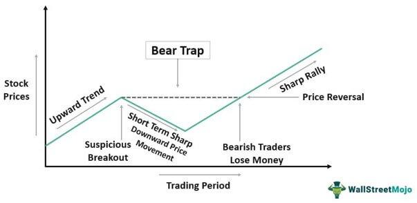

## Table of Contents

## What is a bear raid in finance?

A bear raid in finance is when investors work together to make a stock's price go down. They do this by selling a lot of the stock or spreading bad news about the company. The goal is to make other people panic and sell their shares too, which makes the price drop even more. The investors who started the bear raid can then buy the stock back at a lower price and make a profit.

Bear raids can be very harmful to a company. When the stock price falls a lot, it can make the company look bad and hurt its business. Sometimes, the company might have to lay off workers or even go bankrupt. Because bear raids can be so damaging, they are often seen as unfair and can be against the law if the investors spread false information.

## How does a bear raid affect stock prices?

A bear raid makes stock prices go down. It happens when some investors work together to sell a lot of a company's stock or spread bad news about the company. This makes other people who own the stock scared, so they start selling their shares too. When lots of people are selling and no one is buying, the price of the stock goes down.

When the stock price goes down a lot because of a bear raid, it can hurt the company. The company might look bad to other people, and it could have trouble doing business. Sometimes, the company might need to let workers go or even close down. That's why bear raids can be seen as unfair and might be illegal if the investors are lying about the company.

## Can you explain the basic mechanics of a bear raid?

A bear raid is when some investors team up to make a stock's price go down. They do this by selling a lot of the stock they own or by telling people bad things about the company. When they sell a lot of the stock, it makes other people who own the stock worried. These worried people start selling their shares too, and this makes the price of the stock go down.

Once the stock price goes down a lot, the investors who started the bear raid can buy the stock back at a lower price. They make money because they sold the stock at a higher price before and now they are buying it back cheaper. Bear raids can be bad for the company because a low stock price can make the company look weak and hurt its business. If the investors spread lies about the company, it can be against the law.

## What are the legal implications of conducting a bear raid?

Conducting a bear raid can be risky because it might break the law. If the investors spread false information about a company to make its stock price go down, they could be charged with spreading false information or market manipulation. These are serious crimes and can lead to big fines or even jail time. The laws are there to keep the stock market fair and protect companies and investors from being hurt by lies.

Regulators like the Securities and Exchange Commission (SEC) in the United States keep a close watch on the stock market to stop bear raids and other unfair practices. If they find out that someone is doing a bear raid, they can start an investigation. The investors involved might have to pay back any money they made from the bear raid and could face other punishments. This is why it's important for investors to follow the rules and not try to trick the market.

## Who typically initiates a bear raid and why?

Bear raids are usually started by investors who want to make money by making a stock's price go down. These investors might be big hedge funds or other groups who think a company's stock is too expensive. They might also believe that the company is not doing well and want to speed up its fall. By selling a lot of the stock or spreading bad news, they hope to scare other investors into selling too, which makes the price drop.

These investors start a bear raid because they can profit from it. They might have shorted the stock, which means they borrowed shares and sold them, planning to buy them back later at a lower price. If the stock price goes down because of the bear raid, they can buy the shares back cheaper and keep the difference as profit. But, they have to be careful because if they break the law by spreading false information, they could get in big trouble.

## What are the signs that a bear raid might be occurring?

You might see a bear raid happening if you notice a stock's price dropping really fast for no clear reason. It's like the price is falling out of nowhere, and people start talking about the company in a bad way. If lots of people are suddenly selling the stock and there's a lot of bad news going around, it could be a sign that some investors are trying to make the price go down on purpose.

Another sign is if you see a lot of short selling happening with the stock. Short selling is when investors borrow shares and sell them, hoping to buy them back later at a lower price. If there's a sudden increase in short selling and the stock price is falling, it might mean a bear raid is going on. These signs can help you spot when some investors might be working together to hurt a company's stock price.

## How can investors protect themselves from a bear raid?

Investors can protect themselves from a bear raid by staying calm and doing their homework. When they see a stock's price dropping fast, they shouldn't panic and sell right away. Instead, they should look at the company's news and reports to see if there's a good reason for the price drop. If they find out that the bad news isn't true or the company is still doing well, they might decide to keep their shares. By not selling, they can help stop the bear raid from working.

Another way to protect themselves is by spreading out their investments. This means not putting all their money into one stock. If they have money in different stocks or other types of investments, a bear raid on one stock won't hurt them as much. It's also a good idea to keep an eye on the stock market and learn about short selling. Knowing how bear raids work can help them make better choices and stay safe from these kinds of attacks.

## What historical examples illustrate the impact of bear raids?

One famous example of a bear raid happened in 1929, just before the Great Depression. Investors worked together to sell a lot of shares in the stock market, making prices go down fast. This made other people panic and sell their stocks too, which made the prices drop even more. It was one of the things that helped start the big crash in the stock market. Many people lost a lot of money because of it, and it showed how dangerous bear raids can be.

Another example is the bear raid on Lehman Brothers in 2008. Some investors thought Lehman Brothers was in trouble, so they started selling its stock and spreading bad news. This made the stock price go down a lot, which made things worse for the company. Lehman Brothers ended up going bankrupt, and it was a big part of the financial crisis that year. These examples show how bear raids can hurt companies and the whole economy.

## How do regulatory bodies respond to bear raids?

Regulatory bodies, like the Securities and Exchange Commission (SEC) in the United States, keep a close watch on the stock market to stop bear raids. They look for signs of market manipulation and false information being spread about companies. If they think a bear raid is happening, they start an investigation. They can look at trading records and talk to people involved to find out if anyone broke the law. If they find proof of wrongdoing, they can take action against the investors who started the bear raid.

When regulatory bodies find out that investors did a bear raid and broke the law, they can punish them. The investors might have to pay big fines or even go to jail. The regulators can also make the investors give back any money they made from the bear raid. By doing this, the regulators try to keep the stock market fair and safe for everyone. They want to make sure that no one can trick the market and hurt companies and other investors.

## What role does short selling play in a bear raid?

Short selling is a big part of a bear raid. It's when investors borrow shares of a stock and sell them, hoping to buy them back later at a lower price. In a bear raid, these investors sell a lot of the borrowed shares to make the stock price go down. They want to scare other people into selling their shares too, which makes the price drop even more. If the price goes down like they planned, they can buy the shares back cheaper and make a profit.

Regulators keep a close eye on short selling because it can be used to hurt companies in a bear raid. If investors spread lies to make the stock price go down, they could be breaking the law. The regulators can start an investigation and punish the investors if they find out they did something wrong. This helps keep the stock market fair and stops people from using short selling to trick the market and hurt companies.

## How can advanced trading strategies counteract the effects of a bear raid?

Advanced trading strategies can help investors fight back against a bear raid. One way is by using a strategy called "buying the dip." This means that when the stock price goes down because of the bear raid, smart investors buy more shares at the lower price. By doing this, they can help stop the price from falling more and might even make the price go back up. Another strategy is called "covering shorts," where investors who shorted the stock buy it back to close their positions. If a lot of people do this at the same time, it can push the stock price up and make the bear raid less effective.

Another way to counteract a bear raid is by using options trading. Investors can buy call options, which give them the right to buy the stock at a set price in the future. If the stock price goes up, they can make money from these options. This can also help push the stock price up because more people might want to buy the stock if they think it will go up. By using these advanced strategies, investors can work together to make the bear raid fail and protect the company's stock price.

## What are the long-term market consequences of frequent bear raids?

If bear raids happen a lot, it can make the stock market less safe and fair. People might start to trust the market less because they see that some investors can work together to hurt a company's stock price. This can make fewer people want to invest their money in the stock market. When fewer people invest, it can slow down the whole economy because companies need money from investors to grow and create jobs. Regulators might have to step in more often to stop bear raids, which can make the market feel more controlled and less free.

Over time, frequent bear raids can also hurt companies a lot. If a company's stock price keeps getting attacked, it might have a hard time getting the money it needs to keep running or grow. This can lead to layoffs, less investment in new projects, and even bankruptcy. When many companies struggle like this, it can make the whole economy weaker. So, while bear raids might help some investors make quick money, they can cause big problems for everyone else in the long run.

## What is the impact on stock prices?

Bear raids can significantly impact stock prices, creating intense [volatility](/wiki/volatility-trading-strategies) and substantial declines in the targeted equities. This market manipulation strategy exploits psychological and structural vulnerabilities of financial markets, primarily through inducing panic selling among investors. When rumors, often unfounded, about a company's poor performance or impending issues are spread, they can quickly erode investor confidence. As market participants scramble to offload shares, the [volume](/wiki/volume-trading-strategy) of trades surges, further driving down the stock price due to excess supply and decreased demand.

This initial wave of selling is not only fueled by the dissemination of negative sentiments but also compounded by automated trading systems and high-frequency trading algorithms. These systems, designed to react to market trends, may interpret the sharp price decline as a signal to execute additional sell orders, thereby exacerbating the downward trajectory of the stock price.

Moreover, as stock prices plummet, investors who purchased shares on margin may face margin calls. A margin call occurs when the value of securities in a margin account falls below the broker's required minimum value, prompting investors to add more funds to the account or sell off part of their holdings to meet the requirement. The forced liquidation of assets triggered by margin calls increases selling pressure, creating a feedback loop that accelerates the decline in stock prices.

The equation for calculating the margin call price can be expressed as:

$$
\text{Margin Call Price} = \frac{\text{Loan Amount}}{1 - \text{Maintenance Margin Requirement}}
$$

When stock prices fall to this level during a bear raid, the forced sales due to margin calls amplify the selling [momentum](/wiki/momentum), pushing prices lower and spreading contagion across related market segments. This phenomenon underscores the interconnectedness of modern financial systems and the potential for localized shocks to have broader repercussions. The combination of panic, [algorithmic trading](/wiki/algorithmic-trading), and leverage can thus lead to pronounced swings in stock prices during bear raids, destabilizing markets and eroding investor trust.

## References & Further Reading

[1]: Stock Market Manipulations. (2015). ["Stock Market Crashes Caused by Bear Raids"](https://www.investopedia.com/articles/investing/011116/two-biggest-flash-crashes-2015.asp). Journal of Financial Markets.

[2]: Partnoy, F. (2001). ["The Enron Debacle and Market Manipulation."](https://www.researchgate.net/publication/46302792_The_Case_Analysis_of_the_Scandal_of_Enron). Emory Law Journal.

[3]: Byrne, J. A., & Vermilyea, T. (2003). ["Jesse Livermore: World's Greatest Stock Trader."](https://www.amazon.com/Jesse-Livermore-Worlds-Greatest-Trader/dp/0471023264) Wiley.

[4]: Shadab, H. B. (2014). ["Fending Off Financial Regulators: Protecting High-Frequency Trading from Dodd-Frank's Antimanipulation Reforms."](https://pmc.ncbi.nlm.nih.gov/articles/PMC6094441/). Columbia Law Review.

[5]: Securities and Exchange Commission. ["SEC Enforcement Actions Addressing Market Manipulation"](https://www.sec.gov/enforcement-litigation).

[6]: Jones, C. M. (2013). ["What Do We Know About High-Frequency Trading?"](https://papers.ssrn.com/sol3/papers.cfm?abstract_id=2236201). Journal of Economic Literature.

[7]: Degryse, H., de Jong, F., & van Kervel, V. (2015). ["The Impact of Dark Trading and Visible Fragmentation on Market Quality."](https://academic.oup.com/rof/article/19/4/1587/1567671) Review of Financial Studies.