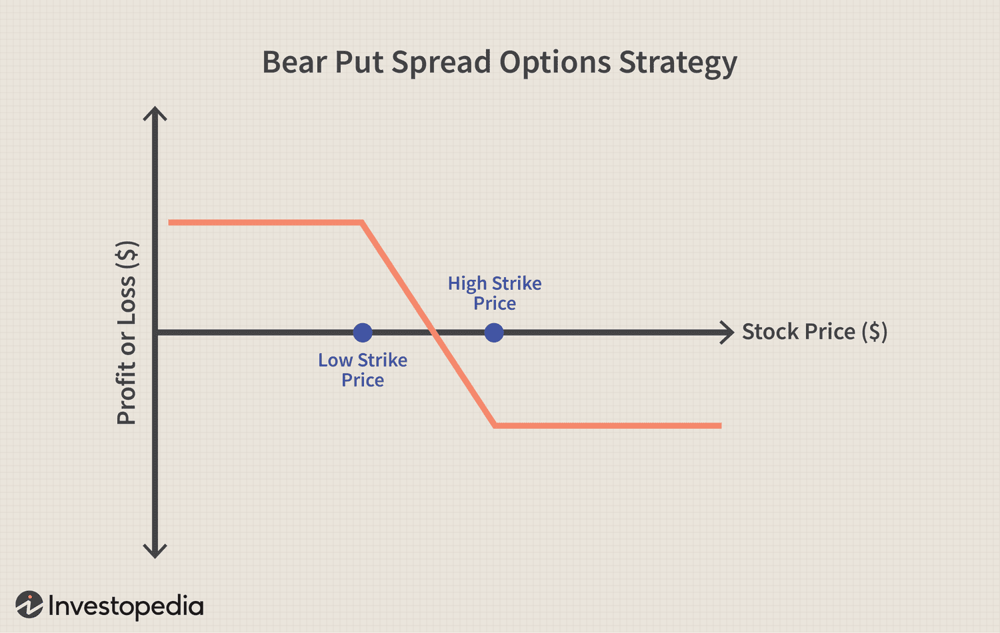

## Table of Contents

## What is a bear spread in options trading?

A bear spread is a type of options trading strategy that investors use when they think the price of a stock or other asset will go down. It involves buying and selling options at the same time, but with different prices or expiration dates. The goal is to make money if the price of the asset falls, but also to limit the risk if the price goes up instead.

In a bear spread, you might buy a put option with a higher strike price and sell a put option with a lower strike price. This way, if the stock price drops below the higher strike price, you can make money from the difference between the two options. But if the stock price stays above the higher strike price, your loss is limited to the cost of setting up the spread. This strategy helps traders balance potential gains with controlled risk.

## How does a bear spread work?

A bear spread is a way to trade options when you think a stock's price will go down. It involves two steps: buying one option and selling another. You might buy a put option at a higher price, called the strike price, and sell another put option at a lower strike price. If the stock's price falls below the higher strike price, you can make money from the difference between the two options. This strategy helps you earn if the stock goes down, but it also limits how much you can lose if the stock goes up instead.

The key to a bear spread is that it caps both your potential profit and your potential loss. If the stock price stays above the higher strike price, the most you can lose is the money you spent to set up the spread. On the other hand, if the stock price drops a lot, your profit is limited to the difference between the two strike prices, minus the cost of setting up the spread. This makes a bear spread a safer way to bet on a falling stock price, because it helps you manage risk while still giving you a chance to make money.

## What are the key components of a bear spread?

A bear spread has two main parts: buying one option and selling another. You buy a put option with a higher strike price and sell a put option with a lower strike price. This setup is used when you think the price of a stock will go down. The difference between the two strike prices is important because it sets the maximum amount of money you can make if the stock price falls below the higher strike price.

The cost to set up the bear spread is also a key part. This is the money you pay to buy the higher strike price put option minus what you get from selling the lower strike price put option. If the stock price stays above the higher strike price, the most you can lose is the cost of setting up the spread. But if the stock price drops below the higher strike price, you can make money up to the difference between the two strike prices, minus the cost of setting up the spread. This way, a bear spread helps you limit your risk while still giving you a chance to profit if the stock price goes down.

## What is the difference between a bear call spread and a bear put spread?

A bear call spread and a bear put spread are both used when you think a stock's price will go down, but they work a bit differently. In a bear call spread, you sell a call option with a lower strike price and buy a call option with a higher strike price. This means you get money from selling the call option, but you also have to pay to buy the other call option. If the stock price stays below the lower strike price, you keep the money you got from setting up the spread. But if the stock price goes above the higher strike price, your loss is limited to the difference between the two strike prices, minus the money you got from setting up the spread.

On the other hand, a bear put spread involves buying a put option with a higher strike price and selling a put option with a lower strike price. You pay to buy the put option with the higher strike price and get some money back from selling the put option with the lower strike price. If the stock price falls below the higher strike price, you can make money up to the difference between the two strike prices, minus the cost of setting up the spread. If the stock price stays above the higher strike price, the most you can lose is the money you spent to set up the spread. Both strategies help you make money if the stock price goes down, but they use different types of options and have different ways of managing risk and reward.

## How do you set up a bear call spread?

To set up a bear call spread, you need to do two things. First, you sell a call option with a lower strike price. This means you get money right away because someone else is buying that option from you. Then, you buy a call option with a higher strike price. This costs you money, but it helps limit how much you can lose if the stock price goes up a lot. The difference between the money you get from selling the lower strike call and the money you pay for the higher strike call is your net credit, which is also the most you can make if the stock price stays below the lower strike price.

If the stock price stays below the lower strike price when the options expire, the call options you sold and bought will both be worthless, and you keep the net credit as your profit. But if the stock price goes above the higher strike price, you could lose money. The most you can lose is the difference between the two strike prices, minus the net credit you got when you set up the spread. This way, a bear call spread helps you make money if the stock price goes down, but it also limits your risk if the stock price goes up.

## How do you set up a bear put spread?

To set up a bear put spread, you first buy a put option with a higher strike price. This costs you money because you are buying the right to sell the stock at that higher price. Then, you sell a put option with a lower strike price. This gives you some money back because someone else is buying that option from you. The difference between the money you pay for the higher strike put and the money you get from selling the lower strike put is your net cost, which is also the most you can lose if the stock price stays above the higher strike price.

If the stock price falls below the higher strike price when the options expire, you can make money. The most you can make is the difference between the two strike prices, minus the net cost of setting up the spread. But if the stock price stays above the higher strike price, both put options will be worthless, and you will lose the net cost you paid to set up the spread. A bear put spread is a way to make money if you think a stock's price will go down, while also limiting how much you can lose if the stock price goes up instead.

## What are the potential risks and rewards of using a bear spread?

Using a bear spread can help you make money if you think a stock's price will go down. The reward is that you can earn the difference between the two strike prices, minus the cost of setting up the spread. For a bear put spread, if the stock price falls below the higher strike price, you can make money up to that difference. For a bear call spread, if the stock price stays below the lower strike price, you keep the money you got from setting up the spread. This way, you have a chance to profit from a falling stock price.

However, there are risks involved too. The main risk is that if the stock price doesn't fall as expected, you could lose money. For a bear put spread, if the stock price stays above the higher strike price, you lose the money you spent to set up the spread. For a bear call spread, if the stock price goes above the higher strike price, you could lose the difference between the two strike prices, minus the money you got from setting up the spread. The good thing is that both types of bear spreads limit how much you can lose, making them safer than some other ways to bet on a falling stock price.

## Can you provide an example of a bear call spread?

Let's say you think the price of XYZ stock, which is currently trading at $50, will go down in the next month. You decide to set up a bear call spread using options that expire in one month. You sell a call option with a strike price of $50 and get $2 for it. Then, you buy a call option with a strike price of $55 and pay $1 for it. The difference between what you got and what you paid is $1, which is your net credit. This $1 is also the most you can make if the stock price stays below $50 when the options expire.

If the stock price stays below $50 at expiration, both call options will be worthless, and you keep the $1 net credit as your profit. But if the stock price goes above $55, you could lose money. The most you can lose is the difference between the two strike prices ($55 - $50 = $5), minus the $1 net credit you got when you set up the spread. So, your maximum loss would be $4. This way, a bear call spread helps you make money if the stock price goes down, but it also limits your risk if the stock price goes up.

## Can you provide an example of a bear put spread?

Let's say you think the price of ABC stock, which is currently trading at $100, will go down in the next month. You decide to set up a bear put spread using options that expire in one month. You buy a put option with a strike price of $100 and pay $5 for it. Then, you sell a put option with a strike price of $90 and get $2 for it. The difference between what you paid and what you got is $3, which is your net cost. This $3 is also the most you can lose if the stock price stays above $100 when the options expire.

If the stock price falls below $100 at expiration, you can make money. The most you can make is the difference between the two strike prices ($100 - $90 = $10), minus the $3 net cost you paid to set up the spread. So, your maximum profit would be $7. This way, a bear put spread helps you make money if the stock price goes down, but it also limits how much you can lose if the stock price stays the same or goes up.

## How does the choice of strike prices affect the outcome of a bear spread?

The choice of strike prices in a bear spread really matters because it changes how much you can make and how much you might lose. If you pick a higher strike price for the option you buy and a lower strike price for the option you sell, the difference between these prices sets the most money you can make. For a bear put spread, if the stock price falls below the higher strike price, you can make money up to that difference, minus what it cost to set up the spread. For a bear call spread, if the stock price stays below the lower strike price, you keep the money you got from setting up the spread. So, choosing strike prices that are far apart can give you a chance to make more money, but it also costs more to set up.

On the other hand, choosing strike prices that are close together makes the spread cheaper to set up, but it also limits how much you can make. If the stock price doesn't fall below the higher strike price for a bear put spread, or if it goes above the higher strike price for a bear call spread, you could lose money. The most you can lose is what you paid to set up the spread for a bear put spread, or the difference between the strike prices minus what you got for a bear call spread. So, the strike prices you pick can make a big difference in how much risk you're taking and how much reward you might get.

## What are the best market conditions for implementing a bear spread?

The best time to use a bear spread is when you think the price of a stock will go down a bit, but you're not sure it will drop a lot. This strategy works well when the market is a little bit bearish, meaning people are more worried than excited about the stock. If you think the stock might fall slowly over time, a bear spread can help you make money from that drop while also keeping your risk under control. It's a good choice when you want to bet against a stock without risking too much money.

Bear spreads are also good to use when you want to protect other investments you have. If you own a stock and you're worried it might go down, setting up a bear spread can help you make some money if the stock falls, which can help make up for any losses in your other investments. This way, you're not just hoping the stock goes down; you're also making sure you don't lose too much if it doesn't. So, bear spreads are a smart move when you want to play it safe while still trying to make money from a falling stock price.

## How can advanced traders optimize a bear spread strategy?

Advanced traders can optimize a bear spread strategy by carefully choosing the strike prices and expiration dates of the options they use. They might pick strike prices that are not too far apart to keep the cost of setting up the spread low, but still far enough to give them a good chance to make money if the stock price falls. They can also choose options that expire in a few weeks or months, depending on how long they think it will take for the stock price to go down. By adjusting these choices, advanced traders can balance the risk and reward to fit their own trading goals.

Another way advanced traders can optimize a bear spread is by using different types of bear spreads, like bear call spreads or bear put spreads, based on what they think will happen to the stock price. If they think the stock will stay the same or go up a little, they might use a bear call spread to get money upfront and limit their risk. If they think the stock will fall a lot, they might use a bear put spread to make more money if the stock drops below the higher strike price. By mixing and matching these strategies, advanced traders can make the most of their predictions about the stock market.

## What are the types of Bear Spreads?

A bear spread is an options trading strategy that seeks to profit from declines in the price of an underlying asset. It involves executing two options trades with the same expiration date but different strike prices. The difference in strike prices establishes the potential range of profit and loss for the strategy. Bear spreads can be constructed using either put options or call options, and each method has distinct characteristics. 

### Bear Put Spread

A bear put spread is initiated by purchasing a put option at a certain strike price while simultaneously selling another put option at a lower strike price. This strategy is advantageous when a trader expects the price of the asset to decline. The sold put option helps offset some of the cost of the purchased put option, thus lowering the overall cost of implementing the strategy. The maximum profit for a bear put spread is realized if the asset's price falls below the strike price of the written put option at expiration. The formula for the maximum profit (Max Profit) and maximum loss (Max Loss) is as follows:

$$

\text{Max Profit} = (K_1 - K_2) - (\text{Premium paid} - \text{Premium received})
$$

$$

\text{Max Loss} = \text{Premium paid} - \text{Premium received}
$$

where $K_1$ is the higher strike price of the long put, and $K_2$ is the lower strike price of the short put.

### Bear Call Spread

Conversely, a bear call spread involves selling a call option with a lower strike price and buying another call option with a higher strike price. This setup is beneficial for traders expecting the price of the underlying asset to remain stagnant or decline slightly. By selling a call option, the trader receives a premium, which helps reduce the cost of buying the call option with the higher strike price. The maximum potential profit occurs when the price of the underlying asset remains below the strike price of the sold call option at expiration. It can be calculated using:

$$

\text{Max Profit} = \text{Premium received} - \text{Premium paid}
$$

$$

\text{Max Loss} = (K_2 - K_1) - (\text{Premium received} - \text{Premium paid})
$$

Here, $K_1$ represents the strike price of the short call, and $K_2$ is the strike price of the long call.

### Risk and Reward

Both bar put spreads and bear call spreads offer a limited risk and reward profile, making them suitable for traders with bearish outlooks who also desire a controlled risk exposure. The limited losses with these strategies ensure protection against unfavorable market movements, while the capped gains reflect the cost of restricted market predictions. These strategies can be part of a diversified portfolio, especially when moderate declines in market prices are anticipated.

## What is an example of a Bear Call Spread?

Consider a stock currently trading at $50. A trader opts to construct a bear call spread by engaging in two simultaneous transactions: selling a call option with a strike price of $55 and buying another call option with a higher strike price of $60. Both options have the same expiration date. This configuration generates a net credit upfront since the premium received from selling the $55 call exceeds the premium paid for the $60 call.

For profitability, the stock needs to remain below $55 at expiration. The maximum profit corresponds to the net credit received, as the premiums effectively cap the potential payout. If the stock's price stays below $55 at expiration, both options expire worthless. The trader retains the entire net credit as profit.

On the other hand, the maximum loss occurs if the stock price exceeds the $60 strike. This scenario results in the sold call being in-the-money, necessitating the purchase of 100 shares at $60 each to fulfill the contract terms, while the $55 call offsets this by allowing the selling of shares at a lower price. The loss is computed as the difference in strike prices minus the initial net credit:

$$
\text{Maximum Loss} = (\text{Strike}_{\text{buy}} - \text{Strike}_{\text{sell}}) - \text{Net Credit}
$$

For instance, if the net credit is $1.00 per share:

$$
\text{Maximum Loss} = (60 - 55) - 1 = 4 \, \text{per share}
$$

The breakeven point occurs when the stock price exactly equals the strike of the sold call plus the net credit, in this example:

$$
\text{Breakeven Point} = 55 + 1 = 56
$$

Below $56, the position remains profitable, and above this, the trader starts incurring a loss. This strategic risk-reward profile assists traders in decision-making when market downturns are anticipated.

## References & Further Reading

Books and articles provide valuable insights into options strategies, including bear spreads, which are essential for traders aiming to capitalize on market downturns. Some recommended readings include:

1. **"Options, Futures, and Other Derivatives" by John C. Hull** - This book offers a comprehensive overview of derivatives, including options strategies like bear spreads, explaining their theoretical underpinnings and practical applications.

2. **"The Options Playbook" by Brian Overby** - A beginner-friendly resource that outlines various options strategies, including calls and puts. The book discusses the mechanics of bear spreads and their strengths and limitations.

Research on algorithmic trading and its applications in options trading has advanced significantly. Notable studies include:

1. **"Algorithmic and High-Frequency Trading" by Álvaro Cartea, Sebastian Jaimungal, and José Penalva** - This book presents mathematical models for algorithmic trading, elucidating how traders can integrate complex options strategies like bear spreads into automated systems.

2. **"Algorithmic Trading and DMA: An introduction to direct access trading strategies" by Barry Johnson** - A guide to designing and implementing algorithmic trading strategies, with emphasis on the utilization of options like bear call and put spreads.

Case studies showcase successful implementations of bear spreads within real-world trading contexts:

1. **"Case Studies in Derivatives Markets" by David Goldenberg** - This compilation of case studies examines various derivatives markets scenarios, detailing episodes where bear spreads were profitably employed.

2. **"Wall Street Stories: Insights from the Pros"** - Features interviews and case studies with professional traders who have effectively utilized bear spreads and other options strategies to mitigate risk and enhance returns in bearish markets.

These resources provide comprehensive knowledge and practical examples, valuable for traders and researchers interested in deepening their understanding of bear spreads and algorithmic trading. Additionally, online platforms like [CBOE](https://www.cboe.com/learn/advanced-options-strategies/bear-call-spread/) and [Investopedia](https://www.investopedia.com/terms/b/bearspread.asp) offer detailed articles and tutorials on advanced options strategies.

