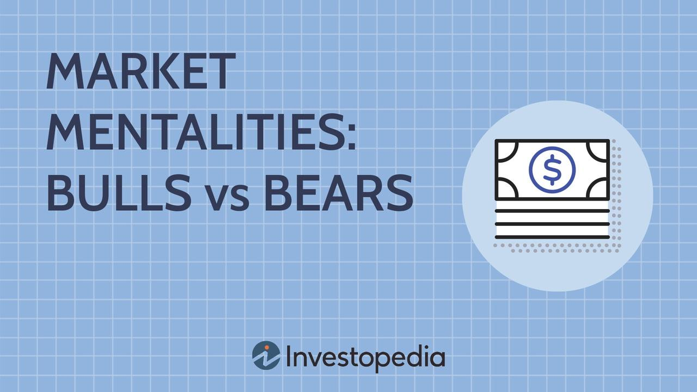

The stock market is known for its volatility and unpredictability, presenting challenges and opportunities for traders and investors aiming to maximize returns. An intriguing occurrence within this intricate financial landscape is the "bear squeeze." This situation arises when short sellers, who have bet against a stock by borrowing and selling it in anticipation of buying it back at a lower price, are compelled to close their positions due to an unexpected surge in stock prices. As these traders rush to buy back shares to mitigate potential losses, the resultant buying pressure can further propel stock prices upward.

This article will explore the bear squeeze phenomenon, highlighting its relevance in the stock market and the role of algorithmic trading. Algorithmic trading, with its ability to process vast amounts of data and execute trades with precision and speed, offers a strategic advantage in navigating these rapid market shifts. Moreover, the discussion will extend to the impact of bear squeezes on "meme stocks," a group of stocks characterized by their popularity on social media platforms, often leading to heightened volatility and speculative trading.



By examining the mechanics and implications of bear squeezes, we aim to provide comprehensive insights into this financial strategy. Additionally, the article will evaluate how traders and investors can harness algorithmic trading to potentially capitalize on bear squeezes, offering a framework for identifying and profiting from these market events effectively.

## Table of Contents

## What Is a Bear Squeeze?

A bear squeeze occurs when short sellers are compelled to close their positions due to a sudden and unexpected rise in stock prices, often resulting in substantial buying pressure. This is primarily because short sellers, who initially borrow shares to sell them at a lower price, are forced to repurchase these shares at an inflated price to cover their positions. The forced buying amplifies the upward momentum of the stock's price, further contributing to its increase.

At the core of a bear squeeze is the shift in the dynamic relationship between market participants. Typically, short sellers act as the predators, aiming to profit from a decrease in stock prices. However, during a bear squeeze, these roles are reversed. The short sellers, now vulnerable, find themselves as prey, driven to cover their losses hastily. This creates a self-reinforcing cycle where increasing stock prices compel more short sellers to close their positions, thus driving prices even higher.

Additionally, bear squeezes contribute significantly to market volatility. The rapid price changes create an environment where investors experience heightened uncertainty, leading to swift decisions and increased trading volume. Such volatility is a double-edged sword: while it can offer profitable opportunities, it also increases the risk of erratic price shifts, which can be detrimental to less agile investors. The interplay of sudden buying pressure and the increased volatility characterizes bear squeezes as pivotal events in financial markets, affecting both short-term trading dynamics and broader market sentiment.

## Understanding the Mechanisms of a Bear Squeeze

Bear squeezes can manifest either through intentional actions by financial authorities or as natural consequences of changing market psychology. These phenomena often arise when there is a sudden and unexpected increase in asset prices, catching bearish traders off guard. In such scenarios, market makers may exploit reduced selling pressure by utilizing their substantial buying power to further push prices upward.

The mechanics of a bear squeeze involve a reversal of roles within the market's dynamics. Typically, bearish traders anticipate a decline in asset prices and position themselves accordingly. However, when a bear squeeze unfolds, these expectations are thwarted, leading to a scramble among traders to cover their shorts before incurring significant losses. This scramble adds upward pressure to prices, potentially exacerbating the squeeze.

While bear squeezes are more commonly observed in currency markets, where rapid shifts in prices are frequent, they are not confined to this domain. Sudden price surges can occur in any asset market, whether stocks, commodities, or derivatives, and these surges can initiate a bear squeeze scenario. The resulting market conditions are characterized by heightened [volatility](/wiki/volatility-trading-strategies) and swift price adjustments that pose substantial challenges for traders.

For traders, navigating the challenges posed by a bear squeeze requires agility and strategic foresight. They must swiftly interpret market signals and adjust their positions accordingly to minimize losses. The rapid price adjustments can lead to significant financial impacts, particularly for those traders who are slow to react. The chart below illustrates a typical sequence of reactions during a bear squeeze, highlighting the roles of various participants:

```python
import matplotlib.pyplot as plt
import numpy as np

# Define data for plotting
time = np.linspace(0, 10, 100)
price_movement = np.sin(time) + time * 0.1
short_sellers_reaction = -np.cos(time) + time * 0.1

# Plot the data
plt.figure(figsize=(10, 6))
plt.plot(time, price_movement, label='Price Movement (Bear Squeeze)', color='blue')
plt.plot(time, short_sellers_reaction, label='Short Sellers Reaction', color='red')
plt.title('Bear Squeeze Dynamics')
plt.xlabel('Time')
plt.ylabel('Market Activity')
plt.legend()
plt.grid(True)
plt.show()
```

The plotted graph visualizes how market prices (blue line) may rise sharply during a bear squeeze while short sellers (red line) strive to adjust by covering their positions, often at elevated prices. Traders must understand these dynamics to manage risks effectively and capitalize on any potential opportunities during a bear squeeze.

## Bear Squeeze vs. Short Squeeze

Though often conflated, bear squeezes and short squeezes have distinct characteristics that differentiate them within the financial market landscape. A short squeeze refers explicitly to a market condition where short sellers, who have bet against a stock by borrowing shares to sell with the aim of repurchasing them at a lower price, are compelled to close their positions due to a sudden and sharp increase in the stock's price. This unexpected price rise forces short sellers to buy back shares to cover their positions, contributing to a further increase in the stock's price due to heightened demand.

In contrast, a bear squeeze encompasses a broader scenario involving all bearish traders, not just those who have taken short positions. Bear squeezes occur when there is an unanticipated reversal in the market trend, which affects traders who hold bearish views on an asset, leading them to adjust their positions across varying spectrums of bearish strategies. This can be prompted by positive news or shifts in market sentiment which reverse the prevailing downtrend, resulting in losses for traders who anticipated continued price declines.

Understanding the nuances between bear squeezes and short squeezes is crucial for developing effective strategies in the financial market. Short squeezes are characterized by the forced closure of short positions, resulting in a feedback loop that accelerates the upward pressure on prices. On the other hand, bear squeezes result from a broader reassessment of bearish market positions, which may arise due to shifts in investor sentiment or unforeseen changes in market fundamentals.

For example, consider a hypothetical scenario where a trader specializing in short selling initiates a position on the expectation of declining prices using the following Python formula for potential profit:

```python
def potential_profit(entry_price, exit_price, num_shares):
    return (entry_price - exit_price) * num_shares

# Example
entry_price = 100.0
exit_price = 90.0
num_shares = 100
print("Potential Profit:", potential_profit(entry_price, exit_price, num_shares))
```

In this example, as the trader expects the price to decrease from \$100 to \$90, buying back the shares at the lower price would traditionally yield a profit. However, if a short squeeze occurs, and the price unexpectedly rises, say to \$110, the equation becomes:

```python
exit_price = 110.0
print("Potential Loss:", potential_profit(entry_price, exit_price, num_shares))
```

The trader now experiences a loss instead of a profit, showcasing the risk inherent in a short squeeze. Meanwhile, should a bear squeeze occur, even traders who are not explicitly short sellers may find themselves adjusting their positions to accommodate the sudden market reversal, highlighting the broader scope of a bear squeeze scenario.

Both bear and short squeezes are driven by psychological and market forces but manifest differently in their impact on market participants. Identifying these conditions and their potential triggers is essential for traders aiming to mitigate risks and seize opportunities in volatile markets.

## Profiting from a Bear Squeeze

Contrarian traders view bear squeezes as lucrative prospects, often capitalizing on the fluctuating dynamics of heavily shorted stocks. By identifying stocks with high short interest ratios, these traders aim to position themselves advantageously when market conditions trigger a bear squeeze. A key advantage in this scenario is the potentially favorable risk-reward ratio. When entering a bullish position during a bear squeeze, the downside risk is relatively mitigated—since the sellers would have already driven the price to a perceived low—while the potential upside remains extensive as price surges can be accelerated by short sellers scrambling to cover their positions.

Consider a scenario involving stock XYZ, which has a high short interest ratio, indicating a large number of shares sold short relative to the available float. If an unexpected catalyst arises—be it a positive earnings report or regulatory approval—that prompts the stock price to rise, short sellers must rush to purchase shares to cover their positions, further inflating the stock's price. This situation generates [momentum](/wiki/momentum) that contrarian traders anticipate and exploit.

Investors riding the wave of a bear squeeze benefit from an upward drift in stock prices without the considerable risk typically associated with short selling. Short sellers, by nature, expose themselves to theoretically unlimited losses since a stock's price can climb indefinitely, unlike long investors whose losses are capped should the stock value fall to zero. For instance, a bearish position with a short sale of 100 shares at $20 each presents a maximum loss of unlimited amount if the price escalates. Conversely, a contrarian trader who purchases at the onset of a bear squeeze benefits from the appreciating stock value, effectively amplifying their returns.

The strategy around bear squeezes thus hinges on entering positions where the crowd sentiment is overly pessimistic, and the slightest nudge towards positivity triggers a spiraling upward price action. Fundamental analysis, market sentiment metrics, and algorithmic models analyzing short interest data become critical tools in identifying these opportunities. As market conditions shift unpredictably, proficient traders equipped with the right strategies and timing can realize substantial gains while managing their risk exposure effectively.

## Algorithmic Trading and Bear Squeezes

Algorithmic trading, characterized by the use of computer-driven processes to execute trades, is particularly well-suited for capitalizing on bear squeezes. Its key advantage lies in its ability to process vast amounts of data rapidly and execute trades with precision at the most favorable moments. This capacity allows traders to identify and exploit bear squeeze opportunities more effectively than traditional trading methods.

Algorithms are designed to analyze various market indicators, including current market conditions, short interest data, trading [volume](/wiki/volume-trading-strategy), and volatility levels. By examining these parameters, algorithms can detect potential bear squeeze scenarios early, thereby providing traders with a competitive edge. For instance, if an algorithm notices an unusual increase in short interest alongside a rise in trading volume, it may flag this as a potential bear squeeze event.

In practical terms, algorithms can be programmed to execute specific trading strategies once a bear squeeze indicator is triggered. Below is a simplified example of how a Python script might be used to detect and respond to a potential bear squeeze:

```python
import numpy as np
import pandas as pd

# Assume df is a DataFrame with columns ['date', 'price', 'short_interest', 'volume']
def detect_bear_squeeze(df):
    df['squeeze_indicator'] = np.where(
        (df['short_interest'] / df['volume'] > threshold) &  # High short interest relative to volume
        (df['price'] > df['price'].rolling(window=5).mean()), # Current price above a moving average
        True,
        False
    )
    return df

def execute_trade(df):
    for index, row in df.iterrows():
        if row['squeeze_indicator']:
            print(f"Bear squeeze detected on {row['date']}. Executing buy trade at price {row['price']}.")

# Example usage
df = pd.DataFrame({
    'date': pd.date_range(start='2023-01-01', periods=10, freq='D'),
    'price': np.random.random(10) * 100,
    'short_interest': np.random.random(10) * 50,
    'volume': np.random.random(10) * 1000
})

threshold = 0.05
df = detect_bear_squeeze(df)
execute_trade(df)
```

This example demonstrates a basic algorithm that identifies potential bear squeezes by examining the ratio of short interest to trading volume and comparing current price levels to their moving averages. When a condition is met, a potential trading opportunity is recognized, and a trade is executed.

Traders using more sophisticated algorithms can dynamically adjust their models based on evolving market data, managing risks and capitalizing on opportunities quickly as conditions change. Such flexibility and responsiveness make [algorithmic trading](/wiki/algorithmic-trading) indispensable when dealing with the volatile and rapid price shifts associated with bear squeezes.

Given these capabilities, algorithmic trading provides a robust framework for traders seeking to exploit bear squeezes, minimizing human error, and enhancing decision-making efficiency in high-stakes financial environments.

## Historical Examples and the Role of Meme Stocks

The GameStop saga represents a defining instance of a bear squeeze, where retail investors collectively influenced the stock market dynamics, significantly affecting the events surrounding the stock's valuation. On January 2021, GameStop's share prices soared dramatically due to concerted buying efforts spearheaded by retail investors communicating and strategizing on social media platforms, particularly Reddit's WallStreetBets subreddit. This online community galvanized a mass movement, encouraging participants to purchase and hold GameStop shares, creating upward pressure on the stock's price.

A crucial aspect that amplified the bear squeeze was the high level of short interest in GameStop shares at the time. Traditional hedge funds had heavily shorted the stock, anticipating a decline in its value. However, the unexpected surge in buying activity forced these short sellers to cover their positions quickly, further propelling the stock price upwards in a feedback loop known as a short squeeze, which encompassed elements of a broader bear squeeze.

Meme stocks like GameStop are characterized by their high volatility and the attention they garner on social media platforms. Such stocks often become focal points for bear squeezes because their price movements can be influenced significantly by sentiment-driven trading rather than fundamental valuations. This phenomenon demonstrates the immense power of collective retail engagement, challenging traditional notions of stock price determination primarily based on company performance and economic indicators.

The GameStop event underscored the evolving dynamics of modern financial markets, where retail investors leveraged digital platforms to exert influence traditionally held by institutional entities. The impact on hedge funds was profound, with several suffering substantial losses due to the unexpected market turn. This case exemplified how meme stocks, fueled by online communities and viral interest, could become epicenters for market phenomena such as bear squeezes, reshaping conventional strategies and risk assessments in trading practices.

## Risks and Considerations in Bear Squeeze Strategies

Bear squeezes, while potentially lucrative, embody significant financial risks that demand careful consideration from investors. The primary risk stems from the high volatility inherent in such scenarios. Volatility, defined as the degree of variation of a trading price series over time, is mathematically expressed using standard deviation or variance formulas:

$$
\sigma = \sqrt{\frac{\sum (X_i - \mu)^2}{N}}
$$

where $\sigma$ represents volatility, $X_i$ indicates each individual stock price, $\mu$ stands for the mean of the stock prices, and $N$ is the number of observations.

Elevated volatility means that stock prices can experience rapid and unpredictable swings, making timing crucial for exiting or entering positions. Investors in bear squeezes must be acutely aware that a swift reversal in market sentiment can quickly erode potential profits or amplify losses. This unpredictable nature posits the necessity for investors to act with caution and strategic foresight.

To mitigate risks associated with bear squeezes, investors are advised to maintain a diversified and thoroughly researched investment portfolio. Diversification, a risk management strategy, involves spreading investments across various financial instruments, industries, or other categories. This approach limits exposure to any single asset or risk, thereby reducing the potential impact of any one failing asset. Achieving diversification does not necessitate complexity:

```python
# Simple Python code for portfolio diversification
import numpy as np

# Example stock returns
stock_returns = np.array([0.08, 0.12, -0.02, 0.03, 0.10])

# Calculate mean return
mean_return = np.mean(stock_returns)

# Calculate standard deviation for a balanced and diversified portfolio
std_deviation = np.std(stock_returns)

print(f"Mean Return: {mean_return}, Portfolio Risk: {std_deviation}")
```

In addition to diversification, conducting thorough research on potential investments and market conditions can enhance decision-making and reduce speculative risks. Understanding the financial health of companies, prevailing economic conditions, and technical analysis can guide investors in making informed choices when approaching bear squeeze scenarios. Therefore, while bear squeezes offer enticing prospects for profit, exercising due diligence, fostering market awareness, and employing strategic diversification are essential for managing risks and achieving long-term financial stability.

## Conclusion

Bear squeezes present unique opportunities in the stock market, demanding a comprehensive understanding of market dynamics and speculative behaviors. The rapid escalation of prices inherent in bear squeezes can create lucrative opportunities for savvy investors. However, the intricate nature of these market phenomena necessitates a strategic approach, grounded in both market acumen and the ability to anticipate shifts in market sentiment.

Leveraging algorithmic trading can significantly enhance the capacity to predict and act upon these situations with precision. Algorithms, by design, can process vast amounts of data quickly, identifying patterns and potential squeeze conditions with a speed unattainable by human traders alone. This technological advantage allows traders to enter and [exit](/wiki/exit-strategy) positions at optimal times, mitigating risk and maximizing returns. An effective algorithmic trading strategy considers market conditions, analyzes short interest data, and incorporates indicators that signal potential bear squeeze scenarios.

Despite the potential for significant gains, the unpredictable nature of bear squeezes requires cautious investment strategies. Markets can reverse rapidly, and without a diversified investment portfolio, traders may find themselves vulnerable to losses. Prudent investment necessitates a balance between seizing short-term profit opportunities and maintaining resilience against market volatility. Diversification across various asset classes and maintaining a well-researched trading plan can help protect against the inherent risks of speculative trading strategies.

In conclusion, while bear squeezes offer distinct opportunities for rapid financial gains, success in these ventures depends heavily on informed decision-making and strategic foresight. The integration of algorithmic trading into these strategies serves as a powerful tool for navigating the complex and often turbulent waters of the stock market. Ultimately, maintaining a diversified portfolio and employing risk management principles are essential for achieving sustained success in trading.

## References & Further Reading

[1]: Lopez de Prado, M. (2018). ["Advances in Financial Machine Learning."](https://www.amazon.com/Advances-Financial-Machine-Learning-Marcos/dp/1119482089) Wiley.

[2]: Aronson, D. R. (2006). ["Evidence-Based Technical Analysis: Applying the Scientific Method and Statistical Inference to Trading Signals."](https://www.amazon.com/Evidence-Based-Technical-Analysis-Scientific-Statistical/dp/0470008741) Wiley.

[3]: Jansen, S. (2020). ["Machine Learning for Algorithmic Trading."](https://github.com/stefan-jansen/machine-learning-for-trading) Packt Publishing.

[4]: Chan, E. P. (2008). ["Quantitative Trading: How to Build Your Own Algorithmic Trading Business."](https://github.com/ftvision/quant_trading_echan_book) Wiley.