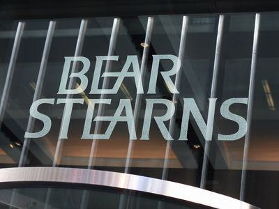

The 2008 financial crisis marked a pivotal moment in global economic history, leading to widespread economic turmoil and reshaping the financial landscape. Among the early and most notable casualties of this crisis was Bear Stearns, a leading investment bank that epitomized the vulnerabilities within the financial system. Bear Stearns' collapse not only signified the frailty of financial institutions during times of economic stress but also highlighted the systemic risks posed by the interconnectedness of global financial markets.

This article examines the chronological events leading to Bear Stearns' downfall and its subsequent acquisition by JPMorgan Chase. The significance of this acquisition cannot be understated, as it represented a critical intervention by the Federal Reserve and marked a turning point during the financial crisis. Understanding the factors that led to Bear Stearns' collapse provides valuable insights into the dynamics of financial markets and the importance of effective risk management practices.

Furthermore, the article investigates into the role of algorithmic trading and risk management, which have become integral components of modern financial operations. Algorithmic trading, characterized by high-frequency transactions and complex algorithms, contributed to the rapid market fluctuations during the crisis, underscoring the need for robust oversight mechanisms to manage associated risks. The lack of transparency in these trading practices revealed vulnerabilities that exacerbated the crisis, prompting regulators to reassess the regulatory frameworks governing the financial industry.

The lessons learned from the Bear Stearns episode remain pertinent today. They underscore the necessity for financial institutions to adopt sound risk management strategies and for regulators to ensure adequate oversight to prevent the recurrence of similar crises. As financial systems continue to evolve, the insights gained from Bear Stearns' experience serve as a cautionary tale and guide the development of more resilient and sustainable financial markets.

## Table of Contents

## The Rise and Fall of Bear Stearns

Bear Stearns, founded in 1923, began as a small trading company in New York City. Over the ensuing decades, it experienced substantial growth, evolving into one of the most prominent investment banks in the United States. By the early 21st century, Bear Stearns had established itself as the fifth-largest investment bank in the nation, noted for its aggressive and entrepreneurial culture. This firm's success was significantly bolstered by its strategic involvement in the mortgage-backed securities market during the housing boom of the early 2000s. Mortgage-backed securities (MBS), which are financial products secured by a collection of mortgages, became highly lucrative, driving profits for Bear Stearns and many other financial institutions.

However, this aggressive participation in the mortgage-backed securities market eventually exposed Bear Stearns to significant risks. As the U.S. housing bubble began deflating in 2007, the subprime mortgage crisis unfolded. Subprime mortgages, which are loans offered to borrowers with poor credit histories, were particularly vulnerable to default in a declining housing market. Bear Stearns held substantial amounts of these high-risk investments, making it susceptible to severe financial losses as default rates on subprime loans soared. The firm's exposure to these toxic assets meant that losses quickly accumulated, significantly weakening its financial position.

Bear Stearns' business model further compounded its vulnerabilities during this period. The firm heavily relied on short-term borrowing to finance its long-term investments. This practice, often referred to as leveraging, can amplify profits during stable market conditions but also exacerbates losses when markets turn volatile. The firm's dependence on short-term funding sources, such as repurchase agreements, meant that it needed continuous access to capital markets to refinance its obligations. During the crisis, as confidence in Bear Stearns waned, lenders became increasingly hesitant to extend credit, creating a [liquidity](/wiki/liquidity-risk-premium) crunch that the firm struggled to manage.

Ultimately, the convergence of significant losses in the mortgage markets and the inability to secure necessary financing led to Bear Stearns' downfall in March 2008. The rapid deterioration in the firm's financial health underscored the inherent risks of excessive leveraging and inadequate risk assessment strategies in volatile economic environments.

## JPMorgan Chase Acquires Bear Stearns

In March 2008, Bear Stearns experienced rapid deterioration in its liquidity position, leading to a crisis that demanded immediate attention. The company's excessive exposure to mortgage-backed securities and reliance on short-term funding made it particularly susceptible to the ongoing market [volatility](/wiki/volatility-trading-strategies). As panic spread and clients withdrew investments, Bear Stearns faced an imminent collapse. 

JPMorgan Chase, with the backing of the Federal Reserve, stepped in to acquire Bear Stearns. The initial offer stood at $2 per share, a valuation reflecting the severe distress the investment bank was under. This emergency measure was part of the Federal Reserve's intervention to stabilize the financial system and prevent a cascading effect of failures in the banking sector. 

The acquisition was executed under unusual circumstances, with extraordinary support from the Federal Reserve, which provided a $30 billion guarantee against potential losses from Bear Stearns' assets. The support of the Fed highlighted the vulnerabilities within the financial system and underscored the need for decisive action to prevent a more profound economic crisis. 

Amid criticism from shareholders and growing public scrutiny, JPMorgan Chase revised the acquisition price to $10 per share. This adjustment alleviated some concerns regarding the fairness of the purchase price and placated investors who felt the initial offer undervalued their holdings. The increase reflected an attempt to reconcile the deal's necessity with shareholder interests.

The acquisition of Bear Stearns by JPMorgan Chase marked a pivotal moment in the 2008 financial crisis, underscoring a trend towards consolidation within the banking industry. Larger financial institutions absorbed smaller, distressed ones, an evolution driven by both market forces and regulatory interventions aimed at preserving stability. This trend signified a shift towards fewer but larger financial entities, reshaping the landscape of the global banking sector.

## Role of Algorithmic Trading

Algorithmic trading, which gained prominence during the early 2000s, played a significant part in the dynamics of the 2008 financial crisis by impacting speed and volatility in market changes. This form of trading involves using algorithms to execute orders at speeds far exceeding human capacity, with a significant portion comprising high-frequency trading ([HFT](/wiki/high-frequency-trading-strategies)). During the period leading up to and through the financial crisis, HFT was responsible for an increasing [volume](/wiki/volume-trading-strategy) of daily transactions, sometimes accounting for upwards of 60-70% of equity market trades. 

The role of [algorithmic trading](/wiki/algorithmic-trading) was double-edged. On the one hand, it provided liquidity and efficiency to markets, enabling rapid adjustment and price discovery. However, the velocity and volume at which trades were executed also introduced elements of instability and unpredictability. A prime example of this is the 'flash crash' phenomenon, where prices could plummet dramatically in fractions of a second due to algorithm-triggered trades, only to recover just as quickly.

One central issue with algorithmic trading during this period was the lack of transparency and oversight. Often, the complexity and proprietary nature of trading algorithms meant that they operated as 'black boxes,' obscuring their inner workings from regulators and other market participants. This opacity contributed to a systemic risk environment where unintended interactions among algorithms could amplify disruptions. 

For example, algorithms programmed with similar trigger points or trading signals could act simultaneously in response to market conditions, leading to rapid escalation of trading volumes and price swings without any corresponding changes in fundamental market data. The feedback loop created by such trading activities intensified market volatility and contributed to the overall impact of the financial crisis.

Recognizing these risks, subsequent regulatory frameworks aimed to mitigate the adverse effects of algorithmic trading. These regulations focused on increasing transparency, enhancing risk management practices, and refining technology controls. Initiatives like the Dodd-Frank Wall Street Reform and Consumer Protection Act and the European Markets in Financial Instruments Directive (MiFID II) incorporated new provisions to address high-frequency trading and sought to bolster the resilience of financial markets. 

Additionally, measures such as circuit breakers, which temporarily halt trading during extreme situations, were introduced to prevent disorderly markets. These interventions reflect ongoing efforts to safeguard financial systems by balancing the efficiency benefits of algorithmic trading against its potential risks. 

Ultimately, while algorithmic trading continues to be a dominant force in modern financial markets, the lessons learned from its role in the 2008 financial crisis underscore the need for a vigilant and adaptive regulatory approach.

## Lessons from the Bear Stearns Collapse

The collapse of Bear Stearns in 2008 highlighted several critical lessons for the financial industry, particularly focusing on risk management, transparency, regulatory oversight, and prudent financial practices.

Effective risk management emerged as a core necessity, as Bear Stearns' downfall was largely attributed to its over-leveraging and failure to accurately assess the risks associated with its investments, particularly in mortgage-backed securities. Over-leveraging describes the situation where a firm uses borrowed funds to increase its potential return on investment, yet this approach can become perilous if market conditions shift unexpectedly. In the case of Bear Stearns, its excessive leverage ratio exacerbated its vulnerability during the housing market downturn.

Transparency and maintaining investor confidence are paramount in the operation of financial markets. During the crisis, opaque financial practices, such as the complex structuring of financial products and insufficient disclosure of financial positions, significantly contributed to market instability and investor panic. A lack of transparency in Bear Stearns' financial dealings eroded trust among investors and counterparties, hastening its liquidity crisis as parties pulled away from engaging in financial transactions with the firm.

The crisis underscored the urgent need for robust regulatory oversight to prevent similar occurrences in the future. The rapid collapse of Bear Stearns revealed gaps in existing regulatory frameworks, which failed to adequately monitor leverage levels and risk exposures within large financial institutions. This inadequacy highlighted the necessity for regulators to implement more stringent measures to ensure financial stability, such as setting capital requirements and conducting regular stress testing of financial institutions' balance sheets.

Finally, the Bear Stearns collapse demonstrated the importance of prudence in financial dealings and the benefits of diversification for sustainable growth. Prudent financial practices involve cautious management of resources, avoiding excessive risk-taking, and maintaining adequate capital reserves. Diversification, or the spreading of investments across various asset classes and geographies, can help mitigate potential losses from adverse market movements. By not concentrating risks, institutions can reduce their exposure to specific market downturns, preserving their financial health.

These lessons continue to guide policymakers and financial institutions today, driving efforts toward building a more resilient and transparent financial system capable of withstanding future shocks.

## Conclusion

The collapse of Bear Stearns marked a significant turning point in the unfolding of the 2008 financial crisis, setting the stage for a series of events that reshaped the global economy. This event underscored the inherent fragility within financial systems, where over-leveraging and inadequate risk management practices can lead to catastrophic outcomes. The rapid demise of Bear Stearns alerted financial institutions and regulators to vulnerabilities in the financial architecture, emphasizing the need for robust risk management and comprehensive oversight.

JPMorgan Chase's acquisition of Bear Stearns, facilitated by the Federal Reserve, was a decisive moment in the crisis narrative. It highlighted the willingness of government institutions to intervene in order to prevent further destabilization of the economy. This acquisition also exemplified the trend of consolidation within the banking sector, which was seen as a strategy to reinforce stability amidst the turbulence of the financial markets.

The lessons garnered from this era have continued relevance, informing current financial policies and strategies. Regulators and institutions have since focused on ensuring transparency, enhancing risk management frameworks, and improving the resilience of financial systems. Policies now place greater emphasis on mitigating systemic risks through more stringent regulations and oversight practices, with the aim of avoiding similar crises in the future.

Understanding past financial mistakes serves as a foundation for building a more resilient financial system. By learning from the collapse of Bear Stearns and the subsequent economic turmoil, policymakers and financial professionals can better prepare for future challenges. Adopting practices that promote sustainability and prudence is critical to fostering a stable economic environment moving forward, ensuring that financial markets can withstand unforeseen shocks and disruptions effectively.

## References & Further Reading

[1]: Bernanke, B. S. (2015). ["The Courage to Act: A Memoir of a Crisis and its Aftermath"](https://archive.org/details/couragetoactmemo0000bern). W. W. Norton & Company.

[2]: Mackintosh, J. (2008). ["The Fall of Bear Stearns and Other Market Mishaps"](https://fcic-static.law.stanford.edu/cdn_media/fcic-reports/fcic_final_report_chapter15.pdf). Financial Times.

[3]: Sorkin, A. R. (2009). ["Too Big to Fail: The Inside Story of How Wall Street and Washington Fought to Save the Financial System—and Themselves"](https://www.amazon.com/Too-Big-Fail-Washington-System/dp/0143118242). Viking.

[4]: Patterson, S. (2010). ["The Quants: How a New Breed of Math Whizzes Conquered Wall Street and Nearly Destroyed It"](https://scottpattersonbooks.com/books/the-quants/). Crown Business.

[5]: Lewis, M. (2015). ["Flash Boys: A Wall Street Revolt"](https://en.wikipedia.org/wiki/Flash_Boys). W. W. Norton & Company.

[6]: Brunnermeier, M. K. (2009). ["Deciphering the Liquidity and Credit Crunch 2007-2008"](https://www.princeton.edu/~markus/research/papers/liquidity_credit_crunch.pdf). Journal of Economic Perspectives, 23(1), 77-100.

[7]: SEC Office of Inspector General (2008). ["SEC's Oversight of Bear Stearns and Related Entities: The Consolidated Supervised Entity Program"](https://www.sec.gov/about/oig/audit/2008/446-b.pdf). 

[8]: Stiglitz, J. E. (2010). ["Freefall: America, Free Markets, and the Sinking of the World Economy"](https://archive.org/details/freefallamericaf0000stig). W. W. Norton & Company.