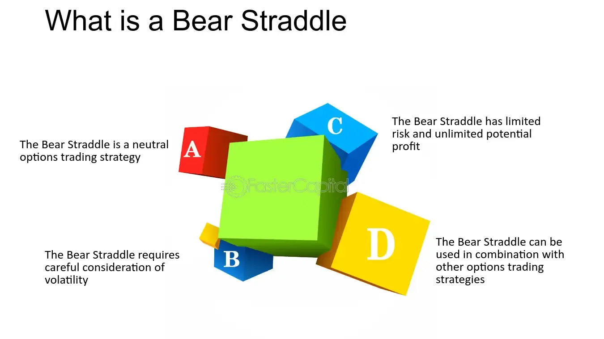

## Table of Contents

## What is a Bear Straddle in financial trading?

A Bear Straddle is a type of options trading strategy used when a trader believes that the price of a stock or other asset will go down. It involves buying a put option and selling a call option at the same strike price and expiration date. The idea is to profit from the expected decline in the asset's price. The put option gives the trader the right to sell the asset at the strike price, which becomes more valuable as the asset's price falls. Meanwhile, the call option, which the trader sold, gives someone else the right to buy the asset at the strike price, and it loses value as the asset's price drops.

This strategy can be risky because the maximum potential loss is unlimited if the asset's price rises significantly. The trader is exposed to potential losses on the call option they sold, as they would have to buy the asset at a higher market price to fulfill the obligation to sell it at the strike price. However, if the asset's price does indeed fall as expected, the trader can make a profit from the increasing value of the put option, offsetting the loss from the call option. It's important for traders to carefully consider their risk tolerance and market predictions before using a Bear Straddle.

## How does a Bear Straddle differ from a regular straddle?

A Bear Straddle and a regular straddle are both options trading strategies, but they are used in different situations. A regular straddle involves buying both a call option and a put option at the same strike price and expiration date. This strategy is used when a trader expects a big move in the stock price but isn't sure which direction it will go. The trader profits if the stock price moves a lot in either direction, because one of the options will gain value while the other loses value, but the gain can be more than the loss.

On the other hand, a Bear Straddle is used when a trader believes the stock price will go down. Instead of buying both options, the trader buys a put option and sells a call option at the same strike price and expiration date. The put option gains value as the stock price falls, which is what the trader wants. However, selling the call option means the trader could lose money if the stock price goes up a lot, because they would have to buy the stock at a higher price to sell it at the strike price. So, a Bear Straddle is riskier but can be profitable if the stock price drops as expected.

## What are the key components of a Bear Straddle?

A Bear Straddle is made up of two main parts: buying a put option and selling a call option. Both options have the same strike price and expiration date. The put option gives the trader the right to sell the stock at the strike price. This becomes more valuable if the stock price goes down, which is what the trader hopes will happen. The call option, which the trader sells, gives someone else the right to buy the stock at the strike price. If the stock price stays the same or goes down, this call option loses value, which is good for the trader because they sold it.

However, there is a risk with the Bear Straddle. If the stock price goes up a lot, the trader could lose money on the call option they sold. They would have to buy the stock at the higher market price to sell it at the strike price, which could be expensive. So, while the Bear Straddle can make money if the stock price falls, it can also lead to big losses if the stock price rises. It's important for traders to think carefully about this risk before using a Bear Straddle.

## In what market conditions is a Bear Straddle most effective?

A Bear Straddle works best when you think the price of a stock will go down. If you believe the stock is going to drop, buying a put option and selling a call option at the same price can help you make money. The put option will become more valuable as the stock price falls, which is what you want. At the same time, the call option you sold will lose value, which is good because you sold it.

However, this strategy can be risky if the stock price goes up instead. If the stock price rises a lot, you could lose a lot of money on the call option you sold. You would have to buy the stock at the higher price to sell it at the strike price, which could be expensive. So, a Bear Straddle is most effective when you are sure the stock price will go down and you are willing to take the risk that it might go up instead.

## How do you set up a Bear Straddle?

To set up a Bear Straddle, you need to do two things. First, you buy a put option. This gives you the right to sell the stock at a certain price, called the strike price. You want to buy this put option because you think the stock price will go down. Second, you sell a call option at the same strike price and expiration date as the put option. Selling the call option means someone else can buy the stock from you at the strike price if they want to. You do this because you don't think the stock price will go up.

When you set up a Bear Straddle, you need to be careful. If the stock price goes down like you expect, the put option you bought will become more valuable, and you can make money. The call option you sold will lose value, which is good for you because you sold it. But if the stock price goes up a lot, you could lose money. You would have to buy the stock at the higher price to sell it at the strike price, which could be expensive. So, make sure you understand the risks before you set up a Bear Straddle.

## What are the potential risks and rewards associated with a Bear Straddle?

A Bear Straddle can be a good way to make money if you think a stock's price will go down. When you set it up, you buy a put option and sell a call option at the same price. If the stock price drops, the put option you bought will become more valuable, and you can make money from it. At the same time, the call option you sold will lose value, which is good for you because you sold it. So, if the stock price goes down like you expect, you can make a profit.

However, there are risks with a Bear Straddle. If the stock price goes up a lot instead of down, you could lose a lot of money. This is because you sold the call option, and if the stock price rises, you might have to buy the stock at the higher price to sell it at the strike price. This could be expensive and lead to big losses. So, while a Bear Straddle can be rewarding if the stock price falls, it can also be risky if the stock price goes up.

## Can you explain the mechanics of a Bear Straddle with an example?

Let's say you think the price of XYZ stock, which is currently trading at $50, is going to go down. You decide to set up a Bear Straddle. To do this, you buy a put option with a strike price of $50 and an expiration date one month from now. This put option costs you $2. At the same time, you sell a call option with the same strike price of $50 and the same expiration date. Someone pays you $1 for this call option. So, your net cost to set up the Bear Straddle is $1 ($2 for the put option minus $1 from selling the call option).

Now, let's see what happens if the stock price goes down to $40 by the expiration date. The put option you bought becomes more valuable because you can sell the stock at $50 even though it's only worth $40 in the market. The put option's value goes up to $10 ($50 strike price minus $40 stock price). You can sell the put option for a profit of $8 ($10 value minus the $2 you paid for it). Meanwhile, the call option you sold is now worthless because no one would want to buy the stock at $50 when it's only worth $40. So, you keep the $1 you got from selling the call option. Your total profit from the Bear Straddle is $9 ($8 from the put option plus $1 from the call option, minus the $1 net cost to set it up).

But what if the stock price goes up to $60 instead? The put option you bought is now worthless because you wouldn't want to sell the stock at $50 when it's worth $60. You lose the $2 you paid for it. The call option you sold is now worth $10 ($60 stock price minus $50 strike price). The person who bought the call option from you can now make you buy the stock at $60 to sell it to them at $50. This means you lose $9 on the call option ($10 value minus the $1 you got for selling it). Your total loss from the Bear Straddle is $10 ($2 lost on the put option plus $9 lost on the call option, minus the $1 you got for setting it up).

## How does the pricing of options affect the strategy of a Bear Straddle?

The pricing of options is really important when you're thinking about using a Bear Straddle. The cost of the put option you buy and the money you get from selling the call option can change how much you might make or lose. If the put option is expensive, it will cost you more to set up the Bear Straddle. But if you can sell the call option for a good price, that can help lower your costs. You need to look at things like how much the stock price might move, how long until the options expire, and how much the market expects the stock to move. All these things can change the price of the options and affect whether a Bear Straddle is a good idea for you.

If the options are priced in a way that makes the Bear Straddle cheap to set up, it might be a good strategy if you really think the stock price will go down. But if the options are expensive, you might not want to use a Bear Straddle because it could be too risky. You have to think about how much you could lose if the stock price goes up instead of down. So, the prices of the options are a big part of deciding if a Bear Straddle is the right move for you.

## What are the tax implications of profits from a Bear Straddle?

When you make money from a Bear Straddle, you need to think about taxes. The profits you make from options trading are usually considered capital gains. If you hold the options for less than a year before selling, the gains are short-term capital gains. These are taxed at the same rate as your regular income, which can be higher. If you hold the options for more than a year, the gains are long-term capital gains, which are taxed at a lower rate, usually between 0% and 20% depending on your income.

It's important to keep good records of when you buy and sell your options, as well as how much you make or lose. This helps you figure out your taxes correctly. Also, if you do a lot of options trading, you might need to fill out extra tax forms. It's a good idea to talk to a tax professional to make sure you're doing everything right and taking advantage of any tax breaks you can.

## How can one manage and adjust a Bear Straddle as market conditions change?

Managing a Bear Straddle means you need to keep an eye on the stock price and be ready to make changes as the market moves. If the stock price starts to go up instead of down like you thought, you might want to buy back the call option you sold to stop any more losses. This will cost you money, but it can help you avoid bigger losses if the stock keeps going up. You could also sell the put option you bought if it has gone up in value, to lock in some profit or at least get some of your money back.

Another way to adjust a Bear Straddle is to roll it over. This means you close out your current options and open new ones with a later expiration date. If you still think the stock price will go down but it hasn't happened yet, rolling over can give you more time for your prediction to come true. You might choose a different strike price for the new options, depending on where the stock price is now. Managing a Bear Straddle takes careful watching and quick decisions to make sure you're not losing too much money if things don't go as planned.

## What advanced techniques can be used to enhance the effectiveness of a Bear Straddle?

One advanced technique to enhance the effectiveness of a Bear Straddle is to use delta hedging. Delta is a measure of how much the price of an option changes when the stock price changes. By buying or selling shares of the stock, you can balance out the delta of your options. This can help reduce the risk if the stock price moves in a way you didn't expect. For example, if the stock price starts to go up, you can sell some shares to offset the losses from the call option you sold. This way, you can keep your Bear Straddle more stable and protect your profits.

Another technique is to use a Bear Straddle as part of a larger options strategy, like a spread. You could combine your Bear Straddle with other options to create a more complex strategy that can handle different market conditions. For example, you might add a bull put spread to your Bear Straddle. This means you sell a put option at a lower strike price and buy another put option at an even lower strike price. This can help you make money if the stock price stays the same or goes down a little, while still protecting you if the stock price drops a lot. Using these advanced techniques can make your Bear Straddle more flexible and effective, but they also make it more complicated, so you need to be careful and understand what you're doing.

## How do professional traders typically integrate Bear Straddles into their broader trading strategies?

Professional traders often use Bear Straddles as part of a bigger plan to make money when they think a stock's price will go down. They might use Bear Straddles along with other options strategies to cover different possibilities. For example, they might use a Bear Straddle when they're pretty sure the stock will drop, but they might also use other strategies like buying puts or selling calls to make money if the stock stays the same or goes down a little. This way, they can make money no matter what happens to the stock price, as long as it doesn't go up too much.

Another way professional traders use Bear Straddles is to manage risk. They might use delta hedging to balance out the risk of the Bear Straddle. This means they buy or sell shares of the stock to make sure their overall position doesn't change too much if the stock price moves. They might also roll over their Bear Straddle to a later date if the stock hasn't moved as expected yet. This gives them more time for their prediction to come true. By using Bear Straddles in these ways, professional traders can make their trading strategies more flexible and effective.

## What are the challenges and risks associated with Bear Straddle Strategies?

Bear straddle strategies, while powerful, come with significant risks that traders must carefully manage. One of the primary risks is the potential for unlimited losses. This occurs because a bear straddle involves buying both a call and a put option at the same strike price, anticipating [volatility](/wiki/volatility-trading-strategies) rather than a specific price direction. If the underlying asset price remains stable or moves unpredictably, the trader might incur losses from both options premiums, as neither the call nor the put would become profitable. 

Mathematically, the loss can be represented as:

$$
\text{Loss} = \text{Premium}_{call} + \text{Premium}_{put} - \text{Profit}_{call} - \text{Profit}_{put}
$$

where both $\text{Profit}_{call}$ and $\text{Profit}_{put}$ might be zero if the asset does not exhibit significant price movement. 

Risk management is crucial in mitigating these potential losses. Implementing stop-loss orders can help limit downside risk by automatically closing positions when a predetermined loss threshold is reached. For bear straddles, constants reevaluation of market volatility is essential, as unexpected stability can erode profitability. Analytical tools and algorithmic systems can assist in real-time monitoring and adjusting strategies as market conditions evolve.

A poignant example of risk and mismanagement in options trading is the case of Nick Leeson, the rogue trader whose actions led to the collapse of Barings Bank in 1995. Leeson's unauthorized speculative trading, including strategies similar to bear straddles, was characterized by inadequate oversight and ineffective risk controls. His actions exposed the bank to massive financial risk and highlighted the necessity for rigorous operational risk management frameworks. 

Lessons drawn from such cases underscore the importance of stringent risk management policies in trading, especially with leveraged instruments like options. Balancing potential rewards against risks involves not only prudent strategy formulation but also the disciplined use of financial instruments and technologies to limit exposures to adverse market movements. Continuous education and the adoption of risk management best practices are vital for traders leveraging bear straddle strategies.

## References & Further Reading

[1]: Black, F., & Scholes, M. (1973). ["The Pricing of Options and Corporate Liabilities,"](https://www.cs.princeton.edu/courses/archive/fall09/cos323/papers/black_scholes73.pdf) The Journal of Political Economy, 81(3), 637-654.

[2]: Hull, J. C. (2021). ["Options, Futures, and Other Derivatives,"](https://archive.org/details/john-hull-options-futures-and-other-derivatives-pearson-2021) Pearson Education.

[3]: Lopez de Prado, M. (2018). ["Advances in Financial Machine Learning,"](https://www.amazon.com/Advances-Financial-Machine-Learning-Marcos/dp/1119482089) Wiley.

[4]: Chan, E. (2009). ["Quantitative Trading: How to Build Your Own Algorithmic Trading Business,"](https://github.com/ftvision/quant_trading_echan_book) Wiley.

[5]: Jansen, S. (2020). ["Machine Learning for Algorithmic Trading: Predictive Models to Extract Signals from Market and Alternative Data for Systematic Trading Strategies with Python,"](https://www.amazon.com/Machine-Learning-Algorithmic-Trading-alternative/dp/1839217715) Packt Publishing.

[6]: Aronson, D. R. (2007). ["Evidence-Based Technical Analysis: Applying the Scientific Method and Statistical Inference to Trading Signals,"](https://www.amazon.com/Evidence-Based-Technical-Analysis-Scientific-Statistical/dp/0470008741) Wiley.