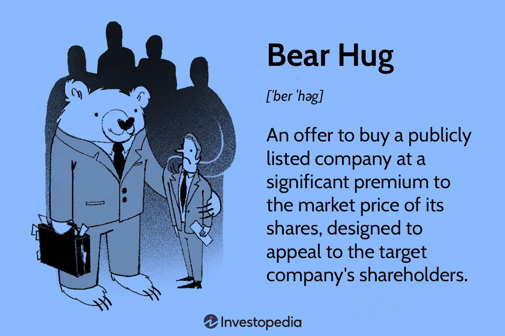

Financial derivatives are instruments whose value is derived from an underlying asset, such as stocks, bonds, commodities, or currencies. Their significance in financial markets lies in their ability to facilitate risk management and speculative activities. Among derivatives, options are a notable class, providing the right, but not the obligation, to buy or sell an asset at a predetermined price before a specified expiration date. Options trading is versatile and includes various strategic approaches tailored to different market conditions and investor expectations.

One such strategy is the bear straddle, designed for bearish market scenarios. A bear straddle involves simultaneously purchasing a put option and a call option with the same strike price and expiration date. The strategy anticipates significant price movements, particularly in a downward direction, thereby exploiting volatility in the market. The bear straddle's effectiveness is contingent on selecting an appropriate strike price, enabling investors to profit from substantial price shifts regardless of the direction.



In recent years, algorithmic trading has revolutionized financial markets through its ability to execute trades at unparalleled speeds with high precision. This form of trading employs computer algorithms to automate trading decisions, analyzing vast amounts of market data to identify optimal trading opportunities. Integrating algorithmic trading with strategies like the bear straddle can enhance execution efficiency and improve profitability by swiftly responding to market fluctuations.

The objective of this article is to explore the bear straddle strategy within the context of algorithmic trading. We aim to dissect the interaction between these two elements, examining how algorithmic trading can optimize bear straddle implementations to navigate complex and volatile market landscapes effectively.

## Table of Contents

## Understanding Financial Derivatives and Options

Financial derivatives are complex financial instruments that derive their value from an underlying asset, index, or rate. They are utilized extensively for risk management and speculation, offering the advantage of leveraging positions without the need to invest directly in the underlying asset. Common types of derivatives include futures, forwards, swaps, and options. Each serves a specific purpose in the financial markets, aiding investors in hedging risks or enhancing potential returns through speculation.

Options trading is a critical component of the derivatives market. An option is a contract that gives the holder the right, but not the obligation, to buy or sell an underlying asset at a predetermined price, known as the strike price, before a specified expiration date. There are two primary types of options: call options and put options. A call option confers the right to purchase the underlying asset at the strike price within a specific period, whereas a put option grants the right to sell the asset at the strike price within the designated timeframe.

Options strategies can be categorized based on their risk-return profiles, which vary depending on an investor's market outlook and risk tolerance. Some basic options strategies include buying calls or puts, which are straightforward bets on an asset’s price movement. More sophisticated strategies involve combinations of multiple options positions to balance risk and reward.

For instance, a covered call strategy involves holding a long position in an asset while selling a call option on the same asset. This strategy generates additional income through the option premium, although it caps potential upside gains. Conversely, a protective put strategy involves purchasing a put option for an asset already owned, serving as insurance against possible declines in the asset's value. 

Another complex strategy is the straddle, where a trader purchases both a call and put option with the same strike price and expiration date. This strategy is profitable when there is significant move in either direction of the asset's price, reflecting the trader’s anticipation of high [volatility](/wiki/volatility-trading-strategies).

Through these strategies and the inherent flexibility of options, traders can construct diverse portfolios tailored to their financial goals and market predictions. Nonetheless, options trading can be inherently risky, requiring a nuanced understanding of market dynamics and the specific characteristics of each strategy.

## What is a Bear Straddle?

A bear straddle is a financial strategy involving options trading, specifically designed to capitalize on significant price volatility with an overall bearish market outlook. The core structure of a bear straddle involves simultaneously purchasing a put option and a call option on the same underlying asset. Both options are acquired with the same strike price and expiration date.

### Structure of a Bear Straddle

The bear straddle strategy is configured as follows:

1. **Purchase a Call Option**: A call option gives the holder the right, but not the obligation, to buy the underlying asset at the specified strike price before the option expires.

2. **Purchase a Put Option**: Concurrently, a put option is purchased, providing the right to sell the underlying asset at the same strike price within the same time frame.

This combination allows traders to profit from significant movements in the asset's price, regardless of the direction, although with a preference toward a decline.

### Rationale Behind a Bear Straddle

The primary rationale for employing a bear straddle is the anticipation of substantial price volatility. While it allows profits from any significant movement, this strategy leans towards a bearish market scenario. The profits accrue when the asset's price moves far enough from the strike price to offset the premium costs of both options.

Consider a scenario where a trader expects volatility due to an upcoming earnings report or economic data release. By setting up a bear straddle, the trader positions to profit from the expected price shifts while minimizing directional risk.

### Profiting from Price Movements

The success of a bear straddle hinges on two main factors:

1. **Extent of Price Movement**: The strategy becomes profitable when the price shift is substantial enough to cover the combined cost of the put and call option premiums. The larger the swing, the greater the potential profit from the strategy.

2. **Selection of Strike Price**: Choosing the appropriate strike price is crucial. A strike price close to the anticipated price level before a significant market event may enhance the strategy's profitability. The sensitivity to price changes can be expressed through the options' delta, gamma, and vega, which should be carefully considered when setting up the trade.

In Python, calculating potential outcomes based on the selected strike price and expected volatility could be scripted as follows:

```python
def bear_straddle_profit(price_change, call_premium, put_premium):
    if price_change > call_premium + put_premium:
        return price_change - (call_premium + put_premium)
    elif price_change < -(call_premium + put_premium):
        return abs(price_change) - (call_premium + put_premium)
    else:
        return -(call_premium + put_premium)

# Example usage
strike_price = 100
call_premium = 5
put_premium = 5
price_change = 20  # Represents the price movement
profit = bear_straddle_profit(price_change, call_premium, put_premium)
print(f'Potential Profit: {profit}')
```

This strategy is most effective in volatile markets where significant price shifts are expected. Choosing the appropriate strike price and timing can dramatically influence the success of a bear straddle, making it a sophisticated tool in the options trader's arsenal.

## Algorithmic Trading and Bear Straddle

Algorithmic trading represents a significant shift in how financial markets operate, enabling traders to execute orders with extraordinary speed and precision. Algorithmic trading involves the use of computer programs and advanced mathematical models to make high-speed decisions regarding buying and selling securities. The primary benefits of [algorithmic trading](/wiki/algorithmic-trading) include speed, accuracy, and efficiency, making it a valuable tool in modern finance.

**Speed and Efficiency**: Algorithms execute orders in milliseconds, allowing traders to take advantage of fleeting opportunities that human traders might miss. This speed is crucial in volatile markets where prices can change rapidly and where the ability to respond instantaneously can mean the difference between profit and loss.

**Accuracy and Reduction of Human Error**: Algorithmic trading minimizes the need for human intervention, reducing the risk of mistakes associated with manual trading. This precision is particularly beneficial when executing complex strategies like a bear straddle, which involves simultaneous transactions of buying put options and call options.

**Enhancing Bear Straddle Execution**: A bear straddle strategy profits from market volatility by simultaneously buying a call and a put option with the same strike price and expiration date, with a bearish market outlook. Algorithmic trading can enhance this strategy by efficiently monitoring the market for volatility indicators and executing the straddle at the most opportune moment. This capability allows traders to capture price movements more effectively, maximizing potential returns. 

For instance, an algorithm can be programmed to trigger a bear straddle when the implied volatility of the options crosses a predefined threshold. The algorithm can continuously track factors like historical volatility, bid-ask spreads, and market depth, executing trades only when specific conditions are met.

**Technological Requirements**: Implementing algorithmic trading strategies, including the bear straddle, requires several technological components. First, a reliable data feed is crucial. This feed provides real-time market data that the algorithm uses to make informed decisions. Second, a robust trading platform and execution system are necessary to send orders to the market. Latency—the delay between data generation and order execution—should be minimized to ensure timely trades. 

Programmers often utilize languages such as Python for building trading algorithms due to its extensive libraries and ease of use. Here is a simple Python code snippet illustrating the setup for a bear straddle strategy using a hypothetical algorithmic trading framework:

```python
import trading_algo_framework as taf

def bear_straddle_strategy(symbol, strike, expiry):
    taf.set_instrument(symbol)

    put_option = taf.create_option('PUT', strike, expiry)
    call_option = taf.create_option('CALL', strike, expiry)

    taf.buy(put_option, quantity=1)
    taf.buy(call_option, quantity=1)

market_data = taf.get_market_data('AAPL')

if taf.current_volatility(market_data) > predefined_threshold:
    bear_straddle_strategy('AAPL', 150, '2023-12-21')
```

Moreover, a sophisticated risk management system is essential to manage potential risks such as excessive market exposure. This system oversees trading activities to ensure adherence to predefined risk parameters, safeguarding capital and optimizing the risk-return profile.

In summary, algorithmic trading substantially improves the execution of complex strategies like the bear straddle by leveraging computational power to navigate the intricacies of financial markets with speed and precision.

## When to Use a Bear Straddle Strategy

A bear straddle strategy is particularly advantageous in market conditions characterized by high volatility. This strategy involves simultaneously buying a put option and a call option at the same strike price with the same expiration date. The underlying assumption of the bear straddle is that significant market movement is anticipated, although the direction of the movement is not certain, with a bearish bias indicating a stronger expectation for a downward trend.

### Ideal Market Conditions

The bear straddle is most favorable in environments where high volatility is expected, but the direction of the volatility is uncertain. This could occur during major economic announcements, earnings reports, or geopolitical events that have the potential to create significant market swings. Since the bear straddle benefits from increased price fluctuations, it is critical to assess implied volatility metrics when considering this strategy. High implied volatility can boost option premiums, offering a profitable setup when realized volatility matches or exceeds market expectations.

### Strategic Comparison

Traders may opt for a bear straddle over other strategies when they anticipate extreme market volatility without a clear directional trend. For instance, in contrast to a typical bearish strategy like a put option, a bear straddle does not solely rely on a declining market; instead, it provides flexibility by profiting from any substantial price shift. This dual capability of benefiting from both upward and downward movements, with a bearish inclination, makes it appealing in uncertain market conditions.

### Potential Outcomes

Implementing a bear straddle can lead to diverse outcomes based on market conditions:

1. **High Volatility with Downward Movement**: Here, the put option usually becomes highly valuable, and the call option loses premium. The net gain can be substantial if the drop in the underlying asset exceeds the combined cost of the options.

2. **High Volatility with Upward Movement**: The call option may gain substantial value, offsetting the loss in the put option. However, given the bearish bias, traders might gain less than a solely bullish strategy would yield.

3. **Low Volatility**: In stagnant market conditions, neither option may gain significant value, leading to losses equivalent to the premiums paid. This underscores the necessity for precise volatility forecasting and risk assessment.

In quantitative terms, the maximum loss in a bear straddle is limited to the total premiums paid for the options, $C_p + C_c$, where $C_p$ and $C_c$ are the premiums for the put and call options, respectively. The profit potential, however, is theoretically unlimited in the event of a significant market move.

Careful consideration and comparative analysis against other strategies are crucial for effective bear straddle implementation. Risk management techniques, such as stop-loss orders and hedging, are essential to mitigate the possibility of substantial losses, particularly in unexpectedly stable markets.

## Challenges and Risks of Bear Straddle Strategies

Bear straddle strategies, while powerful, come with significant risks that traders must carefully manage. One of the primary risks is the potential for unlimited losses. This occurs because a bear straddle involves buying both a call and a put option at the same strike price, anticipating volatility rather than a specific price direction. If the underlying asset price remains stable or moves unpredictably, the trader might incur losses from both options premiums, as neither the call nor the put would become profitable. 

Mathematically, the loss can be represented as:

$$
\text{Loss} = \text{Premium}_{call} + \text{Premium}_{put} - \text{Profit}_{call} - \text{Profit}_{put}
$$

where both $\text{Profit}_{call}$ and $\text{Profit}_{put}$ might be zero if the asset does not exhibit significant price movement. 

Risk management is crucial in mitigating these potential losses. Implementing stop-loss orders can help limit downside risk by automatically closing positions when a predetermined loss threshold is reached. For bear straddles, constants reevaluation of market volatility is essential, as unexpected stability can erode profitability. Analytical tools and algorithmic systems can assist in real-time monitoring and adjusting strategies as market conditions evolve.

A poignant example of risk and mismanagement in options trading is the case of Nick Leeson, the rogue trader whose actions led to the collapse of Barings Bank in 1995. Leeson's unauthorized speculative trading, including strategies similar to bear straddles, was characterized by inadequate oversight and ineffective risk controls. His actions exposed the bank to massive financial risk and highlighted the necessity for rigorous operational risk management frameworks. 

Lessons drawn from such cases underscore the importance of stringent risk management policies in trading, especially with leveraged instruments like options. Balancing potential rewards against risks involves not only prudent strategy formulation but also the disciplined use of financial instruments and technologies to limit exposures to adverse market movements. Continuous education and the adoption of risk management best practices are vital for traders leveraging bear straddle strategies.

## Case Studies and Real-Life Applications

### Case Studies and Real-Life Applications

The application of bear straddle strategies in real-world trading can yield varied outcomes depending on market conditions and execution prowess. Here, we explore instances where bear straddles have been both successful and unsuccessful, offering insights for future strategies.

#### Successful Implementation: The Case of ABC Corp

In the volatile market conditions of early 2020, due to global uncertainties, a trader executed a bear straddle strategy on ABC Corp, a company whose stock was notoriously sensitive to market news. During this period, ABC Corp was expected to release key financial information, which historically led to significant stock price movements.

**Market Conditions:** The market was characterized by heightened volatility and uncertainty, influenced by macroeconomic events and impending corporate announcements.

**Decisions Made:** The trader purchased both a call and a put option for ABC Corp at the same strike price and expiration. Here’s a simplified view of the setup:

```python
# Parameters for the strategy
strike_price = 150  # hypothetical strike price
premium_call = 10   # premium paid for the call option
premium_put = 12    # premium paid for the put option
```

**Outcome:** Following the financial disclosure, ABC Corp's stock experienced sharp price movements. The price dropped, allowing the put option to become profitable, significantly outweighing the losses from the call option, leading to a net gain for the trader.

**Lessons Learned:** This case highlights the importance of exploiting expected volatility. A thorough understanding of market catalysts such as earnings announcements and macroeconomic indicators can create favorable conditions for executing a bear straddle successfully.

#### Unsuccessful Execution: XYZ Market Scenario

Not all bear straddle applications lead to success. Consider a scenario involving XYZ Corp, where a trader bet on anticipated volatility due to geopolitical tensions that ultimately failed to materialize.

**Market Conditions:** The trader expected increased market volatility, influenced by geopolitical concerns. However, markets remained stable, and the predicted price swings did not occur.

**Decisions Made:** Similar to the previous example, options were purchased with the same strike price and expiration. However, the underlying security's price remained within a tight range, leading to a loss on both options’ premiums.

**Outcome:** Both options expired worthless, and the trader incurred a total loss equivalent to the sum of the premiums paid for the options.

**Lessons Learned:** This scenario underscores the danger of relying solely on anticipated market events without adequate confirmation. It highlights the critical role of vigilance and adaptive strategies, emphasizing the need for incorporating dynamic market indicators and timely adjustments to positions.

#### Implications for Future Trading

Analyzing these cases emphasizes several crucial takeaways for traders considering bear straddles:

1. **Market Conditions:** Successful bear straddle implementation is highly contingent upon market volatility. Understanding the factors leading to volatility can significantly enhance the probability of success.

2. **Timing and Execution:** The timing of option execution relative to market events is critical. Traders must stay informed and prepared to act swiftly in response to market signals.

3. **Risk Management:** Implementing robust risk management strategies, such as stop-loss orders, can mitigate potential losses when market conditions remain on an unanticipated course.

These examples illuminate the dual potential of bear straddles as both lucrative opportunities and substantial risks, depending on the trader's predictive accuracy and market responsiveness. Consequently, continuous learning and adaptability, coupled with algorithmic systems, can enhance strategy execution, providing an edge in managing these inherent uncertainties.

## Conclusion

In summarizing the key elements of the discussion, it is clear that the bear straddle strategy is a nuanced approach to options trading that emphasizes potential profit from volatility in market conditions, particularly when there is a bearish outlook. The integration of algorithmic trading amplifies the effectiveness of bear straddle strategies by leveraging computational precision, speed, and data analysis capabilities to execute trades efficiently and react to market shifts instantaneously. The synergy created by combining algorithmic systems with such strategic options allows traders to navigate complex and fast-moving financial landscapes with enhanced confidence and reduced human error.

Moreover, continuous learning and adaptation are paramount in options trading. Given the ever-evolving market environments and the development of newer technologies and techniques, traders must stay informed and adept at revising strategies in response to real-time data and forecasts. This dynamic approach not only mitigates risks inherent in static trading models but also maximizes the opportunities presented by varying market conditions. Thus, cultivating a mix of strategic-thinking and technological adoption is essential for sustained success in options trading, particularly when employing advanced strategies such as bear straddles.

## FAQs

### FAQs

**What are the optimal market conditions for employing bear straddle strategies?**

Bear straddle strategies are best suited for environments characterized by high volatility with a bearish market outlook. Such conditions occur when investors anticipate significant price movements but are uncertain about the direction. The anticipation of market shocks, like economic announcements, geopolitical tensions, or sudden financial crises, can provide fertile ground for a bear straddle, as these factors often lead to increased market volatility.

**How important is risk management when using bear straddle strategies?**

Risk management is crucial when implementing bear straddle strategies due to the potential for unlimited losses. Unlike some other options strategies where losses are capped, a poorly executed bear straddle can result in substantial financial downside if the underlying asset's price doesn't move significantly enough to cover the cost of the options. Utilizing stop-loss orders and setting predefined limits on loss tolerance can help mitigate these risks. Additionally, monitoring implied volatility levels and adjusting positions as necessary is vital. 

**Can algorithmic trading systems effectively integrate bear straddle strategies?**

Yes, algorithmic trading systems can significantly enhance the execution of bear straddle strategies by improving speed, accuracy, and decision-making efficiency. Algorithms can rapidly process vast amounts of market data, identify optimal entry and [exit](/wiki/exit-strategy) points, and execute trades more swiftly than manual trading. Such systems can be programmed to constantly monitor market conditions and adjust positions in real-time, optimizing the strategy's performance based on pre-defined criteria like changes in volatility or shifts in market sentiment. Python libraries such as `pandas`, `NumPy`, and trading-specific libraries like `ccxt` or `[backtrader](/wiki/backtrader)` can facilitate developing and [backtesting](/wiki/backtesting) these algorithmic trading strategies.

**What is the long-term viability of bear straddle strategies in an evolving market?**

The long-term viability of bear straddles is contingent upon continuously adapting to emerging market trends and adjusting strategies accordingly. As financial markets and technology evolve, traders need to keep abreast of changes in market dynamics, regulatory frameworks, and technological advancements. While the fundamental principles behind a bear straddle remain the same, incorporating advanced analytics, [machine learning](/wiki/machine-learning), and high-frequency trading techniques will be crucial. Furthermore, a focus on continuous education and adaptation to new tools and market environments will sustain the relevancy of bear straddles as a viable strategy in the future.

## References & Further Reading

[1]: Black, F., & Scholes, M. (1973). ["The Pricing of Options and Corporate Liabilities,"](https://www.cs.princeton.edu/courses/archive/fall09/cos323/papers/black_scholes73.pdf) The Journal of Political Economy, 81(3), 637-654.

[2]: Hull, J. C. (2021). ["Options, Futures, and Other Derivatives,"](https://archive.org/details/john-hull-options-futures-and-other-derivatives-pearson-2021) Pearson Education.

[3]: Lopez de Prado, M. (2018). ["Advances in Financial Machine Learning,"](https://www.amazon.com/Advances-Financial-Machine-Learning-Marcos/dp/1119482089) Wiley.

[4]: Chan, E. (2009). ["Quantitative Trading: How to Build Your Own Algorithmic Trading Business,"](https://github.com/ftvision/quant_trading_echan_book) Wiley.

[5]: Jansen, S. (2020). ["Machine Learning for Algorithmic Trading: Predictive Models to Extract Signals from Market and Alternative Data for Systematic Trading Strategies with Python,"](https://www.amazon.com/Machine-Learning-Algorithmic-Trading-alternative/dp/1839217715) Packt Publishing.

[6]: Aronson, D. R. (2007). ["Evidence-Based Technical Analysis: Applying the Scientific Method and Statistical Inference to Trading Signals,"](https://www.amazon.com/Evidence-Based-Technical-Analysis-Scientific-Statistical/dp/0470008741) Wiley.