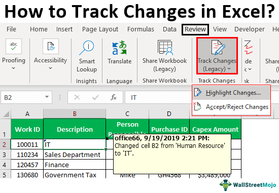

In the competitive world of trading and investing, understanding key concepts and terminology is essential for making informed decisions. This article highlights some intriguing terms that connect nautical strategy, financial markets, and algorithmic trading, offering valuable insights into market dynamics. For instance, the concept of a 'bear tack' draws parallels with the maneuvering strategies employed by sailors navigating challenging waters, providing a unique perspective on handling market downturns. By examining these analogies, traders and investors can gain a clearer understanding of market movements and potential strategies to navigate them.

Exploring such concepts can enhance an investor's ability to anticipate and respond to market fluctuations, akin to how a skilled sailor reacts to shifts in wind and sea conditions. This approach not only reinforces strategic planning but also embodies the importance of adaptability and foresight in achieving investment goals. Join us to explore how integrating nautical terms into your trading strategy can refine your approach to managing and profiting from the volatile financial markets. By gaining fluency in this terminology, you are better equipped to chart a course through complex investment landscapes.



## Table of Contents

## Understanding 'Bear Tack'

In sailing, 'tacking' is a navigational maneuver used to reach an upwind destination by zigzagging, shifting the bow of the boat through the wind to change directions. This technique allows sailors to make progress directly against the wind, albeit indirectly. The concept has been metaphorically adopted in the financial sector, where 'bear tack' describes a downtrend or negative movement within a stock, sector, or entire market, highlighting a potential downturn.

In the volatile milieu of financial markets, recognizing when a bear tack occurs can be crucial for devising suitable market strategies. Just as a sailor adjusts their sails to maintain course despite adverse winds, investors might have to recalibrate their strategies to navigate through bearish conditions. This recalibration is particularly significant during phases of negative growth where market indicators suggest a persistent decline in economic activity or asset value.

In this context, the bear tack can inform investors about potential downtrends and bearish sentiments gripping the markets, prompting strategic alterations akin to tacking in sailing. A bear tack might signal investors to adopt more defensive financial positions or reconsider asset allocations to minimize exposure to falling prices.

Understanding and identifying bear tacks align closely with market strategies that focus on risk assessment and management. Investors might use technical analysis to detect potential downturns, such as moving average crossovers, head and shoulders patterns, or bearish divergence, as part of their strategic toolkit. Moreover, algorithmic models can be deployed to quantitatively analyze market conditions and predict bear tacks, augmenting human judgment with machine precision.

Recognizing and responding to bear tacks equips investors with a framework reminiscent of nautical strategies, where anticipation and adaptation to changing conditions are paramount. This marriage of nautical terminology with financial strategy underscores the importance of foresight and adaptability in navigating the unpredictable seas of the market.

## Nautical Terms in Financial Markets

The financial industry frequently draws upon nautical terminology, illustrating the metaphorical journey investors undertake through unpredictable markets. Navigating these financial waters, much like sailing, requires strategic planning and [course](/wiki/best-algorithmic-trading-courses) adjustments to reach desired outcomes. One such term is "tacking," derived from the sailing technique of repeatedly altering course to advance windward. In trading, tacking symbolizes the strategic adjustments investors make in response to market changes. By recognizing shifting market winds, investors can modify their positions to maintain course towards financial objectives.

Other nautical inspirations include terms like "anchoring" and "headwind." Anchoring, in behavioral finance, describes the human tendency to rely too heavily on the first piece of information encountered, much like sailors rely on anchors to hold their position. In investing, this can manifest as clients anchoring their expectations to an initial stock price, despite subsequent movements. Conversely, headwinds in the financial sector refer to factors that impede progress or challenge growth, analogous to sailors facing strong opposing winds.

These nautical terms offer more than just colorful language. They provide critical strategic insights, aiding market participants in visualizing and adapting to financial currents. By drawing parallels between sailing strategies and market tactics, investors can better equip themselves for navigating the uncertainties of the financial landscape—adjusting their sails according to the changing conditions. Thus, understanding and applying these nautical idioms is essential for formulating robust investment strategies.

## Algorithmic Trading: The Modern Compass

Algorithmic trading is a strategy that employs computer systems to execute orders based on pre-set conditions. Like a compass guiding a sailor through unpredictable waters, [algorithmic trading](/wiki/algorithmic-trading) helps navigate the complexities and volatilities of financial markets using data and predictive models, directing investments efficiently toward profitable outcomes.

Algorithms leverage massive datasets, analyzing financial indicators and market conditions far beyond human capability. They employ quantitative models that predict market behavior, akin to adjusting a sail’s course in response to shifting winds. For instance, these algorithms might incorporate factors such as historical price data, trading volumes, and even sentiment analysis extracted from financial news and social media.

To understand how algorithmic trading tackles market shifts, consider the process of identifying and responding to 'bear tacks'—periods characterized by downturns or negative movements. Algorithms can be programmed to recognize early warning signs of these downturns by detecting patterns or signals that traditionally precede market declines. For example, [machine learning](/wiki/machine-learning) models, such as decision trees or neural networks, can be trained on historical data to classify and predict potential 'bear tack' scenarios. These models consider a variety of indicators, including moving averages, [volatility](/wiki/volatility-trading-strategies) indexes like the VIX, and macroeconomic indicators such as interest rates or employment data.

An example of Python code utilizing machine learning to predict stock downturns could look like this:

```python
from sklearn.model_selection import train_test_split
from sklearn.ensemble import RandomForestClassifier
import pandas as pd

# Load historical financial data
data = pd.read_csv('historical_financial_data.csv')

# Features might include technical indicators
X = data[['moving_average', 'volatility_index', 'interest_rates']]
y = data['bear_tack']  # Binary: 1 if market downturn, 0 otherwise

# Split data into training and testing sets
X_train, X_test, y_train, y_test = train_test_split(X, y, test_size=0.25, random_state=42)

# Initialize and train Random Forest model
model = RandomForestClassifier(n_estimators=100, random_state=42)
model.fit(X_train, y_train)

# Predict bear tacks on the test set
predictions = model.predict(X_test)
```

This kind of system not only predicts but can also automate responses to 'bear tacks', such as liquidating positions in a downward trend or shorting assets to capitalize on declining prices. The strategies embedded within algorithmic trading models are continuously tested and refined through [backtesting](/wiki/backtesting)—a process that applies the algorithms to historical data to evaluate their performance and accuracy.

In essence, algorithmic trading transforms the chaotic landscape of trading into a more navigable domain, allowing investors to adjust strategies dynamically and with precision, much like a sailor gauging the angle of approach against a changing wind. By incorporating sophisticated algorithms and real-time data analysis, investors are better equipped to manage risk and exploit opportunities, ensuring their paths through the financial markets are as optimal as possible.

## Bear Tacks and Active vs. Passive Investing

A 'bear tack,' indicating a negative shift or downturn in the market, holds different potential actions for active and passive investors. 

Active investors typically engage in hands-on management of their portfolios, often seeking to capitalize on market fluctuations to optimize returns. When faced with a bear tack, these investors might interpret it as a signal to reevaluate, adjust, or even liquidate their positions to avoid potential losses. The theory underpinning active investing suggests that skilled investors can exploit these downturns by anticipating future market movements, rebalancing their portfolios quickly to mitigate risk and harness potential opportunities arising from temporary market inefficiencies.

For example, an active investor might employ technical analysis, using tools such as moving averages or the Relative Strength Index (RSI), to gauge overbought or oversold conditions in the market. By analyzing these indicators, they might execute sell orders when bearish trends are confirmed through their analysis, protecting their portfolio from further declines.

In contrast, passive investors usually adhere to a long-term strategy, often focusing on tracking market indices with reduced transaction costs and minimal portfolio turnover. From this standpoint, a bear tack is often viewed as transient market noise. These investors might maintain their current asset allocation regardless of short-term market downturns, emphasizing the overall market growth perspective over extended periods.

Empirical research suggests that passive investment strategies, by their nature, are less reactive to sudden market changes, effectively riding out the fluctuations without incurring frequent transaction costs. This approach is predicated on the belief that markets tend to correct themselves over time, ultimately yielding positive outcomes for patient investors. Moreover, passive investors might view market downturns as opportunities to buy more shares at lower prices, adhering to a dollar-cost averaging approach to enhance their long-term returns.

In summary, a 'bear tack' can stimulate different responses based on one's investment strategy. Active investors may capitalize on the opportunities presented by short-term market mispricing, while passive investors choose to uphold their investment course, expecting eventual market recovery. The choice between active and passive strategies ultimately hinges on individual risk tolerance, investment goals, and the belief in one's ability to outperform the market through strategic decisions.

## Conclusion

Understanding key terms like "bear tack" and their broader implications is crucial for both novice and seasoned investors. These terms, rooted in nautical strategy, offer valuable insights into navigating the turbulent waters of financial markets. A "bear tack," for example, describes a negative movement that signals potential downturns, much like a sailor's maneuver against adverse wind conditions. Recognizing these signals allows investors to anticipate market trends and make informed decisions.

Navigational strategies derived from sailing can be effectively applied to financial markets. Just as sailors use tools to chart their course through challenging waters, investors have access to algorithmic trading systems. These systems utilize sophisticated models and vast data sets to predict market shifts and provide guidance, much like a compass directs a vessel's path. Algorithmic trading serves as a modern compass, helping investors adjust their strategies in response to market changes.

By integrating knowledge of nautical terms with modern trading techniques, investors can enhance their ability to address market uncertainties. This blend of traditional navigation principles and advanced algorithmic tools equips investors with the skills to better manage risk and seize opportunities. Such a comprehensive approach not only sharpens one’s strategic acumen but also improves resilience against market volatility, enabling a more confident journey through financial seas.

## References & Further Reading

[1]: Bergstra, J., Bardenet, R., Bengio, Y., & Kégl, B. (2011). ["Algorithms for Hyper-Parameter Optimization."](https://dl.acm.org/doi/10.5555/2986459.2986743) Advances in Neural Information Processing Systems 24.

[2]: ["Advances in Financial Machine Learning"](https://www.amazon.com/Advances-Financial-Machine-Learning-Marcos/dp/1119482089) by Marcos Lopez de Prado

[3]: ["Evidence-Based Technical Analysis: Applying the Scientific Method and Statistical Inference to Trading Signals"](https://www.amazon.com/Evidence-Based-Technical-Analysis-Scientific-Statistical/dp/0470008741) by David Aronson

[4]: ["Machine Learning for Algorithmic Trading"](https://github.com/stefan-jansen/machine-learning-for-trading) by Stefan Jansen

[5]: ["Quantitative Trading: How to Build Your Own Algorithmic Trading Business"](https://www.amazon.com/Quantitative-Trading-Build-Algorithmic-Business/dp/1119800064) by Ernest P. Chan