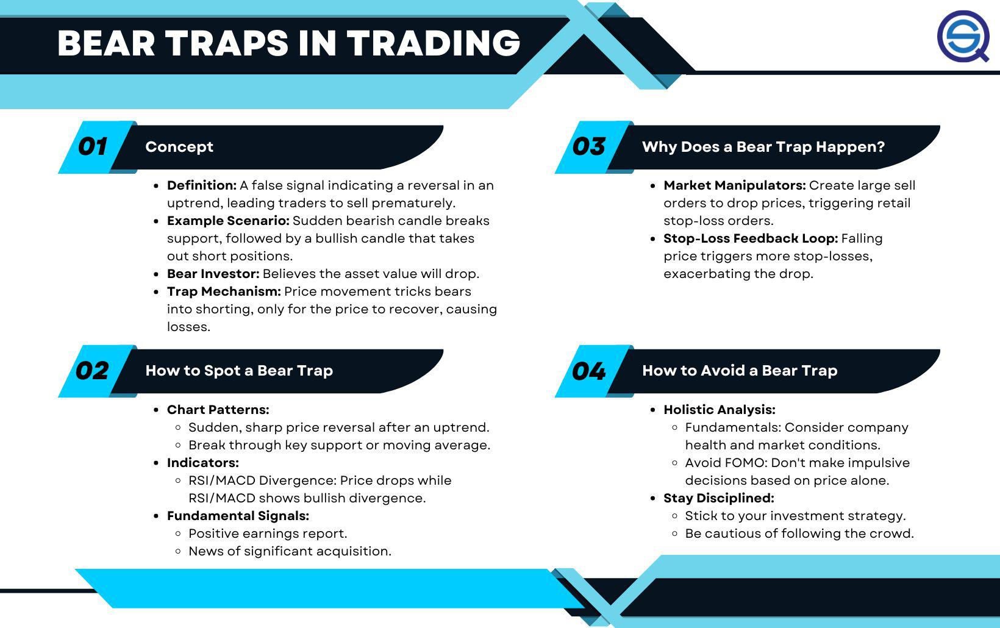

In recent years, the landscape of trading has undergone significant transformation, largely driven by technological advancements. These changes have facilitated the development of diverse trading strategies and instruments, enabling both retail and institutional traders to implement more sophisticated approaches in the financial markets. Understanding trading strategies, investment risks, bear traps, and algorithmic trading is essential for anyone involved in trading, regardless of their experience level or objectives. This article aims to provide a comprehensive overview of these critical areas, equipping traders and investors with the knowledge required to make informed decisions.

Trading strategies have evolved from basic buy-and-hold techniques to more complex systems that utilize both manual and automated decisions. With the advancement of algorithmic trading, participants can execute trades with remarkable speed and accuracy based on pre-defined criteria. These strategies can be underpinned by technical analysis, fundamental evaluation, or market sentiment, each offering different insights and advantages.



Investment risk, an inherent part of trading, necessitates thorough comprehension and management to prevent significant financial losses. Different types of risk, such as market risk, credit risk, and liquidity risk, pose challenges to market participants. Mastering risk management techniques, such as diversification and the use of stop-loss orders, is crucial for achieving long-term trading success.

Bear traps, characterized by sudden reversals in market trends, can lead to unexpected losses for traders who are not anticipating such changes. Identifying these traps typically involves the use of technical indicators and confirmation signals.

Algorithmic trading, or algo trading, further encapsulates the technological prowess in trading, offering substantial efficiency and precision. Despite its benefits, it also introduces potential challenges, such as technological failures and increased market volatility.

Throughout this article, we will explore the definitions, examples, and impacts of these concepts, providing readers with a nuanced understanding of their interplay and how they collectively shape trading outcomes. By the end, you will gain a holistic perspective, empowering you to navigate the complexities of the trading world effectively.

## Table of Contents

## Understanding Trading Strategies

Trading strategies are critical to making informed buying and selling decisions in financial markets. These strategies are systematic methods that traders use to analyze market trends, predict price movements, and make profitable trades. Different types of trading strategies cater to varied investment goals and risk tolerances and can be established through several analytical approaches, including technical analysis, [fundamental analysis](/wiki/fundamental-analysis), and sentiment analysis.

**Technical Analysis**: This method involves evaluating historical price data and using chart patterns, trends, and technical indicators to predict future market movements. Traders using technical analysis may rely on tools such as moving averages, Bollinger Bands, and Relative Strength Index (RSI) to formulate their strategies.

**Fundamental Analysis**: Unlike technical analysis, fundamental analysis focuses on evaluating a company’s financial health and intrinsic value. This involves analyzing financial statements, economic factors, and industry conditions. Traders employing this strategy seek to determine whether a stock is undervalued or overvalued based on intrinsic value.

**Sentiment Analysis**: This approach aims to gauge investor sentiment and market psychology to predict price movements. Sentiment can often drive market trends, with bullish sentiment pushing prices up and bearish sentiment driving them down. Traders using this strategy may analyze news sentiment, social media trends, and investor perceptions to guide their trades.

Trading strategies range in style and complexity, with common types including:

- **Day Trading**: This strategy involves buying and selling financial instruments within the same trading day, aiming to capitalize on small price movements. Day traders often use technical analysis and real-time data to make quick trading decisions.

- **Swing Trading**: Swing traders hold positions for several days to weeks, exploiting interim price swings. This strategy combines technical and fundamental analysis to take advantage of market volatility.

- **Position Trading**: This long-term strategy involves holding investments for extended periods, typically months or years. It is guided by fundamental analysis and is less concerned with short-term price fluctuations.

Selecting an appropriate trading strategy involves considering market conditions, personal risk tolerance, and the level of market [volatility](/wiki/volatility-trading-strategies). Different market scenarios may favor different strategies; hence, traders should align their strategies with prevailing market trends and individual risk profiles.

Successful traders often back-test their strategies to verify profitability over historical data. Back-testing involves applying a strategy to historical market data to evaluate its efficacy and refine it before deploying in live markets. This process helps traders understand potential risks and returns associated with their strategies and adjust accordingly.

In summary, trading strategies are essential for navigating the financial markets. By understanding and applying various analytical approaches and types of strategies, traders can better forecast market movements, manage risks, and seize investment opportunities efficiently.

## Assessing Investment Risks

Investment risk refers to the probability of incurring a loss relative to the anticipated return on an investment. It is an inherent component of financial markets, affecting all types of investments. As such, understanding and managing risk is essential for traders and investors aiming to avoid significant financial setbacks. The effective management of investment risk entails identifying different types of risks and employing strategies to mitigate them.

**Types of Investment Risks:**

1. **Market Risk**: This risk arises due to changes in market prices and can affect stocks, bonds, commodities, and currencies. Market risk is often divided into several categories, such as:
   - **Equity Risk**: The potential for loss due to fluctuations in stock prices.
   - **Interest Rate Risk**: The risk of bond prices falling due to rising interest rates.
   - **Currency Risk**: The risk associated with changes in foreign exchange rates, which can affect investments in foreign markets.

2. **Credit Risk**: This refers to the possibility that a borrower will default on their debt obligations. Credit risk is a significant concern for fixed-income investors, as it directly influences the return on bonds and other debt securities.

3. **Liquidity Risk**: Liquidity risk occurs when an asset cannot be bought or sold quickly enough in the market to prevent or minimize a loss. Stocks of smaller companies or those not frequently traded may involve higher liquidity risks.

4. **Operational Risk**: This type of risk is associated with failures in internal processes, systems, or policies, potentially leading to financial loss. Operational risk can stem from human error, system failures, or fraud.

**Risk Management Tools:**

To mitigate these risks, investors employ various risk management tools and strategies:

- **Stop-Loss Orders**: This tool automatically sells an asset when its price reaches a certain level, thereby limiting potential losses. It helps investors maintain discipline and respond swiftly to adverse price movements without continuous monitoring.

- **Diversification**: By spreading investments across different asset classes, sectors, and geographic regions, investors can reduce the impact of a single asset's poor performance on the overall portfolio. Diversification is one of the fundamental strategies for risk reduction.

**Balancing Risk and Reward:**

Investors must carefully assess and balance the risk and reward of their investments to effectively achieve their financial objectives. This involves aligning investment choices with their risk tolerance, time horizon, and financial goals. For example, younger investors with a longer time horizon might afford to take on more risk in pursuit of higher returns, while those nearing retirement may prioritize capital preservation.

In conclusion, assessing investment risks and applying appropriate risk management techniques are crucial for achieving financial success in trading and investing. By understanding the nature and extent of various risks and employing strategies like stop-loss orders and diversification, investors can better navigate market uncertainties and work towards their financial goals.

## Recognizing Bear Traps in Trading

A bear trap occurs when an asset’s price action entices traders or algorithms to execute a sell position based on the expectation of a continued downtrend. However, instead of the price continuing downward, it reverses its direction, leading to potential losses for those who initiated short positions. This financial misjudgment can lead traders to premature conclusions, prompting actions based on the false anticipation of declining markets.

Bear traps are typically characterized by a temporary market move or pattern that suggests an imminent decline. Traders are misled by this false sentiment, often driven by factors such as sudden negative news or unfavorable macroeconomic indicators. This situation leads to hasty sell-offs as market participants react to apparent bearish signals. The unexpected reversal that follows catches short sellers unaware, contributing to rising prices as they rush to cover their positions.

Volume analysis and moving averages are commonly used by traders to spot potential bear traps. Analyzing trading [volume](/wiki/volume-trading-strategy) can offer insights into the strength or weakness of the current trend. For example, in the case of a supposed downtrend, if the trading volume does not increase significantly, it may indicate a lack of conviction among sellers, suggesting a potential bear trap. Moving averages, especially when combined with other indicators, can help assess whether a price movement aligns with the broader trend or is merely a temporary anomaly.

Patience and prudent verification through multiple technical indicators are crucial in avoiding bear traps. This means not solely relying on a single signal but rather waiting for confirmation from additional technical analysis tools. These can include relative strength index (RSI), stochastic oscillators, or trendline analysis, which help in verifying the legitimacy of a bearish signal.

Seasoned traders often exploit bear traps to their advantage by executing contrarian trades. They await technical confirmations of the trap's presence, such as divergences between price movement and indicators or [breakout](/wiki/breakout-trading) patterns that contravene recent lows. Once confirmed, they may engage in long positions, capitalizing on the ensuing upward price movement that results as other traders rush to [exit](/wiki/exit-strategy) their short positions.

In conclusion, recognizing and managing bear traps involves a mix of technical savvy, patience, and strategic use of market data. Traders who effectively incorporate these elements into their analysis are better positioned to mitigate risks associated with false trend reversals and potentially capitalize on market inefficiencies.

## The Role of Algorithmic Trading

Algorithmic trading employs computer programs and algorithms to [carry](/wiki/carry-trading) out financial trades according to predefined strategies. This approach to trading excels in speed and precision, enabling traders to back-test numerous strategies under various market conditions. The automation of these processes allows for the execution of high-frequency trades, often in fractions of a second, a feat that is unattainable through traditional manual trading methods.

At the core of [algorithmic trading](/wiki/algorithmic-trading) is the ability to process large volumes of trades at optimal prices. Algorithms analyze a wealth of data points and market signals, executing trades when certain conditions or thresholds are met. This method not only enhances trading efficiency but also reduces transaction costs by capturing price discrepancies more effectively.

However, algorithmic trading is accompanied by distinct risks. Technical failures, such as software bugs or connectivity issues, can lead to significant financial losses. Furthermore, due to its high speed, algorithmic trading can exacerbate market volatility, rapidly amplifying price swings in the market. This was highlighted during the 2010 Flash Crash, where major U.S. stock indices experienced a brief but severe market drop due to algorithmic trades.

Understanding the underlying strategies of algorithmic trading is crucial for their effective deployment. Traders can employ algorithms for a range of strategies, including [market making](/wiki/market-making), statistical [arbitrage](/wiki/arbitrage), and [trend following](/wiki/trend-following). For instance, a simple moving average strategy might buy a security when its short-term average price exceeds its long-term average and sell when the opposite occurs.

Incorporating Python for back-testing and executing algorithmic strategies is common. Python libraries such as Pandas for data manipulation, NumPy for numerical operations, and libraries like PyAlgoTrade or Zipline help traders develop and test strategies efficiently. Below is a simple Python code snippet for a moving average crossover strategy:

```python
import pandas as pd

# Load data
data = pd.read_csv('stock_data.csv', parse_dates=True, index_col='Date')

# Calculate moving averages
short_window = 40
long_window = 100
data['Short_MA'] = data['Close'].rolling(window=short_window, min_periods=1).mean()
data['Long_MA'] = data['Close'].rolling(window=long_window, min_periods=1).mean()

# Generate trading signals
data['Signal'] = 0
data['Signal'][short_window:] = np.where(data['Short_MA'][short_window:] > data['Long_MA'][short_window:], 1, 0)

# Generate trading orders
data['Position'] = data['Signal'].diff()

# Display signals
print(data[['Close', 'Short_MA', 'Long_MA', 'Signal', 'Position']])
```

The efficacy of algorithmic trading hinges on the robustness of the strategies and the quality of the algorithms employed. Constant monitoring and refinement are necessary to adapt to evolving market conditions and to mitigate the inherent risks associated with this advanced trading approach.

## Synergies and Challenges in Combining These Concepts

The integration of trading strategies, risk assessment, bear traps, and algorithmic trading is shaping the future of the financial markets, offering significant opportunities along with notable challenges. Technology, especially algorithmic trading, allows for real-time risk management and optimization of trading strategies. Algorithms can process large sets of data at unprecedented speeds, executing trades with precision and allowing traders to capitalize on transient market inefficiencies.

However, these technological advancements also bring forth the risk of over-reliance. Algorithms are only as good as their design and input data, and they lack the intuitive judgment that experienced traders bring to the table. The infamous "Flash Crash" of 2010 serves as a stark reminder of the possible ramifications when algorithms run unchecked, causing dramatic fluctuations and amplifying market volatility.

To mitigate these risks, a balance between algorithmic efficiency and human oversight is crucial. While algorithms can provide analytical insights and timely executions, trader intuition plays a key role in interpreting market trends and making informed decisions in dynamic conditions. This balance can be achieved by incorporating automated alerts that require human verification before executing trades or setting threshold limits within algorithms.

Traders also need to stay informed about market dynamics and technological advancements to maintain their competitive edge. Continuous education is vital, as the trading landscape is constantly evolving. New tools and programming techniques can be integrated into existing frameworks to enhance decision-making processes. For example, using Python for developing custom indicators or back-testing strategies can yield valuable insights, allowing for strategic adjustments that align with market changes.

In summary, while the fusion of trading strategies, risk assessments, and algorithmic technologies holds considerable promise, it requires a harmonious blend of machine efficiency and human insight to navigate the inherent complexities of today’s financial markets.

## Conclusion

In conclusion, the modern trading landscape demands a comprehensive understanding of various market elements, including trading strategies, investment risk management, bear traps, and algorithmic trading. Each of these components plays a vital role in determining the success or failure of trading activities. Effective trading strategies are essential, as they dictate the timing and nature of trades, ultimately impacting profitability. Similarly, managing investment risks through tools and strategies like diversification and stop-loss orders is crucial to avoiding substantial losses and achieving financial goals.

Bear traps present a specific challenge by misleading traders into making premature decisions based on false signals, highlighting the necessity for traders to conduct thorough analyses using multiple indicators. Moreover, the rise of algorithmic trading has increased the speed and efficiency of trades, offering significant benefits but also posing considerable risks, including technical failures and amplified market volatility.

The interplay between these elements underscores the importance of marrying technical knowledge with practical experience. Traders must engage continuously in learning and adapting to the dynamic changes in financial markets. This ongoing education ensures they remain competitive and capable of identifying and capitalizing on opportunities while effectively managing potential market risks. Remaining vigilant and informed is not merely advantageous but essential for modern traders navigating the complexities and opportunities presented by contemporary financial markets.

## References & Further Reading

[1]: Bergstra, J., Bardenet, R., Bengio, Y., & Kégl, B. (2011). ["Algorithms for Hyper-Parameter Optimization."](https://papers.nips.cc/paper/4443-algorithms-for-hyper-parameter-optimization) Advances in Neural Information Processing Systems 24.

[2]: ["Advances in Financial Machine Learning"](https://www.amazon.com/Advances-Financial-Machine-Learning-Marcos/dp/1119482089) by Marcos Lopez de Prado

[3]: ["Evidence-Based Technical Analysis: Applying the Scientific Method and Statistical Inference to Trading Signals"](https://www.amazon.com/Evidence-Based-Technical-Analysis-Scientific-Statistical/dp/0470008741) by David Aronson

[4]: ["Machine Learning for Algorithmic Trading"](https://github.com/stefan-jansen/machine-learning-for-trading) by Stefan Jansen

[5]: ["Quantitative Trading: How to Build Your Own Algorithmic Trading Business"](https://www.amazon.com/Quantitative-Trading-Build-Algorithmic-Business/dp/1119800064) by Ernest P. Chan