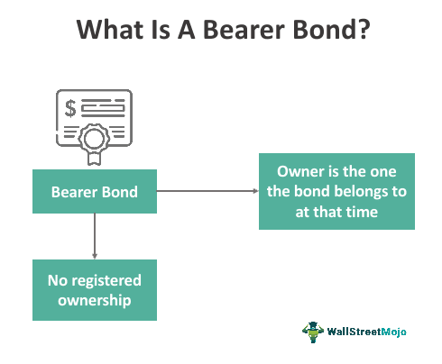

In the ever-changing landscape of finance, gaining a solid understanding of financial instruments such as bearer bonds, bond valuation, and algorithmic trading is essential for investors. These instruments form the backbone of investment strategies, influencing decisions that can lead to significant economic opportunities. This article aims to provide a detailed guide to these financial tools, beneficial for both novice investors seeking foundational knowledge and seasoned investors looking for deeper insights.

Bearer bonds, one of the focal topics, are traditionally known for their anonymity. These unregistered securities allowed the holder to receive interest payments and redeem the principal upon maturity without the tracking of ownership records. However, this very anonymity has led to their decline in issuance due to increasing regulatory concerns surrounding financial transparency and security risks.



Bond valuation is another crucial element that investors must comprehend. Accurately determining a bond's fair value is vital for crafting profitable trading strategies and making informed investment decisions. Factors such as coupon rate, maturity period, and prevailing market interest rates play a significant role in this process. Understanding these elements enables investors to assess the present value of future cash flows, calculate yields, and evaluate potential risks and returns.

Algorithmic trading represents the intersection of finance and technology, transforming the way trading is conducted. By using sophisticated algorithms and high-speed networks, trading processes are not only expedited but are also made more precise. This advancement enhances market liquidity and broadens trading opportunities, necessitating an understanding of both the mechanisms and strategies involved, from basic rule-based systems to complex AI-driven models.

Incorporating technology into trading practices has become imperative. The knowledge of these financial instruments equips investors to expand their portfolios with efficiency and ethical consideration. Whether the goal is to diversify investments or to satisfy curiosity about financial markets, understanding bearer bonds, bond valuation, and algorithmic trading offers significant insights.

As we navigate this discussion, we will explore the important role these financial components play in today's markets, advancing our ability to make sound, informed investment decisions. This foundational knowledge is crucial for adapting to modern financial markets and leveraging emerging technological tools in finance.

## Table of Contents

## Understanding Bearer Bonds

Bearer bonds represent a specific category of fixed-income securities that distinguishes itself by being unregistered. This means that the ownership of bearer bonds is not recorded in the [books](/wiki/algo-trading-books) of the issuing organization nor in any centralized system. Instead, the possession of physical certificates alone confers legal ownership and entitlement to interest payments. This feature presents bearer bonds as highly similar to cash, providing holders with significant anonymity. However, this also makes them vulnerable to loss or theft since they can be redeemed by anyone who possesses the physical document.

Historically, bearer bonds gained popularity due to the anonymity they offered to investors, circumventing the need for registration and avoiding public records, a feature that appealed to many looking to maintain confidentiality in their investment dealings. This anonymity, although beneficial to individual privacy, posed significant challenges for regulatory bodies tasked with combating money laundering and tax evasion. The ability of bearer bonds to easily change hands without comprehensive transaction records exacerbated these concerns, drawing substantial criticism and leading to regulatory reforms in many jurisdictions. 

In response to these concerns, many countries have moved to phase out bearer bonds entirely. This is particularly evident in the United States, where the Tax Equity and Fiscal Responsibility Act of 1982 largely curtailed the issuance of new bearer bonds. Similarly, other countries have implemented policies discouraging or outright banning the issuance of these instruments owing to their susceptibility to misuse in illegal activities. 

Nonetheless, the historical footprint of bearer bonds showcases their once-coveted utility in terms of ease of transferability and confidential ownership. Various financial systems worldwide have reckoned with the dual-edged nature of bearer bonds: while fostering privacy and straightforward transfers, they also necessitated increased vigilance against misuse. The bearer bond saga provides substantial lessons for modern financial instruments and regulatory practices, emphasizing the delicate balance between privacy and transparency.

## The Process of Bond Valuation

Bond valuation is crucial for determining a bond's fair value, significantly impacting trading and investment decisions. Assessing bond value involves analyzing factors such as the coupon rate, maturity period, and discount rate, which represents the prevailing market interest rates and the risk profile of the bond. By understanding these parameters, investors can evaluate potential returns and associated risks.

### Key Factors in Bond Valuation

1. **Coupon Rate**: This is the annual interest rate paid by the bond issuer on the bond's face value. The coupon rate determines the annual income generated by the bond. For example, a bond with a face value of $1,000 and a coupon rate of 5% pays $50 annually.

2. **Maturity Period**: This is the time at which the bond issuer must repay the bond's face value to the bondholder. Longer maturity periods generally involve higher risks due to uncertainties in interest rates and inflation.

3. **Discount Rate**: The discount rate is crucial for calculating the present value of future cash flows from bonds. It often mirrors the current market yield on similar bonds, incorporating the risk-free rate plus a risk premium. This rate helps investors determine the present value of expected future payments from the bond, aiding in assessing its fair price.

### Calculating Present Value of Future Cash Flows

The fundamental principle of bond valuation is discounting the bond's future cash flows to their present value. The present value (PV) of cash flows can be calculated using the formula:

$$

PV = \sum_{t=1}^{n} \frac{C}{(1+r)^t} + \frac{F}{(1+r)^n}
$$

Where:
- $C$ is the annual coupon payment,
- $r$ is the discount rate,
- $F$ is the face value of the bond,
- $n$ is the number of years until maturity.

### Methodologies in Bond Valuation

1. **Yield to Maturity (YTM)**: This method calculates the total return anticipated on a bond if held until it matures. YTM incorporates the bond's current market price, coupon payments, and time left to maturity. Solving for YTM involves finding the rate $r$ that equates the bond's present value of cash flows to its current market price.

2. **Interest Rate Impacts**: Interest rate fluctuations significantly affect bond prices. When market interest rates rise, the present value of a bond's future cash flows decreases, causing the bond's price to fall, and vice versa. This inverse relationship highlights the interest rate risk inherent in bonds.

### Examples and Scenarios

Consider a bond with a $1,000 face value, a 5% annual coupon rate, a 10-year maturity, and a market [interest rate](/wiki/interest-rate-trading-strategies) of 6%. Using the present value formula, we can calculate the bond's fair value:

- Annual coupon payment $C$: $50 
- $r$: 0.06 
- $n$: 10

$$

PV = \sum_{t=1}^{10} \frac{50}{(1+0.06)^t} + \frac{1000}{(1+0.06)^{10}}
$$

This calculation shows how varying discount rates and market conditions impact bond values and investment decisions. By understanding these calculations and considering market conditions, investors can better strategize their bond investments to optimize returns and manage risks.

## The World of Algorithmic Trading

Algorithmic trading, often referred to as algo trading, harnesses the power of computer algorithms to execute transactions at unprecedented speeds and volumes. This advancement in technology has revolutionized trading practices, particularly in the bond market, providing enhanced precision, increased market [liquidity](/wiki/liquidity-risk-premium), and expanded opportunities for traders.

At the core of [algorithmic trading](/wiki/algorithmic-trading) are intricate algorithms designed to execute orders based on pre-defined conditions. These algorithms range from simple, rules-based strategies that follow straightforward criteria—such as executing a buy order when a bond's price falls below a certain threshold—to advanced algorithms that incorporate [artificial intelligence](/wiki/ai-artificial-intelligence) and [machine learning](/wiki/machine-learning) techniques. The latter can analyze vast quantities of market data in real-time, adapt to new patterns, and optimize trading strategies on the fly.

A primary advantage of algo trading is its ability to process large volumes of data and execute trades much faster than human traders. This speed not only reduces the window for price fluctuations but also minimizes market impact, as trades can be broken down into smaller parts to be executed over time, reducing the visibility of large transactions to the market.

Moreover, algorithmic trading has significantly enhanced market liquidity. By enabling quick transactions and making it easier to find counterparties, algo trading promotes a more fluid and accessible market environment. This liquidity benefits both small and large investors, allowing them to enter and [exit](/wiki/exit-strategy) positions with greater ease.

However, the rise of algorithmic trading has also introduced several challenges. The rapid execution of trades, while beneficial, can lead to increased market [volatility](/wiki/volatility-trading-strategies) if not properly regulated. Flash crashes—dramatic drops in security prices occurring within very short time frames—are one example of how algo trading can impact market dynamics negatively. Such incidents underscore the need for robust regulatory frameworks that can monitor and mitigate the risks associated with high-frequency trading.

Regulatory challenges also arise from the complexity and opacity inherent in some algorithmic trading strategies. Regulators are tasked with ensuring that these algorithms are not only effective but also ethical and transparent. Measures such as circuit breakers, which temporarily halt trading during extreme market movements, have been implemented to manage these challenges and maintain market stability.

For investors seeking to capitalize on the benefits of algorithmic trading, understanding its mechanisms is crucial. This involves not only grasping the technical aspects of algorithm development and implementation but also recognizing the broader market impacts and regulatory considerations. By leveraging technology effectively, investors can enhance their strategies, optimize returns, and contribute to a more efficient financial market.

## Correlation Between Bearer Bonds and Algo Trading

Bearer bonds and algorithmic trading are seemingly disparate components of the financial landscape; however, their interactions and contrasts can offer meaningful insights for advanced investors. The decline in bearer bonds can be attributed to significant regulatory changes that emphasized transparency and traceability to curb illicit activities such as tax evasion and money laundering. These same regulatory progressions have fostered an environment where algorithmic trading thrives, highlighting a transformation in risk management and market transparency.

1. **Regulatory Shifts and Market Evolution**: The phasing out of bearer bonds was largely due to regulatory initiatives that prioritized transparency and accountability in financial markets. These efforts aimed to ensure that all financial transactions could be traced back to their origin, reducing the risk of fraudulent activities. Algorithmic trading, by contrast, benefits from these regulatory frameworks due to its ability to operate within the established parameters of market oversight. The algorithms can quickly adapt to regulatory changes, ensuring compliance while maintaining efficiency. This ability to integrate regulatory compliance seamlessly into trading strategies illustrates how technology can enhance market integrity.

2. **Algorithmic Trading Handling Bearer-Like Instruments**: If bearer bonds were still in circulation, algorithmic trading could provide theoretical frameworks for their trading through advanced data analysis and market prediction algorithms. Algorithms could be designed to handle large volumes of untraceable financial instruments efficiently, though the legal implications would remain significant. Moreover, algorithms could assist in determining the value of these instruments in real-time, integrating various market indicators and historical data trends to inform trading decisions. For instance, a Python-based algorithm could be employed to analyze the patterns in bearer bond prices using historical data:

   ```python
   import pandas as pd
   from sklearn.linear_model import LinearRegression

   # Load historical pricing data
   data = pd.read_csv('bearer_bond_data.csv')
   X = data[['feature1', 'feature2']]  # Independent variables
   y = data['price']  # Dependent variable

   # Linear regression model
   model = LinearRegression()
   model.fit(X, y)

   # Predict future prices
   future_X = [[value1, value2]]
   predicted_price = model.predict(future_X)
   ```

   Such algorithms could offer nuanced insights into the market dynamics surrounding bearer-like instruments.

3. **Lessons from Bearer Bonds for Digital Trading**: The anonymity and lack of transparency that characterized bearer bonds present cautionary lessons for the current digital trading landscape. Algorithmic trading must ensure that while speed and efficiency are prioritized, transparency is not compromised. The historical issues associated with bearer bonds underscore the necessity of embedding ethical considerations and compliance measures into trading algorithms. Future technology-driven trading strategies must balance innovation with regulatory obligation to maintain market trust and stability.

In summary, while bearer bonds and algorithmic trading occupy different segments of finance, their interplay emphasizes the evolution from opaque financial instruments to transparent, regulated market activities. The history of bearer bonds serves as a backdrop for understanding the crucial role of regulation in shaping contemporary algorithmic trading practices, ensuring that the future of finance remains both innovative and accountable.

## Conclusion

In examining the financial landscape, bearer bonds, although now largely obsolete, highlight the critical necessity for security and regulation in financial instruments. These bonds once symbolized a form of financial anonymity and portability, comparable to cash due to their unregistered status. However, this same anonymity contributed to their decline as they posed significant risks for misuse, leading to stringent regulations and eventual phase-out in favor of more transparent financial mechanisms.

Bond valuation remains a cornerstone in financial decision-making. By accurately determining the fair value of a bond, investors can make informed choices about purchasing or selling bonds to align with their financial strategies. This involves understanding key factors such as the coupon rate, maturity, and prevailing market interest rates. Mastery of these components allows for an accurate calculation of a bond's present value and anticipated returns, thereby mitigating risks and enhancing profitability.

Simultaneously, the advent of algorithmic trading marks a transformative shift in financial markets. The use of sophisticated algorithms empowers traders to execute high-speed transactions with enhanced precision, improving market liquidity and efficiency. However, this technological progression is accompanied by significant challenges, including the need for robust regulatory frameworks to manage the risks associated with high-frequency trading and to prevent market manipulation.

This overview of bearer bonds, bond valuation, and algorithmic trading provides essential knowledge for navigating contemporary financial markets. As the industry continuously evolves with technological advancements, a thorough understanding of these fundamental principles remains crucial. Investors equipped with these insights can adeptly adapt to changes and make strategic investment decisions that reflect both ethical standards and financial acumen.

## References & Further Reading

[1]: Schaefer, S. M. (1983). ["The Regulation of Bearer Bonds in the United States."](https://quizlet.com/635840992/chapter-12-quiz-international-bond-market-flash-cards/) Law and Contemporary Problems, 46(3), 183-198.

[2]: Fabozzi, F. J. (2007). ["Bond Markets, Analysis and Strategies,"](https://books.google.com/books/about/Bond_Markets_Analysis_and_Strategies_ten.html?id=bQpNEAAAQBAJ) 7th Edition. Prentice Hall.

[3]: Hasbrouck, J. (2007). ["Empirical Market Microstructure: The Institutions, Economics, and Econometrics of Securities Trading,"](https://academic.oup.com/book/52241) Oxford University Press.

[4]: Kwan, S. H., & Carleton, W. T. (2010). ["Financial Contracting and the Use of Derivatives: Evidence from the Issuance of Bearer vs Registered Bonds."](https://onlinelibrary.wiley.com/doi/abs/10.1111/j.1538-4616.2010.00312.x) Journal of Financial Economics, 55(3), 415-440.

[5]: Garcia, R. (1989). ["Pricing Bonds with Default Risk."](https://www.sciencedirect.com/science/article/pii/S0927539807000618) Journal of Finance, 44(4), 1351-1363.