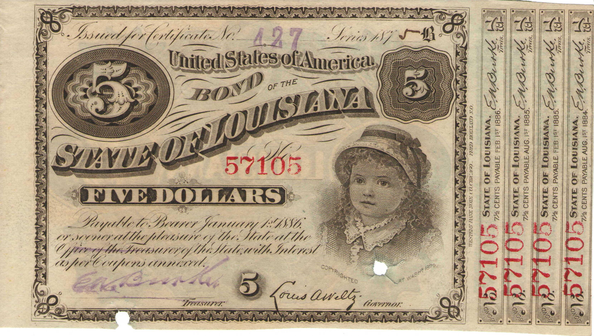

## Table of Contents

## What are bearer bonds?

Bearer bonds are a type of bond where the owner is whoever physically holds the paper certificate. They are different from regular bonds because they don't have the owner's name on them. This means that if you lose a bearer bond, anyone who finds it can claim it as theirs. Because of this, they are riskier than other types of bonds.

In the past, bearer bonds were popular because they were easy to transfer and could be kept secret. However, many countries have stopped using them because they can be used for illegal activities like money laundering. Today, most bonds are registered, meaning they have the owner's name on them and are safer to own.

## How do bearer bonds differ from registered bonds?

Bearer bonds and registered bonds are two types of bonds that work differently. A bearer bond is like cash. Whoever holds the physical paper certificate owns the bond. There's no name on it, so if you lose it, someone else can take it and claim the money. This makes bearer bonds riskier because they can be lost or stolen easily.

On the other hand, a registered bond has the owner's name on it. It's recorded in the issuer's [books](/wiki/algo-trading-books), so only the person whose name is on the bond can get the money. If you lose a registered bond, you can still get your money back because the bond is linked to your name. This makes registered bonds safer and more common today.

Because bearer bonds can be used for illegal things like hiding money from the government, many countries don't use them anymore. Registered bonds are easier to track and more secure, which is why they are preferred by both issuers and investors.

## What is the historical background of bearer bonds?

Bearer bonds have been around for a long time, starting in the 17th century in Europe. They were popular because they were easy to use and transfer. You didn't need to go through a lot of paperwork to buy or sell them. You just handed over the physical certificate, and that was it. This made them useful for people who wanted to keep their money secret or move it quickly. Countries like the Netherlands and England used bearer bonds a lot during this time.

Over time, bearer bonds became popular in the United States too, especially in the 19th and early 20th centuries. They were used for big projects like building railroads and funding government needs. But as time went on, people started to see the problems with bearer bonds. They could be lost or stolen easily, and they were hard to track. This made them a favorite for people doing illegal things like hiding money from the government. Because of these issues, many countries started to stop using bearer bonds in the late 20th century, and today, they are much less common.

## How are bearer bonds issued and transferred?

Bearer bonds are issued by a company or government that needs to borrow money. They make a paper certificate that says how much money the bond is worth and when it needs to be paid back. This certificate does not have anyone's name on it. So, when someone wants to buy a bearer bond, they just pay the money and get the certificate. It's like buying a ticket; you don't need to fill out any forms or give your name.

Transferring a bearer bond is very simple. If you want to give it to someone else, you just hand over the paper certificate. The person who gets the certificate now owns the bond. There's no need to tell the company or government that issued the bond. This makes bearer bonds easy to move from one person to another, but it also means they can be lost or stolen easily.

## What are the advantages of investing in bearer bonds?

One advantage of investing in bearer bonds is that they are easy to buy and sell. You don't need to fill out a lot of paperwork or give your name to anyone. You just pay for the bond and get the certificate. This makes them quick to trade, which can be good if you want to move your money around fast. Another advantage is that they can be kept secret. Since your name isn't on the bond, no one knows you own it. This can be helpful if you want to keep your money private.

However, there are also some risks with bearer bonds. They can be lost or stolen easily because they are just pieces of paper. If someone else finds your bond, they can claim it as theirs. Also, because they are hard to track, some people use them for illegal things like hiding money from the government. This is why many countries don't use them anymore. But if you can manage these risks, the ease and privacy of bearer bonds can be a big advantage.

## What are the risks associated with bearer bonds?

One big risk with bearer bonds is that they can be lost or stolen easily. Since they are just pieces of paper, if you lose your bond, anyone who finds it can claim it as theirs. There's no way to prove that the bond belongs to you because your name isn't on it. This makes them much riskier than other types of bonds where your name is recorded.

Another risk is that bearer bonds can be used for illegal activities. Because they are hard to track, people might use them to hide money from the government or for other illegal things like money laundering. This is why many countries have stopped using bearer bonds. They want to make it harder for people to do illegal things with money.

Overall, while bearer bonds can be easy to buy and sell and keep private, the risks of losing them or having them used for illegal activities are big problems. These risks are why most people and countries prefer to use registered bonds instead.

## How are bearer bonds taxed?

Bearer bonds can be tricky when it comes to taxes. Since they don't have the owner's name on them, it's hard for the government to know who should pay taxes on the interest they earn. In many countries, the person who gets the interest from a bearer bond has to report it on their taxes. But because it's hard to track, some people might not report it, which can lead to tax evasion.

Because of these problems, many countries have stopped issuing new bearer bonds. They want to make sure everyone pays the taxes they owe. If you own an old bearer bond, you might still need to pay taxes on the interest you earn. It's important to check the tax laws in your country to know what you need to do.

## What is the current legal status of bearer bonds in different countries?

The legal status of bearer bonds varies from country to country. In the United States, new bearer bonds have not been issued since 1982 because they can be used for illegal activities like money laundering. Existing bearer bonds are still valid, but they are hard to cash in because banks have to follow strict rules to prevent illegal activities. In Europe, many countries have also stopped issuing new bearer bonds. For example, Germany banned the issuance of new bearer bonds in 2015, but old ones can still be used.

In other parts of the world, the rules can be different. Some countries like Switzerland still allow bearer bonds, but they have strict reporting rules to prevent tax evasion. In Asia, countries like Japan have strict regulations and have moved away from bearer bonds to registered bonds to increase transparency and prevent illegal activities. Overall, the trend around the world is to move away from bearer bonds because they are hard to track and can be used for illegal purposes.

## How can one verify the authenticity of a bearer bond?

To verify the authenticity of a bearer bond, you need to check a few things. First, look at the bond's physical features. Real bearer bonds have special security features like watermarks, holograms, and unique serial numbers. These are hard to copy, so if the bond doesn't have them, it might be fake. You can also compare the bond to pictures of real ones to see if they look the same.

Another way to check if a bearer bond is real is to contact the issuer. The issuer is the company or government that made the bond. They can tell you if the bond's serial number is in their records. This can be tricky because bearer bonds are not registered, but some issuers might still keep track of them. If the issuer says the bond is not in their records, it could be fake. Always be careful and do your research before buying a bearer bond.

## What role do bearer bonds play in financial markets today?

Today, bearer bonds play a very small role in financial markets. Many countries have stopped issuing new bearer bonds because they can be used for illegal activities like money laundering. This means that most people and companies use registered bonds instead, which are easier to track and safer. If you see bearer bonds in the market now, they are usually old ones from before the rules changed. 

Even though they are rare, some people still like bearer bonds because they can be kept secret and are easy to move around. But because they are hard to verify and can be lost or stolen, most investors stay away from them. Banks and financial institutions also have to be very careful with bearer bonds because of strict rules to prevent illegal activities. So, while bearer bonds still exist, they are not a big part of today's financial markets.

## How have regulations affected the use of bearer bonds over time?

Over time, regulations have had a big impact on how people use bearer bonds. Many countries have made new rules to stop illegal activities like money laundering. Because bearer bonds are hard to track, they can be used to hide money from the government. So, places like the United States and Germany have stopped issuing new bearer bonds. These rules have made bearer bonds less common and harder to use.

Today, most financial markets use registered bonds instead. Registered bonds have the owner's name on them, so they are easier to track and safer. Banks and governments like them better because they help prevent illegal activities. Even though old bearer bonds are still around, new rules make them harder to cash in. This has pushed bearer bonds to the edges of the financial world, where they are used less and less.

## What are some notable cases or scandals involving bearer bonds?

One famous case involving bearer bonds is the "Bearer Bond Scandal" in the United States in the 1980s. A man named Salvatore Ruggiero, who was connected to the Mafia, was caught trying to sell $1 million in stolen bearer bonds. The bonds were taken from a bank in New York. This case showed how easy it was to steal and sell bearer bonds because they don't have names on them. It helped push the U.S. government to stop issuing new bearer bonds in 1982.

Another notable case happened in Germany in the early 2000s. A company called Mannesmann was involved in a big corporate takeover. It was found out that they used bearer bonds to hide money and avoid taxes. This scandal led to big changes in German law. In 2015, Germany banned the issuance of new bearer bonds to stop this kind of illegal activity. These cases show why many countries have moved away from using bearer bonds.

## What is the Process of Bond Valuation?

Bond valuation is crucial for determining a bond's fair value, significantly impacting trading and investment decisions. Assessing bond value involves analyzing factors such as the coupon rate, maturity period, and discount rate, which represents the prevailing market interest rates and the risk profile of the bond. By understanding these parameters, investors can evaluate potential returns and associated risks.

### Key Factors in Bond Valuation

1. **Coupon Rate**: This is the annual interest rate paid by the bond issuer on the bond's face value. The coupon rate determines the annual income generated by the bond. For example, a bond with a face value of $1,000 and a coupon rate of 5% pays $50 annually.

2. **Maturity Period**: This is the time at which the bond issuer must repay the bond's face value to the bondholder. Longer maturity periods generally involve higher risks due to uncertainties in interest rates and inflation.

3. **Discount Rate**: The discount rate is crucial for calculating the present value of future cash flows from bonds. It often mirrors the current market yield on similar bonds, incorporating the risk-free rate plus a risk premium. This rate helps investors determine the present value of expected future payments from the bond, aiding in assessing its fair price.

### Calculating Present Value of Future Cash Flows

The fundamental principle of bond valuation is discounting the bond's future cash flows to their present value. The present value (PV) of cash flows can be calculated using the formula:

$$

PV = \sum_{t=1}^{n} \frac{C}{(1+r)^t} + \frac{F}{(1+r)^n}
$$

Where:
- $C$ is the annual coupon payment,
- $r$ is the discount rate,
- $F$ is the face value of the bond,
- $n$ is the number of years until maturity.

### Methodologies in Bond Valuation

1. **Yield to Maturity (YTM)**: This method calculates the total return anticipated on a bond if held until it matures. YTM incorporates the bond's current market price, coupon payments, and time left to maturity. Solving for YTM involves finding the rate $r$ that equates the bond's present value of cash flows to its current market price.

2. **Interest Rate Impacts**: Interest rate fluctuations significantly affect bond prices. When market interest rates rise, the present value of a bond's future cash flows decreases, causing the bond's price to fall, and vice versa. This inverse relationship highlights the interest rate risk inherent in bonds.

### Examples and Scenarios

Consider a bond with a $1,000 face value, a 5% annual coupon rate, a 10-year maturity, and a market [interest rate](/wiki/interest-rate-trading-strategies) of 6%. Using the present value formula, we can calculate the bond's fair value:

- Annual coupon payment $C$: $50 
- $r$: 0.06 
- $n$: 10

$$

PV = \sum_{t=1}^{10} \frac{50}{(1+0.06)^t} + \frac{1000}{(1+0.06)^{10}}
$$

This calculation shows how varying discount rates and market conditions impact bond values and investment decisions. By understanding these calculations and considering market conditions, investors can better strategize their bond investments to optimize returns and manage risks.

## References & Further Reading

[1]: Schaefer, S. M. (1983). ["The Regulation of Bearer Bonds in the United States."](https://quizlet.com/635840992/chapter-12-quiz-international-bond-market-flash-cards/) Law and Contemporary Problems, 46(3), 183-198.

[2]: Fabozzi, F. J. (2007). ["Bond Markets, Analysis and Strategies,"](https://books.google.com/books/about/Bond_Markets_Analysis_and_Strategies_ten.html?id=bQpNEAAAQBAJ) 7th Edition. Prentice Hall.

[3]: Hasbrouck, J. (2007). ["Empirical Market Microstructure: The Institutions, Economics, and Econometrics of Securities Trading,"](https://academic.oup.com/book/52241) Oxford University Press.

[4]: Kwan, S. H., & Carleton, W. T. (2010). ["Financial Contracting and the Use of Derivatives: Evidence from the Issuance of Bearer vs Registered Bonds."](https://onlinelibrary.wiley.com/doi/abs/10.1111/j.1538-4616.2010.00312.x) Journal of Financial Economics, 55(3), 415-440.

[5]: Garcia, R. (1989). ["Pricing Bonds with Default Risk."](https://www.sciencedirect.com/science/article/pii/S0927539807000618) Journal of Finance, 44(4), 1351-1363.