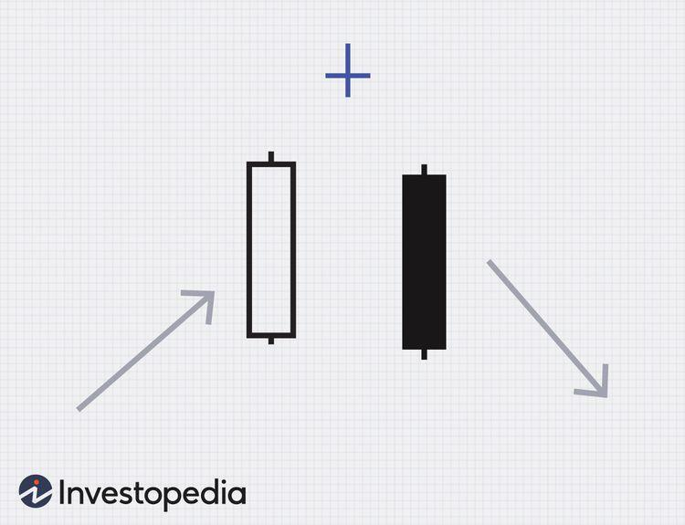

In algorithmic trading, recognizing candlestick patterns is crucial for making informed trading decisions. These visual representations of market price movements offer insights into potential reversals and continuations within a given timeframe. One such pattern is the 'bearish abandoned baby,' known for its rarity and significance among traders. This pattern acts as an indicator of a potential bearish reversal, emerging at the peak of an uptrend to signal that a downtrend may be imminent.

The bearish abandoned baby pattern consists of three distinct candlesticks that signify a sudden shift in market sentiment. It begins with a bullish candle during an uptrend, followed by a doji that gaps above the previous candle's close. The doji, characterized by a very small body where the opening and closing prices are nearly identical, reflects market indecision. The pattern is completed with a bearish candle that gaps down, closing below the first candle's body. This configuration is viewed as an early warning sign of a trend reversal, offering traders the opportunity to reassess their positions.



In algorithmic trading, where strategies are driven by computational rules and data analysis, the ability to recognize such pattern formations can be an integral component of a trading system. Algorithms can be designed to identify the bearish abandoned baby pattern in real-time, thereby allowing traders to automate the process of monitoring multiple markets and instruments simultaneously. This automation can help in reducing human error and enhancing trading efficiency, especially in fast-moving markets.

This article will cover the concept, formation, and role of the bearish abandoned baby pattern within algorithmic trading. It will further explore methods for traders to leverage this pattern to anticipate market movements effectively and strategically incorporate it into their trading portfolios. Through understanding this pattern, traders can potentially improve their trading outcomes by anticipating market downturns and making informed entry or exit decisions.

## Table of Contents

## Understanding the Bearish Abandoned Baby Pattern

The bearish abandoned baby is a distinctive candlestick pattern that traders use to predict a potential reversal in the price of an asset. It typically indicates a shift from an uptrend to a downtrend, signaling a bearish reversal. This pattern is characterized by three key components:

1. **First Candle: Bullish Candle**  
   The first candle is a long bullish candle indicating that the price has closed higher than it opened. This suggests that the market is in an uptrend with strong buying [momentum](/wiki/momentum).

2. **Second Candle: Doji**  
   The middle candle is a doji, forming a gap above the previous day's closing price. A doji occurs when the opening and closing prices are nearly equal, and it represents indecision among traders. This momentary balance between buyers and sellers suggests a potential stall in the current uptrend.

3. **Third Candle: Bearish Candle**  
   The third candle gaps down from the doji and closes below the doji's closing price. This bearish candle represents a strong shift in market sentiment toward selling, marking the beginning of a downtrend.

The precise formation process is crucial for traders attempting to identify this pattern. It requires observing the gaps between the candles: the gap up between the first bullish candle and the doji, and the gap down from the doji to the bearish candle. These gaps are pivotal as they signify a sharp change in sentiment from bullish to bearish.

The rarity of the bearish abandoned baby pattern is due to the precise conditions that must be met for its formation. When it does appear, its presence can indicate a critical change in the market's direction. Its effectiveness lies in highlighting a sudden bearish shift, making it a valuable signal for traders seeking to anticipate and react to market reversals.

Here is a simple Python function to help identify the bearish abandoned baby pattern:

```python
def is_bearish_abandoned_baby(data):
    """
    Check if the provided data contains a bearish abandoned baby pattern.

    Parameters:
    data (list): A list of dictionaries with keys 'open', 'high', 'low', 'close' representing three consecutive days.

    Returns:
    bool: True if the pattern is identified, False otherwise.
    """
    if len(data) != 3:
        raise ValueError("Data must be for exactly three days.")

    # Extracting individual days
    first_day, doji_day, third_day = data

    # Conditions for bearish abandoned baby
    is_first_day_bullish = first_day['close'] > first_day['open']
    is_doji_gapped_up = doji_day['open'] > first_day['close'] and doji_day['close'] == doji_day['open']
    is_third_day_bearish = third_day['close'] < third_day['open']
    is_gap_down_third_day = third_day['open'] < doji_day['close'] and third_day['close'] < doji_day['open']

    return (is_first_day_bullish and is_doji_gapped_up and is_third_day_bearish and is_gap_down_third_day)

# Example usage:
candlestick_data = [
    {'open': 100, 'high': 105, 'low': 98, 'close': 104},  # first bullish day
    {'open': 106, 'high': 108, 'low': 106, 'close': 106}, # doji day
    {'open': 105, 'high': 106, 'low': 101, 'close': 102}  # third bearish day
]

print(is_bearish_abandoned_baby(candlestick_data))  # Output should be True
```

This code functionally checks whether a sequence of three days' candlestick data forms a bearish abandoned baby pattern, providing traders with an automated way to screen this uncommon but influential pattern.

## The Significance of Bearish Abandoned Baby in Algorithmic Trading

Algorithmic trading relies heavily on predefined rules and structures to identify trading signals and execute trades with precision. One of the critical components in this technology-driven approach is pattern recognition, enabling algorithms to swiftly respond to market shifts. The bearish abandoned baby pattern is a notable example of a candlestick formation that can be leveraged in such trading systems due to its ability to signal a potential reversal from an uptrend to a downtrend. 

Characterized by three distinct candles—a gap up, a doji, and a gap down—the bearish abandoned baby pattern provides a visual cue of changing sentiment in the asset being analyzed. For algorithmic traders, this pattern acts as a reliable indicator of a potential impending bearish shift, allowing them to adjust their trading strategies accordingly. Integrating this pattern into algorithmic models involves developing signals that can efficiently recognize the formation and respond by executing trades designed for such market conditions.

To incorporate the bearish abandoned baby pattern into algorithmic models, a trader would typically start by defining the criteria for pattern detection. This involves the identification of the specific sequence and characteristics of candlesticks within price data, including the size of gaps and the presence of a doji. Here is a basic example of how such recognition might be programmed in Python, using a data set of candlestick price histories:

```python
def is_bearish_abandoned_baby(candles):
    """
    Determines if a series of three candles form a bearish abandoned baby pattern.
    :param candles: A list containing three candle dictionaries with 'open', 'close', 'high', and 'low'
    :return: Boolean indicating the presence of the pattern
    """
    first, second, third = candles

    # Criteria for the first gap up
    first_gap_up = first['close'] < second['open'] and first['high'] < second['low']

    # Criteria for the doji in the second position
    doji = abs(second['close'] - second['open']) < (second['high'] - second['low']) * 0.1

    # Criteria for the third gap down
    third_gap_down = third['open'] < second['close'] and third['low'] < second['high']

    # First candle should be bullish, third candle bearish
    bearish_candle_confirmation = first['close'] > first['open'] and third['open'] > third['close']

    return first_gap_up and doji and third_gap_down and bearish_candle_confirmation
```

In this example, the algorithm checks for the first candle closing higher than its open (bullish), a doji as the second candle, and the third candle closing lower than its open (bearish), with additional gap criteria. Such programs are typically part of larger systems that process real-time data, making quick evaluations and trades as required when the pattern is confirmed.

Moreover, implementing this candlestick pattern in [algorithmic trading](/wiki/algorithmic-trading) systems primarily aims to enhance predictive accuracy, allowing for better anticipation of market reversals. The precise recognition of the bearish abandoned baby through code can also allow these systems to perform [backtesting](/wiki/backtesting) on historical data. This step can validate the effectiveness of pattern recognition algorithms under different market conditions and time frames, helping to refine strategies that adapt to potentially profitable opportunities triggered by this pattern.

Using the bearish abandoned baby pattern within algorithmic models necessitates robust data analysis capabilities and continuous monitoring, ensuring the algorithms can adapt to conditions reflective of true market sentiment shifts rather than false positives. By recognizing this unique pattern, traders can potentially reduce risks and improve their market response time, aligning with the broader goals of algorithmic trading to enhance profits and efficiencies in trading operations.

## Advantages of Trading the Bearish Abandoned Baby Pattern

The bearish abandoned baby pattern offers several advantages for traders looking to capitalize on market downturns. This candlestick formation, while rare, provides a high-reliability signal, enabling traders to make informed decisions regarding market [exit](/wiki/exit-strategy) or the initiation of short positions.

One of the primary strategic benefits of the bearish abandoned baby pattern is its capacity to help traders anticipate reversals accurately. This pattern is composed of three candles: a bullish candle, a doji representing indecision, and a bearish candle that gaps down. When this pattern appears following an uptrend, it indicates a potential shift towards bearish sentiment, allowing traders to prepare for a market downturn.

For traders employing the bearish abandoned baby pattern, the timing of transactions is significantly improved. By recognizing the pattern near the peak of an uptrend, traders can exit long positions at an optimal time, thereby securing profits before a downturn occurs. Additionally, identifying this pattern offers a timely opportunity to open short positions, betting on the price decline that often follows its appearance.

Utilizing this pattern as part of a broader trading strategy can enhance overall trading outcomes. The pattern's ability to signal impending reversals makes it a useful component of a strategy focused on maximizing gains and minimizing losses. By incorporating the bearish abandoned baby pattern, traders can develop a trading approach that is responsive to sudden shifts in market sentiment.

In summary, the bearish abandoned baby pattern provides traders with a high-reliability indicator for market reversals. Its role in timing exits and initiating short positions can be strategically significant, maximizing trading profitability when applied effectively within a comprehensive trading strategy.

## Challenges and Limitations

The bearish abandoned baby pattern, while potentially lucrative, is not without challenges. Its primary limitation lies in its rarity, making it a difficult pattern to frequently observe and exploit. This scarcity can sometimes lead traders to misidentify similar, yet less reliable, patterns as a bearish abandoned baby, resulting in erroneous trading decisions.

Additionally, the volatile nature of financial markets can exacerbate these challenges. Sudden price movements may generate false signals or whipsaws—situations where a pattern suggests a market movement that does not materialize. For instance, a market gapping due to external news or events might be mistaken for a the bearish abandoned baby pattern, leading traders to initiate positions at inopportune times.

To mitigate these risks, traders can adopt several strategies. Firstly, combining the bearish abandoned baby pattern with other technical indicators, such as Relative Strength Index (RSI) or Moving Average Convergence Divergence (MACD), can provide additional confirmation. By correlating multiple signals, the likelihood of erroneous trades can be minimized. Secondly, incorporating [volume](/wiki/volume-trading-strategy) analysis offers insight into the strength of the pattern. A genuine bearish abandoned baby is often supported by significant changes in volume, as this indicates a stronger shift in market sentiment.

Furthermore, implementing algorithmic models that include checks against recent high-impact news events can prevent algorithms from executing trades based on misleading patterns formed out of atypical market behaviors. Algorithms can be programmed to ignore patterns formed during periods of high market [volatility](/wiki/volatility-trading-strategies) or to delay executing trades until additional confirmation is received in subsequent price actions.

In conclusion, while the bearish abandoned baby pattern presents an insightful tool for predicting market reversals, recognizing its limitations and employing a combination of other analysis techniques can greatly enhance its efficacy.

## Tips for Effectively Using the Bearish Abandoned Baby Pattern

To effectively use the bearish abandoned baby pattern, traders should incorporate a methodical approach that combines confirmatory signals and strategic patience. Here are some practical tips and best practices:

1. **Volume as a Confirmatory Signal**: One essential element for validating the bearish abandoned baby pattern is trading volume. A significant increase in volume during the formation of the pattern enhances its reliability. This indicates strong market consensus for the anticipated reversal. Traders should analyze the volume histogram; a marked increase when the doji forms and continues during the subsequent gap down is a favorable sign.

2. **Confirm with Subsequent Price Action**: While the bearish abandoned baby can signal a reversal, waiting for additional price action can provide further confirmation. Traders should look for successive bearish candles following the gap down. This continuation in the downtrend helps verify the strength of the reversal before committing to a trade.

3. **Use of Technical Indicators**: Complementing the pattern with other technical indicators can provide additional assurance. Common choices include the Relative Strength Index (RSI) and Moving Average Convergence Divergence (MACD). For instance, an RSI above 70 (indicating overbought conditions) coinciding with the pattern can reinforce the likelihood of a downturn.

4. **Incorporate into Trading Algorithms**: Algorithmic traders can integrate the detection of the bearish abandoned baby pattern into their trading models. One approach is coding the pattern recognition using Python. Here's a basic framework:

    ```python
    def is_bearish_abandoned_baby(open_prices, close_prices, high_prices, low_prices):
        if (close_prices[0] > open_prices[0] and close_prices[2] < open_prices[2]):  # Initial candles showing bullish, followed by bearish
            if (high_prices[1] < low_prices[0] and high_prices[1] < low_prices[2]):  # Doji with gaps
                return True
        return False
    ```

5. **Consider Broader Market Context**: Market sentiment and broader economic indicators can play a crucial role. If the pattern forms during a period of economic downturn or negative news, the likelihood of a confirmed bearish trend increase. Incorporating macroeconomic analysis can enhance decision-making.

6. **Diversification and Risk Management**: Despite the high reliability, no pattern is infallible. Traders should diversify their trades and not rely solely on one pattern. Implement stop-loss orders to limit potential losses if the market moves against the position.

In summary, the effective use of the bearish abandoned baby pattern lies in its integration with broader trading strategies and tools. By considering volume, confirming with subsequent price actions, using additional indicators, and practicing sound risk management, traders can leverage this pattern to enhance their technical analysis and trading decisions.

## Conclusion

The bearish abandoned baby is a compelling indicator for traders aiming to capitalize on potential market reversals. Its sensitivity to shifts in market sentiment makes it an invaluable pattern for identifying the transition from bullish to bearish trends. Although its rarity might initially suggest limited applicability, the reliability of this pattern when confirmed correctly is where its true power lies.

In the ever-evolving landscape of algorithmic trading, the bearish abandoned baby pattern offers a systematic means to refine trading strategies. Algorithms can be designed to scan for this pattern within the vast inflow of market data, applying precise conditions to recognize the structure of the pattern—characterized by a gap up, followed by a doji, and then a gap down. Once identified, algorithms can execute trades swiftly, taking advantage of the anticipated downward movement. This approach not only enhances predictive capabilities but also ensures that traders are prepared to act on early signals of a market downturn.

The strategic incorporation of the bearish abandoned baby pattern into trading systems requires a balance of technical precision and market awareness. Traders leveraging this pattern can better time their market exits or enter short positions prior to a downturn, optimizing their risk-reward profiles.

In conclusion, while the bearish abandoned baby is not frequently observed, its precise identification and integration into algorithmic trading models can notably augment trading strategies. By harnessing its predictive power, traders can address market reversals with increased confidence and potentially improve their trading performance.

## References & Further Reading

[1]: Bergstra, J., Bardenet, R., Bengio, Y., & Kégl, B. (2011). ["Algorithms for Hyper-Parameter Optimization."](https://papers.nips.cc/paper/4443-algorithms-for-hyper-parameter-optimization) Advances in Neural Information Processing Systems 24.

[2]: ["Advances in Financial Machine Learning"](https://www.amazon.com/Advances-Financial-Machine-Learning-Marcos/dp/1119482089) by Marcos Lopez de Prado

[3]: ["Evidence-Based Technical Analysis: Applying the Scientific Method and Statistical Inference to Trading Signals"](https://www.amazon.com/Evidence-Based-Technical-Analysis-Scientific-Statistical/dp/0470008741) by David Aronson

[4]: ["Machine Learning for Algorithmic Trading"](https://github.com/stefan-jansen/machine-learning-for-trading) by Stefan Jansen

[5]: ["Quantitative Trading: How to Build Your Own Algorithmic Trading Business"](https://books.google.com/books/about/Quantitative_Trading.html?id=j70yEAAAQBAJ) by Ernest P. Chan