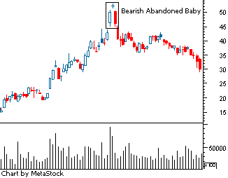

Candlestick patterns are an essential tool in technical analysis, providing traders with visual insights into market sentiment and potential price movements. Originating from Japanese rice trading techniques in the 18th century, these patterns depict market psychology and help traders make informed decisions. Among these, the bearish abandoned baby pattern is a significant indicator of a potential reversal from an uptrend to a downtrend.

The bearish abandoned baby pattern is particularly important due to its ability to signal a shift in market direction, which is critical for traders seeking to optimize their entry and exit points. Recognized by a distinctive formation of three candles, this pattern emphasizes market indecision followed by a potential bearish move. In technical analysis, identifying such patterns can enhance the predictive accuracy of market trends, while in algorithmic trading, they can be incorporated into automated strategies for improved trading efficiency.



This article is structured to provide a comprehensive understanding of the bearish abandoned baby pattern. The subsequent sections will elaborately discuss candlestick patterns, delve into the intricacies of the bearish abandoned baby, examine its role in technical analysis, and explore its application within algorithmic trading. By the end of this article, readers will acquire the knowledge to identify this pattern, understand its occurrences in historical data, and explore how it can be leveraged in both manual and algorithmic trading strategies.

The key learning objectives of this article include understanding the formation and significance of candlestick patterns, especially the bearish abandoned baby; recognizing the importance of technical analysis in predicting market movements; and integrating these insights into algorithmic trading strategies for enhanced trading performance. Through this exploration, traders are encouraged to expand their skillset and exploit these patterns to refine their trading approaches and achieve better market outcomes.

## Table of Contents

## Understanding Candlestick Patterns

Candlestick patterns play a significant role in technical analysis, providing a graphical representation of price movements in financial markets. These patterns are formed by grouping individual candlesticks together, each representing a specific time frame, and are used by traders to make decisions about potential future price directions.

Candlestick charts have a historical background dating back to the 17th century, originating from Japanese rice traders who used them to track market prices and daily momentum. The popularity of candlestick charts in Western markets began in the late 20th century, largely due to the introduction of these methods by Steve Nison. Candlesticks provide a comprehensive view of market sentiment by displaying the open, high, low, and close prices for a given period.

Traders leverage candlestick patterns to predict price movements based on historical price data. By analyzing these patterns, traders seek to identify trends and potential reversals in market movements. This predictive capability arises from recurring patterns that have been observed to follow certain price behaviors. Among the commonly used techniques is the identification of key patterns that suggest bullish (upward) or bearish (downward) trends.

Candlestick patterns are broadly categorized into two major types: bullish and bearish patterns. Bullish patterns signal potential price increases and suggest that traders might consider buying or expanding long positions. Conversely, bearish patterns indicate potential price decreases, prompting traders to sell or take short positions.

Moreover, candlestick patterns are further divided into reversal and continuation patterns. Reversal patterns indicate a potential change in the current price trend, signaling that the market may be poised to reverse its direction. For instance, a bullish reversal pattern could suggest a transition from a downtrend to an uptrend. On the other hand, continuation patterns suggest that the existing trend is likely to persist, providing reassurance to traders that the current market direction will continue.

In summary, candlestick patterns serve as a vital tool for traders in technical analysis by providing insights into market sentiment and aiding in the prediction of future price movements. The historical development and classification of these patterns into categories such as bullish or bearish, and further into reversal or continuation, help traders devise informed trading strategies.

## What is a Bearish Abandoned Baby Candlestick Pattern?

The bearish abandoned baby candlestick pattern is a notable figure among reversal chart patterns used in technical analysis, primarily to signal a potential reverse in an uptrend. This pattern consists of three distinct components in the order they appear on the chart: a bullish candle, a doji, and a bearish candle.

### Components of the Pattern

1. **First Candle**: The pattern initiates with a long bullish candlestick, reflecting a continuation of the prevailing uptrend. It indicates a strong buying pressure, as buyers are in control during this phase.

2. **Doji**: Following the first candle, a doji appears, characterized by a very small body and little to no difference between the open and close prices. The doji emerges with a noticeable gap above the first candle's close and the subsequent candle's open, which highlights a moment of indecision among market participants. The doji's significance lies in its ability to manifest a standoff between buyers and sellers, hinting at a potential shift in market sentiment.

3. **Third Candle**: The final component is a bearish candle, which opens with a gap below the doji's low, emphasizing a strong sell-off. This candlestick closes well into the body of the first candle, confirming the bearish reversal.

### Significance of the Doji

The doji is a central element in the bearish abandoned baby pattern due to its role in signaling market indecision. This neutrality suggests that the force driving the uptrend is losing [momentum](/wiki/momentum), providing an early indication that a trend reversal could be forthcoming. The presence of a doji surrounded by gaps on both sides creates a vivid representation of market participants' hesitance and the potential for significant price change.

### Illustration with Diagrams

To better understand this pattern, consider the following simplified diagram:

```
  Uptrend       Doji        Downtrend
|--------|               |--------|          |--------|
|   Bull  |   gap   |   Doji  |   gap   |   Bear  |
|--------|               |--------|          |--------|
```

This diagram shows the progression from a bullish candle through the doji and into the bearish confirmation candle.

### Comparison with Other Bearish Reversal Patterns

When compared to other bearish reversal patterns, such as the evening star or bearish engulfing, the bearish abandoned baby is distinguished by its unique gap-and-doji structure. Unlike the evening star, which may not have gap formations, or the bearish engulfing pattern that does not involve a doji, the abandoned baby pattern's specific criteria make it a rarer occurrence and potentially a more powerful signal of an impending reversal. Its reliance on gaps and the doji's indecision often makes it a reliable indicator of a sharp reversal when identified correctly on a chart.

In conclusion, the bearish abandoned baby pattern is an advanced candlestick structure that requires traders to diligently watch for gaps and indecisive dojis following strong uptrends, heralding potential downturns in price action. Understanding and identifying this pattern can be integral to enhancing one's technical analysis toolkit.

## Technical Analysis Using the Bearish Abandoned Baby Pattern

The Bearish Abandoned Baby candlestick pattern is a valuable tool in technical analysis, often used to signal potential reversals from bullish to bearish market trends. Identifying this pattern on charts involves recognizing a three-candle formation that typically signifies a shift in investor sentiment.

### Step-by-Step Guide on Identifying the Pattern

1. **Identification of the First Candle:**
   - The first candle is a tall, bullish candle that indicates sustained buying pressure. It is characterized by a large green body demonstrating that the closing price is significantly higher than the opening price for that session.

2. **Spotting the Doji:**
   - The second candle is a doji, which is a key component of the pattern. A doji is a candle where the open and close prices are virtually the same, reflecting indecision in the market. This doji should appear after a bullish gap, with no overlap with the body of the previous candle.

3. **Recognition of the Third Candle:**
   - The third candle is a bearish candle that opens below the doji, creating another gap. This candle should have a long red body indicating strong selling pressure, manifesting a complete reversal of momentum.

### Common Indicators and Signals

In conjunction with identifying the pattern, traders often utilize technical indicators to confirm the potential reversal suggested by the Bearish Abandoned Baby. Common indicators include:

- **Relative Strength Index (RSI):** Used to assess whether the asset is overbought before the pattern formation, thus confirming the likelihood of a downward reversal.
- **Moving Average Convergence Divergence (MACD):** A bearish crossover in MACD following the pattern can strengthen the prediction of a downtrend.

### Backtesting Examples with Historical Data

Backtesting this pattern involves analyzing historical price data to evaluate its past performance. The process typically includes:

```python
import pandas as pd
import matplotlib.pyplot as plt

# Load your historical data
data = pd.read_csv('historical_data.csv')

# Example function to identify Bearish Abandoned Baby Pattern
def detect_bearish_abandoned_baby(data):
    patterns = []
    for i in range(1, len(data)-1):
        prev_candle = data.iloc[i-1]
        doji = data.iloc[i]
        next_candle = data.iloc[i+1]

        if (prev_candle['Close'] > prev_candle['Open']) and \
           (abs(doji['Close'] - doji['Open']) <= (0.001 * doji['Close'])) and \
           (next_candle['Open'] < doji['Close']) and \
           (next_candle['Close'] < next_candle['Open']):
            patterns.append((prev_candle, doji, next_candle))

    return patterns

# Detect patterns
patterns = detect_bearish_abandoned_baby(data)

# Plot example pattern
for pattern in patterns:
    plt.figure(figsize=(10,5))
    plt.plot(pattern[0], label='First Candle')
    plt.plot(pattern[1], label='Doji')
    plt.plot(pattern[2], label='Third Candle')
    plt.legend()
    plt.show()
```

### Case Studies of Bearish Abandoned Baby Occurrences

In historical analysis, the Bearish Abandoned Baby pattern has frequently appeared before significant price declines. For instance, during the 2008 financial crisis, several stocks exhibited this pattern, indicating the start of a bearish trend. Such occurrences help highlight the pattern's predictive power when used with other market indicators and analysis tools.

### Reliability in Various Market Conditions

The reliability of the Bearish Abandoned Baby pattern can vary depending on the market conditions. It tends to be more effective in volatile markets where price gaps are more common, providing clearer signals of potential reversals. Conversely, in more stable, less volatile market environments, the pattern may occur less frequently and provide less robust signals. Therefore, traders should consider complementing this analysis with other strategies and risk management practices to enhance decision-making efficiency. 

Overall, incorporating the Bearish Abandoned Baby pattern into technical analysis can offer a strategic advantage, especially when combined with comprehensive market analysis and additional confirmation through technical indicators.

## Algorithmic Trading Strategies with Bearish Abandoned Baby

Algorithmic trading strategies involving the bearish abandoned baby pattern focus on incorporating this pattern into systematic approaches to trading. This section details the development of automated trading rules, evaluates the advantages and disadvantages of using candlestick patterns, and discusses [backtesting](/wiki/backtesting) and optimization strategies.

### Developing Automated Trading Rules

To integrate the bearish abandoned baby pattern into algorithmic strategies, traders need to develop precise trading rules. The pattern consists of three candles: a bullish candle, a doji, and a bearish candle. The automatic identification of these components is crucial, and it can be achieved using a set of conditions that defines their characteristics. For instance, an algorithm might define the doji as a candle where the open and close prices are within 5% of the total candle length.

A basic trading rule for this pattern might look like the following in Python:

```python
def is_bearish_abandoned_baby(data):
    first_candle = data[-3]
    doji = data[-2]
    third_candle = data[-1]

    if (first_candle['close'] > first_candle['open'] and  # bullish first candle
        abs(doji['open'] - doji['close']) < 0.05 * (doji['high'] - doji['low']) and  # doji
        third_candle['close'] < third_candle['open'] and  # bearish third candle
        third_candle['open'] < doji['low'] and  # gap down
        first_candle['close'] < third_candle['open']):  # bearish reversal
        return True
    return False
```

### Pros and Cons of Using Candlestick Patterns

The primary advantage of using candlestick patterns in [algorithmic trading](/wiki/algorithmic-trading) is their simplicity and ability to provide visual insights into market sentiment. They offer a straightforward method to identify potential market reversals without relying heavily on technical indicators.

However, candlestick patterns can be subjective, and their effectiveness can vary across different markets and conditions. This variability can pose challenges for automated trading, where consistency and accuracy in pattern recognition are critical.

### Backtesting and Optimization Strategies

A critical aspect of developing a robust algorithmic trading strategy is thorough backtesting. Traders can leverage historical data to evaluate the accuracy and reliability of the bearish abandoned baby pattern. The backtesting process involves simulating trades over a historical period to assess how the strategy would have performed.

During backtesting, it's important to apply optimization strategies to enhance performance. This involves testing various parameters, such as the minimum gap required between the doji and the third candle, to identify the most effective rules. This process helps in minimizing overfitting and ensures that the strategy is not excessively tailored to historical data that might not be indicative of future performance.

### Analyzing Hypothetical Performance

By applying backtesting and optimization, traders can analyze the hypothetical performance of a strategy that incorporates the bearish abandoned baby pattern. For instance, assessing metrics such as the Sharpe ratio, maximum drawdown, and win rate provides insights into the potential risks and returns involved. 

Ultimately, the integration of patterns like the bearish abandoned baby into systematic trading strategies holds potential for enhancing decision-making through automation. However, it requires careful consideration of pattern recognition accuracy, market suitability, and strategic robustness to realize its benefits effectively.

## Conclusion

The bearish abandoned baby candlestick pattern is a valuable tool in technical analysis, primarily for identifying potential reversal points in an uptrend. This pattern plays a crucial role in enhancing trading strategies by offering clear signals that a trend may be reversing, thereby enabling traders to make more informed decisions. By incorporating this candlestick pattern into their analysis, traders can potentially improve the timing of their entries and exits, thus optimizing trade outcomes.

Technical analysis and algorithmic trading offer traders methodologies to interpret market data with precision and speed. The bearish abandoned baby pattern, with its distinct configuration, is particularly suited for integration into algorithmic trading systems. Its clear signals and historical reliability make it an attractive element for developing automated trading rules. Traders are encouraged to balance human intuition with technological advancements by incorporating such patterns into their trading arsenal.

Continuous education and adaptation are critical to success in trading. Traders should actively seek to broaden their understanding of patterns like the bearish abandoned baby through further studies and practice. They can use resources such as [books](/wiki/algo-trading-books), online courses, and backtesting software to deepen their knowledge and refine their trading strategies. By continually updating their skills and strategies, traders can maintain a competitive edge in ever-evolving market conditions.

In essence, while the bearish abandoned baby pattern offers a specific tool for identifying trend reversals, its application and efficacy depend heavily on a trader’s commitment to learning and adaptation. The pursuit of knowledge and refinement of skills remains paramount in navigating the complexities of financial markets effectively.

## References and Further Reading

### List of Books and Publications on Candlestick Patterns and Technical Analysis

1. **"Japanese Candlestick Charting Techniques" by Steve Nison** - This book is considered a seminal work in the field of candlestick charting. It provides comprehensive insights into various candlestick patterns and their applications in modern trading.

2. **"Technical Analysis of the Financial Markets" by John J. Murphy** - A staple in the technical analysis literature, this book covers a broad array of concepts, including candlestick patterns, trend analysis, and other chart patterns.

3. **"Encyclopedia of Chart Patterns" by Thomas N. Bulkowski** - This publication offers detailed descriptions of numerous chart patterns, with statistical performance measures and trading tactics associated with each pattern.

### Links to Authoritative Websites and Online Courses on the Topic

1. [Investopedia](https://www.investopedia.com/) - Offers a wide range of articles and tutorials on candlestick patterns and technical analysis principles, making it a valuable resource for traders at all levels.

2. [BabyPips](https://www.babypips.com/) - Provides educational content tailored to beginners, including courses on candlestick patterns and technical trading strategies.

3. [Coursera](https://www.coursera.org/) - Features online courses from leading institutions which delve into technical analysis and trading strategies, with some courses specifically focusing on candlestick patterns.

### Recommended Software Tools for Analyzing Candlestick Patterns

1. **MetaTrader 4/5** - Popular trading platforms among forex traders, which offer various tools for analyzing candlestick patterns through their advanced charting capabilities.

2. **TradingView** - Known for its user-friendly interface and powerful charting tools, TradingView enables traders to analyze patterns in real time and share ideas within a community of traders.

3. **ThinkorSwim by TD Ameritrade** - Provides professional-level charting tools that are suited for both novice and experienced traders looking to analyze and trade candlestick patterns effectively.

### Research Papers on the Efficacy of Technical Analysis Patterns

1. **"The Predictive Power of the Candlestick Charting in the Emerging Equity Market of China"** - This study investigates the effectiveness of candlestick patterns in predicting stock movements within an emerging market context.

2. **"Candlestick Charting and the Reliable Prediction of Futures Market Trends"** - An academic paper that assesses the reliability and accuracy of candlestick patterns in forecasting trends within futures markets.

3. **"Evaluating the Performance of Technical Analysis in Speculative Markets"** - This research paper examines how technical analysis patterns, including candlestick patterns, perform in various speculative markets across the globe.

### Additional Resources for Algo Trading and Pattern Recognition

1. **"Algorithmic Trading and DMA: An Introduction to Direct Access Trading Strategies" by Barry Johnson** - Offers an in-depth look at algorithmic trading systems, focusing on direct market access strategies and pattern recognition.

2. **Kaggle** - A platform for data science competitions that frequently involves tasks related to algorithmic trading and pattern recognition, providing practical experience and community learning.

3. **GitHub** - A valuable resource for exploring open-source projects related to pattern recognition and algorithmic trading, where traders and developers share code and strategies.

These resources provide a robust foundation for both beginners and advanced traders aiming to enhance their understanding and application of candlestick patterns and technical analysis in trading.

## References & Further Reading

[1]: Nison, S. (1991). ["Japanese Candlestick Charting Techniques: A Contemporary Guide to the Ancient Investment Techniques of the Far East."](https://archive.org/details/japanesecandlest0000niso) New York Institute of Finance.

[2]: Murphy, J. J. (1999). ["Technical Analysis of the Financial Markets: A Comprehensive Guide to Trading Methods and Applications."](https://archive.org/details/technicalanalysi0000murp) New York Institute of Finance.

[3]: Bulkowski, T. N. (2005). ["Encyclopedia of Chart Patterns."](https://books.google.com/books/about/Encyclopedia_of_Chart_Patterns.html?id=zZAsEAAAQBAJ) Wiley.

[4]: Investopedia. ["Candlestick Patterns."](https://www.investopedia.com/trading/candlestick-charting-what-is-it/)

[5]: Gervais, S., Kaniel, R., & Mingelgrin, D. H. (2001). ["The High Volume Return Premium."](https://onlinelibrary.wiley.com/doi/full/10.1111/0022-1082.00349) The Review of Financial Studies, 14(4), 1045-1080.

[6]: Chan, E. (2009). ["Quantitative Trading: How to Build Your Own Algorithmic Trading Business."](https://github.com/ftvision/quant_trading_echan_book) Wiley.

[7]: Jansen, S. (2020). ["Machine Learning for Algorithmic Trading: Predictive Models to Extract Signals from Market and Alternative Data for Systematic Trading Strategies."](https://www.amazon.com/Machine-Learning-Algorithmic-Trading-alternative/dp/1839217715) Packt Publishing.