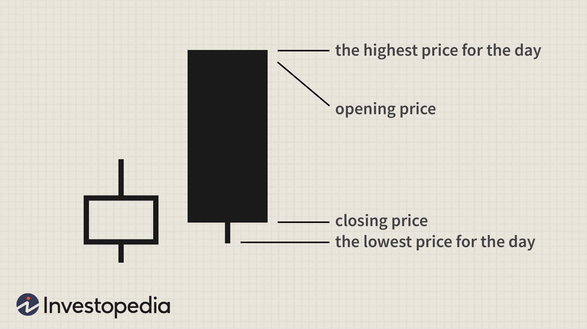

The stock market presents a multifaceted environment where traders constantly analyze data, trends, and signals to make informed, profit-driven decisions. Central to technical analysis within this landscape are candlestick patterns, graphical representations of price movements that provide insights into market dynamics. Among these patterns, the Bearish Belt Hold candlestick pattern is particularly noteworthy for its potential to indicate a reversal from a bullish trend to a bearish one. 

This article will provide an in-depth examination of the Bearish Belt Hold pattern, exploring its role and effectiveness in stock trading. Of particular interest is its application in algorithmic trading, a strategy that uses computer programs and algorithms to conduct trades at speeds and frequencies that are impossible for human traders. Algorithmic trading can automatically identify and execute trades when the Bearish Belt Hold pattern appears, potentially increasing trading efficiency and accuracy.



Integrating the Bearish Belt Hold pattern into trading strategies involves understanding its implications on market sentiment shifts. The pattern serves as a signal of changing sentiment, as control shifts from the buyers to the sellers, indicating a possible downturn. This shift is critical for traders looking to anticipate market movements and adjust their strategies accordingly.

By leveraging algorithmic trading, traders can programmatically detect the Bearish Belt Hold pattern and automate their response, allowing for quick and consistent actions based on the pattern's appearance. This automated approach can significantly enhance a trader's ability to capitalize on the opportunities presented by the pattern, reducing reaction times and human error.

In summary, the Bearish Belt Hold pattern, when effectively integrated into algorithmic trading strategies, can serve as a powerful tool for predicting shifts in market sentiment and improving trade outcomes. This article seeks to elucidate the nuances of the Bearish Belt Hold pattern and its strategic applications in today's evolving trading landscape.

## Table of Contents

## What is a Bearish Belt Hold Candlestick Pattern?

A Bearish Belt Hold is a distinct single candlestick pattern indicative of a potential reversal from a bullish to a bearish trend. This pattern is characterized by a long bearish candle, which signifies a marked shift in market dynamics. The defining trait of the Bearish Belt Hold is that it opens above the prior day's closing price, which typically happens during an uptrend. Upon opening at a high, the price declines consistently throughout the trading session, marking a close closer to the session low, with little or no upper shadow. The absence of an upper shadow suggests that the open was the highest point reached, indicating a decisive move by sellers overtaking buyers' control.

The Bearish Belt Hold pattern is recognized during periods of bullish [momentum](/wiki/momentum). It serves as a warning that market sentiment may be shifting towards bearishness. Traders interpreting this pattern must consider the context of the preceding trend; the pattern's significance is amplified when it appears during an extended uptrend, as it represents a potential exhaustion of buying pressure and a takeover by sellers. This pattern is not isolated and should be interpreted alongside other market indicators to validate its implications of a potential reversal.

## Backtesting the Bearish Belt Hold Pattern in Algo Trading

Backtesting is a critical procedure in [algorithmic trading](/wiki/algorithmic-trading), particularly when assessing the Bearish Belt Hold pattern as a signaling mechanism for potential market reversals. This process allows traders to evaluate the historical performance of the pattern over various market conditions and timeframes, thereby gauging its effectiveness and reliability.

To begin, [backtesting](/wiki/backtesting) involves collecting historical price data where the Bearish Belt Hold pattern is identified. The goal is to simulate trades based on this pattern in past market conditions to analyze potential outcomes. This retrospective analysis can highlight the strengths and weaknesses of relying on the pattern alone.

Traders can improve the reliability of the Bearish Belt Hold by incorporating other technical indicators. For instance, moving averages can help smooth out price data to identify trends over a continuum of prices, while the Relative Strength Index (RSI) can measure the speed and change of price movements, providing an additional layer of analysis to signal overbought or oversold market conditions. By combining these indicators, traders can filter and confirm signals, potentially reducing the risk of false positives.

Python, a widely-used programming language in financial analytics, offers numerous libraries and tools to facilitate backtesting. Libraries such as `pandas` for data manipulation, `numpy` for numerical calculations, and `matplotlib` for plotting data can be employed to process and visualize the results of backtesting efforts. Furthermore, specialized libraries like `[backtrader](/wiki/backtrader)` or `QuantConnect` provide frameworks specifically designed for backtesting trading strategies. 

Here is a simple example of how Python might be used to backtest a strategy involving the Bearish Belt Hold pattern:

```python
import pandas as pd
import bt  # An example backtesting library

# Load historical data into a pandas DataFrame
data = pd.read_csv('historical_stock_data.csv', parse_dates=True, index_col='Date')

# Define the strategy to check for Bearish Belt Hold pattern
def bearish_belt_hold_strategy(data):
    signals = pd.DataFrame(index=data.index)
    signals['signal'] = 0

    # Logic to detect Bearish Belt Hold
    signals['signal'] = ((data['Open'] > data['Close'].shift(1)) &
                         (data['Close'] < data['Open']) &
                         (data['High'] == data['Open']))

    return signals

# Backtesting the strategy
strategy = bt.Strategy('Bearish_Belt_Hold', [bt.algos.WeighTarget(bearish_belt_hold_strategy(data)),
                                             bt.algos.Rebalance()])

backtest = bt.Backtest(strategy, data)
result = bt.run(backtest)

# Analyze the backtest result
result.plot()
result.display()
```

This example shows how the Bearish Belt Hold pattern can be identified and tested within a historical dataset, allowing traders to gain quantifiable insights into its performance. Backtesting supports informed decision-making by providing empirical evidence to support or revise strategic approaches. The process, therefore, becomes an integral part of developing a robust trading strategy, enabling traders to adapt to dynamic market environments confidently.

## Implications of the Bearish Belt Hold Pattern in Market Sentiment

The appearance of a Bearish Belt Hold candlestick pattern can serve as an early indicator of a potential shift from bullish to bearish market sentiment. This phenomenon is often observed when traders begin reacting to increased selling pressure, leading to a decline in stock prices. As the pattern manifests during an uptrend, it suggests a possible change in market dynamics, where sellers start to overpower buyers, indicating a psychological change among market participants.

Despite its seemingly bearish implications, relying solely on this pattern for predicting future price movements is insufficient due to the inherent complexities of the financial markets. The market's multifaceted nature, influenced by numerous factors such as economic data releases, geopolitical events, and investor sentiment, can render the Bearish Belt Hold pattern less effective in isolation. Therefore, it is crucial for traders to integrate this candlestick pattern into a broader analytical framework, which should include a combination of technical and [fundamental analysis](/wiki/fundamental-analysis).

Incorporating technical indicators like moving averages and the Relative Strength Index (RSI) can enhance the pattern's reliability by offering additional context. For instance, confirming a Bearish Belt Hold pattern with a moving average crossover or an overbought signal from the RSI might provide a stronger indication of an impending trend reversal. Similarly, fundamental analysis can also play a vital role by considering the overall economic environment, industry conditions, and company-specific financial health.

Ultimately, the integration of the Bearish Belt Hold pattern within a comprehensive trading strategy can potentially lead to more informed decision-making and improved trading performance. By acknowledging the pattern's limitations and using it as a component of a larger evaluative process, traders can better navigate the complexities of market sentiment and adapt to evolving market conditions.

## Strategies for Implementing the Bearish Belt Hold in Algorithmic Trading

Successful trading often involves using the Bearish Belt Hold candlestick pattern as part of a broader strategy that incorporates additional technical indicators. By integrating this pattern with moving averages and the Relative Strength Index (RSI), traders can enhance the accuracy of their decision-making process. 

Moving averages can provide a smoother view of price trends by mitigating short-term fluctuations. For instance, a simple moving average (SMA) is calculated as follows:

$$
\text{SMA} = \frac{\sum_{i=1}^{N} P_i}{N}
$$

where $P_i$ is the price at the $i$-th time period and $N$ is the total number of periods. By examining where the Bearish Belt Hold occurs in relation to the moving average, traders can determine whether the pattern aligns with the broader market trend.

The Relative Strength Index (RSI) is another valuable tool, indicating whether a stock is overbought or oversold. It is calculated using:

$$
\text{RSI} = 100 - \frac{100}{1 + \frac{\text{Average Gain}}{\text{Average Loss}}}
$$

A Bearish Belt Hold occurring when the RSI is above 70 suggests a potential reversal, indicating overbought conditions.

Algorithmic trading systems can automate the detection and execution of trades based on these combined indicators, ensuring consistency and speed. For example, in Python, libraries like pandas and TA-Lib can facilitate this process. A simple Python code snippet might look like this:

```python
import pandas as pd
import talib

# Example data
data = pd.DataFrame({
    'Open': [...],
    'High': [...],
    'Low': [...],
    'Close': [...],
    'Volume': [...]
})

# Calculate SMA and RSI
data['SMA'] = talib.SMA(data['Close'], timeperiod=20)
data['RSI'] = talib.RSI(data['Close'], timeperiod=14)

# Identify Bearish Belt Hold conditions
bearish_belt_hold = (data['Open'] > data['Close'].shift(1)) & (data['Close'] < data['Open'])

# Signal when Bearish Belt Hold coincides with RSI > 70
trade_signals = bearish_belt_hold & (data['RSI'] > 70)
```

Backtesting these strategies under various market conditions is crucial to validating their effectiveness and understanding potential risks. By assessing historical data, traders can refine their parameters and optimize the performance of their algorithmic systems. Effective backtesting involves partitioning historical data into periods of different [volatility](/wiki/volatility-trading-strategies) levels and trends, ensuring robust strategy evaluation across diverse scenarios. This comprehensive approach helps traders account for market complexities while mitigating risks associated with false signals from the Bearish Belt Hold pattern.

## Considerations and Risks in Trading the Bearish Belt Hold

Trading the Bearish Belt Hold candlestick pattern involves several considerations and risks that traders should carefully evaluate to maximize their trading effectiveness and minimize potential losses. One of the primary risks associated with using the Bearish Belt Hold pattern is its susceptibility to generating false signals. This pattern, like many other technical indicators, can sometimes indicate a bearish reversal that does not materialize, especially in volatile markets where price movements are erratic and driven by factors beyond technical analysis.

Market volatility is a key [factor](/wiki/factor-investing) that can lead to unexpected outcomes, even when the Bearish Belt Hold pattern suggests a bearish sentiment. During periods of high volatility, external factors such as economic news, geopolitical events, or sudden changes in investor sentiment can override technical signals. Traders must be prepared for such situations, understanding that no single pattern can account for all possible market dynamics.

To mitigate the risks associated with trading the Bearish Belt Hold, implementing robust risk management strategies is crucial. One effective approach is the use of predefined stop-loss limits. A stop-loss order is designed to limit an investor's loss on a security position. For instance, traders can set a stop-loss at a certain percentage below the entry price, ensuring that potential losses are capped. The formula for a stop-loss price $P_s$ can be expressed as:
$$
P_s = P_e \times (1 - \text{SL\%})
$$
where $P_e$ is the entry price and $\text{SL\%}$ is the stop-loss percentage.

Moreover, traders should avoid over-reliance on a single pattern like the Bearish Belt Hold and instead strive for a diversified trading strategy that incorporates multiple indicators. This diversification can include combining the Bearish Belt Hold with other technical indicators, such as moving averages or the Relative Strength Index (RSI), to enhance the reliability of trading signals. By doing so, traders can achieve a more balanced view of market conditions and reduce the impact of false signals generated by any individual pattern.

In algorithmic trading, this diversification can be systematically implemented using code to ensure that multiple indicators are factored into the trading strategy. For example, a Python script could monitor various indicators and execute trades only when a confluence of signals aligns with the Bearish Belt Hold pattern:

```python
def execute_trade_if_conditions_met(candlestick_pattern, moving_average, rsi):
    if candlestick_pattern == "Bearish Belt Hold" and moving_average < threshold and rsi > overbought_level:
        execute_trade("sell")
```

In conclusion, while the Bearish Belt Hold candlestick pattern can be a useful tool in predicting market reversals, traders must be aware of its limitations and the risks of relying solely on this pattern. By employing comprehensive risk management strategies and integrating diverse indicators, traders can improve their decision-making processes and better navigate the uncertainties of financial markets.

## Conclusion

The Bearish Belt Hold candlestick pattern serves as a significant component in a trader's toolkit, offering insights into potential market reversals from bullish to bearish trends. When integrated with algorithmic trading, it can become even more powerful, providing automated detection and response capabilities that enhance trading efficiency. By incorporating this pattern into a well-rounded trading strategy, it's possible to achieve more reliable trading outcomes. Extensive backtesting is crucial to this process, as it helps to evaluate the pattern's historical performance and refine strategies accordingly.

However, traders must be aware of the limitations inherent to the Bearish Belt Hold pattern. No single candlestick pattern or signal can guarantee future market movements due to the complex nature of financial markets influenced by a myriad of factors. Thus, it is essential to employ this pattern within a broader analytical framework that encompasses additional technical indicators and fundamental analysis. This holistic approach can help mitigate the risk of false signals and overreliance on a single trading pattern.

Incorporating the Bearish Belt Hold within a comprehensive strategy allows traders to navigate volatile markets with higher confidence, contributing to a more nuanced and informed trading practice. By maintaining a balance between technical analysis and broader market insights, traders can better leverage the potential of the Bearish Belt Hold pattern to improve their trading success.

## References & Further Reading

[1]: Bergstra, J., Bardenet, R., Bengio, Y., & Kégl, B. (2011). ["Algorithms for Hyper-Parameter Optimization."](https://dl.acm.org/doi/10.5555/2986459.2986743) Advances in Neural Information Processing Systems 24.

[2]: ["Advances in Financial Machine Learning"](https://www.amazon.com/Advances-Financial-Machine-Learning-Marcos/dp/1119482089) by Marcos Lopez de Prado

[3]: ["Evidence-Based Technical Analysis: Applying the Scientific Method and Statistical Inference to Trading Signals"](https://www.amazon.com/Evidence-Based-Technical-Analysis-Scientific-Statistical/dp/0470008741) by David Aronson

[4]: ["Machine Learning for Algorithmic Trading"](https://github.com/stefan-jansen/machine-learning-for-trading) by Stefan Jansen

[5]: ["Quantitative Trading: How to Build Your Own Algorithmic Trading Business"](https://www.amazon.com/Quantitative-Trading-Build-Algorithmic-Business/dp/1119800064) by Ernest P. Chan