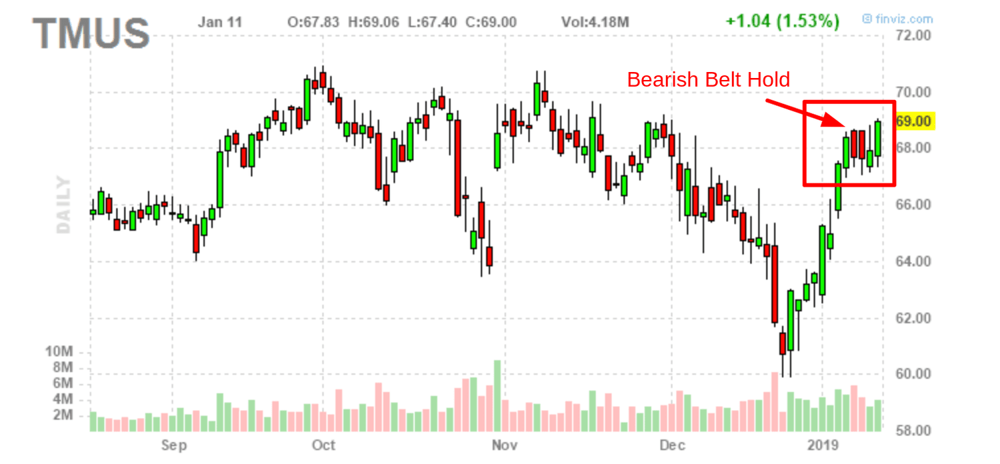

## Table of Contents

## What is a Bearish Belt Hold candlestick pattern?

A Bearish Belt Hold is a type of candlestick pattern that traders use to predict that a stock's price might go down. It looks like a long, filled (usually black or red) candlestick that appears after a period when the stock's price was going up. This pattern starts with the stock opening at its highest price of the day and then closing near its lowest price. This shows that sellers took control during the day, pushing the price down from its opening high.

When traders see a Bearish Belt Hold, they think it might be a good time to sell their stocks or avoid buying new ones. This pattern is more reliable if it happens after a long upward trend because it suggests that the trend might be changing. However, like all trading patterns, it's not perfect and should be used with other tools to make better decisions.

## How does a Bearish Belt Hold pattern form on a chart?

A Bearish Belt Hold pattern forms on a chart when a stock opens at its highest price of the day and then closes near its lowest price. Imagine the stock has been going up for a while, making higher highs and higher lows. Suddenly, on this particular day, the stock starts at the top but then sellers start selling a lot, pushing the price down all the way to the bottom by the end of the day. This creates a long, filled candlestick that looks like a belt holding the price down.

This pattern stands out because it shows a big change in how people feel about the stock. Before, everyone was buying and pushing the price up. But on the day of the Bearish Belt Hold, something changes, and sellers take over. The long body of the candlestick, with no upper shadow and just a small lower shadow, if any, makes it look like a belt. This pattern tells traders that the upward trend might be over, and it could be time to sell or wait before buying more.

## What are the key characteristics of a Bearish Belt Hold pattern?

A Bearish Belt Hold pattern is a long, filled candlestick that shows up after the stock has been going up. It starts when the stock opens at the highest price of the day. Then, throughout the day, the price falls a lot and ends up closing near the lowest price. This makes the candlestick look like a belt holding the price down. There is no upper shadow because the opening price was the highest, and there might be a small lower shadow if the closing price was not the absolute lowest.

This pattern is important because it shows that sellers took over from buyers on that day. When you see a Bearish Belt Hold, it means the upward trend might be ending, and it could be a good time to sell your stocks or wait before buying more. The longer the body of the candlestick, the stronger the signal that the trend might be changing. It's more reliable if it happens after a long time of the stock going up.

## In what market conditions is a Bearish Belt Hold pattern most likely to occur?

A Bearish Belt Hold pattern is most likely to occur in a market that has been going up for a while. Imagine the stock price has been climbing higher and higher, making people feel good about buying it. But then, suddenly, something changes. Maybe people start to think the stock is too expensive, or they hear bad news about the company. This change in how people feel can lead to a Bearish Belt Hold pattern.

When this pattern shows up, it means that on that day, the stock opened at its highest price but then fell a lot by the end of the day. It's like the sellers took over and pushed the price down. This pattern is a warning sign that the upward trend might be over. Traders pay attention to it because it can help them decide if it's time to sell their stocks or wait before buying more.

## How can a Bearish Belt Hold pattern be distinguished from similar patterns?

A Bearish Belt Hold pattern looks like a long, filled candlestick that shows up after the stock has been going up. It starts when the stock opens at the highest price of the day and then falls a lot by the end of the day, closing near the lowest price. This makes it different from other patterns because it has no upper shadow – the opening price was the highest – and only a small lower shadow, if any. It's like a belt holding the price down, which is why it's called a Bearish Belt Hold.

To tell it apart from similar patterns, like a Shooting Star or a Bearish Engulfing pattern, look at the shape and where it happens. A Shooting Star has a small body and a long upper shadow, showing that the price went up but then came back down. A Bearish Engulfing pattern is made of two candlesticks where the second one's body completely covers the first one's body, showing a shift from buying to selling. But a Bearish Belt Hold is unique because it's just one candlestick that opens at the high and closes near the low, right after an uptrend. This makes it a strong sign that the upward trend might be ending.

## What is the psychological interpretation behind a Bearish Belt Hold pattern?

A Bearish Belt Hold pattern shows what people are thinking about a stock. When you see this pattern, it means the stock started the day at its highest price but then fell a lot by the end of the day. This tells us that people who wanted to sell the stock got stronger than those who wanted to buy it. They pushed the price down because they thought the stock was too expensive or they heard bad news about the company. It's like everyone who was excited about the stock suddenly got worried and started selling.

This change in how people feel is important because it can signal that the time of the stock going up might be over. Traders look at this pattern to decide if they should sell their stocks or wait before buying more. It's a warning that the trend might be changing from going up to going down. When the pattern happens after the stock has been going up for a long time, it's a stronger sign that the sellers are taking over and the buyers are losing interest.

## What are the potential trading strategies when a Bearish Belt Hold pattern is identified?

When traders see a Bearish Belt Hold pattern, they might decide to sell their stocks. This pattern shows that the stock opened at its highest price of the day but then fell a lot by the end of the day. It means the sellers got stronger than the buyers, pushing the price down. So, if traders have stocks they bought when the price was going up, seeing this pattern might make them think it's time to sell before the price goes down even more. They might want to get out of the stock to avoid losing money if the downward trend continues.

Another strategy is to wait and see what happens next. Traders might not sell right away but keep an eye on the stock to see if the price keeps going down. They might set a stop-loss order, which is like telling the computer to sell the stock if it reaches a certain lower price. This way, they can limit how much money they might lose. If the price does keep going down after the Bearish Belt Hold, they can sell the stock at the stop-loss price. But if the price goes back up, they can keep the stock and maybe even buy more if they think it's a good deal.

Traders might also use the Bearish Belt Hold pattern along with other tools to make better decisions. For example, they might look at other patterns or use technical indicators like moving averages or the Relative Strength Index (RSI). By combining different tools, they can get a better idea of whether the Bearish Belt Hold is a strong sign that the stock's price will go down. This helps them decide if they should sell their stocks, wait and see, or even buy more if they think the pattern might be a false alarm.

## How reliable is the Bearish Belt Hold pattern as a predictor of future price movements?

The Bearish Belt Hold pattern can be a good sign that a stock's price might go down, but it's not perfect. It works best when it shows up after the stock has been going up for a long time. This pattern means the stock opened at its highest price of the day but then fell a lot by the end of the day, showing that sellers got stronger than buyers. Traders look at this pattern to decide if they should sell their stocks before the price drops more. But just like any pattern, it doesn't always work. Sometimes the price might go back up after a Bearish Belt Hold.

Because the Bearish Belt Hold pattern isn't always right, traders use other tools along with it to make better decisions. They might look at other patterns or use things like moving averages or the Relative Strength Index (RSI) to get a clearer picture. By combining different tools, traders can figure out if the Bearish Belt Hold is a strong sign that the price will go down or if it might be a false alarm. This helps them decide if they should sell their stocks, wait and see, or even buy more if they think the price might go up again.

## Can the Bearish Belt Hold pattern be used in conjunction with other technical indicators?

Yes, the Bearish Belt Hold pattern can be used with other technical indicators to make better trading decisions. When traders see this pattern, they might want to check other signs to see if the stock's price is really going to go down. For example, they might look at moving averages, which are lines on a chart that show the average price of the stock over time. If the stock's price is below a moving average after a Bearish Belt Hold, it could be a stronger sign that the price will keep going down.

Another tool traders might use is the Relative Strength Index (RSI), which tells them if a stock is overbought or oversold. If the RSI shows the stock is overbought and then a Bearish Belt Hold appears, it might mean the stock's price is more likely to drop. By looking at different indicators together, traders can get a clearer picture of what might happen next with the stock's price. This helps them decide if they should sell their stocks, wait and see, or even buy more if they think the price might go up again.

## What are the common pitfalls or misinterpretations when analyzing a Bearish Belt Hold pattern?

One common mistake traders make when looking at a Bearish Belt Hold pattern is thinking it always means the stock's price will go down. This pattern shows that the stock opened at its highest price of the day and then fell a lot by the end. But sometimes, the price might go back up after this pattern. Traders need to remember that no pattern is perfect and it doesn't always work. They should use other tools along with the Bearish Belt Hold to get a better idea of what might happen next.

Another pitfall is not paying attention to where the Bearish Belt Hold happens. This pattern is more likely to mean the price will go down if it shows up after the stock has been going up for a long time. If it appears when the stock's price is already going down or moving sideways, it might not be as strong a sign. Traders can make better decisions by looking at the bigger picture and using other indicators like moving averages or the Relative Strength Index (RSI) to see if the Bearish Belt Hold is a good sign that the price will drop.

## How does the effectiveness of a Bearish Belt Hold pattern vary across different time frames?

The effectiveness of a Bearish Belt Hold pattern can change depending on the time frame you're looking at. On shorter time frames, like a 1-minute or 5-minute chart, a Bearish Belt Hold might not be as strong a sign that the stock's price will go down. This is because short-term charts can have a lot of quick ups and downs, so the pattern might not mean as much. Traders using these short time frames need to be careful and use other tools to see if the pattern is a good sign of what might happen next.

On longer time frames, like a daily or weekly chart, a Bearish Belt Hold pattern can be more reliable. When you see this pattern after the stock has been going up for a while on a daily or weekly chart, it's a stronger sign that the price might start going down. This is because longer time frames show bigger trends, and the pattern means more when it shows a big change in how people feel about the stock. Traders often find it more useful to use the Bearish Belt Hold on these longer time frames because it gives them a better idea of what might happen to the stock's price in the future.

## What advanced techniques can be used to enhance the analysis of a Bearish Belt Hold pattern?

To enhance the analysis of a Bearish Belt Hold pattern, traders can use volume analysis. When a Bearish Belt Hold shows up, it's important to see if the trading volume was high on that day. High volume means more people were selling the stock, making the pattern a stronger sign that the price might go down. Traders can compare the volume on the day of the Bearish Belt Hold to the average volume over the past few weeks to see if it's really significant. If the volume is much higher than usual, it adds more weight to the pattern.

Another advanced technique is to use multiple time frame analysis. Traders can look at the Bearish Belt Hold on different time frames, like a 1-hour chart and a daily chart, to get a better understanding of the trend. If the pattern appears on both short-term and long-term charts, it's a stronger sign that the price might go down. Also, traders can use other technical indicators, like the Relative Strength Index (RSI) or moving averages, to see if they confirm the Bearish Belt Hold. If these indicators show the stock is overbought or the price is below a key moving average, it can make the pattern more reliable.

## What are the strategies for implementing the Bearish Belt Hold in algorithmic trading?

Successful trading often involves using the Bearish Belt Hold candlestick pattern as part of a broader strategy that incorporates additional technical indicators. By integrating this pattern with moving averages and the Relative Strength Index (RSI), traders can enhance the accuracy of their decision-making process. 

Moving averages can provide a smoother view of price trends by mitigating short-term fluctuations. For instance, a simple moving average (SMA) is calculated as follows:

$$
\text{SMA} = \frac{\sum_{i=1}^{N} P_i}{N}
$$

where $P_i$ is the price at the $i$-th time period and $N$ is the total number of periods. By examining where the Bearish Belt Hold occurs in relation to the moving average, traders can determine whether the pattern aligns with the broader market trend.

The Relative Strength Index (RSI) is another valuable tool, indicating whether a stock is overbought or oversold. It is calculated using:

$$
\text{RSI} = 100 - \frac{100}{1 + \frac{\text{Average Gain}}{\text{Average Loss}}}
$$

A Bearish Belt Hold occurring when the RSI is above 70 suggests a potential reversal, indicating overbought conditions.

Algorithmic trading systems can automate the detection and execution of trades based on these combined indicators, ensuring consistency and speed. For example, in Python, libraries like pandas and TA-Lib can facilitate this process. A simple Python code snippet might look like this:

```python
import pandas as pd
import talib

# Example data
data = pd.DataFrame({
    'Open': [...],
    'High': [...],
    'Low': [...],
    'Close': [...],
    'Volume': [...]
})

# Calculate SMA and RSI
data['SMA'] = talib.SMA(data['Close'], timeperiod=20)
data['RSI'] = talib.RSI(data['Close'], timeperiod=14)

# Identify Bearish Belt Hold conditions
bearish_belt_hold = (data['Open'] > data['Close'].shift(1)) & (data['Close'] < data['Open'])

# Signal when Bearish Belt Hold coincides with RSI > 70
trade_signals = bearish_belt_hold & (data['RSI'] > 70)
```

Backtesting these strategies under various market conditions is crucial to validating their effectiveness and understanding potential risks. By assessing historical data, traders can refine their parameters and optimize the performance of their algorithmic systems. Effective backtesting involves partitioning historical data into periods of different [volatility](/wiki/volatility-trading-strategies) levels and trends, ensuring robust strategy evaluation across diverse scenarios. This comprehensive approach helps traders account for market complexities while mitigating risks associated with false signals from the Bearish Belt Hold pattern.

## References & Further Reading

[1]: Bergstra, J., Bardenet, R., Bengio, Y., & Kégl, B. (2011). ["Algorithms for Hyper-Parameter Optimization."](https://dl.acm.org/doi/10.5555/2986459.2986743) Advances in Neural Information Processing Systems 24.

[2]: ["Advances in Financial Machine Learning"](https://www.amazon.com/Advances-Financial-Machine-Learning-Marcos/dp/1119482089) by Marcos Lopez de Prado

[3]: ["Evidence-Based Technical Analysis: Applying the Scientific Method and Statistical Inference to Trading Signals"](https://www.amazon.com/Evidence-Based-Technical-Analysis-Scientific-Statistical/dp/0470008741) by David Aronson

[4]: ["Machine Learning for Algorithmic Trading"](https://github.com/stefan-jansen/machine-learning-for-trading) by Stefan Jansen

[5]: ["Quantitative Trading: How to Build Your Own Algorithmic Trading Business"](https://www.amazon.com/Quantitative-Trading-Build-Algorithmic-Business/dp/1119800064) by Ernest P. Chan