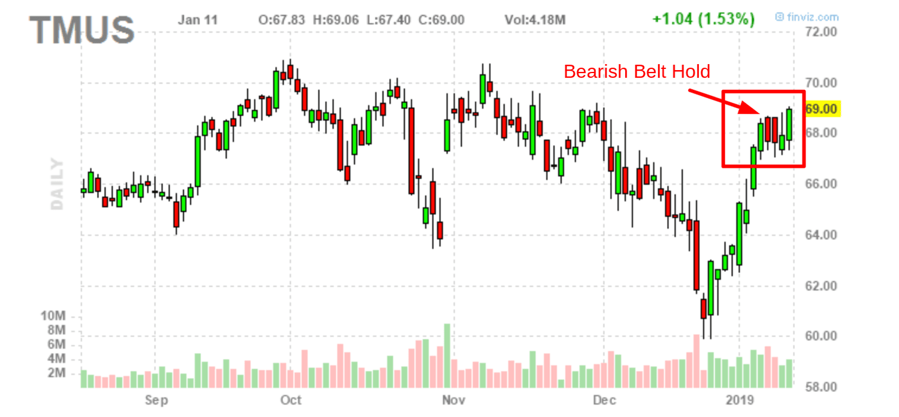

The Bearish Belt Hold candlestick pattern, a less frequently discussed tool among financial analysts and traders, serves as a vital signal for identifying possible bearish reversals during an uptrend. This pattern can be of particular importance in algorithmic trading, where detecting such reversals early can provide a competitive advantage. Algorithmic traders, who rely heavily on quantifiable and backtestable signals, find the Bearish Belt Hold invaluable for its potential predictive power.

This article provides a thorough examination of the Bearish Belt Hold pattern, emphasizing its practical applications in algorithmic trading. By understanding its defining features, traders can better harness the pattern to anticipate market shifts. The discussion includes a review of backtesting results to determine the pattern's success rate and reliability when used alone or in combination with other indicators. Additionally, the article analyzes the implications of the Bearish Belt Hold on market sentiment, offering insights into how this pattern can signal a shift from bullish to bearish outlooks.



Furthermore, strategies to effectively implement the pattern in algorithmic trading are presented. By using the Bearish Belt Hold in combination with complementary technical indicators and integrating it into a broader trading strategy, traders can better navigate market dynamics. These strategies also emphasize the importance of predefined risk management protocols to mitigate potential losses.

Finally, the article underscores considerations and risks associated with using the Bearish Belt Hold, cautioning against over-reliance on the pattern without proper context or robust testing. By adopting a comprehensive approach that includes a diversified strategy, traders can more effectively leverage the Bearish Belt Hold to their advantage in identifying bearish reversals.

## Table of Contents

## What is a Bearish Belt Hold Candlestick Pattern?

A Bearish Belt Hold is a single candlestick pattern that typically appears at the tail end of an uptrend, serving as a potential harbinger of a reversal in the market. This pattern is characterized by a solitary long bearish candlestick that opens with a noticeable gap down from the previous day's closing price. This initial gap signifies an immediate negative sentiment among sellers.

The visual structure of the Bearish Belt Hold pattern features a wide real body, which constitutes the primary portion of the candlestick. This real body is a critical element because it suggests substantial seller dominance throughout the trading period. Moreover, the pattern is distinguished by the minimal presence of an upper shadow, or the complete absence of one, further reinforcing the notion that selling pressure was prevalent, with buyers unable to elevate prices significantly during the session.

Traders often interpret the emergence of a Bearish Belt Hold as an early indication of a potential downturn in price trends. In practice, spotting this pattern may lead traders to anticipate a shift in market dynamics, prompting them to reassess their positions or prepare for possible bearish movements. However, as with all technical patterns, it is advisable for traders to corroborate this signal with additional technical analysis tools or indicators to mitigate the risk of false signals and improve the reliability of their trading decisions.

## Backtesting the Bearish Belt Hold Pattern in Algo Trading

Backtesting the Bearish Belt Hold Pattern in [algorithmic trading](/wiki/algorithmic-trading) is a crucial step in assessing its viability as a trading strategy. The process involves evaluating the pattern's historical performance across different market conditions and timeframes. This historical analysis can help traders understand whether the pattern genuinely provides an edge.

Despite its theoretical bearish implications, the Bearish Belt Hold pattern frequently exhibits low predictive success when used as a standalone signal. A single candlestick pattern, such as the Bearish Belt Hold, may not capture the market's complexity and often fails to account for the nuanced interplay of market forces. Factors such as market [volatility](/wiki/volatility-trading-strategies), economic events, and investor sentiment can influence the pattern's effectiveness.

To enhance the reliability of this pattern, algorithmic traders should consider integrating it with additional technical indicators. Strategies often include using the Bearish Belt Hold in conjunction with indicators like moving averages, Relative Strength Index (RSI), or other [momentum](/wiki/momentum) indicators. By combining multiple tools, traders can filter out false signals and improve trade timing.

Here is a simplified outline for [backtesting](/wiki/backtesting) the Bearish Belt Hold pattern using Python:

```python
import pandas as pd
import talib

# Assuming 'data' is a pandas DataFrame with 'Open', 'High', 'Low', 'Close' columns
def identify_bearish_belt_hold(data):
    # Detecting Bearish Belt Hold using candlestick patterns
    patterns = talib.CDLBELTHOLD(data['Open'], data['High'], data['Low'], data['Close'])
    return patterns

def backtest_strategy(data):
    # Add column for Bearish Belt Hold pattern signals
    data['BearishBeltHold'] = identify_bearish_belt_hold(data)

    # Define simple strategy: Short when Bearish Belt Hold pattern appears
    data['Buy_Signal'] = (data['BearishBeltHold'] < 0)

    # Calculate returns
    data['Daily_Return'] = data['Close'].pct_change()
    data['Strategy_Return'] = data['Daily_Return'] * data['Buy_Signal'].shift(1)

    # Return cumulative strategy returns
    return data['Strategy_Return'].cumsum()

# Sample usage
# data = pd.read_csv('historical_data.csv')
# strategy_returns = backtest_strategy(data)
# print(strategy_returns.tail())
```

This code snippet illustrates the basic framework for backtesting the Bearish Belt Hold pattern. The `talib.CDLBELTHOLD` function is used to identify the pattern within a financial time series. The strategy then generates a short signal when the pattern is detected, and calculates strategy returns.

Backtesting must be thorough, considering various market conditions, ranging markets, and trend-following scenarios. This approach will provide a more comprehensive understanding of the pattern's behavior in diverse environments. Moreover, algorithmic traders should understand the statistical significance of the backtest results to avoid overfitting and to ensure robustness.

Overall, while the Bearish Belt Hold has theoretical bearish implications, alone, it may not provide a reliable trading signal. An integrated approach, supplemented by comprehensive backtesting, is essential to augment the pattern's practical application in algorithmic trading systems.

## Implications of the Bearish Belt Hold Pattern in Market Sentiment

The Bearish Belt Hold candlestick pattern signifies a potential shift from bullish to bearish sentiment within the market. This transition typically manifests as increased selling pressure, stemming from traders' expectations that prices will decline. When this pattern emerges, it highlights a psychological shift where market participants, previously inclined to buy, become more inclined to sell, thereby fostering a downward momentum.

Upon appearing in an uptrend, the Bearish Belt Hold suggests that sellers are gaining strength and could indicate the exhaustion of buyers. The pattern is characterized by a long red candle that opens significantly above the prior close and quickly descends, showing that sellers took control from the outset and maintained dominance throughout the session. This decisive shift in control from buyers to sellers often causes traders to reassess their positions, potentially opting to liquidate long positions or initiate short ones.

Despite its clear bearish implications, the complexity of market dynamics necessitates caution. The Bearish Belt Hold pattern, like any technical indicator, is not infallible. Market sentiment can be influenced by numerous factors such as economic data releases, geopolitical events, or sudden market interventions, which can override technical signals. Therefore, while the pattern informs traders about a potential change in market sentiment, it is insufficient on its own to predict future price movements reliably.

To make informed trading decisions, it is prudent for traders to consider this pattern within a broader analytical context. By incorporating additional technical indicators or [fundamental analysis](/wiki/fundamental-analysis), traders can gain a more comprehensive understanding of market dynamics and enhance the robustness of their trading strategies.

## Strategies for Implementing the Bearish Belt Hold in Algorithmic Trading

Successful traders often utilize the Bearish Belt Hold pattern in conjunction with other technical indicators to enhance the reliability of their trading decisions. Combining this pattern with widely-used indicators such as moving averages, Relative Strength Index (RSI), and [volume](/wiki/volume-trading-strategy) analysis can provide a more comprehensive understanding of market conditions and potentially improve the accuracy of trading signals.

Integrating automated trading strategies that incorporate the Bearish Belt Hold pattern requires setting up precise triggers and well-defined risk management practices. One approach is to automate the identification of the pattern using candlestick recognition algorithms, which can be programmed to monitor specific price movements across the trading timeframe. Upon detection, these systems can execute predefined entry and [exit](/wiki/exit-strategy) strategies, complementing the Bearish Belt Hold with corroborative signals from other technical indicators.

For instance, a moving average crossover strategy could be employed to confirm the Bearish Belt Hold signal. Here, traders wait for the short-term moving average to cross below a long-term moving average after the appearance of the pattern, indicating potential downward momentum. This additional confirmation reduces the likelihood of acting on a false signal.

$$
\text{Signal Confirmation} = \begin{cases} 
\text{Sell}, & \text{if Short-MA} < \text{Long-MA and BBH detected} \\
\text{Hold}, & \text{otherwise}
\end{cases}
$$

Relative Strength Index (RSI) is another useful tool for verifying bearish trends. A high RSI value, typically above 70, alongside the Bearish Belt Hold pattern, might suggest an overbought condition, indicating a potential market reversal.

Incorporating volume analysis involves evaluating the trading volume that accompanies the Bearish Belt Hold pattern. High trading volumes on the pattern day may suggest strong bearish sentiment, potentially strengthening the validity of the signal.

Backtesting is crucial for developing effective trading strategies based on the Bearish Belt Hold pattern. Running historical simulations allows traders to assess how these strategies perform across different market conditions. For instance, traders might explore short-selling strategies following the Bearish Belt Hold pattern when other bearish indicators provide confirmation or when there is a notable increase in trading volume.

In Python, a simplified approach to automate and backtest such strategies can be achieved using libraries such as `pandas` for data manipulation, `TA-Lib` for technical analysis, and `[backtrader](/wiki/backtrader)` for strategy testing. Below is a basic implementation to detect the Bearish Belt Hold pattern and incorporate RSI confirmation:

```python
import pandas as pd
import talib as ta
import backtrader as bt

# Load price data
data = pd.read_csv('market_data.csv', parse_dates=True, index_col='Date')
close_prices = data['Close']
open_prices = data['Open']

# Calculate RSI
rsi = ta.RSI(close_prices, timeperiod=14)

# Define strategy
class BBHStrategy(bt.Strategy):
    def next(self):
        # Identify Bearish Belt Hold
        if open_prices[0] > close_prices[-1] and close_prices[0] < open_prices[0]:
            # RSI confirmation
            if rsi[0] > 70:
                self.sell()

# Backtesting
cerebro = bt.Cerebro()
cerebro.addstrategy(BBHStrategy)
cerebro.run()
```

Using these strategies, traders can systematically integrate the Bearish Belt Hold pattern into their algorithmic trading systems, ensuring a robust risk management framework and increasing the likelihood of achieving favorable trading outcomes.

## Considerations and Risks in Trading the Bearish Belt Hold

When trading the Bearish Belt Hold candlestick pattern, algorithmic traders must exercise caution due to the potential for false signals, especially in volatile or unpredictable markets. The pattern, while indicative of a potential bearish reversal, can be unreliable if used in isolation. This stems from the inherent noise in market data and the varying contexts in which this pattern may appear. As a result, the pattern might sometimes indicate a reversal that doesn't materialize, leading to potential losses if acted upon prematurely. 

To mitigate these risks, traders should avoid relying solely on the Bearish Belt Hold pattern without comprehensive backtesting. Backtesting involves evaluating the pattern against historical data under different market conditions to assess its predictive accuracy and reliability. This process can help in understanding the pattern's behavior and effectiveness as a trading signal across various scenarios. Traders might employ tools such as the following Python code snippet to perform backtesting on historical candlestick data:

```python
import pandas as pd

# Sample function to identify Bearish Belt Hold patterns in historical data
def identify_bearish_belt_hold(data):
    bearish_belt_hold = []
    for i in range(1, len(data)):
        # Condition for identifying the bearish belt hold candlestick
        if data['Close'][i] < data['Open'][i] and data['Open'][i] > data['Close'][i-1]:
            bearish_belt_hold.append((i, data['Close'][i], data['Open'][i]))
    return bearish_belt_hold

# Example usage with Pandas DataFrame of candlestick data
data = pd.DataFrame({
    'Open': [100, 105, 107, 108],
    'High': [106, 107, 110, 109],
    'Low': [97, 98, 105, 104],
    'Close': [102, 100, 104, 103]
})

patterns = identify_bearish_belt_hold(data)
print(patterns)
```

Furthermore, integrating the Bearish Belt Hold pattern into a diversified trading strategy with other technical indicators and robust risk management practices is crucial. Indicators such as moving averages, Relative Strength Index (RSI), and volume analysis can provide additional confirmation and context, potentially improving the pattern's reliability. For example, a Bearish Belt Hold pattern may be more significant if it coincides with an RSI indicating overbought conditions or with a crossover of a moving average.

Risk management remains a critical component when using this pattern. Traders should establish predefined limits for potential losses and take evidence-based actions to mitigate risks associated with unexpected market movements. This might entail setting stop-loss orders or using options to hedge against adverse price shifts.

By adopting a broader view and incorporating the Bearish Belt Hold within a comprehensive trading strategy, traders can enhance their ability to navigate market dynamics effectively while minimizing exposure to false signals and unforeseen market volatility.

## Conclusion

The Bearish Belt Hold candlestick pattern can serve as a useful tool in a trader’s arsenal, particularly when incorporated into a holistic algorithmic trading system. However, traders must recognize the limitations inherent in this pattern. Extensive backtesting is crucial to assess its efficacy, as market conditions and datasets can vary widely. Such testing should aim to identify scenarios where the pattern is most predictive, providing insights into its strengths and weaknesses.

Integrating the Bearish Belt Hold with complementary trading strategies is vital for maximizing its potential as a bearish reversal signal. For instance, combining it with technical indicators like moving averages or the Relative Strength Index (RSI) can provide confirmation and reduce the likelihood of false signals. Additionally, well-established risk management practices are essential to mitigate potential losses, especially in volatile markets.

By employing a comprehensive approach that blends the Bearish Belt Hold with other indicators and strategies, traders can better navigate the complexities of the market and enhance their chances of successfully exploiting bearish reversals. This thoughtful integration makes it possible to capitalize not only on the signal itself but also on broader market trends, thereby improving overall trading performance.

## References & Further Reading

[1]: Bergstra, J., Bardenet, R., Bengio, Y., & Kégl, B. (2011). ["Algorithms for Hyper-Parameter Optimization."](https://dl.acm.org/doi/10.5555/2986459.2986743) Advances in Neural Information Processing Systems 24.

[2]: ["Advances in Financial Machine Learning"](https://www.amazon.com/Advances-Financial-Machine-Learning-Marcos/dp/1119482089) by Marcos Lopez de Prado

[3]: ["Evidence-Based Technical Analysis: Applying the Scientific Method and Statistical Inference to Trading Signals"](https://www.amazon.com/Evidence-Based-Technical-Analysis-Scientific-Statistical/dp/0470008741) by David Aronson

[4]: ["Machine Learning for Algorithmic Trading"](https://github.com/stefan-jansen/machine-learning-for-trading) by Stefan Jansen

[5]: ["Quantitative Trading: How to Build Your Own Algorithmic Trading Business"](https://books.google.com/books/about/Quantitative_Trading.html?id=j70yEAAAQBAJ) by Ernest P. Chan