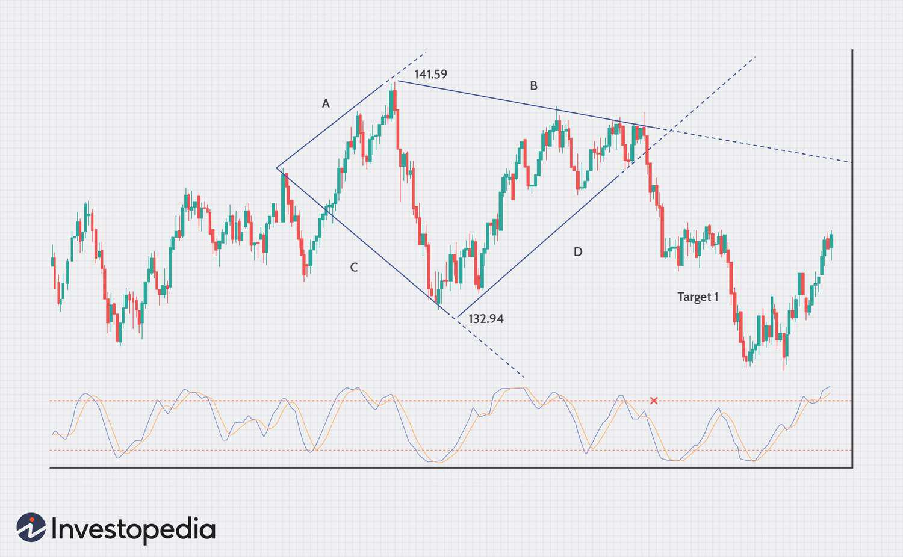

## Table of Contents

## What is a Bearish Diamond Formation in technical analysis?

A Bearish Diamond Formation is a pattern that traders see on stock charts. It shows that the price of a stock might go down soon. The pattern looks like a diamond shape. It starts with the price going up and down in a wider range, then the range gets smaller until it forms a point. This pattern usually happens after the price has been going up for a while.

When traders see a Bearish Diamond Formation, they think it's a good time to sell their stocks. This is because the pattern suggests that the price will drop after the diamond shape is complete. The price usually goes down quickly after the pattern finishes. Traders use this pattern to help them decide when to sell and make money before the price falls.

## How can you identify a Bearish Diamond Formation on a chart?

To spot a Bearish Diamond Formation on a chart, first look for a period where the price of the stock has been going up. After this upward trend, you'll see the price start to move up and down in a wider range, forming what looks like a broadening pattern. This is the first part of the diamond shape. It's like the price is swinging more wildly as it tries to keep going up but can't quite do it.

Next, watch as the price movements start to narrow down. The swings get smaller and smaller, creating a diamond shape on the chart. This narrowing happens because the price can't keep going up and starts to fall back down. When the price breaks out of the bottom of this diamond, it's a sign that the price will likely keep falling. So, if you see this pattern after a price increase, it might be time to think about selling your stock before the price drops.

## What are the key components of a Bearish Diamond Formation?

The first key part of a Bearish Diamond Formation is the broadening pattern that comes after a price increase. This happens when the price starts to swing up and down in a wider range. It looks like the price is trying to keep going up but can't quite do it, so it starts to move more wildly. This part of the pattern is important because it shows that the upward trend is losing strength.

The second key part is the narrowing pattern that follows the broadening one. After the price swings get wider, they start to get smaller and smaller, forming a diamond shape on the chart. This narrowing happens because the price can't keep going up and starts to fall back down. When the price finally breaks out of the bottom of this diamond, it's a strong sign that the price will keep falling. This is why traders watch for this pattern to decide when to sell their stocks before the price drops.

## What does a Bearish Diamond Formation indicate about market trends?

A Bearish Diamond Formation on a chart tells us that the market might start going down soon. This pattern shows up after the price of a stock has been going up for a while. When you see the price start to swing up and down in a wider range and then get smaller until it makes a diamond shape, it means the upward trend is getting weaker. The diamond shape is like a warning sign that the price can't keep going up anymore.

Once the price breaks out of the bottom of the diamond, it's a strong hint that the price will keep falling. Traders look for this pattern because it helps them know when it's a good time to sell their stocks before the price drops. So, if you see a Bearish Diamond Formation, it's a sign that the market trend is shifting from going up to going down.

## How reliable is the Bearish Diamond Formation as a trading signal?

The Bearish Diamond Formation can be a helpful signal for traders, but it's not perfect. It's seen as a good sign that the price of a stock might go down soon. Many traders trust this pattern because it has worked well in the past. But, like any pattern in trading, it doesn't always work. Sometimes the price might not drop as expected after the diamond shape is complete. So, it's smart to use this pattern along with other signs and tools to make better trading choices.

It's also important to remember that the stock market can be unpredictable. Even if a Bearish Diamond Formation looks clear on a chart, other things can affect the price. News, big events, or changes in the economy can make the price do something different than what the pattern suggests. That's why it's a good idea to not rely only on this one pattern. Using it with other ways to look at the market can help traders make more reliable decisions.

## Can you explain the psychology behind the formation of a Bearish Diamond?

The Bearish Diamond Formation shows what people are thinking and feeling about a stock. At first, the price goes up because lots of people want to buy the stock. They think it will keep going up, so they keep buying. But then, some people start to think the price is too high and might go down. This makes the price start to swing up and down more, creating the wider part of the diamond. It's like some people are still buying, hoping for more gains, while others are selling because they're worried.

As more people start to doubt the stock, the price swings get smaller and smaller, forming the diamond shape. This happens because fewer people are buying, and more are selling. They think the price won't go up anymore and might drop soon. When the price finally breaks out of the bottom of the diamond, it's a sign that most people believe the price will go down. This is why traders see the Bearish Diamond as a warning to sell their stocks before the price falls.

## What are the entry and exit points when trading based on a Bearish Diamond Formation?

When you see a Bearish Diamond Formation on a chart, the best time to enter a trade, or sell your stock, is right after the price breaks out of the bottom of the diamond. This [breakout](/wiki/breakout-trading) is a strong sign that the price will keep going down. So, you should sell your stock as soon as you see the price move below the bottom line of the diamond. This way, you can get out before the price drops even more.

The [exit](/wiki/exit-strategy) point, or when you should stop trading, depends on how much you think the price will fall. A good rule is to set a target for how low you think the price will go. This target can be about as far down as the height of the diamond shape. Once the price reaches this target, you can close your trade and take your profit. But, if the price starts to go up again instead of down, you should also stop trading to avoid losing money. Always keep an eye on the price and be ready to exit if things don't go as planned.

## How does volume play a role in confirming a Bearish Diamond Formation?

Volume is important when looking at a Bearish Diamond Formation because it helps confirm if the pattern is real. When the price is making the wider part of the diamond, the [volume](/wiki/volume-trading-strategy) should be high. This shows that a lot of people are trading, and some are still buying while others are starting to sell. As the price swings get smaller and form the diamond shape, the volume should start to drop. This lower volume means fewer people are buying, and more are selling because they think the price won't go up anymore.

When the price finally breaks out of the bottom of the diamond, the volume should go up again. This higher volume confirms that the breakout is strong and that a lot of people believe the price will go down. If the volume doesn't go up when the price breaks out, the Bearish Diamond Formation might not be as reliable. So, watching the volume helps traders know if it's really time to sell their stocks before the price drops.

## What are common mistakes traders make when interpreting a Bearish Diamond Formation?

One common mistake traders make when looking at a Bearish Diamond Formation is jumping into a trade too early. They might see the diamond shape starting to form and think it's time to sell right away. But the best time to sell is after the price breaks out of the bottom of the diamond. If traders sell too soon, they might miss out on more gains or even lose money if the price doesn't drop as expected.

Another mistake is not paying attention to the volume. Volume is important because it shows how many people are trading. If the volume doesn't go up when the price breaks out of the diamond, the pattern might not be as strong. Traders who ignore volume might think the Bearish Diamond is a sure sign to sell, but without the right volume, it's not as reliable. So, always check the volume to make sure the pattern is confirmed before making a trade.

## How does the Bearish Diamond Formation differ from other bearish patterns like the Head and Shoulders?

The Bearish Diamond Formation and the Head and Shoulders pattern both tell traders that a stock's price might go down soon, but they look different on a chart. The Bearish Diamond starts with the price going up and down in a wider range, then the swings get smaller until they form a diamond shape. After the diamond is complete, the price breaks out of the bottom, signaling that it's time to sell. On the other hand, the Head and Shoulders pattern has three peaks: two smaller ones on the sides (the shoulders) and a bigger one in the middle (the head). When the price falls below the line connecting the lows of the two shoulders, it's a sign to sell.

The main difference between these patterns is how they form and what they show about the market. The Bearish Diamond shows that the price can't keep going up and starts to fall back down, creating a diamond shape. This pattern often happens after a strong upward trend and suggests a quick drop in price. The Head and Shoulders pattern, however, shows that the price tries to go up three times but fails to reach the same high each time. This pattern can take longer to form and suggests a more gradual decline in price. Both patterns help traders know when to sell, but they give different clues about how fast and how much the price might fall.

## What are some advanced strategies for trading the Bearish Diamond Formation?

One advanced strategy for trading the Bearish Diamond Formation is to use other indicators to confirm the pattern. For example, you can look at the Relative Strength Index (RSI) or the Moving Average Convergence Divergence (MACD) to see if they also show that the price might go down. If these indicators agree with the Bearish Diamond, it makes the signal stronger. You can also use support and resistance levels to find good places to set your sell orders. If the price breaks out of the diamond and hits a key support level, it might be a good time to sell because the price could drop even more.

Another strategy is to manage your risk carefully. You can set a stop-loss order just above the top of the diamond to limit how much money you could lose if the price goes up instead of down. This way, if the pattern doesn't work out, you won't lose too much. Also, you can use a trailing stop to lock in profits as the price falls. This means you move your stop-loss order down as the price drops, so you can keep some of your gains even if the price starts to go back up. By combining the Bearish Diamond Formation with other tools and good risk management, you can make better trading decisions.

## Can the Bearish Diamond Formation be used in conjunction with other technical indicators for better results?

Yes, using the Bearish Diamond Formation with other technical indicators can help traders make better decisions. For example, you can look at the Relative Strength Index (RSI) or the Moving Average Convergence Divergence (MACD). If these indicators also show that the price might go down, it makes the Bearish Diamond signal stronger. You can also use support and resistance levels to find good places to set your sell orders. If the price breaks out of the diamond and hits a key support level, it might be a good time to sell because the price could drop even more.

Another way to use the Bearish Diamond Formation with other indicators is to manage your risk carefully. You can set a stop-loss order just above the top of the diamond to limit how much money you could lose if the price goes up instead of down. This way, if the pattern doesn't work out, you won't lose too much. Also, you can use a trailing stop to lock in profits as the price falls. This means you move your stop-loss order down as the price drops, so you can keep some of your gains even if the price starts to go back up. By combining the Bearish Diamond Formation with other tools and good risk management, you can make better trading decisions.

## What is the Role of Price Oscillators?

Price oscillators such as the Relative Strength Index (RSI), Moving Average Convergence Divergence (MACD), and Commodity Channel Index (CCI) play a crucial role in the validation of diamond patterns in trading. These oscillators assess market [momentum](/wiki/momentum), providing critical signals on whether a market is overbought or oversold. This information is vital for traders seeking to verify diamond formations, particularly in bearish trends, where accurate identification can lead to successful trading decisions.

1. **RSI (Relative Strength Index):** The RSI is a popular momentum oscillator that measures the speed and change of price movements. The RSI oscillates between 0 and 100, with readings above 70 traditionally indicating an overbought condition and readings below 30 signaling an oversold condition. When a diamond pattern forms, an RSI exceeding 70 could corroborate the sign of a market reversal, supporting the bearish prediction.

   **Formula:**
$$
   RSI = 100 - \left( \frac{100}{1 + \frac{\text{Average Gain}}{\text{Average Loss}}} \right)

$$

2. **MACD (Moving Average Convergence Divergence):** The MACD is a trend-following oscillator that reveals the relationship between two moving averages of a security’s price. It is calculated by subtracting the 26-period Exponential Moving Average (EMA) from the 12-period EMA. A nine-day EMA of the MACD, called the signal line, is then plotted on top to act as a trigger for buy or sell signals. In a bearish diamond scenario, the MACD crossing below the signal line can further confirm a downward trend.

   **Python Example:**
   ```python
   import pandas as pd

   def calculate_macd(data):
       short_ema = data['Close'].ewm(span=12, adjust=False).mean()
       long_ema = data['Close'].ewm(span=26, adjust=False).mean()
       macd = short_ema - long_ema
       signal = macd.ewm(span=9, adjust=False).mean()
       return macd, signal
   ```

3. **CCI (Commodity Channel Index):** The CCI measures the current price level relative to an average price over a specified period. High positive CCI values suggest that a price is well above its average, while low negative values indicate that the price is far below its average. When a bearish diamond is identified, a high CCI value may signal an impending price decline.

   **Formula:**
$$
   CCI = \frac{\text{Typical Price} - \text{SMA}}{0.015 \times \text{Mean Deviation}}

$$
   Where Typical Price is the average of high, low, and close prices, and SMA is the simple moving average.

Incorporating these oscillators into trading strategies not only aids in confirming diamond formations but also filters out potential false signals. This ensures greater accuracy in predicting trend reversals. For [algorithmic trading](/wiki/algorithmic-trading), these oscillators can be integrated into algorithms to automate the decision-making process, providing traders with timely insights and the agility to respond rapidly to market changes. The synergistic effect of oscillators converging with price movements enhances the precision of forecasts, maximizing potential profitability for traders leveraging diamond patterns.

## References & Further Reading

[1]: Bulkowski, T. (2005). ["Encyclopedia of Chart Patterns, Second Edition"](https://www.amazon.com/Encyclopedia-Chart-Patterns-Thomas-Bulkowski/dp/0471668265). John Wiley & Sons.

[2]: Aronson, D. R. (2011). ["Evidence-Based Technical Analysis: Applying the Scientific Method and Statistical Inference to Trading Signals"](https://www.amazon.com/Evidence-Based-Technical-Analysis-Scientific-Statistical/dp/0470008741). Wiley Trading Series.

[3]: Pring, M. J. (2002). ["Technical Analysis Explained, Fifth Edition: The Successful Investor's Guide to Spotting Investment Trends and Turning Points"](https://www.amazon.com/Technical-Analysis-Explained-Fifth-Successful/dp/0071825177). McGraw-Hill Education.

[4]: Murphy, J. J. (1999). ["Technical Analysis of the Financial Markets: A Comprehensive Guide to Trading Methods and Applications"](https://archive.org/details/technicalanalysi0000murp). New York Institute of Finance.

[5]: De Prado, M. L. (2018). ["Advances in Financial Machine Learning"](https://www.amazon.com/Advances-Financial-Machine-Learning-Marcos/dp/1119482089). Wiley.