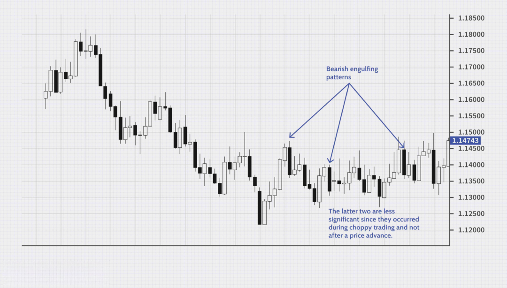

## Table of Contents

## What is a Bearish Engulfing Pattern?

A Bearish Engulfing Pattern is a type of candlestick pattern that traders use to predict a possible drop in a stock's price. It happens when a small green (or white) candlestick, which shows the price went up that day, is followed by a larger red (or black) candlestick. The red candlestick "engulfs" the green one, meaning its body completely covers the body of the green candlestick. This pattern often appears at the end of an uptrend and suggests that the buyers are losing control and the sellers are taking over.

When traders see a Bearish Engulfing Pattern, they might decide to sell their stocks or even short sell, expecting the price to go down. It's important to look at other signs and not just rely on this pattern alone because sometimes the market can still go up after this pattern appears. But many traders find it a useful tool to help them make decisions about when to sell.

## How does a Bearish Engulfing Pattern form on a chart?

A Bearish Engulfing Pattern forms on a chart when you see two candles in a row. The first candle is small and green, showing that the price went up a little that day. This green candle is part of an ongoing uptrend where the price has been going up for some time. The second candle is bigger and red, and it completely covers or "engulfs" the body of the first green candle. This means the price went down a lot more than it went up the day before, showing that sellers are now in control.

When you see this pattern, it usually happens at the top of an uptrend. The first green candle shows that buyers were still trying to push the price up, but then the big red candle shows that sellers came in strong and pushed the price down more than the buyers had pushed it up. This change from a small green candle to a big red one can be a sign that the trend might be about to change from going up to going down. Traders watch for this pattern because it can help them decide when to sell their stocks before the price drops even more.

## What are the key components of a Bearish Engulfing Pattern?

The key components of a Bearish Engulfing Pattern are two candles that show a change in the market's direction. The first candle is small and green, which means the price went up a little bit that day. This green candle is part of an uptrend, where the price has been going up for a while. The second candle is big and red, and it completely covers the body of the first green candle. This means the price went down a lot more than it went up the day before.

This pattern usually happens at the top of an uptrend. The small green candle shows that buyers were still trying to push the price up, but then the big red candle shows that sellers came in strong and pushed the price down more than the buyers had pushed it up. This change from a small green candle to a big red one can be a sign that the trend might be about to change from going up to going down. Traders watch for this pattern because it can help them decide when to sell their stocks before the price drops even more.

## Can you explain the significance of a Bearish Engulfing Pattern in trading?

A Bearish Engulfing Pattern is important for traders because it can show that a stock's price might start going down soon. This pattern happens when a small green candle, which means the price went up a little, is followed by a big red candle that covers the green one. This big red candle means the price went down a lot more than it went up the day before. When traders see this, they think it might be a good time to sell their stocks because the price could keep going down.

Traders use this pattern to help them decide what to do with their stocks. If they see a Bearish Engulfing Pattern at the end of an uptrend, it might mean that the trend is about to change. This can help them avoid losing money if the price does go down. But, it's important not to just look at this pattern alone. Traders should also look at other signs and information to make the best decisions.

## How reliable is a Bearish Engulfing Pattern as a bearish signal?

A Bearish Engulfing Pattern is seen as a pretty good sign that a stock's price might start to go down. It happens when a small green candle, which means the price went up a little, is followed by a big red candle that covers the green one. This shows that sellers are now stronger than buyers, and it often comes at the end of a time when the price has been going up. Traders pay attention to this pattern because it can help them decide when to sell their stocks before the price drops more.

However, the Bearish Engulfing Pattern isn't perfect and doesn't always mean the price will go down. Sometimes, even after this pattern appears, the price can keep going up. That's why traders need to look at other things too, like what the market is doing overall and other patterns or signs. By using the Bearish Engulfing Pattern along with other information, traders can make better decisions about when to sell their stocks.

## What are the ideal market conditions for a Bearish Engulfing Pattern to be considered valid?

A Bearish Engulfing Pattern is most reliable when it happens at the top of an uptrend. This means the stock's price has been going up for a while before the pattern appears. The small green candle shows that buyers were still trying to push the price higher, but then the big red candle shows that sellers came in strong and pushed the price down more than the buyers had pushed it up. This change can signal that the trend might be about to turn from going up to going down.

For the pattern to be considered valid, it's also important to look at other things happening in the market. The overall market should be showing signs that it might be getting weaker. If other stocks or the whole market are also starting to go down, it makes the Bearish Engulfing Pattern more likely to be a good sign that the price will keep falling. Traders should also check other technical indicators and patterns to make sure the signal is strong before deciding to sell their stocks.

## How can traders use a Bearish Engulfing Pattern in their trading strategy?

Traders can use a Bearish Engulfing Pattern as a signal to sell their stocks or even short sell, expecting the price to go down. When they see a small green candle followed by a big red candle that completely covers it, it shows that sellers are now stronger than buyers. This pattern often comes at the end of an uptrend, which means the stock's price has been going up for a while. By recognizing this pattern, traders can decide it's a good time to sell before the price drops further.

However, traders should not rely only on the Bearish Engulfing Pattern. They need to look at other things too, like what the whole market is doing and other signs or patterns. If the market is also showing signs of getting weaker, it makes the Bearish Engulfing Pattern a stronger signal. By combining this pattern with other information, traders can make better decisions and avoid selling too early or missing out on potential gains if the price keeps going up despite the pattern.

## What are some common mistakes traders make when interpreting Bearish Engulfing Patterns?

One common mistake traders make when looking at Bearish Engulfing Patterns is relying on it too much without checking other signs. They might see the pattern and quickly decide to sell their stocks, thinking the price will go down. But sometimes, the price can still go up even after this pattern shows up. Traders need to look at other things like what the whole market is doing and other patterns to make sure the Bearish Engulfing Pattern is a good sign.

Another mistake is not waiting for the right time to see the pattern. The Bearish Engulfing Pattern is most useful when it happens at the top of an uptrend. If traders see this pattern in the middle of a trend or when the market is not showing signs of getting weaker, it might not be a good signal. They need to be patient and wait for the pattern to appear in the right place before making a decision to sell.

## How does volume affect the validity of a Bearish Engulfing Pattern?

Volume is really important when looking at a Bearish Engulfing Pattern. If the big red candle that comes after the small green one has a lot of [volume](/wiki/volume-trading-strategy), it means more people are selling the stock. This makes the pattern a stronger sign that the price might go down. When lots of people are selling, it shows that the sellers are really taking over from the buyers, and the pattern is more likely to be right.

But if the volume is low when the big red candle appears, the Bearish Engulfing Pattern might not be as good a sign. Low volume means fewer people are selling, so the pattern might not mean as much. Traders need to look at the volume along with the pattern to decide if it's a good time to sell their stocks.

## What other technical indicators should be used in conjunction with a Bearish Engulfing Pattern?

When traders see a Bearish Engulfing Pattern, they should also look at other technical indicators to make sure it's a good time to sell their stocks. One helpful indicator is the Relative Strength Index (RSI). If the RSI is above 70, it means the stock is overbought, which makes the Bearish Engulfing Pattern a stronger sign that the price might go down soon. Another useful indicator is the Moving Average Convergence Divergence (MACD). If the MACD line crosses below the signal line around the same time as the Bearish Engulfing Pattern, it can confirm that the trend might be changing from up to down.

Traders should also pay attention to volume and other chart patterns. High volume on the big red candle of the Bearish Engulfing Pattern shows that lots of people are selling, making the pattern more reliable. Looking at patterns like the Head and Shoulders or Double Tops can also help. If these patterns appear around the same time as the Bearish Engulfing Pattern, it adds more evidence that the price might drop. By using the Bearish Engulfing Pattern along with these other indicators, traders can make better decisions about when to sell their stocks.

## Can you compare the Bearish Engulfing Pattern with other bearish reversal patterns?

The Bearish Engulfing Pattern is one way traders see that a stock's price might start to go down. It happens when a small green candle, showing a small price increase, is followed by a big red candle that covers the green one completely. This pattern shows that sellers are now stronger than buyers and often comes at the end of an uptrend. Another common bearish reversal pattern is the Evening Star, which has three candles. The first is a big green candle, the second is a small candle that can be either green or red and shows that the price didn't move much, and the third is a big red candle. The Evening Star also shows that the trend might be changing from up to down, but it takes longer to form than the Bearish Engulfing Pattern.

Another bearish reversal pattern is the Head and Shoulders pattern. This pattern looks like a head with two shoulders and can take a while to form. It starts with a peak (the left shoulder), followed by a higher peak (the head), and then another peak that's about as high as the first one (the right shoulder). When the price breaks below the neckline, which is a line drawn at the bottom of the dips between the peaks, it's a sign that the price might go down. Unlike the Bearish Engulfing Pattern, which can happen quickly, the Head and Shoulders pattern needs more time to show up. But both patterns tell traders that it might be a good time to sell their stocks before the price drops.

## What are advanced techniques for confirming a Bearish Engulfing Pattern?

To confirm a Bearish Engulfing Pattern, traders can use advanced techniques like looking at the Relative Strength Index (RSI). If the RSI is above 70 when the pattern appears, it means the stock is overbought. This makes the Bearish Engulfing Pattern a stronger sign that the price might go down soon. Traders can also check the Moving Average Convergence Divergence (MACD). If the MACD line crosses below the signal line around the same time as the Bearish Engulfing Pattern, it confirms that the trend might be changing from up to down. These indicators help traders make sure the pattern is a good sign to sell their stocks.

Another advanced technique is to look at the volume when the big red candle of the Bearish Engulfing Pattern appears. If there's a lot of volume, it means many people are selling the stock, making the pattern more reliable. Traders should also check other chart patterns like the Head and Shoulders or Double Tops. If these patterns show up around the same time as the Bearish Engulfing Pattern, it adds more evidence that the price might drop. By using these advanced techniques, traders can feel more confident about their decision to sell their stocks when they see a Bearish Engulfing Pattern.

## How can Bearish Engulfing Patterns be incorporated into Algo Trading?

Algorithmic trading, commonly known as algo trading, utilizes computer systems to execute trades according to pre-defined criteria and rules. One of the primary advantages of algo trading is its efficiency; algorithms can process vast datasets far more quickly and accurately than human traders. This speed allows for rapid response to market conditions, potentially capturing opportunities that manual trading would miss. Additionally, algo trading removes human emotions from trading decisions, aiming to enhance the rationality and consistency of trade execution. Moreover, algo systems can operate continuously, monitoring markets during all trading hours.

Integrating technical analysis into algorithmic systems involves embedding rules and patterns used by traders into the algorithm's logic. Technical analysis, which relies on historical price data and patterns, can be digitized by translating strategies, like candlestick pattern recognition, into an executable code. In the context of a Bearish Engulfing Pattern, algorithms can be programmed to detect the formation by comparing the size and positioning of the candlesticks.

A Bearish Engulfing Pattern appears when a bearish (red or black) candlestick fully engulfs the previous bullish (green or white) candlestick. An algorithm can identify this pattern by checking if:
1. The open of the second candlestick is higher than the close of the first candlestick.
2. The close of the second candlestick is lower than the open of the first candlestick, as illustrated in the equations:
$$
   \text{Open}_{t} > \text{Close}_{t-1} \quad \text{and} \quad \text{Close}_{t} < \text{Open}_{t-1}

$$
where $t$ is the time index of the current candlestick.

The potential automation of Bearish Engulfing Pattern recognition through [algorithmic trading](/wiki/algorithmic-trading) systems also presents challenges and limitations. Firstly, financial markets are highly dynamic, and the context of a pattern can significantly impact its predictive power. An algo system may falsely interpret market noise as a bearish signal if not properly calibrated. Secondly, overfitting is a common issue where an algorithm may too closely follow historical data, thus performing poorly in new conditions. To mitigate these limitations, continuous [backtesting](/wiki/backtesting), validation against diverse data sets, and regular optimization are essential.

In conclusion, while incorporating the Bearish Engulfing Pattern in algo trading offers streamlined pattern recognition and unbiased trade execution, traders need to be wary of potential algorithmic pitfalls. Fine-tuning the algorithm to cater to evolving market conditions, including automated risk management strategies, enhances the robustness of such trading systems.

## References & Further Reading

[1]: Nison, S. (1991). ["Japanese Candlestick Charting Techniques: A Contemporary Guide to the Ancient Investment Techniques of the Far East."](https://archive.org/details/japanesecandlest0000niso) New York Institute of Finance.

[2]: Bulkowski, T. (2008). ["Encyclopedia of Candlestick Charts."](https://onlinelibrary.wiley.com/doi/book/10.1002/9781119202288) Wiley Trading.

[3]: Aronson, D. (2007). ["Evidence-Based Technical Analysis: Applying the Scientific Method and Statistical Inference to Trading Signals."](https://www.amazon.com/Evidence-Based-Technical-Analysis-Scientific-Statistical/dp/0470008741) Wiley.

[4]: Chan, E. (2009). ["Quantitative Trading: How to Build Your Own Algorithmic Trading Business."](https://github.com/ftvision/quant_trading_echan_book) Wiley.

[5]: Lopez de Prado, M. (2018). ["Advances in Financial Machine Learning."](https://www.amazon.com/Advances-Financial-Machine-Learning-Marcos/dp/1119482089) Wiley.

[6]: Murphy, J. J. (1999). ["Technical Analysis of the Financial Markets: A Comprehensive Guide to Trading Methods and Applications."](https://archive.org/details/technicalanalysi0000murp) New York Institute of Finance.