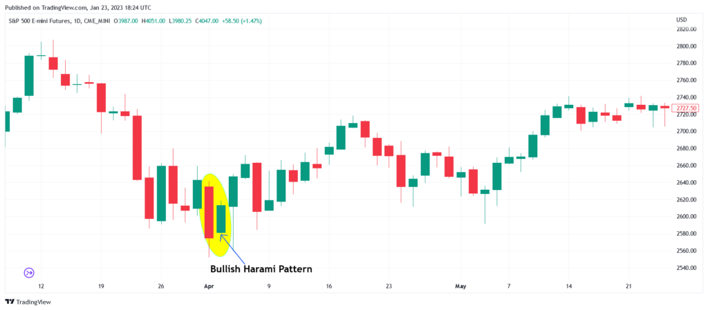

## Table of Contents

## What is a Bearish Harami chart pattern?

A Bearish Harami is a chart pattern used in technical analysis to predict a potential reversal in the market. It consists of two candlesticks. The first candlestick is a large bullish (upward) candle, showing that the price has risen significantly during that period. The second candlestick is a smaller bearish (downward) candle that is completely contained within the body of the first candle. This smaller candle indicates that the bullish momentum is weakening, as the price movement within the day is less than the previous day's gains.

When traders see a Bearish Harami, they might think that the upward trend could be ending. The pattern suggests that buyers are losing control and sellers might start to take over. However, it's important to use other indicators and analysis methods too, because one pattern alone might not be enough to make a trading decision. It's always good to look at the bigger picture and consider other factors before deciding to buy or sell based on this pattern.

## How can you identify a Bearish Harami on a price chart?

To identify a Bearish Harami on a price chart, you need to look for two specific candlesticks in a row. The first one should be a big green or white candle, showing that the price went up a lot that day. This candle represents strong buying pressure. The second candle should be smaller and red or black, meaning the price went down a bit that day. Importantly, this smaller red candle must be completely inside the body of the big green candle from the day before. This means the high and low of the second day's price action should be within the high and low of the first day.

When you see this pattern, it suggests that the strong upward trend might be losing steam. The smaller red candle shows that the buyers are not as strong as they were, and sellers are starting to come into the market. However, just seeing a Bearish Harami isn't enough to make a decision. It's a good idea to look at other signs and patterns on the chart too, to get a fuller picture of what might happen next with the price.

## What does the Bearish Harami pattern indicate about market sentiment?

The Bearish Harami pattern tells us that the market might be getting less excited about going up. It starts with a big green candle, which means the price went up a lot that day. This shows that buyers were really pushing the price higher. But then, the next day, there's a smaller red candle that fits inside the big green one. This smaller red candle means that the price didn't go up as much as it did the day before, and in fact, it went down a little. This change suggests that the strong buying power is starting to weaken, and some people might be thinking about selling instead of buying.

Seeing a Bearish Harami can make traders think that the upward trend could be ending soon. It's like a warning sign that the market sentiment might be shifting from positive to more cautious or even negative. However, this pattern alone isn't enough to decide what to do next. Traders should look at other signs and patterns on the chart too, to get a better idea of whether it's really time to start selling or if they should wait and see what happens.

## Can you explain the psychology behind the Bearish Harami pattern?

The Bearish Harami pattern shows what people are feeling about the market. It starts with a big green candle, which means a lot of people were buying and the price went up a lot. This shows that everyone was feeling good and wanted to buy more. But then, the next day, there's a smaller red candle that fits inside the big green one. This smaller red candle means that not as many people wanted to buy anymore, and some even started selling. It's like the excitement about buying is fading away.

When traders see this pattern, they start to think that maybe the good times are over. The smaller red candle tells them that the strong buying power is getting weaker, and more people might be thinking about selling. This change in what people are feeling can make traders more careful and ready to sell if the price keeps going down. But, it's important to look at other things on the chart too, because this pattern alone might not be enough to decide what to do next.

## What are the key differences between a Bearish Harami and a Bullish Harami?

A Bearish Harami and a Bullish Harami are two different chart patterns that traders use to guess where the price might go next. A Bearish Harami happens when there's a big green candle first, showing that the price went up a lot. Then, a smaller red candle comes next, fitting inside the big green one. This tells traders that the strong buying might be ending, and the price could start going down. It's a sign that people might be getting less excited about buying.

On the other hand, a Bullish Harami is the opposite. It starts with a big red candle, meaning the price dropped a lot. Then, a smaller green candle follows, fitting inside the big red one. This pattern suggests that the strong selling might be slowing down, and the price could start going up again. It's a sign that people might be getting more interested in buying again.

Both patterns show a change in what people are feeling about the market, but they point in different directions. The Bearish Harami warns about a possible drop in price, while the Bullish Harami hints at a possible rise. Traders use these patterns along with other signs to make their decisions, but they're important because they show when the market might be turning around.

## How reliable is the Bearish Harami as a predictor of price movement?

The Bearish Harami is a pattern that traders use to guess if the price might go down soon. It's not perfect, though. How well it works can change depending on things like what market you're looking at, how long you're watching the price, and what other signs you see on the chart. Sometimes it can be a good hint that the price might drop, but other times it might not mean much at all. Traders often look at other patterns and signals to make sure they're making a good guess.

Even though the Bearish Harami can be helpful, it's best to use it with other tools. No single pattern can tell you for sure what the price will do next. It's like a piece of a puzzle. By itself, it might not give you the full picture, but when you put it together with other pieces, you can get a better idea of where the price might be headed. So, while the Bearish Harami can be useful, it's smart to look at the bigger picture before making any trading decisions.

## What are the best trading strategies to use when you spot a Bearish Harami?

When you see a Bearish Harami on a chart, one good strategy is to wait for confirmation before making a move. This means you should look for other signs that the price might really go down, like if the price breaks below the low of the Bearish Harami pattern. If you see this happen, it could be a good time to sell or short sell the asset. But remember, it's important to set a stop-loss order to limit how much you could lose if the price goes up instead of down.

Another strategy is to use the Bearish Harami as part of a bigger plan. Look at other things on the chart, like other patterns or technical indicators, to see if they also suggest the price might drop. If everything points the same way, you might feel more confident about selling. It's also a good idea to check the overall market trend and news that could affect the price. By putting all these pieces together, you can make a smarter decision about when to trade based on the Bearish Harami.

## How should you manage risk when trading based on a Bearish Harami pattern?

When you see a Bearish Harami and decide to trade based on it, it's really important to manage your risk well. One way to do this is by setting a stop-loss order. This means you tell your trading platform to automatically sell your asset if the price goes up to a certain level. This helps you limit how much money you could lose if the price doesn't go down like you thought it would. It's a good idea to set your stop-loss just above the high of the big green candle in the Bearish Harami pattern, because if the price goes above that, the pattern might not be a good sign anymore.

Another way to manage risk is to not put all your money into one trade. Instead, you should only use a small part of your money for each trade. This way, even if you lose on one trade, you won't lose everything. It's also smart to keep an eye on the market and be ready to change your plan if things don't go the way you expected. By using these strategies, you can try to protect your money while trading based on a Bearish Harami pattern.

## What are some common mistakes traders make when using the Bearish Harami pattern?

One common mistake traders make when using the Bearish Harami pattern is jumping into a trade too quickly without waiting for confirmation. They see the pattern and immediately start selling or short selling, but they don't wait to see if the price actually goes down. This can lead to losses if the price doesn't follow the expected trend. It's important to wait for the price to break below the low of the Bearish Harami pattern before making a move, to make sure the pattern is a good sign.

Another mistake is relying too much on the Bearish Harami pattern alone. Traders sometimes forget to look at other signs and patterns on the chart, like other technical indicators or the overall market trend. If they only focus on the Bearish Harami, they might miss important information that could change their trading decision. It's always better to use the Bearish Harami as part of a bigger plan, checking other things to get a fuller picture of where the price might be headed.

## How can technical indicators enhance the effectiveness of trading a Bearish Harami?

Using technical indicators can make trading a Bearish Harami more effective. For example, if you see a Bearish Harami and also notice that the Relative Strength Index (RSI) is showing that the asset is overbought, it can give you more confidence that the price might go down. The RSI helps you see if the price has gone up too much and might be ready to drop. Another useful indicator is the Moving Average Convergence Divergence (MACD). If the MACD line crosses below the signal line right after you see a Bearish Harami, it can be a strong sign that the price is about to fall. By combining the Bearish Harami with these indicators, you get a clearer picture of what might happen next.

It's also important to look at the bigger picture when you see a Bearish Harami. For instance, if the price is below a key moving average like the 200-day moving average, it can support the idea that the price might continue to go down. Volume indicators can also help. If the volume goes up when you see the Bearish Harami, it can mean that more people are starting to sell, making the pattern more reliable. By using these technical indicators along with the Bearish Harami, you can make smarter trading decisions and better manage your risk.

## In what market conditions does the Bearish Harami pattern perform best?

The Bearish Harami pattern works best in markets that have been going up for a while. When the price has been rising and everyone is feeling good about buying, the Bearish Harami can be a strong sign that the upward trend might be ending. It's like a warning that the buying power is getting weaker and sellers might start to take over. This is especially true if the market is overbought, meaning the price has gone up a lot and might be ready to drop.

In these conditions, if you see a Bearish Harami and other signs like high volume or technical indicators also pointing to a possible drop, it can be a good time to sell or short sell. But, it's important to wait for more signs that the price is really going down before making a move. If the market is not trending strongly or if there's a lot of uncertainty, the Bearish Harami might not be as reliable. So, it's best to use it when the market has a clear upward trend that might be ready to turn around.

## Can you provide real-world examples where the Bearish Harami pattern led to successful trades?

In early 2020, a trader noticed a Bearish Harami pattern on the chart of a popular tech stock that had been rising for months. The first day, the stock closed with a big green candle, showing strong buying. The next day, a smaller red candle appeared, fitting entirely within the previous day's green candle. The trader waited for confirmation and saw the price drop below the low of the Bearish Harami. Confident in the pattern and supported by a high volume of selling, the trader short sold the stock. Over the next few days, the stock price continued to fall, allowing the trader to close the position with a nice profit.

Another example happened in the forex market with the EUR/USD pair in late 2018. After a period of steady gains, a Bearish Harami appeared on the daily chart. The first candle was a large bullish one, followed by a smaller bearish candle completely within the body of the first. The trader, seeing this pattern, waited for the price to break below the low of the Bearish Harami. Once it did, and with the RSI indicating the pair was overbought, the trader entered a short position. The EUR/USD continued to decline over the following week, resulting in a successful trade for the trader.

## References & Further Reading

[1]: ["Japanese Candlestick Charting Techniques"](https://archive.org/details/JapaneseCandlestickChartingTechniques2ndEditionSteveNison) by Steve Nison

[2]: ["Encyclopedia of Chart Patterns, 2nd Edition"](https://www.amazon.com/Encyclopedia-Chart-Patterns-Thomas-Bulkowski/dp/0471668265) by Thomas N. Bulkowski

[3]: ["Technical Analysis of the Financial Markets: A Comprehensive Guide to Trading Methods and Applications"](https://www.amazon.com/Technical-Analysis-Financial-Markets-Comprehensive/dp/0735200661) by John J. Murphy

[4]: ["Algorithmic Trading: Winning Strategies and Their Rationale"](https://www.wiley.com/en-us/Algorithmic+Trading%3A+Winning+Strategies+and+Their+Rationale-p-9781118746912) by Ernie Chan

[5]: ["Candlestick Charting Explained: Timeless Techniques for Trading Stocks and Futures"](https://www.amazon.com/Candlestick-Charting-Explained-Timeless-Techniques/dp/007146154X) by Gregory L. Morris