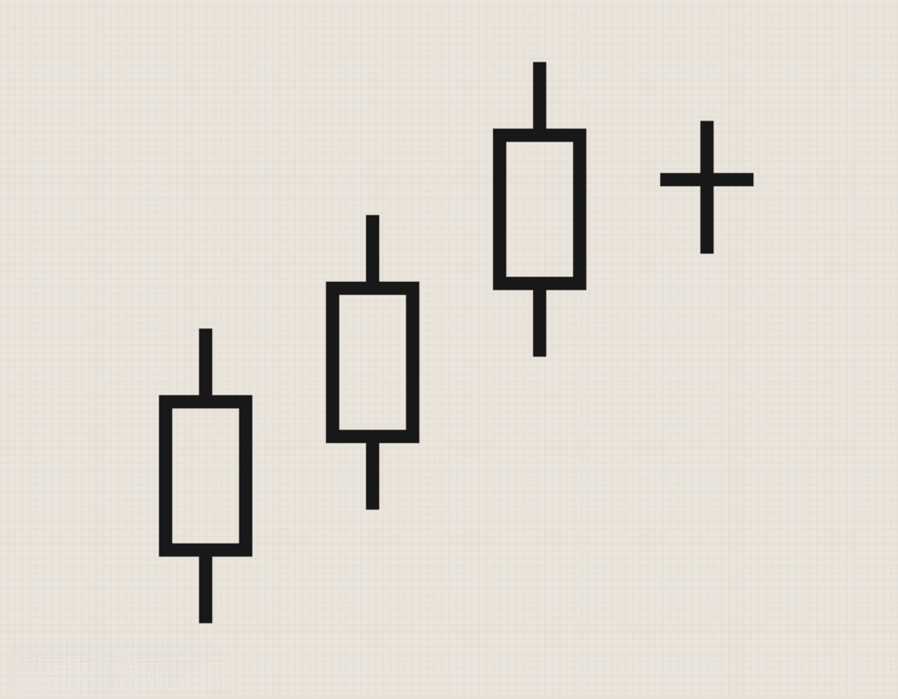

Algorithmic trading leverages technological advancements to execute trades based on predefined strategies, and understanding candlestick patterns, such as the Bearish Harami, is essential for predicting potential market reversals. In practice, these patterns provide insights into market dynamics, highlighting shifts in investor sentiment and potential changes in trend direction.

The Bearish Harami pattern consists of two consecutive candlesticks: the first is a larger bullish candle, followed by a smaller bearish candle contained within the body of the previous one. This formation indicates a reduction in bullish momentum, suggesting a possible transition towards bearish control. While this pattern is a popular reversal signal, its effectiveness can vary, sometimes producing false positives. This variability compels traders to incorporate additional indicators and conduct thorough analysis to confirm signals.



Algorithmic traders can code the Bearish Harami pattern into their systems to automate detection and decision-making processes. This automation can enhance efficiency but requires rigorous backtesting to assess the pattern's historical performance. By testing against historical data, traders can refine algorithms to improve prediction accuracy and strategic effectiveness.

Despite its potential, reliance solely on the Bearish Harami can expose traders to risks, as the pattern's success rate is not absolute. To mitigate these risks, incorporating complementary trading techniques and tools is crucial. Strategies such as integrating technical indicators or utilizing multi-timeframe analysis can enhance the reliability of trading decisions based on the Bearish Harami pattern.

This article aims to analyze the Bearish Harami pattern and its integration into algorithmic trading strategies. It will examine the potential benefits and challenges and introduce techniques to improve the pattern's reliability. Ultimately, the goal is to provide traders with insights on how to effectively incorporate the Bearish Harami pattern into a robust trading strategy.

## Table of Contents

## Understanding the Bearish Harami Candlestick Pattern

The Bearish Harami is an essential pattern within candlestick charting that can indicate a potential reversal in the market from an uptrend to a downtrend. It comprises two distinct candlesticks: the first is a large bullish candle, followed by a smaller bearish candle, which is completely contained within the body of the preceding candle. This formation suggests a weakening of the bullish momentum and points towards a possible shift in market control from buyers to sellers.

In technical analysis, the Bearish Harami is interpreted as a signal that the existing upward trend may be losing steam, giving way to a downturn. The larger bullish candle confirms the prevailing uptrend as it closes higher than its open, signifying continued buying pressure. However, the smaller bearish candle that follows reflects indecision and a reduction in bullish power, as it opens below the previous close and closes near or below its opening price.

The effectiveness of the Bearish Harami lies in its ability to highlight potential points of reversal, thereby aiding traders in identifying optimal moments to enter or [exit](/wiki/exit-strategy) trades. Its formation is particularly significant when it occurs near resistance levels or in conjunction with other confirming technical indicators, such as moving averages or relative strength index (RSI). By recognizing a Bearish Harami, traders can make informed decisions and potentially capitalize on market shifts.

In summary, the Bearish Harami pattern serves as a crucial tool in the arsenal of traders aiming to spot market downturn opportunities and inform their strategic decision-making processes.

## Algorithmic Trading and the Bearish Harami

In [algorithmic trading](/wiki/algorithmic-trading), the Bearish Harami pattern is leveraged by encoding its identification into trading algorithms, allowing for automated responses to market conditions. This pattern, characterized by a large bullish candle followed by a smaller bearish one, enclosed within the first candle's body, signals potential reversals from an uptrend to a downtrend. By automating its recognition, traders aim to capitalize on these predicted reversals swiftly.

A critical aspect of utilizing the Bearish Harami in algorithmic strategies is [backtesting](/wiki/backtesting). Backtesting involves applying historical market data to the algorithm to evaluate its effectiveness and reliability. Through this process, traders can assess the pattern's historical performance, identifying scenarios where it successfully predicted market reversals. This historical evaluation helps refine and adjust the algorithm to enhance prediction accuracy. An example of a backtesting approach in Python might use libraries such as `pandas` for data handling and `[backtrader](/wiki/backtrader)` for strategy testing:

```python
import backtrader as bt

class BearishHaramiStrategy(bt.Strategy):
    def __init__(self):
        self.order = None

    def next(self):
        if self.order:
            return

        if self.data.close[-2] > self.data.open[-2] and self.data.open[-1] < self.data.close[-1] and self.data.high[-1] < self.data.close[-2]:
            self.order = self.sell()

cerebro = bt.Cerebro()
cerebro.addstrategy(BearishHaramiStrategy)

data = bt.feeds.YahooFinanceData(dataname='AAPL', fromdate=datetime(2020, 1, 1), todate=datetime(2021, 1, 1))
cerebro.adddata(data)

cerebro.run()
```

In this strategy, the algorithm checks conditions indicative of a Bearish Harami and executes a sell order accordingly. This logic, when backtested against historical data, aids in verifying the pattern's robustness.

Moreover, integrating the Bearish Harami pattern with additional technical indicators can increase its reliability while minimizing false signals. Commonly used indicators include moving averages, Relative Strength Index (RSI), and Bollinger Bands. For instance, coupling the Bearish Harami pattern with RSI may provide further confirmation of an overbought condition, reinforcing the likelihood of an impending downturn. This combinatorial approach ensures better signal confirmation, enhancing the reliability of trades executed based on the Bearish Harami identification.

This integration is crucial as the Bearish Harami, while noteworthy, may yield different success rates depending on market conditions. By augmenting the pattern with additional technical indicators, traders create a more holistic view of the market, enabling more informed and precise trading decisions within algorithmic frameworks.

## Advantages and Challenges of Using Bearish Harami in Algorithmic Strategies

The Bearish Harami candlestick pattern presents both advantages and challenges when employed in algorithmic trading strategies. One of the key advantages of using the Bearish Harami pattern is its ability to provide early signals for potential trend reversals. When detected accurately, this pattern can alert traders to a possible shift from a bullish to a bearish trend, allowing for profit-making opportunities during these transitions. This early warning capability is particularly valuable in fast-paced trading environments where timely decision-making is crucial.

However, the pattern is not without its challenges. One primary challenge associated with the Bearish Harami is the risk of false signals, which can lead to unprofitable trades. The pattern's occurrence does not always precede a genuine trend reversal, making it crucial for traders to implement additional confirmation tools. These can include integrating other technical indicators—such as moving averages, Relative Strength Index (RSI), or MACD (Moving Average Convergence Divergence)—to verify the pattern's validity. By corroborating the pattern with these indicators, traders can filter out false positives and improve the accuracy of their trading strategies.

Moreover, the Bearish Harami's success rate is not uniform across all market conditions. Its efficacy can be diminished in volatile markets or during periods of low [liquidity](/wiki/liquidity-risk-premium), where price patterns might deviate from traditional interpretations. To address this variability, it is essential for traders to conduct extensive backtesting and performance analysis. By evaluating the pattern's historical performance across different market scenarios, traders can adjust their algorithms to better anticipate and respond to potential signals.

In conclusion, while the Bearish Harami pattern affords the advantage of early trend shift identification, it also carries the inherent challenge of false signals and variable success rates. To maximize the potential of this candlestick pattern in algorithmic strategies, it is crucial to incorporate additional technical analysis tools and conduct thorough testing to refine algorithmic responses.

## Enhancing Reliability: Complementary Tools and Techniques

To enhance the reliability of the Bearish Harami pattern in algorithmic trading, traders can employ several complementary tools and techniques. A multi-timeframe analysis is one such approach that offers a nuanced market view, allowing traders to validate the presence of a Bearish Harami pattern across different time horizons. By examining the pattern across multiple timeframes, traders can confirm the strength and reliability of the reversal signal. For instance, the appearance of a Bearish Harami on a daily chart, supported by similar signals on a four-hour or an hourly chart, strengthens the conviction of a potential trend reversal.

Integrating support and resistance zones into the analysis provides further context. These zones are critical price levels where market participants have historically shown increased buying or selling interest. If a Bearish Harami pattern appears near a recognized resistance level, the likelihood of a successful trend reversal may increase. This confluence of signals can offer traders additional confidence in their decision-making process.

Footprint charts, which provide a detailed view of [volume](/wiki/volume-trading-strategy) distribution and market activity within each price bar, can also enhance the interpretation of the Bearish Harami pattern. By analyzing the order flow data, traders can ascertain whether the bearish sentiment is supported by substantial trading volume. Volume analysis is critical; a Bearish Harami accompanied by high volume might suggest a stronger reversal signal, as it indicates significant participation from market players.

Python libraries such as `pandas` and `ta` (technical analysis) can be employed to automate these analyses and integrate them into trading algorithms. For example, a script might look for Bearish Harami patterns and then fetch volume data to confirm the presence of increased trading activity, helping to filter out less reliable signals.

```python
import pandas as pd
import ta

# Assuming 'data' is a DataFrame containing OHLC and volume data
data['bearish_harami'] = ta.candlestick.bearish_harami(data['open'], data['high'], data['low'], data['close'])
data['high_volume'] = data['volume'] > data['volume'].rolling(window=20).mean()

# Filter for patterns with sufficient volume
signals = data[(data['bearish_harami']) & (data['high_volume'])]
```

Furthermore, using footprint charts can provide granular insights into buyer and seller dynamics at specific price levels, assisting traders in understanding if the market sentiment aligns with the Bearish Harami signal. Incorporating these advanced techniques in algorithmic strategies reduces the sole reliance on the Bearish Harami pattern, thus improving trade outcomes by adding layers of confirmation and context to potential market reversals.

## Conclusion: Maximizing the Potential of the Bearish Harami in Algo Trading

The Bearish Harami pattern is a significant tool for traders aiming to profit from market reversals. As a candlestick pattern, it provides early signals that an uptrend may be losing [momentum](/wiki/momentum), potentially transitioning to a downtrend. This anticipative insight can be invaluable for traders, particularly in the dynamic environment of algorithmic trading.

However, like all market indicators, the Bearish Harami is not foolproof. Its utility is amplified when used in conjunction with additional strategies and thorough backtesting. Backtesting enables traders to evaluate the historical performance of the Bearish Harami, assessing its predictiveness in various market conditions. By scrutinizing past data, traders can fine-tune their algorithms to improve accuracy and responsiveness.

To truly maximize the potential of the Bearish Harami in algo trading, it should not operate in isolation. Integrating the pattern within a broader algorithmic framework that includes complementary tools—such as other technical indicators, multi-timeframe analyses, or volume-based assessments—can mitigate the risks of false signals. For instance, algorithms can be programmed to only act on a Bearish Harami pattern when confirmed by a break in a support zone, thus adding an additional layer of verification.

Utilizing Python, traders can implement such strategies effectively. Libraries like `pandas` and `numpy` facilitate robust data manipulation and analysis. Technical analysis libraries, such as `TA-Lib` or `pandas_ta`, can be used to incorporate the Bearish Harami and other indicators into complex trading algorithms. Below is an example snippet that retrieves historical stock data and identifies the Bearish Harami pattern:

```python
import yfinance as yf  # For more datasets, visit: https://paperswithbacktest.com/datasets
import pandas as pd
import talib

# Download historical data for a stock
data = yf.download('AAPL', start='2021-01-01', end='2022-01-01')

# Calculate Bearish Harami pattern
data['bearish_harami'] = talib.CDLHARAMI(data['Open'], data['High'], data['Low'], data['Close'])

# Filter the dates where Bearish Harami is identified
bearish_harami_dates = data[data['bearish_harami'] == -100].index
print("Bearish Harami detected on:")
print(bearish_harami_dates)
```

This Python code identifies the Bearish Harami pattern in the historical data of Apple Inc. By running advanced algorithms that incorporate such patterns, traders can potentially enhance their decision-making and strategic edge in volatile markets.

Ultimately, the Bearish Harami pattern, when integrated with robust algorithmic strategies and enhanced with comprehensive analysis techniques, becomes a potent component in a trader's arsenal for navigating the complexities of market dynamics. With diligent application and continuous refinement, it can contribute significantly to achieving profitable outcomes in algorithmic trading.

## References & Further Reading

[1]: Nison, S. (1991). ["Japanese Candlestick Charting Techniques: A Contemporary Guide to the Ancient Investment Techniques of the Far East"](https://www.amazon.com/Japanese-Candlestick-Charting-Techniques-Contemporary/dp/0139316507). Prentice Hall Press.

[2]: Aronson, D. R. (2007). ["Evidence-Based Technical Analysis: Applying the Scientific Method and Statistical Inference to Trading Signals"](https://onlinelibrary.wiley.com/doi/book/10.1002/9781118268315). Wiley.

[3]: Pring, M. J. (2002). ["Technical Analysis Explained: The Successful Investor's Guide to Spotting Investment Trends and Turning Points"](https://www.amazon.com/Technical-Analysis-Explained-Fifth-Successful/dp/0071825177). McGraw-Hill Education.

[4]: Chan, E. P. (2008). ["Quantitative Trading: How to Build Your Own Algorithmic Trading Business"](https://github.com/ftvision/quant_trading_echan_book). Wiley.

[5]: Lopez de Prado, M. (2018). ["Advances in Financial Machine Learning"](https://books.google.com/books/about/Advances_in_Financial_Machine_Learning.html?id=oU9KDwAAQBAJ). Wiley.

[6]: Jansen, S. (2020). ["Machine Learning for Algorithmic Trading - Second Edition"](https://github.com/PacktPublishing/Machine-Learning-for-Algorithmic-Trading-Second-Edition). Packt Publishing.

[7]: Murphy, J. J. (1999). ["Technical Analysis of the Financial Markets: A Comprehensive Guide to Trading Methods and Applications"](https://www.amazon.com/Technical-Analysis-Financial-Markets-Comprehensive/dp/0735200661). New York Institute of Finance.