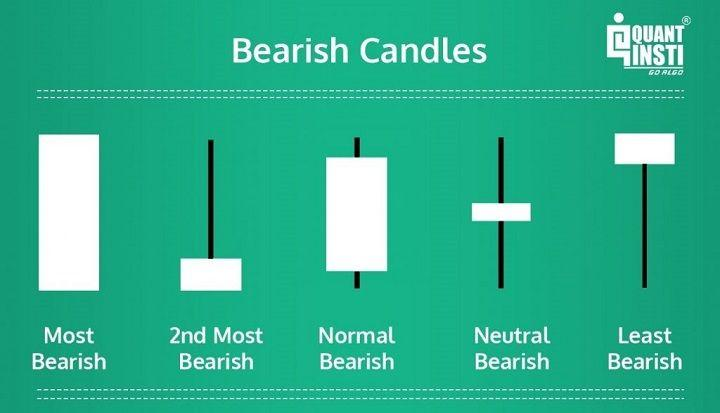

Bearish trading in financial markets involves a strategic focus on anticipating and profiting from declines in asset prices. This approach is crucial for traders aiming to exploit market downturns by understanding bearish trends, which are typically marked by prevailing pessimism and negative expectations regarding asset values. The efficient execution of this strategy often influences trader success, as recognizing the onset and direction of market decline forms the foundation for profit-generation in such conditions.

Algorithmic trading, commonly referred to as algo trading, revolutionizes how trades are executed by employing sophisticated computer programs to carry out trades with speed and precision that exceed human capabilities. These algorithms operate based on predefined criteria and are designed to minimize psychological biases that might affect traditional human trading. They employ diverse strategies, including arbitrage, trend-following, and market-making. For example, algo trading systems can identify and capitalize on minute price discrepancies or trending market patterns, executing trades rapidly to exploit these opportunities before they vanish. The automated nature of these systems also facilitates high-frequency trading, allowing for the execution of numerous orders in fractions of a second.



This article explores the integration of bearish trading strategies within the framework of algorithmic trading. By leveraging technology to optimize trading tactics during market slumps, traders can potentially enhance their profitability. Strategies tailored to thrive under bearish conditions are dissected, offering insights into how technology can be utilized to monitor and execute trades effectively amidst volatile and declining markets. The discussion illuminates the interplay between bearish market expectations and algorithmic precision, showing how traders can harness this synergy to maximize gains during downturns.

## Table of Contents

## Understanding Bearish Markets

Bearish markets are defined by an overarching expectation among investors that asset prices will decline. This sentiment leads to a period characterized by falling prices and negative outlooks on the performance of various financial instruments. Such markets are fueled by numerous factors, including economic downturns, geopolitical tensions, or financial crises, all of which contribute to negative investor sentiment and decreased market confidence.

Prominent traders in history have successfully navigated these turbulent markets by accurately predicting downturns and capitalizing on them. George Soros, for example, famously shorted the British pound in 1992, earning over a billion dollars and cementing his reputation as one of the most successful bear traders. Jesse Livermore is another historical figure known for his bearish strategies, most notably for his short positions during the 1929 stock market crash, where he amassed significant wealth amidst widespread financial ruin.

Recognizing signals indicative of bearish markets is crucial for effective trading strategies. These signals often include trends such as declining asset prices, rising unemployment rates, reduced consumer spending, and higher interest rates. Additionally, technical indicators, such as moving averages and the Relative Strength Index (RSI), are commonly used to gauge the prevailing market sentiment. For example, a moving average crossover, where a short-term average crosses below a long-term average, can indicate a bearish trend. Similarly, an RSI value below 30 is typically interpreted as a sign that an asset is oversold, potentially forecasting further declines.

Investor sentiment plays a significant role in bearish markets. When the market psychology shifts, driven by fear and panic, the resulting selling pressure can exacerbate price declines. Understanding this sentiment, often assessed through sentiment analysis or investor surveys, allows traders to align their strategies accordingly. By effectively interpreting these signals and sentiments, traders can implement timely bearish strategies, such as short selling or purchasing put options, to profit from declining markets.

## Role of Algorithmic Trading in Bearish Markets

Algorithmic trading plays a significant role in bearish markets by executing trades based on pre-defined rules, thereby reducing the emotional biases commonly associated with human traders. This systematic approach facilitates disciplined trading under adverse market conditions, where fear and uncertainty dominate investor sentiments.

One of the fundamental strategies in bearish markets is short-selling, where traders sell securities they do not currently own, anticipating that the prices will decline, allowing them to repurchase the securities at a lower cost, thereby realizing a profit. Algorithmic trading enhances the efficiency of short-selling by automatically identifying the optimal entry and [exit](/wiki/exit-strategy) points based on quantitative models and market indicators. For instance, an algorithm might use moving averages to detect bearish patterns, triggering short sales when specific technical conditions are met.

Moreover, [algorithmic trading](/wiki/algorithmic-trading) allows traders to exploit small price discrepancies, often referred to as [arbitrage](/wiki/arbitrage) opportunities. In bearish markets, [volatility](/wiki/volatility-trading-strategies) and market inefficiencies can create frequent price differences across different markets or securities. Algorithmic programs can swiftly identify and act on these discrepancies, potentially yielding profits that manual trading might miss due to the rapid pace required.

Risk management is another critical aspect where algorithmic trading excels, particularly under the volatile conditions often present in bearish markets. Algorithms can incorporate complex risk parameters, such as setting stop-loss orders and precise position sizing, to mitigate potential losses. These mechanisms function automatically, ensuring that trades adhere to the predefined risk profile set by the trader, which is crucial to preserving capital during downturns.

The capability of algorithmic systems to process vast amounts of data in real-time is especially beneficial when market conditions are rapidly changing, as often happens in bearish scenarios. The integration of advanced data processing technologies allows algorithms to make real-time adjustments. For instance, [machine learning](/wiki/machine-learning) models can continuously analyze real-time data feeds to recalibrate trading strategies, maintain positioning, and ensure alignment with shifting market conditions.

Overall, the adaptability and precision of algorithmic trading provide traders with a robust framework for navigating bearish markets, allowing them to capitalize on declining prices while maintaining strategic risk controls. This technology-driven approach ensures that decisions are based on data-driven insights rather than emotion, ultimately contributing to more consistent trading performance during challenging market periods.

## Popular Bearish Algorithmic Strategies

Trend-following algorithms are pivotal in recognizing and capitalizing on the downward [momentum](/wiki/momentum) that characterizes bearish markets. These algorithms systematically identify trends by analyzing historical price data to predict future movements. By employing moving averages, such as the Simple Moving Average (SMA) or Exponential Moving Average (EMA), these algorithms can determine the direction of the price trend and automate trades to align with these identified trends.

```python
# Example of a simple moving average crossover strategy in Python
import pandas as pd

def calculate_sma(data, window):
    return data.rolling(window=window).mean()

def trend_following_strategy(prices, short_window, long_window):
    signals = pd.DataFrame(index=prices.index)
    signals['price'] = prices
    signals['short_mavg'] = calculate_sma(prices, short_window)
    signals['long_mavg'] = calculate_sma(prices, long_window)
    signals['signal'] = 0.0

    # Generate buy/sell signals (+1 for buy, -1 for sell)
    signals['signal'][short_window:] = np.where(
        signals['short_mavg'][short_window:] > signals['long_mavg'][short_window:], 1.0, 0.0)
    signals['positions'] = signals['signal'].diff()

    return signals
```

In contrast, mean reversion strategies are generally less effective in bearish markets due to the persistent nature of downward trends. These strategies rely on the notion that prices will revert to their mean or average over time. However, in sustained bearish conditions, the average price itself may continuously decline, rendering mean reversion techniques less predictive and, at times, even counterproductive.

Instead, strategies that focus on trend extension may prove more fruitful during bearish periods. These strategies consider the continuation of existing trends rather than their reversal, thereby aligning with market momentum.

Volatility-based strategies are another critical component in bearish algorithmic trading. Bearish markets are often marked by heightened volatility, creating numerous profit opportunities through price fluctuations. Algorithms designed to exploit these conditions might use indicators like Bollinger Bands to forecast potential breakouts or breakdowns.

Market-making strategies also play a vital role in bearish phases. These involve placing simultaneous buy and sell orders to profit from the bid-ask spread. During periods of high volatility, market-makers can benefit by quickly adjusting their quotes to capture the spread more effectively as prices fluctuate wildly. However, this requires sophisticated algorithms capable of continuously updating and managing risks.

Overall, the successful implementation of bearish algorithmic strategies hinges on the ability to adapt to rapid market changes and efficiently process large datasets to inform decision-making processes.

## Building and Backtesting Bearish Algo Strategies

Constructing robust algorithms for bearish markets involves several key steps to ensure they effectively respond to market downturns. Defining trends and risk parameters is essential to mitigate market impacts and slippage. Trends can be identified using technical indicators such as moving averages or the Relative Strength Index (RSI). For bearish markets, algorithms can focus on indicators signaling downward momentum, such as a moving average crossover where a shorter-term moving average crosses below a longer-term average.

Risk parameters are equally crucial and include setting thresholds for acceptable losses and gains, often implemented through stop-loss and take-profit orders. Automatic execution of these orders minimizes losses and locks in profits when certain conditions are met, enhancing the strategy's robustness.

Backtesting is a fundamental process that involves testing the algorithm against historical data, particularly from past bearish markets. This step is crucial to refine the strategy and ensure its adaptability to changing conditions. A basic [backtesting](/wiki/backtesting) procedure in Python might involve using libraries such as pandas for data manipulation and [backtrader](/wiki/backtrader) for strategy testing. An example backtest could be structured as follows:

```python
import backtrader as bt

class BearishStrategy(bt.Strategy):
    def __init__(self):
        self.sma_short = bt.indicators.SimpleMovingAverage(self.data.close, period=20)
        self.sma_long = bt.indicators.SimpleMovingAverage(self.data.close, period=50)
        self.position_size = 0.01  # Risk 1% of capital per trade

    def next(self):
        if self.sma_short < self.sma_long:  # Bearish crossover
            if not self.position:
                self.sell(size=self.broker.getcash() * self.position_size / self.data.close)

        elif self.sma_short > self.sma_long:
            if self.position:
                self.close()

# Load historical data and setup Cerebro engine
data = bt.feeds.YahooFinanceData(dataname='SPY', fromdate=datetime(2008, 1, 1), todate=datetime(2009, 12, 31))
cerebro = bt.Cerebro()
cerebro.adddata(data)
cerebro.addstrategy(BearishStrategy)
cerebro.run()
```

This code runs a simple bearish strategy during the 2008 financial crisis period, utilizing a moving average crossover strategy. The focus is on entering short positions when a bearish crossover is detected.

Risk management notably includes position sizing and automatic stop-loss orders. Position sizing controls the amount of capital at risk per trade, preserving capital during adverse market movements. This is typically calculated as a percentage of total capital.

For instance, if an algorithm risks 2% of total capital per trade and the total capital is $100,000, a single trade would risk $2,000. If the current asset price is $100, the algorithm could open a short position with 20 shares, factoring in the 2% risk.

In summary, building and backtesting bearish algo strategies require a structured approach to defining trends, implementing precise risk parameters, and conducting thorough backtesting. The process ensures the algorithm can adapt in real-time and minimize risk exposure during market downturns, providing traders with a powerful tool to navigate bearish markets.

## Risks and Challenges in Bearish Algo Trading

In bearish algorithmic trading, several risks and challenges require careful consideration to safeguard against potential losses. One primary concern is the risk of overfitting strategies to historical data during the backtesting phase. Overfitting occurs when a trading algorithm is excessively tailored to past data, capturing noise instead of underlying patterns. As a result, such strategies may exhibit stellar performance in simulations but falter under real-world conditions. To address this issue, traders can employ techniques such as cross-validation or regularization during model development to ensure robustness against overfitting.

Transaction costs and slippage also present significant challenges. While trading algorithms can rapidly exploit market opportunities, high-frequency trading can accumulate substantial transaction costs. Slippage, the difference between expected and actual transaction prices, can further erode profits, particularly during periods of heightened volatility common in bearish markets. Minimizing these impacts involves optimizing order execution strategies, such as using limit orders rather than market orders when feasible, and evaluating the trade-off between execution speed and cost.

Moreover, the unpredictable nature of bearish markets necessitates algorithms that are both robust and adaptable. Markets characterized by rapid price declines and fluctuations can expose vulnerabilities in pre-programmed trading rules. To enhance adaptability, algorithms can incorporate machine learning techniques to dynamically adjust to changing market conditions. Additionally, continuous monitoring and recalibration of algorithms based on real-time data feedback can improve performance and risk management. Finally, comprehensive risk management frameworks, including automatic stop-loss orders and diversified position sizing, are vital to preserving capital and maintaining the integrity of trading strategies amid bearish market turbulence.

## Conclusion: The Future of Bearish Algo Trading

Algorithmic trading offers significant capabilities for capitalizing on bearish market conditions, yet it necessitates ongoing refinement and rigorous risk management. The dynamic nature of financial markets requires traders to continuously adapt their strategies to maintain profitability and mitigate risks, particularly during downturns. As technology advances, the integration of sophisticated data analytics and machine learning techniques is becoming increasingly crucial in crafting more adaptive and efficient bearish trading algorithms.

The application of machine learning can enhance the predictive accuracy of algorithms, enabling traders to identify complex patterns and subtle shifts in market sentiment that may precede bearish trends. Techniques such as neural networks and decision trees, for instance, hold potential in evolving these strategies to be more responsive to fleeting market signals. Enhanced data analytics facilitate the processing of vast amounts of market data swiftly, allowing for real-time adjustments and strategic recalibrations which are vital during volatile conditions.

Furthermore, the importance of risk management cannot be understated. Integrating robust risk management protocols within algorithmic trading systems, such as automated stop-loss orders and dynamic position sizing, helps safeguard capital during unexpected market movements. This approach ensures that strategies remain resilient against the uncertainties inherent in bearish environments.

In conclusion, the future of bearish algorithmic trading lies in the continuous pursuit of innovation and learning. Traders and developers must stay ahead by leveraging newer technologies and updates in market knowledge. This adaptability not only involves refining existing models but also anticipating the impact of future technological advancements on trading practices. As both market conditions and technological landscapes evolve, staying informed and flexible will be essential components of successful bearish algorithmic trading strategies.

## Frequently Asked Questions

### What is a bearish market and how does it differ from a bullish market?

A bearish market is characterized by a decline in asset prices, prevalent negative sentiment, and pessimistic expectations about the financial future. Investors anticipate further declines, leading them to sell off securities, which exacerbates the downward trend. Common indicators include a fall in major stock indices by 20% or more from recent highs, increasing unemployment, and economic downturns [1]. Conversely, a bullish market is defined by rising asset prices, investor optimism, increased economic activity, and overall positive expectations about future prospects. While bearish markets can lead to significant financial losses, they also offer opportunities for traders willing to bet against the market by short-selling or employing derivative strategies.

### How can algo trading help manage risk during bearish periods?

Algorithmic trading can effectively manage risk during bearish periods by employing pre-defined rules and automated systems to execute trades. By minimizing emotional biases, algo trading ensures disciplined adherence to trading strategies regardless of market sentiment. Risk management features such as automatic stop-loss orders limit potential losses, while algorithms can execute short-selling efficiently, allowing traders to profit from declining prices. Furthermore, these algorithms can adapt in real-time to market volatility, adjusting positions and strategies to mitigate risk. The ability to process vast data sets quickly aids in identifying bearish trends and potential reversals, providing a tactical edge in tumultuous markets [2].

### What are the key advantages of using algorithmic trading in bearish markets?

Algorithmic trading offers several advantages in bearish markets. Firstly, it provides precision and speed not possible through manual trading, capitalizing on transient opportunities. By employing strategies such as trend-following, algo trading can align with the prevailing market sentiment, optimizing profit potential. Additionally, algorithms are capable of managing vast and complex data sets, helping to identify subtle market signals indicative of trend reversals or continuations. The automation aspect reduces the impact of human emotions such as fear and greed, which can be particularly detrimental in falling markets. Moreover, algo trading can execute large trades with minimal market impact, essential in volatile conditions prevalent during bearish phases. Finally, the integration of risk management protocols such as volatility-based position sizing ensures capital is protected, even when price movements are unpredictable.

### References

[1] Investopedia. "Bear Market Definition." [Investopedia.com](https://www.investopedia.com/terms/b/bearmarket.asp).
[2] Narang, R. (2009). "Inside the Black Box: The Simple Truth About Quantitative Trading." Wiley.

## References & Further Reading

[1]: Bergstra, J., Bardenet, R., Bengio, Y., & Kégl, B. (2011). ["Algorithms for Hyper-Parameter Optimization."](https://proceedings.neurips.cc/paper/2011/file/86e8f7ab32cfd12577bc2619bc635690-Paper.pdf) Advances in Neural Information Processing Systems 24.

[2]: ["Advances in Financial Machine Learning"](https://www.amazon.com/Advances-Financial-Machine-Learning-Marcos/dp/1119482089) by Marcos Lopez de Prado

[3]: ["Evidence-Based Technical Analysis: Applying the Scientific Method and Statistical Inference to Trading Signals"](https://www.amazon.com/Evidence-Based-Technical-Analysis-Scientific-Statistical/dp/0470008741) by David Aronson

[4]: ["Machine Learning for Algorithmic Trading"](https://github.com/PacktPublishing/Machine-Learning-for-Algorithmic-Trading-Second-Edition) by Stefan Jansen

[5]: ["Quantitative Trading: How to Build Your Own Algorithmic Trading Business"](https://books.google.com/books/about/Quantitative_Trading.html?id=j70yEAAAQBAJ) by Ernest P. Chan