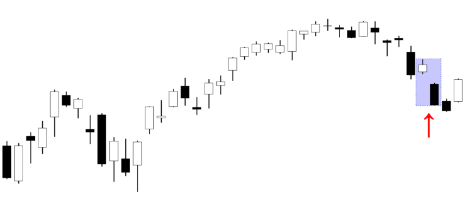

The bearish kicker candlestick pattern is recognized as one of the most potent signals for identifying bearish reversals in financial markets. Characterized by a dramatic shift in trader sentiment, this pattern emerges when a significant bullish candle is immediately followed by an equally substantial bearish candle, with a noticeable gap down. This stark transition often marks a crucial turning point, indicating a robust change from bullish to bearish market conditions.

For traders, particularly those employing algorithmic trading strategies, the ability to accurately detect the bearish kicker pattern can provide a distinct advantage. Algorithmic trading relies heavily on the identification of such reliable patterns to optimize trading strategies and maximize gains from downward market movements. The effectiveness of algorithms in recognizing these patterns can lead to more informed decision-making and timely exploitation of emerging trends.



This article aims to explore the nuances of the bearish kicker pattern, underscoring its importance as a tool for predicting market reversals. It will also assess how traders can effectively incorporate this pattern into algorithmic trading systems, thereby enhancing strategy performance. By understanding the intricacies of the bearish kicker, traders can better position themselves to capitalize on potential downturns in the market, leveraging this pattern's attributes to navigate complex trading environments successfully.

## Table of Contents

## Understanding the Bearish Kicker Pattern

The bearish kicker candlestick pattern is a formation that signals a potential reversal in an upward trend, indicating a shift towards a bearish market. It is characterized by a gap down in prices that completely overwhelms the prior bullish candlestick, suggesting that the [momentum](/wiki/momentum) has shifted decisively from buyers to sellers.

A typical bearish kicker consists of two candles: the first is a bullish candle (often represented in green) that is followed by a bearish candle (often represented in red) with no overlap between their real bodies. The second candlestick opens below the closing price of the first and moves further down, forming a distinct gap. This formation typically occurs at the top of an uptrend and acts as a strong indicator of a potential reversal to a downtrend.

In trading charts, the bearish kicker appears under conditions of sudden and strong bearish sentiment. It often emerges when a positive news-driven rally is unexpectedly countered by negative events or revelations, causing investors to begin selling off in large volumes. The abrupt transition from bullish to bearish can also be indicative of institutional traders liquidating positions or adjusting their portfolios, overpowering retail investor actions and shifting the market direction.

The psychological dynamics leading to the formation of a bearish kicker revolve around an abrupt change in market sentiment. Initially, traders are optimistic, driving prices upwards. However, due to unforeseen or newly developed adverse information, the market sentiment shifts dramatically, leading to widespread panic selling. This change often catches bullish investors off guard and compels a rapid change in strategy.

Recognizing the bearish kicker pattern promptly is crucial for traders as it offers an opportunity to [exit](/wiki/exit-strategy) long positions or initiate short positions, optimizing their trading outcomes. Timely identification allows traders to capitalize on the early stages of a potential downtrend, thereby enhancing their ability to maximize profits or minimize losses. The pattern is most beneficial when confirmed by other technical indicators or market analysis, reinforcing its reliability as a reversal signal.

## Identifying the Pattern in Algorithmic Trading

To programmatically identify the bearish kicker pattern in [algorithmic trading](/wiki/algorithmic-trading), several key steps and technical criteria need to be implemented. This pattern consists of two candlesticks, where the first is a bullish candle and the second is a bearish candle that opens above or at the close of the previous candle, with a gap down in price.

**Steps for Algorithmic Identification:**

1. **Data Acquisition and Preparation:**
   Obtain historical price data, ensuring it includes open, high, low, and close prices for the desired timeframe. This data must be stored in a structured format, typically as a time-series data frame or similar structure.

2. **Candlestick Recognition:**
   - Identify potential bullish candles by checking if the close price is higher than the open price.
   - For the subsequent candlestick, identify it as bearish if the open price is equal to or greater than the prior close, and the close price is below its own open price.

3. **Gap Calculation:**
   Confirm a gap down, where the second candlestick's open is greater than the previous close, indicating a rapid market sentiment change.

Here is a basic Python implementation using the Pandas library:

```python
import pandas as pd

def identify_bearish_kicker(data):
    pattern_indices = []
    for i in range(1, len(data)):
        prev_candle = data.iloc[i-1]
        curr_candle = data.iloc[i]

        # Check if previous candle is bullish
        if prev_candle['Close'] > prev_candle['Open']:
            # Check if current candle is bearish and there is a gap down
            if curr_candle['Open'] >= prev_candle['Close'] and curr_candle['Close'] < curr_candle['Open']:
                pattern_indices.append(i)

    return pattern_indices

# Assuming 'df' is a DataFrame with columns: ['Open', 'High', 'Low', 'Close']
bearish_kicker_indices = identify_bearish_kicker(df)
```

**Role of Backtesting:**

Backtesting is essential in validating the usability of the bearish kicker pattern within trading algorithms. Utilizing historical market data, one can simulate trades to evaluate the strategy's performance. This practice helps confirm the pattern's reliability under various market conditions and adjusts the algorithm parameters to enhance profitability.

**Technical Criteria:**

For a pattern to qualify as a bearish kicker:

- **Candle Formation:** A precise identification of two distinct candles, the first bullish and the second bearish, with a clear gap down either at the open or close of the second candle.
- **Volume Analysis:** Although not a strict criterion, observing an increase in volume during the bearish candle might affirm the pattern's validity.
- **Time Frame Consistency:** Consistent pattern identification across multiple time frames can bolster the reliability of signals generated by the algorithm.

Incorporating these steps and criteria into algorithmic trading systems helps detect bearish kicker patterns accurately, enhancing strategic effectiveness and minimizing false signals.

## Reliability and Success Rates

The reliability and success rates of the bearish kicker candlestick pattern as a trading signal are contingent on several statistical measures and market conditions. This pattern's efficacy is primarily evaluated through historical market data analysis and rigorous [backtesting](/wiki/backtesting), which are essential in determining its potential as a trading signal.

Statistically, the bearish kicker pattern's reliability is measured by analyzing occurrences over extensive historical data to assess its accuracy in predicting bearish reversals. Success rates are calculated by the number of instances the pattern correctly forecasts a downward trend divided by the total occurrences of the pattern, expressed as a percentage:

$$
\text{Success Rate (\%)} = \left(\frac{\text{Number of Correct Predictions}}{\text{Total Occurrences of the Pattern}}\right) \times 100
$$

Failure rates, conversely, are calculated as the percentage of instances where the pattern failed to predict a market reversal:

$$
\text{Failure Rate (\%)} = 100 - \text{Success Rate (\%)}
$$

Backtesting involves implementing the bearish kicker pattern within a trading algorithm, applying it to historical market data, and analyzing the outcomes. This process helps validate the pattern's reliability under various market conditions, identifying its consistent performance across different datasets.

Several factors can skew the statistical reliability of the bearish kicker pattern. Market [volatility](/wiki/volatility-trading-strategies) is a significant [factor](/wiki/factor-investing); heightened volatility often leads to false signals as price movements are more erratic. Also, market context is crucial; a bearish kicker may exhibit higher reliability during specific economic conditions, such as in a strong upward trend facing potential reversals.

The quality of data used in analysis also affects reliability. Poor data quality or limited historical data can lead to misinterpretations of the pattern's success rates. Hence, high-quality, extensive datasets should be prioritized for backtesting to ensure robust analysis.

In conclusion, while the bearish kicker pattern can serve as a valuable indicator for bearish reversals, its reliability is strongly influenced by market volatility, economic conditions, and data quality. By considering these factors, traders can better interpret the success rates and integrate the pattern into effective trading strategies.

## Incorporating the Bearish Kicker in Trading Strategies

The incorporation of the bearish kicker pattern into trading strategies is essential for traders seeking to exploit market reversals. To effectively leverage this pattern within algorithmic trading, traders can follow systematic approaches that integrate the pattern into existing algorithms.

One primary strategy involves programming the algorithm to identify the bearish kicker pattern whenever it appears. This requires setting precise conditions that define the pattern, such as the occurrence of a significant gap down between two candlesticks, with the second candlestick having a bearish body that erases any previous gains. Below is an example of how you might code an algorithm in Python to detect the bearish kicker pattern using a popular library like `pandas`:

```python
import pandas as pd

def detect_bearish_kicker(data):
    """
    Detects the bearish kicker pattern in a given OHLC DataFrame.

    Parameters:
    data (pd.DataFrame): DataFrame containing columns 'Open', 'High', 'Low', 'Close'

    Returns:
    pd.DataFrame: DataFrame with an additional column 'Bearish_Kicker' indicating the presence of the pattern
    """
    data['Bearish_Kicker'] = False

    for i in range(1, len(data)):
        if data['Open'].iloc[i] < data['Close'].iloc[i-1] and\
           data['Close'].iloc[i] < data['Open'].iloc[i] and\
           data['Open'].iloc[i-1] < data['Close'].iloc[i-1]: # Bullish on the first candle
            data['Bearish_Kicker'].iloc[i] = True

    return data

# Example usage
df = pd.read_csv("historical_data.csv")
df = detect_bearish_kicker(df)
```

This code snippet processes historical data to flag instances where the bearish kicker pattern appears, facilitating backtesting and real-time analysis.

Algorithmic strategies can capitalize on the bearish kicker pattern by executing short positions or exiting long positions when the pattern is detected. These strategies benefit from additional validation by incorporating other technical analysis tools, such as moving averages, relative strength index (RSI), or [volume](/wiki/volume-trading-strategy) oscillators. By combining these indicators, traders enhance their decision-making capabilities, reducing the probability of false signals. For example, only executing trades when the bearish kicker pattern coincides with an overbought RSI condition can increase the likelihood of a successful trade.

Another effective approach involves multi-pattern strategies, where the bearish kicker pattern is part of a confluence of signals. For instance, a trader might wait for confirming signals from a moving average crossover before executing a trade based on a bearish kicker signal. This holistic approach ensures better alignment with prevailing market conditions.

Successful integration of the bearish kicker pattern also depends on backtesting to verify the historical profitability and robustness of the strategy. Traders can leverage tools like Python's `[backtrader](/wiki/backtrader)` or `zipline` libraries to simulate strategies and refine their rules to improve outcomes.

By systematically integrating the bearish kicker pattern into trading algorithms and synergizing it with other technical analysis tools, traders can construct well-rounded strategies that enhance trading performance and optimize returns.

## Risk Management

Implementing robust risk management protocols is crucial when trading with the bearish kicker candlestick pattern, as it helps mitigate risks associated with false signals and enhances overall trading performance. One primary approach is the use of stop-loss orders. These orders serve as a defensive mechanism, automatically executing a sell order when a predetermined price level is breached. This strategy is essential when dealing with bearish kicker patterns due to their inherent volatility and the potential for rapid market reversals. Traders often set stop-loss orders just above the high of the candlestick preceding the bearish kicker, thereby minimizing potential losses if the market does not move as expected.

Position sizing is another critical aspect of effective risk management. It involves determining the appropriate amount of capital to allocate to a trade based on individual risk tolerance and the specific characteristics of the bearish kicker pattern. Calculating position size can be done using the formula:

$$
\text{Position Size} = \frac{\text{Risk Per Trade}}{\text{Trade Risk}}
$$

where "Risk Per Trade" is the total capital a trader is willing to risk on a single trade, and "Trade Risk" is the difference between the entry price and stop-loss price. By carefully calibrating position sizes, traders can ensure that no single trade significantly impacts their overall portfolio, thereby protecting their investment capital from drastic losses.

Portfolio diversification is another recommended approach when relying on the bearish kicker pattern. This strategy involves spreading investments across various asset classes or sectors to reduce exposure to any single market movement. Diversification can cushion against adverse market conditions that may affect one sector while leaving others relatively untouched. By diversifying, traders can offset potential losses from trades based on the bearish kicker pattern with gains from other unrelated trades.

Additionally, capital allocation strategies should be carefully considered. Traders can allocate capital based on a percentage of their overall portfolio or use a fixed capital allocation strategy per trade. It is crucial to regularly review and adjust these allocations based on changing market conditions and trading performance, ensuring that the risk exposure remains within acceptable limits.

In conclusion, integrating comprehensive risk management strategies such as stop-loss orders, position sizing, portfolio diversification, and prudent capital allocation can significantly enhance trading outcomes when employing the bearish kicker candlestick pattern. These methodologies collectively help manage the inherent risks, safeguard investment capital, and contribute to a more disciplined trading approach.

## Challenges and Limitations

Traders aiming to leverage the bearish kicker candlestick pattern in algorithmic trading encounter several challenges and limitations. One primary concern is the accurate identification of the pattern, which is crucial for its effective utilization. Misidentifications often arise due to similarities with other reversal patterns or insufficient data resolution. Inaccurate recognition can lead to erroneous trading signals, adversely impacting performance.

A common misconception involves the assumption that the bearish kicker pattern always indicates a trend reversal. While historically significant, the pattern's presence does not guarantee a bullish-to-bearish shift. False signals can emerge, especially in markets lacking [liquidity](/wiki/liquidity-risk-premium) or during periods of significant volatility.

Algorithmic interpretations of the bearish kicker require precise coding to distinguish it from similar patterns. A basic algorithm to identify this pattern could include conditions like:

```python
def is_bearish_kicker(candles):
    if len(candles) >= 2:
        first_candle = candles[-2]
        second_candle = candles[-1]

        if first_candle['close'] > first_candle['open']:  # Bullish first candle
            if second_candle['open'] < first_candle['close'] and second_candle['close'] < second_candle['open']:
                return True
    return False
```

This code checks for a bullish candle immediately followed by a bearish one that opens below the close of the bullish candle, key characteristics of a bearish kicker.

Despite its utility, the pattern's reliability is not uniform across all market conditions. In trending markets, especially strong bull markets, the bearish kicker may not produce a lasting reversal, leading to potential losses. Traders should be cautious during market anomalies or external shocks, as these can alter expected outcomes.

Furthermore, the pattern’s efficacy is often contingent on the timeframe in which it is applied. Higher timeframes, like daily or weekly charts, tend to produce more reliable signals than minute charts, where noise increases the likelihood of false positives. It's essential for traders to backtest strategies extensively across different market conditions to understand the pattern's limitations and streamline their algorithms accordingly.

## Conclusion

The bearish kicker candlestick pattern proves to be an essential tool in the arsenal of algorithmic traders. Its utility lies in its capacity to provide a clear signal of potential market reversal from bullish to bearish trends, enabling traders to capitalize on downward market movements. This pattern's significance is heightened when integrated into algorithmic trading strategies, where automated systems can detect its occurrence quickly, allowing traders to respond to market changes with speed and precision.

Developing a balanced and informed approach to utilizing the bearish kicker involves understanding both its strengths and limitations. Traders must combine this pattern with other technical indicators to enhance its predictive accuracy. By doing so, they can mitigate the impact of false signals and improve decision-making processes. Continuous backtesting is crucial to adapt algorithms to accommodate evolving market conditions, ensuring that they remain effective over time.

A key recommendation for traders is to maintain flexibility in their strategies. The financial markets are inherently dynamic, and factors such as economic events, geopolitical developments, or sudden market shifts can alter the effectiveness of trading patterns. Thus, traders must be willing to refine and adapt their strategies regularly, relying not only on the bearish kicker but also incorporating a broad spectrum of technical tools and risk management protocols. This adaptive approach will facilitate sustained success in algorithmic trading and equip traders to navigate the complexities of financial markets effectively.

## References & Further Reading

[1]: Bergstra, J., Bardenet, R., Bengio, Y., & Kégl, B. (2011). ["Algorithms for Hyper-Parameter Optimization."](https://dl.acm.org/doi/10.5555/2986459.2986743) Advances in Neural Information Processing Systems 24.

[2]: ["Advances in Financial Machine Learning"](https://www.amazon.com/Advances-Financial-Machine-Learning-Marcos/dp/1119482089) by Marcos Lopez de Prado

[3]: ["Evidence-Based Technical Analysis: Applying the Scientific Method and Statistical Inference to Trading Signals"](https://www.amazon.com/Evidence-Based-Technical-Analysis-Scientific-Statistical/dp/0470008741) by David Aronson

[4]: ["Machine Learning for Algorithmic Trading"](https://github.com/stefan-jansen/machine-learning-for-trading) by Stefan Jansen

[5]: ["Quantitative Trading: How to Build Your Own Algorithmic Trading Business"](https://books.google.com/books/about/Quantitative_Trading.html?id=j70yEAAAQBAJ) by Ernest P. Chan