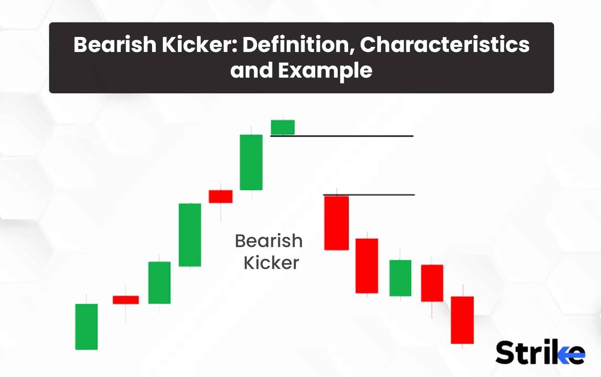

## Table of Contents

## What is a bearish kicker candlestick pattern?

A bearish kicker candlestick pattern is a signal that the price of a stock or other asset might go down. It happens over two days. On the first day, the price goes up and closes higher than it started. On the second day, the price gaps down at the open and then closes lower than it opened. This pattern shows a big change in what people think about the asset, moving from thinking it will go up to thinking it will go down.

This pattern is important because it shows strong selling pressure. When you see a bearish kicker, it means that the buyers who were pushing the price up on the first day have lost control. The sellers have taken over and are pushing the price down hard. Traders often use this pattern to decide when to sell their assets or to start betting that the price will go down.

## How does a bearish kicker pattern form on a chart?

A bearish kicker pattern shows up on a chart over two days. On the first day, the price of the stock or asset goes up. It starts at one price and ends the day at a higher price. This makes a candle on the chart that is usually green or white, showing that the price went up that day. At the end of the first day, the price is higher than it was at the start.

The next day, something big happens. The price opens lower than where it closed the day before. There's a gap down. Then, the price keeps going down all day and closes even lower than where it opened. This makes another candle on the chart, but this one is usually red or black, showing that the price went down. The two candles together make the bearish kicker pattern, showing that the people who want to sell are now in control and the price might keep going down.

## What are the key characteristics of a bearish kicker pattern?

A bearish kicker pattern happens over two days and shows that the price of a stock or asset might go down. On the first day, the price goes up and closes higher than it opened. This makes a candle on the chart that is usually green or white, showing that the price went up that day. At the end of the first day, the price is higher than it was at the start, which means buyers were in control.

On the second day, the price opens lower than where it closed the day before. This creates a gap down on the chart. Then, the price keeps going down all day and closes even lower than where it opened. This makes a candle that is usually red or black, showing that the price went down. The two candles together make the bearish kicker pattern, showing that sellers are now in control and the price might keep going down.

## Can you explain the psychology behind the bearish kicker pattern?

The bearish kicker pattern shows a big change in how people feel about a stock or asset. On the first day, the price goes up and closes higher. This means buyers were in charge and thought the price would keep going up. They were happy and confident, pushing the price higher by the end of the day.

But then, on the second day, something changes. The price opens lower than where it closed the day before, showing a gap down. This gap means the sellers have suddenly taken over. They think the price is too high and start selling a lot. The price keeps going down all day and closes even lower. This shows that the sellers are now in control, and people's feelings about the stock have changed from thinking it will go up to thinking it will go down.

## How reliable is the bearish kicker pattern in predicting price movements?

The bearish kicker pattern can be a useful sign for traders, but it's not perfect. It shows a strong change in how people feel about a stock, moving from thinking it will go up to thinking it will go down. This pattern can be a good hint that the price might keep going down, especially if other signs also show that the price could fall. But, it's important to remember that no pattern works all the time. Sometimes the price might not go down after a bearish kicker pattern shows up.

Traders often use the bearish kicker pattern along with other tools to make better guesses about where the price will go. They look at things like how much the stock is being traded, other chart patterns, and what's happening in the news. By using more than just the bearish kicker pattern, traders can make smarter choices. So, while the bearish kicker pattern can be helpful, it's best to use it with other information to predict price movements more reliably.

## What are the ideal market conditions for a bearish kicker pattern to be effective?

The bearish kicker pattern works best in a market where the price has been going up for a while. When everyone is feeling good about the stock and expecting it to keep going up, a bearish kicker can be a big surprise. It shows that some people have started to think the price is too high and want to sell. This sudden change can make other people nervous and start selling too, making the price go down.

The pattern is more effective if there are other signs that the price might go down. For example, if the stock is being traded a lot more than usual, or if other chart patterns also show that the price might fall, the bearish kicker can be a stronger sign. It's also important to pay attention to what's happening in the news or the economy, as these things can affect how people feel about the stock and make the bearish kicker pattern more reliable.

## How can traders confirm a bearish kicker pattern?

Traders can confirm a bearish kicker pattern by looking at other signs on the chart and in the market. After seeing the pattern, they should check if the trading [volume](/wiki/volume-trading-strategy) is higher than usual. High volume means more people are selling, which makes the pattern more likely to be correct. They should also look at other chart patterns, like a head and shoulders or a double top, which can also show that the price might go down.

It's also important to pay attention to what's happening in the news or the economy. If there's bad news about the company or the market, it can make people more likely to sell, making the bearish kicker pattern more reliable. By using all these signs together, traders can feel more sure that the bearish kicker pattern is a good hint that the price will go down.

## What are common mistakes traders make when identifying a bearish kicker pattern?

One common mistake traders make when identifying a bearish kicker pattern is not waiting for the second day's candle to close before making a decision. They might see the gap down at the open and think it's a bearish kicker, but if the price goes back up before the day ends, it's not a true bearish kicker. It's important to wait until the end of the second day to see if the price really does close lower than it opened.

Another mistake is not looking at the bigger picture. Traders might focus too much on the bearish kicker pattern and ignore other signs on the chart or in the market. For example, if the trading volume is low or if other patterns don't show that the price will go down, the bearish kicker might not be as reliable. It's important to use the bearish kicker pattern along with other information to make better guesses about where the price will go.

## How should a trader react to a bearish kicker pattern in their trading strategy?

When a trader sees a bearish kicker pattern, they should think about selling the stock or asset they own. This pattern shows that the price might go down, so it's a good time to get out before the price drops more. The trader should wait until the end of the second day to make sure the pattern is real. If the price closes lower than it opened on the second day, it's a good sign to sell.

But, traders shouldn't just look at the bearish kicker pattern. They should also check other things like how much the stock is being traded and what other patterns on the chart are saying. If everything points to the price going down, the bearish kicker pattern is more likely to be right. By using all this information, traders can make smarter choices about when to sell and protect their money.

## Can you provide examples of bearish kicker patterns in real market scenarios?

Imagine you're looking at a chart for a company called ABC Corp. On the first day, the stock price starts at $50 and goes up to close at $52. The candle on the chart is green, showing that the price went up that day. Everyone is feeling good about ABC Corp, thinking the price will keep going up. But the next day, something big happens. The stock opens at $49, which is lower than the $52 it closed at the day before. Then, it keeps going down and closes at $47. The candle on the chart is red, showing that the price went down. This is a bearish kicker pattern, and it means that people have changed their minds about ABC Corp and think the price will go down.

Another example is with XYZ Inc. On the first day, the stock price starts at $100 and goes up to close at $103. The candle is green, showing that the price went up. People are happy and think XYZ Inc. will keep doing well. But on the second day, the stock opens at $98, which is lower than the $103 it closed at the day before. It keeps going down and closes at $95. The candle is red, showing that the price went down. This is another bearish kicker pattern, and it means that people have started to think that XYZ Inc. might not do so well anymore, and the price could keep going down.

## How does the bearish kicker pattern compare to other bearish reversal patterns?

The bearish kicker pattern is strong because it shows a big change in what people think about a stock or asset over just two days. It's different from other bearish reversal patterns like the head and shoulders or the double top because it happens quickly and clearly. The bearish kicker pattern starts with a strong up day, followed by a gap down and a strong down day. This sudden shift can make people nervous and start selling, which can make the price go down fast. Other patterns might take longer to form and might not be as clear or strong in showing that the price will go down.

Other bearish reversal patterns, like the head and shoulders, show that the price might go down over a longer time. The head and shoulders pattern has three peaks, with the middle one being the highest. It shows that the price tried to go up a few times but couldn't keep going up. The double top pattern shows two peaks at about the same high price, which means the price tried to go up but failed twice. These patterns can be good signs that the price will go down, but they take longer to form and might not be as strong or clear as the bearish kicker pattern. Traders often use these patterns along with other signs to make better guesses about where the price will go.

## What advanced techniques can be used to enhance the effectiveness of trading based on bearish kicker patterns?

To make trading based on bearish kicker patterns more effective, traders can use something called technical indicators. These are tools that help predict where the price might go next. For example, the Relative Strength Index (RSI) can show if a stock is overbought, meaning it might be time for the price to go down. If the RSI is high and then a bearish kicker pattern shows up, it's a stronger sign that the price will go down. Another tool is the Moving Average Convergence Divergence (MACD). If the MACD line crosses below the signal line right after a bearish kicker, it's another good hint that the price will keep going down. Using these tools along with the bearish kicker pattern can help traders make better guesses about where the price will go.

Another advanced technique is to look at how much the stock is being traded, which is called volume. If the volume is high on the second day of the bearish kicker pattern, it means more people are selling, making the pattern more reliable. Traders can also use something called stop-loss orders to protect their money. A stop-loss order is a way to tell the computer to sell the stock if the price goes down to a certain level. This can help traders get out of a trade before losing too much money. By using these advanced techniques, traders can make smarter choices and improve their chances of making money when they see a bearish kicker pattern.

## What are the reliability and success rates?

The reliability and success rates of the bearish kicker candlestick pattern as a trading signal are contingent on several statistical measures and market conditions. This pattern's efficacy is primarily evaluated through historical market data analysis and rigorous [backtesting](/wiki/backtesting), which are essential in determining its potential as a trading signal.

Statistically, the bearish kicker pattern's reliability is measured by analyzing occurrences over extensive historical data to assess its accuracy in predicting bearish reversals. Success rates are calculated by the number of instances the pattern correctly forecasts a downward trend divided by the total occurrences of the pattern, expressed as a percentage:

$$
\text{Success Rate (\%)} = \left(\frac{\text{Number of Correct Predictions}}{\text{Total Occurrences of the Pattern}}\right) \times 100
$$

Failure rates, conversely, are calculated as the percentage of instances where the pattern failed to predict a market reversal:

$$
\text{Failure Rate (\%)} = 100 - \text{Success Rate (\%)}
$$

Backtesting involves implementing the bearish kicker pattern within a trading algorithm, applying it to historical market data, and analyzing the outcomes. This process helps validate the pattern's reliability under various market conditions, identifying its consistent performance across different datasets.

Several factors can skew the statistical reliability of the bearish kicker pattern. Market [volatility](/wiki/volatility-trading-strategies) is a significant [factor](/wiki/factor-investing); heightened volatility often leads to false signals as price movements are more erratic. Also, market context is crucial; a bearish kicker may exhibit higher reliability during specific economic conditions, such as in a strong upward trend facing potential reversals.

The quality of data used in analysis also affects reliability. Poor data quality or limited historical data can lead to misinterpretations of the pattern's success rates. Hence, high-quality, extensive datasets should be prioritized for backtesting to ensure robust analysis.

In conclusion, while the bearish kicker pattern can serve as a valuable indicator for bearish reversals, its reliability is strongly influenced by market volatility, economic conditions, and data quality. By considering these factors, traders can better interpret the success rates and integrate the pattern into effective trading strategies.

## What is Risk Management?

Implementing robust risk management protocols is crucial when trading with the bearish kicker candlestick pattern, as it helps mitigate risks associated with false signals and enhances overall trading performance. One primary approach is the use of stop-loss orders. These orders serve as a defensive mechanism, automatically executing a sell order when a predetermined price level is breached. This strategy is essential when dealing with bearish kicker patterns due to their inherent volatility and the potential for rapid market reversals. Traders often set stop-loss orders just above the high of the candlestick preceding the bearish kicker, thereby minimizing potential losses if the market does not move as expected.

Position sizing is another critical aspect of effective risk management. It involves determining the appropriate amount of capital to allocate to a trade based on individual risk tolerance and the specific characteristics of the bearish kicker pattern. Calculating position size can be done using the formula:

$$
\text{Position Size} = \frac{\text{Risk Per Trade}}{\text{Trade Risk}}
$$

where "Risk Per Trade" is the total capital a trader is willing to risk on a single trade, and "Trade Risk" is the difference between the entry price and stop-loss price. By carefully calibrating position sizes, traders can ensure that no single trade significantly impacts their overall portfolio, thereby protecting their investment capital from drastic losses.

Portfolio diversification is another recommended approach when relying on the bearish kicker pattern. This strategy involves spreading investments across various asset classes or sectors to reduce exposure to any single market movement. Diversification can cushion against adverse market conditions that may affect one sector while leaving others relatively untouched. By diversifying, traders can offset potential losses from trades based on the bearish kicker pattern with gains from other unrelated trades.

Additionally, capital allocation strategies should be carefully considered. Traders can allocate capital based on a percentage of their overall portfolio or use a fixed capital allocation strategy per trade. It is crucial to regularly review and adjust these allocations based on changing market conditions and trading performance, ensuring that the risk exposure remains within acceptable limits.

In conclusion, integrating comprehensive risk management strategies such as stop-loss orders, position sizing, portfolio diversification, and prudent capital allocation can significantly enhance trading outcomes when employing the bearish kicker candlestick pattern. These methodologies collectively help manage the inherent risks, safeguard investment capital, and contribute to a more disciplined trading approach.

## References & Further Reading

[1]: Bergstra, J., Bardenet, R., Bengio, Y., & Kégl, B. (2011). ["Algorithms for Hyper-Parameter Optimization."](https://dl.acm.org/doi/10.5555/2986459.2986743) Advances in Neural Information Processing Systems 24.

[2]: ["Advances in Financial Machine Learning"](https://www.amazon.com/Advances-Financial-Machine-Learning-Marcos/dp/1119482089) by Marcos Lopez de Prado

[3]: ["Evidence-Based Technical Analysis: Applying the Scientific Method and Statistical Inference to Trading Signals"](https://www.amazon.com/Evidence-Based-Technical-Analysis-Scientific-Statistical/dp/0470008741) by David Aronson

[4]: ["Machine Learning for Algorithmic Trading"](https://github.com/stefan-jansen/machine-learning-for-trading) by Stefan Jansen

[5]: ["Quantitative Trading: How to Build Your Own Algorithmic Trading Business"](https://books.google.com/books/about/Quantitative_Trading.html?id=j70yEAAAQBAJ) by Ernest P. Chan