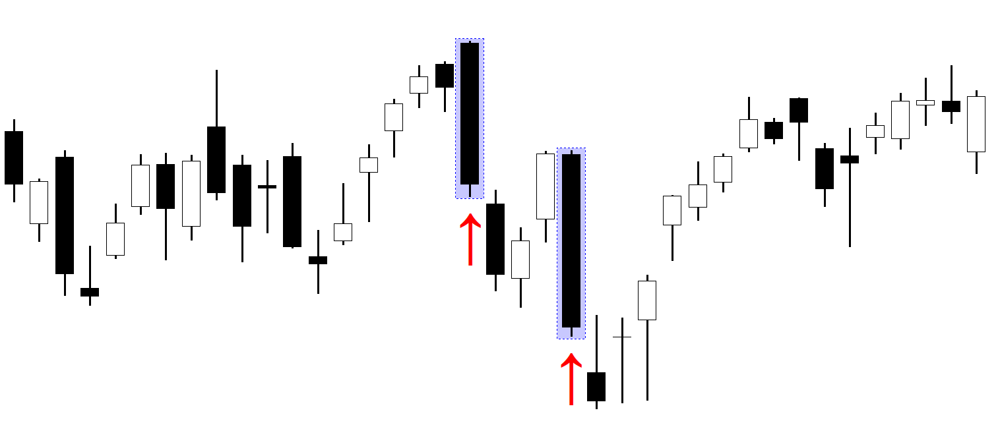

## Table of Contents

## What is a Bearish Marubozu?

A Bearish Marubozu is a type of candlestick pattern used in technical analysis of stock charts. It shows that the price of a stock went down a lot during the day. The candlestick has a long body with no shadows or wicks at the top or bottom. This means the stock opened at its highest price of the day and closed at its lowest price.

When you see a Bearish Marubozu, it usually means that sellers were in control the whole day. They pushed the price down from the opening to the closing. This can be a sign that more price drops might happen soon. Traders watch for this pattern to help them decide when to sell their stocks.

## How does a Bearish Marubozu appear on a candlestick chart?

A Bearish Marubozu on a candlestick chart looks like a long, solid bar with no lines sticking out at the top or bottom. The top of the bar is where the stock opened, and the bottom of the bar is where it closed. Because there are no lines or "wicks," it means the stock's price didn't go any higher than the opening price or any lower than the closing price during the day.

When you see this pattern, it tells you that the sellers were strong all day long. They kept pushing the price down from the moment the market opened until it closed. This kind of pattern can be a warning sign that the stock's price might keep falling in the days ahead.

## What does a Bearish Marubozu indicate about market sentiment?

A Bearish Marubozu shows that the market sentiment is very negative. It means that people who want to sell the stock were in control all day long. They were able to keep pushing the price down from when the market opened until it closed. This strong selling pressure tells us that many traders and investors feel worried or not confident about the stock.

Seeing a Bearish Marubozu can make other traders think that the stock's price might keep going down. It's like a signal that more people might want to sell their shares soon. This can lead to more selling and even lower prices in the future. So, when traders see this pattern, they might decide it's a good time to sell their own stocks to avoid losing more money.

## Can you explain the difference between an Opening and Closing Bearish Marubozu?

An Opening Bearish Marubozu and a Closing Bearish Marubozu are both types of candlestick patterns that show a bearish trend, but they look a bit different. An Opening Bearish Marubozu has a small line or "wick" at the bottom of the candlestick. This wick shows that the price went a little lower than where it closed, but it still closed near the lowest point of the day. The top of the candlestick is where the stock opened, and there's no wick at the top, meaning the stock didn't go higher than the opening price.

A Closing Bearish Marubozu, on the other hand, has a small line or wick at the top of the candlestick. This wick shows that the price went a little higher than where it opened, but it still opened near the highest point of the day. The bottom of the candlestick is where the stock closed, and there's no wick at the bottom, meaning the stock didn't go lower than the closing price. Both patterns tell us that sellers were in control, but the small differences in the wicks show slightly different details about how the price moved during the day.

## What are the key components that define a Bearish Marubozu?

A Bearish Marubozu is a type of candlestick pattern that shows a strong bearish trend in the market. The key component of a Bearish Marubozu is its long, solid body. This body stretches from the opening price at the top to the closing price at the bottom. There are no wicks or shadows at either end of the body, meaning the stock opened at its highest price of the day and closed at its lowest price.

The absence of any upper or lower wicks is what really defines a Bearish Marubozu. This tells us that sellers were in control from the start to the end of the trading day. They pushed the price down without any significant breaks or recoveries. This strong selling pressure is a clear sign that the market sentiment is negative, and it can signal that more price drops might be coming.

## How reliable is a Bearish Marubozu as a bearish signal?

A Bearish Marubozu can be a pretty good sign that the stock's price might keep going down. When you see this pattern, it means that sellers were really strong all day. They kept pushing the price down from when the market opened to when it closed. This tells us that many people were not feeling good about the stock, and they wanted to sell it. So, if you see a Bearish Marubozu, it's a warning that the stock might keep falling.

But, it's important to not just look at one Bearish Marubozu by itself. Sometimes, other things happening in the market can change what the pattern means. It's a good idea to look at other signs and patterns too. This can help you understand if the Bearish Marubozu is a strong signal or if other things might be happening that could make the stock's price go up instead. So, while a Bearish Marubozu can be a useful sign, it's best to use it along with other information to make smart choices about buying or selling stocks.

## In what market conditions is a Bearish Marubozu most significant?

A Bearish Marubozu is most significant in a market that's already showing signs of going down. If the stock's price has been dropping for a while, seeing a Bearish Marubozu can make people think it will keep falling. It's like a big warning sign that says, "Watch out, the price might go even lower!" When the market is already feeling worried or unsure, this pattern can make people even more nervous and ready to sell their stocks.

In a market that's going up, a Bearish Marubozu can still be important, but it might not be as strong a signal. If the stock's price has been rising, one Bearish Marubozu might just be a small hiccup. It could mean that sellers are starting to take control, but it's not as clear that the price will keep going down. So, in a market that's already going down, a Bearish Marubozu is a big deal, but in a market that's going up, it's more of a heads-up to watch carefully.

## How should traders react to a Bearish Marubozu in their trading strategy?

When traders see a Bearish Marubozu, they should think about selling their stocks. This pattern shows that sellers were strong all day and pushed the price down a lot. It's a warning that the price might keep falling. So, if traders own the stock, they might want to sell it to avoid losing more money. If they don't own the stock, they might want to wait and see if the price keeps going down before deciding to buy.

Traders should also look at other signs and patterns in the market. A Bearish Marubozu is a good warning, but it's not the only thing to consider. They should check if the stock has been going down for a while or if other things in the market are happening that could change what the pattern means. By looking at everything together, traders can make smarter choices about whether to sell their stocks or wait and see what happens next.

## Can a Bearish Marubozu be part of other candlestick patterns, and if so, which ones?

Yes, a Bearish Marubozu can be part of other candlestick patterns. One common pattern is the Bearish Engulfing pattern. This happens when a small bullish candle is followed by a Bearish Marubozu that "engulfs" the body of the previous candle. It shows that the sellers have taken over after a small rise in price, and it can be a strong sign that the price might keep going down.

Another pattern that can include a Bearish Marubozu is the Three Black Crows. This pattern has three long bearish candles in a row, and one of them can be a Bearish Marubozu. The Three Black Crows show that the sellers are in control for several days, and it's a clear sign of a strong downward trend. Seeing a Bearish Marubozu as part of this pattern makes the signal even stronger that the price might keep falling.

## What are some common mistakes traders make when interpreting a Bearish Marubozu?

One common mistake traders make when seeing a Bearish Marubozu is thinking it's a sure sign the price will keep going down. They might get scared and sell their stocks too quickly without looking at other things happening in the market. A Bearish Marubozu is a strong sign, but it doesn't mean the price will definitely keep falling. Traders should look at other patterns and signs to make sure the Bearish Marubozu is part of a bigger trend.

Another mistake is not considering the bigger picture. Sometimes, a Bearish Marubozu can happen even when the market is mostly going up. If traders only look at this one pattern and ignore everything else, they might miss out on good chances to buy or sell. It's important to see how the Bearish Marubozu fits into what's been happening with the stock's price over time and what other signs are saying about the market.

## How can technical indicators enhance the analysis of a Bearish Marubozu?

Technical indicators can help traders understand a Bearish Marubozu better by giving more clues about the market. For example, if a Bearish Marubozu shows up and the Relative Strength Index (RSI) is also moving down and getting close to being oversold, it can make the bearish signal even stronger. This means the stock might keep going down because it's showing more signs of weakness. Another helpful indicator is the Moving Average Convergence Divergence (MACD). If the MACD line crosses below the signal line around the same time as a Bearish Marubozu, it's another sign that the stock's price might keep falling.

Using [volume](/wiki/volume-trading-strategy) as an indicator can also make the analysis of a Bearish Marubozu more accurate. If a Bearish Marubozu happens with high trading volume, it means a lot of people were selling, which makes the bearish signal stronger. On the other hand, if the volume is low, the Bearish Marubozu might not be as important because fewer people were involved in the price drop. By looking at these indicators along with the Bearish Marubozu, traders can get a clearer picture of what might happen next with the stock's price and make smarter choices about buying or selling.

## What historical examples demonstrate the effectiveness of a Bearish Marubozu in predicting market downturns?

In early 2008, a Bearish Marubozu appeared on the chart of Lehman Brothers stock. This happened right before the big financial crisis that year. The Bearish Marubozu showed that sellers were in control and pushing the stock's price down a lot. After this pattern showed up, Lehman Brothers' stock price kept going down and eventually, the company went bankrupt. This example shows how a Bearish Marubozu can be a strong warning sign that a stock's price might keep falling, especially during tough times in the market.

Another example is from the tech bubble burst in 2000. A Bearish Marubozu appeared on the chart of the NASDAQ index. This pattern signaled that the market was turning bearish after a long time of going up. Soon after the Bearish Marubozu, the NASDAQ started a big drop that lasted for years. This shows that a Bearish Marubozu can be a good sign to watch out for, especially when it happens at the peak of a market bubble. It can help traders and investors get ready for a possible downturn.

## References & Further Reading

[1]: Bulkowski, T. N. (2008). ["Encyclopedia of Candlestick Charts"](https://onlinelibrary.wiley.com/doi/book/10.1002/9781119202288). Wiley.

[2]: Murphy, J. J. (1999). ["Technical Analysis of the Financial Markets: A Comprehensive Guide to Trading Methods and Applications"](https://www.amazon.com/Technical-Analysis-Financial-Markets-Comprehensive/dp/0735200661). New York Institute of Finance.

[3]: Pring, M. J. (2002). ["Technical Analysis Explained: The Successful Investor's Guide to Spotting Investment Trends and Turning Points"](https://www.amazon.com/Technical-Analysis-Explained-Fifth-Successful/dp/0071825177). McGraw-Hill.

[4]: Erlich, M. (2019). ["Machine Learning Techniques for Algorithmic Trading."](https://github.com/stefan-jansen/machine-learning-for-trading) Towards Data Science.

[5]: Chincarini, L., & Kim, D. (2006). ["Quantitative Equity Portfolio Management: An Active Approach to Portfolio Construction and Management"](https://www.amazon.com/Quantitative-Equity-Portfolio-Management-Construction/dp/0071459391). McGraw-Hill.