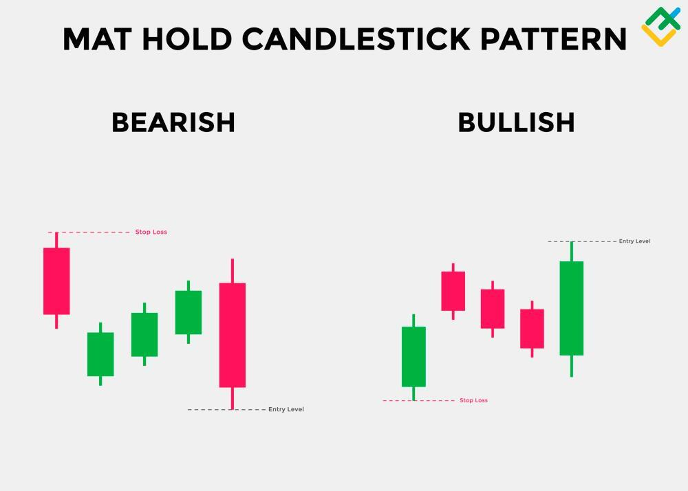

## Table of Contents

## What is a Bearish Mat Hold pattern?

A Bearish Mat Hold pattern is a type of candlestick pattern that traders use to predict a possible downturn in the price of a stock or other financial asset. It usually appears during an uptrend and signals that the trend might be about to reverse. The pattern consists of five candles: the first is a long bullish candle, followed by three small bearish candles that stay within the range of the first candle, and finally, a long bearish candle that closes below the low of the first candle.

The first candle in the Bearish Mat Hold pattern shows that the price is still going up, but then the next three candles show that the upward momentum is weakening. These three candles are called the "mat" because they look like someone is trying to hold or support the price from falling further. However, the final long bearish candle breaks through this "mat" and indicates that the sellers have taken control, pushing the price down significantly. This pattern suggests that it might be a good time for traders to sell or short the asset.

## How does the Bearish Mat Hold pattern form on a chart?

The Bearish Mat Hold pattern starts to form on a chart during an uptrend. The first candle you see is a long bullish candle, which means the price went up a lot that day. This candle shows that buyers were in control and pushing the price higher. But then, things start to change. The next three candles are small and bearish, meaning the price goes down a bit each day, but not too much. These three candles stay within the range of the first big bullish candle. They look like a "mat" because they seem to be holding the price from falling too far.

Then comes the fifth and final candle, which is a long bearish candle. This candle breaks below the low of the first bullish candle, showing that the sellers have taken over. The price drops a lot on this day, breaking through the "mat" formed by the three smaller candles. This final move signals that the uptrend might be over and that the price could keep going down. Traders who spot this pattern might decide it's a good time to sell or short the asset, expecting more price drops in the future.

## What are the key components of a Bearish Mat Hold pattern?

The Bearish Mat Hold pattern is made up of five candles that show a change from an uptrend to a possible downtrend. The first candle is a long bullish one, which means the price went up a lot. This shows that buyers were strong at first. Then, the next three candles are small and bearish. They don't go up or down too much and stay within the range of the first big candle. These three candles look like a "mat" because they seem to be holding the price from falling too far.

The fifth and last candle is a long bearish one. It breaks below the low of the first bullish candle, showing that sellers have taken over. The price drops a lot on this day, breaking through the "mat" formed by the three smaller candles. This final move signals that the uptrend might be over and that the price could keep going down. Traders who see this pattern might decide it's a good time to sell or short the asset, expecting more price drops in the future.

## Can you explain the psychology behind the Bearish Mat Hold pattern?

The Bearish Mat Hold pattern shows how people feel about a stock when it's going up but might start going down. At first, everyone is happy because the price is going up a lot. That's why you see a big green candle. People are buying the stock and feeling good about it. But then, things start to change. The next three days, the price goes down a little bit each day, but not too much. These small red candles show that some people are starting to worry and sell their stocks, but others are still buying and keeping the price from falling too far. It's like they are trying to hold the price up, like a mat.

Then, on the fifth day, something big happens. The price drops a lot, and you see a big red candle. This shows that more people are now worried and selling their stocks. The sellers are now stronger than the buyers, and the price breaks through the "mat" that was holding it up. This change in feelings from happy to worried makes traders think that the price might keep going down. So, they might decide to sell their stocks or even bet that the price will go down more.

## How reliable is the Bearish Mat Hold pattern in predicting price movements?

The Bearish Mat Hold pattern can be useful for traders, but it's not perfect. It's like a warning sign that the price of a stock might start going down after going up for a while. When you see this pattern, it means that more people are starting to sell than buy, which could push the price down. But, it doesn't always happen right away or at all. Sometimes the price might keep going up even after you see the pattern.

How well the Bearish Mat Hold pattern works can depend on a lot of things, like how strong the trend was before the pattern appeared, what's happening in the market overall, and how other people are trading. It's always a good idea to use this pattern along with other signs and tools to make better guesses about where the price might go. Just seeing the pattern isn't enough to be sure about what will happen next, so traders should be careful and not rely on it alone.

## What are the common mistakes traders make when identifying a Bearish Mat Hold?

One common mistake traders make when identifying a Bearish Mat Hold pattern is not paying attention to the size and placement of the candles. The first candle should be a long bullish one, showing a strong upward move. The next three candles should be small and bearish, staying within the range of the first candle. If these candles are too big or go outside the first candle's range, it's not a Bearish Mat Hold. The final candle should be a long bearish one that breaks below the low of the first candle. If traders miss these details, they might think they see the pattern when it's not really there.

Another mistake is not considering the overall market context. The Bearish Mat Hold pattern is more reliable when it appears during a strong uptrend. If the trend before the pattern isn't very strong, the pattern might not mean as much. Traders also need to look at other signs and tools, like other chart patterns or technical indicators, to confirm what the Bearish Mat Hold is telling them. Relying only on this one pattern can lead to wrong guesses about where the price is going.

## How can the Bearish Mat Hold pattern be used in different market conditions?

The Bearish Mat Hold pattern can be useful in different market conditions, but it works best when the market is going up strongly. When you see this pattern during a strong uptrend, it's a good warning that the price might start going down soon. The pattern shows that buyers were in control at first, but then more and more people started selling, and finally, the sellers took over. In a strong uptrend, this change in who's in control can be a strong sign that the price will keep going down. Traders can use this pattern to decide when to sell their stocks or even bet that the price will go down more.

In a market that's not moving much or is going down slowly, the Bearish Mat Hold pattern might not be as helpful. If the market isn't going up strongly before the pattern appears, it might not mean as much when you see it. The pattern could just be a small dip in a market that's not really going anywhere. In these cases, traders should be careful and look at other signs and tools to see if the pattern really means the price will go down. Using the Bearish Mat Hold pattern along with other things can help traders make better guesses about what the market will do next.

## What are the best practices for trading based on the Bearish Mat Hold pattern?

When trading based on the Bearish Mat Hold pattern, it's important to make sure you see all the parts of the pattern correctly. The first candle should be a big green one, showing that the price went up a lot. Then, the next three candles should be small and red, staying within the range of the first big candle. Finally, the fifth candle should be a big red one that goes below the low of the first candle. If any of these parts are missing or different, it might not be a Bearish Mat Hold. Also, the pattern works best when the price has been going up strongly before you see it. If the price wasn't going up much, the pattern might not mean as much.

It's also a good idea to use other tools and signs along with the Bearish Mat Hold pattern. Look at other chart patterns, technical indicators, and what's happening in the market overall to see if they agree with what the Bearish Mat Hold is telling you. This can help you make better guesses about where the price might go next. When you see the pattern and other signs saying the same thing, it might be a good time to sell your stocks or bet that the price will go down more. But remember, no pattern is perfect, so always be careful and ready for the price to do something different than you expect.

## How does the Bearish Mat Hold pattern compare to other bearish reversal patterns?

The Bearish Mat Hold pattern is one of many bearish reversal patterns traders use to guess when a price might start going down after going up. It's different from other patterns like the Bearish Engulfing, Evening Star, and Dark Cloud Cover because it has five candles instead of just two or three. The Bearish Mat Hold starts with a big green candle, followed by three small red candles that stay within the range of the first candle, and ends with a big red candle that goes below the low of the first candle. This pattern shows a slow change from buyers to sellers, which can be a strong sign that the price will keep going down if it happens during a strong uptrend.

Other bearish reversal patterns like the Bearish Engulfing and Evening Star are simpler and quicker to spot. The Bearish Engulfing has two candles: a small green one followed by a big red one that covers the whole green candle. The Evening Star has three candles: a big green one, a small candle that can be green or red, and a big red one. These patterns show a faster change from buyers to sellers, which can be a strong sign too, but they might not show the slow build-up of selling pressure like the Bearish Mat Hold does. Traders should use these patterns along with other signs and tools to make better guesses about where the price might go next.

## What technical indicators complement the Bearish Mat Hold pattern for better trading decisions?

When using the Bearish Mat Hold pattern, traders can make better guesses about where the price might go next by looking at other technical indicators too. One good indicator to use is the Relative Strength Index (RSI). The RSI shows if a stock is overbought or oversold. If the RSI is above 70 when you see the Bearish Mat Hold pattern, it means the stock might be overbought and ready to go down. This can make the pattern more reliable. Another useful indicator is the Moving Average Convergence Divergence (MACD). If the MACD line crosses below the signal line at the same time as the Bearish Mat Hold pattern, it can be a strong sign that the price will keep going down.

Volume is also important when looking at the Bearish Mat Hold pattern. If the volume goes up a lot on the last big red candle of the pattern, it shows that more people are selling, which can make the pattern more powerful. Traders can also use support and resistance levels to see if the price is likely to keep going down after the pattern. If the final red candle breaks through a key support level, it can be a strong sign that the price will keep falling. By using these other indicators along with the Bearish Mat Hold pattern, traders can make better decisions about when to sell their stocks or bet that the price will go down more.

## Can the Bearish Mat Hold pattern be used in algorithmic trading strategies?

Yes, the Bearish Mat Hold pattern can be used in algorithmic trading strategies. In these strategies, computers look at the price and other information to decide when to buy or sell stocks. The Bearish Mat Hold pattern can be programmed into the computer to spot when it appears on a chart. When the computer sees this pattern, it can be set up to sell the stock or bet that the price will go down more. This can help traders make money if the price does go down after the pattern.

To make the strategy work better, the computer can also look at other signs and tools along with the Bearish Mat Hold pattern. For example, it can check the Relative Strength Index (RSI) to see if the stock is overbought, or the Moving Average Convergence Divergence (MACD) to see if the trend is changing. If these other signs agree with the Bearish Mat Hold pattern, the computer can be more sure about selling or betting on the price going down. This way, the strategy can be more reliable and help traders make better decisions.

## What are some real-world examples of the Bearish Mat Hold pattern in action?

In early 2021, a Bearish Mat Hold pattern appeared on the chart of a popular tech stock that had been going up for months. The first day, the stock price jumped a lot, making a big green candle. Then, over the next three days, the price went down a little each day, but not too much, staying within the range of that first big jump. These three days made small red candles that looked like a "mat" holding the price up. On the fifth day, the price dropped a lot, making a big red candle that went below the low of the first day. Traders who saw this pattern sold their stocks or bet that the price would keep going down, and it did, dropping another 10% over the next week.

Another example happened in late 2022 with a well-known retail company. The stock had been going up steadily, but then a Bearish Mat Hold pattern showed up. The first day, the stock made a big green candle, showing strong buying. The next three days, the price went down a bit each day, making small red candles that stayed within the range of the first big candle. On the fifth day, the price fell sharply, making a big red candle that broke below the low of the first day. This pattern signaled to traders that the uptrend might be over. Many traders sold their stocks or shorted the stock, and the price continued to fall over the next few weeks, confirming the pattern's bearish signal.

## What is the role of volume in technical analysis?

Volume is a critical indicator when confirming the validity of a Mat Hold candlestick pattern. This pattern, recognized for its ability to signal continuation in an existing trend, relies heavily on the confirmation provided by [volume](/wiki/volume-trading-strategy) metrics to validate its signals. When the final candle in the Mat Hold pattern forms—a candle that aligns with the initial trend direction—an increased volume at this juncture enhances the pattern's reliability as a continuation signal. 

Analyzing volume alongside price movements is crucial for traders who wish to gauge the strength and resilience of the prevailing market trend. An uptick in volume during the formation of the final candle indicates growing interest and participation from market participants, which can be interpreted as a robust endorsement of the trend's continuation. Mathematically, the correlation between volume (V) and price change (ΔP) can be expressed as a positive reinforcement [factor](/wiki/factor-investing) for market analysts observing the pattern:

$$
\text{Confirmation Factor} = V \times ΔP
$$

where a high confirmation factor signifies stronger trend continuation likelihood in the context of a Mat Hold pattern.

In [algorithmic trading](/wiki/algorithmic-trading), this interplay between volume and candlestick patterns can be codified. Traders can include volume as a complementary metric in their algorithmic models, enhancing their capacity to detect and act upon Mat Hold patterns accurately. High volume during the critical, trend-confirming candle provides a confirmation signal that the market trend is not only intact but potentially strengthening, thereby offering traders greater confidence to engage or augment their positions within the market.

Utilizing Python, a trader might script a basic function to identify Mat Hold patterns with associated volume confirmations as follows:

```python
def is_mat_hold(volumes, prices):
    # Example parameters: prices = list of consecutive closes, volumes = list of corresponding volumes
    if len(prices) < 5 or len(volumes) < 5:
        return False

    # Check for the Mat Hold Pattern: This is highly simplified.
    initial_trend = prices[0] < prices[4]
    consolidation = prices[1] > prices[3] if initial_trend else prices[1] < prices[3]
    confirmed_by_volume = volumes[4] > sum(volumes[1:4]) / 3  # Average consolidation volume

    return initial_trend and consolidation and confirmed_by_volume

# Example usage
prices = [100, 102, 101, 99, 105]
volumes = [2000, 1500, 1600, 1550, 2500]
print(is_mat_hold(volumes, prices))  # Outputs: True if Mat Hold pattern is detected
```

This algorithm leverages both price and volume data to affirm the occurrence of a Mat Hold pattern, ensuring that traders act on validated signals rather than mere price fluctuations. Understanding and applying these principles allows traders to exploit the full potential of the Mat Hold pattern in technical analysis, providing a more sophisticated and informed approach to their trading strategies.

## What are the common mistakes and best practices?

A frequent error made by traders is the excessive reliance on the Mat Hold pattern without considering supplementary indicators or the broader market context. This approach can result in false signals and suboptimal trading performance. To enhance decision-making, it is crucial for traders to seek confirmation signals before acting on a Mat Hold pattern. Confirmation can come from surges in trading volume or alignment with other technical indicators such as the Relative Strength Index (RSI) or Moving Averages. This helps to filter out noise and confirm the validity of the pattern.

Additionally, robust risk management is an essential practice when incorporating the Mat Hold pattern into trading strategies. Clearly defined stop-loss and take-profit levels should be based on thorough analysis of historical pattern performance. This not only helps in safeguarding capital but also in optimizing the risk-reward ratio of trades. For multiple scenarios, traders can calculate optimal stop-loss using historical [volatility](/wiki/volatility-trading-strategies) or Average True Range (ATR) as follows:

$$
\text{Stop-Loss Level} = \text{Entry Price} - (ATR \times \text{Multiplier})
$$

Proper [backtesting](/wiki/backtesting) remains a cornerstone for understanding the historical effectiveness of the Mat Hold pattern. Through backtesting, traders can simulate how the pattern would have performed across different market conditions. This process involves using past price data to test the pattern's success rate and profitability. By adjusting strategies based on backtest results, traders can improve their strategies' predictive power and adapt to changing market dynamics.

Incorporating all these practices ensures a disciplined approach, maximizing the Mat Hold pattern's potential while minimizing risks associated with overreliance and premature trading decisions.

## References & Further Reading

[1]: Bergstra, J., Bardenet, R., Bengio, Y., & Kégl, B. (2011). ["Algorithms for Hyper-Parameter Optimization."](https://papers.nips.cc/paper/4443-algorithms-for-hyper-parameter-optimization) Advances in Neural Information Processing Systems 24.

[2]: ["Advances in Financial Machine Learning"](https://www.amazon.com/Advances-Financial-Machine-Learning-Marcos/dp/1119482089) by Marcos Lopez de Prado

[3]: ["Evidence-Based Technical Analysis: Applying the Scientific Method and Statistical Inference to Trading Signals"](https://www.amazon.com/Evidence-Based-Technical-Analysis-Scientific-Statistical/dp/0470008741) by David Aronson

[4]: ["Machine Learning for Algorithmic Trading"](https://github.com/stefan-jansen/machine-learning-for-trading) by Stefan Jansen

[5]: ["Quantitative Trading: How to Build Your Own Algorithmic Trading Business"](https://books.google.com/books/about/Quantitative_Trading.html?id=j70yEAAAQBAJ) by Ernest P. Chan