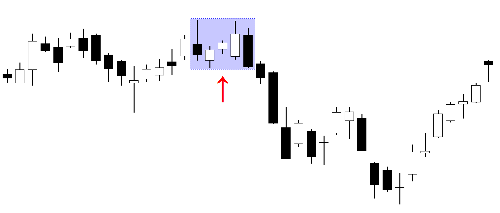

The financial markets present numerous opportunities for individuals who can decipher their complex patterns. One of these patterns, the Mat Hold candlestick pattern, serves as a robust tool in the domain of candlestick charting. This article focuses on the application of the Mat Hold candlestick pattern within algorithmic trading, offering guidance on how traders can incorporate it into their trading strategies.

We will cover the essentials of the Mat Hold pattern, including its identification and variations, as well as the benefits that it offers in trading. The bullish and bearish variants of this pattern play a crucial role in signaling continuation trends, thus holding potential value for traders in various market conditions. A deep understanding of this pattern's intricacies is vital for traders looking to enhance their strategic repertoire.



Additionally, we will outline common errors to avoid and provide best practices for effectively using the Mat Hold pattern in algorithmic trading. This will encompass considerations of volume and integration with other indicators to ensure robust trading strategies. By the conclusion of this article, traders will gain a comprehensive understanding of the Mat Hold pattern and acquire the skills needed to implement it within an algorithmic framework. This thorough grasp will empower traders to leverage the predictive capabilities of the Mat Hold pattern in their trading endeavors effectively.

## Table of Contents

## Understanding the Mat Hold Candlestick Pattern

The Mat Hold candlestick pattern is a significant chart pattern composed of five consecutive candlesticks, and it can appear in both bullish and bearish forms. It is recognized for signaling a continuation of the prevailing [trend following](/wiki/trend-following) a period of consolidation. Understanding this pattern is essential for traders looking to enhance their technical analysis toolkit.

In its bullish form, the Mat Hold pattern begins with a long bullish candle. This is followed by three small bearish candles that indicate a temporary pullback. The sequence concludes with another long bullish candle, which confirms the continuation of the upward trend. The key here is the small size of the middle bearish candles compared to the first and last bullish candles, highlighting the temporary nature of the retracement during the pattern identification phase.

Conversely, the bearish Mat Hold pattern starts with a long bearish candle, succeeded by three small bullish candles representing a brief price correction. The pattern is completed with another long bearish candle, suggesting a continuation of the downward trend. As with its bullish counterpart, the size of the middle candles is crucial—they should not surpass the body length of the initial bearish candle, ensuring they represent mere interim consolidation.

The Mat Hold pattern implies a period of consolidation where the market temporarily moves against the prevailing trend. However, this is not a reversal pattern but rather a warning of a soon-to-continue trend. The accurate identification of these five distinct candlestick phases—characterized by one long initial candle, three smaller opposite-direction candles, and one long final trend-confirming candle—is vital for effective utilization in trading strategies. Recognizing both the bullish and bearish variants enables traders to make informed decisions about market entries and exits, relying on the continuity signals provided by the pattern.

Learning the specifics of the Mat Hold pattern, such as the size and relationship between the candlesticks, allows traders to apply this knowledge in various market conditions. By doing so, they can better align their trading approach to the underlying market dynamics, ultimately enhancing their strategic outcomes.

## Technical Analysis and the Role of Volume

Volume is a critical indicator when confirming the validity of a Mat Hold candlestick pattern. This pattern, recognized for its ability to signal continuation in an existing trend, relies heavily on the confirmation provided by [volume](/wiki/volume-trading-strategy) metrics to validate its signals. When the final candle in the Mat Hold pattern forms—a candle that aligns with the initial trend direction—an increased volume at this juncture enhances the pattern's reliability as a continuation signal. 

Analyzing volume alongside price movements is crucial for traders who wish to gauge the strength and resilience of the prevailing market trend. An uptick in volume during the formation of the final candle indicates growing interest and participation from market participants, which can be interpreted as a robust endorsement of the trend's continuation. Mathematically, the correlation between volume (V) and price change (ΔP) can be expressed as a positive reinforcement [factor](/wiki/factor-investing) for market analysts observing the pattern:

$$
\text{Confirmation Factor} = V \times ΔP
$$

where a high confirmation factor signifies stronger trend continuation likelihood in the context of a Mat Hold pattern.

In [algorithmic trading](/wiki/algorithmic-trading), this interplay between volume and candlestick patterns can be codified. Traders can include volume as a complementary metric in their algorithmic models, enhancing their capacity to detect and act upon Mat Hold patterns accurately. High volume during the critical, trend-confirming candle provides a confirmation signal that the market trend is not only intact but potentially strengthening, thereby offering traders greater confidence to engage or augment their positions within the market.

Utilizing Python, a trader might script a basic function to identify Mat Hold patterns with associated volume confirmations as follows:

```python
def is_mat_hold(volumes, prices):
    # Example parameters: prices = list of consecutive closes, volumes = list of corresponding volumes
    if len(prices) < 5 or len(volumes) < 5:
        return False

    # Check for the Mat Hold Pattern: This is highly simplified.
    initial_trend = prices[0] < prices[4]
    consolidation = prices[1] > prices[3] if initial_trend else prices[1] < prices[3]
    confirmed_by_volume = volumes[4] > sum(volumes[1:4]) / 3  # Average consolidation volume

    return initial_trend and consolidation and confirmed_by_volume

# Example usage
prices = [100, 102, 101, 99, 105]
volumes = [2000, 1500, 1600, 1550, 2500]
print(is_mat_hold(volumes, prices))  # Outputs: True if Mat Hold pattern is detected
```

This algorithm leverages both price and volume data to affirm the occurrence of a Mat Hold pattern, ensuring that traders act on validated signals rather than mere price fluctuations. Understanding and applying these principles allows traders to exploit the full potential of the Mat Hold pattern in technical analysis, providing a more sophisticated and informed approach to their trading strategies.

## Incorporating the Mat Hold Pattern in Algo Trading

Algorithmic trading, or algo trading, leverages computer algorithms to execute trades based on predefined criteria. Integrating the Mat Hold candlestick pattern into algo trading systems can provide traders with a structured method to identify potential continuation signals within trends. This integration enables automated and timely decision-making processes, facilitating efficient trade entries and exits.

Traders can employ programming languages such as Python to code algorithms capable of detecting Mat Hold patterns. This involves setting rules for the sequence of candles that define this pattern: identifying a long initial candle, followed by three smaller counter-trend candles, and capped by another long candle in the original trend direction. For example, a Python code snippet using the `pandas` library for analyzing historical price data might look like this:

```python
import pandas as pd

def detect_mat_hold(data):
    for i in range(len(data)-4):
        if (data['Close'][i] > data['Open'][i] and  # Long bullish candle
            data['Close'][i+1] < data['Open'][i+1] and  # Small bearish candles
            data['Close'][i+2] < data['Open'][i+2] and 
            data['Close'][i+3] < data['Open'][i+3] and
            data['Close'][i+4] > data['Open'][i+4]):  # Long bullish candle
            yield i  # Index where a bullish Mat Hold pattern is detected
```

Moreover, the effectiveness of an algo trading strategy can be improved by combining the Mat Hold pattern with other indicators, such as Moving Averages (MA) or the Relative Strength Index (RSI). This multi-indicator approach can filter out false signals, providing a more comprehensive assessment of market conditions.

Backtesting these strategies is fundamental to understanding their performance across various market environments. Backtesting involves running the algorithm on historical data to assess how well the strategy would have performed in the past, providing insights into potential future profitability. Traders can use [backtesting](/wiki/backtesting) frameworks like `[backtrader](/wiki/backtrader)` in Python to evaluate the performance of the Mat Hold pattern within an algorithmic strategy. This process can highlight the strengths and weaknesses of the pattern and guide traders in optimizing their algorithms for real-world trading scenarios.

## Common Mistakes and Best Practices

A frequent error made by traders is the excessive reliance on the Mat Hold pattern without considering supplementary indicators or the broader market context. This approach can result in false signals and suboptimal trading performance. To enhance decision-making, it is crucial for traders to seek confirmation signals before acting on a Mat Hold pattern. Confirmation can come from surges in trading volume or alignment with other technical indicators such as the Relative Strength Index (RSI) or Moving Averages. This helps to filter out noise and confirm the validity of the pattern.

Additionally, robust risk management is an essential practice when incorporating the Mat Hold pattern into trading strategies. Clearly defined stop-loss and take-profit levels should be based on thorough analysis of historical pattern performance. This not only helps in safeguarding capital but also in optimizing the risk-reward ratio of trades. For multiple scenarios, traders can calculate optimal stop-loss using historical [volatility](/wiki/volatility-trading-strategies) or Average True Range (ATR) as follows:

$$
\text{Stop-Loss Level} = \text{Entry Price} - (ATR \times \text{Multiplier})
$$

Proper backtesting remains a cornerstone for understanding the historical effectiveness of the Mat Hold pattern. Through backtesting, traders can simulate how the pattern would have performed across different market conditions. This process involves using past price data to test the pattern's success rate and profitability. By adjusting strategies based on backtest results, traders can improve their strategies' predictive power and adapt to changing market dynamics.

Incorporating all these practices ensures a disciplined approach, maximizing the Mat Hold pattern's potential while minimizing risks associated with overreliance and premature trading decisions.

## Conclusion

The Mat Hold candlestick pattern is recognized for its ability to act as a reliable continuation signal, making it a valuable asset within algorithmic trading strategies. This pattern, characterized by initial strong movement followed by a consolidation phase and subsequent confirmation of the trend, provides traders with insights that can be strategically harnessed to enhance trading outcomes.

Recognizing the Mat Hold pattern's formation is the first step towards leveraging its potential. Traders must be adept at identifying both the bullish and bearish variants, focusing on the sequence of candlesticks that signal a continuation of the existing trend. The confluence of this pattern with volume analysis strengthens its reliability, as increased volume during the concluding candle of the sequence reinforces the trend's validity and resilience.

Integrating the Mat Hold pattern with additional technical analysis tools, such as Moving Averages or the Relative Strength Index (RSI), further amplifies its effectiveness. These complementary indicators serve to confirm the pattern's signals and provide further market context, reducing the risk of false positives and enhancing prediction accuracy.

For successful algorithmic trading, a systematic approach that encompasses rigorous analysis, thorough backtesting, and strategic implementation is imperative. Backtesting the Mat Hold pattern across different market environments allows traders to understand its behavior under varying conditions, enabling optimization of trading algorithms for improved performance.

Armed with the insights articulated in this article, traders can incorporate the Mat Hold pattern into their strategies, harnessing its predictive power to make informed, data-driven trading decisions. This comprehensive understanding facilitates the development of robust algorithmic systems that capitalize on the continuity signals of the Mat Hold pattern, ultimately leading to more successful trading endeavors.

## FAQs

### What is the Mat Hold candlestick pattern in trading?

The Mat Hold candlestick pattern is a continuation pattern observed in financial charting, typically forming over five trading sessions. It can manifest in both bullish and bearish trends. A bullish Mat Hold begins with a long bullish candle, followed by three smaller bearish candles, and concludes with a final long bullish candle. In a bearish Mat Hold, the opposite occurs: it starts with a long bearish candle, is succeeded by three minor bullish candles, and finalizes with another long bearish candle. This pattern signals a brief period of consolidation before the initial trend resumes. Understanding this pattern can help traders make informed predictions about price movements.

### How can algo traders identify the Mat Hold pattern automatically?

Algorithmic traders can leverage programming languages like Python to automate the detection of the Mat Hold pattern by coding algorithms that analyze candlestick data. The process involves creating a function that identifies the sequence of five specific candles according to the rules defined for the Mat Hold pattern. Python libraries such as Pandas can be used to manipulate data while libraries like TA-Lib can assist in technical analysis. Here's an example of how traders might set initial parameters:

```python
import pandas as pd

def is_mat_hold_pattern(df):
    # Define conditions for bullish Mat Hold
    if (df['Close'][0] > df['Open'][0] and  # Long bullish candle
        df['Close'][1] < df['Open'][1] and df['Close'][2] < df['Open'][2] and df['Close'][3] < df['Open'][3] and  # Three small bearish candles
        df['Close'][4] > df['Open'][4] and  # Final long bullish candle
        df['Close'][4] > df['Close'][0]):  # Closing higher than the first
        return True
    return False 
```

### What are the benefits of combining the Mat Hold pattern with other indicators?

Combining the Mat Hold pattern with other technical indicators can enhance its reliability and predictive power. For example, using Moving Averages provides additional confirmation of trend direction, while the Relative Strength Index (RSI) can help determine overbought or oversold conditions. This multi-layered analysis can improve the robustness of trading decisions by filtering out false signals. By cross-verifying signals with other indicators, traders can better assess market conditions and enhance the effectiveness of their strategies.

### How does volume affect the reliability of the Mat Hold pattern?

Volume is a critical factor in confirming the validity of a Mat Hold pattern. Higher trading volume during the formation of the final candlestick in the pattern typically signifies stronger confirmation of the trend continuation. In other words, if the final bullish or bearish candle forms with a significant increase in volume, it suggests a greater likelihood that the pattern will hold true, as it reflects a stronger market consensus in the direction of the trend. Thus, volume acts as a corroborative measure that lends credibility to the pattern's potential outcome.

### What are some best practices when using the Mat Hold pattern in algorithmic trading?

When using the Mat Hold pattern in algorithmic trading, certain best practices can enhance effectiveness:

1. **Confirmation with Other Indicators**: Relying solely on the Mat Hold pattern without considering other indicators might lead to false signals. Integrate additional technical indicators like volume, Moving Averages, or RSI to confirm potential trades.

2. **Robust Risk Management**: Implement strict stop-loss and take-profit levels based on historical performance of the pattern. This helps manage risk and protect capital from unexpected market moves.

3. **Comprehensive Backtesting**: Conduct thorough backtesting of the algorithm on historical market data to evaluate the pattern's performance across different market conditions. This will provide insights into the pattern's reliability and profitability.

4. **Avoid Premature Execution**: Wait for confirmation signals such as significant volume increase or alignment with trend indicators before executing trades based on the pattern.

5. **Continuous Evaluation**: Regularly review and update the algorithm to reflect changes in market dynamics or new insights from ongoing performance analysis. This ensures the trading strategy remains adaptive and relevant.

## References & Further Reading

[1]: Bergstra, J., Bardenet, R., Bengio, Y., & Kégl, B. (2011). ["Algorithms for Hyper-Parameter Optimization."](https://papers.nips.cc/paper/4443-algorithms-for-hyper-parameter-optimization) Advances in Neural Information Processing Systems 24.

[2]: ["Advances in Financial Machine Learning"](https://www.amazon.com/Advances-Financial-Machine-Learning-Marcos/dp/1119482089) by Marcos Lopez de Prado

[3]: ["Evidence-Based Technical Analysis: Applying the Scientific Method and Statistical Inference to Trading Signals"](https://www.amazon.com/Evidence-Based-Technical-Analysis-Scientific-Statistical/dp/0470008741) by David Aronson

[4]: ["Machine Learning for Algorithmic Trading"](https://github.com/stefan-jansen/machine-learning-for-trading) by Stefan Jansen

[5]: ["Quantitative Trading: How to Build Your Own Algorithmic Trading Business"](https://books.google.com/books/about/Quantitative_Trading.html?id=j70yEAAAQBAJ) by Ernest P. Chan