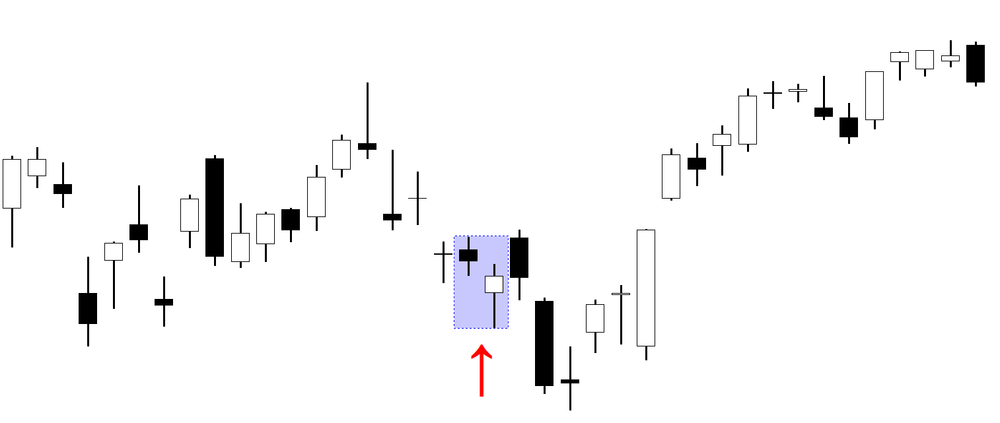

## Table of Contents

## What is the Bearish On-Neck Line pattern?

The Bearish On-Neck Line pattern is a type of candlestick pattern used in technical analysis to predict future price movements in financial markets. It occurs during a downtrend and suggests that the bearish trend will continue. The pattern consists of two candles: the first is a long bearish candle, showing a strong downward movement, and the second is a smaller bullish candle that opens lower than the first candle's close but closes near the low of the first candle's body.

When you see this pattern, it means that although the bulls tried to push the price up after a big drop, they couldn't gain much ground. The price ended up closing near where the first candle ended, showing that the bears are still in control. Traders often see this as a sign to keep selling or to stay out of the market if they are thinking about buying, expecting the price to keep falling.

## How does the Bearish On-Neck Line pattern form?

The Bearish On-Neck Line pattern forms during a time when prices are already going down. Imagine you're looking at a chart and you see that prices have been dropping for a while. Then, you see a big red candle, which means the price fell a lot that day. This big red candle is the first part of the pattern. It shows that sellers were very strong and pushed the price down significantly.

After this big drop, the next day starts with the price a bit lower than where the big red candle ended. This is the start of the second candle in the pattern. But, even though the price tries to go up a little during the day, it can't get much higher. By the end of the day, the price closes very close to where the big red candle finished. This small green candle shows that buyers tried to push the price up but didn't have enough power. The pattern tells us that the sellers are still in charge and the price might keep falling.

## What are the key components of the Bearish On-Neck Line pattern?

The Bearish On-Neck Line pattern happens when prices are already going down. The first part of this pattern is a big red candle, which means the price dropped a lot on that day. This big drop shows that sellers were very strong and they pushed the price down a lot. This big red candle is important because it sets the stage for what happens next.

After the big drop, the next day starts with the price a bit lower than where the big red candle ended. This is the start of the second candle in the pattern. During this day, the price tries to go up a little, but it can't get much higher. By the end of the day, the price closes very close to where the big red candle finished. This small green candle shows that buyers tried to push the price up but didn't have enough power. This pattern tells us that the sellers are still in control and the price might keep falling.

## Can you explain the psychology behind the Bearish On-Neck Line pattern?

The Bearish On-Neck Line pattern shows what people are thinking when prices are going down. Imagine the price has been dropping for a while, and then there's a big drop on one day. This big drop makes people who want to sell feel strong because they see the price going down a lot. They think they can keep selling and the price will keep falling. This big drop is like a signal that the sellers are in charge.

After this big drop, the next day starts with the price a bit lower than where it ended the day before. People who want to buy see this as a chance to buy at a lower price. They try to push the price up a little bit during the day, but they can't make it go up much. By the end of the day, the price is back to where it was at the end of the big drop. This shows that the people who want to sell are still stronger than the people who want to buy. It tells everyone watching the market that the sellers are still in control and the price might keep going down.

## How reliable is the Bearish On-Neck Line pattern in predicting price movements?

The Bearish On-Neck Line pattern is seen as a sign that prices might keep going down, but it's not always right. Like any pattern used to guess where prices are going, it depends on other things happening in the market too. Sometimes, even if you see this pattern, the price might not go down as expected because of new news or changes in what people think.

Traders often use this pattern along with other signs and tools to make better guesses about where prices will go. If you see the Bearish On-Neck Line and other things also show that prices might go down, it can make you more sure about your guess. But if you only look at this one pattern, you might not always get it right. So, it's good to use it with other ways of looking at the market.

## What are the differences between the Bearish On-Neck Line and Bullish On-Neck Line patterns?

The Bearish On-Neck Line and Bullish On-Neck Line patterns are opposite to each other and show different things about where prices might go. The Bearish On-Neck Line happens when prices are already going down. You see a big red candle showing a big drop, followed by a small green candle that tries to go up but ends near where the big drop ended. This pattern means that even though buyers tried to push the price up, they couldn't do it much, and sellers are still in control, so prices might keep falling.

On the other hand, the Bullish On-Neck Line pattern happens when prices are going up. You see a big green candle showing a big rise, followed by a small red candle that tries to go down but ends near where the big rise ended. This pattern means that even though sellers tried to push the price down, they couldn't do it much, and buyers are still in control, so prices might keep rising. Both patterns are about how strong the buyers or sellers are, but they show opposite directions for where prices might go next.

## How should traders confirm the Bearish On-Neck Line pattern?

To confirm the Bearish On-Neck Line pattern, traders should look at more than just the pattern itself. They need to check other signs in the market to see if they also show that prices might keep going down. For example, they might look at other patterns, like the moving averages or the Relative Strength Index (RSI), to see if they also suggest that the market is still in a downtrend. If these other signs agree with the Bearish On-Neck Line, it makes the pattern more reliable.

Traders also need to pay attention to what's happening in the market overall. If there's news or events that could make prices go down, it can make the Bearish On-Neck Line pattern more likely to be right. It's important to use the pattern along with other tools and information to make better guesses about where prices will go. By doing this, traders can feel more sure about their decisions and be ready for what might happen next in the market.

## What are the best entry and exit points when trading the Bearish On-Neck Line pattern?

When trading the Bearish On-Neck Line pattern, a good entry point is right after the second candle in the pattern closes. This is the small green candle that ends near the close of the big red candle. If you see this pattern and other signs also show that prices might keep going down, you might want to start selling or short-selling at this point. Waiting for the second candle to close helps make sure the pattern is complete and gives you a clearer signal that the bearish trend might continue.

For the [exit](/wiki/exit-strategy) point, you should watch the price closely after you enter the trade. A good time to exit might be when you see signs that the price is starting to go up again. You could set a target price that you think the price might reach if it keeps going down, based on other patterns or levels in the market. Also, it's smart to set a stop-loss order just above the high of the second candle in the pattern. This helps protect you if the price suddenly goes up instead of down. By setting these points, you can manage your risk and try to make a profit from the bearish move.

## Can the Bearish On-Neck Line pattern be used in conjunction with other technical indicators?

Yes, the Bearish On-Neck Line pattern can be used with other technical indicators to make better guesses about where prices might go. Traders often look at moving averages to see if the market is still in a downtrend. If the price is below a moving average, it can support the idea that prices might keep going down. The Relative Strength Index (RSI) is another tool that can help. If the RSI is showing that the market is overbought, it might mean that prices could drop soon, making the Bearish On-Neck Line pattern more likely to be right.

Also, traders can use [volume](/wiki/volume-trading-strategy) to confirm the pattern. If the volume is high during the big drop shown by the first candle, it means more people are selling, which makes the pattern stronger. Other patterns like support and resistance levels can also be useful. If the price is near a support level and you see the Bearish On-Neck Line, it could mean the price might break through the support and keep falling. By using these other tools along with the Bearish On-Neck Line pattern, traders can feel more sure about their decisions and be ready for what might happen next in the market.

## What are some common mistakes traders make when using the Bearish On-Neck Line pattern?

One common mistake traders make when using the Bearish On-Neck Line pattern is relying on it too much by itself. They might see the pattern and think prices will keep going down without looking at other signs in the market. But the pattern works better when you use it with other tools like moving averages or the RSI. If these other signs don't agree with the pattern, the pattern might not be as reliable.

Another mistake is not waiting for the second candle to close before making a trade. Some traders might get excited when they see the first big drop and start selling right away. But it's important to wait until the small green candle closes near the end of the big drop to make sure the pattern is complete. Jumping in too early can lead to wrong guesses about where prices will go.

## How does the Bearish On-Neck Line pattern perform across different time frames and markets?

The Bearish On-Neck Line pattern can be seen in different time frames, like daily, hourly, or even minute charts, and in different markets like stocks, [forex](/wiki/forex-system), or cryptocurrencies. How well it works can change depending on the time frame and the market. In shorter time frames, like hourly charts, the pattern might show quick moves in price, but these moves can be less reliable because the market can change fast. In longer time frames, like daily charts, the pattern might show bigger trends that last longer, making it more useful for traders who want to hold onto their trades for a while.

In different markets, the pattern can also work differently. In the stock market, where there might be more news and events affecting prices, the Bearish On-Neck Line pattern might need more confirmation from other signs to be reliable. In the forex market, where prices can move a lot because of different countries' economies, the pattern might be more useful if you also look at things like interest rates or economic reports. In the [cryptocurrency](/wiki/cryptocurrency) market, where prices can be very up and down, the pattern might show quick changes, but traders need to be careful and use other tools to make sure they're making the right guesses about where prices will go.

## Are there any advanced strategies or variations of the Bearish On-Neck Line pattern that expert traders use?

Expert traders sometimes use the Bearish On-Neck Line pattern with other patterns to make better guesses about where prices might go. For example, they might look for the pattern near a resistance level. If the price hits a resistance level and then forms the Bearish On-Neck Line, it can mean that the price might break through the resistance and keep going down. Traders might also combine the pattern with other bearish patterns, like the bearish engulfing pattern or the evening star pattern, to see if they all agree that prices will keep falling. By looking at these other patterns together, traders can feel more sure about their trades.

Another advanced strategy is to use the Bearish On-Neck Line pattern with different time frames. Traders might look at the pattern on a daily chart and then check a shorter time frame, like an hourly chart, to find a good time to start selling. If the pattern shows up on both time frames, it can make the signal stronger. Also, some traders might use the pattern with different kinds of orders, like trailing stop-loss orders, to follow the price down and protect their profits. By using these advanced strategies, traders can make better use of the Bearish On-Neck Line pattern and try to make more money from their trades.

## References & Further Reading

[1]: Bulkowski, T. (2008). ["Encyclopedia of Candlestick Charts"](https://onlinelibrary.wiley.com/doi/book/10.1002/9781119202288). John Wiley & Sons.

[2]: Nison, S. (1991). ["Japanese Candlestick Charting Techniques: A Contemporary Guide to the Ancient Investment Techniques of the Far East"](https://www.amazon.com/Japanese-Candlestick-Charting-Techniques-Contemporary/dp/0139316507). New York Institute of Finance.

[3]: Murphy, J. J. (1999). ["Technical Analysis of the Financial Markets: A Comprehensive Guide to Trading Methods and Applications"](https://archive.org/details/technicalanalysi0000murp). New York Institute of Finance.

[4]: Tharp, V. K. (1998). ["Trade Your Way to Financial Freedom"](https://www.amazon.com/Trade-Your-Way-Financial-Freedom/dp/007147871X). McGraw-Hill Education.

[5]: Elder, A. (2002). ["Come into My Trading Room: A Complete Guide to Trading"](https://www.amazon.com/Come-Into-My-Trading-Room/dp/0471225347). John Wiley & Sons.