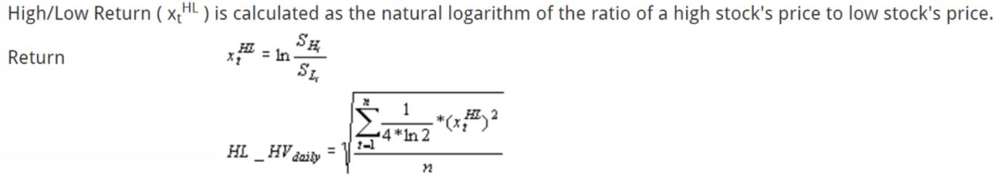

Understanding volatility is crucial in financial markets, serving as a fundamental concept for traders, risk managers, and econometricians. Volatility measures the rate at which the price of a financial asset increases or decreases for a given set of returns. A key aspect of volatility analysis lies in accurately capturing market movements, which can directly impact trading decisions and risk assessments.

Traditional methods, such as close-to-close historical volatility (CCHV), primarily focus on price changes from one closing price to the next. While these methods have been widely used, they often fail to capture significant intraday price movements. Intraday volatility reflects short-term fluctuations that are not visible in CCHV calculations, potentially leading to an underestimation of actual market volatility.



The Becker-Parkinson Volatility algorithm offers a solution by incorporating daily high and low prices to provide a more detailed view of market volatility. This approach considers the full range of price movements within a trading day, offering a richer depiction of market dynamics compared to traditional methods. By utilizing both the highest and lowest prices observed during a trading session, the algorithm enhances the understanding of volatility, making it particularly valuable for more accurate forecasting and decision-making.

This article explores the Becker-Parkinson Volatility algorithm, detailing its calculation methods and its role in the field of algorithmic trading. By providing insight into this advanced volatility measure, the article aims to highlight its significance and potential benefits for market participants seeking to improve their trading strategies and risk assessments.

## Table of Contents

## Challenges with Traditional Volatility Measures

Traditional [volatility](/wiki/volatility-trading-strategies) measures, particularly the close-to-close historical volatility (CCHV), focus solely on price changes from one day's closing price to the next. This method, while straightforward, carries inherent limitations because it neglects significant intraday price movements. Fluctuations within the trading day often provide essential insights into market volatility. For instance, if a stock experiences substantial price swings during the trading day but closes at the same price as it opened, the CCHV would misleadingly indicate zero volatility.

One of the main drawbacks of CCHV is its inability to reflect the market's volatility during trading hours. Markets are dynamic systems where prices are subject to continuous change due to a multitude of factors such as economic news releases, corporate announcements, and trader activities. The high-low range of prices recorded during these hours can be significantly different from mere opening and closing prices, offering a more accurate depiction of a security's volatility.

Algorithmic traders, who extensively use automated systems to execute trades based on pre-defined criteria, require more robust volatility measures that capture these intraday dynamics. They make decisions in real-time and need precise volatility assessments to optimize their trading strategies. Inaccuracies in volatility measurement can lead to suboptimal decision-making, resulting in potential financial losses. Therefore, adopting a more comprehensive volatility measure that includes intraday fluctuations is critical for effective risk assessment and strategy formulation in [algorithmic trading](/wiki/algorithmic-trading).

## The Becker-Parkinson Volatility Algorithm Explained

The Becker-Parkinson Volatility algorithm offers a refined approach to measuring market volatility by utilizing the range of daily high and low prices. This contrasts with traditional methods that primarily focus on closing prices, such as the close-to-close historical volatility (CCHV), which often disregard significant intraday market movements. The primary advantage of the Becker-Parkinson method lies in its ability to capture the full spectrum of market dynamics within a trading day.

The underlying mathematics of the Becker-Parkinson method involves the calculation of volatility based on the logarithmic range between the highest and lowest prices observed during a trading session. This range is considered a more accurate reflection of the volatility experienced throughout the day, as it accounts for both upward and downward fluctuations within the same period.

In essence, the algorithm calculates volatility as follows:
$$

\sigma = \sqrt{\frac{1}{4 \ln(2)} \times \left(\ln\left(\frac{H}{L}\right)\right)^2} 
$$
where $\sigma$ represents the volatility, $H$ is the high price of the day, and $L$ is the low price of the day. The factor $\frac{1}{4 \ln(2)}$ is a scaling constant that adjusts the range to better align with the characteristics of volatility as traditionally measured.

By incorporating the highs and lows rather than merely the closing prices, the Becker-Parkinson volatility metric offers a more robust and comprehensive view of market activity, allowing for improved volatility forecasting. This is particularly beneficial for algorithmic traders who depend on precise volatility estimates to fine-tune their trading strategies, manage risk effectively, and optimize performance. This approach thus represents a substantial improvement over traditional measures that fail to encapsulate the full breadth of market conditions encountered during daily trading.

## Implementing Becker-Parkinson Volatility in Algorithmic Trading

Algorithmic trading utilizes automated systems designed to execute trades based on pre-established criteria. By incorporating the Becker-Parkinson Volatility algorithm, traders can optimize these systems to better measure and adapt to market volatility. This method stands out by considering the full spectrum of each trading day's price movements, thus providing a more detailed assessment of volatility than traditional measures.

To effectively compute Becker-Parkinson Volatility, Python is a particularly useful tool, offering a practical means for traders to integrate this calculation into their algorithms. Python’s vast library ecosystem, specifically Pandas and NumPy, allows for efficient data manipulation and mathematical operations necessary for such computations. The Becker-Parkinson Volatility formula, which assesses market volatility by analyzing the range of daily high and low prices, can be smoothly implemented in Python, facilitating its incorporation into trading strategies.

Here is an example of how one might calculate Becker-Parkinson Volatility using Python:

```python
import numpy as np
import pandas as pd

def becker_parkinson_volatility(data):
    # Ensure the data is a pandas DataFrame with 'High' and 'Low' price columns
    high_low_log = np.log(data['High'] / data['Low'])
    volatility = (high_low_log ** 2).mean() ** 0.5
    return volatility

# Example usage
# Assuming 'data' is a DataFrame with 'High' and 'Low' columns
data = pd.DataFrame({
    'High': [120, 125, 130],
    'Low': [110, 115, 125]
})

volatility_value = becker_parkinson_volatility(data)
print("Becker-Parkinson Volatility:", volatility_value)
```

This approach enables traders to continuously update their models with the latest market data, refining trading algorithms for enhanced performance. By leveraging Python's capabilities, traders ensure that their systems remain as responsive and accurate as possible, reflecting current market conditions with a high level of detail. Such integration of the Becker-Parkinson Volatility measure supports more informed decision-making and potentially improved trading outcomes.

## Calculating Becker-Parkinson Volatility in Python

Calculating Becker-Parkinson Volatility using Python involves utilizing high and low price data to gain a comprehensive understanding of market volatility. The formula accounts for intraday price movements and is defined as follows:

$$
\sigma_{BP} = \frac{1}{4\ln(2)} \left(\frac{H_t}{L_t}\right)^2
$$

where $H_t$ and $L_t$ represent the high and low prices of a given trading day. This method offers a more accurate estimate than simply looking at closing prices.

Python's powerful libraries such as Pandas and NumPy facilitate the efficient computation of Becker-Parkinson Volatility. Pandas enables easy handling and manipulation of time-series data, while NumPy provides the mathematical functions necessary for calculations.

Here's a basic outline of how traders can implement this calculation:

```python
import pandas as pd
import numpy as np

# Example DataFrame structure
data = {
    'High': [120, 125, 130],
    'Low': [115, 118, 122]
}
df = pd.DataFrame(data)

# Calculate Becker-Parkinson Volatility
df['BP_Volatility'] = (1 / (4 * np.log(2))) * (np.log(df['High'] / df['Low']) ** 2)

print(df)
```

This script computes the Becker-Parkinson Volatility for each trading day, storing results in a new DataFrame column. Traders can automate this process to ensure continuous recalibration of volatility metrics as fresh data arrives. This automation is crucial in real-time trading environments, and Python's scripting capabilities make it a suitable choice for such tasks. By maintaining up-to-date volatility calculations, traders enhance their strategies' responsiveness to market changes, therefore making better-informed decisions.

## Advantages of Using Becker-Parkinson Volatility

The Becker-Parkinson Volatility algorithm offers several advantages over traditional volatility metrics, particularly in providing a more nuanced and responsive depiction of market movements. One of the key benefits of this approach lies in its use of the range of daily high and low prices, which results in a more granular real-time view of market fluctuations. This level of detail is crucial in rapidly changing markets where price dynamics can significantly impact trading strategies and decisions.

By leveraging this comprehensive measure, the Becker-Parkinson Volatility algorithm enhances the accuracy of risk assessment. Traditional methods, which often rely solely on close-to-close price changes, do not capture the full spectrum of intraday price variability. Consequently, the Becker-Parkinson algorithm can provide a more reliable foundation for decision-making in algorithmic trading systems, helping traders better understand and mitigate potential risks associated with volatile market conditions.

Moreover, the algorithm offers valuable insights for [backtesting](/wiki/backtesting) trading strategies. It captures the actual volatility experienced during trading hours, reflecting true market conditions rather than an averaged or incomplete measure. This capability allows traders to more effectively evaluate the performance of trading algorithms and develop strategies that are responsive to true market behaviors. By incorporating the Becker-Parkinson Volatility metric, algorithmic traders can improve the predictive power and robustness of their models, ultimately leading to better trading outcomes.

The advantages offered by the Becker-Parkinson Volatility algorithm make it a compelling choice for those seeking to enhance the precision of their trading strategies and risk management practices. As markets continue to evolve, the ability to accurately measure and respond to volatility remains a critical component of successful algorithmic trading.

## Conclusion

The Becker-Parkinson Volatility algorithm effectively addresses the limitations inherent in traditional volatility measures, which often fail to capture the complete range of market dynamics due to their reliance only on closing prices. By incorporating the range between daily high and low prices, the algorithm provides a more nuanced and comprehensive representation of market volatility. This is particularly valuable for algorithmic traders who require precise and real-time assessments to optimize trading strategies and manage risk.

Integrating the Becker-Parkinson Volatility measure into algorithmic trading systems allows traders to enhance their market assessments, leading to improved decision-making and potentially more profitable trading outcomes. The detailed view of volatility it provides means that algorithmic systems can better adapt to market conditions, optimizing entry and [exit](/wiki/exit-strategy) points and refining risk management protocols.

As algorithmic trading evolves, there is potential for the further refinement and utilization of such advanced volatility algorithms. Future advancements may include more sophisticated models that integrate real-time data analytics, [machine learning](/wiki/machine-learning), and other emerging technologies, thereby enhancing the precision and application of volatility measures like the Becker-Parkinson algorithm in increasingly complex trading environments. These developments could further cement the algorithm's role in optimizing trading performance and risk assessment in financial markets.

## References & Further Reading

[1]: Parkinson, M. (1980). ["The Extreme Value Method for Estimating the Variance of the Rate of Return."](https://www.jstor.org/stable/2352357) Journal of Business, 53(1), 61-65.

[2]: Becker, R., & Clements, A. E. (2008). ["Are Combination Forecasts of S&P 500 Volatility Statistically Superior?"](https://www.sciencedirect.com/science/article/pii/S0169207007001240) Journal of Banking & Finance, 32(7), 1309-1321.

[3]: Garman, M. B., & Klass, M. J. (1980). ["On the Estimation of Security Price Volatilities from Historical Data."](https://www.jstor.org/stable/2352358?item_view=read_online) Journal of Business, 53(1), 67-78.

[4]: Hull, J. C. (2018). ["Options, Futures, and Other Derivatives."](https://www.pearson.com/nl/en_NL/higher-education/subject-catalogue/finance/Options-Futures-and-Other-Derivatives-Hull.html) Pearson Education.

[5]: Cont, R. (2001). ["Empirical Properties of Asset Returns: Stylized Facts and Statistical Issues."](https://www.tandfonline.com/doi/abs/10.1080/713665670) Quantitative Finance, 1(2), 223-236.