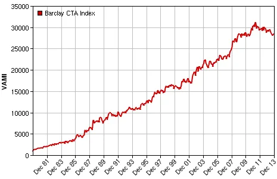

Quant developers are the linchpins of the finance and technology nexus, spearheading the development and implementation of complex mathematical models pivotal for pricing and trading financial instruments. Their roles demand a blend of sophisticated coding skills and intricate financial knowledge, serving to bridge the gap between theoretical finance and its practical application in real-time trading systems.

In our contemporary financial landscape, the reliance on technology-driven solutions is paramount. Herein lies the pronounced relevance of quant developers. As markets evolve at breakneck speeds, financial strategies require continuous refinement, and quant developers ensure that these strategies are underpinned by accurate, reliable algorithms. The rapid ascendancy of algorithmic trading, high-frequency trading (HFT), and the growing FinTech and decentralized finance (DeFi) domains further amplify their significance. Their expertise not only fortifies the technological underbelly of traditional financial institutions but also empowers disruptive start-ups aiming to redefine the contours of the financial sector. As we navigate the multifaceted ecosystem of modern finance, the indelible impact and escalating prominence of quant developers remain clear and undeniable.

## Table of Contents

## Comprehensive Understanding of a Quant Developer

### Definition & Role

At the core, a quant developer is a specialist in both quantitative finance and software development, tasked with creating and optimizing algorithmic trading strategies, constructing mathematical models for pricing, risk management, and other financial functionalities. Their niche expertise lies in translating abstract mathematical concepts and strategies into tangible, executable code that can interact with, and thrive within, the dynamic world of financial markets[1].

What sets [quant developer](/wiki/becoming-a-quant-developer)s apart is their duality. They don't just devise algorithms; they fundamentally understand the intricate financial theories behind them. Whether it's assessing market risk, predicting asset price movements, or identifying [arbitrage](/wiki/arbitrage) opportunities, the algorithms they craft serve as the backbone of these financial operations.

For instance, in derivative pricing, quant developers might employ stochastic calculus to model the unpredictable behavior of financial markets and then convert these mathematical models into software applications that provide real-time pricing and risk assessments for derivatives[2]. Similarly, in portfolio optimization, they utilize mathematical models to determine the best allocation of assets to maximize returns for a given level of risk.

In [algorithmic trading](/wiki/algorithmic-trading), a domain which has witnessed a surge in its adoption, quant developers craft intricate algorithms that can execute trades at superhuman speeds, capitalizing on market inefficiencies that might exist only for fractions of a second[3]. This convergence of speed, accuracy, and strategy enables financial firms to secure a competitive edge, with quant developers at the very helm of this technological revolution.

Furthermore, the role of quant developers extends beyond just model creation. They are also pivotal in refining and validating models, ensuring they remain robust, relevant, and resistant to the myriad of challenges posed by the evolving financial landscape. By continually adapting and innovating, quant developers not only respond to market changes but often anticipate them, shaping the very frontier of modern finance.

In essence, the 'why' of quant developers is clear: they transform theoretical financial insights into actionable, real-world tools, thereby driving efficiency, innovation, and strategic advantage in the finance sector. The 'how' is through their interdisciplinary prowess, bridging the worlds of finance and tech with their adeptness in both realms.

### Comparative Analysis

In the intricate tapestry of finance and tech, multiple roles converge, and it's essential to discern how a quant developer uniquely stands out.

Starting with a fundamental distinction, **quantitative analysts**, or simply "quants," focus on creating mathematical models to predict market behavior, value securities, and assess risks[4]. They immerse themselves in abstract financial theories, statistical tools, and computational methods to draw insights. Conversely, quant developers materialize these insights into tangible, operational software. They build, test, and optimize platforms and tools that apply these models in real-time trading and risk management scenarios. While both roles require a firm grip on mathematics and finance, quant developers have a more profound intersection with software engineering and programming.

Contrasting with **software developers** in the broader tech realm, quant developers have a domain-specific focus on financial markets. While a software developer might be responsible for developing a wide array of applications, from mobile apps to cloud infrastructure, a quant developer tailors software specifically for financial analysis and operations. Their programming challenges are not just about functionality but also about ensuring that financial theories and models are correctly and efficiently represented and executed.

**Data scientists**, another critical role in both sectors, deep dive deep into big data, extracting meaningful patterns and drawing actionable insights[5]. They utilize a vast array of statistical and machine learning techniques, often overlapping with some methods used by quants. However, while data scientists might work on diverse datasets, from e-commerce behavior to social media trends, quant developers maintain a sharp focus on financial data, marrying the rigor of financial modeling with computational expertise.

**Traditional financial analysts** primarily concentrate on studying market trends, corporate financial statements, and economic indicators to provide investment advice[6]. They might leverage tools and software developed by quant developers but don't deep dive into the algorithmic intricacies or software development that quant roles demand.

**Traders** operate on the frontline of financial markets, making buy and sell decisions based on a mixture of data analysis, intuition, and market knowledge. In modern finance, especially algorithmic and high-frequency trading, traders and quant developers work in tandem. Traders rely on the algorithms and software tools crafted by quant developers to execute strategies at speeds and scales impossible for humans.

In sum, while many roles in the finance and tech sectors overlap in skills and objectives, the quant developer is a unique hybrid. They bridge the chasm between abstract financial theory and its practical, real-time application in the market, harnessing both the depth of quantitative finance and the dynamism of software development.

### Day in the Life

Imagine the bustling heart of a Wall Street firm, where milliseconds can dictate millions in profits or losses. At its core, amidst this high-frequency chaos, sits the quant developer, a pivotal player ensuring seamless operations, optimizations, and innovations.

The day typically begins with a **code review session**. Just as the markets never sleep, neither does the ever-evolving codebase that supports it. Quant developers collaboratively inspect recent algorithm implementations, ensuring accuracy and efficiency[7].

By mid-morning, a quant developer might be deeply engrossed in **[backtesting](/wiki/backtesting)**[8]. This process involves applying trading strategies to historical data to ascertain their effectiveness. It's a rigorous task, demanding immense computational power and precision. Here, even minor code tweaks can lead to significantly different results, hence the need for meticulous attention to detail.

Lunch breaks can sometimes be accompanied by impromptu discussions with quantitative analysts. Quants, as they're colloquially known, often brainstorm on new strategies or financial models. The quant developer's task is to understand, from a technical perspective, how to best translate these mathematical and financial theories into practical, executable code.

The afternoon could involve **real-time monitoring and troubleshooting**. With markets active, quant developers ensure that their algorithms run flawlessly, making real-time adjustments as needed. In moments of sudden market [volatility](/wiki/volatility-trading-strategies), their tools must remain resilient, adaptive, and swift.

In parallel, **database management** is ongoing. Quant developers frequently interact with vast troves of financial data, from stock prices to economic indicators. They might spend time optimizing database queries, ensuring rapid data retrieval crucial for real-time trading algorithms.

As the trading day concludes, post-market hours provide a valuable window for **system upgrades and maintenance**. It's a race against time. With Asian markets soon to commence trading, the systems must be primed, tested, and ready.

Throughout the day, quant developers also engage in **continuous learning**[9]. The financial world is in perpetual flux, with new technologies like quantum computing and [deep learning](/wiki/deep-learning) making headway. Staying updated is not just a benefit—it's a necessity.

In essence, a quant developer's day is a blend of rigorous technical work, collaborative interactions, swift problem-solving, and continuous evolution. Amidst the dynamic backdrop of the financial markets, they stand as the crucial bridge between theoretical finance and its real-world execution.

## The Landscape of Quant Developers

### Demand & Growth

Quant developers have steadily anchored themselves at the nexus of finance and technology. As financial markets become more complex and automated, the demand for their unique skillset has surged.

According to the Bureau of Labor Statistics, roles associated with quantitative analysis, which encompasses quant developers, are expected to grow by 25% from 2019 to 2029, significantly faster than the average for all occupations. This growth stems from the increasing sophistication of financial products and the sheer [volume](/wiki/volume-trading-strategy) of digital data available to be analyzed.

The rise of algorithmic trading further fuels this demand. A report from the Tabb Group indicated that algorithmic trades account for around 50% of U.S. equity shares traded. Quant developers play a pivotal role in creating, optimizing, and maintaining these algorithms.

Emerging markets, too, present a vast expanse for growth. As countries like India and China increasingly integrate algorithmic strategies into their financial systems, there's a palpable demand for professionals who can meld financial acumen with technological prowess.

Furthermore, [hedge fund](/wiki/hedge-fund-trading-strategies)s and proprietary trading firms are on a relentless hunt for top-tier quant developer talent. Citadel, for instance, dedicates significant resources to recruit the best minds from fields like physics, computer science, and engineering for quantitative roles.

Expert opinions reflect this bullish sentiment. Dr. Ernest P. Chan, a recognized authority in algorithmic trading, opines that the evolution of quantitative strategies, especially with the incorporation of [machine learning](/wiki/machine-learning), ensures a sustained demand for quant developers[10]. They're not just required for strategy development but also for managing the vast infrastructure that supports high-frequency trading.

However, with demand comes competition. The rise in specialized financial engineering programs and quantitative finance [course](/wiki/best-algorithmic-trading-courses)s means that there's an influx of qualified professionals entering the market. This landscape suggests that while opportunities abound, quant developers will need to continually upgrade and diversify their skills to remain at the forefront.

In visual terms, a graph plotting the demand for quant developers over the past two decades would show a notable upward trajectory. Projecting into the next decade, while the exact slope might be debated, the consensus remains - the path is ascending.

### Types of Quant Developers

In the dynamic ecosystem of finance, quant developers often align their expertise with specific functionalities and requirements. Predominantly, they categorize themselves into Front Office, Middle Office, and Back Office developers. Each category has its distinct attributes, responsibilities, and interfaces with different aspects of a financial institution.

**Front Office Quant Developers** primarily engage with revenue-generating activities. They're deeply intertwined with trading and investment strategies. Working closely with traders and quantitative researchers, they design, implement, and optimize algorithms for high-frequency trading, derivative pricing, and risk management. Their work directly impacts a firm's profitability. A front office quant developer might be tasked with ensuring a trading algorithm executes orders at the optimal speed or helping in real-time decision-making based on current market data.

**Middle Office Quant Developers** function as the bridge between the front and back offices. Their focus is largely on risk management and compliance. They develop systems to monitor and control the risks associated with trading activities – be it market risk, credit risk, or operational risk. By creating models that forecast potential losses in various market scenarios or by ensuring trades comply with regulatory requirements, they maintain the safety and integrity of the firm’s operations. Moreover, they validate models created by the front office to ensure their accuracy and reliability.

**Back Office Quant Developers** are the backbone that supports both the front and middle office functions. Their work revolves around developing and maintaining the infrastructure that the entire trading operation relies upon. This includes tasks like database management, ensuring smooth trade settlements, and handling post-trade evaluations. They ensure that all trades are correctly recorded, cleared, and settled. While their work might not directly influence trading strategies, the robustness and efficiency of the infrastructure they provide are paramount to the overall success of a trading operation.

In essence, while all three types of quant developers share a foundational skill set, their day-to-day responsibilities, and the parts of the trading operation they interact with, can differ significantly. A front office developer's work might see immediate profit or loss results based on the day's trades, while a back office developer's efficiency will be judged by the smoothness of the infrastructure and systems. Middle office developers, on the other hand, safeguard the firm from potential pitfalls by ensuring risks are well-monitored and controlled.

Choosing a path among these depends largely on one's interests. If real-time action and directly influencing profitability appeal to you, the front office might be your calling. If you're more inclined towards creating robust systems and ensuring efficient operations, the back office could be your niche.

### Salary & Compensation

Quant developers, given their specialized skill set and the critical role they play in the financial world, are often compensated generously. However, the exact figures vary depending on a multitude of [factor](/wiki/factor-investing)s.

As of recent data, entry-level quant developers in the US can expect salaries ranging from $80,000 to $120,000, with an average base salary hovering around the $100,000 mark[11]. With experience and progression, this can swiftly climb, with mid-level developers often pulling in between $150,000 and $250,000. Senior quant developers, or those leading teams, can see their compensation reach or even exceed the $500,000 range when bonuses and other benefits are factored in.

One of the notable characteristics of quant developer compensation is the bonus structure. Depending on the firm and its performance, bonuses can significantly inflate earnings. In some high-performing hedge funds or proprietary trading firms, bonuses can match or even surpass the base salary.

Geography plays a considerable role in these figures. Major financial hubs such as New York, London, or Hong Kong often offer higher salaries to account for the cost of living. In contrast, those working in smaller markets might see slightly reduced figures but can enjoy a comparatively lower cost of living.

Another influencing factor is the size and reputation of the employer. Global investment banks, elite hedge funds, and renowned proprietary trading firms tend to offer higher compensations compared to smaller institutions or startups. However, it's worth noting that smaller firms or startups might provide other incentives such as equity stakes or more flexible work conditions.

Specialization within the field can also lead to variation in compensation. For instance, quant developers with expertise in high-frequency trading algorithms or advanced machine learning models catering to financial predictions might command a premium over others.

In terms of growth potential, the ever-evolving financial landscape, marked by technological advancements and increased algorithmic trading, promises robust demand for quant developers. This continuous demand, coupled with the niche skill set required for the job, ensures that the salary trajectory for quant developers remains upwardly inclined for the foreseeable future.

## Delving into the Essential Skills

### Scientific Computing

Scientific computing stands as a cornerstone in quant development. At its core, it involves the utilization of advanced mathematical models and computational techniques to solve intricate problems, primarily those that are too complex for analytical solutions. In the financial world, where quant developers thrive, the ability to simulate, optimize, and analyze vast amounts of data in real-time is indispensable, and this is where the prowess of scientific computing comes into play.

Financial markets are known for their complexity. The numerous variables involved, from [interest rate](/wiki/interest-rate-trading-strategies)s to geopolitical events, render analytical solutions almost impossible for many problems. Here, scientific computing provides quant developers with the tools to create numerical simulations. For example, Monte Carlo simulations, a method rooted in scientific computing, allows quants to model the probability of different outcomes in a process that cannot easily be predicted due to the intervention of random variables[12].

Option pricing, a pivotal aspect of financial markets, also leans heavily on scientific computing. The famous Black-Scholes model, while being analytical, has its limitations. For more complex financial derivatives, quant developers often resort to numerical methods, like finite difference methods or binomial trees, to price these instruments.

Furthermore, optimization is a recurrent theme in finance. Whether it's portfolio optimization, where the goal is to maximize returns for a given risk, or capital allocation strategies, scientific computing techniques such as linear programming and quadratic programming are regularly employed.

In addition to simulations and optimizations, data analysis is paramount. With the surge in algorithmic trading, the ability to sift through vast datasets to find patterns, anomalies, or correlations has become invaluable. Techniques from scientific computing, when combined with statistical methods, equip quant developers with the ability to develop, backtest, and refine trading algorithms.

Scientific computing's significance is not just confined to its direct applications but also in the development of efficient algorithms. Financial computations, especially in high-frequency trading, demand speed. Algorithms derived from scientific computing principles ensure that these computations are not just accurate but also fast, ensuring that trading decisions are made in real-time, capitalizing on the smallest market inefficiencies.

### Programming Proficiency

Programming proficiency for a quant developer goes beyond mere familiarity with a set of languages. It's about leveraging those languages to model complex financial systems, optimize algorithms for performance, and ensure accurate, real-time data analysis.

Languages such as Python, C++, Java, and R have established themselves as mainstays in the quant developer toolkit. Python, with its extensive libraries like NumPy and pandas, facilitates rapid development and prototyping, making it a favorite for data analysis and algorithmic strategy development. C++, known for its performance capabilities, is often chosen for high-frequency trading applications where microseconds can mean the difference between profit and loss.

Yet, it's not just about knowing a language, but mastering its nuances and understanding how to exploit its strengths while mitigating its weaknesses. For instance, while Python excels in flexibility and ease of use, it may not always be the best choice for performance-critical applications. Here, a quant developer might employ a hybrid approach, prototyping in Python but implementing the final solution in C++ for optimal speed.

Real-world challenges arise in the form of vast data streams that need real-time processing, intricate algorithms demanding optimization, and the need for systems to be both scalable and reliable. To tackle these, quant developers must be adept at parallel and concurrent programming, ensuring that code can handle multiple tasks simultaneously without bottlenecks or crashes.

Memory management is another critical area. Inefficient memory usage can drastically slow down computations, leading to missed trading opportunities. Deep knowledge of data structures and algorithms, therefore, is essential, allowing developers to choose the most efficient tools for the task at hand and optimize them further if necessary.

In terms of solutions, the open-source community has been invaluable. Libraries and frameworks tailored to financial computing have emerged, providing pre-built solutions to many common challenges. Quantlib, for instance, offers a wide range of tools for quantitative finance[13], allowing developers to focus on unique problems rather than reinventing the wheel.

Furthermore, with the rise of machine learning in finance, programming proficiency now also encompasses familiarity with ML frameworks like TensorFlow or PyTorch. These tools allow quant developers to integrate predictive models into their strategies, offering a competitive edge in the market.

### Software Engineering

For quant developers, software engineering is not just about writing code; it's about crafting efficient, reliable, and maintainable systems that can handle the demands of the financial sector. Embracing software engineering's best practices ensures that the solutions quant developers create are robust and adaptable to the rapidly evolving world of finance.

**Version Control**: Any software project, be it in finance or otherwise, benefits from effective version control. Tools like Git allow quant developers to track changes, collaborate with others, and ensure that the entire codebase's history is available for review or rollback[14].

**Continuous Integration and Continuous Deployment (CI/CD)**: In the high-stakes realm of finance, it's imperative that any updates or changes to a system are tested rigorously before deployment. CI/CD practices, coupled with tools like Jenkins or Travis CI, automatically test and deploy code changes, ensuring that the system is always in a deployable state.

**Test-Driven Development (TDD)**: By writing tests before the actual code, quant developers can ensure that their software behaves as expected. This practice not only leads to more reliable code but also makes it easier to refactor and expand upon the codebase in the future[15].

**Agile Methodologies**: The Agile approach, with its iterations and feedback loops, is well-suited for the dynamic nature of financial markets. Whether it's Scrum or Kanban, adopting Agile methodologies allows for rapid adaptation to changing requirements and more efficient project management[16].

**Code Review**: Regularly reviewing code with peers ensures that mistakes are caught early and that the code adheres to the team's quality standards. It also fosters a culture of continuous learning and collaboration.

**Profiling and Optimization**: In finance, speed can be a competitive edge. Tools like profilers help quant developers identify bottlenecks in their code, allowing for targeted optimizations.

**Modular Design**: By designing systems in modular chunks, quant developers ensure that individual components can be tested, updated, or replaced without disrupting the entire system.

**Design Patterns**: These are tried and tested solutions to common software design problems. For instance, the Observer pattern can be used to notify trading algorithms when specific market conditions are met, while the Singleton pattern might ensure that a particular piece of data is only instantiated once, reducing redundancy[17].

**Documentation**: While often overlooked, comprehensive documentation ensures that the purpose and functionality of a piece of software are clear, not only to its original developer but to any team member who might work with it in the future.

### Database Mastery

In the digital age, where data is likened to oil, the finance sector is no exception to the data revolution. Quant developers operate at this nexus, and mastery over databases is non-negotiable for them.

Databases play a critical role in quantitative finance for several reasons:

1. **Volume of Financial Data**: Every day, global markets generate vast amounts of data - from stock prices and forex rates to economic indicators and corporate financial statements. Storing, managing, and retrieving this data efficiently is paramount.
2. **Real-time Access and Analysis**: Financial models often require up-to-the-second data. Whether it's high-frequency trading or risk management systems, the ability to pull real-time data from databases can make the difference between profit and loss.
3. **Data Integrity**: The reliability of financial models hinges on the quality of data they consume. Databases, when properly managed, ensure consistency, accuracy, and reliability of the stored data, which, in turn, builds confidence in the analytics and predictions of quantitative models.
4. **Complex Queries**: The financial sector often requires complex data analytics, like time-series analysis or correlations between multiple assets. Mastery over SQL (Structured Query Language) and understanding the nuances of database schema design allow quant developers to execute these complex queries efficiently[18].
5. **Historical Data and Backtesting**: Before any financial model is deployed, it's rigorously tested against historical data. This backtesting demands quick retrieval of vast historical datasets, emphasizing the importance of well-structured and indexed databases.
6. **Scalability and Performance**: As financial firms grow, so does the volume of their data. A deep understanding of database systems ensures that as the data grows, the retrieval times remain fast, and the system remains robust.
7. **Integration with Other Systems**: Quant developers often need to integrate database systems with other software tools, be it programming languages like Python or R, analytics platforms, or visualization tools. Seamless integration is only possible with a deep understanding of database architectures and APIs.
8. **Security**: Financial data is both sensitive and valuable. Mastery over databases also involves understanding encryption, access controls, and other security measures to protect this data from breaches and unauthorized access.

In application, quant developers might utilize relational databases for structured data, like SQL databases, while turning to NoSQL databases for unstructured or semi-structured data, such as time-series data or social media sentiment analysis. They may also leverage distributed databases, like Apache Cassandra, for high availability and fault tolerance in mission-critical applications.

### Finance and Algorithms

The intertwining of finance and algorithms represents the heart of quantitative development. Algorithms – systematic, step-by-step computational procedures – fuel the analysis, forecasting, and decision-making processes within the world of finance. Here's how quant developers employ them to address financial challenges:

1. **Portfolio Optimization**: One of the seminal applications of algorithms in finance is the optimization of portfolios, where the goal is to maximize returns for a given level of risk. The Markowitz efficient frontier is a foundational model in this area, which uses quadratic programming to identify the optimal asset allocation.
2. **High-Frequency Trading (HFT)**: HFT strategies employ algorithms to execute a large number of orders at rapid speeds. These strategies might exploit minute price discrepancies or anticipate market movements based on order flow. The algorithms must be highly efficient, given the short time frames and massive data volumes involved.
3. **Risk Management**: Algorithms assist financial institutions in assessing and hedging against potential losses. This involves value-at-risk calculations, credit risk modeling, and stress testing scenarios to ensure the firm's financial stability under various conditions.
4. **Derivative Pricing**: Options, futures, and other derivatives are complex financial instruments whose pricing often requires sophisticated mathematical models. Algorithms like the Black-Scholes model for option pricing or the Monte Carlo simulation for path-dependent options are pivotal in this realm.
5. **Algorithmic Trading Strategies**: Quant developers design strategies like statistical arbitrage, pair trading, and momentum-based strategies, which rely on mathematical models and algorithms to identify and exploit market inefficiencies.
6. **Sentiment Analysis**: With the proliferation of digital media, algorithms can now scrape news articles, financial reports, or social media to gauge market sentiment. Natural language processing (NLP) techniques are often employed to quantify this sentiment and predict market movements.
7. **Credit Scoring**: Lenders, including banks and fintech firms, use algorithms to assess the creditworthiness of borrowers. These algorithms evaluate numerous factors, from income and employment history to transaction patterns, ensuring more accurate and unbiased lending decisions.
8. **Fraud Detection**: In a world rife with electronic transactions, algorithms play a crucial role in identifying unusual patterns that might indicate fraudulent activities. Machine learning models, in particular, have become adept at spotting these anomalies in real-time.
9. **Asset Price Prediction**: Time-series forecasting models, like ARIMA or LSTM neural networks, are often used by quants to predict future price movements of assets, helping traders make informed decisions.
10. **Robo-Advisors**: Automated platforms providing financial advice or investment management online with minimal human intervention leverage algorithms to assess an individual's financial situation and recommend suitable investment strategies.

### Machine & Deep Learning

Machine and deep learning have swiftly permeated the finance sector, bringing transformative capabilities to the domain of quantitative development. Their prowess lies in their ability to extract patterns and insights from vast datasets, something conventional algorithms often struggled with.

1. **Predictive Modeling**: At the core, machine learning excels in prediction tasks. In finance, this is manifested in forecasting stock prices, predicting market crashes, or estimating credit risk. Algorithms like random forests or gradient boosting machines can parse multiple factors simultaneously to produce forecasts, while deep learning networks, especially recurrent neural networks (RNNs), have shown promise in time series forecasting due to their ability to handle sequential data.
2. **Natural Language Processing (NLP)**: Deep learning, particularly transformers and BERT-like models, has revolutionized NLP tasks in finance. This includes sentiment analysis from financial reports, news articles, and even social media to gauge market sentiment or predict stock movements[19].
3. **Algorithmic Trading**: Machine learning models can optimize trading strategies by understanding the intricate relationships in the data. Reinforcement learning, a type of machine learning where algorithms learn optimal actions through trial and error, is gaining traction for dynamic portfolio management and optimizing trading strategies[20].
4. **Credit Scoring & Underwriting**: Traditional credit scoring has its limitations, especially when assessing new borrowers with limited credit histories. Machine learning models, by considering a plethora of data points, can produce more nuanced and accurate credit risk assessments, reducing defaults and fostering inclusive finance.
5. **Anomaly Detection**: Deep learning models, especially autoencoders, have proven adept at anomaly detection. In finance, this translates to identifying unusual trading patterns, potential market manipulations, or detecting fraudulent transactions.
6. **Personalized Banking & Robo-Advisors**: Machine and deep learning models analyze a customer's transaction history, investment preferences, and risk appetite to offer personalized financial advice or investment strategies, enhancing user experience and financial outcomes.
7. **Risk Management**: Neural networks and ensemble models can simulate complex market scenarios, facilitating more comprehensive risk assessments. This includes understanding potential market downturns and suggesting optimal hedging strategies.
8. **Feature Engineering & Data Compression**: Deep learning, especially autoencoders, can distill vast datasets into a more manageable form by creating compact representations or new features, which can then be used for various financial tasks, from trading to risk assessment.

Machine and deep learning's rise in the finance world underscores a broader trend: the increasing reliance on data-driven decision-making. As computational power continues to grow and datasets become even more extensive, the role of machine and deep learning in quantitative development is set to expand, offering even more refined tools and strategies for financial analysis and decision-making.

### Soft Skills

While technical prowess forms the backbone of a quant developer's expertise, soft skills play an indispensable role in shaping their overall efficacy and contributions to an organization.

**Communication**: Quant developers frequently interface with traders, risk managers, and other stakeholders, translating complex mathematical models into actionable business insights. Clear articulation ensures that strategies are not only developed but are also understood and implemented accurately. Whether it's elucidating the nuances of a model, explaining the implications of an analysis, or even documenting code, effective communication aids in bridging the gap between the quantitative and the business worlds.

**Teamwork**: The financial ecosystem is multifaceted, and tasks often transcend departmental silos. Quant developers may collaborate with data engineers to access requisite datasets, work alongside software developers to integrate models into larger systems, or team up with researchers to refine algorithms. The ability to work harmoniously within cross-functional teams can expedite project timelines and elevate the quality of outcomes.

**Problem-solving**: finance is riddled with intricacies, from ever-evolving market dynamics to regulatory constraints. Quant developers must possess an innate curiosity and a methodical approach to dissect challenges, propose hypotheses, and devise solutions. This isn't merely about applying existing algorithms; it's about innovatively tweaking them or even devising new ones to cater to unique financial challenges.

**Adaptability**: The financial world is in perpetual flux, with market conditions, regulations, and technologies constantly changing. A quant developer's ability to quickly adapt, learn, and pivot is crucial. Whether it's the introduction of a new asset class, a shift in economic policy, or the emergence of a novel machine learning algorithm, staying agile ensures relevance and effectiveness.

**Emotional Intelligence (EQ)**: Financial markets can be volatile, and decisions often impact significant sums of money. Being able to manage one's emotions, empathize with colleagues, and handle stress are pivotal attributes. A high EQ can enhance decision-making, foster positive workplace relationships, and mitigate the potential for hasty, emotionally-driven errors.

**Time Management & Organization**: Given the fast-paced nature of financial markets, timely model development and analysis are paramount. Efficiently juggling multiple tasks, prioritizing them based on impact, and adhering to deadlines ensures that opportunities are not missed and risks are promptly addressed.

### Technical & Theoretical Acumen

In quant development, one's proficiency is not just determined by coding or computing skills but also by an understanding of intricate financial models and theories. The marriage of technical expertise with solid theoretical grounding enables quant developers to craft solutions that are both technically sound and financially relevant.

**Option Pricing Models**: Central to the world of derivatives trading, option pricing models like the Black-Scholes model provide the foundation for valuating options and understanding the complex interplay of factors like time, volatility, and interest rates[21]. Quant developers harness these models to build simulation tools, perform sensitivity analyses, and devise hedging strategies.

**Value at Risk (VaR)**: A key metric in risk management, VaR quantifies the potential loss an investment portfolio could face over a specific period for a given confidence interval. By employing statistical methods and Monte Carlo simulations, quant developers assist in determining and optimizing an institution's exposure to potential losses.

**Portfolio Optimization Models**: Stemming from the pioneering work of Harry Markowitz on Modern Portfolio Theory (MPT), these models aim to allocate assets in such a manner as to maximize returns for a given level of risk. Quant developers implement these theories to create asset allocation tools and automated trading systems.

**Merger Models**: In the world of investment banking and corporate finance, understanding the financial implications of potential mergers or acquisitions is paramount. Quant developers engage in building and refining merger models that dissect the financials of the entities involved, forecast post-merger scenarios, and provide insights into potential synergies or pitfalls.

**Fixed Income Models**: Bonds and other fixed income securities possess their unique set of challenges, including interest rate risk and credit risk. Quant developers employ models like the Vasicek or the Cox-Ingersoll-Ross to simulate interest rate paths, thereby assisting traders and portfolio managers in their decision-making process.

**Stochastic Calculus in Finance**: Used extensively in option pricing and risk management, stochastic calculus provides a framework for modeling financial instruments whose value is uncertain or evolves randomly over time. It forms the basis of many complex derivatives models, and a good grasp is essential for quant developers working in this space.

**Statistical Arbitrage and Pairs Trading**: Leveraging statistical methods to identify price discrepancies between related securities, these strategies are a staple in algorithmic trading. Quant developers play a pivotal role in identifying potential pairs, backtesting strategies, and implementing high-frequency trading algorithms to exploit minute price divergences.

Theoretical understanding serves as the compass, guiding the technical solutions towards meaningful and profitable implementations.

## Navigating the Quant Developer Career Path

### Educational Roadmap

For aspiring quant developers, the educational path chosen can serve as a powerful cornerstone, equipping them with the knowledge and skills to excel in the competitive world of quantitative finance. Here's a breakdown of degrees, courses, and certifications that can bolster a quant developer profile:

**Bachelor’s Degree**:

- **Computer Science**: Offers a solid foundation in algorithms, data structures, and programming, critical for quant development roles.
- **Mathematics/Statistics**: Introduces students to advanced mathematical concepts and techniques, essential for many financial models.
- **Physics or Engineering**: Especially useful for problem-solving and quantitative reasoning, and often valued in quant roles for their rigorous approach to complex problems.

**Master’s & Ph.D. Programs**:

- **Master’s in Financial Engineering (MFE)**: Tailored specifically for quant roles, MFE programs merge finance theory with computational practice, covering topics like derivatives pricing, risk management, and stochastic calculus[22].
- **Master’s/Ph.D. in Quantitative Finance**: Focuses on the mathematical and statistical side of finance, delving deep into financial models and econometrics.
- **Master’s/Ph.D. in Computer Science or Applied Mathematics**: While not finance-specific, these degrees can provide a robust foundation for algorithm design, machine learning, and optimization, which are all integral in quant development.

**Courses and Specializations**:

- **C++ for Financial Engineering**: Given the prevalence of C++ in quant roles, courses tailored to its use in finance can be invaluable.
- **Algorithmic Trading & Quantitative Analysis**: Explores the design and implementation of quantitative trading strategies[23].
- **Machine Learning for Finance**: As machine learning's relevance grows in finance, courses that focus on its application in predicting stock prices, options pricing, or risk assessment become essential.
- **Advanced Econometrics**: Provides insight into financial time series analysis and forecasting.

**Certifications**:

- **CQF (Certificate in Quantitative Finance)**: A part-time financial mathematics program for professionals aiming to upskill or pivot into quant roles[24].
- **FRM (Financial Risk Manager)**: While more risk-focused, it offers deep insights into market risks, credit risks, and operational risks that quants often need to model or understand.
- **CFA (Chartered Financial Analyst)**: Not strictly for quant developers but provides a comprehensive education in finance, which can be invaluable, especially for those transitioning from more technical roles into finance.

**Online Platforms & MOOCs**: Websites like Coursera, edX, and Udacity offer specialized courses in areas like machine learning, computational finance, and algorithmic trading. These platforms provide flexible learning opportunities, often created in collaboration with top-tier universities and industry leaders.

In sum, while a strong educational background can significantly enhance one's profile and skill set, it's also vital to complement formal education with real-world applications and continuous learning, ensuring relevance and adaptability in a rapidly evolving field.

### Self-Study & Resources

Dedicated self-study, aided by a selection of high-quality resources, is pivotal for both aspiring and established quant developers aiming to keep up with the ever-evolving field of quantitative finance. Here's a curated list of top [books](/wiki/algo-trading-books), online resources, and courses that can serve as invaluable tools on your journey:

**Books**:

- **"Quantitative Finance For Dummies" by Steve Bell**: An accessible primer that covers the fundamentals of quantitative finance, ideal for those just starting out.
- **"Paul Wilmott Introduces Quantitative Finance" by Paul Wilmott**: A comprehensive introduction to quantitative finance, touching upon crucial topics like derivatives pricing and risk management.
- **"The Concepts and Practice of Mathematical Finance" by Mark S. Joshi**: Offers insights into the mathematical underpinnings of finance, coupled with practical applications.
- **"Algorithmic Trading: Winning Strategies and Their Rationale" by Ernie Chan**: Explores algorithmic trading strategies and the reasons behind their success.

**Online Resources**:

- **QuantStart**: An informative platform offering articles, tutorials, and advice on algorithmic trading, quantitative finance, and programming[25].
- **Quantopian**: An online platform that offers tools and tutorials for individuals to develop, test, and execute algorithmic trading strategies.
- **Wilmott Forums**: Online discussion boards where professionals and enthusiasts discuss topics related to quantitative finance, risk management, and more[26].
- **Quantitative Research and Trading**: A blog by Dr. Jonathan Kinlay, offering insights into quantitative trading strategies and financial engineering.

**Courses**:

- **"Introduction to Computational Finance and Financial Econometrics" on Coursera**: Offers a blend of theory and practical computation, introducing students to risk management and asset pricing.
- **"Python for Finance" on Udemy**: Tailored specifically for finance professionals and students, this course investigates into using Python for trading, investment, and risk management.
- **MIT OpenCourseWare’s "Financial Derivatives"**: A free course that provides an in-depth study of financial derivatives in continuous-time models.

While these resources can immensely aid your learning, remember that the field of quantitative finance is vast and constantly evolving. Regularly updating your knowledge, participating in online communities, and tackling real-world projects will help ensure that you remain at the forefront of quant development.

### Building a Portfolio

Crafting a robust portfolio is pivotal for quant developers, as it serves as a testament to their capabilities, showcases their expertise, and differentiates them from the competition. Here are actionable steps and tips to consider:

1. **Select the Right Projects**: Start by picking projects that not only demonstrate your technical prowess but also your ability to solve real-world financial problems. These could range from predictive models for stock prices, optimizing trading strategies, or simulating complex financial scenarios.
2. **Diversify Your Showcase**: Highlight a mix of projects - from simple analytical models to complex machine learning applications. This breadth showcases versatility and the ability to operate at various levels of complexity.
3. **Detailed Documentation**: For each project, provide a comprehensive write-up. Outline the problem statement, the methodologies employed, the data sources used, and the results achieved. This makes your projects accessible to both technical and non-technical viewers.
4. **Emphasize the Process, Not Just Results**: In quant development, understanding the journey is as crucial as the outcome. Highlight your decision-making process, challenges faced, and how you overcame them. This provides insight into your problem-solving skills.
5. **Interactive Visualizations**: Incorporate interactive charts, graphs, and simulations that let viewers engage with your projects. Tools like Tableau or D3.js can be valuable for this purpose.
6. **Use Public Repositories**: Platforms like GitHub or GitLab can host your code, making it accessible to potential employers. Ensure your code is clean, well-commented, and organized. Accompany repositories with READMEs that guide visitors through your projects[27].
7. **Engage in Competitions**: Participate in quantitative competitions or Kaggle challenges. Not only does this improve your skills, but winning or even participating in such competitions adds a feather to your cap.
8. **Seek Feedback**: Regularly share your portfolio with mentors, peers, or online communities. Constructive feedback can provide insights you might have missed and enhance your presentation.
9. **Keep it Updated**: As with any profession, the field of quant development is ever-evolving. Regularly add new projects, remove outdated ones, and update existing projects with new data or methodologies.
10. **Personal Branding**: While the focus is on your work, don't neglect the aesthetics and usability of your portfolio site. Ensure it's mobile-responsive, has intuitive navigation, and reflects a bit of your personality.

Remember, a portfolio is more than just a collection of projects; it's a reflection of your journey, expertise, and passion as a quant developer. Invest time in it, and it can open doors to opportunities and collaborations.

### Job Application Strategy

Embarking on the journey to become a quant developer involves not only mastering the technicalities but also strategizing your approach to job applications. Effectively presenting oneself can make a substantial difference in landing coveted roles. Here's a strategic approach:

1. **Tailored Resumes**: Avoid generic resumes. Modify your resume for each job application to highlight skills and experiences most relevant to the job description. Use keywords from the job posting and showcase projects or experiences that align with the company's needs.
2. **Quantify Achievements**: Rather than just listing responsibilities, quantify your achievements. For example, "Developed a trading algorithm that improved efficiency by 15%" is more impactful than "Developed a trading algorithm."
3. **Professional Platforms**: Utilize platforms like LinkedIn[28] to its fullest. Ensure your profile is complete, with a professional photo, detailed descriptions of your roles, and endorsements for relevant skills. Regularly share and engage with content related to quantitative finance to increase your visibility.
4. **Networking**: Building a strong network is invaluable. Attend conferences, workshops, and seminars catered to quants. Engage with professionals, join online forums, and participate in group discussions. Personal connections can often lead to job referrals and openings that aren't publicly advertised.
5. **Specialized Job Boards**: Instead of limiting yourself to general job boards, focus on niche platforms that cater to quantitative roles, such as Quantitative Finance Jobs or QuantStart.
6. **Follow Companies of Interest**: Stay updated with companies you aspire to join. Engaging with their content, understanding their culture, and being informed about their latest ventures can give you an edge in interviews.
7. **Application Tracking**: Keep a record of where you've applied, the job description, and any communication you've had with the company. This helps in following up and also ensures you're well-prepared when they reach out.
8. **Prepare for Technical Tests**: Many quant developer roles require candidates to undergo technical tests or challenges. Practice regularly, familiarize yourself with common test formats, and be prepared to showcase your problem-solving skills in real-time.
9. **Show Continuous Learning**: The finance and tech sectors are dynamic. Highlight any recent courses, certifications, or projects on your resume and professional profiles to demonstrate your commitment to staying updated.
10. **Seek Feedback**: If you're unsuccessful after an interview, politely ask for feedback. This can offer valuable insights into areas you might need to work on or strategies you might need to tweak.

Approaching your job search with a well-thought-out strategy can dramatically enhance your chances of success, making your transition into a quant developer role smoother and swifter.

### Ace the Interview

When it comes to interviewing for a quant developer position, preparation is key. Understand that these interviews often test a blend of technical expertise, problem-solving abilities, and cultural fit. Here’s how to make a strong impression:

1. **Understand the Firm**: Research the company’s strategies, products, and market standing. Knowing how the firm operates in the financial world gives you a contextual understanding that can guide your answers.
2. **Refresh Technical Knowledge**: Review fundamental concepts in quantitative finance, programming, and data structures. Sites like LeetCode and Project Euler offer problems that can help hone your coding and analytical skills.
3. **Expect Real-World Problems**: Quant interviews often involve real-world problems that the firm is facing or has faced in the past. Be prepared to think critically, ask clarifying questions, and propose feasible solutions.
4. **Brush Up on Finance Concepts**: Even if the role is highly technical, some knowledge of finance – especially as it relates to the company's operations – is beneficial. Be comfortable with concepts like Black-Scholes, CAPM, or other relevant financial models.
5. **Practice Mental Math**: Quick arithmetic can come in handy, especially when discussing algorithms or data analysis. Being sharp with numbers demonstrates analytical prowess.
6. **Prepare for Behavioral Questions**: Questions like "Describe a challenging project you’ve worked on" assess not just your technical skills but also your problem-solving approach, teamwork, and adaptability.
7. **Showcase Your Portfolio**: If you’ve built a portfolio, be ready to discuss your projects in detail. Highlight challenges faced, your problem-solving approach, and the impact of your solution.
8. **Ask Thoughtful Questions**: This is your opportunity to assess the company as well. Questions about team dynamics, the company's tech stack, or ongoing projects can provide insights into your role and show your genuine interest.
9. **Follow the STAR Technique**: When answering competency-based questions, structure your answers using the STAR technique: Situation, Task, Action, and Result[29]. This ensures clarity and showcases your contribution and the outcome.
10. **Mock Interviews**: Before the real deal, practice with peers or use platforms like Pramp that offer mock technical interviews. Feedback from these sessions can be invaluable.
11. **Stay Calm and Think Aloud**: It's okay to take a moment to think. Interviewers often appreciate when candidates think aloud, as it offers a window into their problem-solving process.

Remember, interviews are as much about assessing cultural and team fit as they are about technical prowess. Approach them with confidence, and view them as a two-way street where both you and the company are assessing fit.

### Professional Growth

In quant development, staying static is not an option. Ensuring consistent professional growth is paramount not only for personal advancement but also for keeping pace with the rapid advancements in financial technologies and methodologies.

1. **Continuing Education**: With the continuous evolution of technology and finance, a lifelong commitment to learning is essential. Consider enrolling in courses or obtaining advanced degrees in areas like computational finance, machine learning, or advanced statistical methods. Many top-tier universities and institutions offer specialized programs, such as the Master of Financial Engineering.
2. **Seminars and Workshops**: These are invaluable platforms for gaining insights into the latest industry trends, best practices, and groundbreaking research. For instance, the CQF Institute regularly conducts seminars and events that are goldmines of knowledge for quants.
3. **Networking**: Building and maintaining relationships with fellow quant developers, traders, and finance professionals can open doors to collaborations, job opportunities, and knowledge sharing. Engaging in discussions on platforms like Quantitative Finance Stack Exchange can be beneficial.
4. **Industry Conferences**: Conferences such as the Quantitative Open, RiskMinds, and others offer exposure to cutting-edge practices and allow for networking with industry leaders.
5. **Joining Professional Organizations**: Institutions like the International Association for Quantitative Finance (IAQF) offer resources, events, and opportunities tailored for quant professionals. Being a member often grants access to exclusive content, discounted event tickets, and a network of experienced professionals.
6. **Certifications**: Earning relevant certifications can significantly boost your profile. For instance, the Certificate in Quantitative Finance (CQF) is a globally recognized credential that can elevate your professional standing.
7. **Stay Updated with Journals**: Publications such as the Journal of Quantitative Finance offer deep dives into current research, techniques, and findings that can be critical for anyone looking to be at the forefront of the domain.
8. **Participate in Research**: Engaging in original research, either independently or in collaboration, can cement your reputation as an expert. Many professional organizations and journals are always on the lookout for groundbreaking work in the field.
9. **Engage in Online Communities**: Websites like QuantStart or Wilmott serve as thriving communities where professionals discuss challenges, share solutions, and provide insights on the latest tools and methodologies.
10. **Mentorship**: As you grow, consider taking on a mentorship role for budding quant developers. This not only helps the community but also sharpens your skills, as teaching often offers a fresh perspective on known concepts.

Staying proactive in your professional growth ensures that you remain a relevant, effective, and innovative quant developer, capable of navigating the complexities of today's financial landscape.

## Challenges & Solutions in the Life of a Quant Developer

In the dynamic realm of finance and technology, quant developers often encounter intricate challenges that demand both their technical prowess and problem-solving dexterity. Addressing these challenges is what makes their role central in driving innovation and ensuring smooth financial operations. Here are some of the significant challenges they face and the inventive solutions they've conjured.

1. **Overfitting Models**: In their pursuit to develop sophisticated financial models, quant developers might sometimes end up creating algorithms that are too finely tailored to past data, rendering them ineffective for future predictions[30].
    - **Solution**: Regularization techniques, cross-validation, and simpler models are often employed to avoid overfitting, ensuring the models are robust and adaptive to new data.
2. **Data Quality Issues**: Reliable models necessitate reliable data. Inconsistencies, inaccuracies, or incomplete data can lead to misguided decision-making.
    - **Solution**: Implementing rigorous data validation and cleaning procedures, along with sourcing data from reliable vendors, helps maintain data integrity.
3. **Changing Market Dynamics**: Financial markets are ever-evolving, and strategies that worked yesterday might not be effective today.
    - **Solution**: Continuous monitoring, back-testing, and adaptive algorithms allow quant developers to keep their strategies relevant and effective.
4. **Model Complexity**: While complexity might enhance accuracy, it can also make models less interpretable and harder to debug or validate.
    - **Solution**: Balancing complexity with interpretability, using techniques like feature selection and employing models like decision trees that offer clearer insights.
5. **Computational Limitations**: Some financial models, especially those involving simulations, can be computationally intensive, leading to latency issues.
    - **Solution**: Leveraging cloud computing, parallel processing, and GPU acceleration helps handle computationally demanding tasks seamlessly.
6. **Regulatory Hurdles**: As financial markets are heavily regulated, any tools or algorithms developed must comply with existing regulations.
    - **Solution**: Regular collaboration with legal and compliance teams ensures that the developed tools and strategies align with regulatory standards.
7. **Security Concerns**: With the increasing risks of cyberattacks, ensuring the security of financial algorithms and data becomes paramount.
    - **Solution**: Adopting best cybersecurity practices, using encryption, and regular vulnerability assessments safeguard against potential threats.
8. **Interdisciplinary Collaboration**: Quant developers often need to communicate complex financial and technical concepts to non-technical stakeholders.
    - **Solution**: Enhancing soft skills and utilizing visual representation tools can bridge communication gaps, ensuring all teams are aligned.

By navigating these challenges and continually refining their approaches, quant developers not only enhance their personal and professional growth but also contribute profoundly to the finance sector's advancements.

## Conclusion

The role of a quant developer, beautifully poised at the convergence of finance and technology, is undeniably critical in modern financial operations. This journey, from understanding the very essence of the quant developer position to delving deep into the necessary skills and navigating the career path, underscores the multifaceted nature of the role. Quant developers are not just code crafters; they are problem solvers, innovators, and continuous learners who harness cutting-edge technologies and algorithms to sculpt the financial landscape.

As we've explored, the domain offers a rich tapestry of opportunities, be it in front office, middle office, or back office roles. Equipped with expertise in scientific computing, programming, and machine learning, amongst other skills, a quant developer is positioned to make significant strides in predictive modeling, real-time risk management, and even the burgeoning world of decentralized finance.

The road to becoming a quant developer is undoubtedly demanding, necessitating rigorous academic qualifications, continuous self-learning, and real-world experience. Yet, it is this very challenge that makes the journey rewarding. For those who embark on this path, the horizons of tomorrow are replete with possibilities— from the realms of quantum computing and ethical AI to the ever-evolving intricacies of financial algorithms.

Looking ahead, as the financial world grows in complexity, so does the role of the quant developer, evolving, adapting, and innovating. It is a future rife with challenges, but for the quant developer, it is also a future filled with immense potential and boundless opportunities.

## References & Further Reading

[1]: Derman, E. (2004). [My Life as a Quant: Reflections on Physics and Finance](https://www.amazon.com/My-Life-Quant-Reflections-Physics/dp/0470192739).

[2]: Wilmott, P. (2006). [Paul Wilmott Introduces Quantitative Finance](https://www.amazon.com/Paul-Wilmott-Introduces-Quantitative-Finance/dp/0470018704).

[3]: Aldridge, I. (2013). [High-Frequency Trading: A Practical Guide to Algorithmic Strategies and Trading Systems](https://www.amazon.com/High-Frequency-Trading-Practical-Algorithmic-Strategies/dp/1118343506).

[4]: Hull, J. C. (2017). [Options, Futures, and Other Derivatives](https://www.amazon.com/Options-Futures-Other-Derivatives-10th/dp/013447208X/).

[5]: Provost, F., & Fawcett, T. (2013). [Data Science for Business](https://www.amazon.com/Data-Science-Business-data-analytic-thinking/dp/1449361323/).

[6]: Damodaran, A. (2012). [Investment Valuation: Tools and Techniques for Determining the Value of Any Asset](https://www.amazon.com/Investment-Valuation-Techniques-Determining-Finance/dp/1118130731/).

[7]: McConnell, J. & Subramaniam, V. (2013). [Code Complete: A Practical Handbook of Software Construction](https://www.amazon.com/Complete-Microsoft-Programming-Steve-McConnell/dp/1556154844). Microsoft Press.

[8]: Pardo, R. (2008). [The Evaluation and Optimization of Trading Strategies](https://www.amazon.com/Evaluation-Optimization-Trading-Strategies/dp/0470128011). Wiley Trading.

[9]: López de Prado, M. (2018). [Advances in Financial Machine Learning](https://www.amazon.com/Advances-Financial-Machine-Learning-Marcos/dp/1119482089). Wiley.

[10]: Chan, E.P. (2013). [Algorithmic Trading: Winning Strategies and Their Rationale](https://www.amazon.com/Algorithmic-Trading-Winning-Strategies-Rationale/dp/1118460146). Wiley.

[11]: [Quant Developer Salaries in the US](https://www.glassdoor.com/Salaries/quantitative-developer-salary-SRCH_KO0,21.htm)

[12]: [Monte Carlo methods in finance](https://en.wikipedia.org/wiki/Monte_Carlo_methods_in_finance)

[13]: [Quantlib: The Free/Open-Source Library for Quantitative Finance](https://www.quantlib.org/)

[14]: [Git - About Version Control](https://git-scm.com/book/en/v2/Getting-Started-About-Version-Control)

[15]: [Test-Driven Development: By Example](https://www.oreilly.com/library/view/test-driven-development-by/0321146530/)

[16]: [Agile Practice Guide](https://www.pmi.org/pmbok-guide-standards/practice-guides/agile)

[17]: [Design Patterns: Elements of Reusable Object-Oriented Software](https://www.amazon.com/Design-Patterns-Elements-Reusable-Object-Oriented/dp/0201633612)

[18]: [SQL for Data Science](https://www.coursera.org/learn/sql-for-data-science)

[19]: [BERT: Pre-training of Deep Bidirectional Transformers for Language Understanding](https://arxiv.org/abs/1810.04805)

[20]: [A Deep Reinforcement Learning Framework for the Financial Portfolio Management Problem](https://arxiv.org/abs/1706.10059)

[21]: [Black-Scholes and Beyond: Option Pricing Models](https://www.amazon.com/Black-Scholes-Beyond-Option-Pricing-Models/dp/0786310251)

[22]: [Master of Financial Engineering Program at Berkeley Haas](https://mfe.haas.berkeley.edu/)

[23]: [Algorithmic Trading and Stocks Essential Training | LinkedIn Learning](https://www.linkedin.com/learning/algorithmic-trading-and-stocks-essential-training)

[24]: [CQF - Certificate in Quantitative Finance](https://www.cqf.com/)

[25]: [QuantStart - Algorithmic Trading & Quantitative Finance](https://www.quantstart.com/)

[26]: [Wilmott Forum - Quantitative Finance Community](https://forum.wilmott.com/)

[27]: [Best Practices for README on GitHub](https://www.makeareadme.com/)

[28]: [Building a Strong LinkedIn Profile](https://business.linkedin.com/en-uk/marketing-solutions/blog/posts/content-marketing/2017/17-steps-to-a-better-LinkedIn-profile-in-2017)

[29]: [The STAR Technique](https://www.themuse.com/advice/star-interview-method)

[30]: [Overfitting in Financial Models](https://www.investopedia.com/terms/o/overfitting.asp)