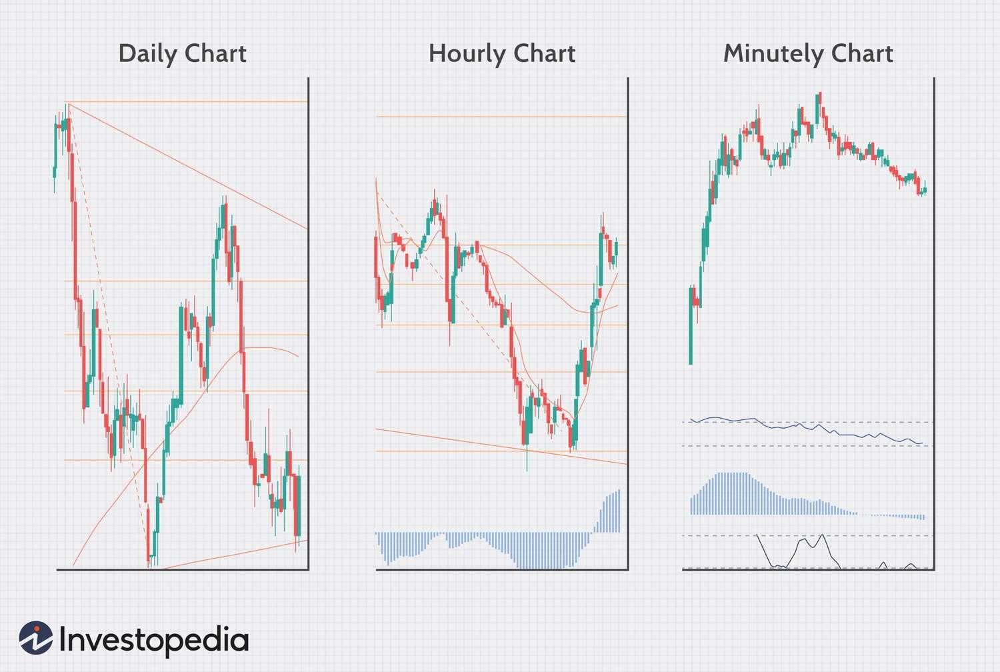

## Table of Contents

## What is Forex trading and why should someone consider it?

Forex trading, short for foreign exchange trading, is the act of buying and selling different currencies to make a profit. It happens in a global market where people trade currencies from different countries. The goal is to buy a currency when it's cheap and sell it when it's more expensive, or vice versa. For example, if you think the US dollar will get stronger compared to the Euro, you might buy dollars with Euros and then sell the dollars later for more Euros.

Someone might consider Forex trading for a few reasons. First, it's one of the biggest financial markets in the world, so there's always a lot of activity and opportunities to make money. Second, it's available 24 hours a day during the week, which means you can trade whenever it suits you, not just during certain hours. Lastly, with the right knowledge and strategy, Forex trading can be a way to diversify your investments and potentially earn extra income. However, it's important to remember that it also comes with risks, so it's not something to jump into without learning about it first.

## How does one start trading Forex as a beginner?

To start trading Forex as a beginner, the first step is to learn the basics. Forex trading involves understanding how currencies move against each other and why. You can find many free resources online, like articles, videos, and beginner's courses that explain these concepts. It's important to spend some time learning about terms like 'pip', 'lot', and 'leverage', as well as basic strategies. Once you feel comfortable with the basics, the next step is to practice. Many trading platforms offer demo accounts where you can trade with fake money. This is a great way to get a feel for the market without risking any real money.

After you've practiced and feel ready, you can open a live trading account with a Forex broker. When choosing a broker, look for one that is regulated and has good reviews. They will ask you to deposit some money into your account, which you'll use to trade. Start with a small amount that you can afford to lose, as there's always a risk involved in trading. Once your account is set up, you can start making real trades. It's wise to begin with small trades and gradually increase your investment as you gain more experience and confidence. Remember, Forex trading can be profitable, but it requires patience and continuous learning.

## What are the basic terms and concepts a beginner should know in Forex trading?

In Forex trading, a few basic terms and concepts are important to understand. A 'pip' is the smallest price move that a currency pair can make. It's usually 0.0001 for most currency pairs, but it can be different for some. A 'lot' is the standard size of a trade, and it's usually 100,000 units of the base currency. 'Leverage' is borrowing money from your broker to trade larger amounts than you could with just your own money. It can increase your profits, but it also increases your risk. The 'bid' price is what you get when you sell a currency pair, and the 'ask' price is what you pay when you buy a currency pair. The difference between these two prices is called the 'spread', and it's how brokers make money.

Another important concept is 'currency pair', which is how currencies are traded in Forex. For example, if you're trading the EUR/USD pair, you're buying Euros and selling US dollars, or vice versa. The first currency in the pair is called the 'base currency', and the second is the 'quote currency'. The 'exchange rate' tells you how much of the quote currency you need to buy one unit of the base currency. 'Technical analysis' and 'fundamental analysis' are two ways traders try to predict where currency prices are going. Technical analysis looks at past price movements and patterns, while fundamental analysis looks at economic news and events that might affect currency values. Understanding these terms and concepts will help you make better trading decisions.

## What are the most common Forex trading strategies for beginners?

One common Forex trading strategy for beginners is the 'trend following' strategy. This means you try to find out which way the market is moving and then trade in that direction. You can use tools like moving averages to help you see the trend. If the price is going up, you buy the currency pair, hoping it will keep going up so you can sell it later for a profit. If the price is going down, you sell the currency pair, hoping to buy it back later at a lower price. This strategy is simple and can be good for beginners because it's easy to understand and follow.

Another strategy beginners might use is 'range trading'. This is when you look for times when the price of a currency pair stays between two levels, called support and resistance. You buy the currency pair when it's near the support level, thinking it will go back up to the resistance level. Then, you sell it when it gets close to the resistance level, expecting it to fall back to the support level. This strategy can be good for beginners because it's about waiting for the right moment to trade, which can be less stressful than trying to predict big market moves.

A third strategy that can be useful for beginners is 'breakout trading'. This involves watching for times when the price of a currency pair moves out of its usual range. If the price breaks above the resistance level, you might buy the pair, expecting the price to keep going up. If it breaks below the support level, you might sell the pair, expecting the price to keep going down. This strategy can be exciting because it's about catching big moves, but it also needs careful watching of the market to work well.

## How important is risk management in Forex trading and what are some basic techniques?

Risk management is very important in Forex trading. It helps you protect your money and keep trading even if you have some losses. Without good risk management, you could lose all your money quickly. In Forex trading, the market can change fast, and it's hard to predict everything. That's why you need to be careful and plan how much you can lose on each trade. Good risk management means you can keep trading for a long time, even if some trades don't go your way.

Some basic risk management techniques include setting stop-loss orders and only risking a small part of your money on each trade. A stop-loss order is like a safety net that automatically closes your trade if the price moves against you too much. This helps limit your losses. Another technique is to never risk more than 1-2% of your total trading money on any single trade. This way, even if you have a few losing trades in a row, you won't lose too much. It's also important to use leverage carefully because it can make your wins bigger, but it can also make your losses bigger. By using these simple techniques, you can trade more safely and have a better chance of success in the long run.

## What tools and resources are essential for a beginner Forex trader?

For a beginner Forex trader, having the right tools and resources is really important. A good trading platform is essential because it's where you'll do all your trading. Look for one that's easy to use and has a demo account where you can practice trading without using real money. A charting tool is also very helpful because it lets you see the price movements of currency pairs. This can help you make better trading decisions. Another useful tool is an economic calendar, which tells you about important news and events that might affect the Forex market.

Besides tools, there are many resources that can help you learn and improve. Online courses and tutorials are great for beginners because they explain the basics of Forex trading in a simple way. Books on Forex trading can also be very helpful, especially if they focus on strategies and risk management. Joining a trading community or forum can give you a place to ask questions and learn from more experienced traders. Finally, keeping up with financial news through websites or apps can help you stay informed about what's happening in the market.

## How can intermediate traders analyze the Forex market more effectively?

Intermediate traders can analyze the Forex market more effectively by using both technical and fundamental analysis. Technical analysis involves looking at charts and using tools like moving averages, trend lines, and indicators such as the Relative Strength Index (RSI) and Moving Average Convergence Divergence (MACD). These tools help traders spot patterns and trends in the market, making it easier to predict where prices might go next. By understanding these patterns, intermediate traders can make more informed decisions about when to enter or exit trades. It's also important to use multiple time frames, like daily, hourly, and 15-minute charts, to get a better overall view of the market.

Fundamental analysis is another key way for intermediate traders to understand the Forex market. This means looking at economic indicators, news events, and other factors that can affect currency values. Things like interest rates, employment data, and GDP growth can have a big impact on currencies. By keeping an eye on these factors, traders can anticipate how currencies might move in response to new information. Combining both technical and fundamental analysis gives intermediate traders a more complete picture of the market, helping them make smarter trading decisions and manage their risks better.

## What advanced trading strategies can an intermediate trader employ to improve their performance?

An intermediate trader can use a strategy called 'scalping' to improve their performance. Scalping is about making lots of small trades to make a profit from small price changes. It's fast-paced and needs a lot of focus. Traders who use scalping often look at short time frames, like 1 or 5 minutes, to find quick opportunities. They need to be good at reading the market quickly and making decisions fast. This strategy can be good for intermediate traders because it lets them practice a lot and get better at understanding market movements.

Another advanced strategy is 'carry trading'. This involves borrowing money in a currency with a low interest rate and using that money to buy a currency with a higher interest rate. The goal is to earn the difference in interest rates, which is called the 'carry'. This strategy works best in a stable market because big changes in currency values can wipe out the interest earned. Intermediate traders need to keep an eye on economic news and events that might affect currency values. Carry trading can be a good way to make money over time, but it needs careful planning and watching the market closely.

## How can one transition from an intermediate to an expert level in Forex trading?

To transition from an intermediate to an expert level in Forex trading, it's important to keep learning and practicing. Expert traders have a deep understanding of the market, and they know how to use both technical and fundamental analysis well. They spend a lot of time studying charts, economic news, and other factors that affect currency values. They also try out different trading strategies and see what works best for them. To become an expert, you need to be patient and willing to learn from your mistakes. It's also helpful to keep a trading journal where you write down what you did and what happened, so you can see what you can do better next time.

Another key part of becoming an expert trader is managing risk well. Expert traders know how to protect their money and make sure they can keep trading even if they have some losses. They use tools like stop-loss orders and only risk a small part of their money on each trade. They also use leverage carefully because it can make their wins bigger, but it can also make their losses bigger. By using these techniques, expert traders can trade more safely and have a better chance of success in the long run. Becoming an expert takes time and effort, but with the right approach, anyone can get there.

## What psychological factors should expert traders manage to maintain success in Forex trading?

Expert traders need to manage their emotions well to keep doing well in Forex trading. One big emotion to watch out for is greed. It can make traders take too many risks or keep a trade open too long, hoping for more profit. Fear is another emotion that can hurt trading. It might make traders close a good trade too early or not take a good trading chance because they're scared of losing money. To deal with these feelings, expert traders often use rules and plans for their trading. This helps them stick to what they know works, instead of letting their emotions take over.

Another important psychological factor is discipline. Expert traders need to follow their trading plans and not let their feelings change their decisions. This means sticking to their strategy, even when the market is moving a lot or when they're feeling unsure. They also need to be patient and wait for the right trading opportunities, instead of trying to trade all the time. By keeping their emotions in check and staying disciplined, expert traders can make better decisions and have a better chance of success in Forex trading.

## How can expert traders use algorithmic trading to enhance their Forex trading?

Expert traders can use algorithmic trading to make their Forex trading better by using computer programs to do trades automatically. These programs follow rules set by the trader, so they can trade faster and more often than a person could. This can help find small price changes that might be hard for a person to see. It also takes away some of the emotion from trading, which can help traders stick to their plans and not make quick decisions based on feelings.

Using algorithmic trading can also help expert traders test their trading ideas without risking real money. They can use past data to see how their trading rules would have worked before. This can help them improve their strategies and find what works best. But, it's important for traders to keep watching their algorithms and make changes when the market changes, because what worked before might not work the same way in the future.

## What are the latest trends and future predictions in Forex trading that experts should be aware of?

In Forex trading, one of the latest trends is the growing use of artificial intelligence (AI) and machine learning. These technologies help traders make better predictions about how the market will move. They can look at a lot of data very quickly and find patterns that might be hard for people to see. More and more trading platforms are using AI to give traders tools that can help them make smarter decisions. Another trend is the rise of social trading, where traders can copy the trades of others who are doing well. This can be a good way for less experienced traders to learn from experts and improve their own trading.

Looking to the future, experts think that Forex trading will keep getting more automated. This means more use of algorithms and robots to do trades. As technology gets better, these tools will become even more powerful and easier to use. Another prediction is that regulation in Forex trading will become stricter. This is to make sure the market is fair and safe for everyone. Traders will need to keep up with these changes and make sure they're following the rules. Overall, the future of Forex trading looks like it will be more high-tech and more regulated, which could make it both easier and safer for traders.

## What is Risk Management in Forex and Algo Trading?

Risk management is a cornerstone of any successful Forex trading strategy, acting as a safeguard to minimize potential losses while maximizing gains. The volatile nature of the Forex market necessitates robust risk management techniques to protect against unforeseen market movements.

**Importance of Risk Management**

In Forex trading, the leverage offered can amplify both profits and losses, making it essential to control risk diligently. Effective risk management ensures that a trader's capital is preserved against adverse market fluctuations, thereby sustaining trading potential over the long term. Without proper risk management, even a successful trading strategy can lead to significant financial loss.

**Techniques and Tools for Risk Assessment and Mitigation**

Forex traders employ various techniques to manage risk, including:

- **Stop-Loss Orders**: Automated orders that close a trade once a predetermined price level is reached, limiting potential losses. This is crucial in preventing small losses from escalating.

- **Position Sizing**: Determines how much capital to invest in a trade, based on the trader’s risk tolerance. Using the formula:
$$
  \text{Position Size} = \frac{\text{Account Risk} \times \text{Account Equity}}{\text{Pip Risk}}

$$

  where Account Risk is the percentage of capital willing to be risked, Account Equity is the total account balance, and Pip Risk is the risk in pips for the trade.

- **Diversification**: Spreading investments across various currency pairs to reduce exposure to a single market.

- **Risk-Reward Ratio**: Setting targets for trades where potential reward outweighs potential risk, typically with a ratio such as 2:1 or 3:1.

**Integration of Risk Management into Algorithmic Trading Systems**

Algorithmic trading in Forex allows for the systematic application of risk management strategies. Bots can be programmed with specific risk parameters to ensure consistency and discipline in executing trades. This includes:

- **Automated Stop-Loss and Take-Profit Levels**: Ensuring trades are closed automatically when certain profit targets or loss thresholds are met.

- **Dynamic Position Sizing**: Algorithms can adjust the size of positions based on current market conditions and volatility, employing frameworks like the Kelly Criterion to calculate optimal investment portions.

**Examples of Risk Management Strategies in Forex**

Specific strategies can be employed to mitigate risk, such as:

- **Hedging**: Engaging in offsetting trades to protect against adverse price movements.

- **Volatility-Based Adjustments**: Modifying trading activity based on market volatility metrics, such as the Average True Range (ATR), which can be used to set more accurate stop levels.

**Balancing Risk and Reward**

Achieving long-term trading success involves a careful balance of risk and reward. Traders must continually assess the effectiveness of their risk management strategies and adjust them in response to changing market conditions. This involves regularly backtesting trading strategies with historical data to ensure reliability in various market scenarios. 

By maintaining discipline and consistently applying sound risk management principles, traders can enhance their resilience to market fluctuations, thereby enabling sustained trading growth and profitability.

## References & Further Reading

[1]: Bergstra, J., Bardenet, R., Bengio, Y., & Kégl, B. (2011). ["Algorithms for Hyper-Parameter Optimization."](https://papers.nips.cc/paper/4443-algorithms-for-hyper-parameter-optimization) Advances in Neural Information Processing Systems 24.

[2]: ["Advances in Financial Machine Learning"](https://www.amazon.com/Advances-Financial-Machine-Learning-Marcos/dp/1119482089) by Marcos Lopez de Prado

[3]: ["Evidence-Based Technical Analysis: Applying the Scientific Method and Statistical Inference to Trading Signals"](https://www.amazon.com/Evidence-Based-Technical-Analysis-Scientific-Statistical/dp/0470008741) by David Aronson

[4]: ["Machine Learning for Algorithmic Trading"](https://github.com/stefan-jansen/machine-learning-for-trading) by Stefan Jansen

[5]: ["Quantitative Trading: How to Build Your Own Algorithmic Trading Business"](https://www.amazon.com/Quantitative-Trading-Build-Algorithmic-Business/dp/1119800064) by Ernest P. Chan